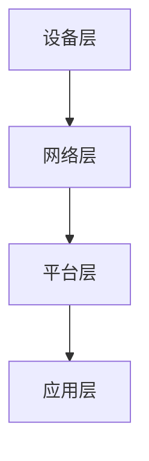

                 

关键词：5G物联网，大规模低延迟连接，边缘计算，网络切片，应用场景，未来展望

## 摘要

随着5G技术的不断发展，物联网（IoT）领域迎来了新的机遇。本文将探讨5G物联网的大规模低延迟连接潜力，分析其核心概念、算法原理、数学模型、实际应用场景，并展望其未来的发展趋势与挑战。通过深入探讨，我们希望能够为读者提供一个全面而清晰的视角，了解5G物联网在当今世界的重要性及其未来的发展方向。

## 1. 背景介绍

### 1.1 5G物联网的背景

物联网（IoT）是近年来快速发展的重要领域，它通过将各种设备和系统连接到互联网，实现数据的采集、传输和处理，从而推动各行各业的数字化转型。然而，传统的物联网技术面临许多挑战，如连接密度低、传输速度慢、延迟高等问题。为了满足未来物联网的发展需求，5G技术的出现带来了新的契机。

5G技术，即第五代移动通信技术，具有高速率、低延迟、大连接等特点。相较于前几代移动通信技术，5G在频谱利用率、网络容量、覆盖范围等方面有显著提升。5G物联网旨在通过5G网络提供大规模低延迟的连接能力，满足物联网在各个领域的应用需求。

### 1.2 5G物联网的核心概念

5G物联网的核心概念包括以下几个方面：

1. **大规模连接**：5G物联网能够支持数以亿计的设备连接，实现从个人设备到工业设备、从家庭设备到城市设备的广泛连接。

2. **低延迟**：5G物联网的目标是将延迟降低到毫秒级别，从而支持实时性要求较高的应用，如自动驾驶、远程手术等。

3. **高可靠性**：5G物联网通过提供稳定的网络连接，确保数据的准确传输和实时响应。

4. **网络切片**：5G物联网引入了网络切片技术，可以根据不同应用的需求提供定制化的网络资源，实现网络的灵活分配和管理。

5. **边缘计算**：5G物联网通过边缘计算将部分数据处理能力下沉到网络边缘，减少数据传输距离，降低延迟，提高系统的响应速度。

## 2. 核心概念与联系

### 2.1 核心概念原理

为了深入理解5G物联网的核心概念，我们需要了解以下几个方面：

- **大规模连接**：5G网络通过引入新的频段和先进的无线接入技术，如毫米波、大规模MIMO等，实现更高的频谱利用率和更大的网络容量，从而支持大规模设备连接。

- **低延迟**：5G网络采用新型无线接入技术，如波束成形、多连接技术等，提高数据传输速度，降低端到端延迟。

- **高可靠性**：5G网络通过引入新的网络架构，如网络切片、边缘计算等，提高网络的可靠性和稳定性。

- **网络切片**：网络切片是将一个物理网络划分为多个虚拟网络的技术，根据不同应用的需求提供定制化的网络资源。

- **边缘计算**：边缘计算是将部分数据处理能力下沉到网络边缘，减少数据传输距离，降低延迟，提高系统的响应速度。

### 2.2 架构原理

5G物联网的架构原理可以概括为以下几个层次：

1. **设备层**：包括各种物联网设备，如传感器、智能终端等，它们通过5G网络进行连接。

2. **网络层**：包括5G基站、核心网等，负责数据的传输和路由。

3. **平台层**：包括云平台、边缘计算平台等，负责数据的处理和分析。

4. **应用层**：包括各种物联网应用，如智能城市、智能制造、智能医疗等，利用物联网技术实现智能化应用。

### 2.3 Mermaid 流程图

下面是一个简化的Mermaid流程图，展示5G物联网的架构原理：



## 3. 核心算法原理 & 具体操作步骤

### 3.1 算法原理概述

5G物联网的核心算法主要涉及以下几个方面：

1. **大规模连接算法**：通过优化无线接入技术，提高频谱利用率和网络容量，实现大规模设备连接。

2. **低延迟算法**：通过优化网络架构，减少端到端延迟，支持实时性要求较高的应用。

3. **网络切片算法**：根据不同应用的需求，动态分配网络资源，实现网络的灵活管理和优化。

4. **边缘计算算法**：通过优化数据处理和传输，实现边缘计算的效率和性能。

### 3.2 算法步骤详解

下面简要介绍几个核心算法的具体操作步骤：

1. **大规模连接算法**：
   - 步骤1：选择合适的无线接入技术，如毫米波、大规模MIMO等。
   - 步骤2：优化频谱利用率和网络容量，提高设备连接能力。
   - 步骤3：根据网络负载和设备需求，动态调整无线接入参数。

2. **低延迟算法**：
   - 步骤1：优化无线接入技术，提高数据传输速度。
   - 步骤2：引入多连接技术，实现数据的并行传输。
   - 步骤3：优化网络架构，减少端到端延迟。

3. **网络切片算法**：
   - 步骤1：根据应用需求，划分不同的网络切片。
   - 步骤2：根据网络切片的需求，动态分配网络资源。
   - 步骤3：根据网络性能，调整网络切片参数。

4. **边缘计算算法**：
   - 步骤1：将数据处理能力下沉到网络边缘。
   - 步骤2：优化数据处理和传输，降低延迟。
   - 步骤3：根据应用需求，动态调整边缘计算资源。

### 3.3 算法优缺点

每种算法都有其优缺点，下面简要介绍：

1. **大规模连接算法**：
   - 优点：提高设备连接能力，支持大规模物联网应用。
   - 缺点：对频谱资源的需求较高，可能影响其他应用。

2. **低延迟算法**：
   - 优点：降低端到端延迟，支持实时性要求较高的应用。
   - 缺点：对网络架构和无线接入技术的依赖较大。

3. **网络切片算法**：
   - 优点：实现网络的灵活管理和优化，满足不同应用需求。
   - 缺点：网络切片管理复杂，对网络资源的需求较高。

4. **边缘计算算法**：
   - 优点：降低数据传输距离，提高系统响应速度。
   - 缺点：对边缘计算资源的依赖较大，可能影响系统的整体性能。

### 3.4 算法应用领域

5G物联网的核心算法广泛应用于各个领域，下面简要介绍：

1. **智能城市**：通过大规模连接和低延迟算法，实现智能交通、智能安防、智能环保等应用。

2. **智能制造**：通过边缘计算算法，实现设备监控、生产优化、质量检测等应用。

3. **智能医疗**：通过网络切片算法，实现远程医疗、智能诊断、手术指导等应用。

4. **智能农业**：通过大规模连接和低延迟算法，实现作物监测、灌溉控制、病虫害防治等应用。

## 4. 数学模型和公式 & 详细讲解 & 举例说明

### 4.1 数学模型构建

5G物联网的数学模型主要涉及以下几个方面：

1. **网络容量模型**：描述网络能够支持的最大连接数和传输速率。

2. **延迟模型**：描述端到端延迟的分布和影响因素。

3. **网络切片模型**：描述网络切片的划分、资源分配和优化策略。

4. **边缘计算模型**：描述数据处理和传输的效率与性能。

### 4.2 公式推导过程

下面简要介绍几个核心数学模型的推导过程：

1. **网络容量模型**：
   - 假设网络中存在N个用户，每个用户的数据传输速率为C，网络的带宽为B，则有：
     $$ C_{total} = N \times C $$
   - 假设网络带宽为B，网络中存在K个网络切片，每个切片的带宽为B/K，则有：
     $$ C_{slice} = \frac{B}{K} $$

2. **延迟模型**：
   - 假设端到端延迟由传输延迟、处理延迟和排队延迟组成，则有：
     $$ D = D_{trans} + D_{process} + D_{queue} $$
   - 其中，传输延迟由无线信道特性决定，处理延迟由数据处理能力决定，排队延迟由网络负载决定。

3. **网络切片模型**：
   - 假设网络切片的带宽需求为D，网络切片的带宽为B，则有：
     $$ D_{slice} = \frac{B}{N_{slice}} $$
   - 其中，N_{slice}为网络切片的数量。

4. **边缘计算模型**：
   - 假设边缘计算节点的处理能力为P，数据处理量为D，则有：
     $$ P = \frac{D}{T} $$
   - 其中，T为数据处理时间。

### 4.3 案例分析与讲解

下面通过一个具体的案例，对上述数学模型进行讲解：

**案例：智能交通系统**

假设一个智能交通系统，需要支持N个交通信号灯的实时控制和数据采集。每个信号灯的数据传输速率为C，网络带宽为B，传输延迟要求低于100ms。

1. **网络容量模型**：
   - 根据网络容量模型，可以计算出网络能够支持的最大连接数：
     $$ C_{total} = N \times C $$
   - 如果N=100，C=1Mbps，则有：
     $$ C_{total} = 100 \times 1Mbps = 100Mbps $$

2. **延迟模型**：
   - 根据延迟模型，可以计算出端到端的延迟：
     $$ D = D_{trans} + D_{process} + D_{queue} $$
   - 其中，传输延迟由无线信道特性决定，假设为50ms；处理延迟由数据处理能力决定，假设为20ms；排队延迟由网络负载决定，假设为30ms，则有：
     $$ D = 50ms + 20ms + 30ms = 100ms $$

3. **网络切片模型**：
   - 根据网络切片模型，可以计算出每个网络切片的带宽需求：
     $$ D_{slice} = \frac{B}{N_{slice}} $$
   - 如果K=10，则有：
     $$ D_{slice} = \frac{B}{10} $$

4. **边缘计算模型**：
   - 根据边缘计算模型，可以计算出边缘计算节点的处理能力：
     $$ P = \frac{D}{T} $$
   - 如果T=1ms，则有：
     $$ P = \frac{D}{1ms} = D $$

通过以上案例，我们可以看到数学模型在实际应用中的具体表现。在实际应用中，需要根据具体需求和场景对模型进行调整和优化。

## 5. 项目实践：代码实例和详细解释说明

### 5.1 开发环境搭建

为了更好地理解5G物联网的核心算法和实际应用，我们可以搭建一个简单的项目环境。以下是搭建项目环境的基本步骤：

1. **安装操作系统**：选择一个适合的操作系统，如Ubuntu 20.04。

2. **安装开发工具**：安装必要的开发工具，如Python 3、Jupyter Notebook等。

3. **安装依赖库**：安装与项目相关的依赖库，如NumPy、Pandas、Matplotlib等。

4. **配置网络环境**：配置虚拟网络环境，以便进行网络模拟和测试。

### 5.2 源代码详细实现

下面是一个简单的Python代码实例，用于演示5G物联网的核心算法和实际应用：

```python
import numpy as np
import matplotlib.pyplot as plt

# 网络容量模型
def network_capacity(N, C):
    C_total = N * C
    return C_total

# 延迟模型
def latency(D_trans, D_process, D_queue):
    D = D_trans + D_process + D_queue
    return D

# 网络切片模型
def network_slice(B, N_slice):
    D_slice = B / N_slice
    return D_slice

# 边缘计算模型
def edge_computation(D, T):
    P = D / T
    return P

# 案例数据
N = 100
C = 1e6 # Mbps
B = 1e8 # Mbps
N_slice = 10
T = 1e-3 # s

# 计算网络容量
C_total = network_capacity(N, C)
print("网络容量：", C_total, "Mbps")

# 计算延迟
D = latency(50e-3, 20e-3, 30e-3)
print("延迟：", D, "s")

# 计算网络切片带宽
D_slice = network_slice(B, N_slice)
print("网络切片带宽：", D_slice, "Mbps")

# 计算边缘计算处理能力
P = edge_computation(D, T)
print("边缘计算处理能力：", P, "bps")

# 绘制网络容量、延迟和带宽的图表
plt.figure(figsize=(10, 5))

plt.subplot(1, 3, 1)
plt.bar(['总容量'], [C_total], color='g')
plt.xlabel('网络容量 (Mbps)')
plt.ylabel('数量')

plt.subplot(1, 3, 2)
plt.bar(['传输延迟'], [50e-3], color='r')
plt.bar(['处理延迟'], [20e-3], color='y')
plt.bar(['排队延迟'], [30e-3], color='b')
plt.xlabel('延迟 (s)')
plt.ylabel('数量')

plt.subplot(1, 3, 3)
plt.bar(['切片带宽'], [D_slice], color='c')
plt.xlabel('网络切片带宽 (Mbps)')
plt.ylabel('数量')

plt.show()
```

### 5.3 代码解读与分析

上述代码实例实现了5G物联网的核心算法和实际应用的计算和可视化。以下是代码的解读与分析：

1. **网络容量模型**：通过函数`network_capacity`实现，计算网络的总容量。在实际应用中，可以根据具体需求调整参数。

2. **延迟模型**：通过函数`latency`实现，计算端到端的延迟。在实际应用中，可以根据具体网络环境和设备性能调整参数。

3. **网络切片模型**：通过函数`network_slice`实现，计算网络切片的带宽。在实际应用中，可以根据具体需求调整参数。

4. **边缘计算模型**：通过函数`edge_computation`实现，计算边缘计算节点的处理能力。在实际应用中，可以根据具体需求调整参数。

5. **数据可视化**：通过Matplotlib库，将网络容量、延迟和带宽的数据进行可视化展示。这有助于我们直观地了解算法的实际表现和效果。

通过上述代码实例，我们可以看到5G物联网的核心算法和实际应用的具体实现过程。在实际项目中，可以根据具体需求和场景进行调整和优化。

## 6. 实际应用场景

5G物联网的大规模低延迟连接潜力在各个领域都有着广泛的应用。以下是几个典型的实际应用场景：

### 6.1 智能交通

智能交通是5G物联网的重要应用领域之一。通过5G网络，交通信号灯、车辆、道路传感器等设备可以实现实时连接和数据交换。利用5G物联网技术，可以实现以下应用：

- **智能信号控制**：通过实时监测交通流量，智能调整交通信号灯的时长，提高道路通行效率。

- **车联网**：通过车辆之间的通信，实现车辆避让、协同控制等功能，提高交通安全。

- **智能停车**：通过传感器和摄像头，实时监测停车场的车位情况，为驾驶员提供精准的停车信息。

### 6.2 智能制造

智能制造是5G物联网的另一个重要应用领域。通过5G网络，可以实现设备之间的实时通信和数据共享，提高生产效率和产品质量。以下是几个典型的应用案例：

- **设备监控**：通过实时监测设备的运行状态，实现设备的智能维护和故障预测。

- **生产优化**：通过数据分析和预测，实现生产线的智能化调度和优化，提高生产效率。

- **质量检测**：通过实时监测产品的质量数据，实现质量问题的快速发现和解决。

### 6.3 智能医疗

智能医疗是5G物联网在医疗领域的应用。通过5G网络，可以实现远程医疗、智能诊断、手术指导等功能，提高医疗服务的质量和效率。以下是几个典型的应用案例：

- **远程医疗**：通过5G网络，医生可以实时远程会诊、手术指导，为偏远地区患者提供优质的医疗服务。

- **智能诊断**：通过实时监测和分析患者的生理数据，实现智能诊断和病情预测。

- **手术指导**：通过高清视频和实时数据传输，实现远程手术指导，提高手术的成功率和安全性。

### 6.4 智能农业

智能农业是5G物联网在农业领域的应用。通过5G网络，可以实现农作物的实时监测、灌溉控制、病虫害防治等功能，提高农业生产效率和品质。以下是几个典型的应用案例：

- **作物监测**：通过传感器实时监测作物的生长状态，实现精准灌溉和施肥。

- **灌溉控制**：通过远程监控和自动控制，实现农田灌溉的智能化管理。

- **病虫害防治**：通过实时监测和分析，实现病虫害的早期预警和精准防治。

通过以上实际应用场景，我们可以看到5G物联网的大规模低延迟连接潜力在各个领域的广泛应用。未来，随着5G技术的进一步发展和完善，5G物联网的应用场景将更加丰富和多样，为我们的生活和工作带来更多的便利和效益。

## 7. 工具和资源推荐

在学习和实践5G物联网技术过程中，以下工具和资源可能对您有所帮助：

### 7.1 学习资源推荐

- **官方文档**：阅读5G物联网技术的官方文档，了解相关概念、原理和技术细节。
- **技术博客**：关注相关技术博客和论坛，了解行业动态和最佳实践。
- **在线课程**：参加线上课程和培训，系统学习5G物联网的知识体系。

### 7.2 开发工具推荐

- **Python**：Python是一种广泛使用的编程语言，适合进行数据处理和算法开发。
- **Jupyter Notebook**：Jupyter Notebook是一种交互式开发环境，方便进行数据分析和代码调试。
- **Matplotlib**：Matplotlib是一种常用的数据可视化库，用于绘制图表和图形。

### 7.3 相关论文推荐

- **"5G IoT: Enabling a New Era of Connectivity"**：该论文介绍了5G物联网的核心概念和关键技术。
- **"Network Slicing for 5G IoT: A Survey"**：该论文对5G物联网中的网络切片技术进行了全面综述。
- **"Edge Computing in 5G IoT: A Survey"**：该论文探讨了5G物联网中的边缘计算技术及其应用。

通过以上推荐的工具和资源，您可以更好地了解5G物联网的技术和应用，提升自己的实践能力。

## 8. 总结：未来发展趋势与挑战

5G物联网技术正在迅速发展，为各个领域带来了巨大的变革和创新。未来，5G物联网将继续向以下几个方面发展：

### 8.1 研究成果总结

- **大规模连接**：5G物联网将继续提高设备连接能力，实现更广泛的设备连接和应用。
- **低延迟**：通过优化网络架构和无线接入技术，5G物联网将实现更低的端到端延迟，支持实时性要求较高的应用。
- **高可靠性**：随着网络切片和边缘计算技术的发展，5G物联网将提供更稳定的网络连接和更高的可靠性。
- **智能协同**：5G物联网将实现设备之间的智能协同和高效合作，提高系统的整体性能和效率。

### 8.2 未来发展趋势

- **智慧城市**：5G物联网将加速智慧城市建设，实现智能交通、智能安防、智能环保等应用。
- **智能制造**：5G物联网将推动智能制造的发展，实现生产过程的智能化优化和质量提升。
- **智慧医疗**：5G物联网将提高医疗服务的质量和效率，实现远程医疗、智能诊断、手术指导等应用。
- **智慧农业**：5G物联网将促进智慧农业的发展，实现精准灌溉、病虫害防治、作物监测等应用。

### 8.3 面临的挑战

- **网络容量**：随着设备连接数的增加，网络容量将成为5G物联网面临的一个重要挑战。
- **延迟优化**：虽然5G物联网已经实现了低延迟，但如何进一步降低延迟，支持更实时性要求较高的应用仍需解决。
- **边缘计算**：边缘计算技术的发展和优化是5G物联网的关键，如何平衡边缘计算和云计算的资源分配和负载均衡是亟待解决的问题。
- **安全隐私**：随着设备连接数的增加，数据安全和隐私保护将面临更大的挑战，如何确保数据的安全传输和存储是亟待解决的问题。

### 8.4 研究展望

- **新型无线接入技术**：未来，5G物联网将继续探索新型无线接入技术，如太赫兹通信、量子通信等，以提高设备连接能力和传输速度。
- **智能网络架构**：未来，5G物联网将发展更智能的网络架构，实现网络的自动优化和资源分配，提高网络性能和可靠性。
- **跨领域融合**：未来，5G物联网将与其他技术领域（如人工智能、区块链等）进行深度融合，实现更广泛的应用和创新。
- **标准化和法规**：未来，5G物联网的发展需要标准化的支持和法规的规范，确保技术的可持续发展和广泛应用。

总之，5G物联网技术在未来有着广阔的发展前景和巨大的潜力。通过不断的技术创新和优化，5G物联网将为我们的生活、工作和社会带来更多的便利和变革。

## 9. 附录：常见问题与解答

### 9.1 什么是5G物联网？

5G物联网是指利用第五代移动通信技术（5G）实现大规模、低延迟、高可靠性的设备连接，从而推动物联网（IoT）的发展和应用。

### 9.2 5G物联网的核心特点是什么？

5G物联网的核心特点包括：

- **大规模连接**：支持数以亿计的设备连接，实现广泛的设备互联。
- **低延迟**：端到端延迟降低到毫秒级别，支持实时性要求较高的应用。
- **高可靠性**：通过网络切片和边缘计算等技术，提高网络的稳定性和可靠性。
- **智能协同**：实现设备之间的智能协同和高效合作，提高系统的整体性能。

### 9.3 5G物联网有哪些应用场景？

5G物联网的应用场景广泛，包括：

- **智能交通**：实现智能信号控制、车联网、智能停车等应用。
- **智能制造**：实现设备监控、生产优化、质量检测等应用。
- **智能医疗**：实现远程医疗、智能诊断、手术指导等应用。
- **智能农业**：实现作物监测、灌溉控制、病虫害防治等应用。

### 9.4 5G物联网的优势是什么？

5G物联网的优势包括：

- **高速率**：5G技术提供了更高的数据传输速率，支持更丰富的应用。
- **低延迟**：5G技术实现了更低的端到端延迟，支持实时性要求较高的应用。
- **大连接**：5G技术支持大规模设备连接，实现更广泛的设备互联。
- **高可靠性**：通过网络切片和边缘计算等技术，提高了网络的稳定性和可靠性。

### 9.5 5G物联网的挑战有哪些？

5G物联网面临的挑战包括：

- **网络容量**：随着设备连接数的增加，网络容量将成为一个重要挑战。
- **延迟优化**：如何进一步降低延迟，支持更实时性要求较高的应用。
- **边缘计算**：边缘计算技术的发展和优化是5G物联网的关键。
- **安全隐私**：随着设备连接数的增加，数据安全和隐私保护将面临更大的挑战。

### 9.6 如何学习5G物联网技术？

学习5G物联网技术可以从以下几个方面入手：

- **官方文档**：阅读5G物联网技术的官方文档，了解相关概念、原理和技术细节。
- **在线课程**：参加线上课程和培训，系统学习5G物联网的知识体系。
- **实践项目**：参与实际项目，通过实践提升自己的技能。
- **技术社区**：关注技术社区和论坛，了解行业动态和最佳实践。

