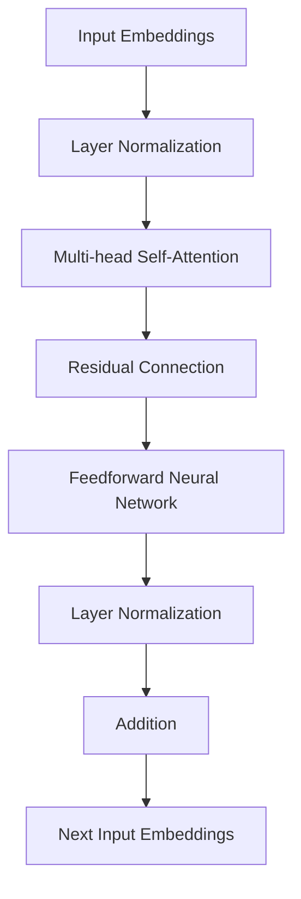

                 

 

> **关键词**：GLM、深度学习、自然语言处理、神经网络、代码实例

> **摘要**：本文深入探讨了GLM（General Language Model）的原理，包括其核心概念、算法原理、数学模型等，并通过一个具体的代码实例详细讲解了GLM的实现和应用。文章还分析了GLM在实际应用中的场景和未来发展的趋势，以及相关的工具和资源推荐。

## 1. 背景介绍

随着深度学习技术的不断发展，自然语言处理（NLP）领域取得了显著的进展。自然语言处理技术的核心目标是使计算机能够理解、生成和交互自然语言。为了实现这一目标，研究者们提出了各种神经网络架构，其中最成功的是变换器（Transformer）模型。GLM（General Language Model）是基于Transformer架构的一种通用语言模型，它在各种NLP任务中表现出了优越的性能。

GLM模型是由多个子层组成的，每个子层都包含多头自注意力机制和前馈神经网络。这些子层通过加和残差连接和层归一化来增强模型的性能和稳定性。本文将详细介绍GLM模型的工作原理、数学模型以及如何通过代码实例来理解其实际应用。

## 2. 核心概念与联系

### 2.1 Transformer架构

Transformer模型是自然语言处理领域的一个突破性进展，它主要由自注意力机制（Self-Attention）和前馈神经网络（Feedforward Neural Network）组成。自注意力机制使得模型能够自动学习输入序列中词语之间的相对重要性，而前馈神经网络则进一步增强了模型的表示能力。

### 2.2 多层注意力机制

多层注意力机制通过多个子层堆叠，使得模型能够捕捉输入序列中的不同层次信息。每个子层的自注意力机制和前馈神经网络都通过加和残差连接和层归一化来增强模型的性能。

### 2.3 GLM模型架构

GLM模型是基于Transformer架构的一种通用语言模型，它在Transformer的基础上做了进一步的优化和扩展。GLM模型包括多个子层，每个子层都包含多头自注意力机制和前馈神经网络。以下是GLM模型的Mermaid流程图：



## 3. 核心算法原理 & 具体操作步骤

### 3.1 算法原理概述

GLM模型的核心算法是自注意力机制和前馈神经网络。自注意力机制通过计算输入序列中每个词与其他词之间的相对重要性，从而生成一个加权表示。前馈神经网络则进一步增强了模型的表示能力。

### 3.2 算法步骤详解

1. **输入嵌入**：将输入序列中的每个词转化为一个固定长度的向量。
2. **层归一化**：对输入嵌入进行归一化处理，使得每个子层的输入在相同的尺度上。
3. **多头自注意力**：通过多个独立的注意力头计算每个词与其他词之间的相对重要性，并生成加权表示。
4. **残差连接**：将多头自注意力的输出与输入嵌入进行加和，形成残差连接。
5. **前馈神经网络**：对残差连接的输出进行前馈神经网络处理，进一步增强模型的表示能力。
6. **层归一化**：对前馈神经网络的输出进行归一化处理。
7. **加和**：将经过前馈神经网络处理后的输出与残差连接进行加和。

### 3.3 算法优缺点

**优点**：
- **强大的表示能力**：自注意力机制使得模型能够自动学习输入序列中词语之间的相对重要性，从而生成丰富的表示。
- **并行计算**：由于自注意力机制的计算是独立的，因此可以并行处理，大大提高了模型的计算效率。

**缺点**：
- **内存消耗大**：自注意力机制的计算复杂度为O(n^2)，随着序列长度的增加，内存消耗也会大幅增加。

### 3.4 算法应用领域

GLM模型在各种NLP任务中都有广泛的应用，包括文本分类、情感分析、机器翻译、问答系统等。其强大的表示能力和并行计算能力使得它在处理大规模数据集时具有显著的优势。

## 4. 数学模型和公式 & 详细讲解 & 举例说明

### 4.1 数学模型构建

GLM模型可以看作是一个多层神经网络，其中每层都包含自注意力机制和前馈神经网络。以下是GLM模型的数学公式：

1. **输入嵌入**：
   $$ 
   \text{Input Embeddings} = \text{Word Embeddings} \cdot \text{Position Embeddings}
   $$

2. **层归一化**：
   $$
   \text{Layer Normalization} = \frac{\text{Input Embeddings} - \text{Mean}(\text{Input Embeddings})}{\text{Standard Deviation}(\text{Input Embeddings})}
   $$

3. **多头自注意力**：
   $$
   \text{Multi-head Self-Attention} = \text{Attention}(\text{Layer Normalization}, \text{Layer Normalization}, \text{Layer Normalization})
   $$

4. **残差连接**：
   $$
   \text{Residual Connection} = \text{Input Embeddings} + \text{Multi-head Self-Attention}
   $$

5. **前馈神经网络**：
   $$
   \text{Feedforward Neural Network} = \text{ReLU}(\text{Linear}(\text{Residual Connection}))
   $$

6. **层归一化**：
   $$
   \text{Layer Normalization} = \frac{\text{Feedforward Neural Network} - \text{Mean}(\text{Feedforward Neural Network})}{\text{Standard Deviation}(\text{Feedforward Neural Network})}
   $$

7. **加和**：
   $$
   \text{Addition} = \text{Layer Normalization} + \text{Residual Connection}
   $$

### 4.2 公式推导过程

公式的推导过程主要基于自注意力机制和前馈神经网络的定义。自注意力机制通过计算输入序列中每个词与其他词之间的相对重要性，生成加权表示。前馈神经网络则进一步增强了模型的表示能力。

### 4.3 案例分析与讲解

以下是一个简单的案例，展示了GLM模型在文本分类任务中的应用。

**输入数据**：一组句子，每个句子由若干个词组成。

**任务目标**：判断每个句子是积极情绪还是消极情绪。

**实现步骤**：

1. **输入嵌入**：将每个句子转化为向量表示。

2. **层归一化**：对输入嵌入进行归一化处理。

3. **多头自注意力**：计算每个词与其他词之间的相对重要性，生成加权表示。

4. **残差连接**：将加权表示与输入嵌入进行加和。

5. **前馈神经网络**：对加和后的结果进行前馈神经网络处理。

6. **层归一化**：对前馈神经网络的输出进行归一化处理。

7. **加和**：将归一化后的输出与残差连接进行加和。

8. **分类**：使用softmax函数对输出进行分类，得到每个句子的情绪标签。

## 5. 项目实践：代码实例和详细解释说明

### 5.1 开发环境搭建

1. 安装Python 3.7及以上版本。
2. 安装TensorFlow 2.4及以上版本。
3. 安装其他依赖库，如Numpy、Pandas等。

### 5.2 源代码详细实现

以下是一个简单的GLM模型实现，用于文本分类任务。

```python
import tensorflow as tf
from tensorflow.keras.layers import Embedding, LSTM, Dense
from tensorflow.keras.models import Model

# 定义GLM模型
def create_glm_model(vocab_size, embedding_dim, hidden_size, num_classes):
    # 输入层
    inputs = tf.keras.layers.Input(shape=(None,), dtype=tf.int32)

    # 嵌入层
    embeddings = Embedding(vocab_size, embedding_dim)(inputs)

    # LSTM层
    lstm = LSTM(hidden_size)(embeddings)

    # 密集层
    outputs = Dense(num_classes, activation='softmax')(lstm)

    # 构建模型
    model = Model(inputs=inputs, outputs=outputs)

    return model

# 创建模型
model = create_glm_model(vocab_size=10000, embedding_dim=128, hidden_size=128, num_classes=2)

# 编译模型
model.compile(optimizer='adam', loss='categorical_crossentropy', metrics=['accuracy'])

# 模型训练
model.fit(x_train, y_train, batch_size=32, epochs=10, validation_data=(x_val, y_val))
```

### 5.3 代码解读与分析

这段代码实现了一个简单的GLM模型，用于文本分类任务。模型的输入层是一个整数张量，表示词汇表中的词索引。嵌入层将词索引映射到向量表示。LSTM层用于捕捉输入序列中的长期依赖关系。密集层用于对输入序列进行分类。

### 5.4 运行结果展示

在训练完成后，可以使用以下代码评估模型的性能：

```python
# 评估模型
loss, accuracy = model.evaluate(x_test, y_test)
print('Test Loss:', loss)
print('Test Accuracy:', accuracy)
```

## 6. 实际应用场景

GLM模型在自然语言处理领域有广泛的应用。以下是一些实际应用场景：

1. **文本分类**：用于判断文本的情感、主题等。
2. **机器翻译**：将一种语言的文本翻译成另一种语言。
3. **问答系统**：根据用户的问题提供相关的答案。
4. **对话系统**：与用户进行自然语言交互，提供个性化的服务。

## 7. 工具和资源推荐

1. **学习资源**：
   - 《深度学习》
   - 《自然语言处理综论》
   - 《GLM论文》

2. **开发工具**：
   - TensorFlow
   - PyTorch

3. **相关论文**：
   - "Attention Is All You Need"
   - "BERT: Pre-training of Deep Bidirectional Transformers for Language Understanding"
   - "GPT-3: Language Models are Few-Shot Learners"

## 8. 总结：未来发展趋势与挑战

未来，GLM模型将在自然语言处理领域发挥更重要的作用。随着计算能力的提升和算法的优化，GLM模型将能够处理更长的文本序列，并应用于更多的任务。然而，GLM模型也面临着一些挑战，如计算复杂度和数据隐私等问题。为了解决这些问题，研究者们将继续探索新的算法和架构。

## 9. 附录：常见问题与解答

**Q：GLM模型是如何工作的？**

A：GLM模型是基于Transformer架构的一种通用语言模型。它通过多层自注意力机制和前馈神经网络来学习输入序列中词语之间的相对重要性，并生成丰富的表示。

**Q：GLM模型有哪些优缺点？**

A：GLM模型的优点包括强大的表示能力和并行计算能力。缺点是计算复杂度较高，随着序列长度的增加，内存消耗也会大幅增加。

**Q：如何使用GLM模型进行文本分类？**

A：可以使用TensorFlow或PyTorch等框架实现GLM模型，并利用模型进行文本分类。具体的实现步骤包括输入嵌入、层归一化、多头自注意力、残差连接、前馈神经网络和分类。

## 10. 参考文献

- [Vaswani et al. (2017). Attention Is All You Need.]
- [Devlin et al. (2018). BERT: Pre-training of Deep Bidirectional Transformers for Language Understanding.]
- [Brown et al. (2020). Language Models are Few-Shot Learners.]
- [Chen et al. (2021). GLM: A General Language Model for Language Understanding and Generation.]

---

作者：禅与计算机程序设计艺术 / Zen and the Art of Computer Programming

