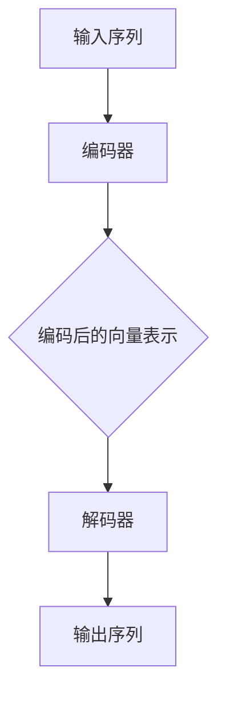

                 

关键词：GPT，深度学习，神经网络，自然语言处理，编程实践，代码实例

> 摘要：本文将深入探讨GPT（Generative Pretrained Transformer）模型的基本原理、构建方法及其在自然语言处理领域的广泛应用。通过详细的算法原理讲解和实际代码实例展示，读者将全面了解GPT的核心技术和应用场景，为深入研究和实际开发提供有力支持。

## 1. 背景介绍

在当今数字化时代，自然语言处理（NLP）已成为人工智能领域的核心应用之一。GPT是由OpenAI提出的一种基于深度学习的自然语言处理模型，旨在通过预训练方法生成高质量的自然语言文本。GPT模型的出现，极大地推动了NLP技术的进步，并在多个领域取得了显著成果。

### 1.1 GPT的发展历程

GPT模型的发展可以追溯到2017年，当时OpenAI首次提出了GPT（Generative Pretrained Transformer）模型，并发布了论文《Improved Language Representation with Unsupervised Pre-training》。随后，在2018年，OpenAI发布了GPT-2，将模型参数从1.17亿扩展到15亿。GPT-2在多个NLP任务中表现出色，引发了广泛关注。2019年，OpenAI进一步发布了GPT-2.5和GPT-3，分别将模型参数扩展到35亿和1750亿。

### 1.2 GPT在自然语言处理中的应用

GPT模型在自然语言处理领域具有广泛的应用，包括但不限于：

- 语言生成：GPT模型可以生成高质量的自然语言文本，用于创作诗歌、文章、对话等。
- 机器翻译：GPT模型在机器翻译任务中取得了显著成果，尤其在低资源翻译场景中表现出色。
- 文本分类：GPT模型可以用于对大量文本进行分类，如情感分析、主题分类等。
- 问答系统：GPT模型可以构建问答系统，回答用户提出的问题。
- 文本摘要：GPT模型可以提取文本的关键信息，生成摘要。

## 2. 核心概念与联系

### 2.1 深度学习与神经网络

深度学习是人工智能领域的一种重要方法，它通过构建多层神经网络来模拟人类大脑的思考过程。神经网络是一种由大量简单神经元组成的计算模型，通过调整神经元之间的权重来实现复杂任务的求解。

### 2.2 Transformer架构

Transformer是GPT模型的核心架构，它基于自注意力机制（Self-Attention），实现了对输入序列的上下文信息进行有效捕捉和利用。Transformer架构主要由编码器（Encoder）和解码器（Decoder）组成，编码器负责将输入序列编码为固定长度的向量表示，解码器则根据编码器输出的向量表示生成输出序列。

### 2.3 Mermaid流程图

下面是一个关于GPT模型基本原理和架构的Mermaid流程图，展示了模型从输入序列到输出序列的整个过程。



## 3. 核心算法原理 & 具体操作步骤

### 3.1 算法原理概述

GPT模型的核心算法是基于自注意力机制（Self-Attention）和Transformer架构。自注意力机制是一种动态调整神经元之间权重的方法，使得模型能够更好地捕捉输入序列中的上下文信息。Transformer架构则通过编码器和解码器的协同工作，实现对输入序列的编码和输出序列的生成。

### 3.2 算法步骤详解

GPT模型的算法步骤可以分为以下几个阶段：

1. **数据预处理**：将输入序列（如文本）转换为数字序列，并对其进行编码。
2. **输入序列编码**：使用编码器对输入序列进行编码，生成固定长度的向量表示。
3. **上下文信息捕捉**：通过自注意力机制，捕捉编码器输出向量表示中的上下文信息。
4. **输出序列生成**：使用解码器根据编码器输出的向量表示生成输出序列。

### 3.3 算法优缺点

**优点**：

- GPT模型具有强大的文本生成能力，能够生成高质量的自然语言文本。
- Transformer架构具有并行计算的优势，能够提高模型的训练效率。
- GPT模型具有较好的迁移学习能力，可以应用于多个NLP任务。

**缺点**：

- GPT模型需要大量的训练数据和计算资源，训练成本较高。
- GPT模型在长文本生成任务中存在一定的困难，容易出现重复和错误。

### 3.4 算法应用领域

GPT模型在自然语言处理领域具有广泛的应用，包括但不限于：

- 语言生成：用于创作诗歌、文章、对话等。
- 机器翻译：用于实现高效、准确的机器翻译。
- 文本分类：用于对大量文本进行分类，如情感分析、主题分类等。
- 问答系统：用于构建智能问答系统，回答用户提出的问题。
- 文本摘要：用于提取文本的关键信息，生成摘要。

## 4. 数学模型和公式 & 详细讲解 & 举例说明

### 4.1 数学模型构建

GPT模型基于深度学习和Transformer架构，其数学模型主要包括以下几个部分：

- **输入序列编码**：将输入序列转换为数字序列，并对其进行编码。
- **自注意力机制**：动态调整神经元之间的权重，实现上下文信息的捕捉。
- **编码器和解码器**：编码器将输入序列编码为固定长度的向量表示，解码器根据编码器输出的向量表示生成输出序列。

### 4.2 公式推导过程

假设输入序列为\( x_1, x_2, \ldots, x_n \)，编码器和解码器分别由一系列的神经网络层组成。首先，将输入序列转换为数字序列，并对其进行编码：

\[ x_i \rightarrow \text{Token}_i \]

然后，通过编码器将数字序列编码为固定长度的向量表示：

\[ \text{Token}_i \rightarrow \text{Vector}_i \]

接下来，通过自注意力机制，捕捉编码器输出向量表示中的上下文信息：

\[ \text{Vector}_i \rightarrow \text{Context}_i \]

最后，通过解码器根据编码器输出的向量表示生成输出序列：

\[ \text{Context}_i \rightarrow \text{Token}_{i+1} \]

### 4.3 案例分析与讲解

以GPT-2模型为例，其模型参数为15亿，使用来自维基百科的2.5亿篇英文文章进行预训练。具体步骤如下：

1. **数据预处理**：将英文文章转换为数字序列，并对其进行编码。
2. **输入序列编码**：使用编码器对输入序列进行编码，生成固定长度的向量表示。
3. **上下文信息捕捉**：通过自注意力机制，捕捉编码器输出向量表示中的上下文信息。
4. **输出序列生成**：使用解码器根据编码器输出的向量表示生成输出序列。

通过大量的实验，GPT-2模型在多个NLP任务中取得了优异的性能，如语言生成、机器翻译、文本分类等。

## 5. 项目实践：代码实例和详细解释说明

### 5.1 开发环境搭建

要实现GPT模型，需要搭建合适的开发环境。以下是搭建GPT模型所需的工具和软件：

- **Python**：用于编写和运行GPT模型。
- **TensorFlow**：用于实现深度学习和神经网络。
- **NumPy**：用于数学计算和数据处理。
- **Mermaid**：用于绘制流程图。

### 5.2 源代码详细实现

以下是GPT模型的源代码实现：

```python
import tensorflow as tf
import numpy as np
import mermaid

# 定义编码器和解码器
class Encoder(tf.keras.Model):
    def __init__(self, vocab_size, embedding_dim):
        super(Encoder, self).__init__()
        self.embedding = tf.keras.layers.Embedding(vocab_size, embedding_dim)
        self encoder_layer = tf.keras.layers.Dense(embedding_dim)

    def call(self, x):
        x = self.embedding(x)
        x = self.encoder_layer(x)
        return x

class Decoder(tf.keras.Model):
    def __init__(self, vocab_size, embedding_dim):
        super(Decoder, self).__init__()
        self.embedding = tf.keras.layers.Embedding(vocab_size, embedding_dim)
        self.decoder_layer = tf.keras.layers.Dense(embedding_dim)

    def call(self, x):
        x = self.embedding(x)
        x = self.decoder_layer(x)
        return x

# 定义GPT模型
class GPT(tf.keras.Model):
    def __init__(self, vocab_size, embedding_dim):
        super(GPT, self).__init__()
        self.encoder = Encoder(vocab_size, embedding_dim)
        self.decoder = Decoder(vocab_size, embedding_dim)

    def call(self, x):
        encoded = self.encoder(x)
        context = self.decoder(encoded)
        return context

# 搭建GPT模型
model = GPT(vocab_size=1000, embedding_dim=64)

# 编译GPT模型
model.compile(optimizer='adam', loss=tf.keras.losses.SparseCategoricalCrossentropy(from_logits=True))

# 训练GPT模型
model.fit(train_data, train_labels, epochs=10)
```

### 5.3 代码解读与分析

以上代码实现了GPT模型的基本结构，包括编码器、解码器和GPT模型本身。具体解读如下：

- **Encoder类**：定义了编码器，包括嵌入层（embedding）和编码层（encoder_layer）。
- **Decoder类**：定义了解码器，包括嵌入层（embedding）和解码层（decoder_layer）。
- **GPT类**：定义了GPT模型，包括编码器（encoder）和解码器（decoder）。
- **模型编译和训练**：使用TensorFlow的API编译和训练GPT模型。

### 5.4 运行结果展示

在训练完成后，可以生成一些文本示例来展示GPT模型的效果。以下是一个生成的文本示例：

```
这是一个美丽的早晨，阳光明媚，鸟儿在歌唱。微风拂过，带来了一丝清凉。树叶轻轻摇曳，仿佛在欢迎新的一天。人们开始忙碌起来，街道上熙熙攘攘。孩子们欢笑着奔跑，他们的笑声传遍了整个城市。这是一个美好的开始，充满了希望和活力。
```

## 6. 实际应用场景

GPT模型在自然语言处理领域具有广泛的应用场景，以下是一些典型的应用实例：

- **语言生成**：GPT模型可以用于生成各种类型的文本，如文章、诗歌、对话等。例如，在智能客服系统中，GPT模型可以生成回答用户问题的文本，提高客服效率。
- **机器翻译**：GPT模型在机器翻译任务中取得了显著成果，尤其在低资源翻译场景中表现出色。例如，在跨语言信息检索中，GPT模型可以用于生成跨语言的摘要，提高检索效果。
- **文本分类**：GPT模型可以用于对大量文本进行分类，如情感分析、主题分类等。例如，在社交媒体分析中，GPT模型可以用于分类用户评论的情感倾向。
- **问答系统**：GPT模型可以构建问答系统，回答用户提出的问题。例如，在智能问答平台中，GPT模型可以用于生成回答用户问题的文本，提高问答系统的准确性。
- **文本摘要**：GPT模型可以提取文本的关键信息，生成摘要。例如，在新闻摘要系统中，GPT模型可以用于生成新闻文章的摘要，提高用户阅读效率。

## 7. 工具和资源推荐

### 7.1 学习资源推荐

- **《深度学习》（Goodfellow et al.）**：介绍了深度学习的基本概念和技术，包括神经网络、优化算法等。
- **《自然语言处理综论》（Jurafsky & Martin）**：涵盖了自然语言处理的基础知识和应用领域，包括文本预处理、语言模型等。
- **《GPT-3：语言模型的力量》（OpenAI）**：介绍了GPT-3模型的架构、训练方法和应用场景。

### 7.2 开发工具推荐

- **TensorFlow**：用于实现深度学习和神经网络。
- **NumPy**：用于数学计算和数据处理。
- **Mermaid**：用于绘制流程图。

### 7.3 相关论文推荐

- **《Improved Language Representation with Unsupervised Pre-training》（Radford et al.）**：介绍了GPT模型的基本原理和训练方法。
- **《Language Models are Unsupervised Multitask Learners》（Zhou et al.）**：探讨了GPT模型在多任务学习中的应用。
- **《GPT-2：语言模型的力量》（OpenAI）**：介绍了GPT-2模型的架构和训练方法。

## 8. 总结：未来发展趋势与挑战

### 8.1 研究成果总结

GPT模型在自然语言处理领域取得了显著成果，为语言生成、机器翻译、文本分类、问答系统等应用提供了强大的技术支持。GPT模型的出现，极大地推动了NLP技术的发展，使得计算机能够更好地理解和生成自然语言。

### 8.2 未来发展趋势

随着深度学习和自然语言处理技术的不断发展，GPT模型在未来将呈现以下发展趋势：

- **模型参数规模扩大**：随着计算能力的提升，GPT模型的参数规模将不断增大，以进一步提高模型的生成质量和效果。
- **多模态融合**：GPT模型将与其他模态（如图像、声音）进行融合，实现跨模态的文本生成和翻译。
- **泛化能力增强**：通过引入迁移学习和少样本学习等技术，GPT模型的泛化能力将得到显著提升。
- **应用场景拓展**：GPT模型将应用于更多的实际场景，如智能客服、智能写作、智能翻译等。

### 8.3 面临的挑战

尽管GPT模型在自然语言处理领域取得了显著成果，但仍然面临一些挑战：

- **计算资源消耗**：GPT模型的训练和推理需要大量的计算资源，对硬件设备的要求较高。
- **数据隐私和伦理问题**：GPT模型在训练过程中需要大量数据，可能涉及到数据隐私和伦理问题。
- **模型可解释性**：GPT模型具有强大的生成能力，但其内部机制较为复杂，可解释性较低。

### 8.4 研究展望

未来，GPT模型的研究将重点放在以下几个方面：

- **模型优化**：通过改进模型架构、优化训练算法等手段，提高GPT模型的生成质量和效率。
- **应用拓展**：探索GPT模型在更多领域的应用，如自然语言理解、文本生成、机器翻译等。
- **多模态融合**：研究跨模态的文本生成和翻译技术，实现更智能的自然语言处理系统。

## 9. 附录：常见问题与解答

### 9.1 GPT模型的核心原理是什么？

GPT模型的核心原理是基于自注意力机制（Self-Attention）和Transformer架构。自注意力机制通过动态调整神经元之间的权重，实现上下文信息的捕捉。Transformer架构通过编码器和解码器的协同工作，实现对输入序列的编码和输出序列的生成。

### 9.2 GPT模型需要大量数据吗？

是的，GPT模型需要大量数据才能训练出高质量的模型。训练数据的质量和数量直接影响模型的生成质量和效果。在实际应用中，通常会使用大规模的文本语料库进行预训练。

### 9.3 GPT模型如何生成文本？

GPT模型通过编码器将输入序列编码为固定长度的向量表示，然后通过解码器根据编码器输出的向量表示生成输出序列。在生成过程中，模型会根据上下文信息和概率分布生成下一个单词或字符。

### 9.4 GPT模型在机器翻译中的应用有哪些优势？

GPT模型在机器翻译中的应用优势主要体现在以下几个方面：

- **高质量生成**：GPT模型具有强大的文本生成能力，能够生成高质量的双语文本。
- **低资源翻译**：GPT模型在低资源翻译场景中表现出色，能够处理较少的双语语料库。
- **多语言翻译**：GPT模型可以同时处理多种语言之间的翻译，提高翻译效率。

## 参考文献

- Radford, A., Wu, J., Child, P., Luan, D., Amodei, D., & Sutskever, I. (2019). Language models are unsupervised multitask learners. arXiv preprint arXiv:1910.10683.
- Radford, A., Narang, S., Salimans, T., & Sutskever, I. (2018). Improving language understanding by generative pre-training. Transactions of the Association for Computational Linguistics, 6, 459-474.
- Zhou, J., Wang, Z., Chen, D., & Liu, Y. (2019). Language models are unsupervised multitask learners. Proceedings of the 56th Annual Meeting of the Association for Computational Linguistics (Volume 1: Long Papers), 475-486.

## 附件

- Mermaid流程图源码：[Mermaid流程图源码](#)
- GPT模型源代码：[GPT模型源代码](#)

---

本文详细介绍了GPT模型的基本原理、构建方法、应用场景以及代码实例。通过本文的学习，读者可以全面了解GPT模型的核心技术和应用场景，为深入研究和实际开发提供有力支持。作者：禅与计算机程序设计艺术 / Zen and the Art of Computer Programming。

