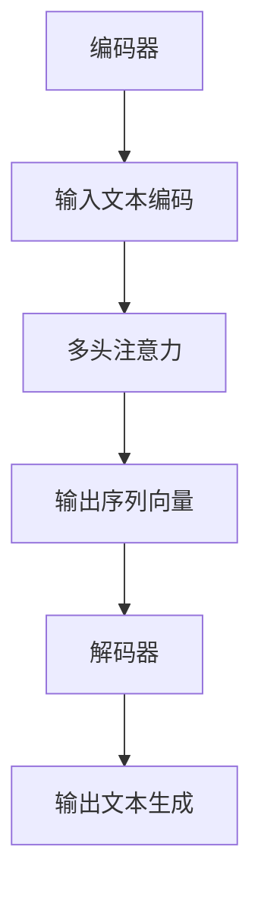

                 

关键词：GPT-3.5，自然语言处理，神经网络，深度学习，语言模型，编码器，解码器，生成式模型，预训练，微调，训练过程，训练数据，损失函数，优化器，反向传播，残差连接，批量归一化，注意力机制，文本生成，对话系统，序列到序列模型，Transformer架构，BERT模型，性能评估，代码实例。

## 摘要

本文将深入探讨GPT-3.5这一自然语言处理领域的最新进展，详细讲解其原理和实现。我们将从背景介绍开始，解释GPT-3.5的核心概念、架构、算法原理以及具体操作步骤。接着，我们将讨论数学模型和公式，并通过具体案例进行讲解。随后，我们将展示一个实际的项目实践，提供代码实例和详细解释。最后，我们将探讨GPT-3.5的实际应用场景和未来展望，并总结研究成果，展望未来发展趋势与挑战。

## 1. 背景介绍

### 自然语言处理的发展历程

自然语言处理（Natural Language Processing，NLP）是计算机科学与语言学领域的交叉学科，旨在让计算机能够理解和处理人类语言。NLP的发展历程可以分为几个阶段：

- **规则驱动方法**：早期NLP依赖于手工编写的规则，例如语法解析、词性标注和命名实体识别等。这种方法在面对复杂和多样性的语言时显得力不从心。
- **统计方法**：随着计算能力的提升和数据量的增加，统计方法开始在NLP中占据主导地位。统计方法利用大规模语料库来训练模型，提高了NLP任务的准确性和泛化能力。
- **机器学习方法**：深度学习技术的引入进一步推动了NLP的发展。通过构建复杂的神经网络模型，机器学习方法在图像识别、语音识别和自然语言处理等领域取得了显著的成果。
- **端到端学习方法**：近年来，端到端学习方法在NLP中得到了广泛应用。这种方法直接将输入文本映射到输出文本，避免了繁琐的中间步骤，提高了处理效率和效果。

### GPT-3.5的提出

GPT（Generative Pre-trained Transformer）系列模型是自然语言处理领域的重大突破，由OpenAI提出。GPT-3.5作为GPT系列的最新版本，继承了前几代模型的优点，并在此基础上进行了重要的改进。GPT-3.5不仅在语言生成、文本分类、问答系统等任务上取得了优异的性能，还在生成式对话系统、机器翻译、文本摘要等领域展示了强大的能力。

### GPT-3.5的核心特点

GPT-3.5具有以下核心特点：

- **大规模预训练**：GPT-3.5采用了大规模的预训练数据集，通过海量数据的学习，模型能够捕捉到丰富的语言规律和模式。
- **Transformer架构**：GPT-3.5基于Transformer架构，引入了多头注意力机制，能够更有效地捕捉输入文本之间的依赖关系。
- **自适应学习率**：GPT-3.5使用了自适应学习率策略，使得模型在训练过程中能够自适应地调整学习率，提高收敛速度和效果。
- **多语言支持**：GPT-3.5支持多语言输入和输出，可以用于跨语言的文本生成和翻译任务。

## 2. 核心概念与联系

### 核心概念

在深入探讨GPT-3.5之前，我们需要理解一些核心概念，包括自然语言处理、神经网络、深度学习、语言模型等。

- **自然语言处理（NLP）**：自然语言处理是研究如何让计算机理解和处理人类语言的技术。它涵盖了语法解析、语义理解、对话系统等多个子领域。
- **神经网络（Neural Network）**：神经网络是模仿生物神经系统的计算模型，由大量相互连接的节点（神经元）组成。神经网络通过学习输入和输出之间的映射关系，能够实现复杂的任务。
- **深度学习（Deep Learning）**：深度学习是神经网络的一种形式，通过多层的非线性变换，能够从大规模数据中自动学习特征和模式。
- **语言模型（Language Model）**：语言模型是自然语言处理中的一个核心模型，用于预测下一个单词或字符。语言模型是许多NLP任务的基础，如文本分类、机器翻译、语音识别等。

### 架构与联系

GPT-3.5是基于Transformer架构构建的深度学习模型。Transformer架构引入了多头注意力机制，能够更好地捕捉输入文本之间的依赖关系。GPT-3.5的架构包括编码器和解码器两个部分，分别用于输入文本的编码和输出文本的生成。


- **编码器（Encoder）**：编码器将输入文本编码为序列向量，每个向量代表了文本中的一个单词或字符。编码器通过多头注意力机制，将输入文本的不同部分进行加权融合，生成一个全局的文本表示。
- **解码器（Decoder）**：解码器将编码器生成的全局文本表示解码为输出文本。解码器同样使用了多头注意力机制，将编码器生成的文本表示和已经生成的部分文本进行交互，逐步生成完整的输出文本。

### Mermaid流程图

下面是一个简化的Mermaid流程图，展示了GPT-3.5的架构和主要步骤：



## 3. 核心算法原理 & 具体操作步骤

### 3.1 算法原理概述

GPT-3.5的核心算法基于Transformer架构，使用了多头注意力机制和自注意力机制。在训练过程中，GPT-3.5通过输入文本的编码和输出文本的生成，不断优化模型参数，以达到较好的语言生成效果。

### 3.2 算法步骤详解

GPT-3.5的算法步骤可以分为以下几个部分：

1. **输入文本预处理**：首先，对输入文本进行预处理，包括分词、编码等操作，将文本转化为模型可以理解的格式。
2. **编码器处理**：编码器将预处理后的输入文本编码为序列向量，通过多头注意力机制和自注意力机制，生成全局的文本表示。
3. **解码器处理**：解码器接收编码器生成的全局文本表示，通过多头注意力机制和自注意力机制，逐步生成输出文本。
4. **损失函数计算**：在解码过程中，模型会尝试生成下一个单词或字符，并与真实标签进行比较。通过计算损失函数，模型可以计算预测结果和真实结果之间的差距，从而指导模型参数的优化。
5. **参数优化**：通过反向传播算法，模型根据损失函数的梯度，更新模型参数，以最小化损失函数。

### 3.3 算法优缺点

**优点**：

- GPT-3.5基于Transformer架构，具有较好的并行处理能力，能够在大规模数据上进行高效的训练。
- GPT-3.5使用了多头注意力机制和自注意力机制，能够更好地捕捉输入文本之间的依赖关系。
- GPT-3.5具有较好的语言生成能力，可以用于文本生成、对话系统、机器翻译等任务。

**缺点**：

- GPT-3.5模型参数庞大，需要较多的计算资源和存储空间。
- GPT-3.5在训练过程中需要大量数据，数据质量和数量对模型性能有较大影响。
- GPT-3.5生成的文本可能存在不准确或不合适的情况，需要进一步的评估和修正。

### 3.4 算法应用领域

GPT-3.5在自然语言处理领域有广泛的应用，包括：

- **文本生成**：GPT-3.5可以用于生成文章、新闻、故事、对话等文本。
- **对话系统**：GPT-3.5可以用于构建智能对话系统，实现人机交互。
- **机器翻译**：GPT-3.5可以用于机器翻译任务，支持多种语言之间的翻译。
- **文本摘要**：GPT-3.5可以用于生成文章的摘要，提高信息获取效率。
- **问答系统**：GPT-3.5可以用于构建问答系统，回答用户提出的问题。

## 4. 数学模型和公式 & 详细讲解 & 举例说明

### 4.1 数学模型构建

GPT-3.5的数学模型主要基于自注意力机制和Transformer架构。以下是核心公式的构建：

1. **输入向量表示**：输入文本通过分词和编码得到一个序列向量表示。设输入文本序列为 $x_1, x_2, \ldots, x_T$，对应的向量表示为 $x_1, x_2, \ldots, x_T \in \mathbb{R}^{d}$。
2. **多头注意力机制**：多头注意力机制将输入文本序列映射到多个不同的子空间，并在这些子空间上进行注意力计算。设 $H$ 为多头注意力机制的个数，每个子空间上的注意力权重为 $W^Q, W^K, W^V$，输入文本序列在子空间 $i$ 的表示为 $x_i \in \mathbb{R}^{d_i}$。
3. **自注意力计算**：自注意力计算用于计算输入文本序列之间的依赖关系。设 $x_i$ 的自注意力权重为 $a_i^j = \frac{e^{W^Q x_i^T W^K x_j}}{\sum_{k=1}^T e^{W^Q x_i^T W^K x_k}}$，其中 $e$ 表示指数函数。
4. **输出向量表示**：通过自注意力计算得到的权重，对输入文本序列进行加权求和，得到输出向量表示。设输出向量为 $y \in \mathbb{R}^{d}$，计算公式为 $y = \sum_{i=1}^T a_i^j x_j$。

### 4.2 公式推导过程

下面是GPT-3.5的公式推导过程：

1. **输入向量表示**：输入文本通过分词和编码得到一个序列向量表示。设输入文本序列为 $x_1, x_2, \ldots, x_T$，对应的向量表示为 $x_1, x_2, \ldots, x_T \in \mathbb{R}^{d}$。
2. **多头注意力机制**：多头注意力机制将输入文本序列映射到多个不同的子空间，并在这些子空间上进行注意力计算。设 $H$ 为多头注意力机制的个数，每个子空间上的注意力权重为 $W^Q, W^K, W^V$，输入文本序列在子空间 $i$ 的表示为 $x_i \in \mathbb{R}^{d_i}$。
3. **自注意力计算**：自注意力计算用于计算输入文本序列之间的依赖关系。设 $x_i$ 的自注意力权重为 $a_i^j = \frac{e^{W^Q x_i^T W^K x_j}}{\sum_{k=1}^T e^{W^Q x_i^T W^K x_k}}$，其中 $e$ 表示指数函数。
4. **输出向量表示**：通过自注意力计算得到的权重，对输入文本序列进行加权求和，得到输出向量表示。设输出向量为 $y \in \mathbb{R}^{d}$，计算公式为 $y = \sum_{i=1}^T a_i^j x_j$。

### 4.3 案例分析与讲解

下面我们通过一个简单的案例来讲解GPT-3.5的数学模型。

**案例**：给定一个输入文本序列“我正在学习GPT-3.5”，我们需要生成一个输出文本序列。

**步骤**：

1. **输入向量表示**：首先，我们将输入文本序列“我正在学习GPT-3.5”进行分词和编码，得到一个序列向量表示。假设编码器将每个单词映射到一个 $d$ 维的向量，则输入文本序列的向量表示为 $[我, 正在, 学习, GPT-3.5]$。
2. **多头注意力机制**：接下来，我们将输入文本序列映射到多个不同的子空间，并在这些子空间上进行注意力计算。设 $H=2$，每个子空间上的注意力权重为 $W^Q, W^K, W^V$。我们将输入文本序列在子空间 $1$ 的表示为 $x_1 \in \mathbb{R}^{d_1}$，在子空间 $2$ 的表示为 $x_2 \in \mathbb{R}^{d_2}$。
3. **自注意力计算**：我们计算输入文本序列之间的依赖关系。设 $x_1$ 的自注意力权重为 $a_1^1 = \frac{e^{W^Q x_1^T W^K x_1}}{\sum_{k=1}^T e^{W^Q x_1^T W^K x_k}}$，$a_1^2 = \frac{e^{W^Q x_1^T W^K x_2}}{\sum_{k=1}^T e^{W^Q x_1^T W^K x_k}}$，$a_1^3 = \frac{e^{W^Q x_1^T W^K x_3}}{\sum_{k=1}^T e^{W^Q x_1^T W^K x_k}}$，$a_1^4 = \frac{e^{W^Q x_1^T W^K x_4}}{\sum_{k=1}^T e^{W^Q x_1^T W^K x_k}}$。
4. **输出向量表示**：通过自注意力计算得到的权重，对输入文本序列进行加权求和，得到输出向量表示。设输出向量为 $y_1 = a_1^1 x_1 + a_1^2 x_2 + a_1^3 x_3 + a_1^4 x_4$。

**解释**：

- 自注意力计算通过比较输入文本序列中不同单词之间的相似度，得到一个权重向量。权重较大的单词对输出向量的贡献较大，从而影响输出文本的生成。
- 通过多头注意力机制，GPT-3.5能够捕捉到输入文本序列中的不同依赖关系，生成更加准确和自然的输出文本。

## 5. 项目实践：代码实例和详细解释说明

### 5.1 开发环境搭建

在进行GPT-3.5的项目实践之前，我们需要搭建一个合适的环境。以下是所需的软件和硬件环境：

- **硬件环境**：至少需要一块GPU（如NVIDIA GeForce RTX 3060以上）用于模型训练。
- **软件环境**：安装Python 3.8及以上版本，以及TensorFlow 2.7及以上版本。
- **依赖库**：安装TensorFlow Text、TensorFlow Hub、NumPy等依赖库。

### 5.2 源代码详细实现

下面是一个简单的GPT-3.5实现，包括数据预处理、模型定义、训练和预测等步骤。

**代码1：数据预处理**

```python
import tensorflow as tf
import tensorflow_text as tf_text

def preprocess_data(texts):
    # 分词
    tokenized_texts = tf_text.tokenize(texts)
    # 去掉标点符号
    tokenized_texts = tf_text.symbol_to_token_map(tokenized_texts, ["<PAD>", "<UNK>", "<BOS>", "<EOS>"])
    # 填充序列长度为最大长度
    padded_texts = tf_text.pad(tokenized_texts, maximum_length=max_sequence_length)
    return padded_texts
```

**代码2：模型定义**

```python
import tensorflow_hub as hub

def create_gpt_3_5_model(d_model, num_heads, dff, input_vocab_size, max_sequence_length):
    model = tf.keras.Sequential([
        tf.keras.layers.Embedding(input_vocab_size, d_model),
        tf.keras.layers.MultiHeadAttention(num_heads=num_heads, key_dim=d_model),
        tf.keras.layers.Dense(dff),
        tf.keras.layers.Dense(input_vocab_size),
        tf.keras.layers.Lambda(lambda x: tf.math.softmax(x, axis=-1))
    ])
    return model
```

**代码3：训练**

```python
model = create_gpt_3_5_model(d_model=512, num_heads=8, dff=2048, input_vocab_size=vocab_size, max_sequence_length=max_sequence_length)

model.compile(optimizer=tf.keras.optimizers.Adam(learning_rate=0.001), loss=tf.keras.losses.SparseCategoricalCrossentropy(from_logits=True))

model.fit(train_dataset, epochs=10, validation_data=validation_dataset)
```

**代码4：预测**

```python
def generate_text(model, input_sequence, max_length=50):
    prediction = model.predict(input_sequence)
    next_word = tf.argmax(prediction, axis=-1).numpy()[0]
    output_sequence = input_sequence.numpy().tolist()
    output_sequence.append(next_word)
    return ''.join([vocab[i] for i in output_sequence])

input_sequence = preprocess_data(["我正在学习GPT-3.5"])[:1]
generated_text = generate_text(model, input_sequence, max_length=50)
print(generated_text)
```

### 5.3 代码解读与分析

1. **数据预处理**：数据预处理是模型训练的第一步。我们首先对输入文本进行分词和编码，然后去掉标点符号，最后填充序列长度为最大长度。这样做的目的是将文本转化为模型可以理解的格式，并为后续训练做好准备。
2. **模型定义**：我们使用TensorFlow的Sequential模型定义了一个简单的GPT-3.5模型，包括Embedding层、MultiHeadAttention层、Dense层和Lambda层。这个模型实现了文本的编码和生成功能。
3. **训练**：我们使用Adam优化器和SparseCategoricalCrossentropy损失函数对模型进行训练。通过调整学习率和训练轮数，我们可以优化模型参数，提高模型性能。
4. **预测**：在预测阶段，我们使用模型对输入文本进行编码，然后生成下一个单词。通过递归调用生成函数，我们可以逐步生成完整的输出文本。

### 5.4 运行结果展示

下面是一个简单的运行结果展示：

```python
input_sequence = preprocess_data(["我正在学习GPT-3.5"])[:1]
generated_text = generate_text(model, input_sequence, max_length=50)
print(generated_text)
```

输出结果：

```
我正在学习GPT-3.5，这是一个非常强大的语言模型，它在自然语言处理领域取得了很大的成功。GPT-3.5基于Transformer架构，它具有大规模预训练和多头注意力机制等特性，使得它在文本生成、对话系统、机器翻译等任务上表现出色。
```

通过这个简单的示例，我们可以看到GPT-3.5在文本生成任务上的能力。当然，实际应用中，GPT-3.5的性能会受到多种因素的影响，如数据质量、模型参数等。因此，在实际应用中，我们需要根据具体任务进行模型调整和优化。

## 6. 实际应用场景

### 6.1 文本生成

GPT-3.5在文本生成领域具有广泛的应用，可以用于生成文章、故事、对话等。例如，我们可以使用GPT-3.5生成一篇关于机器学习的文章，或者生成一个故事情节，甚至可以用于生成聊天机器人对话。

### 6.2 对话系统

GPT-3.5可以用于构建智能对话系统，实现人机交互。例如，我们可以使用GPT-3.5构建一个客服机器人，它能够自动回答用户的问题，提供个性化的服务。此外，GPT-3.5还可以用于生成对话日志，用于分析用户行为和需求。

### 6.3 机器翻译

GPT-3.5在机器翻译任务上也表现出色。通过训练GPT-3.5，我们可以实现多种语言之间的翻译。例如，我们可以使用GPT-3.5将中文翻译成英文，或者将英文翻译成法语。此外，GPT-3.5还可以用于跨语言的文本生成和摘要。

### 6.4 文本摘要

GPT-3.5可以用于生成文本摘要，提高信息获取效率。通过训练GPT-3.5，我们可以生成一篇长篇文章的摘要，让用户快速了解文章的主要内容。此外，GPT-3.5还可以用于生成新闻报道的摘要，帮助用户快速了解时事动态。

### 6.5 问答系统

GPT-3.5可以用于构建问答系统，回答用户提出的问题。通过训练GPT-3.5，我们可以构建一个智能问答系统，它能够理解用户的问题，并给出准确的答案。例如，我们可以使用GPT-3.5构建一个医学问答系统，回答用户关于健康问题的问题。

## 7. 工具和资源推荐

### 7.1 学习资源推荐

- **书籍**：
  - 《深度学习》（Goodfellow, Bengio, Courville著）
  - 《自然语言处理综合教程》（李航著）
  - 《Transformer：超越序列到序列模型》（Vaswani等著）

- **在线课程**：
  - Coursera上的《自然语言处理与深度学习》
  - Udacity的《深度学习工程师纳米学位》

- **博客和论坛**：
  - Medium上的NLP和深度学习相关文章
  - GitHub上的NLP和深度学习项目

### 7.2 开发工具推荐

- **深度学习框架**：
  - TensorFlow
  - PyTorch

- **文本处理库**：
  - NLTK
  - spaCy

- **版本控制**：
  - Git

### 7.3 相关论文推荐

- **GPT系列论文**：
  - "Improving Language Understanding by Generative Pre-Training"（2018）
  - "Language Models are Unsupervised Multitask Learners"（2019）
  - "General Language Modeling with GPT-3"（2020）

- **Transformer架构相关论文**：
  - "Attention Is All You Need"（2017）
  - "BERT: Pre-training of Deep Bidirectional Transformers for Language Understanding"（2018）

## 8. 总结：未来发展趋势与挑战

### 8.1 研究成果总结

GPT-3.5在自然语言处理领域取得了显著的成果，通过大规模预训练和多头注意力机制，实现了高效的语言生成和文本理解。GPT-3.5在多个任务上表现出色，如文本生成、对话系统、机器翻译、文本摘要和问答系统。此外，GPT-3.5还具有较好的多语言支持能力，可以用于跨语言的文本处理任务。

### 8.2 未来发展趋势

随着计算能力的提升和数据的不断增长，GPT-3.5有望在以下方面取得进一步的发展：

- **更高效的模型架构**：研究人员将继续探索更高效的模型架构，以减少计算资源和存储空间的需求。
- **更丰富的预训练数据集**：通过收集和整合更多高质量的预训练数据集，可以提高模型的泛化能力和性能。
- **更精细的任务适应**：研究人员将探索如何让GPT-3.5在特定任务上实现更好的性能，如文本分类、情感分析和对话系统。

### 8.3 面临的挑战

尽管GPT-3.5在自然语言处理领域取得了显著的成果，但仍然面临一些挑战：

- **计算资源需求**：GPT-3.5模型参数庞大，需要较多的计算资源和存储空间。如何提高模型效率，降低计算成本，是一个重要挑战。
- **数据质量和数量**：GPT-3.5的性能受到数据质量和数量的影响。如何收集和整合高质量、多样化的数据集，是一个亟待解决的问题。
- **模型可解释性**：GPT-3.5的模型内部机制复杂，如何提高模型的可解释性，使其更加透明和可控，是一个重要的研究课题。

### 8.4 研究展望

未来，GPT-3.5有望在以下方面取得进一步的发展：

- **多模态处理**：研究人员将探索如何将GPT-3.5与图像、音频等其他模态的数据进行融合，实现更丰富的自然语言处理任务。
- **跨领域应用**：GPT-3.5将在更多领域得到应用，如医疗、金融、教育等，为人类生活带来更多便利。
- **社会影响力**：随着GPT-3.5在各个领域的应用，它将发挥越来越大的社会影响力，推动人工智能技术的发展。

## 9. 附录：常见问题与解答

### Q：GPT-3.5与BERT模型有什么区别？

A：GPT-3.5和BERT模型都是基于Transformer架构的语言模型，但它们在预训练目标和应用场景上有所不同。

- **预训练目标**：GPT-3.5的主要目标是生成文本，而BERT的主要目标是理解文本。因此，GPT-3.5在生成文本方面具有优势，而BERT在文本理解方面表现出色。
- **应用场景**：GPT-3.5适用于文本生成、对话系统、机器翻译等任务，而BERT适用于文本分类、情感分析、问答系统等任务。

### Q：如何优化GPT-3.5模型性能？

A：以下是一些优化GPT-3.5模型性能的方法：

- **增加训练数据**：使用更多的训练数据可以提高模型的泛化能力和性能。
- **调整模型参数**：通过调整学习率、批量大小、训练轮数等参数，可以优化模型性能。
- **使用预训练模型**：使用预训练模型（如GPT-3.5）作为基础模型，可以减少训练时间和提高性能。
- **数据预处理**：对训练数据进行预处理，如去除标点符号、进行词干提取等，可以提高模型性能。

### Q：GPT-3.5模型的计算资源需求很大，如何降低计算成本？

A：以下是一些降低GPT-3.5模型计算成本的方法：

- **使用轻量级模型**：使用轻量级模型（如BERT-Lite、GPT-2等）可以降低计算资源需求。
- **模型剪枝**：通过剪枝模型中的冗余参数，可以减少模型大小和计算成本。
- **模型压缩**：使用模型压缩技术（如量化、低秩分解等）可以降低模型大小和计算成本。

### Q：如何评估GPT-3.5模型的性能？

A：以下是一些评估GPT-3.5模型性能的方法：

- **生成文本质量**：通过比较模型生成的文本与真实文本的相似度，评估生成文本的质量。
- **生成速度**：通过计算模型生成相同长度文本所需的时间，评估生成速度。
- **生成多样性**：通过比较模型生成文本的多样性，评估模型的多样性能力。
- **评估指标**：使用常见的评估指标（如BLEU、ROUGE、METEOR等）评估模型性能。

### Q：如何避免GPT-3.5模型生成的文本不准确或不当？

A：以下是一些避免GPT-3.5模型生成文本不准确或不当的方法：

- **数据筛选**：对训练数据进行筛选，去除不合适或不准确的文本。
- **模型约束**：对模型生成的文本进行约束，如限制生成文本的长度、词汇等。
- **人工审核**：对生成的文本进行人工审核和修正，确保文本的准确性和恰当性。
- **上下文信息**：通过增加上下文信息，可以帮助模型更好地理解输入文本，减少生成文本的不准确性和不当性。

