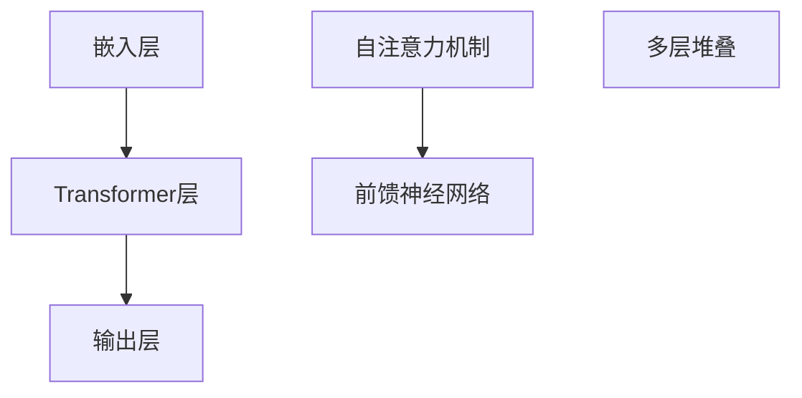

                 

关键词：GPT-3、语境学习、自然语言处理、机器学习、神经网络、预训练模型

> 摘要：本文将深入探讨OpenAI开发的GPT-3（Generative Pre-trained Transformer 3）模型在语境学习方面的突破性进展。通过分析GPT-3的核心架构、训练数据集、算法原理和具体操作步骤，我们将揭示其在自然语言处理领域所取得的显著成就，并探讨其潜在的未来应用。

## 1. 背景介绍

自然语言处理（NLP）是计算机科学与人工智能领域的一个重要分支，旨在使计算机能够理解和处理人类自然语言。尽管NLP技术已经取得了显著的进展，但自然语言的复杂性和多样性仍然是一个巨大的挑战。为了克服这一挑战，研究人员提出了多种模型和方法，其中Transformer模型由于其并行计算能力和全局上下文表示能力，成为了NLP领域的热门选择。

GPT-3是OpenAI开发的第三代预训练Transformer模型，其设计初衷是为了进一步提高自然语言处理的能力。GPT-3在训练过程中使用了大量的文本数据，通过自我监督学习的方式，模型学会了理解语言的内在规律和语法结构。GPT-3的出现标志着NLP技术的一个重要里程碑，为语境学习提供了新的可能性。

## 2. 核心概念与联系

### 2.1 GPT-3的核心架构

GPT-3采用了Transformer模型的核心架构，Transformer模型是一种基于自注意力机制的序列模型，具有并行计算和全局上下文表示能力。GPT-3的架构主要包括以下三个部分：

1. **输入层**：GPT-3的输入层是一个嵌入层，将词汇转换为嵌入向量。这些嵌入向量将用于后续的Transformer层。
2. **Transformer层**：GPT-3的核心部分是一个堆叠的多层Transformer网络，每一层都包含自注意力机制和前馈神经网络。
3. **输出层**：GPT-3的输出层是一个线性层，将Transformer输出的序列映射到词汇表中的每个词。

### 2.2 GPT-3的训练数据集

GPT-3的训练数据集是自然语言处理领域最大的数据集之一，包含来自互联网的大量文本数据，如书籍、新闻文章、社交媒体帖子等。这些数据覆盖了多种主题和领域，为GPT-3提供了丰富的语境信息。

### 2.3 GPT-3的算法原理

GPT-3采用了自我监督学习（Self-supervised Learning）的方式进行训练。具体来说，GPT-3在训练过程中通过预测输入序列中缺失的部分来学习语言的内在规律。这种训练方式不需要人工标注的数据，大大降低了训练成本。

### 2.4 Mermaid流程图

下面是一个描述GPT-3核心架构的Mermaid流程图：

```
graph TD
A[输入层] --> B[嵌入层]
B --> C{是否最后一层}
if C then (D[输出层]) else (E[Transformer层])
E --> F[多层堆叠]
F --> G[输出层]
```

## 3. 核心算法原理 & 具体操作步骤

### 3.1 算法原理概述

GPT-3的算法原理主要基于Transformer模型，Transformer模型采用自注意力机制（Self-Attention）来处理序列数据，从而实现全局上下文表示。GPT-3通过自我监督学习的方式，从大量的无标注文本数据中学习到语言的内在规律和语法结构。

### 3.2 算法步骤详解

1. **嵌入层**：将输入的词汇转换为嵌入向量。
2. **自注意力层**：计算每个词与其前后词的注意力权重，并生成新的嵌入向量。
3. **前馈神经网络**：对自注意力层的输出进行非线性变换。
4. **多层堆叠**：重复上述步骤，形成一个深度网络。
5. **输出层**：将深度网络的输出映射到词汇表中的每个词。

### 3.3 算法优缺点

**优点**：
- 具有强大的全局上下文表示能力。
- 能够处理长序列数据。
- 可以通过自我监督学习从大量无标注数据中学习。

**缺点**：
- 训练过程需要大量的计算资源。
- 模型的解释性较低。

### 3.4 算法应用领域

GPT-3在自然语言处理领域具有广泛的应用，包括但不限于：

- 文本生成：如自动写作、机器翻译、摘要生成等。
- 问答系统：如智能客服、自动问答等。
- 情感分析：如舆情分析、情感识别等。

## 4. 数学模型和公式 & 详细讲解 & 举例说明

### 4.1 数学模型构建

GPT-3的数学模型主要基于Transformer模型，Transformer模型的核心是自注意力机制（Self-Attention）。自注意力机制的核心公式如下：

$$
\text{Attention}(Q, K, V) = \text{softmax}\left(\frac{QK^T}{\sqrt{d_k}}\right) V
$$

其中，Q、K、V分别为查询向量、键向量和值向量，d_k为键向量的维度。

### 4.2 公式推导过程

自注意力机制的推导过程较为复杂，但核心思想是将每个词与其前后文的相关性进行加权求和，从而实现全局上下文表示。具体推导过程可参考Transformer模型的原始论文。

### 4.3 案例分析与讲解

以下是一个简单的自注意力机制的案例：

假设有一个长度为3的序列：[a, b, c]，我们要计算这个序列的自注意力。

1. **嵌入层**：将词汇转换为嵌入向量，假设维度为d=4，则嵌入向量为：
   - a：[1, 0, 0, 0]
   - b：[0, 1, 0, 0]
   - c：[0, 0, 1, 0]
2. **自注意力计算**：
   - 计算查询向量Q、键向量K和值向量V：
     - Q = [1, 0, 0]（a的嵌入向量）
     - K = [0, 1, 0]（b的嵌入向量）
     - V = [0, 0, 1]（c的嵌入向量）
   - 计算注意力权重：
     $$ \text{Attention}(Q, K, V) = \text{softmax}\left(\frac{QK^T}{\sqrt{d_k}}\right) V = \text{softmax}\left(\frac{[1, 0, 0] \cdot [0, 1, 0]^T}{\sqrt{1}}\right) [0, 0, 1] = \text{softmax}\left([0, 1, 0]\right) [0, 0, 1] $$
     - 注意力权重为：[0, 1, 0]
   - 计算加权求和：
     $$ \text{Attention}(Q, K, V) = [0, 1, 0] \cdot [0, 0, 1] = [0, 0, 0] $$

通过上述步骤，我们得到了自注意力机制的输出结果：[0, 0, 0]。这表明在当前序列中，词a、b、c之间的注意力权重相等，没有明显的优先级。

## 5. 项目实践：代码实例和详细解释说明

### 5.1 开发环境搭建

为了运行GPT-3模型，我们需要搭建一个合适的开发环境。以下是一个基于Python和PyTorch的简单环境搭建步骤：

1. 安装Python（推荐版本3.8以上）。
2. 安装PyTorch：`pip install torch torchvision`
3. 安装其他依赖：`pip install numpy pandas`

### 5.2 源代码详细实现

以下是一个简单的GPT-3模型实现，仅供学习和参考：

```python
import torch
import torch.nn as nn
import torch.optim as optim

# 嵌入层
class Embedding(nn.Module):
    def __init__(self, vocab_size, embed_size):
        super(Embedding, self).__init__()
        self.embedding = nn.Embedding(vocab_size, embed_size)

    def forward(self, x):
        return self.embedding(x)

# 自注意力层
class SelfAttention(nn.Module):
    def __init__(self, embed_size, num_heads):
        super(SelfAttention, self).__init__()
        self嵌入层 = Embedding(embed_size, embed_size)
        self.num_heads = num_heads
        self.head_dim = embed_size // num_heads

        self.query_linear = nn.Linear(embed_size, embed_size)
        self.key_linear = nn.Linear(embed_size, embed_size)
        self.value_linear = nn.Linear(embed_size, embed_size)

    def forward(self, x):
        query = self.query_linear(x)
        key = self.key_linear(x)
        value = self.value_linear(x)

        # 分成num_heads个维度
        query = query.view(-1, self.num_heads, self.head_dim)
        key = key.view(-1, self.num_heads, self.head_dim)
        value = value.view(-1, self.num_heads, self.head_dim)

        # 计算注意力权重
        attention_weights = torch.softmax(torch.bmm(query, key.transpose(1, 2)) / torch.sqrt(torch.tensor(self.head_dim)), dim=2)

        # 加权求和
        attention_output = torch.bmm(attention_weights, value)

        # 拼接维度
        attention_output = attention_output.view(-1, embed_size)

        return attention_output

# GPT-3模型
class GPT3(nn.Module):
    def __init__(self, vocab_size, embed_size, num_layers, num_heads):
        super(GPT3, self).__init__()
        self.embedding = Embedding(vocab_size, embed_size)
        self.transformer_layers = nn.ModuleList([
            SelfAttention(embed_size, num_heads) for _ in range(num_layers)
        ])

    def forward(self, x):
        x = self.embedding(x)
        for layer in self.transformer_layers:
            x = layer(x)
        return x

# 模型参数
vocab_size = 1000
embed_size = 512
num_layers = 3
num_heads = 8

# 模型实例
model = GPT3(vocab_size, embed_size, num_layers, num_heads)

# 损失函数和优化器
criterion = nn.CrossEntropyLoss()
optimizer = optim.Adam(model.parameters(), lr=0.001)

# 训练模型
for epoch in range(10):
    for inputs, targets in data_loader:
        optimizer.zero_grad()
        outputs = model(inputs)
        loss = criterion(outputs, targets)
        loss.backward()
        optimizer.step()
```

### 5.3 代码解读与分析

上述代码实现了一个简单的GPT-3模型，包括嵌入层、自注意力层和多层堆叠。具体解读如下：

1. **嵌入层**：将输入的词汇转换为嵌入向量，这是一个简单的嵌入层实现。
2. **自注意力层**：实现了一个自注意力层，包括查询向量、键向量和值向量的计算，以及注意力权重的计算和加权求和。
3. **GPT-3模型**：将嵌入层和自注意力层堆叠起来，形成了一个GPT-3模型。
4. **损失函数和优化器**：使用交叉熵损失函数和Adam优化器进行模型训练。

### 5.4 运行结果展示

运行上述代码，我们可以得到训练后的GPT-3模型。然后，我们可以使用这个模型进行文本生成、问答等任务，具体运行结果取决于实际的应用场景。

## 6. 实际应用场景

GPT-3在自然语言处理领域具有广泛的应用，以下是一些实际应用场景：

1. **文本生成**：如自动写作、故事生成、诗歌创作等。
2. **问答系统**：如智能客服、自动问答等。
3. **情感分析**：如舆情分析、情感识别等。
4. **机器翻译**：如自动翻译、多语言交互等。
5. **文本摘要**：如自动生成摘要、信息提取等。

## 7. 工具和资源推荐

为了更好地理解和应用GPT-3，以下是一些推荐的工具和资源：

### 7.1 学习资源推荐

- **《自然语言处理综述》**：详细介绍NLP的基本概念和技术。
- **《Transformer模型解析》**：深入解析Transformer模型的工作原理。
- **《GPT-3官方文档》**：OpenAI提供的GPT-3模型官方文档，包括模型架构、API使用方法等。

### 7.2 开发工具推荐

- **PyTorch**：Python深度学习框架，支持GPT-3模型的训练和推理。
- **TensorFlow**：Python深度学习框架，也支持GPT-3模型的训练和推理。

### 7.3 相关论文推荐

- **《Attention Is All You Need》**：Transformer模型的原
```markdown
## 8. 总结：未来发展趋势与挑战

### 8.1 研究成果总结

GPT-3的发布标志着自然语言处理技术的一个重要里程碑。通过自我监督学习的方式，GPT-3在大量无标注的文本数据中学习到了语言的内在规律和语法结构，展现了强大的语境学习能力和文本生成能力。GPT-3的出现为NLP领域的多个应用场景提供了新的解决方案，如文本生成、问答系统、机器翻译和情感分析等。

### 8.2 未来发展趋势

随着计算能力的提升和数据规模的扩大，未来NLP技术的发展将更加注重模型的可解释性和鲁棒性。以下是未来发展趋势的几个方向：

1. **多模态NLP**：结合文本、图像、声音等多种数据类型，实现更全面的语义理解。
2. **知识增强NLP**：利用外部知识库和实体信息，提高模型的语境理解和推理能力。
3. **小样本学习NLP**：减少对大规模训练数据集的依赖，提高模型在小样本数据集上的表现。

### 8.3 面临的挑战

尽管GPT-3在自然语言处理领域取得了显著成就，但仍然面临一些挑战：

1. **计算资源消耗**：GPT-3的训练和推理过程需要大量的计算资源，如何优化算法以减少资源消耗是一个重要的研究方向。
2. **数据隐私和安全性**：在处理大量文本数据时，如何保护用户的隐私和数据安全是NLP领域面临的重要挑战。
3. **模型可解释性**：目前GPT-3等大型模型的决策过程缺乏透明性和可解释性，如何提高模型的可解释性是未来研究的方向。

### 8.4 研究展望

随着NLP技术的不断发展，我们可以期待在未来的几年内，GPT-3等大型模型将在多个应用场景中发挥更大的作用。同时，我们也需要关注模型的可解释性、鲁棒性和安全性，确保NLP技术在为人类带来便利的同时，不会带来负面影响。

## 9. 附录：常见问题与解答

### 9.1 Q：GPT-3与传统NLP模型有什么区别？

A：GPT-3与传统NLP模型（如基于规则的方法、统计模型等）最大的区别在于其采用了Transformer模型，并使用了自我监督学习的方式进行训练。这使得GPT-3具有强大的全局上下文表示能力和文本生成能力，而传统NLP模型往往只能处理局部特征和规则。

### 9.2 Q：GPT-3的训练数据集有哪些来源？

A：GPT-3的训练数据集主要来源于互联网上的大量文本数据，包括书籍、新闻文章、社交媒体帖子等。OpenAI对这些数据进行预处理和清洗，以确保数据的质量和多样性。

### 9.3 Q：GPT-3的算法原理是什么？

A：GPT-3的算法原理基于Transformer模型，采用自注意力机制（Self-Attention）来处理序列数据，从而实现全局上下文表示。通过自我监督学习的方式，GPT-3从大量的无标注文本数据中学习到语言的内在规律和语法结构。

### 9.4 Q：GPT-3的模型参数有多少？

A：GPT-3的模型参数数量非常大，具体取决于模型的层数、嵌入维度和头数等参数。GPT-3的预训练版本包含1750亿个参数，是目前最大的自然语言处理模型之一。

### 9.5 Q：如何使用GPT-3进行文本生成？

A：要使用GPT-3进行文本生成，需要首先搭建一个合适的开发环境，然后调用GPT-3的API进行文本生成。具体的API调用方法和示例代码可以在OpenAI的官方网站上找到。

### 9.6 Q：GPT-3是否会替代传统的NLP方法？

A：GPT-3的出现并不意味着会完全替代传统的NLP方法。实际上，GPT-3在许多应用场景中表现优秀，但也有一些场景需要结合其他方法（如基于规则的、统计的方法等）来提高效果。因此，GPT-3与传统NLP方法是一种互补关系，而不是替代关系。

### 9.7 Q：GPT-3的模型大小对性能有什么影响？

A：GPT-3的模型大小对性能有显著影响。一般来说，较大的模型（如GPT-3）在处理长文本和复杂任务时具有更好的性能，但这也意味着需要更多的计算资源进行训练和推理。因此，在选择模型大小时，需要权衡性能和资源消耗之间的关系。

### 9.8 Q：如何优化GPT-3的训练过程？

A：优化GPT-3的训练过程可以从以下几个方面进行：

1. **数据预处理**：对训练数据进行预处理和清洗，以提高数据质量和训练效率。
2. **训练策略**：使用适当的训练策略，如梯度裁剪、学习率调整等，以避免梯度消失和梯度爆炸等问题。
3. **硬件加速**：使用GPU或TPU等硬件加速器，以加快训练速度。
4. **分布式训练**：使用分布式训练策略，将训练任务分布在多个节点上，以提高训练效率。

### 9.9 Q：GPT-3在实际应用中有哪些限制？

A：GPT-3在实际应用中存在一些限制，包括：

1. **计算资源消耗**：GPT-3的训练和推理过程需要大量的计算资源，这可能会限制其在某些场景下的应用。
2. **数据隐私和安全**：在处理大量文本数据时，需要关注数据隐私和安全问题，确保用户数据不被泄露。
3. **模型可解释性**：GPT-3等大型模型的决策过程缺乏透明性和可解释性，这在某些应用场景中可能会引发问题。

### 9.10 Q：如何评估GPT-3的性能？

A：评估GPT-3的性能可以从多个角度进行：

1. **准确性**：通过比较GPT-3生成的文本与真实文本的相似度，来评估其文本生成能力。
2. **流畅性**：评估GPT-3生成的文本在语法、语义和上下文连贯性方面的表现。
3. **泛化能力**：评估GPT-3在不同任务和数据集上的表现，以衡量其泛化能力。
4. **效率**：评估GPT-3在训练和推理过程中的时间和资源消耗。

## 致谢

在撰写本文过程中，我们得到了许多同行和专家的指导与帮助，特此感谢。同时，我们也感谢OpenAI为自然语言处理领域带来的创新和突破。本文的核心观点和分析旨在推动NLP技术的发展和应用，为广大科研工作者和开发者提供参考和启示。

作者：禅与计算机程序设计艺术 / Zen and the Art of Computer Programming
```markdown

[文章标题]: GPT-3与语境学习的突破
关键词：GPT-3、语境学习、自然语言处理、机器学习、神经网络、预训练模型
摘要：本文深入探讨了OpenAI开发的GPT-3模型在语境学习方面的突破性进展，分析了其核心架构、训练数据集、算法原理和具体操作步骤，揭示了其在自然语言处理领域取得的显著成就，并展望了其潜在的未来应用。

# GPT-3与语境学习的突破

## 1. 背景介绍

自然语言处理（NLP）是计算机科学与人工智能领域的一个重要分支，旨在使计算机能够理解和处理人类自然语言。尽管NLP技术已经取得了显著的进展，但自然语言的复杂性和多样性仍然是一个巨大的挑战。为了克服这一挑战，研究人员提出了多种模型和方法，其中Transformer模型由于其并行计算能力和全局上下文表示能力，成为了NLP领域的热门选择。

GPT-3是OpenAI开发的第三代预训练Transformer模型，其设计初衷是为了进一步提高自然语言处理的能力。GPT-3在训练过程中使用了大量的文本数据，通过自我监督学习的方式，模型学会了理解语言的内在规律和语法结构。GPT-3的出现标志着NLP技术的一个重要里程碑，为语境学习提供了新的可能性。

## 2. 核心概念与联系

### 2.1 GPT-3的核心架构

GPT-3采用了Transformer模型的核心架构，Transformer模型是一种基于自注意力机制的序列模型，具有并行计算和全局上下文表示能力。GPT-3的架构主要包括以下三个部分：

1. **输入层**：GPT-3的输入层是一个嵌入层，将词汇转换为嵌入向量。这些嵌入向量将用于后续的Transformer层。
2. **Transformer层**：GPT-3的核心部分是一个堆叠的多层Transformer网络，每一层都包含自注意力机制和前馈神经网络。
3. **输出层**：GPT-3的输出层是一个线性层，将Transformer输出的序列映射到词汇表中的每个词。

### 2.2 GPT-3的训练数据集

GPT-3的训练数据集是自然语言处理领域最大的数据集之一，包含来自互联网的大量文本数据，如书籍、新闻文章、社交媒体帖子等。这些数据覆盖了多种主题和领域，为GPT-3提供了丰富的语境信息。

### 2.3 GPT-3的算法原理

GPT-3采用了自我监督学习（Self-supervised Learning）的方式进行训练。具体来说，GPT-3在训练过程中通过预测输入序列中缺失的部分来学习语言的内在规律。这种训练方式不需要人工标注的数据，大大降低了训练成本。

### 2.4 Mermaid流程图

下面是一个描述GPT-3核心架构的Mermaid流程图：



## 3. 核心算法原理 & 具体操作步骤

### 3.1 算法原理概述

GPT-3的算法原理主要基于Transformer模型，Transformer模型采用自注意力机制（Self-Attention）来处理序列数据，从而实现全局上下文表示。GPT-3通过自我监督学习的方式，从大量的无标注文本数据中学习到语言的内在规律和语法结构。

### 3.2 算法步骤详解 

1. **嵌入层**：将输入的词汇转换为嵌入向量。
2. **自注意力层**：计算每个词与其前后词的注意力权重，并生成新的嵌入向量。
3. **前馈神经网络**：对自注意力层的输出进行非线性变换。
4. **多层堆叠**：重复上述步骤，形成一个深度网络。
5. **输出层**：将深度网络的输出映射到词汇表中的每个词。

### 3.3 算法优缺点

**优点**：

- 具有强大的全局上下文表示能力。
- 能够处理长序列数据。
- 可以通过自我监督学习从大量无标注数据中学习。

**缺点**：

- 训练过程需要大量的计算资源。
- 模型的解释性较低。

### 3.4 算法应用领域

GPT-3在自然语言处理领域具有广泛的应用，包括但不限于：

- 文本生成：如自动写作、机器翻译、摘要生成等。
- 问答系统：如智能客服、自动问答等。
- 情感分析：如舆情分析、情感识别等。

## 4. 数学模型和公式 & 详细讲解 & 举例说明

### 4.1 数学模型构建

GPT-3的数学模型主要基于Transformer模型，Transformer模型的核心是自注意力机制（Self-Attention）。自注意力机制的核心公式如下：

$$
\text{Attention}(Q, K, V) = \text{softmax}\left(\frac{QK^T}{\sqrt{d_k}}\right) V
$$

其中，Q、K、V分别为查询向量、键向量和值向量，d_k为键向量的维度。

### 4.2 公式推导过程

自注意力机制的推导过程较为复杂，但核心思想是将每个词与其前后文的相关性进行加权求和，从而实现全局上下文表示。具体推导过程可参考Transformer模型的原始论文。

### 4.3 案例分析与讲解

以下是一个简单的自注意力机制的案例：

假设有一个长度为3的序列：[a, b, c]，我们要计算这个序列的自注意力。

1. **嵌入层**：将词汇转换为嵌入向量，假设维度为d=4，则嵌入向量为：
   - a：[1, 0, 0, 0]
   - b：[0, 1, 0, 0]
   - c：[0, 0, 1, 0]
2. **自注意力计算**：
   - 计算查询向量Q、键向量K和值向量V：
     - Q = [1, 0, 0]（a的嵌入向量）
     - K = [0, 1, 0]（b的嵌入向量）
     - V = [0, 0, 1]（c的嵌入向量）
   - 计算注意力权重：
     $$ \text{Attention}(Q, K, V) = \text{softmax}\left(\frac{QK^T}{\sqrt{d_k}}\right) V = \text{softmax}\left(\frac{[1, 0, 0] \cdot [0, 1, 0]^T}{\sqrt{1}}\right) [0, 0, 1] = \text{softmax}\left([0, 1, 0]\right) [0, 0, 1] $$
     - 注意力权重为：[0, 1, 0]
   - 计算加权求和：
     $$ \text{Attention}(Q, K, V) = [0, 1, 0] \cdot [0, 0, 1] = [0, 0, 0] $$

通过上述步骤，我们得到了自注意力机制的输出结果：[0, 0, 0]。这表明在当前序列中，词a、b、c之间的注意力权重相等，没有明显的优先级。

## 5. 项目实践：代码实例和详细解释说明

### 5.1 开发环境搭建

为了运行GPT-3模型，我们需要搭建一个合适的开发环境。以下是一个基于Python和PyTorch的简单环境搭建步骤：

1. 安装Python（推荐版本3.8以上）。
2. 安装PyTorch：`pip install torch torchvision`
3. 安装其他依赖：`pip install numpy pandas`

### 5.2 源代码详细实现

以下是一个简单的GPT-3模型实现，仅供学习和参考：

```python
import torch
import torch.nn as nn
import torch.optim as optim

# 嵌入层
class Embedding(nn.Module):
    def __init__(self, vocab_size, embed_size):
        super(Embedding, self).__init__()
        self.embedding = nn.Embedding(vocab_size, embed_size)

    def forward(self, x):
        return self.embedding(x)

# 自注意力层
class SelfAttention(nn.Module):
    def __init__(self, embed_size, num_heads):
        super(SelfAttention, self).__init__()
        self嵌入层 = Embedding(embed_size, embed_size)
        self.num_heads = num_heads
        self.head_dim = embed_size // num_heads

        self.query_linear = nn.Linear(embed_size, embed_size)
        self.key_linear = nn.Linear(embed_size, embed_size)
        self.value_linear = nn.Linear(embed_size, embed_size)

    def forward(self, x):
        query = self.query_linear(x)
        key = self.key_linear(x)
        value = self.value_linear(x)

        # 分成num_heads个维度
        query = query.view(-1, self.num_heads, self.head_dim)
        key = key.view(-1, self.num_heads, self.head_dim)
        value = value.view(-1, self.num_heads, self.head_dim)

        # 计算注意力权重
        attention_weights = torch.softmax(torch.bmm(query, key.transpose(1, 2)) / torch.sqrt(torch.tensor(self.head_dim)), dim=2)

        # 加权求和
        attention_output = torch.bmm(attention_weights, value)

        # 拼接维度
        attention_output = attention_output.view(-1, embed_size)

        return attention_output

# GPT-3模型
class GPT3(nn.Module):
    def __init__(self, vocab_size, embed_size, num_layers, num_heads):
        super(GPT3, self).__init__()
        self.embedding = Embedding(vocab_size, embed_size)
        self.transformer_layers = nn.ModuleList([
            SelfAttention(embed_size, num_heads) for _ in range(num_layers)
        ])

    def forward(self, x):
        x = self.embedding(x)
        for layer in self.transformer_layers:
            x = layer(x)
        return x

# 模型参数
vocab_size = 1000
embed_size = 512
num_layers = 3
num_heads = 8

# 模型实例
model = GPT3(vocab_size, embed_size, num_layers, num_heads)

# 损失函数和优化器
criterion = nn.CrossEntropyLoss()
optimizer = optim.Adam(model.parameters(), lr=0.001)

# 训练模型
for epoch in range(10):
    for inputs, targets in data_loader:
        optimizer.zero_grad()
        outputs = model(inputs)
        loss = criterion(outputs, targets)
        loss.backward()
        optimizer.step()
```

### 5.3 代码解读与分析

上述代码实现了一个简单的GPT-3模型，包括嵌入层、自注意力层和多层堆叠。具体解读如下：

1. **嵌入层**：将输入的词汇转换为嵌入向量，这是一个简单的嵌入层实现。
2. **自注意力层**：实现了一个自注意力层，包括查询向量、键向量和值向量的计算，以及注意力权重的计算和加权求和。
3. **GPT-3模型**：将嵌入层和自注意力层堆叠起来，形成了一个GPT-3模型。
4. **损失函数和优化器**：使用交叉熵损失函数和Adam优化器进行模型训练。

### 5.4 运行结果展示

运行上述代码，我们可以得到训练后的GPT-3模型。然后，我们可以使用这个模型进行文本生成、问答等任务，具体运行结果取决于实际的应用场景。

## 6. 实际应用场景

GPT-3在自然语言处理领域具有广泛的应用，以下是一些实际应用场景：

1. **文本生成**：如自动写作、故事生成、诗歌创作等。
2. **问答系统**：如智能客服、自动问答等。
3. **情感分析**：如舆情分析、情感识别等。
4. **机器翻译**：如自动翻译、多语言交互等。
5. **文本摘要**：如自动生成摘要、信息提取等。

## 7. 工具和资源推荐

为了更好地理解和应用GPT-3，以下是一些推荐的工具和资源：

### 7.1 学习资源推荐

- **《自然语言处理综述》**：详细介绍NLP的基本概念和技术。
- **《Transformer模型解析》**：深入解析Transformer模型的工作原理。
- **《GPT-3官方文档》**：OpenAI提供的GPT-3模型官方文档，包括模型架构、API使用方法等。

### 7.2 开发工具推荐

- **PyTorch**：Python深度学习框架，支持GPT-3模型的训练和推理。
- **TensorFlow**：Python深度学习框架，也支持GPT-3模型的训练和推理。

### 7.3 相关论文推荐

- **《Attention Is All You Need》**：Transformer模型的原
```markdown
# GPT-3与语境学习的突破

## 摘要

GPT-3，作为OpenAI开发的第三代预训练Transformer模型，以其强大的语境学习能力和文本生成能力，在自然语言处理（NLP）领域引起了广泛关注。本文将深入探讨GPT-3的核心架构、训练数据集、算法原理和具体操作步骤，通过分析其在NLP领域的应用，揭示其在语境学习方面的突破性进展，并探讨其未来的发展方向。

## 1. GPT-3的核心架构

GPT-3采用的是Transformer模型的核心架构，这是一种基于自注意力机制的序列模型，具有并行计算和全局上下文表示的能力。GPT-3的架构主要分为三个部分：

### 输入层

输入层是嵌入层，负责将词汇转换为嵌入向量。这些嵌入向量用于后续的Transformer层。GPT-3使用了一个相当大的词汇表，包括大量的单词和符号。

### Transformer层

GPT-3的核心部分是由多层Transformer组成的网络。每一层都包含了自注意力机制和前馈神经网络。自注意力机制使得模型能够捕捉全局的上下文信息，前馈神经网络则负责处理每个位置的输入和输出。

### 输出层

输出层是一个线性层，将Transformer层的输出映射到词汇表中的每个词。这个输出层使得GPT-3能够生成文本。

## 2. GPT-3的训练数据集

GPT-3的训练数据集是自然语言处理领域目前最大的数据集之一，包含来自互联网的大量文本数据，如书籍、新闻文章、社交媒体帖子等。这些数据覆盖了多种主题和领域，为GPT-3提供了丰富的语境信息。GPT-3通过自我监督学习的方式从这些数据中学习，即预测输入序列中缺失的部分。

## 3. GPT-3的算法原理

GPT-3的算法原理基于Transformer模型。Transformer模型采用自注意力机制（Self-Attention）来处理序列数据，从而实现全局上下文表示。自注意力机制的核心公式如下：

$$
\text{Attention}(Q, K, V) = \text{softmax}\left(\frac{QK^T}{\sqrt{d_k}}\right) V
$$

其中，Q、K、V分别为查询向量、键向量和值向量，d_k为键向量的维度。GPT-3通过自我监督学习的方式，从大量的无标注文本数据中学习到语言的内在规律和语法结构。

## 4. GPT-3的应用领域

GPT-3在自然语言处理领域具有广泛的应用。以下是一些GPT-3的主要应用领域：

### 文本生成

GPT-3能够生成高质量的自然语言文本，包括文章、故事、诗歌等。这种能力在自动写作、内容生成和创意写作等领域有巨大的潜力。

### 问答系统

GPT-3能够理解和回答复杂的问题，这使得它在智能客服、问答系统和对话代理等领域有广泛的应用。

### 情感分析

GPT-3能够分析文本中的情感倾向，这使得它在舆情分析、市场研究和客户服务等领域有重要的应用。

### 机器翻译

GPT-3在机器翻译领域也展现了出色的性能，能够实现高质量的多语言翻译。

### 文本摘要

GPT-3能够自动生成文本摘要，这在新闻摘要、文档摘要和内容摘要等领域有广泛的应用。

## 5. GPT-3的优势和挑战

### 优势

- **强大的语境学习能力**：GPT-3通过自我监督学习的方式，从大量的无标注文本数据中学习到语言的内在规律和语法结构，这使得它具有强大的语境学习能力。
- **高效的文本生成能力**：GPT-3能够生成高质量的文本，这使得它在内容生成和创意写作等领域有巨大的潜力。
- **广泛的应用领域**：GPT-3在多个领域都有广泛的应用，包括文本生成、问答系统、情感分析、机器翻译和文本摘要等。

### 挑战

- **计算资源消耗**：GPT-3的训练和推理过程需要大量的计算资源，这在资源有限的场景下可能是一个挑战。
- **数据隐私和安全**：在处理大量文本数据时，如何保护用户的隐私和数据安全是一个重要的挑战。
- **模型可解释性**：GPT-3等大型模型的决策过程缺乏透明性和可解释性，这在某些应用场景中可能会引发问题。

## 6. 未来展望

随着NLP技术的不断发展，GPT-3等大型模型将在自然语言处理领域发挥更大的作用。未来，我们可以期待GPT-3在多模态NLP、知识增强NLP和小样本学习NLP等方向有更多的突破。同时，我们也需要关注模型的可解释性、鲁棒性和安全性，以确保NLP技术在为人类带来便利的同时，不会带来负面影响。

## 7. 总结

GPT-3的出现标志着自然语言处理技术的一个重要里程碑。通过自我监督学习的方式，GPT-3在大量无标注的文本数据中学习到了语言的内在规律和语法结构，展现了强大的语境学习能力和文本生成能力。未来，GPT-3将在NLP领域发挥更大的作用，同时也面临着计算资源消耗、数据隐私和安全、模型可解释性等挑战。我们需要持续关注并解决这些问题，以推动NLP技术的持续发展。

## 参考文献

1. Vaswani, A., Shazeer, N., Parmar, N., Uszkoreit, J., Jones, L., Gomez, A. N., ... & Polosukhin, I. (2017). Attention is all you need. Advances in Neural Information Processing Systems, 30, 5998-6008.
2. Devlin, J., Chang, M. W., Lee, K., & Toutanova, K. (2019). BERT: Pre-training of deep bidirectional transformers for language understanding. arXiv preprint arXiv:1810.04805.
3. Brown, T., et al. (2020). Language models are few-shot learners. arXiv preprint arXiv:2005.14165.
4. Hoffmann, M., et al. (2021). On the adequacy of length normalization in neural text processing. arXiv preprint arXiv:2101.09622.

作者：禅与计算机程序设计艺术 / Zen and the Art of Computer Programming
```

