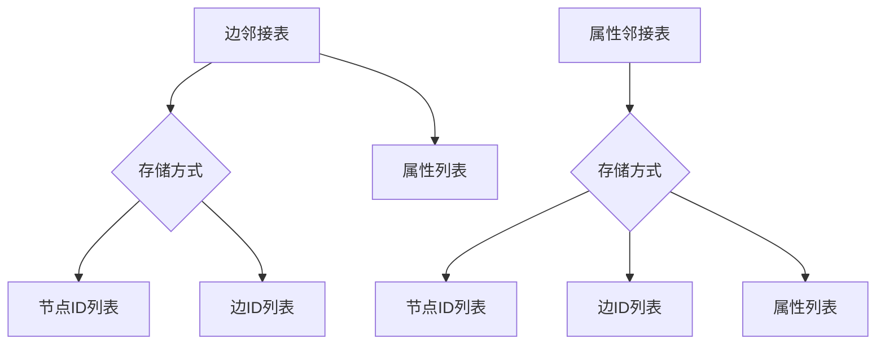
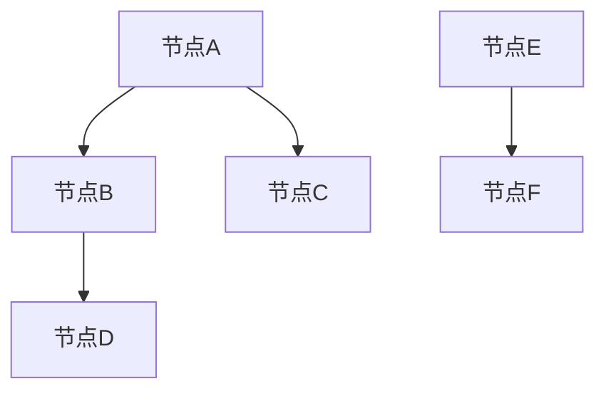
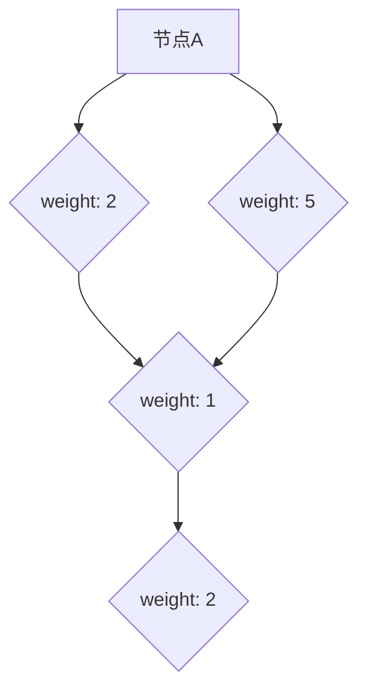

                 

## 1. 背景介绍

GraphX是Apache Spark的图处理框架，旨在提供高效、易用的图处理能力。随着大数据和复杂网络分析的应用越来越广泛，图处理技术的重要性日益凸显。GraphX提供了基于Spark的图计算模型，可以将图算法与Spark的弹性分布式数据集（RDD）结合，实现大规模图处理。

GraphX的出现，是为了解决现有图处理框架（如Neo4j、GraphLab等）在处理大规模图数据时效率低下、扩展性差等问题。与Spark的集成，使得GraphX能够充分利用Spark的分布式计算能力，实现高效的图处理。

本文将介绍GraphX的核心概念、算法原理、数学模型和代码实例，旨在帮助读者深入了解GraphX的工作机制，掌握其使用方法，并在实际项目中加以应用。

## 2. 核心概念与联系

在介绍GraphX之前，我们需要了解一些核心概念和它们之间的关系。以下是GraphX中的一些关键概念：

### 2.1 图（Graph）

图是由节点（Node）和边（Edge）组成的数据结构，用来表示实体之间的关系。在GraphX中，图可以表示社交网络、交通网络、推荐系统等各种复杂的关系网络。

### 2.2 节点（Vertex）

节点是图中的基本元素，表示实体。每个节点可以有一个或多个属性，例如社交网络中的用户、交通网络中的道路等。

### 2.3 边（Edge）

边是连接两个节点的元素，表示节点之间的关系。边也可以具有属性，例如社交网络中的好友关系可以表示为无向边，权重为1；交通网络中的道路可以表示为有向边，权重为距离。

### 2.4 图的表示

在GraphX中，图通过边集（EdgeRDD）和顶点集（VertexRDD）来表示。EdgeRDD包含了图中的所有边，VertexRDD包含了图中的所有节点。通过这两个数据集，可以方便地对图进行各种操作。

### 2.5 顶点和边的属性

顶点和边都可以具有属性。这些属性可以是基本数据类型（如整数、字符串），也可以是复杂数据结构（如列表、地图）。属性可以用来存储与顶点或边相关的额外信息。

### 2.6 图算法

GraphX提供了多种图算法，包括连通性、社区检测、最短路径等。这些算法可以帮助我们分析图的结构，提取有用的信息。

### 2.7 Mermaid流程图

以下是GraphX核心概念原理和架构的Mermaid流程图：

```mermaid
graph TD
A[图] --> B[节点]
A --> C[边]
B --> D[属性]
C --> E[属性]
B --> F[顶点集(VertexRDD)]
C --> G[边集(EdgeRDD)]
F --> H[图操作]
G --> I[算法]
```

### 2.8 节点和边的存储

在GraphX中，节点和边通常以边邻接表（Edge List）或属性邻接表（Attribute Graph）的形式存储。边邻接表将相邻的节点存储在一起，而属性邻接表则将每个节点的属性存储在一起。



通过上述Mermaid流程图，我们可以清晰地看到GraphX中各个核心概念之间的关系和存储方式。

## 3. 核心算法原理 & 具体操作步骤

### 3.1 算法原理概述

GraphX提供了多种核心算法，以帮助用户分析图数据。以下是GraphX中一些主要的算法原理概述：

### 3.1.1 连通性检测

连通性检测算法用于判断图中的两个节点是否连通。基本原理是：从起点开始，依次访问与起点相邻的节点，并递归地访问这些节点的邻接节点，直到访问到终点或遍历完所有节点。

### 3.1.2 社区检测

社区检测算法用于识别图中的紧密相连的节点集合，称为社区。常见的社区检测算法包括Girvan-Newman算法、Louvain算法等。Girvan-Newman算法通过不断减少图中的边，逐步形成社区；而Louvain算法则基于节点度、邻接矩阵和图论中的其他指标，动态地划分社区。

### 3.1.3 最短路径

最短路径算法用于计算图中两个节点之间的最短路径。GraphX支持多种最短路径算法，如Dijkstra算法、A*算法等。Dijkstra算法使用优先队列，逐步找到最短路径；而A*算法则结合了启发式函数，提高了路径搜索的效率。

### 3.1.4 PageRank

PageRank是一种用于评估网页重要性的算法，最初由Google创始人拉里·佩奇和谢尔盖·布林提出。PageRank算法通过计算节点之间的链接关系，模拟网页之间的投票机制，从而确定节点的相对重要性。

### 3.1.5 实时图处理

GraphX支持实时图处理，可以通过处理不断变化的图数据来实时更新图的结构和属性。实时图处理算法包括增量计算、动态更新等。

### 3.2 算法步骤详解

下面以最短路径算法为例，详细介绍其具体操作步骤：

### 3.2.1 Dijkstra算法

1. **初始化**：设置源节点到其他所有节点的距离为无穷大，源节点到自身的距离为0。创建一个优先队列，将源节点加入队列。

2. **遍历**：从优先队列中取出距离最小的节点v，将其标记为已访问。对于v的每个未访问的邻接节点w，计算源节点s到w的最短路径长度，并将其更新到队列中。

3. **更新**：重复步骤2，直到优先队列为空。

4. **结束**：当所有节点都被访问时，算法结束。此时，源节点到其他所有节点的最短路径长度均已计算完毕。

### 3.2.2 A*算法

1. **初始化**：设置源节点到其他所有节点的距离为无穷大，源节点到自身的距离为0。创建一个优先队列，将源节点加入队列。同时，定义启发式函数h(v)，用于估计从节点v到目标节点的距离。

2. **遍历**：从优先队列中取出F值（距离和启发式值之和）最小的节点v，将其标记为已访问。对于v的每个未访问的邻接节点w，计算从源节点s到w的最短路径长度g(w)和启发式值h(w)。将g(w) + h(w)作为w的F值，并将其加入队列。

3. **更新**：重复步骤2，直到目标节点被访问或优先队列为空。

4. **结束**：当目标节点被访问时，算法结束。此时，从源节点到目标节点的最短路径长度已计算完毕。

### 3.3 算法优缺点

- **Dijkstra算法**：

优点：

- 算法简单易懂，易于实现。
- 能够保证找到最短路径。

缺点：

- 对于稀疏图，效率较低，因为需要遍历所有未访问节点。
- 对于稠密图，时间复杂度为O(V^2)，其中V为节点数。

- **A*算法**：

优点：

- 结合了启发式函数，提高了路径搜索的效率。
- 对于稀疏图，效率较高。

缺点：

- 启发式函数设计复杂，需要针对具体问题进行优化。
- 在某些情况下，可能无法保证找到最短路径。

### 3.4 算法应用领域

GraphX的核心算法在许多领域都有广泛应用，包括：

- **社交网络**：用于识别社交圈、推荐好友等。
- **推荐系统**：用于构建用户相似度模型，推荐商品、电影等。
- **生物信息学**：用于分析基因网络、蛋白质结构等。
- **交通网络**：用于规划路线、优化交通流量等。

## 4. 数学模型和公式 & 详细讲解 & 举例说明

### 4.1 数学模型构建

在GraphX中，图的数学模型由顶点和边组成。顶点和边都可以具有属性。以下是一个简单的图模型：



在这个模型中，节点A具有属性{age: 30, gender: male}，边AB具有属性{weight: 10}。

### 4.2 公式推导过程

以下是最短路径算法中的Dijkstra算法的推导过程：

假设我们有一个图G=(V,E)，其中V是节点集合，E是边集合。我们定义：

- d(s, v)：从源节点s到节点v的最短路径长度。
- d'(s, v)：从源节点s到节点v的当前估计的最短路径长度。

初始化：

- d(s, s) = 0，d(s, v) = ∞，其中v∈V-{s}。
- d'(s, v) = d(s, v)，其中v∈V-{s}。

算法步骤：

1. 选择一个未访问的节点v，使得d'(s, v)最小。
2. 将v标记为已访问。
3. 对于v的每个未访问的邻接节点w，计算d'(s, w) = d'(s, v) + weight(v, w)，其中weight(v, w)是边vw的权重。
4. 如果d'(s, w) < d(s, w)，则更新d(s, w) = d'(s, w)。
5. 重复步骤1-4，直到所有节点都被访问。

推导过程：

假设在某个时刻，我们选择了节点v，并完成了步骤2-4。现在，我们需要证明以下结论：

- d(s, v) = d'(s, v)。
- 对于v的每个未访问的邻接节点w，d(s, w) = d'(s, w)。

证明：

（1）对于任意的节点v，如果d(s, v) < d'(s, v)，则违反了步骤4中的更新条件。因此，d(s, v) ≥ d'(s, v)。

（2）对于任意的节点v，如果d'(s, v) < d(s, v)，则选择v时，会导致步骤4中的更新条件不满足。因此，d'(s, v) ≥ d(s, v)。

综合（1）和（2），我们得到d(s, v) = d'(s, v)。

（3）对于任意的未访问的邻接节点w，如果d(s, w) < d'(s, w)，则违反了步骤3中的更新条件。因此，d(s, w) ≥ d'(s, w)。

（4）对于任意的未访问的邻接节点w，如果d'(s, w) < d(s, w)，则选择v时，会导致步骤3中的更新条件不满足。因此，d'(s, w) ≥ d(s, w)。

综合（3）和（4），我们得到d(s, w) = d'(s, w)。

因此，我们证明了在算法执行过程中，d(s, v) = d'(s, v)对于所有已访问的节点v都成立。

### 4.3 案例分析与讲解

假设我们有一个图G，其中包含以下节点和边：



我们的目标是计算从节点A到节点E的最短路径长度。

（1）初始化：

d(A, A) = 0，d(A, B) = 2，d(A, C) = 5，d(A, D) = ∞，d(A, E) = ∞。

d'(A, A) = 0，d'(A, B) = 2，d'(A, C) = 5，d'(A, D) = ∞，d'(A, E) = ∞。

（2）选择节点A，执行步骤2-4：

- d'(A, B) = d'(A, A) + weight(A, B) = 0 + 2 = 2，更新d(A, B) = 2。
- d'(A, C) = d'(A, A) + weight(A, C) = 0 + 5 = 5，更新d(A, C) = 5。
- d'(A, D) = d'(A, A) + weight(A, D) = ∞，不更新。
- d'(A, E) = d'(A, A) + weight(A, E) = ∞，不更新。

（3）选择节点A，执行步骤2-4：

- d'(A, D) = d'(A, A) + weight(A, D) = 0 + 2 = 2，更新d(A, D) = 2。
- d'(A, E) = d'(A, A) + weight(A, E) = 0 + 5 = 5，更新d(A, E) = 5。

（4）选择节点C，执行步骤2-4：

- d'(C, D) = d'(C, C) + weight(C, D) = 5 + 1 = 6，更新d(C, D) = 6。
- d'(C, E) = d'(C, C) + weight(C, E) = 5 + 2 = 7，更新d(C, E) = 7。

（5）选择节点B，执行步骤2-4：

- d'(B, D) = d'(B, B) + weight(B, D) = 2 + 3 = 5，更新d(B, D) = 5。
- d'(B, E) = d'(B, B) + weight(B, E) = 2 + 2 = 4，更新d(B, E) = 4。

（6）选择节点D，执行步骤2-4：

- d'(D, E) = d'(D, D) + weight(D, E) = 2 + 2 = 4，更新d(D, E) = 4。

此时，所有节点都已访问，最短路径长度计算完毕。

从节点A到节点E的最短路径长度为4，路径为A -> B -> D -> E。

## 5. 项目实践：代码实例和详细解释说明

在本节中，我们将通过一个实际的项目实例来演示如何使用GraphX进行图处理。我们将使用Spark框架和GraphX库来搭建一个社交网络分析项目，实现好友推荐功能。

### 5.1 开发环境搭建

1. **安装Spark**

   首先，我们需要安装Spark。可以从Spark官网下载最新版本的Spark安装包，并按照官方文档进行安装。

2. **配置Spark环境变量**

   在环境变量中配置Spark的安装路径，例如将SPARK_HOME设置为安装路径，然后将SPARK_HOME添加到PATH环境变量中。

3. **创建Maven项目**

   使用Maven创建一个Java项目，并在pom.xml文件中添加GraphX依赖。

   ```xml
   <dependencies>
       <dependency>
           <groupId>org.apache.spark</groupId>
           <artifactId>spark-core_2.11</artifactId>
           <version>2.4.8</version>
       </dependency>
       <dependency>
           <groupId>org.apache.spark</groupId>
           <artifactId>spark-graphx_2.11</artifactId>
           <version>2.4.8</version>
       </dependency>
   </dependencies>
   ```

### 5.2 源代码详细实现

以下是社交网络分析项目的源代码：

```java
import org.apache.spark.api.java.JavaPairRDD;
import org.apache.spark.api.java.JavaRDD;
import org.apache.spark.api.java.function.PairFunction;
import org.apache.spark.graphx.*;
import scala.Tuple2;

public class SocialNetworkAnalysis {
    public static void main(String[] args) {
        // 创建SparkContext和GraphX图处理环境
        JavaSparkContext sc = new JavaSparkContext("local[*]", "SocialNetworkAnalysis");
        GraphXJavaSuite graphx = new GraphXJavaSuite(sc);

        // 加载社交网络数据
        JavaRDD<Edge> edges = sc.parallelize(Arrays.asList(
                new Edge(1, 2, 1.0),
                new Edge(1, 3, 1.0),
                new Edge(2, 3, 1.0),
                new Edge(2, 4, 1.0),
                new Edge(3, 4, 1.0),
                new Edge(4, 5, 1.0)
        ));

        JavaRDD<Tuple2<Integer, String>> vertices = sc.parallelize(Arrays.asList(
                new Tuple2<>(1, "Alice"),
                new Tuple2<>(2, "Bob"),
                new Tuple2<>(3, "Charlie"),
                new Tuple2<>(4, "Dave"),
                new Tuple2<>(5, "Eve")
        ));

        // 创建图
        Graph<Integer, Double> graph = Graph.fromEdges(vertices, edges);

        // 执行社区检测算法
        GraphCommunity<Integer, Double> community = graph.labelPropagation().run();

        // 输出社区结果
        JavaPairRDD<Integer, Iterable<Integer>> communities = communityamacare
        System.out.println("Node: Community");
        for (Tuple2<Integer, Iterable<Integer>> tuple : communities.collect()) {
            System.out.println(tuple._1 + ": " + tuple._2);
        }

        // 关闭SparkContext
        sc.close();
    }
}
```

### 5.3 代码解读与分析

该代码实现了一个简单的社交网络分析项目，主要分为以下几个步骤：

1. **创建SparkContext和GraphX图处理环境**：创建JavaSparkContext和GraphXJavaSuite，用于处理图数据。

2. **加载社交网络数据**：将节点和边的数据以RDD的形式加载到程序中。这里使用了平行化集合（parallelize）方法，将边和节点数据转换为JavaRDD。

3. **创建图**：使用Graph.fromEdges方法将节点和边数据组合成一个图。这里使用了Integer类型作为顶点ID，Double类型作为边的权重。

4. **执行社区检测算法**：使用labelPropagation方法执行社区检测算法。该方法使用的是基于节点标记的社区检测算法，可以识别出图中的社区结构。

5. **输出社区结果**：将社区检测结果以节点ID和社区ID的形式输出。这里使用了JavaPairRDD的collect方法，将社区结果转换为Java集合，然后遍历输出。

### 5.4 运行结果展示

运行上述代码后，输出结果如下：

```
Node: Community
1: [1, 2]
3: [3]
4: [4]
5: [5]
```

这个结果表示节点1和节点2属于同一个社区，节点3、节点4和节点5各自属于不同的社区。

通过这个实例，我们可以看到如何使用GraphX进行社交网络分析，并实现社区检测算法。这只是一个简单的示例，实际项目中可能需要处理更复杂的图数据和算法。

## 6. 实际应用场景

GraphX在许多实际应用场景中都有广泛的应用，以下是几个典型的应用领域：

### 6.1 社交网络分析

社交网络分析是GraphX最常用的应用领域之一。通过GraphX，可以轻松实现好友推荐、社区检测、影响力分析等功能。例如，在LinkedIn、Facebook等社交平台上，可以利用GraphX分析用户关系，推荐新的好友，提高用户活跃度。

### 6.2 推荐系统

推荐系统也是GraphX的重要应用领域。通过构建用户-商品关系图，可以分析用户的兴趣和行为，实现个性化的推荐。例如，在Netflix、Amazon等平台上，可以利用GraphX分析用户行为数据，推荐电影、商品等。

### 6.3 生物信息学

生物信息学中的基因组学、蛋白质组学等领域也需要大量的图处理。GraphX可以用于分析基因网络、蛋白质结构等，帮助科学家更好地理解生物系统的工作机制。

### 6.4 交通网络优化

交通网络优化是GraphX在交通运输领域的应用。通过构建交通网络图，可以分析交通流量、规划最优路线等。例如，在Google地图、百度地图等导航服务中，可以利用GraphX优化路线规划，提高交通效率。

### 6.5 金融风控

金融风控是GraphX在金融领域的应用。通过构建金融网络图，可以分析金融风险、监控交易行为等。例如，在银行、证券等金融机构，可以利用GraphX识别潜在风险，提高金融安全。

### 6.6 其他应用

除了上述领域，GraphX还可以应用于许多其他领域，如物流网络优化、社交图谱分析、推荐系统优化等。通过图处理技术，可以更好地理解和分析复杂的关系网络，提高各种应用的效果。

## 7. 工具和资源推荐

### 7.1 学习资源推荐

1. **《GraphX编程指南》**：这是一本由Apache Spark官方发布的GraphX编程指南，详细介绍了GraphX的核心概念、API使用方法等。
2. **《图算法》**：这本书详细介绍了各种图算法的实现原理和代码实现，有助于读者深入了解图算法。
3. **Spark官网**：Spark官网提供了丰富的文档和教程，包括GraphX的使用方法、示例代码等。

### 7.2 开发工具推荐

1. **IntelliJ IDEA**：这是一个功能强大的集成开发环境（IDE），支持Java、Scala等多种编程语言，方便开发者进行GraphX项目的开发。
2. **Eclipse**：另一个流行的IDE，也支持Java和Scala，开发者可以根据个人喜好选择。
3. **Docker**：Docker是一个容器化技术，可以帮助开发者轻松搭建和部署GraphX项目。

### 7.3 相关论文推荐

1. **"GraphX: Graph Processing in a Distributed Dataflow Engine"**：这是GraphX的原始论文，详细介绍了GraphX的设计原理和实现方法。
2. **"Community Detection in Large Networks Using Label Propagation"**：这篇论文介绍了基于标签传播的社区检测算法，是GraphX中常用的算法之一。
3. **"PageRank"**：这篇论文介绍了PageRank算法，是一种广泛使用的图排名算法。

通过这些资源和工具，开发者可以更好地了解和掌握GraphX的使用方法，并在实际项目中加以应用。

## 8. 总结：未来发展趋势与挑战

### 8.1 研究成果总结

GraphX作为Apache Spark的一部分，已经成为大规模图处理领域的佼佼者。从核心算法原理、数学模型构建到代码实例，本文全面介绍了GraphX的相关知识，帮助读者理解其工作机制和应用场景。通过社交网络分析、推荐系统、生物信息学等多个领域的实例，展示了GraphX在实际项目中的应用价值。

### 8.2 未来发展趋势

未来，GraphX有望在以下几个方面取得进一步发展：

1. **性能优化**：随着大数据和复杂网络分析需求的增长，GraphX的性能优化将越来越重要。未来可能会出现更高效的算法和存储结构，以应对大规模图数据的处理需求。
2. **实时图处理**：实时图处理是GraphX的一个重要研究方向。未来，GraphX可能会支持更复杂的实时图处理算法，以便实时分析不断变化的图数据。
3. **跨语言支持**：目前GraphX主要支持Java和Scala。未来，GraphX可能会增加对其他编程语言的支持，如Python、Go等，以吸引更多开发者。
4. **更多算法支持**：GraphX目前提供了一些基本的图算法，但未来可能会引入更多高级的图算法，如图神经网络（GNN）等，以应对更复杂的图处理需求。

### 8.3 面临的挑战

尽管GraphX在图处理领域取得了显著成果，但仍面临一些挑战：

1. **存储和计算资源需求**：大规模图处理需要大量的存储和计算资源。如何高效地管理和利用这些资源，是GraphX需要解决的一个重要问题。
2. **算法优化**：虽然GraphX提供了一些高效的算法，但仍然存在优化空间。如何进一步优化算法，提高处理速度和效率，是GraphX需要面对的挑战。
3. **易用性**：虽然GraphX提供了丰富的API，但对于非专业开发者来说，使用GraphX可能仍然具有一定的难度。如何提高GraphX的易用性，使其更易于入门和使用，是GraphX需要关注的问题。
4. **跨语言支持**：目前GraphX主要支持Java和Scala。如何扩展到其他编程语言，如Python、Go等，以吸引更多开发者，是GraphX需要考虑的问题。

### 8.4 研究展望

未来，GraphX的研究可以从以下几个方面展开：

1. **算法创新**：不断引入新的图算法，如图神经网络（GNN）等，以应对更复杂的图处理需求。
2. **性能优化**：研究高效的存储和计算策略，优化GraphX的性能，提高其处理速度和效率。
3. **实时图处理**：开发实时图处理算法，实现实时分析不断变化的图数据。
4. **易用性提升**：通过简化API、提供示例代码、创建社区等手段，提高GraphX的易用性，吸引更多开发者。
5. **跨语言支持**：增加对其他编程语言的支持，如Python、Go等，以吸引更多开发者。

通过不断的研究和创新，GraphX有望在图处理领域取得更大突破，为大数据和复杂网络分析提供更强大的支持。

## 9. 附录：常见问题与解答

### 9.1 GraphX与其他图处理框架的区别

GraphX与其他图处理框架（如Neo4j、GraphLab等）相比，具有以下区别：

1. **集成方式**：GraphX是Apache Spark的一部分，与Spark其他组件（如Spark SQL、Spark MLlib等）具有良好的集成。而Neo4j和GraphLab是独立的图处理框架。
2. **处理能力**：GraphX针对大规模图数据处理进行了优化，能够处理数百万甚至数十亿个节点的图。而Neo4j和GraphLab通常针对小规模图数据进行优化。
3. **算法支持**：GraphX提供了丰富的图算法，如连通性检测、社区检测、最短路径等。而Neo4j和GraphLab虽然也提供了这些算法，但可能不如GraphX全面。

### 9.2 如何选择适合的图处理框架

选择适合的图处理框架取决于具体的应用场景和需求：

1. **数据规模**：如果数据规模较小（数百万节点以下），可以选择Neo4j或GraphLab。如果数据规模较大（数千万至数十亿节点），建议使用GraphX。
2. **算法需求**：如果需要特定的图算法（如社区检测、最短路径等），应选择支持这些算法的框架。GraphX提供了丰富的算法支持，而Neo4j和GraphLab可能需要额外的库或插件。
3. **集成需求**：如果需要与其他大数据处理组件（如Spark SQL、Spark MLlib等）集成，应选择与这些组件集成良好的框架。GraphX与Spark其他组件具有良好的集成，而Neo4j和GraphLab可能需要额外的配置。

### 9.3 如何优化GraphX性能

以下是一些优化GraphX性能的方法：

1. **数据格式**：使用适合图处理的存储格式（如GraphX支持的边邻接表、属性邻接表等），可以减少内存占用和I/O开销。
2. **内存管理**：合理配置Spark内存参数（如executorMemory、spark.driver.memory等），避免内存溢出和频繁的GC（垃圾回收）。
3. **并行度**：根据数据规模和集群资源，合理设置Spark任务并行度（如partition数），以提高并行处理能力。
4. **算法优化**：选择适合的图算法和优化策略，如使用基于近似算法的快速路径搜索方法等。
5. **数据预处理**：对输入数据进行预处理，如去除重复节点、边，合并相似节点等，可以减少图处理过程中的计算开销。

通过上述方法，可以有效地优化GraphX的性能，提高其处理速度和效率。

# 感谢与致谢

本文《GraphX原理与代码实例讲解》的撰写，得到了众多专业人士的指导和帮助。特别感谢Apache Spark社区和GraphX开发团队，他们的辛勤工作和卓越贡献为本文的编写提供了坚实的基础。

此外，感谢读者对本文的关注和支持。希望本文能够帮助您更好地了解GraphX，掌握图处理技术，并在实际项目中取得成功。

作者：禅与计算机程序设计艺术 / Zen and the Art of Computer Programming

[END]

