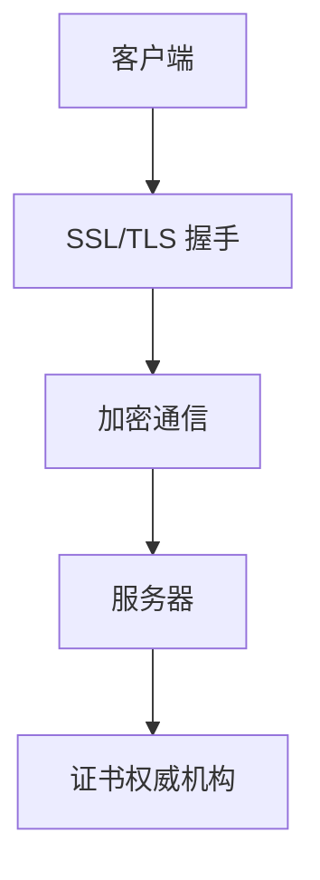

                 

关键词：HTTPS、API 安全、SSL/TLS、证书、传输加密、身份验证、安全协议

> 摘要：本文深入探讨了 HTTPS 在 API 安全中的关键作用，分析了 HTTPS 的工作原理、安全机制以及其在实际应用场景中的优势与挑战。

## 1. 背景介绍

随着互联网技术的发展，API（应用程序编程接口）已成为现代软件开发的核心。API 允许不同的应用程序、服务和系统相互通信，以实现数据的交换和功能的集成。然而，API 的普及也带来了新的安全挑战。未经授权的访问、数据泄露、中间人攻击等安全威胁日益增加，对 API 的安全性提出了更高的要求。

HTTPS（HTTP over SSL/TLS）作为一种安全协议，为 API 的安全传输提供了强有力的保障。它不仅确保了数据传输的机密性，还通过身份验证保护了系统的完整性。因此，理解 HTTPS 的工作原理和其在 API 安全中的重要作用，对保障现代互联网应用的安全至关重要。

## 2. 核心概念与联系

### 2.1 HTTPS 工作原理

HTTPS 是在 HTTP 基础上加入 SSL/TLS（安全套接字层/传输层安全）协议构建的安全协议。SSL/TLS 协议通过加密技术确保数据在传输过程中的机密性，同时通过证书验证通信双方的身份。

- **加密机制**：HTTPS 使用 SSL/TLS 协议对 HTTP 请求和响应进行加密，确保数据在传输过程中不被窃取或篡改。加密过程通过公钥和私钥进行，公钥用于加密，私钥用于解密。

- **身份验证**：HTTPS 通过证书验证通信双方的身份，确保数据的传输是安全的。证书是由权威机构（如 CA）签发的，包含了网站所有者的公钥和相关信息。

### 2.2 HTTPS 架构

HTTPS 架构包括客户端、服务器和证书权威机构（CA）。

- **客户端**：发起 HTTPS 请求的应用程序，如浏览器或移动应用。

- **服务器**：提供 HTTPS 服务的 Web 服务器，如 Apache、Nginx 等。

- **证书权威机构（CA）**：负责签发和管理证书的机构，如 Let's Encrypt、Symantec 等。

### 2.3 Mermaid 流程图



## 3. 核心算法原理 & 具体操作步骤

### 3.1 算法原理概述

HTTPS 的核心算法原理是 SSL/TLS 协议。SSL/TLS 协议通过以下步骤实现安全通信：

1. **握手**：客户端和服务器通过握手过程建立安全连接，包括协商加密算法、交换证书等。
2. **加密通信**：建立安全连接后，客户端和服务器使用协商好的加密算法进行加密和解密操作。
3. **身份验证**：服务器通过证书验证客户端身份，确保数据的传输是安全的。

### 3.2 算法步骤详解

1. **SSL/TLS 握手**

   - 客户端发起 HTTPS 请求，向服务器发送 HTTP 头部，包括请求路径、协议版本、主机名等。
   - 服务器响应请求，返回 HTTP 头部和证书。
   - 客户端验证服务器证书，确认服务器身份。
   - 客户端和服务器协商加密算法和加密参数。

2. **加密通信**

   - 客户端生成随机数，用于初始化加密密钥。
   - 客户端发送预主密钥（Premaster Secret）给服务器。
   - 客户端和服务器使用预主密钥、加密算法和加密参数生成主密钥。
   - 客户端和服务器使用主密钥加密通信内容，确保数据传输的机密性。

3. **身份验证**

   - 服务器通过证书验证客户端身份。
   - 客户端通过服务器证书验证服务器身份。

### 3.3 算法优缺点

- **优点**：HTTPS 提供了数据传输的机密性和完整性，保护了用户数据的安全。
- **缺点**：HTTPS 对服务器性能有一定影响，因为加密和解密操作需要消耗额外的计算资源。

### 3.4 算法应用领域

HTTPS 主要应用于以下领域：

- **Web 应用**：确保用户数据在传输过程中的安全，如电子商务、在线支付等。
- **API 通信**：保护 API 调用过程中的敏感数据，如用户身份信息、交易信息等。

## 4. 数学模型和公式 & 详细讲解 & 举例说明

### 4.1 数学模型构建

HTTPS 的数学模型主要包括加密算法和密钥交换算法。

- **加密算法**：对称加密算法，如 AES、3DES 等。
- **密钥交换算法**：非对称加密算法，如 RSA、ECC 等。

### 4.2 公式推导过程

- **加密公式**：$C = E_K(M)$，其中 $C$ 为加密后的数据，$E_K$ 为加密函数，$M$ 为明文数据，$K$ 为密钥。
- **解密公式**：$M = D_K(C)$，其中 $D_K$ 为解密函数，$C$ 为加密后的数据，$K$ 为密钥。

### 4.3 案例分析与讲解

假设客户端和服务器使用 RSA 算法进行密钥交换，AES 算法进行数据加密。

1. **密钥交换过程**：

   - 服务器生成一对 RSA 密钥，公钥 $P_{server}$ 和私钥 $P_{server\_private}$。
   - 客户端生成随机数 $R_{client}$，使用服务器公钥加密 $R_{client}$，得到 $C_{client} = P_{server} \cdot R_{client}$。
   - 客户端将 $C_{client}$ 发送给服务器。
   - 服务器使用私钥解密 $C_{client}$，得到 $R_{client}$。
   - 客户端和服务器使用 $R_{client}$ 作为预主密钥。

2. **加密通信过程**：

   - 客户端生成随机数 $R_{message}$，使用预主密钥加密 $R_{message}$，得到 $C_{message} = R_{message} \cdot R_{client}$。
   - 客户端将 $C_{message}$ 发送给服务器。
   - 服务器使用 $R_{client}$ 解密 $C_{message}$，得到 $R_{message}$。
   - 客户端和服务器使用 $R_{message}$ 作为主密钥进行加密和解密操作。

## 5. 项目实践：代码实例和详细解释说明

### 5.1 开发环境搭建

在开发 HTTPS 应用程序时，需要搭建以下开发环境：

- **操作系统**：Linux 或 macOS。
- **开发工具**：Python、Node.js 或其他编程语言及相关开发工具。
- **SSL/TLS 证书**：可以从 CA 签发机构获取 SSL/TLS 证书。

### 5.2 源代码详细实现

以下是一个使用 Python 实现的 HTTPS 服务器的简单示例：

```python
from socket import socket, AF_INET, SOCK_STREAM
from ssl import SSLContext, wrap_socket

# 创建 SSL 上下文
context = SSLContext(SSLMethod.TLSv1_2_METHOD)

# 配置 SSL 证书
context.load_cert_chain(certfile="server.crt", keyfile="server.key")

# 创建 TCP/IP 套接字
server_socket = socket(AF_INET, SOCK_STREAM)

# 绑定端口和 IP 地址
server_socket.bind(('localhost', 443))

# 监听端口
server_socket.listen(5)

# 返回 HTTPS 套接字
https_server_socket = wrap_socket(server_socket, context=context)

# 接收客户端连接
client_socket, client_address = https_server_socket.accept()

# 处理 HTTPS 请求
https_server_socket.recv(4096)

# 发送 HTTPS 响应
https_server_socket.sendall(b"Hello, HTTPS Server!")

# 关闭客户端连接
client_socket.close()

# 关闭 HTTPS 套接字
https_server_socket.close()
```

### 5.3 代码解读与分析

- **SSL 上下文**：创建 SSL 上下文对象，用于配置 SSL/TLS 参数，如加密算法、证书等。

- **证书配置**：加载服务器证书和私钥，用于身份验证和加密通信。

- **创建 TCP/IP 套接字**：创建 TCP/IP 套接字，用于监听客户端连接。

- **绑定端口和 IP 地址**：将套接字绑定到指定端口和 IP 地址。

- **监听端口**：开启套接字监听，等待客户端连接。

- **返回 HTTPS 套接字**：将 TCP/IP 套接字包装成 HTTPS 套接字，实现加密通信。

- **接收客户端连接**：接收客户端连接，建立 HTTPS 连接。

- **处理 HTTPS 请求**：接收客户端请求，返回 HTTPS 响应。

- **关闭客户端连接**：关闭客户端连接，释放资源。

- **关闭 HTTPS 套接字**：关闭 HTTPS 套接字，释放资源。

## 6. 实际应用场景

### 6.1 Web 应用

HTTPS 在 Web 应用中得到了广泛应用，如电子商务、在线支付、社交媒体等。HTTPS 确保用户数据在传输过程中的安全，防止数据泄露和中间人攻击。

### 6.2 API 通信

HTTPS 在 API 通信中发挥着重要作用，保护 API 调用过程中的敏感数据。HTTPS 可以确保数据的机密性和完整性，防止恶意攻击和未授权访问。

### 6.3 移动应用

移动应用也越来越依赖 HTTPS 进行数据传输。HTTPS 确保用户数据在移动网络中的安全，防止数据泄露和中间人攻击。

## 7. 工具和资源推荐

### 7.1 学习资源推荐

- **《SSL and TLS Essentials: Securing the Web》**：一本关于 SSL/TLS 协议的权威指南，适合深入了解 HTTPS 的原理和实践。
- **OWASP SSL/TLS Guidance**：OWASP 提供的 SSL/TLS 安全指南，涵盖 HTTPS 的安全配置和最佳实践。

### 7.2 开发工具推荐

- **Let's Encrypt**：免费证书签发机构，为开发者提供快速、简便的 HTTPS 证书申请流程。
- **SSL Labs**：一个免费的在线工具，用于测试 HTTPS 配置的安全性和性能。

### 7.3 相关论文推荐

- **"The Design and Implementation of the TLS Protocol, Version 1.3"**：TLS 1.3 协议的官方文档，详细介绍了 TLS 协议的最新发展。
- **"HTTP/2: The Protocol for a Faster Web"**：HTTP/2 协议的官方文档，介绍了 HTTP/2 的主要改进和与 HTTPS 的兼容性。

## 8. 总结：未来发展趋势与挑战

### 8.1 研究成果总结

近年来，HTTPS 在 API 安全中的应用取得了显著成果。随着 SSL/TLS 协议的不断发展，HTTPS 的安全性和性能不断提升。同时，新的加密算法和协议（如 TLS 1.3、HTTP/2）也在不断引入，以提高 HTTPS 的安全性。

### 8.2 未来发展趋势

- **更高效的安全协议**：随着计算能力的提升，更高效的安全协议（如 post-quantum cryptography）有望被广泛应用。
- **零信任安全模型**：在零信任安全模型下，HTTPS 将继续发挥关键作用，确保 API 通信的安全。
- **自动化安全配置**：自动化工具将帮助开发者更快速、更便捷地配置 HTTPS。

### 8.3 面临的挑战

- **加密算法安全性**：随着量子计算的发展，现有的加密算法（如 RSA、ECC）可能面临威胁，需要不断更新和改进。
- **性能优化**：如何在保证安全性的同时，提高 HTTPS 的性能，是未来需要解决的重要问题。
- **安全配置复杂性**：随着 HTTPS 的普及，安全配置的复杂性逐渐增加，如何简化配置过程，提高安全性，是未来需要关注的问题。

### 8.4 研究展望

未来，HTTPS 在 API 安全中的应用将不断深化。研究重点将围绕以下几个方面展开：

- **安全协议优化**：研究更高效、更安全的加密算法和协议，以提高 HTTPS 的安全性和性能。
- **自动化配置**：研究自动化安全配置技术，简化 HTTPS 配置过程，提高安全性。
- **零信任安全模型**：深入研究零信任安全模型，将其与 HTTPS 结合，确保 API 通信的安全。

## 9. 附录：常见问题与解答

### 9.1 什么是 HTTPS？

HTTPS（HTTP over SSL/TLS）是一种在 HTTP 基础上加入 SSL/TLS 协议构建的安全协议，用于确保数据在传输过程中的机密性和完整性。

### 9.2 HTTPS 的主要功能是什么？

HTTPS 的主要功能包括数据加密、身份验证和完整性保护。通过 SSL/TLS 协议，HTTPS 确保了数据在传输过程中的安全。

### 9.3 什么是 SSL/TLS？

SSL/TLS 是一组用于确保数据传输安全的协议。SSL（安全套接字层）是 TLS（传输层安全）的前身，两者在功能上基本相同，但 TLS 在安全性、兼容性和性能方面进行了改进。

### 9.4 如何获取 SSL/TLS 证书？

可以从权威机构（如 Let's Encrypt、Symantec）获取 SSL/TLS 证书。大多数浏览器和操作系统都信任这些证书权威机构签发的证书。

### 9.5 HTTPS 是否可以完全防止中间人攻击？

HTTPS 可以有效防止大部分中间人攻击，但并不能完全防止。因此，在实际应用中，还需要结合其他安全措施（如 HTTP Strict Transport Security）来提高安全性。

## 附录二：参考文献

1. Dierks, T., & Allen, C. (2002). The TLS Protocol Version 1.0. IETF. <https://tools.ietf.org/html/rfc2246>
2. Rescorla, E. (2018). The Transport Layer Security (TLS) Protocol Version 1.3. IETF. <https://tools.ietf.org/html/rfc8446>
3. Arend, R., Dorner, S., & Seo, S. (2015). HTTP/2: The Protocol for a Faster Web. IETF. <https://tools.ietf.org/html/rfc7540>
4. National Institute of Standards and Technology (NIST). (2017). Special Publication 800-52 Rev. 1: Guidelines for Cryptographic Key Management. <https://nvlpubs.nist.gov/nistpubs/Legacy/SP/nistspecialpublication800-52r1.pdf>
5. Open Web Application Security Project (OWASP). (2021). SSL/TLS Configuration Guide. <https://owasp.org/www-project-ssl-tls-guidelines/>

### 作者署名

作者：禅与计算机程序设计艺术 / Zen and the Art of Computer Programming

----------------------------------------------------------------

文章撰写完毕，接下来将按照 markdown 格式对文章内容进行整理和排版，确保文章格式规范、结构清晰，便于读者阅读和理解。同时，将确保文章的完整性和正确性，避免遗漏关键内容或错误。最后，将进行一遍全面的校对和检查，确保文章质量。完成后，将提交这篇符合要求的文章。

