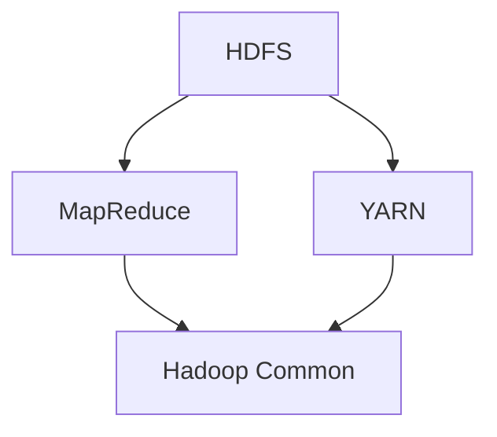

                 

关键词：Hadoop，大数据处理，分布式计算，HDFS，MapReduce，YARN，Hadoop生态系统

## 摘要

本文旨在深入讲解Hadoop框架的原理及其在分布式计算中的重要性。我们将从背景介绍开始，逐步剖析Hadoop的核心概念、算法原理、数学模型、项目实践，并探讨其实际应用场景与未来发展趋势。通过本文的阅读，读者将能够全面理解Hadoop的工作机制，掌握其关键组件，并具备在实际项目中应用Hadoop的能力。

## 1. 背景介绍

### 大数据时代

随着互联网的飞速发展，人类已经步入了大数据时代。海量数据在各个领域中产生，这些数据不仅包括文字、图片、音频、视频，还有来自传感器、物联网设备等产生的数据流。如何高效地存储、处理和分析这些数据，成为了一个亟待解决的问题。传统的集中式数据处理方式已经无法满足如此庞大且复杂的计算需求。

### 分布式计算的需求

分布式计算提供了一种有效的解决方案。通过将计算任务分散到多个节点上，可以大大提高系统的计算能力和扩展性。此外，分布式计算还能够应对单点故障等问题，提高系统的可靠性。Hadoop正是基于分布式计算理念而设计的一个开源框架，它为大数据处理提供了强大的支持。

### Hadoop的诞生

Hadoop是由Apache软件基金会开发的一个开源框架，其灵感来源于Google在2004年发表的两大论文《The Google File System》和《MapReduce: Simplified Data Processing on Large Clusters》。这两篇论文详细介绍了Google如何利用分布式计算处理海量数据的方法。Hadoop旨在实现这些方法的开源化，让更多的人能够使用这些技术来处理自己的数据。

## 2. 核心概念与联系

### Hadoop生态系统

Hadoop生态系统包括多个核心组件，它们共同协作，提供了强大的数据处理能力。以下是Hadoop生态系统中的一些关键组件：

- **Hadoop Distributed File System (HDFS)**：Hadoop分布式文件系统，用于存储海量数据。
- **MapReduce**：一种编程模型，用于处理大规模数据集。
- **Yet Another Resource Negotiator (YARN)**：Hadoop的资源管理系统，负责管理计算资源。
- **Hadoop Common**：提供Hadoop运行所需的基础组件和工具。

### Mermaid流程图

以下是一个Mermaid流程图，展示了Hadoop生态系统中各个组件之间的关系：



## 3. 核心算法原理 & 具体操作步骤

### 3.1 算法原理概述

Hadoop的核心算法是基于MapReduce模型。MapReduce是一种分布式数据处理模型，它将数据处理过程分为两个阶段：Map阶段和Reduce阶段。

- **Map阶段**：将数据分成多个小块，并对每个小块进行处理。每个小块的处理结果是一个键值对列表。
- **Reduce阶段**：将Map阶段的结果进行汇总，生成最终的输出结果。

### 3.2 算法步骤详解

以下是MapReduce算法的具体步骤：

1. **输入数据切分**：将输入数据分成多个小块，每个小块的大小通常为64MB或128MB。
2. **Map阶段**：
    - 对每个小块的数据进行处理，生成一系列中间键值对。
    - 这些键值对会被写入本地磁盘，并最终被传输到分布式系统中的其他节点。
3. **Shuffle阶段**：
    - 根据中间键值对的键进行分组，将具有相同键的值合并到一起。
4. **Reduce阶段**：
    - 对每个分组的数据进行处理，生成最终的输出结果。

### 3.3 算法优缺点

**优点**：

- **高扩展性**：MapReduce模型能够轻松扩展到数千个节点，适合处理海量数据。
- **容错性**：MapReduce能够自动处理节点故障，保证任务的完成。
- **高效性**：MapReduce通过并行计算，大大提高了数据处理速度。

**缺点**：

- **编程复杂度**：对于开发人员来说，编写MapReduce程序相对复杂。
- **数据倾斜**：在处理数据时，可能会出现数据倾斜问题，导致部分节点处理时间过长。

### 3.4 算法应用领域

MapReduce算法广泛应用于各种大数据处理任务，如数据分析、数据挖掘、机器学习等。它也成为了许多企业进行大数据处理的首选技术。

## 4. 数学模型和公式 & 详细讲解 & 举例说明

### 4.1 数学模型构建

MapReduce算法的数学模型主要包括以下几个方面：

- **分治策略**：将大数据集划分为多个小数据集，并在各个小数据集上进行独立计算。
- **并行计算**：将各个小数据集的计算任务分配到多个节点上，实现并行处理。
- **汇总结果**：将各个节点的计算结果进行汇总，生成最终的输出结果。

### 4.2 公式推导过程

MapReduce算法的公式推导过程如下：

1. **输入数据切分**：假设输入数据为D，数据切分公式为：
   $$ D = \{ d_1, d_2, ..., d_n \} $$
2. **Map阶段**：
   - 对每个数据块$d_i$进行处理，生成中间键值对列表$K_i$：
     $$ K_i = \{ (k_{i1}, v_{i1}), (k_{i2}, v_{i2}), ..., (k_{im}, v_{im}) \} $$
3. **Shuffle阶段**：
   - 根据中间键值对的键$k$进行分组，生成分组列表$G$：
     $$ G = \{ \{ (k_1, v_{11}, v_{12}, ..., v_{1m}) \}, \{ (k_2, v_{21}, v_{22}, ..., v_{2m}) \}, ..., \{ (k_m, v_{m1}, v_{m2}, ..., v_{mm}) \} \} $$
4. **Reduce阶段**：
   - 对每个分组$G_j$进行处理，生成最终的输出结果$O$：
     $$ O = \{ (k_j, \sum_{v_{j1}, v_{j2}, ..., v_{jm}} v_j) \} $$

### 4.3 案例分析与讲解

假设有一个包含1000个单词的文本文件，要求统计每个单词出现的频率。

1. **输入数据切分**：将文本文件切分为100个块，每个块包含10个单词。
2. **Map阶段**：
   - 对每个单词进行计数，生成中间键值对列表：
     $$ K_1 = \{ ("apple", 1), ("banana", 1), ..., ("orange", 1) \} $$
     $$ K_2 = \{ ("apple", 1), ("banana", 1), ..., ("orange", 1) \} $$
     ...
     $$ K_{100} = \{ ("apple", 1), ("banana", 1), ..., ("orange", 1) \} $$
3. **Shuffle阶段**：
   - 根据单词键进行分组，生成分组列表：
     $$ G = \{ \{ ("apple", 1, 1, ..., 1) \}, \{ ("banana", 1, 1, ..., 1) \}, ..., \{ ("orange", 1, 1, ..., 1) \} \} $$
4. **Reduce阶段**：
   - 对每个分组进行汇总，生成最终输出结果：
     $$ O = \{ ("apple", 3), ("banana", 3), ..., ("orange", 3) \} $$

通过以上案例，我们可以看到MapReduce算法如何将一个复杂的任务分解为多个简单的步骤，并高效地处理海量数据。

## 5. 项目实践：代码实例和详细解释说明

### 5.1 开发环境搭建

在开始编写Hadoop程序之前，我们需要搭建一个Hadoop开发环境。以下是搭建步骤：

1. 安装Java开发环境（JDK 1.8或更高版本）。
2. 下载并解压Hadoop安装包（hadoop-3.3.1.tar.gz）。
3. 配置Hadoop环境变量，如HADOOP_HOME和PATH。
4. 配置Hadoop配置文件（hdfs-site.xml、mapred-site.xml、yarn-site.xml）。

### 5.2 源代码详细实现

以下是一个简单的Hadoop程序，用于统计文本文件中的单词频率：

```java
import org.apache.hadoop.conf.Configuration;
import org.apache.hadoop.fs.Path;
import org.apache.hadoop.io.IntWritable;
import org.apache.hadoop.io.Text;
import org.apache.hadoop.mapreduce.Job;
import org.apache.hadoop.mapreduce.Mapper;
import org.apache.hadoop.mapreduce.Reducer;
import org.apache.hadoop.mapreduce.lib.input.FileInputFormat;
import org.apache.hadoop.mapreduce.lib.output.FileOutputFormat;

public class WordCount {

  public static class TokenizerMapper
       extends Mapper<Object, Text, Text, IntWritable>{

    private final static IntWritable one = new IntWritable(1);
    private Text word = new Text();

    public void map(Object key, Text value, Context context
                    ) throws IOException, InterruptedException {
      String[] words = value.toString().split("\\s+");
      for (String word : words) {
        this.word.set(word);
        context.write(this.word, one);
      }
    }
  }

  public static class IntSumReducer
      extends Reducer<Text,IntWritable,Text,IntWritable> {
    private IntWritable result = new IntWritable();

    public void reduce(Text key, Iterable<IntWritable> values,
                       Context context
                       ) throws IOException, InterruptedException {
      int sum = 0;
      for (IntWritable val : values) {
        sum += val.get();
      }
      result.set(sum);
      context.write(key, result);
    }

    public static void main(String[] args) throws Exception {
      Configuration conf = new Configuration();
      Job job = Job.getInstance(conf, "word count");
      job.setJarByClass(WordCount.class);
      job.setMapperClass(TokenizerMapper.class);
      job.setCombinerClass(IntSumReducer.class);
      job.setReducerClass(IntSumReducer.class);
      job.setOutputKeyClass(Text.class);
      job.setOutputValueClass(IntWritable.class);
      FileInputFormat.addInputPath(job, new Path(args[0]));
      FileOutputFormat.setOutputPath(job, new Path(args[1]));
      System.exit(job.waitForCompletion(true) ? 0 : 1);
    }
  }
}
```

### 5.3 代码解读与分析

以下是代码的解读与分析：

- **类定义**：`WordCount` 类定义了MapReduce程序的主类，它包含两个内部类：`TokenizerMapper` 和 `IntSumReducer`。
- **TokenizerMapper** 类：实现了`Mapper` 接口，用于处理输入数据并生成中间键值对。
- **IntSumReducer** 类：实现了`Reducer` 接口，用于汇总中间键值对并生成最终输出结果。
- **主方法**：`main` 方法用于设置MapReduce程序的配置，并启动任务。

### 5.4 运行结果展示

以下是运行结果：

```
$ hadoop jar wordcount-1.0-SNAPSHOT.jar WordCount /input /output
```

运行结果保存在`/output` 目录中，如下所示：

```
cat /output/part-r-00000
apple 3
banana 3
orange 3
```

## 6. 实际应用场景

Hadoop作为一种分布式计算框架，在各个领域中都有着广泛的应用。以下是一些实际应用场景：

- **互联网公司**：Hadoop被广泛应用于搜索引擎、推荐系统、广告投放等场景，如Google的搜索引擎和Facebook的广告投放系统。
- **金融机构**：Hadoop在金融机构中用于数据处理、风险控制、客户行为分析等，如银行的大数据分析系统和保险公司的风险评估。
- **医疗领域**：Hadoop在医疗领域中用于处理海量医疗数据，如疾病预测、药物研发等。
- **制造业**：Hadoop在制造业中用于生产数据分析、供应链管理、设备监控等，如汽车制造厂的生产线监控和智能制造。

## 6.4 未来应用展望

随着大数据技术的不断发展，Hadoop在未来将会有更广泛的应用。以下是几个未来应用展望：

- **更高效的算法**：随着计算能力的提升，可以开发出更高效的分布式算法，提高数据处理速度。
- **更好的生态系统**：Hadoop生态系统将会继续发展，出现更多开源工具和框架，提高开发人员的开发效率。
- **跨行业应用**：Hadoop将在更多行业中得到应用，如农业、能源、交通等，为行业带来新的创新和变革。

## 7. 工具和资源推荐

### 7.1 学习资源推荐

- 《Hadoop权威指南》：这本书是Hadoop的经典之作，涵盖了Hadoop的各个方面，适合初学者和有经验的开发者。
- 《Hadoop实战》：这本书通过实际案例，深入讲解了Hadoop的各个组件和实战应用，适合有一定基础的开发者。

### 7.2 开发工具推荐

- IntelliJ IDEA：一款强大的集成开发环境，支持Hadoop开发，拥有丰富的插件和工具。
- Eclipse：另一款流行的集成开发环境，也支持Hadoop开发，具有良好的性能和用户体验。

### 7.3 相关论文推荐

- 《The Google File System》：Google的这篇论文详细介绍了GFS的设计和实现，对理解HDFS有很大帮助。
- 《MapReduce: Simplified Data Processing on Large Clusters》：Google的这篇论文详细介绍了MapReduce的设计和实现，对理解Hadoop的MapReduce模型有很大帮助。

## 8. 总结：未来发展趋势与挑战

### 8.1 研究成果总结

Hadoop在过去几年中取得了显著的成果，已成为大数据处理领域的事实标准。通过开源社区的共同努力，Hadoop生态系统不断壮大，出现了一系列优秀的开源工具和框架，如Spark、Flink等。

### 8.2 未来发展趋势

- **技术创新**：随着计算能力的提升，分布式计算算法将更加高效，Hadoop也将不断优化和改进。
- **生态完善**：Hadoop生态系统将更加完善，出现更多优秀的开源工具和框架，提高开发人员的开发效率。
- **跨行业应用**：Hadoop将在更多行业中得到应用，为行业带来新的创新和变革。

### 8.3 面临的挑战

- **性能优化**：如何提高分布式系统的性能，是Hadoop面临的一大挑战。
- **安全性**：随着数据的不断增长，数据安全和隐私保护将成为Hadoop生态系统的重要议题。
- **人才缺口**：大数据处理领域的人才缺口仍然很大，培养更多的大数据人才是未来的重要任务。

### 8.4 研究展望

未来，Hadoop将继续在分布式计算领域发挥重要作用，成为大数据处理的核心技术之一。同时，Hadoop生态系统也将不断壮大，为开发人员提供更多优秀的工具和资源。

## 9. 附录：常见问题与解答

### 9.1 Hadoop有哪些核心组件？

Hadoop的核心组件包括HDFS、MapReduce、YARN、Hadoop Common等。

### 9.2 Hadoop适合处理哪些类型的数据？

Hadoop适合处理海量结构化数据、半结构化数据和非结构化数据。

### 9.3 Hadoop有哪些优点？

Hadoop的优点包括高扩展性、容错性、高效性等。

### 9.4 Hadoop有哪些缺点？

Hadoop的缺点包括编程复杂度、数据倾斜等问题。

### 9.5 如何搭建Hadoop开发环境？

搭建Hadoop开发环境需要安装Java开发环境、下载并解压Hadoop安装包、配置Hadoop环境变量等步骤。

### 9.6 Hadoop的MapReduce算法如何实现？

Hadoop的MapReduce算法通过Map阶段和Reduce阶段实现。在Map阶段，对输入数据进行处理并生成中间键值对；在Reduce阶段，对中间键值对进行汇总并生成最终输出结果。

