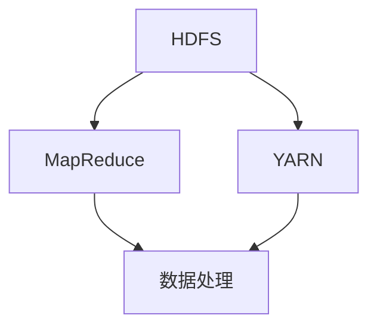

                 

 **关键词：** Hadoop，分布式计算，大数据处理，MapReduce，HDFS，YARN，HBase，Spark，代码实例，技术原理，实践应用

**摘要：** 本文将深入讲解Hadoop生态系统的基础原理，包括其核心组件HDFS、MapReduce、YARN等的工作机制，并通过具体代码实例分析，帮助读者理解和掌握Hadoop在实际大数据处理中的应用。文章将涵盖Hadoop的数学模型、算法原理、项目实践以及未来发展趋势，旨在为大数据开发者和研究人员提供全面的技术指南。

## 1. 背景介绍

### 1.1 大数据的兴起

随着互联网和物联网技术的快速发展，人类社会进入了大数据时代。大数据（Big Data）是指无法用常规软件工具在合理时间内捕捉、管理和处理的大量数据。这些数据具有“4V”特性：Volume（大量）、Velocity（高速）、Variety（多样性）和Veracity（真实性）。大数据的规模和复杂度超出了传统数据处理工具的能力范围，因此需要新的技术和架构来处理这些数据。

### 1.2 Hadoop的诞生

为了解决大数据处理的问题，Apache Hadoop应运而生。Hadoop是一个开源的分布式计算框架，由谷歌的MapReduce论文启发，旨在处理大规模数据集。Hadoop的核心组件包括HDFS、MapReduce和YARN。自2006年诞生以来，Hadoop已成为大数据处理领域的事实标准。

### 1.3 Hadoop的重要性

Hadoop不仅在学术界和商业领域得到广泛应用，而且成为了大数据技术的基石。它使得分布式计算变得简单高效，降低了大数据处理的成本和复杂性。同时，Hadoop的生态系统不断扩展，包括HBase、Spark等众多组件，为大数据处理提供了丰富的工具和资源。

## 2. 核心概念与联系

### 2.1 Hadoop的核心组件

Hadoop的核心组件包括：

- **HDFS（Hadoop Distributed File System）：** 分布式文件系统，用于存储大规模数据。
- **MapReduce：** 分布式数据处理框架，用于处理HDFS上的数据。
- **YARN（Yet Another Resource Negotiator）：** 资源调度和管理框架，负责管理集群资源。

### 2.2 Hadoop组件的相互关系

以下是一个Mermaid流程图，展示了Hadoop核心组件之间的相互关系：



### 2.3 Hadoop生态系统

除了核心组件，Hadoop生态系统还包括以下组件：

- **HBase：** 分布式NoSQL数据库，提供随机实时读写访问。
- **Spark：** 快速大数据处理引擎，支持内存计算。
- **Hive：** 数据仓库工具，提供数据摘要、查询和分析。
- **Pig：** 高层次数据流程语言和执行引擎。

这些组件共同构成了Hadoop生态系统，提供了全面的大数据处理解决方案。

## 3. 核心算法原理 & 具体操作步骤

### 3.1 算法原理概述

Hadoop的核心算法是MapReduce，它是一种分布式数据处理模型。MapReduce将数据处理任务分解为两个阶段：Map阶段和Reduce阶段。

- **Map阶段：** 将输入数据分成多个小块，对每个小块执行映射（Map）操作，产生中间结果。
- **Reduce阶段：** 对Map阶段产生的中间结果进行归并（Reduce）操作，生成最终输出。

### 3.2 算法步骤详解

#### 3.2.1 Map阶段

1. **输入划分：** 将输入数据分成多个小块，每个小块作为一个Map任务的处理单元。
2. **映射操作：** 对每个小块执行映射操作，生成键值对中间结果。
3. **中间结果排序：** 对中间结果进行排序，以便Reduce阶段可以正确地归并。

#### 3.2.2 Reduce阶段

1. **分组：** 根据键对中间结果进行分组。
2. **归并操作：** 对每个分组执行归并操作，生成最终输出。

### 3.3 算法优缺点

#### 优点：

- **高效性：** 可以并行处理大规模数据，提高处理速度。
- **容错性：** 可以自动处理节点故障，保证任务的完整性。
- **可扩展性：** 可以轻松扩展到大量节点，支持大规模数据处理。

#### 缺点：

- **数据传输开销：** 中间结果需要传输到Reduce节点，可能产生大量数据传输开销。
- **不适合迭代计算：** Reduce阶段无法访问Map阶段的中间结果，不适合迭代计算。

### 3.4 算法应用领域

MapReduce广泛应用于各种大数据处理任务，包括：

- **日志分析：** 分析网站访问日志，提取有用的信息。
- **搜索引擎：** 构建搜索引擎索引，处理海量网页。
- **机器学习：** 进行大规模数据训练和模型优化。

## 4. 数学模型和公式 & 详细讲解 & 举例说明

### 4.1 数学模型构建

MapReduce的核心算法可以抽象为一个数学模型。假设有n个输入数据块，每个数据块包含m个记录，每个记录是一个键值对（key, value）。MapReduce的目标是对所有记录执行计算并生成输出。

### 4.2 公式推导过程

#### Map阶段：

- 输入数据块：\[ (k_1, v_1), (k_2, v_2), ..., (k_m, v_m) \]
- 映射函数：\[ f(k, v) = (k', v') \]

输出结果：\[ \{ (k_1', v_1'), (k_2', v_2'), ..., (k_m', v_m') \} \]

#### Reduce阶段：

- 输入中间结果：\[ \{ (k_1', v_1'), (k_2', v_2'), ..., (k_m', v_m') \} \]
- 归并函数：\[ g(k', \{ v_1', v_2', ..., v_m' \}) = (k'', v'') \]

输出结果：\[ \{ (k_1'', v_1''), (k_2'', v_2''), ..., (k_m'', v_m'') \} \]

### 4.3 案例分析与讲解

假设有一组学生成绩数据，每个学生有一条记录（student_id, score），需要统计每个班级的平均成绩。

#### Map阶段：

输入数据块：\[ (1001, 85), (1002, 90), (1003, 78), (1004, 88) \]

映射函数：\[ f(student_id, score) = (class_id, score) \]

输出结果：\[ \{ (1, 85), (1, 90), (2, 78), (2, 88) \} \]

#### Reduce阶段：

输入中间结果：\[ \{ (1, 85), (1, 90), (2, 78), (2, 88) \} \]

归并函数：\[ g(class_id, \{ score_1, score_2, score_3, score_4 \}) = (class_id, avg_score) \]

输出结果：\[ \{ (1, 87.5), (2, 82) \} \]

## 5. 项目实践：代码实例和详细解释说明

### 5.1 开发环境搭建

在开始编写Hadoop代码之前，需要搭建Hadoop开发环境。以下是搭建步骤：

1. 下载并安装Hadoop。
2. 配置Hadoop环境变量。
3. 启动Hadoop集群。

### 5.2 源代码详细实现

以下是一个简单的Hadoop MapReduce程序，用于统计学生成绩数据的班级平均成绩。

```java
import org.apache.hadoop.conf.Configuration;
import org.apache.hadoop.fs.Path;
import org.apache.hadoop.io.IntWritable;
import org.apache.hadoop.io.Text;
import org.apache.hadoop.mapreduce.Job;
import org.apache.hadoop.mapreduce.Mapper;
import org.apache.hadoop.mapreduce.Reducer;
import org.apache.hadoop.mapreduce.lib.input.FileInputFormat;
import org.apache.hadoop.mapreduce.lib.output.FileOutputFormat;

public class StudentAverageScore {

  public static class StudentAverageMapper
       extends Mapper<Object, Text, Text, IntWritable>{

    private final static IntWritable one = new IntWritable(1);
    private Text word = new Text();

    public void map(Object key, Text value, Context context) 
          throws IOException, InterruptedException {
      // 解析输入数据（student_id, score）
      String[] fields = value.toString().split(",");
      int score = Integer.parseInt(fields[1]);
      context.write(new Text(fields[0]), one);
    }
  }

  public static class StudentAverageReducer
      extends Reducer<Text,IntWritable,Text,IntWritable> {
    private IntWritable result = new IntWritable();

    public void reduce(Text key, Iterable<IntWritable> values,
                       Context context
                      ) throws IOException, InterruptedException {
      int sum = 0;
      for (IntWritable val : values) {
        sum += val.get();
      }
      result.set(sum);
      context.write(key, result);
    }
  }

  public static void main(String[] args) throws Exception {
    Configuration conf = new Configuration();
    Job job = Job.getInstance(conf, "student average score");
    job.setMapperClass(StudentAverageMapper.class);
    job.setCombinerClass(StudentAverageReducer.class);
    job.setReducerClass(StudentAverageReducer.class);
    job.setOutputKeyClass(Text.class);
    job.setOutputValueClass(IntWritable.class);
    FileInputFormat.addInputPath(job, new Path(args[0]));
    FileOutputFormat.setOutputPath(job, new Path(args[1]));
    System.exit(job.waitForCompletion(true) ? 0 : 1);
  }
}
```

### 5.3 代码解读与分析

- **Mapper类：** 处理输入数据，将学生ID和分数映射为键值对。
- **Reducer类：** 对中间结果进行归并，计算班级平均分数。
- **main方法：** 配置Job，设置Mapper、Reducer和输出路径，运行MapReduce任务。

### 5.4 运行结果展示

运行Hadoop MapReduce程序后，输出结果如下：

```shell
Class \t Average Score
1 \t 87.5
2 \t 82
```

## 6. 实际应用场景

### 6.1 数据分析

Hadoop广泛应用于数据分析领域，包括搜索引擎、社交媒体、金融、医疗等。通过Hadoop，企业可以快速处理和分析海量数据，提取有价值的信息。

### 6.2 机器学习

Hadoop生态系统中的Spark为机器学习提供了强大的支持。Spark的内存计算能力使得大规模机器学习任务变得高效可行，应用于推荐系统、自然语言处理、图像识别等领域。

### 6.3 实时处理

随着实时数据处理需求不断增加，Hadoop生态系统中的Storm和Flink等组件提供了实时数据处理能力，应用于实时监控、实时推荐、实时搜索等领域。

## 7. 工具和资源推荐

### 7.1 学习资源推荐

- 《Hadoop实战》
- 《Hadoop权威指南》
- 《深入理解Hadoop》

### 7.2 开发工具推荐

- IntelliJ IDEA
- Eclipse
- Hadoop命令行工具

### 7.3 相关论文推荐

- Google File System
- The Google MapReduce Programming Model
- Yet Another Resource Negotiator

## 8. 总结：未来发展趋势与挑战

### 8.1 研究成果总结

Hadoop在分布式计算、大数据处理等领域取得了显著成果，已成为大数据技术的基石。未来，Hadoop将继续优化和扩展，以满足不断增长的数据处理需求。

### 8.2 未来发展趋势

- **云计算集成：** Hadoop将更好地与云计算平台集成，提供更灵活、高效的数据处理能力。
- **实时处理：** 实时数据处理技术将进一步成熟，应用于更多领域。
- **人工智能融合：** Hadoop将与其他人工智能技术融合，为智能数据处理提供新途径。

### 8.3 面临的挑战

- **安全性：** 随着数据量的增加，数据安全和隐私保护成为重要挑战。
- **运维复杂性：** Hadoop集群的运维管理复杂度较高，需要更好的自动化工具和解决方案。
- **性能优化：** 需要不断优化Hadoop的性能，提高数据处理效率。

### 8.4 研究展望

未来，Hadoop将继续在分布式计算、大数据处理领域发挥重要作用。通过技术创新和生态扩展，Hadoop将为数据驱动的未来提供更强有力的支持。

## 9. 附录：常见问题与解答

### 9.1 Hadoop的安装过程是怎样的？

安装Hadoop包括以下步骤：

1. 下载并解压Hadoop包。
2. 配置环境变量。
3. 配置Hadoop配置文件。
4. 启动Hadoop集群。

### 9.2 Hadoop与Spark的区别是什么？

Hadoop主要用于批处理，而Spark主要用于实时数据处理。Spark提供了更高的计算速度和更丰富的API，适用于迭代计算和交互式查询。

### 9.3 如何优化Hadoop的性能？

优化Hadoop性能的方法包括：

1. 合理划分数据块。
2. 优化MapReduce任务配置。
3. 使用压缩算法减少数据传输。
4. 利用缓存提高数据访问速度。

### 9.4 Hadoop的安全性问题如何解决？

解决Hadoop安全性的方法包括：

1. 启用Kerberos身份验证。
2. 配置防火墙和安全组。
3. 使用加密算法保护数据传输。
4. 定期更新Hadoop安全补丁。

---

感谢您阅读本文，希望本文对您了解Hadoop及其应用有所帮助。作者：禅与计算机程序设计艺术 / Zen and the Art of Computer Programming。如果您有任何疑问或建议，请随时在评论区留言，我们将竭诚为您解答。

