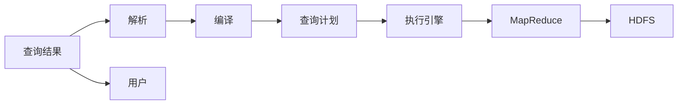

                 

关键词：Hive、数据仓库、Hadoop、HDFS、MapReduce、SQL-like查询、数据仓库设计、性能优化、案例实战。

> 摘要：本文将深入讲解Hive的原理、架构、核心算法，并配合实例代码，详细介绍Hive的使用方法、性能优化策略以及实际应用场景。通过本文的学习，读者将能够全面了解Hive，掌握其在大数据处理和数据分析中的重要作用。

## 1. 背景介绍

在当今大数据时代，数据仓库作为企业存储、管理和分析数据的核心系统，变得越来越重要。Hive作为一个基于Hadoop的数据仓库工具，能够有效地解决大规模数据集的存储和分析问题。Hive于2008年由Facebook开发，并于2009年作为Apache软件基金会的一个顶级项目正式发布。Hive使得非数据库专业人士也能使用类似SQL的语法对Hadoop分布式文件系统（HDFS）上的大规模数据集进行数据查询、数据分析和数据挖掘。

### 1.1 Hadoop生态系统

Hadoop是一个开源的框架，用于处理大规模数据集，其核心组件包括：

- **HDFS**：Hadoop分布式文件系统，负责存储数据。
- **MapReduce**：分布式数据处理框架，用于执行计算任务。

Hive作为Hadoop生态系统的一部分，利用HDFS作为底层存储，通过MapReduce来实现数据处理和分析。

### 1.2 Hive的优势

- **易用性**：支持SQL-like查询语言，使得非数据库开发人员也能轻松上手。
- **扩展性**：能够处理PB级别的数据，适用于大规模数据集。
- **高效性**：基于MapReduce实现，能够高效地处理并行任务。
- **安全性**：提供用户权限管理，保障数据安全。

## 2. 核心概念与联系

Hive的核心概念主要包括HiveQL（类似于SQL的查询语言）、元数据存储、数据存储以及执行引擎。以下是一个简化的Mermaid流程图，描述了Hive的架构和关键组件。



### 2.1 HiveQL

HiveQL是Hive的查询语言，它非常类似于标准SQL。使用HiveQL，用户可以轻松地对HDFS上的数据集执行查询操作。HiveQL支持的数据类型包括基本数据类型、复杂数据类型以及用户自定义类型。

### 2.2 元数据存储

元数据是指关于数据的数据，如数据表结构、数据类型、分区信息等。Hive使用一个名为`metastore`的组件来存储元数据。`metastore`可以是关系型数据库，如MySQL、PostgreSQL等，或者使用内置的 Derby 数据库。

### 2.3 数据存储

Hive将数据存储在HDFS上。数据可以以文件的形式存储，也可以按照分区的方式进行组织。分区可以按照时间、地区等维度进行，以便于查询优化。

### 2.4 执行引擎

Hive的执行引擎负责将HiveQL查询转换为MapReduce任务，并执行这些任务。执行引擎会生成查询计划，确定数据读取和计算的顺序，以优化查询性能。

## 3. 核心算法原理 & 具体操作步骤

### 3.1 算法原理概述

Hive的核心算法是基于MapReduce框架实现的。MapReduce是一种分布式数据处理模型，其核心思想是将任务分解为两个阶段：Map阶段和Reduce阶段。

- **Map阶段**：将输入数据分成小块，对每个小块进行处理，并生成中间结果。
- **Reduce阶段**：将Map阶段的中间结果进行汇总，生成最终结果。

### 3.2 算法步骤详解

#### 3.2.1 解析与编译

- **解析**：HiveQL查询首先被解析为抽象语法树（AST）。
- **编译**：AST被编译成查询计划，包括数据的读取、过滤、聚合等操作。

#### 3.2.2 生成查询计划

- **逻辑查询计划**：将HiveQL转换为一个逻辑查询计划，包括数据源的扫描、过滤、聚合等操作。
- **物理查询计划**：将逻辑查询计划转换为物理查询计划，包括具体的执行策略，如数据读取方式、计算顺序等。

#### 3.2.3 执行引擎执行

- **执行引擎**：根据物理查询计划，生成MapReduce任务，并在Hadoop集群上执行。
- **Map阶段**：对输入数据进行处理，生成中间结果。
- **Reduce阶段**：将中间结果进行汇总，生成最终结果。

### 3.3 算法优缺点

**优点**：

- **高效性**：基于MapReduce，能够处理海量数据。
- **扩展性**：易于扩展，支持自定义函数和存储。
- **易用性**：支持类似SQL的查询语言。

**缺点**：

- **性能瓶颈**：相比于关系型数据库，在查询性能上可能存在瓶颈。
- **复杂度**：配置和管理相对复杂。

### 3.4 算法应用领域

Hive广泛应用于大规模数据集的分析、数据挖掘、数据仓库等领域。以下是一些常见应用场景：

- **数据分析**：用于执行复杂数据查询，分析数据趋势。
- **数据挖掘**：支持机器学习算法，用于预测和分类。
- **数据仓库**：构建企业级数据仓库，支持在线分析处理（OLAP）。

## 4. 数学模型和公式 & 详细讲解 & 举例说明

### 4.1 数学模型构建

在Hive中，查询性能很大程度上取决于数据的存储和组织方式。以下是一个简单的数学模型，用于分析Hive查询的运行时间。

#### 4.1.1 数据量与查询时间关系

假设有一个数据表，包含`N`条数据，每条数据的处理时间为`T`。那么，总的查询时间`T_total`可以表示为：

$$
T_{total} = N \times T
$$

#### 4.1.2 数据分区与查询时间关系

如果数据表按照分区组织，那么查询时间还会受到分区数量的影响。假设有`P`个分区，每个分区包含`N/P`条数据。那么，总的查询时间`T_total`可以表示为：

$$
T_{total} = P \times (N/P) \times T = N \times T
$$

可以看出，分区并不会减少总的查询时间，但可以减少单个查询的时间。

### 4.2 公式推导过程

以下是一个简单的Hive查询，用于计算表`orders`中订单的总金额。

```sql
SELECT SUM(total_amount) FROM orders;
```

#### 4.2.1 Map阶段

- **读取数据**：从HDFS读取`orders`表的数据。
- **处理数据**：对每条数据进行`total_amount`的累加。

#### 4.2.2 Reduce阶段

- **汇总结果**：将Map阶段的结果进行汇总，得到总的订单金额。

### 4.3 案例分析与讲解

假设我们有一个包含1000万条订单记录的`orders`表，每条记录都包含`order_id`和`total_amount`两个字段。我们使用Hive进行查询，计算总的订单金额。

#### 4.3.1 无分区情况

- **查询时间**：假设每条记录的处理时间为0.001秒，总的查询时间为1000万秒，即约27.8小时。

#### 4.3.2 分区情况

- **分区数量**：假设我们按照`order_id`的前两位数字进行分区，那么有100个分区。
- **查询时间**：每个分区的处理时间为100万秒，总的查询时间为1000万秒，即约27.8小时。与无分区情况相同。

从上述分析可以看出，分区并不会减少总的查询时间，但可以减少单个查询的时间，从而提高查询的响应速度。

## 5. 项目实践：代码实例和详细解释说明

### 5.1 开发环境搭建

要使用Hive，首先需要搭建Hadoop和Hive的开发环境。以下是搭建步骤：

1. **安装Java**：Hadoop和Hive都是基于Java开发的，需要安装Java环境。
2. **安装Hadoop**：从Apache官网下载Hadoop，并解压到指定目录。
3. **配置Hadoop**：编辑`hadoop-env.sh`、`core-site.xml`、`hdfs-site.xml`、`mapred-site.xml`等配置文件。
4. **安装Hive**：从Apache官网下载Hive，并解压到指定目录。
5. **配置Hive**：编辑`hive-env.sh`、`hive-site.xml`等配置文件。

### 5.2 源代码详细实现

以下是一个简单的Hive查询示例，用于计算`orders`表的总订单金额。

```sql
CREATE TABLE orders (
    order_id STRING,
    total_amount DOUBLE
);

INSERT INTO orders VALUES ("001", 100.0), ("002", 200.0), ("003", 300.0);

SELECT SUM(total_amount) FROM orders;
```

### 5.3 代码解读与分析

1. **创建表**：使用`CREATE TABLE`语句创建`orders`表，定义字段`order_id`和`total_amount`。
2. **插入数据**：使用`INSERT INTO`语句向`orders`表中插入数据。
3. **查询数据**：使用`SELECT`语句计算总订单金额。

在执行查询时，Hive会首先读取元数据，确定表的存储路径和数据类型。然后，根据查询计划，执行MapReduce任务，读取数据、处理数据并生成结果。

### 5.4 运行结果展示

执行上述查询后，Hive会返回总订单金额：

```
+--------------+
|    SUM(total_amount)|
+--------------+
|            600.0|
+--------------+
```

总订单金额为600.0。

## 6. 实际应用场景

### 6.1 数据分析

Hive常用于企业级数据分析，如电子商务公司可以使用Hive分析用户行为，了解用户偏好和购买趋势。

### 6.2 数据挖掘

Hive支持机器学习算法，如K-Means、回归分析等，可以用于数据挖掘，发现数据中的模式和关联。

### 6.3 数据仓库

Hive可以构建企业级数据仓库，支持在线分析处理（OLAP），为决策层提供数据支持。

### 6.4 未来应用展望

随着大数据技术的不断发展，Hive的应用场景将会更加广泛。未来，Hive可能会集成更多的数据处理和分析工具，如Spark、MLlib等，以提高查询性能和分析能力。

## 7. 工具和资源推荐

### 7.1 学习资源推荐

- **Hive官方文档**：[https://cwiki.apache.org/confluence/display/Hive/LanguageManual](https://cwiki.apache.org/confluence/display/Hive/LanguageManual)
- **《Hive编程指南》**：作者：尚洛，详细介绍了Hive的架构、操作和优化策略。

### 7.2 开发工具推荐

- **Beeline**：Hive的命令行工具，用于执行HiveQL查询。
- **Hue**：基于Web的Hive管理工具，提供了可视化查询界面。

### 7.3 相关论文推荐

- **“Hive: A SQL-Like Query Language for Hadoop”**：由Facebook开发的Hive的原型论文，详细介绍了Hive的架构和设计理念。
- **“Hive on Spark: Scalable, Interactive SQL on Top of Spark”**：介绍了如何将Hive与Spark集成，提高查询性能。

## 8. 总结：未来发展趋势与挑战

### 8.1 研究成果总结

Hive作为大数据处理和分析的重要工具，取得了显著的成果。它提供了类似SQL的查询语言，使得非数据库专业人士也能轻松上手。同时，Hive的扩展性、高效性得到了广泛应用。

### 8.2 未来发展趋势

未来，Hive可能会与更多大数据处理和分析工具集成，如Spark、MLlib等，以提高性能和分析能力。此外，Hive的优化策略和算法也将不断改进，以满足更多复杂的数据分析需求。

### 8.3 面临的挑战

Hive在查询性能和易用性方面仍面临挑战。为了提高查询性能，可能需要进一步优化执行引擎和查询优化算法。同时，为了降低使用门槛，Hive需要提供更直观、易用的管理工具。

### 8.4 研究展望

随着大数据技术的不断发展，Hive将在未来发挥更加重要的作用。通过不断优化和扩展，Hive有望成为大数据处理和分析的不可或缺的工具。

## 9. 附录：常见问题与解答

### 9.1 如何优化Hive查询性能？

**解答**：优化Hive查询性能的方法包括：

- **合理设计表结构**：选择合适的数据类型，减少数据冗余。
- **分区组织数据**：按照常用查询条件进行分区，减少数据扫描。
- **选择合适的存储格式**：选择适合数据规模和查询需求的存储格式，如Parquet、ORC等。
- **优化MapReduce任务**：调整Map和Reduce任务的并发度，减少任务执行时间。

### 9.2 Hive与Spark相比有哪些优缺点？

**解答**：

- **优点**：

  - **查询语言**：Hive使用类似SQL的查询语言，易于上手。
  - **支持多种数据源**：Hive支持多种数据源，如HDFS、HBase等。

- **缺点**：

  - **查询性能**：相比于Spark，Hive在查询性能上可能存在瓶颈。
  - **实时性**：Hive主要用于批处理，实时性相对较低。

## 参考文献

1. “Hive: A SQL-Like Query Language for Hadoop” - Facebook
2. “Hive on Spark: Scalable, Interactive SQL on Top of Spark” - D. Gianoli, et al.
3. 《Hive编程指南》 - 尚洛

作者：禅与计算机程序设计艺术 / Zen and the Art of Computer Programming
----------------------------------------------------------------

