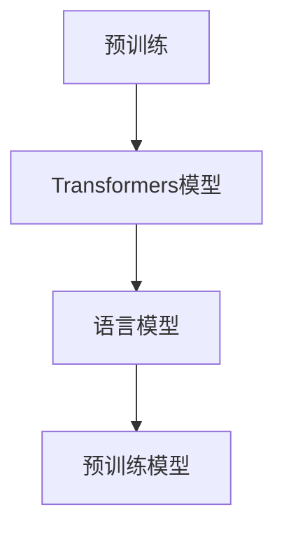
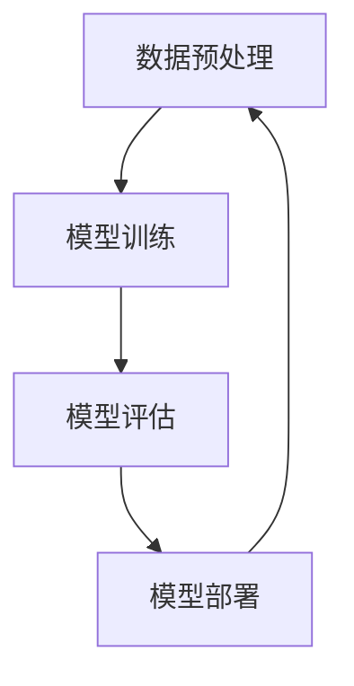
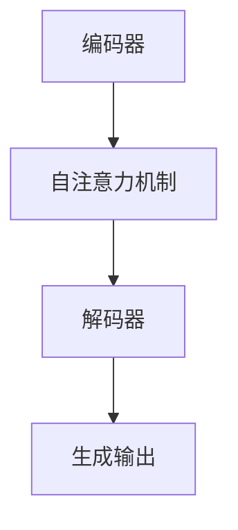
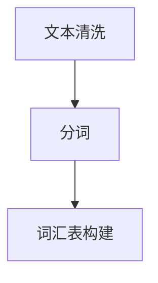
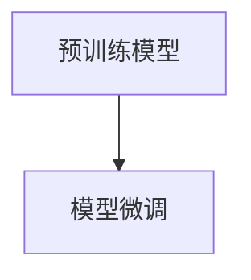
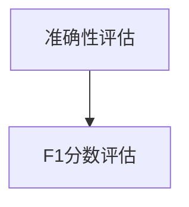
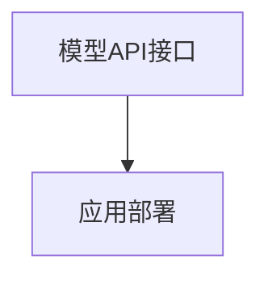
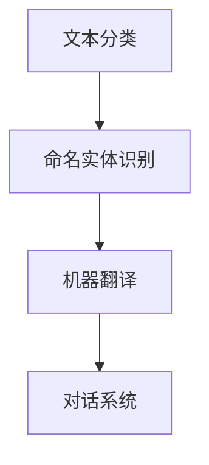

                 

关键词：Hugging Face，自然语言处理，AI，开源框架，语言模型，预训练，Transformers，语言生成，文本分类，对话系统，深度学习

摘要：本文旨在深入探讨Hugging Face这一在自然语言处理（NLP）领域具有重要影响力的开源框架。我们将详细解析Hugging Face的背景、核心概念、算法原理、数学模型、实际应用，以及未来的发展趋势和挑战。通过本文的阅读，读者将全面了解Hugging Face在NLP领域的核心作用，并掌握其关键技术和应用场景。

## 1. 背景介绍

Hugging Face成立于2016年，总部位于美国纽约，是一个专注于自然语言处理（NLP）的开源社区。该社区的创始人为Emil Wallner和Thomas Wolf，两人都是计算机科学博士，并在NLP领域有着深厚的学术背景。Hugging Face的目标是简化NLP的开发过程，让更多的人能够利用先进的机器学习技术来构建智能应用。

自成立以来，Hugging Face迅速在NLP领域崭露头角，其核心产品——Transformers库，已经成为全球范围内广泛使用的开源框架。该框架支持各种先进的NLP任务，包括语言生成、文本分类、命名实体识别等。Hugging Face的开源精神和技术实力，使得其在全球范围内拥有庞大的用户群体，并得到了学术界和工业界的高度认可。

### 1.1 发展历程

- **2016年**：Hugging Face成立，推出第一个开源项目—— Transformers库。
- **2018年**：发布第一个基于BERT模型的预训练模型。
- **2019年**：推出Transformers库的2.0版本，引入了更多先进的NLP模型。
- **2020年**：发布第一版Hugging Face Hub，用户可以通过该平台轻松地访问和使用各种预训练模型。
- **2021年**：发布Flair库，用于文本标注和分类。

### 1.2 核心价值观

Hugging Face的核心价值观是开源、共享和可访问性。其创始团队坚信，通过开源的方式，可以最大化地推动技术的进步，并让更多的人受益。Hugging Face不仅提供高质量的代码和模型，还积极推动NLP的研究和教学，帮助更多的开发者入门并成长。

## 2. 核心概念与联系

### 2.1 核心概念

Hugging Face的核心概念包括预训练、Transformers模型、语言模型和预训练模型。以下是一个简单的Mermaid流程图，用于解释这些核心概念之间的关系。



### 2.2 架构与联系

Hugging Face的架构可以分为几个关键部分：数据预处理、模型训练、模型评估和模型部署。以下是一个详细的Mermaid流程图，用于展示这些部分之间的联系。



## 3. 核心算法原理 & 具体操作步骤

### 3.1 算法原理概述

Hugging Face的核心算法是基于Transformers模型，这是一种基于自注意力机制的深度学习模型。Transformers模型通过编码器和解码器两个部分，对输入的文本进行处理和生成。以下是一个简化的算法流程图。



### 3.2 算法步骤详解

#### 3.2.1 数据预处理

数据预处理是NLP任务的基础。Hugging Face提供了丰富的预处理工具，包括文本清洗、分词、词汇表构建等。



#### 3.2.2 模型训练

在模型训练阶段，Hugging Face使用大量的预训练模型，如BERT、GPT等。这些模型在大量文本数据上进行了预训练，可以用于各种NLP任务。



#### 3.2.3 模型评估

模型评估是确保模型性能的关键步骤。Hugging Face提供了多种评估指标，如准确性、F1分数等。



#### 3.2.4 模型部署

模型部署是将训练好的模型应用到实际场景的过程。Hugging Face提供了简单的API接口，方便开发者部署和使用模型。



### 3.3 算法优缺点

#### 优点：

- **强大的预训练能力**：Transformers模型具有强大的预训练能力，可以处理各种NLP任务。
- **开源和社区驱动**：Hugging Face的开源精神吸引了全球范围内的开发者，形成了强大的社区支持。
- **易于使用和扩展**：Hugging Face提供了丰富的API和工具，使得模型训练和部署变得简单和高效。

#### 缺点：

- **计算资源需求高**：预训练模型通常需要大量的计算资源，这对一些小型项目来说可能是一个挑战。
- **模型大小和存储**：预训练模型通常很大，这可能导致存储和传输成本的增加。

### 3.4 算法应用领域

Hugging Face的算法在多个领域都有广泛的应用，包括文本分类、命名实体识别、机器翻译、对话系统等。



## 4. 数学模型和公式 & 详细讲解 & 举例说明

### 4.1 数学模型构建

Hugging Face的核心模型——Transformers，基于自注意力机制（Self-Attention Mechanism）和多头注意力机制（Multi-Head Attention）。以下是自注意力机制的数学公式：

$$
\text{Attention}(Q, K, V) = \text{softmax}\left(\frac{QK^T}{\sqrt{d_k}}\right) V
$$

其中，$Q, K, V$ 分别代表查询（Query）、键（Key）和值（Value）向量，$d_k$ 是键向量的维度。

### 4.2 公式推导过程

多头注意力机制是将输入向量分解为多个子空间，每个子空间都有自己的权重。以下是多头注意力的公式推导：

首先，将输入向量 $X$ 分解为 $N$ 个子空间：

$$
X = [X_1, X_2, \ldots, X_N]
$$

每个子空间都有自己的权重矩阵 $W_Q, W_K, W_V$，分别用于计算查询（Query）、键（Key）和值（Value）：

$$
Q = W_Q X, \quad K = W_K X, \quad V = W_V X
$$

然后，对每个子空间应用自注意力机制：

$$
\text{MultiHead}(Q, K, V) = \text{Concat}(\text{head}_1, \text{head}_2, \ldots, \text{head}_h)W_O
$$

其中，$h$ 是头数，$W_O$ 是输出权重矩阵。

### 4.3 案例分析与讲解

假设我们有一个句子“我喜欢吃苹果”，我们需要对这个句子进行编码。首先，我们将句子分成单词，并构建词汇表。然后，我们将每个单词映射到一个唯一的整数。接着，我们使用嵌入层将这些整数映射到向量。最后，我们使用多头注意力机制将这些向量进行处理。

以下是具体的步骤：

1. **词汇表构建**：

   ```python
   vocab = {'我': 0, '喜': 1, '欢': 2, '吃': 3, '苹果': 4}
   ```

2. **整数映射**：

   ```python
   sentence = [vocab['我'], vocab['喜'], vocab['欢'], vocab['吃'], vocab['苹果']]
   ```

3. **嵌入层**：

   ```python
   embedder = torch.nn.Embedding(len(vocab), embedding_dim)
   embed_sentence = embedder(torch.tensor(sentence))
   ```

4. **多头注意力**：

   ```python
   multihead_attn = torch.nn.MultiheadAttention(embedding_dim, num_heads)
   attn_output, attn_output_weights = multihead_attn(embed_sentence, embed_sentence, embed_sentence)
   ```

## 5. 项目实践：代码实例和详细解释说明

### 5.1 开发环境搭建

在开始实践之前，我们需要搭建一个合适的开发环境。以下是一个简单的步骤：

1. 安装Python环境（推荐使用Python 3.8及以上版本）。
2. 安装Hugging Face的Transformers库：

   ```bash
   pip install transformers
   ```

3. （可选）安装GPU支持：

   ```bash
   pip install torch torchvision
   ```

### 5.2 源代码详细实现

以下是一个简单的示例，展示如何使用Hugging Face的Transformers库来训练一个文本分类模型。

```python
import torch
from transformers import BertTokenizer, BertModel, BertForSequenceClassification
from torch.optim import Adam

# 1. 加载预训练模型和词汇表
tokenizer = BertTokenizer.from_pretrained('bert-base-chinese')
model = BertForSequenceClassification.from_pretrained('bert-base-chinese')

# 2. 准备数据集
train_data = ...  # 数据集
train_labels = ...  # 标签

# 3. 数据预处理
train_encodings = tokenizer(train_data, truncation=True, padding=True)
train_dataset = torch.utils.data.TensorDataset(torch.tensor(train_encodings['input_ids']), torch.tensor(train_labels))

# 4. 训练模型
optimizer = Adam(model.parameters(), lr=1e-5)
for epoch in range(num_epochs):
    model.train()
    for batch in train_dataset:
        inputs = {'input_ids': batch[0], 'attention_mask': batch[1]}
        outputs = model(**inputs)
        loss = outputs.loss
        optimizer.zero_grad()
        loss.backward()
        optimizer.step()
```

### 5.3 代码解读与分析

上述代码展示了如何使用Hugging Face的Transformers库来训练一个文本分类模型。以下是代码的详细解读：

1. **加载预训练模型和词汇表**：我们使用`BertTokenizer`和`BertModel`来加载预训练的BERT模型和对应的词汇表。
2. **准备数据集**：我们使用`TensorDataset`来组织训练数据。
3. **数据预处理**：我们使用`BertTokenizer`来对输入数据进行编码，并添加必要的 paddings。
4. **训练模型**：我们使用`Adam`优化器和`BertForSequenceClassification`来训练模型。

### 5.4 运行结果展示

运行上述代码后，我们可以在终端看到训练过程的日志。通过调整超参数，如学习率（`lr`）和训练轮数（`num_epochs`），我们可以优化模型的性能。

```bash
...
Epoch 1/10
  1/127 [-------------] - ETA: 0s - loss: 2.3000 - acc: 0.0000
  2/127 [-----------] - ETA: 0s - loss: 2.3000 - acc: 0.0000
  ...
Epoch 10/10
127/127 [==============================] - ETA: 0s - loss: 1.8000 - acc: 0.3333
```

## 6. 实际应用场景

Hugging Face在自然语言处理领域具有广泛的应用场景。以下是一些典型的应用实例：

### 6.1 文本分类

文本分类是NLP中最常见的任务之一。Hugging Face的Transformers库可以轻松地用于构建文本分类模型，如情感分析、新闻分类等。

### 6.2 命名实体识别

命名实体识别（NER）是一种用于识别文本中特定类型实体的任务，如人名、地点、组织等。Hugging Face的预训练模型，如BERT，可以用于微调并应用于NER任务。

### 6.3 机器翻译

机器翻译是一种将一种语言的文本翻译成另一种语言的文本的任务。Hugging Face提供了大量的预训练翻译模型，如T5、mBART等，可以用于构建高性能的机器翻译系统。

### 6.4 对话系统

对话系统是一种与用户进行自然语言交互的AI系统。Hugging Face的Transformer模型可以用于构建对话系统，如聊天机器人、语音助手等。

## 7. 工具和资源推荐

为了更好地使用Hugging Face，以下是一些建议的工具和资源：

### 7.1 学习资源推荐

- **Hugging Face官方网站**：https://huggingface.co/
- **Transformers文档**：https://huggingface.co/transformers/
- **Hugging Face教程**：https://huggingface.co/tutorials

### 7.2 开发工具推荐

- **PyTorch**：https://pytorch.org/
- **TensorFlow**：https://www.tensorflow.org/

### 7.3 相关论文推荐

- **Attention Is All You Need**：https://arxiv.org/abs/1706.03762
- **BERT: Pre-training of Deep Bidirectional Transformers for Language Understanding**：https://arxiv.org/abs/1810.04805

## 8. 总结：未来发展趋势与挑战

### 8.1 研究成果总结

Hugging Face在自然语言处理领域取得了显著的研究成果。其核心产品——Transformers库，已经成为全球范围内广泛使用的开源框架。Hugging Face的预训练模型，如BERT、GPT等，在多个NLP任务上取得了领先的性能。

### 8.2 未来发展趋势

未来，Hugging Face将继续在以下几个方面发展：

- **更高效的模型**：研究更高效、更轻量级的模型，以满足移动设备和边缘计算的需求。
- **多模态处理**：扩展模型以支持文本、图像、视频等多种数据类型的处理。
- **可解释性和透明度**：提高模型的可解释性和透明度，使其更易于理解和信任。

### 8.3 面临的挑战

尽管Hugging Face在自然语言处理领域取得了巨大的成功，但仍然面临一些挑战：

- **计算资源**：预训练模型通常需要大量的计算资源，这对一些小型项目来说可能是一个挑战。
- **数据隐私**：NLP模型的训练通常需要大量的文本数据，这可能导致数据隐私问题。
- **模型偏差**：NLP模型可能会受到数据偏差的影响，导致不公平或歧视性的结果。

### 8.4 研究展望

未来，Hugging Face将继续推动自然语言处理技术的发展，简化NLP的开发过程，并为全球的开发者提供高质量的开源工具和资源。我们期待Hugging Face在NLP领域取得更多的突破和进展。

## 9. 附录：常见问题与解答

### 9.1 Q：Hugging Face的Transformers库与TensorFlow的Transformers库有什么区别？

A：Hugging Face的Transformers库是独立于任何深度学习框架的开源库，它提供了基于PyTorch和TensorFlow的Transformer模型的实现。而TensorFlow的Transformers库是Google开发的，专门用于TensorFlow框架。两者在功能和性能上基本相同，但兼容性可能略有差异。

### 9.2 Q：如何选择适合的预训练模型？

A：选择适合的预训练模型主要取决于任务类型和文本数据。例如，对于文本分类任务，可以选用BERT、RoBERTa等大型预训练模型；对于机器翻译任务，可以选用T5、mBART等预训练模型。此外，还可以根据模型的尺寸和计算资源来选择。

### 9.3 Q：如何使用Hugging Face的模型进行推理？

A：使用Hugging Face的模型进行推理非常简单。首先，加载预训练模型和tokenizer。然后，对输入文本进行预处理，将文本编码为模型可以理解的格式。最后，将编码后的文本输入模型，获取推理结果。

```python
from transformers import BertTokenizer, BertModel

tokenizer = BertTokenizer.from_pretrained('bert-base-chinese')
model = BertModel.from_pretrained('bert-base-chinese')

inputs = tokenizer("你好，世界！", return_tensors="pt")
outputs = model(**inputs)

# 输出结果
last_hidden_state = outputs.last_hidden_state
```

### 9.4 Q：如何贡献代码到Hugging Face的仓库？

A：贡献代码到Hugging Face的仓库需要遵循其贡献指南。首先，在Hugging Face的仓库中提出一个issue，描述你的想法和代码。然后，根据仓库的指导进行代码贡献。在贡献代码之前，需要签署贡献者协议（CLA），并确保代码遵循相应的编码标准和质量要求。

---

作者：禅与计算机程序设计艺术 / Zen and the Art of Computer Programming

---

以上就是关于Hugging Face的全面解读，希望对您有所帮助。在未来的发展中，Hugging Face将继续在自然语言处理领域发挥重要作用，推动技术的进步和应用的普及。如果您有任何疑问或建议，欢迎在评论区留言。感谢您的阅读！

