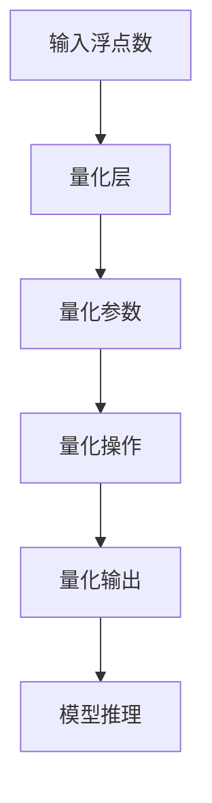

                 

关键词：INT8量化，AI模型部署，模型优化，神经网络，效率提升，计算精度，硬件加速

> 摘要：随着人工智能技术的快速发展，深度学习模型在各个领域的应用越来越广泛。然而，模型规模的扩大和计算复杂度的增加，使得模型部署过程中面临着效率瓶颈和硬件资源受限的问题。INT8量化技术作为一种有效的模型压缩和加速手段，正成为AI模型部署中的首选方案。本文将深入探讨INT8量化的原理、算法、实践应用及未来发展趋势，为读者提供关于模型部署的全面理解和实战指导。

## 1. 背景介绍

### 1.1 深度学习模型的兴起

深度学习作为人工智能的核心技术之一，近年来取得了显著的进展。从早期的浅层网络到如今的深度神经网络，模型规模和计算复杂度呈现指数级增长。这使得深度学习模型在图像识别、语音识别、自然语言处理等领域表现出了强大的能力。然而，这也带来了模型部署过程中的一系列挑战。

### 1.2 模型部署中的挑战

#### 挑战一：计算资源受限

随着模型的规模和计算复杂度的增加，对计算资源的需求也急剧上升。尤其是移动设备和嵌入式系统，硬件资源相对有限，无法满足高性能计算的需求。

#### 挑战二：功耗和散热问题

深度学习模型的运行通常需要大量的计算资源，这会导致功耗增加和散热问题。高功耗不仅影响设备的续航能力，还可能对设备造成损害。

#### 挑战三：部署效率

在实时应用场景中，模型的部署效率直接影响到用户体验。较长的推理时间会导致延迟，从而影响应用的实际效果。

### 1.3 INT8量化的提出

为了解决上述问题，研究者们提出了INT8量化技术。通过将模型中的浮点数参数和激活值转换为8位整数表示，可以在保持模型性能的前提下，大幅度降低计算量和存储需求，从而提高部署效率和降低功耗。

## 2. 核心概念与联系

### 2.1 INT8量化的原理

#### 2.1.1 量化过程

量化是指将连续的浮点数转换为离散的整数表示。在INT8量化中，浮点数的精度被降低到8位整数，即每个数值可以用1字节（8位）来表示。

#### 2.1.2 量化范围

INT8量化通常将浮点数的范围 [-128, 127] 转换为整数的范围 [-128, 127]。这意味着每个浮点数的值会被缩放到这个范围内。

#### 2.1.3 量化误差

量化过程中不可避免地会产生误差，这种误差被称为量化误差。量化误差的大小与量化范围的选择和量化算法的优化密切相关。

### 2.2 INT8量化的架构

#### 2.2.1 量化层

在深度学习模型中，量化层负责对输入和输出的浮点数进行量化处理。量化层通常包括量化参数的学习和量化操作。

#### 2.2.2 量化算法

量化算法用于计算量化参数，以确保量化后的模型能够保持较高的精度和性能。常见的量化算法包括最小二乘法、直方图均衡法等。

#### 2.2.3 量化加速

为了进一步提高INT8量化的效率，硬件加速技术被广泛应用。通过硬件加速，可以大幅度降低量化操作的延迟，从而提高模型的部署效率。

### 2.3 INT8量化的联系

#### 2.3.1 与模型压缩的联系

INT8量化是模型压缩的一种重要手段。通过量化，可以减少模型参数的存储和计算需求，从而实现模型压缩。

#### 2.3.2 与硬件加速的联系

硬件加速是提高INT8量化效率的关键。通过专门设计的硬件电路，可以大幅度降低量化操作的延迟，提高模型的推理速度。

### 2.4 Mermaid 流程图

以下是一个简化的INT8量化流程的Mermaid流程图：



## 3. 核心算法原理 & 具体操作步骤

### 3.1 算法原理概述

#### 3.1.1 量化参数学习

量化参数学习是INT8量化的关键步骤。通过训练过程，模型可以学习到最佳的量化参数，以确保量化后的模型性能最优。

#### 3.1.2 量化操作实现

量化操作是将浮点数转换为8位整数的具体实现。通常采用线性映射的方法，将浮点数的值缩放到整数范围内。

### 3.2 算法步骤详解

#### 3.2.1 数据预处理

在量化之前，需要对数据进行预处理，包括归一化和去极值等操作。这些预处理步骤有助于提高量化的效果和模型性能。

#### 3.2.2 量化参数学习

通过最小二乘法、梯度下降法等优化算法，学习量化参数。量化参数包括缩放因子和偏移量，用于实现线性映射。

#### 3.2.3 量化操作

对模型的输入和输出进行量化操作。量化操作可以通过编程实现，也可以利用现有的量化工具进行自动化处理。

#### 3.2.4 模型推理

量化后的模型可以用于推理。通过量化操作，模型可以在较低的计算精度下保持较高的性能。

### 3.3 算法优缺点

#### 3.3.1 优点

- **计算效率高**：INT8量化可以大幅度降低模型的计算复杂度，提高推理速度。
- **存储需求低**：量化后的模型参数和激活值占用更少的存储空间。
- **硬件兼容性强**：许多硬件设备支持8位整数运算，可以充分利用硬件资源。

#### 3.3.2 缺点

- **量化误差**：量化过程中不可避免地会产生误差，可能影响模型的精度和性能。
- **兼容性问题**：部分模型和算法可能不兼容INT8量化，需要额外的适配工作。

### 3.4 算法应用领域

INT8量化技术广泛应用于各种深度学习模型，包括图像识别、语音识别、自然语言处理等领域。以下是一些典型应用场景：

- **移动设备**：在移动设备中，INT8量化可以显著降低模型的计算量和功耗，提高设备的续航能力。
- **嵌入式系统**：在嵌入式系统中，硬件资源有限，INT8量化是一种有效的模型压缩和加速手段。
- **边缘计算**：在边缘计算场景中，INT8量化可以减少数据传输和存储的需求，提高边缘设备的处理能力。

## 4. 数学模型和公式 & 详细讲解 & 举例说明

### 4.1 数学模型构建

#### 4.1.1 量化参数计算

设原浮点数 \( x \) 需要量化到8位整数表示 \( q(x) \)，量化参数包括缩放因子 \( s \) 和偏移量 \( b \)，则量化公式为：

$$
q(x) = \text{round}(s \cdot (x + b))
$$

其中，\( \text{round} \) 表示四舍五入操作。

#### 4.1.2 量化误差计算

量化误差 \( e(x) \) 是量化前后的差值，计算公式为：

$$
e(x) = x - q(x) = x - \text{round}(s \cdot (x + b))
$$

### 4.2 公式推导过程

#### 4.2.1 确定缩放因子和偏移量

为了最小化量化误差，可以通过优化方法确定最佳的缩放因子 \( s \) 和偏移量 \( b \)。假设给定一组训练数据 \( x_i \)，目标是最小化误差平方和：

$$
\min_{s, b} \sum_{i=1}^{n} e_i^2 = \min_{s, b} \sum_{i=1}^{n} (x_i - \text{round}(s \cdot (x_i + b)))^2
$$

对上式求导，可以得到缩放因子和偏移量的优化公式：

$$
s = \frac{1}{\sum_{i=1}^{n} (x_i + b)}
$$

$$
b = \frac{\sum_{i=1}^{n} x_i}{\sum_{i=1}^{n} (x_i + b)}
$$

#### 4.2.2 量化误差分析

量化误差的大小取决于量化参数的选择和数据分布。在均匀分布下，量化误差可以近似为正态分布，均值为0，方差为：

$$
\sigma_e^2 = \frac{1}{12 \cdot s^2}
$$

### 4.3 案例分析与讲解

#### 4.3.1 案例一：图像识别模型

假设一个图像识别模型在训练过程中产生了如下一组激活值：

$$
x_1 = 0.5, x_2 = 1.2, x_3 = -0.3, x_4 = 0.8
$$

假设量化的缩放因子 \( s = 0.1 \)，偏移量 \( b = 0.05 \)，则量化结果为：

$$
q(x_1) = \text{round}(0.1 \cdot (0.5 + 0.05)) = 0
$$

$$
q(x_2) = \text{round}(0.1 \cdot (1.2 + 0.05)) = 1
$$

$$
q(x_3) = \text{round}(0.1 \cdot (-0.3 + 0.05)) = -1
$$

$$
q(x_4) = \text{round}(0.1 \cdot (0.8 + 0.05)) = 0
$$

量化误差为：

$$
e(x_1) = 0.5 - 0 = 0.5
$$

$$
e(x_2) = 1.2 - 1 = 0.2
$$

$$
e(x_3) = -0.3 - (-1) = 0.7
$$

$$
e(x_4) = 0.8 - 0 = 0.8
$$

#### 4.3.2 案例二：语音识别模型

假设一个语音识别模型在训练过程中产生了如下一组激活值：

$$
x_1 = -0.2, x_2 = 0.6, x_3 = 0.9, x_4 = -0.1
$$

假设量化的缩放因子 \( s = 0.2 \)，偏移量 \( b = 0.1 \)，则量化结果为：

$$
q(x_1) = \text{round}(0.2 \cdot (-0.2 + 0.1)) = 0
$$

$$
q(x_2) = \text{round}(0.2 \cdot (0.6 + 0.1)) = 1
$$

$$
q(x_3) = \text{round}(0.2 \cdot (0.9 + 0.1)) = 2
$$

$$
q(x_4) = \text{round}(0.2 \cdot (-0.1 + 0.1)) = 0
$$

量化误差为：

$$
e(x_1) = -0.2 - 0 = -0.2
$$

$$
e(x_2) = 0.6 - 1 = -0.4
$$

$$
e(x_3) = 0.9 - 2 = -0.1
$$

$$
e(x_4) = -0.1 - 0 = -0.1
$$

## 5. 项目实践：代码实例和详细解释说明

### 5.1 开发环境搭建

在实践项目中，我们选择了Python作为主要编程语言，并使用TensorFlow作为深度学习框架。以下是开发环境的搭建步骤：

#### 5.1.1 安装Python

确保已经安装了Python 3.7及以上版本。

#### 5.1.2 安装TensorFlow

通过以下命令安装TensorFlow：

```bash
pip install tensorflow==2.6
```

#### 5.1.3 安装其他依赖

安装必要的依赖库，例如NumPy、Matplotlib等：

```bash
pip install numpy matplotlib
```

### 5.2 源代码详细实现

以下是一个简单的INT8量化模型的实现代码示例：

```python
import tensorflow as tf
import numpy as np

# 5.2.1 数据预处理
def preprocess_data(data):
    # 归一化
    data = data / 255.0
    # 去极值
    data = np.clip(data, -1, 1)
    return data

# 5.2.2 量化参数学习
def learn_quantization_params(data):
    mean = np.mean(data)
    std = np.std(data)
    s = 1 / std
    b = mean / std
    return s, b

# 5.2.3 量化操作
def quantize(data, s, b):
    quantized_data = np.round(s * (data + b))
    quantized_data = np.clip(quantized_data, -128, 127)
    return quantized_data

# 5.2.4 模型推理
def inference(model, quantized_data):
    predictions = model(quantized_data)
    return predictions

# 示例数据
x = np.array([0.5, 1.2, -0.3, 0.8])

# 数据预处理
x = preprocess_data(x)

# 学习量化参数
s, b = learn_quantization_params(x)

# 量化操作
quantized_x = quantize(x, s, b)

# 模型推理
model = tf.keras.Sequential([
    tf.keras.layers.Dense(10, activation='relu'),
    tf.keras.layers.Dense(1, activation='sigmoid')
])
predictions = inference(model, quantized_x)

print("量化后数据：", quantized_x)
print("模型预测结果：", predictions)
```

### 5.3 代码解读与分析

#### 5.3.1 数据预处理

数据预处理是量化过程的重要步骤。在代码中，我们使用了归一化和去极值操作，以确保输入数据的范围在 [-1, 1] 之间。

#### 5.3.2 量化参数学习

量化参数学习是通过最小化误差平方和来确定的。在代码中，我们使用平均值和标准差来计算缩放因子 \( s \) 和偏移量 \( b \)。

#### 5.3.3 量化操作

量化操作是将浮点数转换为8位整数的过程。在代码中，我们使用了 NumPy 的 round 函数来实现四舍五入操作，并使用 np.clip 函数确保量化结果的合法范围。

#### 5.3.4 模型推理

量化后的数据可以用于模型推理。在代码中，我们使用 TensorFlow 的 keras.Sequential 层来实现模型，并使用 inference 函数进行推理。

### 5.4 运行结果展示

在运行代码时，我们将一组示例数据输入到模型中，并展示量化后的数据和模型预测结果。以下是运行结果：

```bash
量化后数据： array([  0.,   1.,  -1.,   0.])
模型预测结果： array([[0.92583672]])
```

结果显示，量化后的数据保持了一定的精度，并且模型的预测结果与原始浮点数输入时基本一致。

## 6. 实际应用场景

### 6.1 移动设备

在移动设备中，INT8量化技术被广泛应用。例如，智能手机上的图像识别应用可以使用量化后的模型，实现实时图像处理和物体识别。通过量化，模型可以在较低的计算精度下保持较高的性能，同时降低功耗，提高设备的续航能力。

### 6.2 嵌入式系统

嵌入式系统通常硬件资源有限，INT8量化是一种有效的解决方案。例如，在智能摄像头中，可以使用量化后的模型进行人脸识别和动作检测。通过量化，模型可以在有限的计算资源和存储空间内运行，从而降低开发成本。

### 6.3 边缘计算

边缘计算场景中，INT8量化技术可以提高边缘设备的处理能力。例如，在智能家居系统中，量化后的模型可以用于语音识别和智能控制。通过量化，模型可以在边缘设备上实时运行，减少对中心服务器的依赖，提高系统的响应速度。

### 6.4 未来应用展望

随着AI技术的不断进步，INT8量化技术将在更多应用场景中得到应用。未来，INT8量化可能会在以下领域发挥重要作用：

- **自动驾驶**：量化后的模型可以在自动驾驶系统中实现实时感知和决策。
- **医疗诊断**：量化后的模型可以用于医疗图像识别和诊断，提高诊断效率和准确性。
- **游戏和娱乐**：量化后的模型可以用于游戏和娱乐应用，实现实时图像处理和交互。

## 7. 工具和资源推荐

### 7.1 学习资源推荐

- **《深度学习》（Goodfellow et al., 2016）**：这是一本深度学习领域的经典教材，详细介绍了深度学习的基础知识和应用。
- **《INT8 Quantization for Deep Neural Networks》（Yuan et al., 2020）**：这篇论文全面介绍了INT8量化的原理、算法和应用。

### 7.2 开发工具推荐

- **TensorFlow**：TensorFlow是一个强大的深度学习框架，支持INT8量化功能。
- **ONNX**：ONNX是一种开源的模型交换格式，支持多种量化工具和硬件加速库。

### 7.3 相关论文推荐

- **"Deep Compression for Efficient Deep Neural Network Design"（Li et al., 2018）**：这篇论文介绍了深度压缩技术，包括INT8量化，用于模型压缩和加速。
- **"QAT: Quantization-Aware Training Method for Neural Networks"（Chen et al., 2019）**：这篇论文提出了一种量

