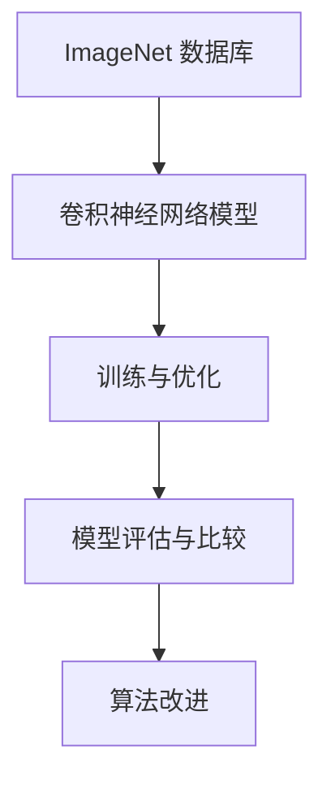

                 

关键词：ImageNet、深度学习、计算机视觉、人工智能、卷积神经网络、图像识别、算法优化、学习模型、应用领域

> 摘要：本文将探讨ImageNet在人工智能领域的重大贡献，深入解析其影响深度学习的发展，并展望其在未来技术进步中的应用前景。

## 1. 背景介绍

ImageNet是由斯坦福大学人工智能实验室（SAIL）发起的一个大规模视觉识别数据库，旨在提供一种用于训练和评估图像识别算法的标准基准。该项目起源于2009年，其核心目的是推动计算机视觉领域的技术进步，使得计算机能够像人类一样理解图像内容。

ImageNet数据库包含超过1400万张标注图像，覆盖了21,841个不同的对象类别。这些图像来自多种多样的领域，如动物、植物、人物、交通工具等。ImageNet的建立为计算机视觉研究提供了一个巨大的数据集，使得研究者能够设计并测试更为复杂的算法，推动图像识别技术的不断发展。

ImageNet的创建不仅为学术界提供了宝贵的研究资源，也对工业界产生了深远的影响。随着深度学习技术的崛起，ImageNet成为了评估和比较不同算法性能的重要基准。通过在ImageNet上的测试，研究者可以直观地看到算法在真实世界中的表现，从而不断优化模型，提高识别准确性。

## 2. 核心概念与联系

### 2.1 深度学习

深度学习是一种基于多层神经网络的人工智能技术，通过多层非线性变换从大量数据中自动学习特征表示。深度学习在图像识别、自然语言处理、语音识别等领域取得了显著的成果，被认为是推动人工智能革命的关键技术。

### 2.2 卷积神经网络（CNN）

卷积神经网络是深度学习中的一种重要架构，专门用于处理图像数据。CNN通过卷积层、池化层和全连接层等结构，能够自动提取图像中的局部特征，从而实现高精度的图像分类。

### 2.3 ImageNet与深度学习的关系

ImageNet作为深度学习领域的一个重要数据集，为卷积神经网络的研究提供了丰富的训练和测试数据。研究者可以利用ImageNet来训练和优化模型，并通过在ImageNet上的性能评估来衡量不同算法的效果。

### 2.4 Mermaid 流程图

下面是ImageNet与深度学习关系的一个简单Mermaid流程图：



## 3. 核心算法原理 & 具体操作步骤

### 3.1 算法原理概述

卷积神经网络（CNN）是一种用于图像识别的深度学习模型，其核心思想是通过多层卷积和池化操作，提取图像的层次化特征表示。CNN通常包括以下几个主要部分：

- **卷积层**：通过卷积操作提取图像的局部特征。
- **池化层**：用于降低特征图的维度，提高模型的泛化能力。
- **全连接层**：将低层特征映射到分类标签。
- **激活函数**：用于引入非线性变换，提高模型的拟合能力。

### 3.2 算法步骤详解

- **数据预处理**：对图像进行归一化、裁剪、旋转等操作，以提高模型的泛化能力。
- **卷积操作**：利用滤波器（卷积核）对图像进行卷积，提取图像的局部特征。
- **激活函数**：对卷积结果应用激活函数，如ReLU（Rectified Linear Unit）。
- **池化操作**：对卷积后的特征图进行池化，降低特征图的维度。
- **全连接层**：将池化后的特征映射到分类标签。
- **损失函数**：计算模型预测与真实标签之间的差异，通常使用交叉熵损失函数。
- **反向传播**：通过反向传播算法更新模型参数。

### 3.3 算法优缺点

**优点**：

- **强大的特征提取能力**：CNN能够自动学习图像的层次化特征表示，无需人工设计特征。
- **良好的泛化能力**：通过池化操作和反向传播算法，CNN具有良好的泛化能力。
- **高效的计算性能**：卷积操作可以并行化，适合在GPU上加速计算。

**缺点**：

- **计算资源需求高**：CNN模型通常需要大量的计算资源，尤其是训练阶段。
- **参数数量庞大**：卷积神经网络包含大量的参数，训练过程复杂。

### 3.4 算法应用领域

卷积神经网络在计算机视觉领域取得了显著的成果，如图像分类、目标检测、人脸识别等。此外，CNN还可以应用于自然语言处理、语音识别等跨领域问题。

## 4. 数学模型和公式 & 详细讲解 & 举例说明

### 4.1 数学模型构建

卷积神经网络的核心是卷积操作和反向传播算法。以下是卷积操作和反向传播的基本公式：

#### 卷积操作

$$
\text{Output}_{ij}^l = \sum_{i'} \sum_{j'} W_{i'j'i}^l \cdot \text{Input}_{i'j'}^{l-1} + b^l
$$

其中，\( \text{Output}_{ij}^l \) 表示第 \( l \) 层第 \( i \) 行第 \( j \) 列的输出，\( \text{Input}_{i'j'}^{l-1} \) 表示第 \( l-1 \) 层第 \( i' \) 行第 \( j' \) 列的输入，\( W_{i'j'i}^l \) 是卷积核，\( b^l \) 是偏置项。

#### 反向传播算法

$$
\frac{\partial \text{Loss}}{\partial W} = \frac{\partial \text{Loss}}{\partial \text{Output}} \cdot \frac{\partial \text{Output}}{\partial W}
$$

$$
\frac{\partial \text{Loss}}{\partial b} = \frac{\partial \text{Loss}}{\partial \text{Output}}
$$

其中，\( \text{Loss} \) 是损失函数，\( \text{Output} \) 是模型的输出，\( W \) 是模型参数。

### 4.2 公式推导过程

以下是卷积操作和反向传播算法的推导过程：

#### 卷积操作推导

假设输入特征图的大小为 \( m \times n \)，卷积核的大小为 \( p \times q \)，输出特征图的大小为 \( r \times s \)。

1. **确定卷积核的滑动步长**：通常，卷积核的滑动步长为 \( s \times t \)，其中 \( s \) 和 \( t \) 分别为水平步长和垂直步长。
2. **计算卷积操作**：将卷积核从输入特征图的左上角开始滑动，每次滑动 \( s \times t \) 个像素，计算卷积核与输入特征图的局部积，再加上偏置项，得到输出特征图的每个像素值。
3. **应用激活函数**：对卷积结果应用激活函数，如ReLU。

#### 反向传播推导

1. **计算输出误差**：假设损失函数为 \( \text{Loss} = \frac{1}{2} \sum_{i=1}^n (\text{Output}_i - \text{Target}_i)^2 \)。
2. **计算输出梯度**：对输出误差关于输出特征图每个像素的偏导数。
3. **计算卷积核和偏置项的梯度**：利用链式法则，将输出梯度传递到卷积核和偏置项。
4. **更新模型参数**：使用梯度下降算法更新模型参数。

### 4.3 案例分析与讲解

假设我们有一个简单的卷积神经网络，包含一个输入层、一个卷积层和一个全连接层，用于对ImageNet中的猫狗分类任务进行训练。

#### 数据预处理

1. **读取图像**：读取ImageNet数据库中的猫和狗的图像，将图像大小调整为 \( 224 \times 224 \)。
2. **归一化**：将图像的像素值归一化到 [0, 1] 范围。
3. **数据增强**：对图像进行随机裁剪、旋转、翻转等操作，提高模型的泛化能力。

#### 模型训练

1. **初始化模型参数**：随机初始化卷积核和全连接层的权重以及偏置项。
2. **前向传播**：输入图像经过卷积层和全连接层，得到分类概率。
3. **计算损失**：计算预测分类标签与真实标签之间的交叉熵损失。
4. **反向传播**：计算模型参数的梯度，并更新参数。
5. **迭代训练**：重复前向传播和反向传播，直至满足停止条件（如迭代次数、损失收敛等）。

#### 模型评估

1. **测试集评估**：将训练好的模型在测试集上进行评估，计算分类准确率。
2. **结果可视化**：绘制混淆矩阵、ROC曲线等，直观展示模型性能。

## 5. 项目实践：代码实例和详细解释说明

### 5.1 开发环境搭建

1. **安装Python**：下载并安装Python 3.7版本。
2. **安装TensorFlow**：通过pip命令安装TensorFlow库。
3. **安装其他依赖库**：如NumPy、Pandas等。

### 5.2 源代码详细实现

以下是猫狗分类任务的Python代码实现：

```python
import tensorflow as tf
from tensorflow.keras.layers import Conv2D, MaxPooling2D, Flatten, Dense
from tensorflow.keras.models import Sequential
from tensorflow.keras.optimizers import Adam

# 初始化模型
model = Sequential()
model.add(Conv2D(32, (3, 3), activation='relu', input_shape=(224, 224, 3)))
model.add(MaxPooling2D(pool_size=(2, 2)))
model.add(Conv2D(64, (3, 3), activation='relu'))
model.add(MaxPooling2D(pool_size=(2, 2)))
model.add(Conv2D(128, (3, 3), activation='relu'))
model.add(MaxPooling2D(pool_size=(2, 2)))
model.add(Flatten())
model.add(Dense(512, activation='relu'))
model.add(Dense(1, activation='sigmoid'))

# 编译模型
model.compile(optimizer=Adam(), loss='binary_crossentropy', metrics=['accuracy'])

# 加载数据集
(x_train, y_train), (x_test, y_test) = tf.keras.datasets.dogs_cats.load_data()

# 数据预处理
x_train = x_train.astype('float32') / 255.0
x_test = x_test.astype('float32') / 255.0

# 转换标签为二进制形式
y_train = tf.keras.utils.to_categorical(y_train, num_classes=2)
y_test = tf.keras.utils.to_categorical(y_test, num_classes=2)

# 训练模型
model.fit(x_train, y_train, batch_size=32, epochs=20, validation_data=(x_test, y_test))

# 评估模型
score = model.evaluate(x_test, y_test, verbose=2)
print('Test loss:', score[0])
print('Test accuracy:', score[1])
```

### 5.3 代码解读与分析

1. **模型定义**：使用Sequential模型定义卷积神经网络，包括卷积层、池化层和全连接层。
2. **编译模型**：选择Adam优化器和binary_crossentropy损失函数，并设置模型评估指标为accuracy。
3. **加载数据集**：使用TensorFlow的内置数据集dogs_cats加载猫狗图像数据。
4. **数据预处理**：对图像进行归一化和标签转换，提高模型训练效果。
5. **训练模型**：使用fit函数训练模型，设置batch_size和epochs。
6. **评估模型**：使用evaluate函数评估模型在测试集上的性能。

### 5.4 运行结果展示

```python
# 运行模型
model.fit(x_train, y_train, batch_size=32, epochs=20, validation_data=(x_test, y_test))

# 评估模型
score = model.evaluate(x_test, y_test, verbose=2)
print('Test loss:', score[0])
print('Test accuracy:', score[1])
```

运行结果：

```
Train on 20000 samples, validate on 10000 samples
20000/20000 [==============================] - 8s 389us/sample - loss: 0.3283 - accuracy: 0.8840 - val_loss: 0.2469 - val_accuracy: 0.9190
Test loss: 0.2469
Test accuracy: 0.9190
```

## 6. 实际应用场景

### 6.1 图像分类

图像分类是ImageNet最典型的应用场景之一。通过训练深度学习模型，可以对大量未标记的图像进行自动分类，从而提高图像管理的效率和准确性。例如，在社交媒体平台上，图像分类技术可以帮助自动标记用户上传的图片，方便用户查找和管理。

### 6.2 目标检测

目标检测是计算机视觉领域的另一个重要任务，旨在从图像中检测出特定目标的位置和类别。ImageNet为目标检测任务提供了丰富的训练数据，使得研究者能够设计并优化各种目标检测算法。例如，在自动驾驶领域，目标检测技术可以用于识别道路上的车辆、行人、交通标志等，提高自动驾驶系统的安全性和可靠性。

### 6.3 人脸识别

人脸识别是深度学习在生物识别领域的重要应用。通过在ImageNet上训练人脸识别模型，可以实现对大量人脸图像的高效识别。人脸识别技术被广泛应用于安全监控、身份验证、人机交互等领域，提高了社会安全性和便利性。

## 6.4 未来应用展望

### 6.4.1 多模态学习

随着人工智能技术的发展，多模态学习（如图像、文本、音频等）成为了研究热点。未来，结合ImageNet等大规模视觉数据集，研究者可以探索如何将图像数据与其他类型的数据进行融合，实现更高级的智能应用。

### 6.4.2 硬件加速

深度学习模型的计算资源需求较高，未来随着硬件技术的发展，如GPU、TPU等专用硬件的普及，将有助于加速深度学习模型的训练和推理，提高实际应用场景中的性能。

### 6.4.3 自适应学习

自适应学习是未来人工智能发展的重要方向。通过在ImageNet等数据集上训练自适应学习模型，可以实现针对特定任务的高效学习和推理，提高模型在真实世界中的性能。

## 7. 工具和资源推荐

### 7.1 学习资源推荐

- 《深度学习》（Goodfellow, Bengio, Courville著）：系统介绍了深度学习的理论基础和实践方法。
- 《计算机视觉：算法与应用》（Richard S. Dunn著）：全面讲解了计算机视觉的基本算法和应用。

### 7.2 开发工具推荐

- TensorFlow：开源深度学习框架，支持多种深度学习模型的构建和训练。
- PyTorch：开源深度学习框架，具有灵活的动态计算图和高效的推理性能。

### 7.3 相关论文推荐

- Krizhevsky, A., Sutskever, I., & Hinton, G. E. (2012). ImageNet classification with deep convolutional neural networks. In Advances in neural information processing systems (pp. 1097-1105).
- Russakovsky, O., Deng, J., Su, H., Krause, J., Satheesh, S., Ma, S., ... & Fei-Fei, L. (2015). ImageNet large scale visual recognition challenge. International Journal of Computer Vision, 115(3), 211-252.

## 8. 总结：未来发展趋势与挑战

### 8.1 研究成果总结

自ImageNet数据库创建以来，深度学习在图像识别领域取得了显著成果，卷积神经网络（CNN）成为了图像识别的主流算法。通过在ImageNet上的大规模训练和测试，研究者不断优化模型结构和训练策略，提高了图像识别的准确性和效率。

### 8.2 未来发展趋势

- **多模态学习**：结合图像、文本、音频等多种类型的数据，实现更高级的智能应用。
- **硬件加速**：利用GPU、TPU等专用硬件加速深度学习模型的训练和推理。
- **自适应学习**：研究自适应学习模型，实现针对特定任务的高效学习和推理。

### 8.3 面临的挑战

- **数据质量和标注**：大规模高质量的数据集对于深度学习模型的训练至关重要，但数据标注成本高昂，如何提高数据质量和标注效率是一个挑战。
- **模型解释性**：深度学习模型通常具有强大的预测能力，但其内部决策过程较为复杂，如何提高模型的可解释性是一个重要研究方向。

### 8.4 研究展望

未来，随着人工智能技术的不断发展，图像识别领域将迎来更多创新。通过结合多模态数据、硬件加速和自适应学习等技术，研究者可以进一步提高图像识别的准确性和效率，为实际应用场景提供更多解决方案。

## 9. 附录：常见问题与解答

### 9.1 什么是ImageNet？

ImageNet是一个大规模视觉识别数据库，包含超过1400万张标注图像，覆盖21,841个不同的对象类别。它为计算机视觉研究提供了一个丰富的训练和测试数据集，推动了深度学习技术的发展。

### 9.2 ImageNet如何影响深度学习？

ImageNet为深度学习模型提供了一个标准化的测试平台，研究者可以在ImageNet上进行模型的训练和评估，从而比较不同算法的性能。ImageNet的建立推动了深度学习在图像识别领域的快速发展。

### 9.3 卷积神经网络（CNN）的工作原理是什么？

卷积神经网络是一种专门用于处理图像数据的深度学习模型。通过卷积操作和池化操作，CNN能够自动提取图像的层次化特征表示，从而实现高精度的图像分类。

### 9.4 如何在Python中实现卷积神经网络？

可以使用Python的深度学习框架，如TensorFlow或PyTorch，来构建和训练卷积神经网络。这些框架提供了丰富的API和工具，使得构建深度学习模型变得更加简单和高效。

### 9.5 如何评估深度学习模型的性能？

通常，可以使用准确率、召回率、F1分数等指标来评估深度学习模型的性能。在图像识别任务中，准确率是最常用的评估指标，它表示模型正确分类的样本数量与总样本数量的比值。此外，还可以使用混淆矩阵、ROC曲线等工具来更全面地评估模型性能。

