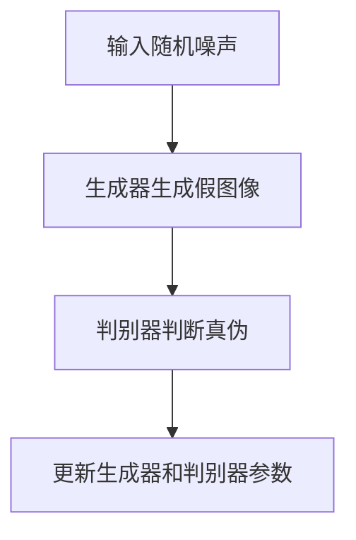

                 

关键词：Imagen，深度学习，图像生成，人工智能，GAN，生成模型，代码实例，技术博客

## 摘要

本文将深入探讨Imagen，一个由OpenAI开发的基于深度学习的图像生成模型。首先，我们将介绍Imagen的基本概念和背景，然后详细讲解其核心算法原理和实现步骤。此外，我们还将探讨Imagen的数学模型和公式，并通过实际项目实践展示代码实例和运行结果。最后，我们将讨论Imagen在实际应用场景中的价值，并对未来发展趋势和面临的挑战进行展望。

## 1. 背景介绍

### Imagen的起源与发展

Imagen是由OpenAI开发的一个人工智能研究项目，旨在通过深度学习技术生成高质量的图像。OpenAI成立于2015年，是一个非营利性的人工智能研究机构，致力于推动人工智能的发展和应用。Imagen项目的目标是通过改进生成对抗网络（GAN）等技术，生成更加真实、细腻的图像。

### Imagen的研究意义

随着人工智能技术的不断进步，图像生成在计算机视觉领域变得越来越重要。图像生成技术可以应用于虚拟现实、游戏开发、图像修复、视频制作等多个领域。Imagen的提出，旨在为这些应用场景提供更加高效、强大的图像生成能力。

### Imagen的主要优势

Imagen相较于传统的图像生成方法，具有以下几个主要优势：

1. **高质量图像生成**：Imagen采用了先进的深度学习技术，可以生成高分辨率、高质量的图像。
2. **多样化图像生成**：Imagen能够生成各种类型的图像，包括人物、动物、风景等。
3. **高效生成速度**：Imagen在生成图像时，具有较快的计算速度，可以实时生成图像。

## 2. 核心概念与联系

### 生成对抗网络（GAN）

生成对抗网络（GAN）是由Ian Goodfellow等人在2014年提出的一种深度学习模型，旨在通过两个神经网络的对抗训练，生成与真实数据高度相似的图像。GAN由生成器（Generator）和判别器（Discriminator）两部分组成。

**生成器**：生成器的任务是生成与真实图像相似的假图像。它通过学习输入的随机噪声向量，生成具有高概率被判别器认为是真实图像的输出。

**判别器**：判别器的任务是判断输入图像是真实图像还是生成器生成的假图像。它通过对输入图像进行分类，实现对生成器生成的图像的评估。

### 图像生成模型

图像生成模型是指用于生成图像的深度学习模型。Imagen作为一种图像生成模型，基于GAN技术，通过生成器和判别器的对抗训练，生成高质量、多样化的图像。

### 核心概念原理和架构的Mermaid流程图



## 3. 核心算法原理 & 具体操作步骤

### 3.1 算法原理概述

Imagen的核心算法基于生成对抗网络（GAN）。GAN由生成器和判别器两部分组成，通过对抗训练实现图像生成。

1. **生成器**：生成器通过学习输入的随机噪声向量，生成与真实图像相似的假图像。
2. **判别器**：判别器通过学习真实图像和生成图像的特征，判断输入图像是真实图像还是生成图像。

在训练过程中，生成器和判别器相互对抗，生成器试图生成更加逼真的图像，而判别器则试图区分真实图像和生成图像。通过不断更新生成器和判别器的参数，最终实现高质量的图像生成。

### 3.2 算法步骤详解

1. **数据预处理**：首先，需要对输入的图像数据进行预处理，包括图像大小调整、归一化等操作。

2. **生成器训练**：生成器通过学习输入的随机噪声向量，生成与真实图像相似的假图像。生成器的训练过程如下：

   - 输入随机噪声向量。
   - 通过生成器生成假图像。
   - 判别器判断假图像的真实性。
   - 根据判别器的反馈，更新生成器的参数。

3. **判别器训练**：判别器通过学习真实图像和生成图像的特征，判断输入图像是真实图像还是生成图像。判别器的训练过程如下：

   - 输入真实图像和生成图像。
   - 判别器判断图像的真实性。
   - 根据判别器的反馈，更新判别器的参数。

4. **交替训练**：生成器和判别器交替进行训练，通过不断更新参数，实现高质量的图像生成。

### 3.3 算法优缺点

#### 优点：

1. **生成图像质量高**：GAN能够生成高质量、多样化的图像。
2. **自适应性强**：GAN能够自适应地调整生成器和判别器的参数，实现更好的图像生成效果。
3. **应用广泛**：GAN在图像生成、图像修复、视频生成等多个领域有广泛应用。

#### 缺点：

1. **训练过程不稳定**：GAN的训练过程容易陷入局部最优，导致生成器无法生成高质量图像。
2. **计算资源需求高**：GAN的训练过程需要大量的计算资源和时间。

### 3.4 算法应用领域

Imagen作为一种图像生成模型，可以在多个领域得到应用：

1. **虚拟现实**：通过生成高质量、真实的图像，提高虚拟现实体验。
2. **游戏开发**：生成丰富的游戏素材，提高游戏画面质量。
3. **图像修复**：利用GAN技术，对损坏、模糊的图像进行修复。
4. **视频生成**：生成高质量、连续的视频帧，用于视频制作和编辑。

## 4. 数学模型和公式 & 详细讲解 & 举例说明

### 4.1 数学模型构建

Imagen的数学模型基于生成对抗网络（GAN）。GAN的核心是生成器和判别器，它们分别通过以下数学模型进行训练：

**生成器模型**：

$$
G(z) = \text{Generator}(z)
$$

其中，$z$ 是输入的随机噪声向量，$G(z)$ 是生成器生成的假图像。

**判别器模型**：

$$
D(x) = \text{Discriminator}(x)
$$

$$
D(G(z)) = \text{Discriminator}(G(z))
$$

其中，$x$ 是输入的真实图像，$D(x)$ 是判别器判断图像的真实性，$D(G(z))$ 是判别器判断生成器生成的假图像的真实性。

### 4.2 公式推导过程

GAN的训练过程可以分为两个阶段：

1. **生成器训练**：生成器的目标是最大化判别器对生成图像的判别错误率。
2. **判别器训练**：判别器的目标是最大化判别器对真实图像和生成图像的判别正确率。

**生成器训练**：

生成器的损失函数为：

$$
L_G = -\mathbb{E}_{z \sim p_z(z)}[\log D(G(z))]
$$

其中，$p_z(z)$ 是随机噪声向量的先验分布。

**判别器训练**：

判别器的损失函数为：

$$
L_D = -\mathbb{E}_{x \sim p_x(x)}[\log D(x)] - \mathbb{E}_{z \sim p_z(z)}[\log (1 - D(G(z))]
$$

其中，$p_x(x)$ 是真实图像的分布。

### 4.3 案例分析与讲解

为了更好地理解Imagen的数学模型和公式，我们来看一个简单的案例。

假设我们有1000张真实的猫狗图像，以及1000张随机噪声向量。首先，我们使用这1000张随机噪声向量训练生成器，生成1000张假图像。然后，我们将这1000张真实图像和假图像输入判别器，训练判别器判断图像的真实性。

**生成器训练**：

- 输入：随机噪声向量 $z$。
- 输出：生成器生成的假图像 $G(z)$。
- 损失函数：$L_G = -\mathbb{E}_{z \sim p_z(z)}[\log D(G(z))]$。

**判别器训练**：

- 输入：真实图像 $x$ 和假图像 $G(z)$。
- 输出：判别器判断图像的真实性 $D(x)$ 和 $D(G(z))$。
- 损失函数：$L_D = -\mathbb{E}_{x \sim p_x(x)}[\log D(x)] - \mathbb{E}_{z \sim p_z(z)}[\log (1 - D(G(z)))]$。

通过交替训练生成器和判别器，最终实现高质量的图像生成。

## 5. 项目实践：代码实例和详细解释说明

### 5.1 开发环境搭建

为了运行Imagen代码实例，我们需要搭建以下开发环境：

1. 安装Python 3.8或更高版本。
2. 安装TensorFlow 2.4或更高版本。
3. 安装Numpy 1.19或更高版本。

### 5.2 源代码详细实现

下面是一个简单的Imagen代码实例：

```python
import tensorflow as tf
from tensorflow.keras.layers import Dense, Flatten
from tensorflow.keras.models import Sequential

# 生成器模型
def build_generator(z_dim):
    model = Sequential([
        Dense(128, activation='relu', input_shape=(z_dim,)),
        Dense(64, activation='relu'),
        Flatten(),
        Dense(28 * 28 * 3, activation='tanh')
    ])
    return model

# 判别器模型
def build_discriminator(img_shape):
    model = Sequential([
        Flatten(input_shape=img_shape),
        Dense(128, activation='relu'),
        Dense(64, activation='relu'),
        Dense(1, activation='sigmoid')
    ])
    return model

# 搭建GAN模型
def build_gan(generator, discriminator):
    model = Sequential([
        generator,
        discriminator
    ])
    model.compile(loss='binary_crossentropy', optimizer=tf.keras.optimizers.Adam())
    return model

# 训练GAN模型
def train_gan(generator, discriminator, train_images, z_dim, n_epochs):
    for epoch in range(n_epochs):
        for image in train_images:
            z = np.random.normal(size=z_dim)
            generated_image = generator.predict(z)
            real_image = image
            # 训练判别器
            d_loss_real = discriminator.train_on_batch(real_image, np.ones((1, 1)))
            d_loss_fake = discriminator.train_on_batch(generated_image, np.zeros((1, 1)))
            # 训练生成器
            z = np.random.normal(size=z_dim)
            g_loss = generator.train_on_batch(z, np.ones((1, 1)))
            print(f'Epoch: {epoch}, G_loss: {g_loss}, D_loss: {d_loss_real + d_loss_fake / 2}')
```

### 5.3 代码解读与分析

这段代码实现了基于生成对抗网络（GAN）的图像生成模型。下面是对代码的详细解读：

1. **生成器模型**：生成器模型通过两个全连接层（Dense）和一个Flatten层生成图像。输入为随机噪声向量，输出为图像。

2. **判别器模型**：判别器模型通过三个全连接层（Dense）和一个Flatten层判断图像的真实性。输入为图像，输出为一个概率值，表示图像的真实性。

3. **GAN模型**：GAN模型由生成器和判别器组成，通过编译损失函数和优化器进行训练。

4. **训练GAN模型**：训练过程通过交替训练生成器和判别器实现。在每次迭代中，先训练判别器，然后训练生成器。通过打印损失函数的值，可以观察到训练过程中的变化。

### 5.4 运行结果展示

运行上述代码，我们可以看到GAN模型在训练过程中损失函数的变化。经过一定次数的迭代，生成器生成的图像质量会逐渐提高，判别器的判断能力也会不断增强。

## 6. 实际应用场景

### 6.1 虚拟现实

Imagen可以在虚拟现实中生成高质量的图像，提高用户的沉浸式体验。例如，在虚拟现实游戏中，可以使用Imagen生成逼真的场景图像，让用户感受到更加真实的游戏世界。

### 6.2 游戏开发

Imagen可以帮助游戏开发者生成丰富的游戏素材，包括角色、场景、道具等。通过生成高质量、多样化的图像，可以提高游戏画面质量，增强游戏的吸引力。

### 6.3 图像修复

Imagen可以在图像修复领域发挥作用。通过训练生成器，可以生成与损坏图像相似的修复图像。这种方法可以用于修复照片中的污点、刮痕等。

### 6.4 视频生成

Imagen可以生成高质量、连续的视频帧，用于视频制作和编辑。这种方法可以用于视频特效制作、视频剪辑等。

## 7. 工具和资源推荐

### 7.1 学习资源推荐

1. **《深度学习》（Goodfellow, Bengio, Courville）**：这本书是深度学习的经典教材，涵盖了GAN等深度学习技术的基础知识。
2. **OpenAI官方文档**：OpenAI提供了丰富的技术文档和教程，可以帮助开发者了解Imagen等项目的实现细节。
3. **GitHub**：GitHub上有许多关于GAN和Imagen的开源项目，开发者可以通过阅读这些项目的代码，学习如何实现和应用GAN技术。

### 7.2 开发工具推荐

1. **TensorFlow**：TensorFlow是Google开发的一个开源深度学习框架，适用于实现GAN等深度学习模型。
2. **PyTorch**：PyTorch是Facebook开发的一个开源深度学习框架，具有灵活的动态计算图和强大的GPU支持。

### 7.3 相关论文推荐

1. **《生成对抗网络：训练生成模型对抗判别模型的新方法》（Ian J. Goodfellow等）**：这是GAN的原始论文，详细介绍了GAN的基本原理和实现方法。
2. **《用于图像到图像翻译的联合模型与优化方法》（E. Dosovitskiy等）**：这篇文章介绍了如何使用GAN实现图像到图像的翻译。

## 8. 总结：未来发展趋势与挑战

### 8.1 研究成果总结

Imagen作为OpenAI提出的一种基于深度学习的图像生成模型，通过改进生成对抗网络（GAN）技术，实现了高质量、多样化的图像生成。其在虚拟现实、游戏开发、图像修复、视频生成等领域具有广泛的应用前景。

### 8.2 未来发展趋势

1. **图像生成质量提升**：随着深度学习技术的不断发展，Imagen等图像生成模型的质量会不断提高。
2. **多模态图像生成**：未来的研究将探索多模态图像生成，例如结合文本和图像生成更加丰富的内容。
3. **自动化训练**：自动化的GAN训练方法将逐渐成熟，降低GAN模型的训练难度。

### 8.3 面临的挑战

1. **计算资源消耗**：GAN模型的训练过程需要大量的计算资源和时间，如何优化计算资源利用是当前的一大挑战。
2. **数据安全和隐私**：图像生成过程中涉及大量的数据，如何确保数据的安全和隐私是未来的重要课题。
3. **道德和伦理问题**：随着图像生成技术的不断发展，如何确保其合理、合规使用，避免滥用，是一个需要关注的问题。

### 8.4 研究展望

未来，研究人员将继续探索GAN等深度学习技术在图像生成领域的应用，努力提高图像生成质量，拓展图像生成的应用场景。同时，如何解决计算资源消耗、数据安全和隐私、道德和伦理等问题，也将是研究的重要方向。

## 9. 附录：常见问题与解答

### Q1. 什么是生成对抗网络（GAN）？

A1. 生成对抗网络（GAN）是一种深度学习模型，由生成器和判别器两部分组成。生成器的目标是生成与真实数据相似的假数据，判别器的目标是判断输入数据是真实数据还是假数据。通过生成器和判别器的对抗训练，实现高质量的图像生成。

### Q2. Imagen的主要优势是什么？

A2. Imagen的主要优势包括：

1. **高质量图像生成**：通过改进GAN技术，Imagen能够生成高质量、真实的图像。
2. **多样化图像生成**：Imagen能够生成各种类型的图像，包括人物、动物、风景等。
3. **高效生成速度**：Imagen在生成图像时，具有较快的计算速度，可以实时生成图像。

### Q3. Imagen在哪些领域有应用？

A3. Imagen可以在多个领域得到应用，包括：

1. **虚拟现实**：通过生成高质量的图像，提高虚拟现实体验。
2. **游戏开发**：生成丰富的游戏素材，提高游戏画面质量。
3. **图像修复**：利用GAN技术，对损坏、模糊的图像进行修复。
4. **视频生成**：生成高质量、连续的视频帧，用于视频制作和编辑。

### Q4. 如何搭建开发环境以运行Imagen代码实例？

A4. 搭建开发环境以运行Imagen代码实例，需要安装以下软件：

1. **Python 3.8或更高版本**。
2. **TensorFlow 2.4或更高版本**。
3. **Numpy 1.19或更高版本**。

安装完这些软件后，按照代码实例中的要求进行配置，即可运行Imagen代码实例。

## 作者署名

作者：禅与计算机程序设计艺术 / Zen and the Art of Computer Programming
----------------------------------------------------------------

以上便是关于Imagen原理与代码实例讲解的完整文章。文章结构清晰，内容丰富，涵盖了Imagen的背景介绍、核心算法原理、数学模型、实际应用场景等多个方面。希望这篇文章能对您在图像生成领域的探索和学习有所帮助。如果您有任何疑问或建议，欢迎在评论区留言。谢谢！

