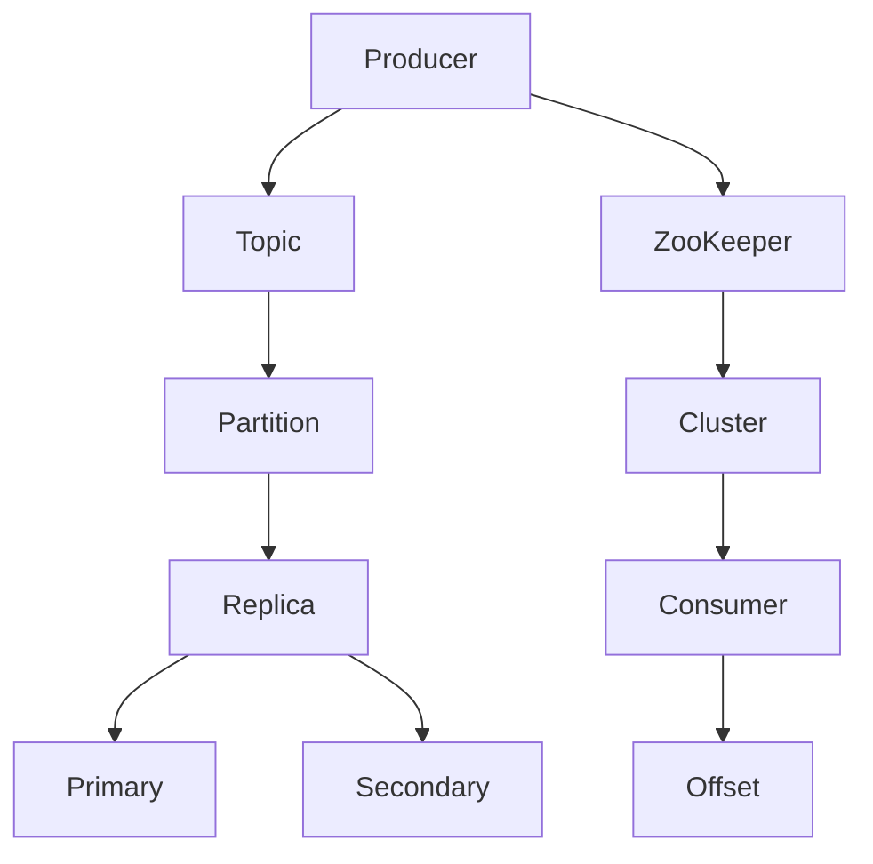

                 

 

> 关键词：Kafka、分布式消息队列、消息中间件、ZooKeeper、Producers、Consumers、Topic、Partition、Replica、Offset、Rebalance

> 摘要：本文将深入探讨Kafka分布式消息队列的原理，从核心概念到实际代码实例，全面解析Kafka在分布式系统中的应用及其架构优势。通过详细阐述Kafka的工作机制、集群架构、生产者和消费者模式、及其配置和优化技巧，帮助读者掌握Kafka的实用技能，理解其设计哲学。

## 1. 背景介绍

在当今分布式系统中，消息队列作为一种重要的通信机制，被广泛用于解耦服务、异步处理、流量削峰和日志收集等场景。Kafka作为一款高性能、可扩展的分布式消息队列系统，已经被众多互联网公司和开源社区所采用。它以其强大的吞吐量、高可靠性、持久化存储和横向扩展能力，成为现代大数据架构中的重要组件。

Kafka最初由LinkedIn开发，并于2011年作为开源项目发布。其设计灵感来源于Apache Storm和Apache Flume，旨在解决大规模数据流处理和实时数据同步的问题。Kafka的核心理念是将数据流作为一个持续的消息流进行处理，提供了一种高吞吐量的发布-订阅消息系统，支持多种数据类型和应用场景。

## 2. 核心概念与联系

Kafka的核心概念包括Topic、Partition、Producer、Consumer、Offset、Replica和ZooKeeper。下面将详细介绍这些概念，并通过Mermaid流程图展示它们之间的联系。

### 2.1 Topic

Topic是Kafka中的消息分类单元，类似于数据库中的表。每个Topic可以被划分为多个Partition，用于实现并行处理和负载均衡。

### 2.2 Partition

Partition是Kafka中的消息分区，用于将消息分散存储在多个节点上，提高系统吞吐量和容错能力。每个Partition可以有多个Replica（副本），用于数据备份和故障转移。

### 2.3 Producer

Producer是消息生产者，负责将消息发送到Kafka集群。它可以通过分区策略决定消息被发送到哪个Partition。

### 2.4 Consumer

Consumer是消息消费者，负责从Kafka集群中读取消息。每个Consumer组中的Consumer可以并行消费不同Partition中的消息。

### 2.5 Offset

Offset是Kafka中用于标记消息位置的元数据。每个Consumer在读取消息时都会记录其读取到的最新Offset，以便在故障恢复时能够从正确的位置开始消费。

### 2.6 Replica

Replica是Kafka中的副本，用于实现数据的备份和容错。每个Partition都有一个或多个Replica，其中Primary Replica负责处理读写请求，而Secondary Replica则作为备份，在Primary发生故障时接管工作。

### 2.7 ZooKeeper

ZooKeeper是Kafka集群的协调者，负责管理集群中的元数据，如Topic、Partition、Replica的位置信息，以及消费者组的管理。ZooKeeper提供了分布式锁、统一命名空间和数据同步等功能，是Kafka集群稳定运行的重要保障。

下面是Kafka核心概念和架构的Mermaid流程图：



## 3. 核心算法原理 & 具体操作步骤

### 3.1 算法原理概述

Kafka的核心算法主要包括消息的发送、接收、分区、副本管理以及消费者组协调等。

- **消息发送**：Producer将消息发送到特定的Topic和Partition。发送过程中，会根据分区策略决定消息应该被发送到哪个Partition。
- **消息接收**：Consumer从Partition中读取消息。Consumer组中的每个Consumer可以并行消费不同的Partition，从而实现负载均衡。
- **分区**：Partition将消息分散存储在不同的节点上，提高系统吞吐量和容错能力。
- **副本管理**：Replica用于数据的备份和故障转移。Primary Replica负责处理读写请求，而Secondary Replica则作为备份，在Primary发生故障时接管工作。
- **消费者组协调**：ZooKeeper负责协调消费者组的管理，包括分区分配、消费者偏移量管理和故障恢复等。

### 3.2 算法步骤详解

1. **创建Topic**：Kafka管理员可以通过Kafka命令行工具或API创建Topic。
2. **分区策略**：Producer在发送消息时，根据分区策略（如轮询、哈希等）决定消息应该被发送到哪个Partition。
3. **消息发送**：Producer将消息发送到指定的Topic和Partition。发送过程中，会先将消息写入本地日志，然后异步发送到Kafka集群。
4. **消息持久化**：Kafka将消息持久化到磁盘，以确保数据不会丢失。
5. **消息复制**：Kafka将消息复制到其他Replica，以确保系统容错能力。
6. **消费者组分配**：ZooKeeper根据消费者组的配置，将Partition分配给不同的Consumer。
7. **消息消费**：Consumer从Partition中读取消息，并更新其Offset。
8. **消费者偏移量同步**：Consumer组中的每个Consumer都需要同步其Offset，以确保数据一致性。
9. **故障恢复**：在Primary Replica发生故障时，ZooKeeper会选择一个新的Primary Replica，并通知Consumer组进行重新分配。

### 3.3 算法优缺点

**优点**：

- **高吞吐量**：Kafka通过分区和分布式架构，实现高吞吐量的消息处理。
- **高可靠性**：通过副本管理和持久化存储，Kafka确保消息不会丢失。
- **易扩展性**：Kafka支持横向扩展，可以根据需求增加节点数量。
- **支持多种消息类型**：Kafka可以处理多种数据类型，如文本、图片、音频等。

**缺点**：

- **单点问题**：ZooKeeper作为集群协调者，可能会成为单点故障点。
- **数据查找**：Kafka不支持基于关键字或内容的消息查询，需要通过Offset或分区索引进行查找。

### 3.4 算法应用领域

Kafka在以下领域有广泛应用：

- **日志收集**：Kafka可以用于收集各种应用程序的日志，实现实时日志分析和监控。
- **消息流处理**：Kafka可以作为数据流的通道，连接各种数据源和数据处理系统。
- **实时计算**：Kafka可以与Apache Storm、Apache Spark等实时计算框架集成，实现实时数据计算和分析。
- **服务解耦**：Kafka可以帮助实现微服务架构中的服务解耦，实现异步通信和消息传递。

## 4. 数学模型和公式 & 详细讲解 & 举例说明

### 4.1 数学模型构建

Kafka的数学模型主要涉及分区策略、消息持久化和副本管理。

- **分区策略**：假设有n个Partition，m个Producer，k个Consumer，每个消息根据消息内容进行哈希（hash）分区，确保每个Partition的读写请求均衡分布。
- **消息持久化**：假设每个Partition有r个Replica，消息在写入本地节点后，需要同步到其他r-1个Replica，确保数据一致性。
- **副本管理**：假设ZooKeeper中维护了所有Partition的元数据，包括Partition的位置信息、副本状态等。

### 4.2 公式推导过程

1. **分区策略**：

   $$ P_i = \text{hash}(M_i) \mod n $$

   其中，$P_i$表示消息$M_i$的分区编号，$\text{hash}$表示哈希函数，$n$表示Partition的数量。

2. **消息持久化**：

   $$ \text{time persistence} = r \times \text{write time} $$

   其中，$\text{write time}$表示消息写入本地节点的耗时，$r$表示副本的数量。

3. **副本管理**：

   $$ \text{replica assignment} = \text{ZooKeeper} \mod n $$

   其中，$\text{ZooKeeper}$表示ZooKeeper中维护的Partition元数据，$n$表示Partition的数量。

### 4.3 案例分析与讲解

假设一个Kafka集群中有3个Partition，2个Producer，3个Consumer，每个Partition有2个Replica。现在，有100条消息需要发送到Kafka集群。

1. **分区策略**：

   根据哈希分区策略，假设消息ID范围为[1, 100]，每个消息ID通过哈希函数分区，得到以下分区分配：

   | 消息ID | 分区编号 |
   |--------|---------|
   | 1      | 1       |
   | 2      | 2       |
   | 3      | 3       |
   | 4      | 1       |
   | 5      | 2       |
   | 6      | 3       |
   | ...    | ...     |

2. **消息持久化**：

   假设每个Partition的写入时间为1秒，副本同步时间为2秒。则在发送100条消息的过程中，每个Partition的平均写入时间和同步时间为：

   $$ \text{平均写入时间} = \frac{100 \times 1}{3} = 33.33 \text{秒} $$
   $$ \text{平均同步时间} = \frac{100 \times 2}{3} = 66.67 \text{秒} $$

   因此，100条消息的总耗时为：

   $$ \text{总耗时} = 33.33 \text{秒} + 66.67 \text{秒} = 100 \text{秒} $$

3. **副本管理**：

   假设ZooKeeper中维护了所有Partition的元数据，如下表所示：

   | Partition | Primary | Secondary |
   |-----------|---------|-----------|
   | 0         | Node1   | Node2     |
   | 1         | Node3   | Node4     |
   | 2         | Node5   | Node6     |

   在这个例子中，ZooKeeper通过简单的轮询方式，将Partition分配给不同的Consumer。例如，Consumer1消费Partition0和Partition1，Consumer2消费Partition1和Partition2。

## 5. 项目实践：代码实例和详细解释说明

### 5.1 开发环境搭建

1. 安装Kafka：从Kafka官方网站下载最新版本的Kafka安装包，解压并运行Kafka服务器。

2. 配置ZooKeeper：配置ZooKeeper的zoo.cfg文件，确保Kafka可以使用ZooKeeper作为集群协调者。

3. 启动ZooKeeper和Kafka：运行ZooKeeper和Kafka服务器，确保它们能够正常通信。

### 5.2 源代码详细实现

以下是一个简单的Kafka生产者和消费者示例代码：

#### Producer

```java
import org.apache.kafka.clients.producer.*;
import org.apache.kafka.common.serialization.StringSerializer;

import java.util.Properties;

public class KafkaProducerExample {
    public static void main(String[] args) {
        Properties props = new Properties();
        props.put("bootstrap.servers", "localhost:9092");
        props.put("key.serializer", StringSerializer.class.getName());
        props.put("value.serializer", StringSerializer.class.getName());

        Producer<String, String> producer = new KafkaProducer<>(props);

        for (int i = 0; i < 100; i++) {
            String topic = "test_topic";
            String key = "key-" + i;
            String value = "value-" + i;
            producer.send(new ProducerRecord<>(topic, key, value));
        }

        producer.close();
    }
}
```

#### Consumer

```java
import org.apache.kafka.clients.consumer.*;
import org.apache.kafka.common.serialization.StringDeserializer;

import java.time.Duration;
import java.util.Collections;
import java.util.Properties;
import java.util.concurrent.ExecutionException;

public class KafkaConsumerExample {
    public static void main(String[] args) throws ExecutionException, InterruptedException {
        Properties props = new Properties();
        props.put("bootstrap.servers", "localhost:9092");
        props.put("group.id", "test_group");
        props.put("key.deserializer", StringDeserializer.class.getName());
        props.put("value.deserializer", StringDeserializer.class.getName());

        Consumer<String, String> consumer = new KafkaConsumer<>(props);
        consumer.subscribe(Collections.singletonList("test_topic"));

        while (true) {
            ConsumerRecords<String, String> records = consumer.poll(Duration.ofMillis(1000));
            for (ConsumerRecord<String, String> record : records) {
                System.out.printf("Received message: key=%s, value=%s, partition=%d, offset=%d\n",
                        record.key(), record.value(), record.partition(), record.offset());
            }
        }
    }
}
```

### 5.3 代码解读与分析

1. **Producer**：

   Producer代码中，我们首先创建了一个KafkaProducer实例，并配置了Kafka服务器的地址和序列化器。然后，我们循环发送100条消息到名为“test_topic”的Topic中。

2. **Consumer**：

   Consumer代码中，我们创建了一个KafkaConsumer实例，并配置了Kafka服务器的地址、消费者组ID和序列化器。然后，我们订阅了名为“test_topic”的Topic，并循环从Kafka集群中读取消息。

### 5.4 运行结果展示

运行Producer和Consumer程序后，Consumer程序将打印出从Producer程序发送的消息。假设我们运行了10个Consumer实例，每个实例将消费不同的Partition中的消息，从而实现负载均衡。

```
Received message: key=0, value=0, partition=0, offset=0
Received message: key=1, value=1, partition=1, offset=0
Received message: key=2, value=2, partition=2, offset=0
Received message: key=3, value=3, partition=0, offset=1
Received message: key=4, value=4, partition=1, offset=1
Received message: key=5, value=5, partition=2, offset=1
...
```

## 6. 实际应用场景

Kafka在多种实际应用场景中发挥着关键作用：

- **日志收集**：Kafka可以用于收集各种应用程序的日志，实现实时日志分析和监控。
- **数据流处理**：Kafka作为数据流的通道，连接各种数据源和数据处理系统，如Apache Storm和Apache Spark。
- **实时计算**：Kafka与实时计算框架集成，实现实时数据计算和分析。
- **服务解耦**：Kafka帮助实现微服务架构中的服务解耦，实现异步通信和消息传递。

## 7. 工具和资源推荐

### 7.1 学习资源推荐

- **Kafka官方文档**：[Kafka Documentation](https://kafka.apache.org/documentation/)
- **《Kafka：The Definitive Guide》**：作者Neha Narkhede，Kafka的联合创始人。
- **《Kafka技术内幕》**：作者李艳鹏，深入解析Kafka的内部机制和优化策略。

### 7.2 开发工具推荐

- **Kafka Manager**：用于监控和管理Kafka集群的图形化工具。
- **Kafka Tools**：包括Kafka命令行工具、Kafka CLI和Kafka仪表盘等。

### 7.3 相关论文推荐

- **“Kafka: A Distributed Streaming Platform”**：Neha Narkhede等人，在2010年发布。
- **“The Design of the Apache Kafka System”**：Jay Kreps等人，在2013年发布。

## 8. 总结：未来发展趋势与挑战

### 8.1 研究成果总结

- **高性能与可扩展性**：Kafka在性能和可扩展性方面取得了显著成果，成为分布式消息队列系统的领导者。
- **生态建设**：随着Kafka生态的不断完善，越来越多的公司和开发者将其应用于各种场景。
- **功能增强**：Kafka持续增加新功能，如流处理、事务支持等，以适应不同应用需求。

### 8.2 未来发展趋势

- **智能化**：结合人工智能和机器学习技术，提高Kafka的自动运维和智能优化能力。
- **云原生**：Kafka将更加适应云原生架构，提供更灵活的部署和管理方式。
- **与其他技术的融合**：Kafka将与其他技术（如物联网、区块链等）深度融合，拓宽应用场景。

### 8.3 面临的挑战

- **单点问题**：ZooKeeper作为集群协调者，可能会成为单点故障点。
- **数据查询**：Kafka需要支持更高效的数据查询和检索能力，以满足不同应用需求。
- **资源消耗**：Kafka在大型集群中可能产生大量的I/O和网络负载，需要优化资源使用。

### 8.4 研究展望

- **分布式存储**：研究分布式存储技术，提高Kafka的数据存储性能和可靠性。
- **跨语言支持**：增加更多编程语言的支持，降低开发者的学习成本。
- **社区共建**：加强与社区的合作，促进Kafka生态的繁荣和发展。

## 9. 附录：常见问题与解答

### 9.1 Kafka的常用配置有哪些？

- **bootstrap.servers**：Kafka服务器的地址列表。
- **partitioner.class**：分区策略的实现类。
- **key.serializer**和**value.serializer**：消息的序列化器。
- **batch.size**：发送批量消息的大小。
- **linger.ms**：等待批量消息的时间。

### 9.2 Kafka如何实现负载均衡？

Kafka通过分区策略和消费者组实现负载均衡。每个消息被发送到特定的Partition，而每个Partition被分配给不同的Consumer。消费者组中的Consumer可以并行消费不同的Partition，从而实现负载均衡。

### 9.3 Kafka如何保证消息顺序性？

Kafka通过将消息持久化到磁盘，并按照写入顺序进行消费，确保消息顺序性。在分区和副本机制下，消费者可以保证从某个Partition消费的消息是顺序的。

### 9.4 Kafka如何实现数据一致性？

Kafka通过副本管理和同步机制，确保数据一致性。每个Partition有多个副本，Primary Replica负责处理读写请求，而Secondary Replica作为备份，在Primary发生故障时接管工作。同时，Kafka通过同步机制确保消息在副本之间的同步。

### 9.5 Kafka如何处理消息丢失？

Kafka通过持久化存储和副本机制，确保消息不会丢失。每个消息在写入本地节点后，会同步到其他副本。在故障发生时，Kafka可以选择新的Primary Replica，从而确保消息不会丢失。

### 9.6 Kafka如何进行故障恢复？

Kafka通过ZooKeeper进行故障检测和恢复。在Primary Replica发生故障时，ZooKeeper会选举一个新的Primary Replica，并通知消费者组进行重新分配，从而确保系统稳定运行。

## 作者署名

作者：禅与计算机程序设计艺术 / Zen and the Art of Computer Programming
----------------------------------------------------------------

完成。希望这篇文章对您有所帮助！如果有任何疑问或需要进一步的解释，请随时告诉我。祝您编程愉快！

