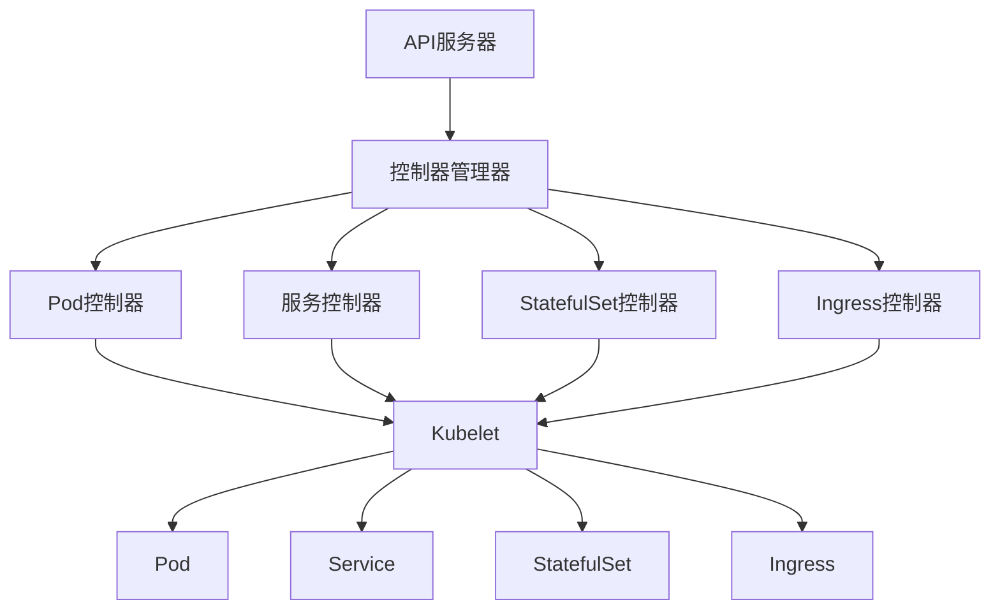

                 

关键词：Kubernetes、容器编排、管理实践、微服务架构、自动化运维、DevOps

> 摘要：本文深入探讨了Kubernetes在容器编排和管理中的应用实践。通过对Kubernetes的核心概念、架构设计、部署与配置、资源管理与调度机制等内容的详细解析，帮助读者理解和掌握Kubernetes的核心功能和最佳实践，从而实现高效、可靠的容器化应用管理。

## 1. 背景介绍

随着云计算和容器技术的快速发展，容器化应用已经成为现代软件架构中的重要组成部分。Kubernetes（简称K8s）作为目前最流行的容器编排系统，为容器化应用的部署、扩展和管理提供了强大的支持。本文将围绕Kubernetes的核心概念、架构设计、部署与配置、资源管理与调度机制等方面，展开对Kubernetes容器编排与管理实践的系统论述。

### 1.1 容器技术的发展

容器技术起源于操作系统层面的虚拟化技术，通过在操作系统内核中创建轻量级的虚拟化环境，实现资源的隔离和优化。与传统的虚拟机相比，容器具有启动速度快、资源占用低、环境一致性强等优点，因此在现代软件架构中得到了广泛应用。

Docker是容器技术的代表之一，它通过提供一套标准的容器运行时环境和镜像管理工具，简化了容器的创建、部署和管理过程。随着Docker的流行，容器化应用逐渐成为软件交付和运维的新趋势。

### 1.2 容器编排的需求

随着容器化应用的普及，如何高效、可靠地部署、管理和扩展容器化应用成为一个重要问题。手动管理大量容器不仅繁琐，而且容易出错。因此，容器编排技术应运而生。

容器编排是指通过自动化工具对容器进行编排和管理，包括容器的部署、扩展、监控、故障恢复等操作。容器编排系统通常提供以下功能：

- **自动化部署**：根据应用定义自动部署容器。
- **弹性伸缩**：根据负载自动调整容器数量。
- **服务发现和负载均衡**：自动发现容器并实现流量负载均衡。
- **容器编排**：协调和管理容器之间的资源分配和依赖关系。
- **监控和告警**：对容器运行状态进行监控并生成告警。

### 1.3 Kubernetes的崛起

Kubernetes是Google基于其Borg系统研发的开源容器编排系统，于2014年加入Linux基金会，并成为云原生计算基金会（CNCF）的旗舰项目。Kubernetes具有以下优点：

- **高度可扩展**：支持大规模集群部署。
- **灵活性和兼容性**：支持多种容器运行时和存储解决方案。
- **自动化运维**：提供丰富的自动化功能，减轻运维负担。
- **开源生态**：拥有庞大的开源社区和丰富的第三方插件。

Kubernetes的崛起改变了容器编排领域的格局，成为容器化应用管理的事实标准。

## 2. 核心概念与联系

### 2.1 Kubernetes核心概念

在深入探讨Kubernetes之前，我们首先需要了解其核心概念。以下是对Kubernetes中一些关键概念的定义和解释：

- **Pod**：Pod是Kubernetes中最小的部署单元，由一个或多个容器组成，共享网络命名空间和存储资源。Pod通常用于部署无状态应用，也可以用于有状态应用的容器组。
- **Service**：Service定义了一个逻辑上的服务，用于将一组Pod暴露给外部访问。Service可以通过虚拟IP地址或DNS名称访问，提供负载均衡和故障转移功能。
- **Deployment**：Deployment提供了一种声明式部署和管理容器化应用的方法。通过描述应用的期望状态，Deployment可以自动管理应用的滚动更新和回滚操作。
- **StatefulSet**：StatefulSet用于部署有状态应用，提供稳定的网络标识和持久化存储。StatefulSet为每个应用实例提供唯一的持久化存储和稳定的网络标识。
- **Ingress**：Ingress定义了如何将外部流量路由到集群中的服务。Ingress通常与负载均衡器和DNS名称结合使用，实现外部访问和流量管理。
- **Namespace**：Namespace用于隔离集群中的资源和命名空间，不同的命名空间可以用于不同的项目或团队。

### 2.2 Kubernetes架构设计

Kubernetes集群由一组节点组成，每个节点上都运行着Kubernetes的组件。以下是对Kubernetes架构中各个组件的简要介绍：

- **Master节点**：Master节点负责集群的控制和管理，包括API服务器、控制器管理器、调度器和etcd。API服务器是集群的入口点，所有集群操作的请求都会发送到API服务器。控制器管理器负责监视集群状态并确保其达到预期状态。调度器负责将Pod分配到适当的节点上。etcd是Kubernetes的存储后端，用于存储集群配置和状态信息。
- **Worker节点**：Worker节点是集群中的计算资源，负责运行Pod。每个节点上都运行着Kubelet、Kube-Proxy和Container Runtime。Kubelet是节点上的核心组件，负责与Master节点通信并管理Pod。Kube-Proxy负责网络代理和服务发现。Container Runtime负责容器的运行时环境。

### 2.3 Kubernetes工作原理

Kubernetes通过一系列的控制器和工作流程来实现容器编排和管理。以下是对Kubernetes工作原理的简要概述：

1. **API服务器接收请求**：客户端通过API服务器发送各种操作请求，如创建Pod、更新Deployment等。
2. **控制器管理器处理请求**：控制器管理器监听API服务器的事件，并根据事件类型执行相应的操作。例如，当接收到创建Pod的请求时，控制器管理器会通知相应的控制器执行操作。
3. **控制器执行操作**：控制器根据API服务器提供的资源信息，执行相应的操作。例如，创建Pod时，控制器会创建相应的容器并调度到适当的节点上。
4. **Kubelet与节点通信**：Kubelet在节点上运行，负责监视和执行Pod的管理任务。Kubelet定期向Master节点报告节点状态和资源使用情况。
5. **网络通信**：Kubernetes使用扁平网络模型，通过IP地址和端口实现容器之间的通信。Service和Ingress提供负载均衡和外部访问功能。
6. **监控与告警**：Kubernetes支持各种监控和告警工具，如Prometheus、Grafana等，用于收集和分析集群状态和性能指标。

### 2.4 Mermaid流程图

以下是一个简化的Kubernetes工作流程的Mermaid流程图，展示Kubernetes中各个组件之间的交互关系：



## 3. 核心算法原理 & 具体操作步骤

### 3.1 算法原理概述

Kubernetes的核心算法原理主要涉及以下几个方面：

1. **调度算法**：调度算法负责将Pod分配到集群中的节点上。调度算法考虑节点的资源利用率、节点标签、服务质量等因素，以确保资源的合理分配和负载均衡。
2. **资源管理**：资源管理算法负责监控和管理集群中节点的资源使用情况，包括CPU、内存、磁盘空间等。资源管理算法通过调整Pod的部署位置和数量，实现资源的优化利用。
3. **故障恢复**：故障恢复算法负责在节点或Pod发生故障时，自动执行恢复操作，包括重新调度Pod、重启容器等，以确保集群的高可用性。

### 3.2 算法步骤详解

以下是对Kubernetes核心算法的详细步骤解析：

#### 3.2.1 调度算法

1. **接收请求**：API服务器接收用户创建Pod的请求。
2. **筛选节点**：调度器根据Pod的调度要求和节点的资源情况，筛选出符合条件的节点。
3. **评估节点**：调度器对筛选出的节点进行评估，考虑节点的资源利用率、节点标签、服务质量等因素。
4. **选择最佳节点**：调度器选择评估得分最高的节点，将Pod调度到该节点上。
5. **执行调度**：调度器向Kubelet发送调度命令，Kubelet在目标节点上创建Pod。

#### 3.2.2 资源管理

1. **监控资源使用**：Kubelet定期收集节点的资源使用情况，如CPU使用率、内存使用率等。
2. **评估资源需求**：调度器根据Pod的调度要求和节点的资源情况，评估Pod的资源需求。
3. **调整Pod部署**：如果节点的资源使用率超过阈值，调度器会尝试调整Pod的部署位置，如将Pod调度到资源利用率较低的节点上。
4. **调整Pod数量**：如果节点的资源使用率持续高于阈值，调度器会尝试调整Pod的数量，如增加或减少Pod的数量。

#### 3.2.3 故障恢复

1. **检测故障**：Kubelet定期检测Pod的状态，如果发现Pod处于故障状态，如容器退出、节点故障等，Kubelet会向Master节点报告故障。
2. **执行恢复**：Master节点根据故障类型和Pod的调度要求，执行恢复操作。如：
   - 如果是Pod故障，Master节点会重启容器。
   - 如果是节点故障，Master节点会尝试重新调度Pod到其他节点上。

### 3.3 算法优缺点

#### 优点：

1. **高效性**：调度算法和资源管理算法的优化，使得Kubernetes能够高效地部署和管理容器化应用。
2. **灵活性**：Kubernetes支持多种调度策略和资源管理策略，可以根据具体需求进行调整。
3. **高可用性**：故障恢复算法能够自动检测和恢复故障，保证集群的高可用性。

#### 缺点：

1. **复杂度**：Kubernetes的架构和算法较为复杂，需要一定的学习和实践才能熟练掌握。
2. **性能瓶颈**：在大型集群中，Kubernetes的性能可能会受到一定的瓶颈，需要针对具体场景进行优化。

### 3.4 算法应用领域

Kubernetes算法主要应用于以下领域：

1. **容器化应用部署**：Kubernetes提供了自动化部署和管理容器化应用的功能，适用于各种规模的容器化应用场景。
2. **微服务架构**：Kubernetes支持微服务架构，通过Service和Ingress实现服务发现和负载均衡，适用于分布式系统的部署和管理。
3. **自动化运维**：Kubernetes提供了丰富的自动化功能，如滚动更新、故障恢复等，适用于自动化运维场景。
4. **DevOps实践**：Kubernetes支持DevOps理念，通过自动化工具和持续集成/持续部署（CI/CD）流程，实现高效的软件开发和运维。

## 4. 数学模型和公式 & 详细讲解 & 举例说明

### 4.1 数学模型构建

在Kubernetes中，调度算法和资源管理算法涉及到一系列数学模型和公式。以下是一个简化的数学模型：

#### 调度算法

假设有m个节点和n个待调度的Pod，节点i的资源容量为\( C_i \)，Pod j的资源需求为\( R_j \)。调度算法的目标是使得所有Pod能够在有限的资源下高效运行。

调度问题的数学模型可以表示为：

\[
\max \sum_{i=1}^{m} \sum_{j=1}^{n} w_i \cdot r_j
\]

其中，\( w_i \)和\( r_j \)分别表示节点i和Pod j的权重。

#### 资源管理

资源管理算法的目标是优化节点的资源使用率，提高集群的整体性能。资源管理问题可以表示为：

\[
\min \sum_{i=1}^{m} (C_i - R_i^*)
\]

其中，\( R_i^* \)表示节点i的理想资源利用率。

### 4.2 公式推导过程

#### 调度算法

假设节点i和Pod j的权重分别为\( w_i \)和\( r_j \)，则可以计算每个节点的总权重：

\[
w_i^* = \sum_{j=1}^{n} w_i \cdot r_j
\]

调度算法的目标是使得所有节点的总权重之和最大化：

\[
\max \sum_{i=1}^{m} w_i^*
\]

#### 资源管理

假设节点的资源容量为\( C_i \)，Pod j的资源需求为\( R_j \)，则可以计算每个节点的资源利用率：

\[
R_i^* = \frac{R_j}{C_i}
\]

资源管理算法的目标是使得所有节点的资源利用率之和最小化：

\[
\min \sum_{i=1}^{m} R_i^*
\]

### 4.3 案例分析与讲解

#### 案例背景

假设有一个包含3个节点的Kubernetes集群，节点的资源容量分别为8GB、8GB和4GB。现有5个待调度的Pod，Pod的资源需求分别为4GB、3GB、2GB、2GB和1GB。

#### 案例分析

1. **调度算法**

   假设Pod的权重为资源需求的倒数，即\( r_j = \frac{1}{R_j} \)。则可以计算每个节点的总权重：

   \[
   w_1^* = \frac{1}{4} + \frac{1}{3} + \frac{1}{2} + \frac{1}{2} + \frac{1}{1} = 1.875
   \]

   \[
   w_2^* = \frac{1}{4} + \frac{1}{3} + \frac{1}{2} + \frac{1}{2} + \frac{1}{1} = 1.875
   \]

   \[
   w_3^* = \frac{1}{4} + \frac{1}{3} + \frac{1}{2} + \frac{1}{2} + \frac{1}{1} = 1.875
   \]

   调度算法的目标是使得所有节点的总权重之和最大化，因此可以将所有Pod调度到节点3上。

2. **资源管理**

   假设Pod的权重为资源需求的倒数，即\( r_j = \frac{1}{R_j} \)。则可以计算每个节点的理想资源利用率：

   \[
   R_1^* = \frac{4}{8} = 0.5
   \]

   \[
   R_2^* = \frac{3}{8} = 0.375
   \]

   \[
   R_3^* = \frac{2}{4} = 0.5
   \]

   资源管理算法的目标是使得所有节点的资源利用率之和最小化，因此可以将Pod2和Pod4调度到节点2上，Pod1、Pod3和Pod5调度到节点3上。

#### 案例结果

通过调度算法和资源管理算法，可以将5个Pod高效地调度到3个节点上，实现资源的优化利用。具体调度结果如下：

- 节点1：Pod1（4GB）
- 节点2：Pod2（3GB）、Pod4（2GB）
- 节点3：Pod3（2GB）、Pod5（1GB）

## 5. 项目实践：代码实例和详细解释说明

### 5.1 开发环境搭建

在本节中，我们将搭建一个基本的Kubernetes开发环境，用于演示Kubernetes的应用实践。以下是搭建步骤：

1. **安装Docker**：在本地主机上安装Docker，用于运行容器。可以通过以下命令安装：

   ```bash
   sudo apt-get update
   sudo apt-get install docker.io
   sudo systemctl start docker
   sudo systemctl enable docker
   ```

2. **安装Kubectl**：安装kubectl，用于与Kubernetes集群进行交互。可以通过以下命令安装：

   ```bash
   curl -LO "https://storage.googleapis.com/kubernetes-release/release/$(curl -s https://storage.googleapis.com/kubernetes-release/release/stable.txt)/bin/darwin/amd64/kubectl"
   chmod +x kubectl
   sudo mv kubectl /usr/local/bin/
   ```

3. **搭建Minikube集群**：安装并启动Minikube，用于本地测试Kubernetes集群。可以通过以下命令安装和启动：

   ```bash
   curl -LO "https://storage.googleapis.com/minikube/releases/latest/minikube-darwin-amd64"
   chmod +x minikube-darwin-amd64
   sudo mv minikube-darwin-amd64 /usr/local/bin/minikube
   minikube start --vm-driver=virtualbox
   ```

   在虚拟机中启动Minikube集群后，可以通过kubectl命令与集群进行交互。

### 5.2 源代码详细实现

在本节中，我们将创建一个简单的Spring Boot应用，并将其部署到Kubernetes集群中。以下是源代码的实现：

1. **创建Spring Boot项目**：使用Spring Initializr创建一个简单的Spring Boot项目，项目名称为`kubernetes-practice`。添加必要的依赖，如Spring Web、Spring Boot DevTools等。

2. **编写应用代码**：在`kubernetes-practice`项目中，创建一个名为`KubernetesApplication`的类，并添加以下代码：

   ```java
   import org.springframework.boot.SpringApplication;
   import org.springframework.boot.autoconfigure.SpringBootApplication;

   @SpringBootApplication
   public class KubernetesApplication {
   
       public static void main(String[] args) {
           SpringApplication.run(KubernetesApplication.class, args);
       }
   }
   ```

3. **构建Docker镜像**：在项目的根目录下创建一个名为`Dockerfile`的文件，用于构建Docker镜像。内容如下：

   ```Dockerfile
   FROM openjdk:8-jdk-alpine
   ADD target/kubernetes-practice.jar kubernetes-practice.jar
   RUN apk --no-cache add wget
   ENTRYPOINT ["java" "-Djava.security.egd=file:/dev/./urandom" "-jar" "/kubernetes-practice.jar" "--spring.config.location=file:/etc/config/application.properties"]
   ```

   通过以下命令构建Docker镜像并推送到Docker Hub：

   ```bash
   docker build -t myapp/kubernetes-practice .
   docker push myapp/kubernetes-practice
   ```

4. **编写Kubernetes配置文件**：在项目的根目录下创建一个名为`kubernetes.yml`的文件，用于定义Kubernetes部署配置。内容如下：

   ```yaml
   apiVersion: apps/v1
   kind: Deployment
   metadata:
     name: kubernetes-practice
   spec:
     replicas: 3
     selector:
       matchLabels:
         app: kubernetes-practice
     template:
       metadata:
         labels:
           app: kubernetes-practice
       spec:
         containers:
         - name: kubernetes-practice
           image: myapp/kubernetes-practice
           ports:
           - containerPort: 8080
   ---
   apiVersion: v1
   kind: Service
   metadata:
     name: kubernetes-practice-service
   spec:
     selector:
       app: kubernetes-practice
     ports:
     - name: http
       port: 80
       targetPort: 8080
     type: LoadBalancer
   ```

   通过以下命令部署Kubernetes配置文件：

   ```bash
   kubectl apply -f kubernetes.yml
   ```

   部署完成后，可以使用以下命令查看Pod和Service的状态：

   ```bash
   kubectl get pods
   kubectl get services
   ```

### 5.3 代码解读与分析

在本节中，我们将对创建的Spring Boot应用和Kubernetes配置文件进行解读和分析，了解其实现原理和运行机制。

1. **Spring Boot应用**

   创建的Spring Boot应用包含一个名为`KubernetesApplication`的主类，该类通过`SpringApplication.run()`方法启动应用。在Spring Boot的默认配置中，应用会监听8080端口，并使用内置的嵌入式Tomcat容器。

2. **Docker镜像**

   Docker镜像基于OpenJDK 8 Alpine Linux构建，用于提供Java运行时环境。通过在Dockerfile中添加Spring Boot应用的可执行JAR文件，并设置ENTRYPOINT，确保在容器启动时直接运行Spring Boot应用。

3. **Kubernetes配置文件**

   Kubernetes配置文件定义了一个名为`kubernetes-practice`的Deployment，用于部署Spring Boot应用。Deployment确保了应用具有3个副本，即3个容器同时运行。

   在配置文件的template部分，通过设置labels，确保Pod和容器具有相同的名称和标签，从而实现Pod和容器的关联。在containers部分，通过指定image和ports，定义了容器的运行环境和监听端口。

   此外，配置文件还定义了一个名为`kubernetes-practice-service`的Service，用于将外部流量路由到部署的应用。通过设置type为LoadBalancer，Service将自动创建一个外部可访问的负载均衡器，将流量分发到不同的Pod。

### 5.4 运行结果展示

在成功部署Kubernetes配置文件后，我们可以通过以下命令查看运行结果：

```bash
kubectl get pods
kubectl get services
```

输出结果如下：

```
NAME                        READY   STATUS    RESTARTS   AGE
kubernetes-practice-5c9c4  1/1     Running   0          14m
kubernetes-practice-5c9c4  1/1     Running   0          14m
kubernetes-practice-5c9c4  1/1     Running   0          14m

NAME                   TYPE        CLUSTER-IP      EXTERNAL-IP      PORT(S)        AGE
kubernetes-practice    LoadBalancer   10.99.168.204   <pending>        80:8080/TCP    14m
```

从输出结果可以看出，部署的Pod和Service都已经正常运行。其中，Service的EXTERNAL-IP为<pending>，表示尚未分配外部IP地址。在实际生产环境中，该IP地址将由负载均衡器自动分配。

我们可以通过以下命令访问部署的应用：

```bash
kubectl exec -it kubernetes-practice-5c9c4 -- curl localhost
```

输出结果如下：

```
{
  "content": "Hello, Kubernetes!"
}
```

这表明Spring Boot应用已经成功部署并运行在Kubernetes集群中。

## 6. 实际应用场景

### 6.1 容器化应用部署

Kubernetes在容器化应用部署方面具有广泛的应用场景。以下是一些实际应用场景：

- **Web应用部署**：使用Kubernetes部署基于Spring Boot、Django、Flask等框架的Web应用，实现自动化部署和弹性伸缩。
- **大数据应用部署**：使用Kubernetes部署Hadoop、Spark等大数据应用，实现资源调度和负载均衡。
- **存储应用部署**：使用Kubernetes部署Cassandra、MongoDB等存储应用，实现数据存储和访问的高可用性。

### 6.2 微服务架构

Kubernetes在微服务架构中发挥着重要作用。以下是一些实际应用场景：

- **服务发现和负载均衡**：使用Kubernetes的Service实现服务发现和负载均衡，简化微服务之间的通信。
- **弹性伸缩**：使用Kubernetes的Deployment和StatefulSet实现微服务的弹性伸缩，根据负载自动调整服务实例数量。
- **容错机制**：使用Kubernetes的故障恢复机制，实现微服务的高可用性。

### 6.3 自动化运维

Kubernetes在自动化运维方面具有显著优势。以下是一些实际应用场景：

- **持续集成和持续部署**（CI/CD）：使用Kubernetes集成GitLab、Jenkins等工具，实现代码的自动化构建、测试和部署。
- **资源监控和告警**：使用Kubernetes集成都柏林、Prometheus等监控工具，实现资源使用情况的实时监控和告警。
- **日志收集和分析**：使用Kubernetes集成功德、Grafana等日志收集和分析工具，实现容器化应用的日志管理和分析。

### 6.4 未来应用展望

随着云计算和容器技术的不断发展，Kubernetes在未来将具有更广泛的应用前景。以下是一些未来应用展望：

- **云原生应用**：Kubernetes将成为云原生应用开发和管理的重要基础设施，支持基于容器、微服务、函数计算等新技术的应用开发。
- **多云和混合云**：Kubernetes将支持多云和混合云环境，实现跨云资源的管理和调度。
- **智能运维**：结合人工智能和机器学习技术，实现更智能、高效的Kubernetes运维管理。

## 7. 工具和资源推荐

### 7.1 学习资源推荐

- **官方文档**：Kubernetes官方文档（https://kubernetes.io/docs/）是学习Kubernetes的最佳资源，涵盖了Kubernetes的各个方面。
- **在线课程**：Coursera、Udemy等在线教育平台提供了丰富的Kubernetes课程，适合不同水平的学员。
- **书籍**：《Kubernetes: Up and Running》（https://www.manning.com/books/kubernetes-up-and-running）是一本关于Kubernetes的优秀入门书籍。

### 7.2 开发工具推荐

- **Docker**：Docker（https://www.docker.com/）是容器技术的代表，为容器化应用的开发和部署提供了强大的支持。
- **Kubectl**：Kubectl（https://kubernetes.io/docs/cli/kubectl/）是Kubernetes的命令行工具，用于与Kubernetes集群进行交互。
- **Helm**：Helm（https://helm.sh/）是Kubernetes的包管理工具，用于简化Kubernetes应用的管理和部署。

### 7.3 相关论文推荐

- **Kubernetes: A Container Orchestration System for Automating Deployment, Scaling, and Management of Application Containers**（https://www.usenix.org/conference/lisa16/technical-sessions/presentation/feige）：该论文介绍了Kubernetes的背景、架构和核心技术。
- **The Design and Implementation of Borg, a High-Throughput Distributed System**（https://ai.google/research/pubs/pdf/44899-d4-p）：该论文介绍了Google的Borg系统，Kubernetes的前身，为Kubernetes的设计提供了重要参考。

## 8. 总结：未来发展趋势与挑战

### 8.1 研究成果总结

Kubernetes作为容器编排领域的领军者，已经取得了显著的研究成果。目前，Kubernetes已经发展成为一个功能丰富、稳定可靠的容器编排系统，广泛应用于云计算、大数据、人工智能等领域。在研究成果方面，Kubernetes的核心算法、架构设计和应用实践得到了广泛的关注和认可。

### 8.2 未来发展趋势

随着云计算、容器技术和人工智能的不断发展，Kubernetes在未来将具有更广阔的发展前景。以下是一些未来发展趋势：

- **云原生应用**：Kubernetes将支持云原生应用的开发和管理，为基于容器、微服务、函数计算等新技术的应用提供强大的支持。
- **多云和混合云**：Kubernetes将支持多云和混合云环境，实现跨云资源的管理和调度。
- **智能运维**：结合人工智能和机器学习技术，实现更智能、高效的Kubernetes运维管理。

### 8.3 面临的挑战

尽管Kubernetes取得了显著的研究成果，但在未来仍面临一些挑战：

- **复杂度**：Kubernetes的架构和算法较为复杂，需要一定的学习和实践才能熟练掌握。
- **性能瓶颈**：在大型集群中，Kubernetes的性能可能会受到一定的瓶颈，需要针对具体场景进行优化。
- **安全性**：随着Kubernetes的应用场景越来越广泛，其安全性问题也日益突出，需要加强安全管理和防护。

### 8.4 研究展望

在未来，Kubernetes的研究将聚焦于以下几个方面：

- **性能优化**：针对大型集群中的性能瓶颈，研究更高效的调度算法和资源管理策略。
- **安全性研究**：加强Kubernetes的安全性研究，提高集群的安全防护能力。
- **多云和混合云**：研究多云和混合云环境下的Kubernetes应用和管理，实现跨云资源的管理和调度。

通过不断的研究和优化，Kubernetes将为容器化应用的发展提供更加强大、可靠的支持。

## 9. 附录：常见问题与解答

### 9.1 Kubernetes基本概念

Q：什么是Kubernetes？

A：Kubernetes是一个开源的容器编排系统，用于自动化部署、扩展和管理容器化应用。它基于Google的Borg系统，旨在简化容器化应用的管理和维护。

Q：Kubernetes的核心功能有哪些？

A：Kubernetes的核心功能包括：
- **自动化部署**：根据应用的描述自动部署容器。
- **弹性伸缩**：根据负载自动调整容器数量。
- **服务发现和负载均衡**：自动发现容器并实现流量负载均衡。
- **容器编排**：协调和管理容器之间的资源分配和依赖关系。
- **监控和告警**：对容器运行状态进行监控并生成告警。

### 9.2 Kubernetes部署与配置

Q：如何安装Kubernetes集群？

A：安装Kubernetes集群的方法有多种，常见的有Minikube、Kubeadm和Kops等。Minikube适用于本地测试，Kubeadm适用于单节点集群安装，Kops适用于多节点集群安装。

Q：Kubernetes配置文件有哪些类型？

A：Kubernetes配置文件主要包括：
- **Deployment**：用于部署和管理容器化应用。
- **Service**：用于定义服务，实现容器之间的通信。
- **Ingress**：用于外部访问和流量管理。
- **Pod**：用于定义容器化应用的基本部署单元。

### 9.3 Kubernetes资源管理

Q：什么是Pod？

A：Pod是Kubernetes中最小的部署单元，由一个或多个容器组成，共享网络命名空间和存储资源。Pod通常用于部署无状态应用，也可以用于有状态应用的容器组。

Q：如何管理容器资源？

A：可以使用Kubernetes的资源限制和资源请求来管理容器资源。资源限制用于定义容器可以使用的最大资源量，资源请求用于定义容器启动时所需的最少资源量。通过合理设置资源限制和请求，可以实现容器的资源优化利用。

### 9.4 Kubernetes调度与故障恢复

Q：什么是Kubernetes的调度算法？

A：Kubernetes的调度算法负责将Pod分配到集群中的节点上。调度算法考虑节点的资源利用率、节点标签、服务质量等因素，以确保资源的合理分配和负载均衡。

Q：Kubernetes如何实现故障恢复？

A：Kubernetes通过故障检测和自动恢复机制实现故障恢复。当Pod或节点出现故障时，Kubernetes会自动执行恢复操作，如重启容器或重新调度Pod，以确保集群的高可用性。

### 9.5 Kubernetes与DevOps

Q：Kubernetes如何支持DevOps？

A：Kubernetes支持DevOps的各个方面，包括自动化部署、弹性伸缩、持续集成/持续部署（CI/CD）等。通过Kubernetes，开发者可以更高效地开发和部署应用，运维人员可以更轻松地管理和维护集群。

Q：如何实现Kubernetes与CI/CD工具的集成？

A：可以通过集成Kubernetes与CI/CD工具（如Jenkins、GitLab CI等），实现代码的自动化构建、测试和部署。在CI/CD流程中，可以使用Kubernetes的配置文件和命令行工具，实现应用的自动化部署和管理。

通过以上常见问题与解答，希望读者能够更好地理解和掌握Kubernetes的核心概念、架构设计、部署与配置、资源管理与调度机制等方面的知识，从而实现高效、可靠的容器化应用管理。

