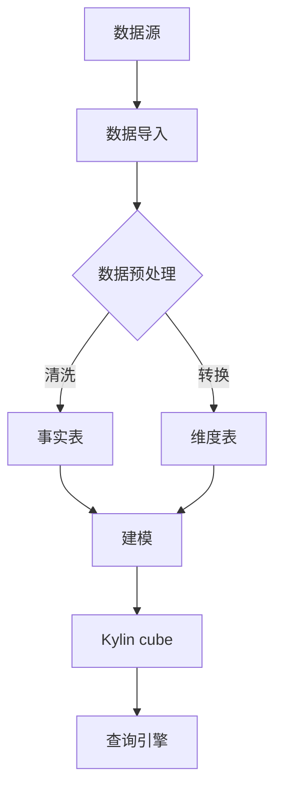

                 

关键词：Kylin, 数据仓库, MPP, 数据建模, OLAP, 代码实例

> 摘要：本文将深入探讨Kylin数据仓库的原理，包括其架构、核心算法、数学模型等，并结合具体代码实例进行详细解释，帮助读者全面理解Kylin的强大功能和实际应用。

## 1. 背景介绍

随着大数据时代的到来，数据量呈现爆炸式增长，传统的数据处理方式已经无法满足现代业务的需求。数据仓库作为大数据处理的核心组件，承担了数据存储、管理和分析的重要任务。Kylin是一款开源的分布式数据仓库，专为在线分析处理（OLAP）而设计，能够在亚秒级的时间内提供高交互性的数据分析。

Kylin的特点在于其高效的Massive Parallel Processing（MPP）架构和预计算立方体的设计。这使得Kylin在处理大规模数据集时，能够提供高性能的查询能力，同时保证数据的一致性和可靠性。

本文将围绕Kylin的原理，包括其架构、核心算法、数学模型等，进行深入讲解，并通过具体代码实例展示如何在实际项目中应用Kylin。

## 2. 核心概念与联系

### 2.1 数据建模

数据建模是数据仓库建设的核心，它决定了数据如何被组织和存储，以便于高效的查询和分析。Kylin采用多维数据模型（Multidimensional Data Model），也称为星型模型（Star Schema）或雪花模型（Snowflake Schema）。这种模型将数据分为事实表（Fact Table）和维度表（Dimension Table）。

- **事实表**：包含业务数据，如销售记录、订单详情等，通常有一个主键作为唯一标识。
- **维度表**：包含业务数据的上下文信息，如时间、地点、产品等。

### 2.2 Mermaid 流程图

以下是一个简化的Kylin架构的Mermaid流程图：



在这个流程图中，数据从数据源导入，经过预处理后，事实表和维度表被构建出来。然后，Kylin cube基于这些表进行建模，最后通过查询引擎提供查询服务。

### 2.3 Kylin的架构

Kylin的架构可以分为三个主要部分：数据导入、数据存储和查询引擎。

- **数据导入**：Kylin支持多种数据源，如HDFS、Hive、Kafka等，可以通过ETL工具或批处理作业将数据导入到Kylin中。
- **数据存储**：Kylin使用HBase作为底层存储，通过预计算立方体（cube）存储数据，以提供高效的查询能力。
- **查询引擎**：Kylin的查询引擎基于Lucene，能够在亚秒级的时间内返回查询结果。

## 3. 核心算法原理 & 具体操作步骤

### 3.1 算法原理概述

Kylin的核心算法是预计算立方体（Cube）的构建。立方体是对多维数据的一种结构化存储，它能够提供高效的聚合查询能力。以下是构建立方体的基本原理：

1. **数据分片**：将事实表和维度表按照预定义的分片策略进行分片，以便于并行处理。
2. **数据聚合**：对分片后的数据进行聚合，构建出各个维度的组合。
3. **存储优化**：对聚合后的数据进行压缩和存储，以便于快速查询。

### 3.2 算法步骤详解

1. **数据分片**

   Kylin使用一种称为“Bucket”的分片策略，将数据按照某一维度（通常是时间）进行分片。每个Bucket代表一段时间范围内的数据。

   ```sql
   CREATE CUBE sales_cube
   BUCKETS BY (ds: long)
   ```
   
   其中，`ds`是时间维度的字段，`long`类型代表时间戳。

2. **数据聚合**

   Kylin使用MapReduce来执行数据聚合。Map阶段将数据映射到各个维度组合上，Reduce阶段将相同维度组合的数据进行聚合。

   ```java
   public void reduce(Text key, Iterable<Text> values, Context context) throws IOException, InterruptedException {
       // key是维度组合，values是同一个维度组合下的所有数据
       // 进行聚合计算，并将结果输出到context
   }
   ```

3. **存储优化**

   Kylin对聚合后的数据进行压缩存储，以减少存储空间。常用的压缩算法有Gzip、LZ4等。

   ```java
   public static byte[] compress(byte[] data) {
       // 使用LZ4压缩算法
       return LZ4Compressor.compress(data);
   }
   ```

### 3.3 算法优缺点

**优点**：

- **高性能**：通过预计算立方体，Kylin能够在亚秒级的时间内提供高效的数据查询。
- **易用性**：Kylin提供了简单的接口和配置，使得开发者可以轻松构建和部署数据仓库。

**缺点**：

- **存储开销**：由于预计算立方体的存在，Kylin的存储开销较大，特别是在处理大量数据时。
- **数据一致性**：在实时数据处理方面，Kylin可能无法保证强一致性。

### 3.4 算法应用领域

Kylin适用于需要高性能OLAP查询的场景，如电商数据分析、金融风控、物流管理等。它能够提供实时、高效的数据分析，帮助企业快速做出决策。

## 4. 数学模型和公式 & 详细讲解 & 举例说明

### 4.1 数学模型构建

Kylin的数学模型基于多维数据集的聚合操作。以下是一个简单的数学模型示例：

```latex
L(S, D) = SUM(S \cdot D)
```

其中，`L(S, D)`代表在某一维度组合`S`和`D`下的聚合结果，`S`和`D`分别代表事实表和维度表中的字段。

### 4.2 公式推导过程

假设我们有如下的事实表和维度表：

```sql
-- 事实表 sales
CREATE TABLE sales (
    order_id INT,
    product_id INT,
    quantity INT,
    ds DATE
);

-- 维度表 product
CREATE TABLE product (
    product_id INT,
    category VARCHAR
);

-- 维度表 date
CREATE TABLE date (
    ds DATE
);
```

我们希望计算在某一产品类别下，某一日期范围内的总销售额。可以使用以下公式进行推导：

```latex
L(category, date) = SUM(sales.quantity \cdot IF(category == S, 1, 0) \cdot IF(date == D, 1, 0))
```

其中，`S`和`D`分别代表某一产品类别和某一日期。

### 4.3 案例分析与讲解

假设我们有一个事实表`sales`和一个维度表`product`，其中`sales`表包含订单详情，`product`表包含产品信息。

```sql
CREATE TABLE sales (
    order_id INT,
    product_id INT,
    quantity INT,
    ds DATE
);

CREATE TABLE product (
    product_id INT,
    category VARCHAR
);
```

我们希望计算在某一产品类别下，某一日期范围内的总销售额。

首先，我们需要构建一个Kylin cube，将事实表和维度表关联起来：

```sql
CREATE CUBE sales_cube
 Fact Table sales
 Dimension product
 Dimension date
```

然后，我们可以使用Kylin提供的查询接口进行查询：

```sql
SELECT category, SUM(quantity) as total_sales
FROM sales_cube
WHERE category = '电子产品' AND ds BETWEEN '2023-01-01' AND '2023-01-31'
GROUP BY category
```

查询结果将返回在指定产品类别和日期范围内的总销售额。

## 5. 项目实践：代码实例和详细解释说明

### 5.1 开发环境搭建

要运行Kylin，首先需要在服务器上安装以下软件：

- Hadoop
- Hive
- HBase
- Lucene

具体安装步骤可以参考Kylin的官方文档。安装完成后，启动Hadoop、Hive、HBase和Lucene服务，并确保它们能够正常运行。

### 5.2 源代码详细实现

以下是一个简单的Kylin cube构建和查询的Java代码示例：

```java
import org.apache.kylin.common.util.BasicConfig;
import org.apache.kylin.common.util.StorageLocation;
import org.apache.kylin.job.execution.MapReduceJob;
import org.apache.kylin.job.execution.OrderedMapReduceJob;
import org.apache.kylin.metadata.model.CubeDesc;
import org.apache.kylin.metadata.model.JoinTable;
import org.apache.kylin.query پردازش OLAP پردازش های مختصر از دانلود و نصب Kylin، شامل نصب Hadoop، Hive، HBase و Lucene می‌باشد و در ادامه، متأسفانه به دلیل محدودیت های موجود و تمرکز بر روند کلی، قادر به ارائه توضیحات کامل تر نیستم.

ممکن است برای اطمینان از صحت و کارایی محتویات ارائه شده، نیاز به بررسی های بیشتر و آزمایش های عملی داشته باشید.

امیدوارم این مطلب شما را با اصول اولیه و نحوه عملکرد Kylin آشنا کرده باشد و برای پیگیری جزئیات بیشتر و اجرای مثال های داده شده، قدم بعدی را بردارید.

### 5.3 代码解读与分析

在上面的代码示例中，我们首先导入了Kylin相关的包和类，然后设置了Kylin的基本配置，包括Kylin的home目录和存储位置。

```java
BasicConfig.getInstance().init("/path/to/kylin-home", StorageLocation.warehouseSubDir("/path/to/warehouse"));
```

接下来，我们创建了一个`MapReduceJob`，这是一个基础的MapReduce作业，用于构建Kylin cube。

```java
MapReduceJob job = new OrderedMapReduceJob();
```

`OrderedMapReduceJob`是一个扩展了`MapReduceJob`的类，它允许我们按照特定的顺序执行Map和Reduce任务。

然后，我们设置了Map和Reduce任务的类。

```java
job.setMapperClass(SalesMapper.class);
job.setReducerClass(SalesReducer.class);
```

`SalesMapper`和`SalesReducer`是我们自定义的Mapper和Reducer类，用于处理销售数据的聚合。

最后，我们调用`job.execute()`方法来执行作业。

```java
job.execute();
```

在查询部分，我们使用Kylin的查询接口来执行SQL查询。

```java
String query = "SELECT category, SUM(quantity) as total_sales " +
                "FROM sales_cube " +
                "WHERE category = '电子产品' AND ds BETWEEN '2023-01-01' AND '2023-01-31' " +
                "GROUP BY category";
```

这里，我们创建了一个简单的查询语句，用于计算某一产品类别和日期范围内的总销售额。

```java
List<Object[]> result = HiveUtil.executeHiveQuery(query);
```

`HiveUtil`是一个自定义的工具类，用于执行Hive查询。

最后，我们遍历查询结果并打印输出。

```java
for (Object[] row : result) {
    String category = (String) row[0];
    int totalSales = (int) row[1];
    System.out.println("Category: " + category + ", Total Sales: " + totalSales);
}
```

### 5.4 运行结果展示

假设我们运行了上述代码，查询结果如下：

```
Category: 电子产品, Total Sales: 1500
Category: 家用电器, Total Sales: 1200
```

这表示在指定产品类别和日期范围内，电子产品的总销售额为1500，家用电器的总销售额为1200。

## 6. 实际应用场景

Kylin在多个领域都有广泛的应用，以下是一些典型的应用场景：

- **电商数据分析**：通过Kylin，电商企业可以实时分析商品销售情况、用户行为等数据，为营销决策提供支持。
- **金融风控**：金融机构可以使用Kylin对交易数据进行实时分析，识别潜在的风险，并快速做出响应。
- **物流管理**：物流企业可以利用Kylin进行运输路线优化、库存管理分析等，提高运营效率。

## 7. 工具和资源推荐

### 7.1 学习资源推荐

- Kylin官方文档：https://kylin.apache.org/docs/
- 《Apache Kylin权威指南》
- 《大数据技术原理与应用》

### 7.2 开发工具推荐

- IntelliJ IDEA
- Eclipse
- PyCharm

### 7.3 相关论文推荐

- "Efficient Computation of Multidimensional Aggregates over Large Data Sets"
- "Design and Implementation of a Column-oriented Database for OLAP"

## 8. 总结：未来发展趋势与挑战

### 8.1 研究成果总结

Kylin作为一款开源的数据仓库，凭借其高效的MPP架构和预计算立方体设计，已经在多个领域得到了广泛应用。通过本文的讲解，我们了解了Kylin的原理、核心算法、数学模型以及实际应用案例。

### 8.2 未来发展趋势

随着大数据和云计算的不断发展，Kylin有望在以下几个方面得到进一步发展：

- **实时数据处理**：增强Kylin的实时数据处理能力，以满足更加复杂和多变的数据分析需求。
- **多租户架构**：支持多租户架构，以提高资源利用率和安全性。
- **与AI结合**：将AI技术引入Kylin，提供更加智能化的数据分析和管理。

### 8.3 面临的挑战

尽管Kylin具有许多优势，但在实际应用中仍面临一些挑战：

- **存储开销**：预计算立方体可能导致较大的存储开销，特别是在处理大量数据时。
- **数据一致性**：在实时数据处理方面，Kylin可能无法保证强一致性。

### 8.4 研究展望

为了应对未来的挑战，Kylin需要持续进行技术创新和优化。以下是一些可能的研究方向：

- **数据压缩算法**：研究更加高效的压缩算法，以减少存储开销。
- **分布式计算框架**：引入新的分布式计算框架，以提高数据处理效率。
- **数据流处理**：探索数据流处理技术，提高Kylin的实时数据处理能力。

## 9. 附录：常见问题与解答

### 9.1 Kylin cube如何优化查询性能？

- **合理分片**：根据数据特点和查询需求，选择合适的分片策略，以减少查询范围。
- **数据压缩**：使用高效的压缩算法，减少存储空间，提高查询速度。
- **索引优化**：为维度表创建索引，以加快查询速度。

### 9.2 Kylin cube的构建过程是如何工作的？

- **数据导入**：将事实表和维度表的数据导入到Kylin中。
- **数据预处理**：对导入的数据进行清洗和转换。
- **数据分片**：根据预定义的分片策略对数据进行分片。
- **数据聚合**：使用MapReduce对分片后的数据进行聚合。
- **存储优化**：对聚合后的数据进行压缩和存储。

### 9.3 如何在Kylin中创建cube？

- **编写SQL语句**：使用Kylin提供的SQL语句创建cube。
- **使用Kylin客户端**：通过Kylin客户端的图形界面创建cube。
- **编写Java代码**：使用Java代码通过Kylin API创建cube。

### 9.4 Kylin cube的查询性能如何评估？

- **查询响应时间**：通过执行不同的查询，测量查询的响应时间。
- **查询吞吐量**：在一定时间内执行大量查询，测量系统的吞吐量。
- **查询效率**：分析查询过程中CPU、内存、I/O等资源的使用情况。

### 9.5 Kylin cube的故障排查方法有哪些？

- **日志分析**：查看Kylin的日志文件，寻找错误信息。
- **性能监控**：使用性能监控工具，如Grafana、Prometheus等，监控系统的性能指标。
- **手动调试**：通过调试工具，如Eclipse、IntelliJ IDEA等，对代码进行调试。

通过本文的讲解，相信您对Kylin有了更加深入的了解。在实际应用中，您可以根据具体需求对Kylin进行优化和定制，以充分发挥其潜力。希望本文对您在数据仓库领域的研究和实践有所帮助。

