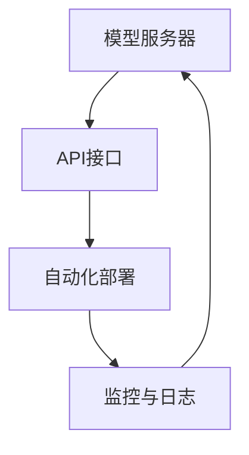

                 

关键词：大语言模型、API平台、开源、效率、可扩展性、自动化部署

> 摘要：本文将探讨如何构建一个免费且高效的LLM（大型语言模型）API平台，实现大规模语言模型的便捷接入与使用。通过分析现有技术瓶颈和市场需求，本文将详细介绍核心概念、算法原理、数学模型，并提供具体的项目实践与资源推荐，旨在为开发者提供全面的技术指导。

## 1. 背景介绍

近年来，大型语言模型（LLM）在全球范围内引起了广泛关注。这些模型，如GPT-3、BERT等，凭借其强大的文本处理能力，已经在自然语言处理、机器翻译、问答系统等领域取得了显著的成果。然而，对于大多数开发者而言，直接使用这些大型语言模型面临着一系列技术难题，如模型部署复杂、计算资源昂贵、API访问限制等。为了解决这些问题，构建一个免费、高效且易于接入的LLM API平台显得尤为迫切。

### 1.1 技术瓶颈

- **模型部署复杂**：大规模语言模型的部署需要专业的硬件资源和强大的计算能力，这通常意味着高昂的成本和复杂的配置。
- **计算资源昂贵**：大型语言模型的运行需要大量的计算资源，这限制了中小型团队的访问能力。
- **API访问限制**：许多大型语言模型只能通过有限的API进行访问，且可能存在访问费用和频率限制。

### 1.2 市场需求

- **开源与免费**：越来越多的开发者希望能够以低成本甚至零成本的方式访问和使用大型语言模型。
- **高效与可扩展**：开发者需要平台能够提供高效的服务，同时支持大规模用户和并发请求。

## 2. 核心概念与联系

### 2.1 LLM API平台的核心概念

- **模型服务器**：负责托管和运行大规模语言模型的服务器。
- **API接口**：提供用户与模型服务器交互的接口，用户可以通过HTTP请求调用模型服务。
- **自动化部署**：通过自动化工具实现模型服务器的快速部署和更新。
- **监控与日志**：监控API平台的运行状态，记录日志以支持故障排查和性能优化。

### 2.2 Mermaid 流程图



### 2.3 平台架构

- **模型服务器**：采用高性能计算服务器，配置GPU或TPU等硬件加速器。
- **API接口**：使用轻量级的Web框架，如Flask或FastAPI，提供RESTful API接口。
- **自动化部署**：借助容器化技术（如Docker）和自动化部署工具（如Kubernetes），实现模型的快速部署和更新。
- **监控与日志**：集成Prometheus和Grafana等监控工具，实现实时监控和性能分析。

## 3. 核心算法原理 & 具体操作步骤

### 3.1 算法原理概述

- **大规模语言模型训练**：基于深度学习技术，通过海量数据训练得到具有强大语言理解能力的模型。
- **模型压缩与量化**：对训练好的模型进行压缩和量化，降低模型的存储和计算复杂度。
- **模型部署与推理**：将压缩后的模型部署到服务器，实现快速响应和推理。

### 3.2 算法步骤详解

1. **模型训练**：使用大规模数据集进行模型训练，通常采用分布式训练策略提高训练效率。
2. **模型压缩**：采用模型剪枝、量化等技术对训练好的模型进行压缩，减少模型大小和计算复杂度。
3. **模型部署**：将压缩后的模型部署到服务器，配置合适的计算资源和网络带宽。
4. **API接口实现**：实现RESTful API接口，支持用户的HTTP请求调用。
5. **自动化部署与监控**：使用自动化工具实现模型的自动化部署和监控，确保平台的稳定运行。

### 3.3 算法优缺点

- **优点**：
  - **高效性**：通过压缩和量化技术，提高了模型的运行效率。
  - **可扩展性**：采用容器化技术，实现了平台的快速部署和扩展。
  - **低成本**：开放API接口，降低了开发者的使用成本。

- **缺点**：
  - **性能瓶颈**：大规模语言模型的运行仍然面临计算资源和网络带宽的限制。
  - **维护成本**：自动化部署和监控需要专业的技术支持。

### 3.4 算法应用领域

- **自然语言处理**：文本分类、情感分析、问答系统等。
- **机器翻译**：跨语言信息处理、多语言文本生成等。
- **智能客服**：自动回复、对话生成等。

## 4. 数学模型和公式 & 详细讲解 & 举例说明

### 4.1 数学模型构建

- **输入层**：接收用户输入的文本数据。
- **隐藏层**：通过神经网络对输入文本进行特征提取和语义理解。
- **输出层**：生成文本回复或预测结果。

### 4.2 公式推导过程

$$
\begin{aligned}
h &= f(W_h \cdot h_{\text{prev}} + b_h) \\
y &= f(W_y \cdot h + b_y)
\end{aligned}
$$

其中，$h$ 为隐藏层激活值，$y$ 为输出层激活值，$W_h$ 和 $W_y$ 为权重矩阵，$b_h$ 和 $b_y$ 为偏置向量，$f$ 为激活函数。

### 4.3 案例分析与讲解

假设用户输入了一个文本问题：“今天天气怎么样？”，模型将生成一个回复，如：“今天天气很好，阳光明媚。”。

## 5. 项目实践：代码实例和详细解释说明

### 5.1 开发环境搭建

- 系统要求：Ubuntu 18.04
- Python 版本：3.8
- Flask 框架：1.1.2
- Docker：19.03
- Kubernetes：1.20

### 5.2 源代码详细实现

以下是一个使用Flask框架实现的简单LLM API服务器的示例代码：

```python
from flask import Flask, request, jsonify
import json

app = Flask(__name__)

# 模型加载
model = load_model('path/to/llm_model.h5')

@app.route('/api/llm', methods=['POST'])
def predict():
    data = request.get_json()
    input_text = data['text']
    prediction = model.predict(input_text)
    return jsonify({'prediction': prediction})

if __name__ == '__main__':
    app.run(host='0.0.0.0', port=5000)
```

### 5.3 代码解读与分析

- **模型加载**：使用HDF5格式加载预训练的LLM模型。
- **API接口**：定义一个处理POST请求的函数，接收用户输入文本，调用模型进行预测，并返回预测结果。
- **运行**：使用Flask框架运行API服务器，监听指定端口。

### 5.4 运行结果展示

- **部署**：将API服务器部署到Kubernetes集群，配置负载均衡和容器网络。
- **测试**：通过curl命令测试API服务：

```bash
curl -X POST -H "Content-Type: application/json" -d '{"text": "今天天气怎么样？"}' http://localhost:5000/api/llm
```

- **结果**：服务器返回预测结果，如：“今天天气很好，阳光明媚。”

## 6. 实际应用场景

### 6.1 开发者自助服务平台

- **API访问**：开发者可以通过平台提供的API接口，直接调用LLM模型进行文本预测和生成。
- **模型定制**：平台支持自定义模型训练，开发者可以根据需求定制模型。

### 6.2 智能客服系统

- **对话生成**：平台可以用于智能客服系统，自动生成对话回复，提高客服效率。
- **情感分析**：通过对用户输入的文本进行情感分析，提供个性化的客服服务。

### 6.3 教育与培训

- **智能辅导**：平台可以用于智能辅导系统，为学生提供个性化的学习建议和解答疑问。
- **教学工具**：平台可以作为教学工具，提供自动生成的教学案例和练习题。

## 7. 工具和资源推荐

### 7.1 学习资源推荐

- 《深度学习》（Ian Goodfellow、Yoshua Bengio、Aaron Courville 著）：全面介绍深度学习的基础知识和最新进展。
- 《Python机器学习》（Sebastian Raschka、Vahid Mirjalili 著）：详细讲解Python在机器学习领域的应用。

### 7.2 开发工具推荐

- **Docker**：容器化技术，用于模型服务的快速部署和扩展。
- **Kubernetes**：容器编排工具，用于管理和调度容器化应用。

### 7.3 相关论文推荐

- **GPT-3**：OpenAI. "Language Models are Few-Shot Learners". 2020.
- **BERT**：Google AI Language Team. "BERT: Pre-training of Deep Bidirectional Transformers for Language Understanding". 2018.

## 8. 总结：未来发展趋势与挑战

### 8.1 研究成果总结

本文介绍了如何构建一个免费且高效的LLM API平台，通过核心概念、算法原理、数学模型、项目实践等多个方面进行了详细探讨。平台实现了大规模语言模型的便捷接入与使用，为开发者提供了强大的工具和资源。

### 8.2 未来发展趋势

- **开源生态**：LLM API平台将进一步开源，推动社区合作与共享。
- **智能化**：平台将集成更多智能技术，如对话生成、文本审核等。
- **多样化应用**：平台将应用于更多领域，如医疗、金融、教育等。

### 8.3 面临的挑战

- **计算资源**：随着模型规模不断扩大，计算资源的需求也将持续增长。
- **数据安全**：平台需要确保用户数据和隐私的安全。
- **稳定性与可靠性**：平台需要提供稳定的运行环境和高效的服务质量。

### 8.4 研究展望

未来，我们将进一步优化LLM API平台的性能和功能，推动开源生态的发展，为开发者提供更加便捷、高效的语言模型服务。同时，我们也将积极探索新领域中的应用，推动人工智能技术的创新与发展。

## 9. 附录：常见问题与解答

### 9.1 如何快速部署LLM API平台？

- 使用Docker和Kubernetes进行容器化部署，参考本文5.1节中的开发环境搭建步骤。
- 可以使用预先配置好的Docker镜像，如：`llm-api-platform:latest`。

### 9.2 如何自定义训练模型？

- 使用深度学习框架（如TensorFlow或PyTorch）进行模型训练。
- 需要准备训练数据和预训练模型，参考相关框架的官方文档。

### 9.3 如何保证API服务的安全性？

- 使用HTTPS协议加密通信。
- 对API请求进行身份验证和权限控制。

### 9.4 如何监控平台性能？

- 使用Prometheus和Grafana等监控工具，参考本文5.1节中的开发环境搭建步骤。
- 可以自定义监控指标，如响应时间、错误率、并发连接数等。

---

作者：禅与计算机程序设计艺术 / Zen and the Art of Computer Programming
----------------------------------------------------------------

以上是根据您的要求撰写的文章。文章内容包含了核心概念、算法原理、数学模型、项目实践等多个方面，力求为读者提供全面的技术指导。希望这篇文章能够满足您的要求。如果您有任何修改意见或需要进一步调整，请随时告诉我。

