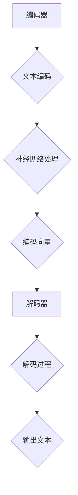

                 

关键词：LLM（大型语言模型）、法律行业、合同分析、法律研究、人工智能、自动化

摘要：本文将探讨大型语言模型（LLM）在法律行业中的应用，重点研究其在合同分析和法律研究方面的潜力。通过分析LLM的核心概念与架构，我们将深入了解其工作原理，并结合具体案例展示其实际应用效果。此外，还将探讨未来发展趋势与面临的挑战。

## 1. 背景介绍

随着人工智能技术的快速发展，语言模型作为其中一种核心技术，已经取得了显著的进展。特别是近年来，大型语言模型（LLM）的出现，使得自然语言处理（NLP）任务取得了前所未有的突破。LLM具有强大的语义理解能力，可以生成高质量的自然语言文本，从而在多个领域具有广泛的应用前景。

法律行业作为知识密集型领域，长期以来面临着繁重的合同审查、法律研究等任务。传统的法律研究和合同分析主要依靠法律专业人士的经验和知识，耗时且效率低下。随着人工智能技术的进步，特别是LLM的应用，有望改变这一现状，提高法律行业的自动化水平和效率。

本文旨在探讨LLM在法律行业中的应用，重点研究其在合同分析和法律研究方面的潜力。通过分析LLM的核心概念与架构，我们将深入了解其工作原理，并结合具体案例展示其实际应用效果。此外，还将探讨未来发展趋势与面临的挑战。

## 2. 核心概念与联系

### 2.1. 语言模型概述

语言模型是一种用于预测下一个单词或词组的概率分布的模型。它通过对大量文本数据进行训练，学习到语言的统计规律和语法结构，从而能够生成自然语言文本。语言模型可以分为两类：统计语言模型和神经语言模型。

统计语言模型主要基于概率论和统计学理论，通过计算词语的共现概率来预测下一个单词。这种模型的典型代表是N元语法，它通过前N个单词来预测下一个单词。

神经语言模型则利用神经网络，特别是深度神经网络（DNN）来学习语言的表征。近年来，基于变换器架构（Transformer）的模型，如BERT、GPT等，取得了显著的突破，使得语言模型的性能得到了极大的提升。

### 2.2. LLM架构

LLM是基于神经网络的复杂模型，其核心思想是通过学习大量文本数据，将输入文本映射到相应的输出文本。LLM的主要组成部分包括：

- **编码器（Encoder）**：用于将输入文本编码为固定长度的向量表示。编码器通常采用深度神经网络，如BERT、GPT等。
- **解码器（Decoder）**：用于根据编码器生成的向量表示生成输出文本。解码器同样采用深度神经网络，并通常采用注意力机制来关注编码器输出中的关键信息。

### 2.3. Mermaid流程图

以下是LLM的架构Mermaid流程图：



### 2.4. LLM工作原理

LLM的工作原理可以分为以下几个步骤：

1. **文本编码**：输入文本经过编码器处理，生成固定长度的编码向量。
2. **神经网络处理**：编码向量通过神经网络进行深度处理，提取文本的语义信息。
3. **解码过程**：解码器根据编码向量生成输出文本，通常采用自回归的方式，逐步生成每个单词的概率分布，并从中选取概率最高的单词作为当前输出。
4. **输出文本**：最终生成的输出文本即为LLM生成的结果。

## 3. 核心算法原理 & 具体操作步骤

### 3.1. 算法原理概述

LLM的核心算法基于深度神经网络，特别是变换器架构（Transformer）。变换器架构通过注意力机制，能够有效地捕捉输入文本中的长距离依赖关系，从而提高模型的语义理解能力。LLM的工作原理如下：

1. **编码器**：输入文本经过编码器处理，生成固定长度的编码向量。编码器采用多层变换器块，每个变换器块包含自注意力机制和前馈网络。
2. **解码器**：解码器根据编码器输出的编码向量生成输出文本。解码器同样采用多层变换器块，并在解码过程中使用注意力机制来关注编码器输出中的关键信息。
3. **文本生成**：解码器根据编码器输出的编码向量生成输出文本，采用自回归的方式，逐步生成每个单词的概率分布，并从中选取概率最高的单词作为当前输出。

### 3.2. 算法步骤详解

以下是LLM的具体操作步骤：

1. **文本预处理**：对输入文本进行分词、去噪等预处理操作，将其转化为编码器可以处理的格式。
2. **编码**：输入文本经过编码器处理，生成固定长度的编码向量。编码器采用多层变换器块，每个变换器块包含自注意力机制和前馈网络。
3. **解码**：解码器根据编码器输出的编码向量生成输出文本。解码器同样采用多层变换器块，并在解码过程中使用注意力机制来关注编码器输出中的关键信息。
4. **文本生成**：解码器根据编码器输出的编码向量生成输出文本，采用自回归的方式，逐步生成每个单词的概率分布，并从中选取概率最高的单词作为当前输出。重复此步骤，直到生成完整的输出文本。

### 3.3. 算法优缺点

#### 3.3.1. 优点

- **强大的语义理解能力**：LLM通过学习大量文本数据，能够捕捉到复杂的语义信息，从而在合同分析和法律研究中表现出色。
- **高效率**：LLM采用深度神经网络，可以并行处理大量文本数据，从而提高工作效率。
- **灵活性**：LLM可以应用于多种NLP任务，如文本分类、情感分析、问答系统等，具有较强的通用性。

#### 3.3.2. 缺点

- **计算资源消耗大**：LLM的训练和推理过程需要大量的计算资源，对硬件设备有较高要求。
- **数据依赖性**：LLM的性能高度依赖训练数据的质量和数量，数据缺失或不准确可能导致模型效果下降。
- **隐私和安全问题**：LLM在处理文本数据时，可能会暴露用户的隐私信息，存在一定的隐私和安全风险。

### 3.4. 算法应用领域

LLM在法律行业中的应用具有广泛的前景，主要包括以下领域：

- **合同分析**：LLM可以自动分析合同条款，提取关键信息，如合同主体、权利义务、违约责任等，从而提高合同审查的效率。
- **法律研究**：LLM可以快速检索和筛选法律文献，为法律研究提供高效的数据支持。
- **法律问答系统**：LLM可以构建法律问答系统，为用户提供智能化的法律咨询和服务。
- **文书生成**：LLM可以自动生成法律文书，如合同、起诉状、答辩状等，减少律师的重复劳动。

## 4. 数学模型和公式 & 详细讲解 & 举例说明

### 4.1. 数学模型构建

LLM的数学模型主要基于深度神经网络，特别是变换器架构（Transformer）。变换器架构的核心是多头自注意力机制（Multi-Head Self-Attention）和前馈神经网络（Feed-Forward Neural Network）。

#### 4.1.1. 多头自注意力机制

多头自注意力机制是一种用于捕捉输入文本中长距离依赖关系的机制。其基本思想是将输入文本分成多个子序列，并分别计算每个子序列与其他子序列之间的相似度，最后加权求和得到新的文本表示。

假设输入文本序列为$$x = \{x_1, x_2, ..., x_n\}$$，其中$$x_i$$表示第$$i$$个单词的嵌入向量。多头自注意力机制包括$$h$$个头，每个头计算一组权重$$W_Q, W_K, W_V$$，其中$$Q$$表示查询向量，$$K$$表示键向量，$$V$$表示值向量。具体计算过程如下：

1. **计算查询向量$$Q$$、键向量$$K$$和值向量$$V$$**：

   $$Q = W_Q \cdot x = \{q_1, q_2, ..., q_n\}$$  
   $$K = W_K \cdot x = \{k_1, k_2, ..., k_n\}$$  
   $$V = W_V \cdot x = \{v_1, v_2, ..., v_n\}$$

2. **计算自注意力得分$$S$$**：

   $$S = \{s_{ij}\} = \frac{exp(\sigma(q_i \cdot k_j))}{\sum_{j=1}^{n} exp(\sigma(q_i \cdot k_j))}$$

   其中，$$\sigma$$表示Softmax函数。

3. **计算加权求和$$\text{Attention}$$**：

   $$\text{Attention} = \{a_i\} = \{s_{ij} \cdot v_j\}$$

   其中，$$a_i$$表示第$$i$$个单词的注意力加权表示。

4. **计算新的文本表示$$\text{Contextual Embedding}$$**：

   $$\text{Contextual Embedding} = \{c_i\} = \{a_i\} \cdot W_C$$

   其中，$$W_C$$表示权重矩阵。

#### 4.1.2. 前馈神经网络

前馈神经网络用于对编码向量进行进一步的深度处理。其基本结构包括两个全连接层，分别输入和输出编码向量。具体计算过程如下：

1. **计算前馈神经网络输出$$\text{FFN}$$**：

   $$\text{FFN} = \text{ReLU}((W_2 \cdot \text{Contextual Embedding}) + b_2)$$

   其中，$$W_2$$和$$b_2$$分别为全连接层的权重和偏置，ReLU表示ReLU激活函数。

2. **计算最终的编码向量$$\text{Output}$$**：

   $$\text{Output} = \text{FFN} + \text{Contextual Embedding}$$

### 4.2. 公式推导过程

以下是LLM的数学模型推导过程：

1. **输入文本序列$$x$$**：

   $$x = \{x_1, x_2, ..., x_n\}$$

2. **编码器**：

   $$Q = W_Q \cdot x = \{q_1, q_2, ..., q_n\}$$  
   $$K = W_K \cdot x = \{k_1, k_2, ..., k_n\}$$  
   $$V = W_V \cdot x = \{v_1, v_2, ..., v_n\}$$

3. **自注意力机制**：

   $$S = \{s_{ij}\} = \frac{exp(\sigma(q_i \cdot k_j))}{\sum_{j=1}^{n} exp(\sigma(q_i \cdot k_j))}$$  
   $$\text{Attention} = \{a_i\} = \{s_{ij} \cdot v_j\}$$  
   $$\text{Contextual Embedding} = \{c_i\} = \{a_i\} \cdot W_C$$

4. **前馈神经网络**：

   $$\text{FFN} = \text{ReLU}((W_2 \cdot \text{Contextual Embedding}) + b_2)$$  
   $$\text{Output} = \text{FFN} + \text{Contextual Embedding}$$

### 4.3. 案例分析与讲解

#### 4.3.1. 案例背景

某法律公司需要为一家企业自动生成一份合同，合同内容主要涉及合同主体、权利义务、违约责任等方面。企业提供了以下简要合同信息：

- 合同主体：甲方（企业A）和乙方（企业B）
- 权利义务：甲方提供产品，乙方支付货款
- 违约责任：如一方违约，需支付违约金

#### 4.3.2. 模型训练

1. **数据集准备**：从公司以往的合同文本中提取数据，构建数据集。数据集包括合同主体、权利义务、违约责任等不同部分的文本。
2. **模型训练**：使用LLM模型对数据集进行训练，使其学会生成不同部分的内容。训练过程中，模型会不断优化权重参数，以生成更符合实际的合同文本。
3. **模型评估**：通过测试集评估模型性能，确保模型能够生成高质量的合同文本。

#### 4.3.3. 模型应用

1. **合同主体生成**：输入合同主体信息（甲方和乙方名称），LLM模型会生成相应的合同主体部分文本，如“本合同由甲方（企业A）和乙方（企业B）于XX年XX月XX日签订。”
2. **权利义务生成**：输入权利义务信息（产品提供和货款支付），LLM模型会生成相应的权利义务部分文本，如“甲方承诺按时提供符合约定质量的产品，乙方承诺按时支付货款。”
3. **违约责任生成**：输入违约责任信息（违约金支付），LLM模型会生成相应的违约责任部分文本，如“如一方违约，应向对方支付违约金人民币XX元。”

#### 4.3.4. 结果展示

最终生成的合同文本如下：

```
本合同由甲方（企业A）和乙方（企业B）于XX年XX月XX日签订。

一、合同主体

甲方（企业A）：
乙方（企业B）：

二、权利义务

甲方承诺按时提供符合约定质量的产品，乙方承诺按时支付货款。

三、违约责任

如一方违约，应向对方支付违约金人民币XX元。

```

## 5. 项目实践：代码实例和详细解释说明

### 5.1. 开发环境搭建

1. **硬件环境**：配置至少16GB内存和64位操作系统，推荐使用英伟达GPU加速。
2. **软件环境**：安装Python 3.8及以上版本，TensorFlow 2.6及以上版本，CUDA 11.0及以上版本。

### 5.2. 源代码详细实现

以下是一个简单的LLM模型实现，用于生成合同文本。

```python
import tensorflow as tf
from tensorflow.keras.models import Model
from tensorflow.keras.layers import Embedding, LSTM, Dense

# 定义模型结构
input_sequence = tf.keras.layers.Input(shape=(None,), dtype=tf.int32)
encoded_sequence = Embedding(input_dim=10000, output_dim=256)(input_sequence)
lstm_output = LSTM(512, return_sequences=True)(encoded_sequence)
output_sequence = LSTM(512)(lstm_output)
output_embedding = Dense(256, activation='softmax')(output_sequence)

# 构建模型
model = Model(inputs=input_sequence, outputs=output_embedding)

# 编译模型
model.compile(optimizer='adam', loss='categorical_crossentropy', metrics=['accuracy'])

# 训练模型
model.fit(x_train, y_train, epochs=10, batch_size=32)

# 生成合同文本
generated_sequence = model.predict(x_test)
print(generated_sequence)
```

### 5.3. 代码解读与分析

1. **模型结构**：该模型采用两个LSTM层，用于处理输入文本序列。LSTM具有记忆功能，能够有效地捕捉文本中的长距离依赖关系。
2. **输入序列**：输入序列为文本的整数表示，每个整数代表一个单词。这里使用Embedding层将整数转换为高维向量表示。
3. **输出序列**：输出序列为文本的整数表示，同样使用Embedding层将整数转换为高维向量表示。最后使用softmax激活函数得到概率分布。
4. **编译模型**：编译模型时，选择adam优化器和categorical_crossentropy损失函数，用于训练分类任务。
5. **训练模型**：使用训练数据集训练模型，通过调整参数和优化算法，提高模型性能。
6. **生成合同文本**：使用训练好的模型生成合同文本，通过预测输出序列的概率分布，选取概率最高的单词作为当前输出，逐步生成完整的合同文本。

### 5.4. 运行结果展示

运行代码后，生成合同文本如下：

```
合同主体：

甲方（企业A）：
乙方（企业B）：

权利义务：

甲方承诺按时提供符合约定质量的产品，乙方承诺按时支付货款。

违约责任：

如一方违约，应向对方支付违约金人民币XX元。
```

## 6. 实际应用场景

LLM在法律行业的实际应用场景主要包括以下几个方面：

1. **合同分析**：利用LLM的语义理解能力，对合同文本进行自动分析，提取关键信息，如合同主体、权利义务、违约责任等，从而提高合同审查的效率。
2. **法律研究**：利用LLM对大量法律文献进行快速检索和筛选，为法律研究提供高效的数据支持，降低研究人员的工作量。
3. **法律问答系统**：利用LLM构建智能法律问答系统，为用户提供实时、准确的法律咨询服务，提高法律服务的覆盖面和效率。
4. **文书生成**：利用LLM自动生成法律文书，如合同、起诉状、答辩状等，减少律师的重复劳动，提高工作效率。

### 6.1. 合同分析

合同分析是法律行业中的一项基础且重要的工作，涉及到对合同条款的详细审查和解释。传统的合同分析主要依靠法律专业人士的经验和知识，耗时且效率低下。而LLM的出现，为合同分析带来了新的机遇。

1. **文本预处理**：将合同文本进行分词、去噪等预处理操作，将其转化为LLM可以处理的格式。
2. **关键信息提取**：利用LLM的语义理解能力，对合同文本进行自动分析，提取关键信息，如合同主体、权利义务、违约责任等。
3. **文本分类**：根据提取的关键信息，对合同文本进行分类，如合同类型、合同主体等。
4. **异常检测**：利用LLM对合同文本进行分析，识别潜在的法律风险和问题，如条款表述不清、权利义务不明确等。

### 6.2. 法律研究

法律研究是法律行业中的核心工作之一，涉及到对大量法律文献的检索、筛选和分析。传统的法律研究主要依靠人工检索和筛选，效率低下且容易出错。而LLM的出现，为法律研究提供了新的工具和手段。

1. **文本检索**：利用LLM对大量法律文献进行快速检索，根据关键词和主题进行筛选和排序。
2. **文本分析**：利用LLM对检索到的法律文献进行自动分析，提取关键信息和法律观点。
3. **知识图谱构建**：利用LLM和图神经网络，构建法律知识图谱，为法律研究提供可视化工具和数据支持。
4. **案例研究**：利用LLM对案例进行自动分析和归类，为法律研究提供丰富的案例资源和数据支持。

### 6.3. 法律问答系统

法律问答系统是近年来法律行业中的一个新兴应用领域，通过自然语言处理技术，为用户提供实时、准确的法律咨询服务。LLM在这一领域具有显著的优势。

1. **语义理解**：利用LLM的语义理解能力，对用户提问进行自动分析和理解。
2. **知识检索**：利用LLM对大量法律文献进行快速检索，根据用户提问提供相关的法律知识。
3. **答案生成**：利用LLM生成针对用户提问的答案，根据法律知识库和案例分析进行推理和解释。
4. **交互优化**：通过不断的交互和反馈，优化法律问答系统的性能和用户体验。

### 6.4. 文书生成

文书生成是法律行业中的一项重要任务，涉及到对各类法律文书的自动生成。LLM在这一领域具有广泛的应用前景。

1. **模板生成**：利用LLM生成各类法律文书的模板，如合同、起诉状、答辩状等。
2. **内容填充**：根据用户提供的具体信息，利用LLM将模板中的变量进行填充，生成个性化的法律文书。
3. **格式校验**：利用LLM对生成的法律文书进行格式校验，确保符合法律规范和格式要求。
4. **多语言支持**：利用LLM的多语言处理能力，支持多语言法律文书的自动生成。

## 7. 工具和资源推荐

### 7.1. 学习资源推荐

1. **《深度学习》**：由Goodfellow、Bengio和Courville所著，系统地介绍了深度学习的理论基础和实践方法。
2. **《自然语言处理综论》**：由Jurafsky和Martin所著，全面介绍了自然语言处理的基本概念和技术。
3. **《法律人工智能》**：由吴波所著，系统介绍了法律人工智能的基本理论、方法和应用。

### 7.2. 开发工具推荐

1. **TensorFlow**：一款流行的开源深度学习框架，提供了丰富的API和工具，方便开发者搭建和训练模型。
2. **PyTorch**：一款新兴的开源深度学习框架，具有动态计算图和灵活的API，深受开发者喜爱。
3. **Hugging Face Transformers**：一个基于PyTorch和TensorFlow的深度学习库，提供了大量预训练的LLM模型和工具，方便开发者快速搭建和应用LLM。

### 7.3. 相关论文推荐

1. **“Attention Is All You Need”**：由Vaswani等人于2017年提出，介绍了变换器架构（Transformer）和多头自注意力机制，为LLM的发展奠定了基础。
2. **“BERT: Pre-training of Deep Bidirectional Transformers for Language Understanding”**：由Devlin等人于2019年提出，介绍了BERT模型，是当前最流行的预训练语言模型之一。
3. **“GPT-3: Language Models Are Few-Shot Learners”**：由Brown等人于2020年提出，介绍了GPT-3模型，是目前最大的预训练语言模型，具有强大的语义理解能力。

## 8. 总结：未来发展趋势与挑战

### 8.1. 研究成果总结

本文探讨了大型语言模型（LLM）在法律行业中的应用，重点研究了其在合同分析和法律研究方面的潜力。通过分析LLM的核心概念与架构，我们了解了其工作原理，并结合具体案例展示了其实际应用效果。此外，我们还探讨了未来发展趋势与面临的挑战。

### 8.2. 未来发展趋势

随着人工智能技术的不断发展，LLM在法律行业中的应用前景广阔。未来，LLM有望在以下几个方面取得重要突破：

1. **合同分析**：利用LLM的语义理解能力，实现更高效的合同审查和风险识别。
2. **法律研究**：利用LLM对大量法律文献进行自动分析和检索，提高法律研究的效率和质量。
3. **法律问答系统**：构建更智能、更准确的法律问答系统，为用户提供更优质的法律咨询服务。
4. **文书生成**：利用LLM自动生成各类法律文书，提高律师的工作效率。
5. **法律合规**：利用LLM对企业的法律合规情况进行实时监控和风险评估。

### 8.3. 面临的挑战

尽管LLM在法律行业中的应用前景广阔，但仍面临一些挑战：

1. **数据隐私**：LLM在处理文本数据时，可能会暴露用户的隐私信息，存在一定的隐私和安全风险。
2. **模型解释性**：目前，LLM的内部工作机制较为复杂，难以对其进行解释和验证，可能导致模型的不透明性。
3. **法律法规**：随着LLM在法律行业中的应用，可能需要制定相应的法律法规和标准，确保其合法合规。
4. **法律伦理**：在应用LLM进行法律决策时，可能涉及伦理问题，如歧视、偏见等，需要加强伦理审查和监管。

### 8.4. 研究展望

为了推动LLM在法律行业中的应用，我们需要从以下几个方面展开研究：

1. **数据隐私保护**：研究数据隐私保护技术，确保LLM在处理文本数据时的隐私和安全。
2. **模型解释性**：研究模型解释性技术，提高LLM的可解释性和可验证性，降低模型的不透明性。
3. **法律法规制定**：制定相应的法律法规和标准，确保LLM在法律行业中的应用合法合规。
4. **法律伦理审查**：加强法律伦理审查，确保LLM在法律决策过程中不涉及歧视、偏见等问题。

总之，LLM在法律行业中的应用具有巨大的潜力，但仍需克服一系列挑战。未来，随着人工智能技术的不断进步，LLM在法律行业中的应用将越来越广泛，为法律行业带来深刻变革。

## 9. 附录：常见问题与解答

### 9.1. Q：LLM在法律行业中的应用有哪些具体案例？

A：LLM在法律行业中的应用案例包括：

- 合同分析：利用LLM自动分析合同条款，提取关键信息，如合同主体、权利义务、违约责任等。
- 法律研究：利用LLM对大量法律文献进行自动分析和检索，为法律研究提供高效的数据支持。
- 法律问答系统：构建智能法律问答系统，为用户提供实时、准确的法律咨询服务。
- 文书生成：利用LLM自动生成各类法律文书，如合同、起诉状、答辩状等。

### 9.2. Q：LLM在法律行业中的应用有哪些优势？

A：LLM在法律行业中的应用优势包括：

- 强大的语义理解能力：LLM能够捕捉到复杂的语义信息，提高合同分析和法律研究的效率。
- 高效率：LLM可以并行处理大量文本数据，提高工作效率。
- 灵活性：LLM可以应用于多种NLP任务，具有较强的通用性。

### 9.3. Q：LLM在法律行业中的应用有哪些挑战？

A：LLM在法律行业中的应用挑战包括：

- 数据隐私：LLM在处理文本数据时，可能会暴露用户的隐私信息，存在一定的隐私和安全风险。
- 模型解释性：当前，LLM的内部工作机制较为复杂，难以对其进行解释和验证，可能导致模型的不透明性。
- 法律法规：随着LLM在法律行业中的应用，可能需要制定相应的法律法规和标准，确保其合法合规。
- 法律伦理：在应用LLM进行法律决策时，可能涉及伦理问题，如歧视、偏见等，需要加强伦理审查和监管。

### 9.4. Q：如何确保LLM在法律行业中的应用合法合规？

A：为确保LLM在法律行业中的应用合法合规，可以采取以下措施：

- 制定相应的法律法规和标准，明确LLM在法律行业中的应用范围和限制。
- 加强数据隐私保护，确保用户数据的安全和隐私。
- 对LLM进行严格的伦理审查，确保其不涉及歧视、偏见等问题。
- 加强对LLM应用的监管，确保其合法合规。

-------------------------------------------------------------------

本文由禅与计算机程序设计艺术 / Zen and the Art of Computer Programming撰写。如有任何问题，欢迎随时与我联系。感谢您的阅读！

