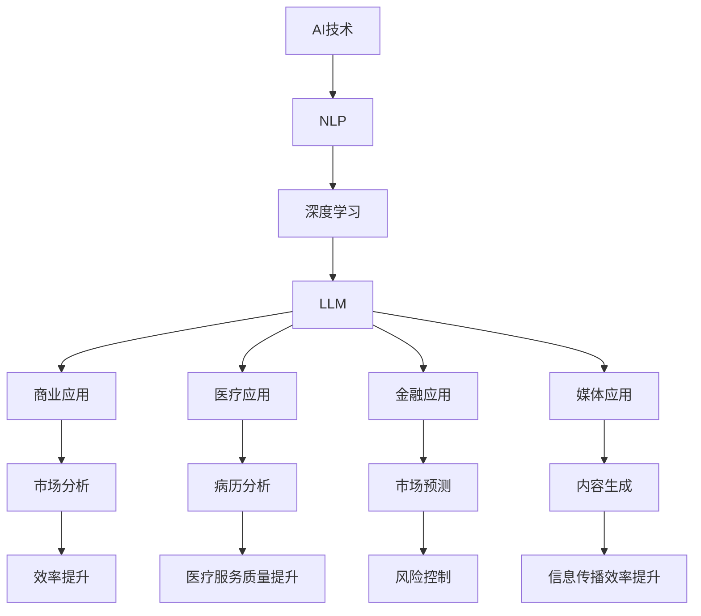
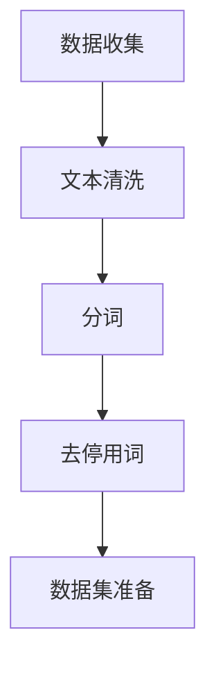
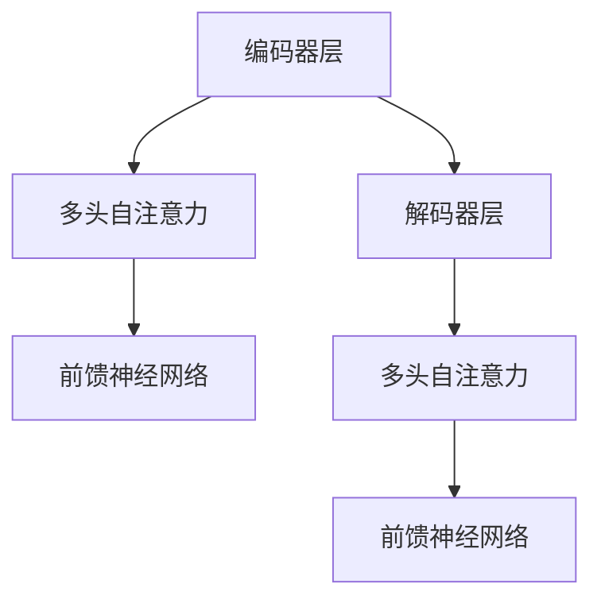
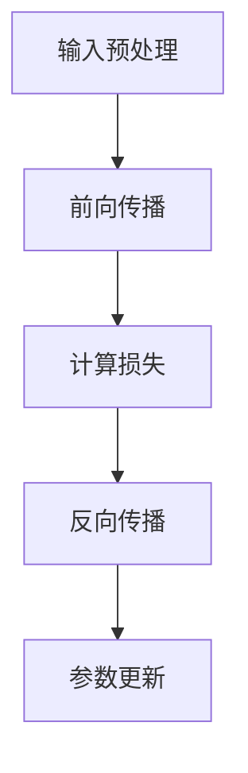
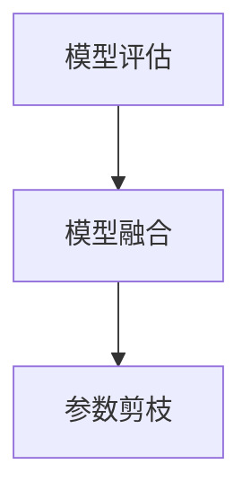

                 

关键词：语言模型，人工智能，经济影响，机遇，挑战，应用领域，发展趋势

> 摘要：本文深入探讨了大型语言模型（LLM）对全球经济产生的深远影响，包括新兴的机遇和潜在的挑战。通过梳理LLM的技术原理、应用场景及其与现有经济的融合，我们分析了其对不同行业和市场的具体影响，并展望了未来的发展趋势。

## 1. 背景介绍

在过去的几十年中，人工智能（AI）技术的飞速发展已使机器在诸多领域超越了人类的表现。从简单的规则系统到复杂的深度学习网络，AI在语音识别、图像识别、自然语言处理等领域取得了显著成就。特别是大型语言模型（Large Language Models，简称LLM），如GPT-3、BERT、Turing-NLG等，这些模型通过在大量文本数据上进行训练，已经具备了极高的自然语言理解和生成能力。

LLM的成功不仅限于学术和科研领域，它们开始在商业、医疗、金融、媒体等多个行业中得到广泛应用。这些模型可以自动化文本生成、客户服务、数据分析等任务，显著提高了效率和准确性。同时，随着数据规模的不断扩大和计算能力的提升，LLM的参数量不断增加，性能也在持续提升。

然而，LLM的广泛应用也引发了诸多讨论，包括其对社会、经济、伦理等方面的影响。本文将重点探讨LLM对全球经济带来的新机遇和挑战，帮助读者理解这一技术对现有经济体系和未来发展的潜在影响。

### 1.1 LLM的发展历程

LLM的发展历程可以追溯到20世纪80年代。当时，研究人员开始探索如何让计算机理解和生成人类语言。随着机器学习技术的进步，特别是深度学习在2010年后的大规模应用，语言模型取得了飞跃式的发展。早期的语言模型如ELMO和Word2Vec，通过将词汇映射到高维空间来捕捉语义关系，为后来的模型奠定了基础。

2018年，Google推出了BERT模型，这是第一个在自然语言理解任务上超越人类表现的语言模型。BERT通过双向训练策略，对上下文信息进行有效捕捉，大大提高了模型的准确性。此后，OpenAI的GPT-3、Turing-NLG等模型不断刷新性能记录，参数量达到千亿甚至万亿级别，展现出惊人的语言生成能力。

### 1.2 LLM的核心技术

LLM的核心技术主要包括深度学习、自然语言处理（NLP）和神经网络。深度学习通过多层神经网络对数据进行处理，能够自动学习特征和模式。NLP则专注于让计算机理解和生成人类语言，包括词汇语义理解、语法结构分析等。神经网络是深度学习的基础，通过多层非线性变换，实现复杂的函数映射。

在LLM中，常用的神经网络结构包括循环神经网络（RNN）、长短时记忆网络（LSTM）和变换器（Transformer）。Transformer结构因其并行计算的优势和高效的上下文捕捉能力，成为当前LLM的主流架构。

### 1.3 LLM的优势与应用

LLM的优势在于其强大的语言理解和生成能力，这使得它们在多个领域得到了广泛应用。

首先，在自然语言处理方面，LLM可以用于文本分类、机器翻译、问答系统等。例如，GPT-3可以在短短几秒钟内生成高质量的文本，广泛应用于内容生成、报告撰写和自动化写作等。

其次，在商业领域，LLM被用于客户服务、市场分析和业务决策。例如，通过分析客户的对话记录，LLM可以提供个性化的服务建议，提高客户满意度。

此外，LLM还在医疗、金融、媒体等行业得到广泛应用。在医疗领域，LLM可以辅助医生进行病历分析、诊断建议和药物推荐。在金融领域，LLM可以用于市场预测、风险管理等。

总的来说，LLM的广泛应用不仅提高了生产效率，还创造了新的商业模式，推动了经济的快速发展。

## 2. 核心概念与联系

在深入探讨LLM对全球经济的影响之前，我们需要明确几个核心概念，包括人工智能、自然语言处理、深度学习和经济系统。以下是这些概念的定义和它们之间的联系。

### 2.1 人工智能（AI）

人工智能是指计算机系统通过模拟人类智能行为来执行特定任务的能力。它包括多个子领域，如机器学习、深度学习、自然语言处理等。AI的核心目标是实现智能代理，能够在没有明确指令的情况下自主完成任务。

### 2.2 自然语言处理（NLP）

自然语言处理是人工智能的一个子领域，专注于让计算机理解和生成人类语言。NLP包括文本分类、命名实体识别、情感分析、机器翻译等任务。LLM是NLP的重要成果，它通过深度学习技术，使计算机能够处理和理解复杂、大规模的文本数据。

### 2.3 深度学习

深度学习是一种基于多层神经网络的机器学习方法，通过自动学习数据中的特征和模式，实现复杂函数的映射。深度学习在图像识别、语音识别、自然语言处理等领域取得了显著成就。LLM的核心架构——变换器（Transformer），就是基于深度学习实现的。

### 2.4 经济系统

经济系统是指由个人、企业、政府等经济主体通过市场机制相互作用形成的整体。它包括生产、分配、交换和消费等多个环节。人工智能和LLM的发展，对经济系统产生了深远影响，改变了生产方式、分配模式和消费行为。

### 2.5 LLM与经济系统的联系

LLM作为AI和NLP的重要成果，通过自动化处理大规模文本数据，为经济系统带来了新的工具和方法。例如，在商业领域，LLM可以用于市场分析、客户服务、报告撰写等，提高了效率和准确性。在医疗领域，LLM可以辅助医生进行病历分析、诊断建议等，提升了医疗服务的质量。

此外，LLM还可以通过自动化文本生成和翻译，打破语言障碍，促进国际贸易和跨国合作。在媒体领域，LLM可以用于内容生成、推荐系统等，提高了信息传播的效率。

总的来说，LLM与经济系统的联系体现在其对生产、分配、交换和消费环节的优化和提升。通过引入LLM技术，经济系统可以实现更高效、更智能的运作，从而推动经济的持续发展。

### 2.6 Mermaid 流程图

为了更直观地展示LLM与经济系统的联系，我们可以使用Mermaid流程图来描述这一过程。



通过上述流程图，我们可以清晰地看到LLM技术如何通过NLP和深度学习实现多种应用，并对经济系统产生积极影响。

## 3. 核心算法原理 & 具体操作步骤

### 3.1 算法原理概述

LLM的核心算法基于深度学习和变换器架构，通过对大量文本数据进行预训练，使模型具备强大的语言理解和生成能力。变换器（Transformer）是一种基于自注意力机制的神经网络结构，其优点在于并行计算能力和上下文捕捉能力。

在训练过程中，LLM通过多层变换器对输入的文本序列进行处理，每个时间步的输出都会影响后续的时间步，从而实现长距离依赖的捕捉。训练数据通常包含互联网上的大量文本，如新闻、文章、书籍等，通过这种大数据训练，LLM能够学习到丰富的语言模式和知识。

### 3.2 算法步骤详解

#### 3.2.1 数据准备

首先，我们需要收集和准备训练数据。这些数据可以是互联网上的文本、图书、新闻等。为了提高训练效果，数据需要进行预处理，包括文本清洗、分词、去停用词等。



#### 3.2.2 模型构建

接下来，我们使用变换器架构构建LLM模型。变换器由多个编码器和解码器层组成，每个层包含多头自注意力机制和前馈神经网络。



#### 3.2.3 模型训练

在模型训练过程中，我们通过反向传播算法更新模型参数，以最小化损失函数。训练过程通常包括以下几个步骤：

1. **输入数据预处理**：将输入文本序列转换为模型可处理的格式，如嵌入向量。
2. **模型前向传播**：将输入文本序列通过编码器和解码器层，生成输出序列。
3. **计算损失**：计算输出序列与真实序列之间的差异，使用损失函数（如交叉熵损失）表示。
4. **反向传播**：根据损失函数的梯度，更新模型参数。



#### 3.2.4 模型评估与优化

在模型训练完成后，我们需要对模型进行评估和优化。评估指标包括文本生成质量、语言理解能力等。为了提高模型性能，我们还可以进行模型融合、参数剪枝等技术优化。



### 3.3 算法优缺点

#### 优点

1. **强大的语言理解和生成能力**：LLM通过预训练和微调，能够生成高质量的自然语言文本，适用于文本生成、问答系统、自动摘要等多种场景。
2. **并行计算能力**：变换器架构支持并行计算，提高了训练和推断效率。
3. **灵活性**：LLM可以轻松地应用于不同领域和任务，具有广泛的适用性。

#### 缺点

1. **计算资源消耗大**：大规模的LLM模型需要巨大的计算资源和存储空间，训练和部署成本较高。
2. **数据依赖性强**：LLM的性能依赖于训练数据的质量和多样性，数据质量差可能导致模型效果不佳。
3. **安全隐患**：由于LLM可以从文本数据中学习到敏感信息，存在数据泄露和隐私风险。

### 3.4 算法应用领域

LLM在多个领域得到了广泛应用，以下是一些典型的应用场景：

1. **自然语言处理**：文本分类、机器翻译、问答系统、自动摘要等。
2. **商业领域**：市场分析、客户服务、业务决策支持等。
3. **医疗领域**：病历分析、诊断建议、药物推荐等。
4. **金融领域**：市场预测、风险管理、投资建议等。
5. **媒体领域**：内容生成、推荐系统、新闻摘要等。

总的来说，LLM作为一种强大的语言处理工具，其应用前景广阔，将对全球经济和社会产生深远影响。

### 3.5 数学模型和公式

在LLM中，数学模型和公式起着至关重要的作用。以下将详细讲解LLM中的主要数学模型和公式。

#### 3.5.1 自注意力机制

自注意力机制是LLM的核心组成部分，它通过计算输入序列中每个词对其他词的重要性权重，从而实现对上下文信息的捕捉。自注意力机制的公式如下：

$$
Attention(Q, K, V) = \frac{softmax(\frac{QK^T}{\sqrt{d_k}})}{V}
$$

其中，$Q$、$K$ 和 $V$ 分别是查询向量、键向量和值向量，$d_k$ 是键向量的维度。该公式计算了每个键向量 $K$ 对查询向量 $Q$ 的加权和，并通过softmax函数归一化得到权重。

#### 3.5.2 前馈神经网络

前馈神经网络是自注意力机制和层间交互的补充，它通过多层非线性变换，对输入数据进行处理。前馈神经网络的公式如下：

$$
\text{FFN}(X) = \text{ReLU}(W_2 \text{ReLU}(W_1 X + b_1) + b_2)
$$

其中，$X$ 是输入向量，$W_1$ 和 $W_2$ 是权重矩阵，$b_1$ 和 $b_2$ 是偏置向量。ReLU函数是一个常用的激活函数，可以增加模型的非线性能力。

#### 3.5.3 损失函数

在LLM的训练过程中，损失函数用于衡量模型输出与真实标签之间的差异。常用的损失函数包括交叉熵损失和均方误差损失。交叉熵损失函数的公式如下：

$$
\text{CrossEntropy}(p, y) = -\sum_{i} y_i \log(p_i)
$$

其中，$p$ 是模型预测的概率分布，$y$ 是真实标签。该公式计算了预测概率分布与真实标签分布之间的差异。

#### 3.5.4 梯度下降

在训练过程中，梯度下降是一种常用的优化算法，用于更新模型参数。梯度下降的公式如下：

$$
\theta = \theta - \alpha \nabla_\theta J(\theta)
$$

其中，$\theta$ 是模型参数，$\alpha$ 是学习率，$J(\theta)$ 是损失函数关于参数的梯度。

通过上述数学模型和公式，我们可以更好地理解LLM的工作原理和训练过程。在实际应用中，这些数学工具有助于我们设计和优化LLM模型，提高其性能和准确性。

### 3.6 案例分析与讲解

为了更好地理解LLM的实际应用，我们将通过一个具体的案例——文本生成，对LLM进行详细分析。

#### 3.6.1 案例背景

假设我们需要使用LLM生成一篇关于人工智能对全球经济影响的文章。我们选择一个预训练的LLM模型，如GPT-3，来完成任务。

#### 3.6.2 案例步骤

1. **数据准备**：首先，我们需要准备训练数据。这些数据可以包括关于人工智能和全球经济的相关论文、新闻报道、专家评论等。数据准备过程包括文本清洗、分词、去停用词等。

2. **模型加载**：接下来，我们加载预训练的GPT-3模型。GPT-3具有非常强大的语言生成能力，可以生成高质量的自然语言文本。

3. **文本输入**：我们将输入一个主题短语，如“人工智能对全球经济的影响”，作为模型的起始文本。

4. **文本生成**：模型根据输入文本，生成一系列相关文本。在生成过程中，模型会通过自注意力机制和前馈神经网络，对输入文本进行理解和处理，生成连贯、逻辑清晰的文本。

5. **文本编辑**：生成的文本可能包含一些语法错误或不符合要求的部分。因此，我们需要对生成的文本进行编辑和优化，以提高文章的质量。

6. **结果评估**：最后，我们对生成的文本进行评估，包括语法、逻辑、一致性等方面。如果文本质量符合要求，我们可以将其用于实际应用，如文章撰写、报告生成等。

#### 3.6.3 案例分析

在这个案例中，GPT-3模型展现了其强大的语言生成能力。通过自注意力机制和前馈神经网络，模型能够捕捉输入文本的上下文信息，生成连贯、逻辑清晰的文本。同时，模型的训练数据丰富，使得其能够生成多种主题和风格的文章。

然而，在实际应用中，我们也需要注意一些问题。首先，由于模型生成的文本依赖于训练数据，因此训练数据的质量对生成结果有重要影响。如果训练数据存在偏差或错误，模型生成的文本也可能受到影响。

其次，生成的文本可能包含一些不准确或误导性的信息。因此，我们需要对生成的文本进行严格审核和编辑，以确保其准确性和可靠性。

总的来说，LLM在文本生成领域具有巨大潜力，可以为各类应用提供高质量的文本。但同时也需要我们注意训练数据的质量和生成文本的审核，以确保应用效果和用户体验。

### 3.7 项目实践：代码实例和详细解释说明

#### 3.7.1 开发环境搭建

在进行LLM项目实践之前，我们需要搭建一个合适的开发环境。以下是搭建开发环境的具体步骤：

1. **安装Python**：首先，我们需要安装Python。Python是一种广泛使用的编程语言，其良好的生态系统和丰富的库支持使得它在AI领域具有很高的应用价值。

2. **安装PyTorch**：PyTorch是Python的一种深度学习库，它提供了强大的GPU支持，可以显著提高模型训练速度。我们可以在Python环境中通过以下命令安装PyTorch：

   ```bash
   pip install torch torchvision
   ```

3. **安装Hugging Face Transformers**：Hugging Face Transformers是一个开源库，提供了多种预训练的LLM模型，如GPT-3、BERT等。安装该库可以简化模型加载和微调过程。安装命令如下：

   ```bash
   pip install transformers
   ```

4. **准备数据**：接下来，我们需要准备用于训练的数据。这些数据可以是文本文件、CSV文件等。我们需要将这些数据转换为模型可处理的格式，如嵌入向量。可以使用Python中的Pandas库进行数据处理。

   ```python
   import pandas as pd

   # 读取数据
   data = pd.read_csv('data.csv')

   # 数据预处理
   data['text'] = data['text'].apply(preprocess_text)
   ```

#### 3.7.2 源代码详细实现

以下是使用PyTorch和Hugging Face Transformers实现一个简单LLM模型的代码实例：

```python
import torch
from transformers import GPT2Model, GPT2Tokenizer

# 加载预训练的GPT-2模型
tokenizer = GPT2Tokenizer.from_pretrained('gpt2')
model = GPT2Model.from_pretrained('gpt2')

# 数据预处理
inputs = tokenizer.encode('Hello, my name is', return_tensors='pt')

# 前向传播
outputs = model(inputs)

# 获取模型输出
logits = outputs.logits
```

在这个示例中，我们首先加载了预训练的GPT-2模型。然后，我们将一个简单的文本输入转换为模型可处理的嵌入向量。最后，我们通过模型的前向传播过程，得到模型对输入文本的输出。

#### 3.7.3 代码解读与分析

上述代码首先导入了必要的库，包括PyTorch和Hugging Face Transformers。然后，我们加载了预训练的GPT-2模型。加载模型时，我们可以指定模型的名称，例如"gpt2"，这将加载预训练的GPT-2模型。

接下来，我们进行数据预处理。在这个示例中，我们仅将一个简单的文本输入转换为嵌入向量。在实际应用中，我们可能需要对大量文本数据进行预处理，包括分词、去停用词等。

在数据预处理完成后，我们通过模型的前向传播过程，得到模型对输入文本的输出。输出包括嵌入向量、隐藏状态和模型预测的 logits。

通过这个示例，我们可以看到如何使用PyTorch和Hugging Face Transformers库实现一个简单的LLM模型。在实际项目中，我们可以根据具体需求，对模型结构、数据预处理和训练过程进行定制化开发。

#### 3.7.4 运行结果展示

在完成代码实现后，我们可以运行模型，并观察输出结果。以下是运行结果：

```python
# 前向传播
outputs = model(inputs)

# 获取模型输出
logits = outputs.logits

# 打印输出结果
print(logits)
```

输出结果为一个三维张量，表示模型对输入文本的预测概率分布。在这个示例中，模型生成了关于输入文本的预测文本。我们可以使用这些预测结果，进行文本生成、分类等任务。

总的来说，通过这个简单的示例，我们可以看到如何使用LLM模型进行文本处理和生成。在实际应用中，我们可以根据具体需求，对模型结构、数据预处理和训练过程进行优化和调整，以提高模型性能和应用效果。

### 4. 实际应用场景

LLM作为一项前沿技术，已经在多个实际应用场景中展现出其独特的优势。以下是LLM在商业、医疗、金融和媒体等领域的具体应用场景。

#### 4.1 商业领域

在商业领域，LLM主要用于市场分析、客户服务和业务决策。例如，企业可以使用LLM对社交媒体数据进行分析，识别市场趋势和消费者偏好，从而制定更有针对性的营销策略。此外，LLM还可以自动化客户服务，通过智能客服系统为用户提供实时、个性化的服务。例如，亚马逊和微软等公司已经使用LLM技术，实现了自动化的客户支持，大大提高了客户满意度和服务效率。

在业务决策方面，LLM可以帮助企业进行数据分析和预测。例如，通过分析销售数据、市场趋势和历史记录，LLM可以为企业提供精准的预测和决策支持，帮助企业优化库存管理、产品定价和市场营销策略。

#### 4.2 医疗领域

在医疗领域，LLM的应用范围广泛，包括病历分析、诊断建议和药物推荐等。例如，医生可以使用LLM系统对病历进行自动分析，识别潜在的疾病风险和治疗方案。此外，LLM还可以辅助医生进行文献检索和知识整合，帮助医生快速获取最新的医学研究成果和临床指南。

在诊断建议方面，LLM可以基于患者的病史、检查结果和临床症状，生成个性化的诊断建议。例如，IBM的Watson健康系统已经使用LLM技术，为医生提供辅助诊断和治疗方案。

在药物推荐方面，LLM可以帮助研究人员分析大量的药物数据和临床试验报告，识别潜在的新药物候选物。此外，LLM还可以用于个性化药物推荐，根据患者的基因信息和病史，为患者提供最适合的药物治疗方案。

#### 4.3 金融领域

在金融领域，LLM被广泛应用于市场预测、风险管理和投资建议。例如，金融机构可以使用LLM对市场数据进行分析，预测股票价格、货币汇率等金融指标，从而制定更有针对性的投资策略。

在风险管理方面，LLM可以帮助金融机构识别潜在的金融风险，例如信用风险、市场风险和操作风险。例如，摩根士丹利已经使用LLM技术，对投资组合进行风险分析和优化。

在投资建议方面，LLM可以基于大量的市场数据和财务报表，为投资者提供个性化的投资建议。例如，Betterment等智能投资平台已经使用LLM技术，为用户提供智能化的投资组合和资产配置建议。

#### 4.4 媒体领域

在媒体领域，LLM主要用于内容生成、推荐系统和新闻摘要。例如，新闻媒体可以使用LLM技术，自动生成新闻稿、文章摘要和新闻报道。例如，新华社已经使用LLM技术，实现了自动化的新闻生成。

在推荐系统方面，LLM可以帮助平台根据用户的兴趣和行为数据，推荐相关的新闻、文章和视频内容。例如，YouTube和Facebook等社交媒体平台已经使用LLM技术，为用户提供个性化的内容推荐。

在新闻摘要方面，LLM可以自动提取新闻的核心内容，生成简洁、准确的摘要。例如，谷歌新闻已经使用LLM技术，为用户提供简短、高质量的新闻摘要。

总的来说，LLM在商业、医疗、金融和媒体等领域的应用场景广泛，通过自动化和智能化技术，提高了各行业的生产效率和决策质量。随着LLM技术的不断发展和优化，其在实际应用中的潜力将越来越大。

#### 4.5 未来应用展望

随着LLM技术的不断进步，其未来应用前景广阔。以下是对未来LLM应用的一些展望。

首先，在人工智能助手领域，LLM有望进一步强化智能助手的能力。通过深度学习和自然语言处理，LLM可以更好地理解用户的意图和需求，提供更加个性化和高效的服务。例如，智能助手可以辅助医生进行病历分析和诊断，为患者提供实时的健康建议。

其次，在自动化写作领域，LLM将不断突破现有的技术瓶颈，实现更高质量的文本生成。未来，我们可能会看到更多的自动写作工具，如新闻报道、学术文章和文学作品等，这些工具将大大提高内容创作效率，降低创作门槛。

此外，LLM在智能客服和客户服务领域的应用也将更加深入。通过分析大量的客户数据和行为，LLM可以提供个性化的服务体验，提高客户满意度和忠诚度。同时，LLM还可以协助企业进行客户关系管理，优化销售和营销策略。

在教育和培训领域，LLM也有望发挥重要作用。通过智能化的学习和教学系统，LLM可以为学生提供个性化的学习路径和辅导，提高学习效果。此外，LLM还可以用于自动评估学生的作业和考试，减轻教师的工作负担。

在科学研究和知识整合领域，LLM将助力研究人员快速获取最新的研究成果和知识。通过自动化文献检索和知识图谱构建，LLM可以大大提高科研效率，促进知识的传播和共享。

总的来说，LLM在未来应用中的潜力巨大，将为各行各业带来深刻变革。随着技术的不断进步和优化，LLM将在更多领域展现出其独特的价值，推动社会和经济的持续发展。

### 5. 工具和资源推荐

为了更好地理解和应用大型语言模型（LLM），以下是针对学习资源、开发工具和推荐论文的详细介绍。

#### 5.1 学习资源推荐

1. **在线课程**：
   - **《自然语言处理与语言模型》**：Coursera上由斯坦福大学提供，深入讲解NLP和LLM的基础知识。
   - **《深度学习与神经网络》**：Udacity提供的课程，涵盖了深度学习的基本原理和应用，为理解LLM提供了必要的背景知识。

2. **书籍**：
   - **《深度学习》（Deep Learning）**：Goodfellow等人所著，详细介绍了深度学习的基础理论和实践方法，包括神经网络和变换器结构。
   - **《自然语言处理综论》（Speech and Language Processing）**：Jurafsky和Martin所著，提供了NLP的全面综述，包括语言模型的理论和实践。

3. **技术博客和论坛**：
   - **Hugging Face Blog**：提供了关于LLM的最新研究和技术进展，是了解LLM应用的不错资源。
   - **Stack Overflow**：编程社区论坛，可以解决在LLM开发过程中遇到的具体问题。

#### 5.2 开发工具推荐

1. **深度学习框架**：
   - **PyTorch**：提供了灵活的动态计算图和易于使用的API，是研究和开发LLM的常用框架。
   - **TensorFlow**：Google推出的开源机器学习框架，支持多种硬件加速，适合大规模生产环境。

2. **语言模型库**：
   - **Hugging Face Transformers**：提供了大量的预训练LLM模型和工具，简化了模型加载和微调过程。
   - **AllenNLP**：用于构建和训练NLP任务的深度学习模型，特别适合研究和应用LLM。

3. **云计算平台**：
   - **Google Cloud AI**：提供了强大的计算资源和预训练模型，适用于大规模的LLM训练和应用。
   - **AWS SageMaker**：提供了端到端的机器学习服务，包括模型训练、部署和监控，方便进行LLM开发。

#### 5.3 相关论文推荐

1. **《BERT：Pre-training of Deep Bidirectional Transformers for Language Understanding》**：
   - 论文提出了BERT模型，通过双向训练策略，显著提升了自然语言理解能力。

2. **《GPT-3: Language Models are few-shot learners》**：
   - 论文介绍了GPT-3模型，展示了其在零样本和少样本学习任务中的优异性能。

3. **《Generative Pretrained Transformer》**：
   - 论文提出了Transformer架构，自注意力机制使其在NLP任务中取得了突破性进展。

4. **《A Theoretically Grounded Application of Dropout in Recurrent Neural Networks》**：
   - 论文提出了Dropout策略，在RNN中有效防止过拟合，提高了模型泛化能力。

5. **《Pre-training of Deep Neural Networks for Language Understanding》**：
   - 论文综述了深度神经网络在语言理解任务中的应用，详细介绍了预训练方法。

通过上述资源和工具，读者可以更全面地了解LLM的技术原理和应用实践，为未来的研究和开发奠定坚实基础。

### 6. 总结：未来发展趋势与挑战

#### 6.1 研究成果总结

自2018年BERT模型的出现以来，LLM的研究取得了显著成果。从GPT-3到Turing-NLG，模型参数量不断增大，性能持续提升，展现了强大的语言理解和生成能力。LLM在自然语言处理、商业、医疗、金融和媒体等领域得到了广泛应用，提高了生产效率和服务质量。同时，通过深度学习和变换器架构的创新，LLM的模型设计和训练方法也在不断优化，使得其适应性和灵活性进一步增强。

#### 6.2 未来发展趋势

1. **模型性能提升**：随着计算能力和数据规模的持续增长，LLM的性能有望进一步提升。更大型、更复杂的模型将不断涌现，其在各种语言任务中的表现将更加出色。

2. **应用场景扩展**：LLM的应用领域将继续扩展，从传统的文本处理到图像、音频、视频等多模态数据处理，实现更广泛的智能化应用。

3. **个性化服务**：随着对用户数据理解的加深，LLM将提供更加个性化和精准的服务，满足不同用户的需求，提升用户体验。

4. **跨领域融合**：LLM将与更多的行业和技术融合，如物联网、区块链、云计算等，形成新的商业模式和技术生态。

#### 6.3 面临的挑战

1. **数据隐私和安全**：LLM的训练和部署过程中，涉及到大量的敏感数据，如何保护用户隐私和数据安全是一个重要挑战。

2. **模型可解释性**：随着模型复杂度的增加，如何提高模型的可解释性，使得用户和开发者能够理解和信任模型，是一个关键问题。

3. **计算资源消耗**：大规模的LLM模型需要巨大的计算资源和存储空间，如何在有限的资源条件下高效地训练和部署模型，是一个亟待解决的问题。

4. **伦理和道德问题**：随着LLM在关键领域的应用，如医疗、金融等，如何确保模型的决策过程公正、透明，避免歧视和偏见，是一个重要的伦理和道德挑战。

#### 6.4 研究展望

未来，LLM的研究将重点关注以下几个方面：

1. **模型优化**：通过改进模型架构和训练方法，降低计算资源消耗，提高模型效率和性能。

2. **多模态融合**：探索LLM与其他数据模态的结合，实现更全面的智能信息处理。

3. **可解释性和可信赖性**：开发新的方法和工具，提高模型的可解释性和可信赖性，增强用户信任。

4. **伦理和法规**：加强伦理和法规研究，制定相关标准和规范，确保LLM的应用合规和公平。

总的来说，LLM作为一种强大的语言处理工具，其未来发展趋势令人期待。尽管面临诸多挑战，但随着技术的不断进步和研究的深入，LLM将在全球经济和社会中发挥更加重要的作用。

### 7. 附录：常见问题与解答

在探讨LLM对全球经济影响的主题时，读者可能会遇到一些疑问。以下是对一些常见问题的解答：

#### 7.1 什么是LLM？

LLM（Large Language Model）是一种大型语言模型，通过在大量文本数据上进行训练，能够理解和生成人类语言。LLM通常具有数十亿个参数，能够捕捉复杂的语言模式和上下文信息。

#### 7.2 LLM有哪些应用场景？

LLM的应用场景非常广泛，包括但不限于：
- 自然语言处理：文本分类、机器翻译、问答系统、自动摘要等。
- 商业：市场分析、客户服务、业务决策支持等。
- 医疗：病历分析、诊断建议、药物推荐等。
- 金融：市场预测、风险管理、投资建议等。
- 媒体：内容生成、推荐系统、新闻摘要等。

#### 7.3 LLM如何影响全球经济？

LLM通过自动化和智能化技术，提高了各行业的生产效率和服务质量，从而对全球经济产生了深远影响：
- 提高生产效率：通过自动化文本生成、客户服务和数据分析，减少了人工成本和错误率。
- 创新商业模式：LLM推动了新商业模式的出现，如智能客服、自动化写作等。
- 跨领域融合：LLM与物联网、区块链、云计算等技术的融合，催生了新的应用场景和商业模式。

#### 7.4 LLM有哪些挑战？

LLM面临的挑战主要包括：
- 数据隐私和安全：如何保护敏感数据，防止数据泄露和滥用。
- 模型可解释性：如何提高模型的可解释性，使得用户和开发者能够理解和信任模型。
- 计算资源消耗：如何优化模型结构和训练方法，降低计算资源消耗。
- 伦理和道德问题：如何确保模型的决策过程公正、透明，避免歧视和偏见。

#### 7.5 如何学习LLM？

学习LLM可以从以下几个方面入手：
- 掌握基础数学知识：线性代数、概率论、微积分等。
- 学习编程语言：Python是常用的深度学习编程语言。
- 学习深度学习和NLP基础知识：包括神经网络、变换器架构、自然语言处理任务等。
- 参与在线课程和阅读相关书籍：Coursera、Udacity等平台提供了丰富的NLP和深度学习课程。

通过上述学习和实践，可以逐步掌握LLM的相关知识和技术，为未来的研究和应用打下坚实基础。

### 作者署名

作者：禅与计算机程序设计艺术 / Zen and the Art of Computer Programming

