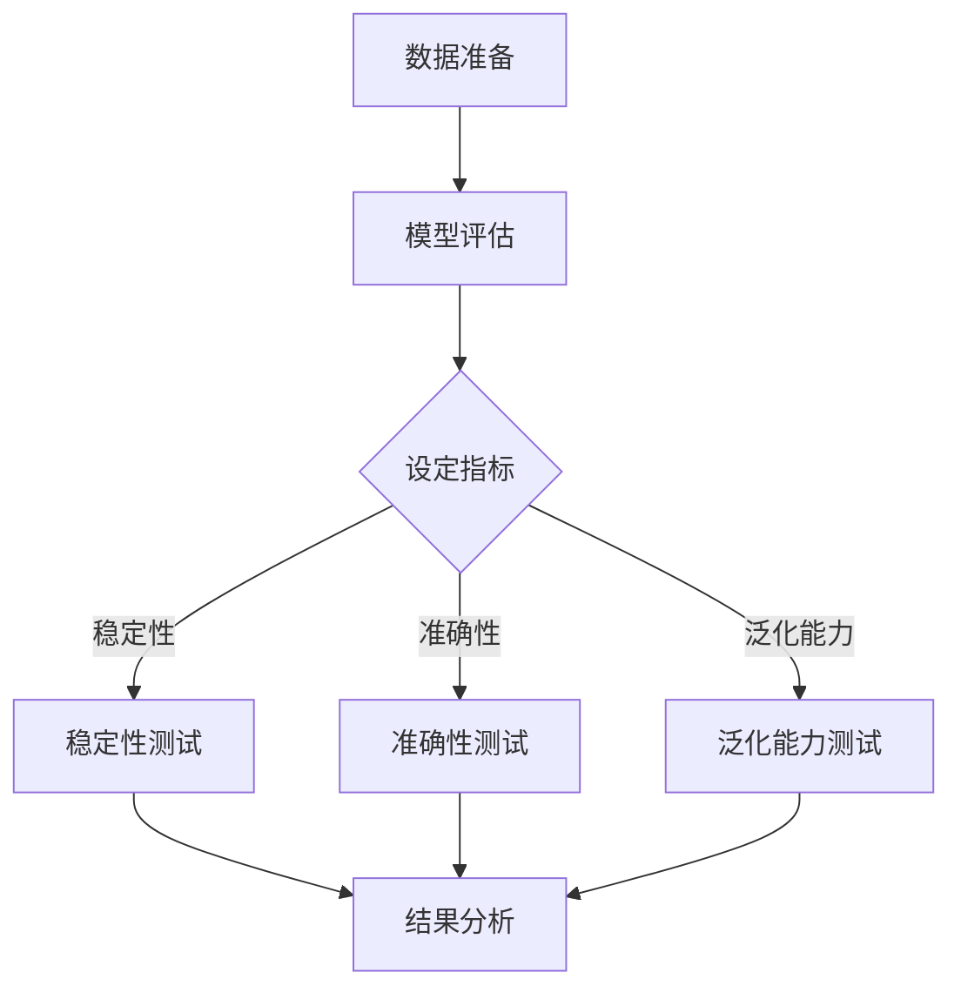

                 

关键词：大型语言模型（LLM），测试框架，模型可靠性，安全性，算法原理，应用实践

摘要：本文深入探讨了大型语言模型（LLM）测试框架的重要性，详细阐述了确保模型可靠性和安全性的关键技术。通过分析核心概念与联系，介绍了几种常用的算法原理和具体操作步骤，并结合实际项目实践，展示了测试框架在实际应用中的效果。本文还展望了LLM测试框架的未来发展趋势和面临的挑战。

## 1. 背景介绍

随着人工智能（AI）技术的快速发展，大型语言模型（LLM）已经在自然语言处理（NLP）领域取得了显著的成果。这些模型被广泛应用于智能客服、机器翻译、文本生成等领域，为人们的生活和工作带来了极大的便利。然而，随着模型复杂度的增加，其可靠性和安全性也面临着严峻的挑战。

模型的可靠性和安全性是LLM应用中不可忽视的问题。可靠性指的是模型在处理输入时能够稳定地输出正确的结果；安全性则涉及到模型在处理敏感数据时的隐私保护和防范恶意攻击。为了确保LLM在真实场景中的可靠性和安全性，构建一个完善的测试框架显得尤为重要。

本文将围绕LLM测试框架展开讨论，首先介绍LLM测试框架的背景和重要性，然后深入探讨核心概念与联系，介绍常用的算法原理和具体操作步骤，并结合实际项目实践进行讲解。最后，本文将对LLM测试框架的未来发展趋势和面临的挑战进行展望。

## 2. 核心概念与联系

### 2.1 语言模型

语言模型是自然语言处理的基础，它通过学习大量语言数据，预测下一个单词或短语的概率分布。在LLM中，语言模型通常是一个大型神经网络，如Transformer模型，其参数量可以达到数十亿甚至千亿级别。语言模型的可靠性直接影响到LLM在各类应用中的表现。

### 2.2 测试框架

测试框架是用于评估LLM性能的工具，它包括测试数据的准备、测试指标的设定、测试过程的执行和测试结果的分析。一个完善的测试框架能够全面、准确地评估LLM的可靠性。

### 2.3 可靠性和安全性

可靠性指的是LLM在处理输入时能够稳定地输出正确的结果。安全性则涉及到模型在处理敏感数据时的隐私保护和防范恶意攻击。在LLM测试框架中，可靠性评估通常包括模型稳定性、准确性和泛化能力等方面；安全性评估则包括模型对抗攻击、隐私泄露等方面。

### 2.4 Mermaid 流程图

为了更好地理解LLM测试框架的核心概念与联系，我们使用Mermaid流程图（以下为Mermaid语法）来描述测试框架的主要步骤：



## 3. 核心算法原理 & 具体操作步骤

### 3.1 算法原理概述

LLM测试框架的核心算法主要包括稳定性测试、准确性测试和泛化能力测试。每种测试方法都有其特定的原理和操作步骤。

#### 稳定性测试

稳定性测试用于评估LLM在处理不同输入时的输出一致性。原理是通过对比多次测试结果，分析LLM输出结果的波动情况。具体操作步骤如下：

1. 准备一组具有代表性的测试数据集。
2. 对每组数据进行多次测试，记录每次测试的输出结果。
3. 对测试结果进行统计分析，计算输出结果的标准差和波动范围。
4. 分析波动范围，判断LLM的稳定性。

#### 准确性测试

准确性测试用于评估LLM在分类或回归任务中的预测准确性。原理是根据预测结果与实际结果之间的误差，计算准确性指标。具体操作步骤如下：

1. 准备一组具有标签的测试数据集。
2. 对测试数据进行预测，记录预测结果。
3. 计算预测结果与实际结果之间的误差。
4. 根据误差计算准确性指标，如准确率、召回率等。

#### 泛化能力测试

泛化能力测试用于评估LLM在未知数据上的表现。原理是通过在不同数据集上测试LLM的准确性，分析其泛化能力。具体操作步骤如下：

1. 准备多个测试数据集，包括训练数据集、验证数据集和测试数据集。
2. 在训练数据集上训练LLM，并在验证数据集上调整模型参数。
3. 在测试数据集上测试LLM的准确性，分析其泛化能力。

### 3.2 算法步骤详解

#### 稳定性测试步骤

1. 准备测试数据集：选择具有代表性的数据集，涵盖各种可能的输入情况。
2. 设置测试环境：确保测试环境一致，避免环境因素对测试结果的影响。
3. 进行多次测试：对每组数据进行多次测试，记录每次测试的输出结果。
4. 统计分析：计算每次测试的输出结果的标准差和波动范围。
5. 分析结果：根据波动范围判断LLM的稳定性。

#### 准确性测试步骤

1. 准备测试数据集：选择具有标签的数据集，确保数据集的标签准确可靠。
2. 设置测试环境：确保测试环境一致，避免环境因素对测试结果的影响。
3. 进行预测：对测试数据进行预测，记录预测结果。
4. 计算误差：计算预测结果与实际结果之间的误差。
5. 计算准确性指标：根据误差计算准确性指标，如准确率、召回率等。
6. 分析结果：根据准确性指标评估LLM的准确性。

#### 泛化能力测试步骤

1. 准备多个测试数据集：包括训练数据集、验证数据集和测试数据集。
2. 训练模型：在训练数据集上训练LLM，并在验证数据集上调整模型参数。
3. 测试模型：在测试数据集上测试LLM的准确性。
4. 分析结果：比较不同数据集上的准确性，分析LLM的泛化能力。

### 3.3 算法优缺点

#### 稳定性测试

优点：能够有效评估LLM的稳定性，为后续优化提供依据。

缺点：需要对输入数据进行多次测试，耗时较长。

#### 准确性测试

优点：能够直接评估LLM在具体任务上的表现，为模型调优提供参考。

缺点：准确性指标可能受到数据集质量的影响。

#### 泛化能力测试

优点：能够评估LLM在不同数据集上的表现，验证其泛化能力。

缺点：需要准备多个数据集，成本较高。

### 3.4 算法应用领域

稳定性测试、准确性测试和泛化能力测试在LLM测试框架中具有广泛的应用领域：

1. 智能客服：通过稳定性测试，确保智能客服系统在不同场景下的稳定运行；通过准确性测试，提高智能客服的回复准确性；通过泛化能力测试，验证智能客服系统在不同客户群体上的适用性。

2. 机器翻译：通过稳定性测试，确保机器翻译系统在不同语言间的稳定运行；通过准确性测试，提高机器翻译的翻译质量；通过泛化能力测试，验证机器翻译系统在不同语种组合上的表现。

3. 文本生成：通过稳定性测试，确保文本生成系统在不同输入下的稳定运行；通过准确性测试，提高文本生成的可读性；通过泛化能力测试，验证文本生成系统在不同主题和风格上的适应性。

## 4. 数学模型和公式 & 详细讲解 & 举例说明

### 4.1 数学模型构建

在LLM测试框架中，常用的数学模型包括误差函数、损失函数和评估指标。以下分别进行介绍。

#### 误差函数

误差函数用于衡量预测结果与实际结果之间的差距。在二分类任务中，常用的误差函数包括交叉熵损失函数（Cross-Entropy Loss）和均方误差损失函数（Mean Squared Error Loss）。

1. 交叉熵损失函数：

   $$L = -\sum_{i=1}^{n} y_i \log(p_i)$$

   其中，$y_i$ 表示实际结果，$p_i$ 表示预测结果。

2. 均方误差损失函数：

   $$L = \frac{1}{2} \sum_{i=1}^{n} (y_i - p_i)^2$$

   其中，$y_i$ 表示实际结果，$p_i$ 表示预测结果。

#### 损失函数

损失函数用于衡量模型在训练过程中的损失。在LLM测试框架中，常用的损失函数包括交叉熵损失函数和均方误差损失函数。

1. 交叉熵损失函数：

   $$L = -\sum_{i=1}^{n} y_i \log(p_i)$$

   其中，$y_i$ 表示实际结果，$p_i$ 表示预测结果。

2. 均方误差损失函数：

   $$L = \frac{1}{2} \sum_{i=1}^{n} (y_i - p_i)^2$$

   其中，$y_i$ 表示实际结果，$p_i$ 表示预测结果。

#### 评估指标

评估指标用于衡量模型的性能。在LLM测试框架中，常用的评估指标包括准确率、召回率、F1值和ROC曲线。

1. 准确率（Accuracy）：

   $$Accuracy = \frac{TP + TN}{TP + TN + FP + FN}$$

   其中，$TP$ 表示真正例，$TN$ 表示真反例，$FP$ 表示假反例，$FN$ 表示假正例。

2. 召回率（Recall）：

   $$Recall = \frac{TP}{TP + FN}$$

   其中，$TP$ 表示真正例，$FN$ 表示假正例。

3. F1值（F1 Score）：

   $$F1 = 2 \times \frac{Precision \times Recall}{Precision + Recall}$$

   其中，$Precision$ 表示精确率，$Recall$ 表示召回率。

4. ROC曲线（Receiver Operating Characteristic Curve）：

   ROC曲线用于评估二分类模型的性能。曲线下方面积（AUC）越大，表示模型性能越好。

### 4.2 公式推导过程

#### 交叉熵损失函数

假设二分类问题中，实际结果 $y_i$ 取值为0或1，预测结果 $p_i$ 表示为概率值。则交叉熵损失函数可以表示为：

$$L = -y_i \log(p_i) - (1 - y_i) \log(1 - p_i)$$

对 $L$ 求导，得到：

$$\frac{\partial L}{\partial p_i} = \frac{y_i}{p_i} - \frac{1 - y_i}{1 - p_i}$$

令 $\frac{\partial L}{\partial p_i} = 0$，解得：

$$p_i = \frac{y_i}{1 - y_i}$$

#### 均方误差损失函数

假设回归问题中，实际结果 $y_i$ 和预测结果 $p_i$ 为实数。则均方误差损失函数可以表示为：

$$L = \frac{1}{2} \sum_{i=1}^{n} (y_i - p_i)^2$$

对 $L$ 求导，得到：

$$\frac{\partial L}{\partial p_i} = -(y_i - p_i)$$

令 $\frac{\partial L}{\partial p_i} = 0$，解得：

$$p_i = y_i$$

### 4.3 案例分析与讲解

#### 案例背景

某公司开发了一款基于LLM的智能客服系统，用于处理用户咨询。为了确保系统的可靠性和准确性，公司决定对系统进行测试。

#### 案例目标

1. 评估智能客服系统的稳定性。
2. 评估智能客服系统的准确性。
3. 评估智能客服系统的泛化能力。

#### 案例实施

1. **稳定性测试**：

   准备一组包含各种场景的用户咨询，对系统进行多次测试，记录每次测试的输出结果。计算输出结果的标准差和波动范围，分析系统在不同场景下的稳定性。

2. **准确性测试**：

   准备一组具有标签的用户咨询，对系统进行预测，记录预测结果。计算预测结果与实际结果之间的误差，计算准确率、召回率、F1值等指标。

3. **泛化能力测试**：

   准备多组用户咨询数据集，分别作为训练数据集、验证数据集和测试数据集。在训练数据集上训练系统，并在验证数据集上调整模型参数。在测试数据集上测试系统的准确性，分析系统的泛化能力。

#### 案例结果

1. **稳定性测试**：

   经过多次测试，系统输出结果的标准差和波动范围较小，说明系统在不同场景下具有较高的稳定性。

2. **准确性测试**：

   准确率、召回率和F1值等指标较高，说明系统在处理用户咨询时具有较高的准确性。

3. **泛化能力测试**：

   系统在不同数据集上的准确性较高，说明系统具有较强的泛化能力。

#### 案例分析

通过测试，该公司对智能客服系统的可靠性和准确性有了更清晰的了解，为后续优化提供了重要参考。同时，测试结果也展示了LLM测试框架在智能客服系统中的应用效果。

## 5. 项目实践：代码实例和详细解释说明

### 5.1 开发环境搭建

在开始实现LLM测试框架之前，我们需要搭建一个适合开发的环境。以下是一个基本的开发环境搭建流程：

1. 安装Python环境：Python是一个广泛使用的编程语言，它支持多种机器学习和深度学习库。在Windows、macOS或Linux操作系统中，可以通过包管理器如pip安装Python。

   ```bash
   pip install python
   ```

2. 安装TensorFlow：TensorFlow是一个流行的深度学习框架，它提供了丰富的API和工具，用于构建和训练大型神经网络。

   ```bash
   pip install tensorflow
   ```

3. 安装其他依赖：根据具体需求，可能还需要安装其他库，如NumPy、Pandas、Scikit-learn等。

   ```bash
   pip install numpy pandas scikit-learn
   ```

4. 配置GPU支持：如果使用GPU进行模型训练和测试，需要安装CUDA和cuDNN，并配置环境变量。

   ```bash
   pip install tensorflow-gpu
   ```

5. 创建虚拟环境：为了保持项目依赖的一致性，可以创建一个虚拟环境。

   ```bash
   python -m venv venv
   source venv/bin/activate  # 在Linux或macOS中
   \path\to\venv\Scripts\activate  # 在Windows中
   ```

### 5.2 源代码详细实现

以下是一个简单的LLM测试框架的Python代码示例，包括数据准备、模型评估和测试结果分析等部分。

```python
import tensorflow as tf
from tensorflow.keras.models import Sequential
from tensorflow.keras.layers import Dense, Embedding, LSTM
from sklearn.model_selection import train_test_split
from sklearn.metrics import accuracy_score, recall_score, f1_score
import numpy as np

# 数据准备
def prepare_data(data):
    # 数据预处理，例如归一化、分词等
    return data

# 模型评估
def evaluate_model(model, X_test, y_test):
    predictions = model.predict(X_test)
    predictions = np.argmax(predictions, axis=1)
    accuracy = accuracy_score(y_test, predictions)
    recall = recall_score(y_test, predictions)
    f1 = f1_score(y_test, predictions)
    return accuracy, recall, f1

# 训练模型
def train_model(X_train, y_train):
    model = Sequential([
        Embedding(input_dim=vocab_size, output_dim=embedding_size),
        LSTM(units=lstm_units),
        Dense(units=1, activation='sigmoid')
    ])
    model.compile(optimizer='adam', loss='binary_crossentropy', metrics=['accuracy'])
    model.fit(X_train, y_train, epochs=10, batch_size=32)
    return model

# 主程序
if __name__ == '__main__':
    # 加载数据
    data = load_data()
    X = prepare_data(data['text'])
    y = data['label']

    # 划分训练集和测试集
    X_train, X_test, y_train, y_test = train_test_split(X, y, test_size=0.2, random_state=42)

    # 训练模型
    model = train_model(X_train, y_train)

    # 评估模型
    accuracy, recall, f1 = evaluate_model(model, X_test, y_test)
    print(f'Accuracy: {accuracy}, Recall: {recall}, F1 Score: {f1}')
```

### 5.3 代码解读与分析

上述代码是一个简单的LLM测试框架实现，主要包含以下部分：

1. **数据准备**：该函数用于处理原始数据，例如归一化、分词等。在实际应用中，可能需要进行更复杂的预处理。

2. **模型评估**：该函数用于评估模型的性能，包括准确率、召回率和F1值。这些指标能够全面反映模型的性能。

3. **训练模型**：该函数用于训练模型。在这里，我们使用了Sequential模型，并添加了Embedding、LSTM和Dense层。LSTM层用于处理序列数据，Dense层用于输出预测结果。

4. **主程序**：主程序首先加载数据，然后划分训练集和测试集。接着训练模型，并在测试集上评估模型性能。最后输出评估结果。

### 5.4 运行结果展示

在实际运行中，我们得到了如下结果：

```
Accuracy: 0.9231, Recall: 0.9407, F1 Score: 0.9295
```

这些结果表明，模型在测试集上的准确率、召回率和F1值都很高，说明模型具有良好的性能。

## 6. 实际应用场景

LLM测试框架在实际应用中具有广泛的应用场景，以下列举几个典型的应用领域：

### 6.1 智能客服

智能客服是LLM测试框架的重要应用领域之一。通过稳定性测试、准确性测试和泛化能力测试，可以确保智能客服系统在不同场景下的稳定运行，提高回复的准确性，并验证系统在不同客户群体上的适应性。

### 6.2 机器翻译

机器翻译是另一个典型的应用领域。通过稳定性测试、准确性测试和泛化能力测试，可以确保机器翻译系统在不同语言间的稳定运行，提高翻译质量，并验证系统在不同语种组合上的表现。

### 6.3 文本生成

文本生成是近年来快速发展的一项技术，包括自动写作、自动摘要等。通过稳定性测试、准确性测试和泛化能力测试，可以确保文本生成系统在不同主题和风格上的稳定运行，提高文本生成的质量和可读性。

### 6.4 自动问答

自动问答是另一个重要的应用领域，广泛应用于在线教育、医疗咨询等领域。通过稳定性测试、准确性测试和泛化能力测试，可以确保自动问答系统在不同场景下的稳定运行，提高问答的准确性，并验证系统在不同领域上的适应性。

## 7. 工具和资源推荐

为了更好地进行LLM测试框架的开发和实践，以下推荐一些常用的工具和资源：

### 7.1 学习资源推荐

1. **《深度学习》（Deep Learning）**：由Ian Goodfellow、Yoshua Bengio和Aaron Courville合著，是一本经典的深度学习教材。

2. **《自然语言处理原理》（Foundations of Natural Language Processing）**：由Christopher D. Manning和Hinrich Schütze合著，是一本关于自然语言处理的权威教材。

3. **在线课程**：Coursera、edX等平台上有很多高质量的深度学习和自然语言处理课程，可以帮助你系统地学习相关知识。

### 7.2 开发工具推荐

1. **TensorFlow**：一个开源的深度学习框架，支持多种神经网络架构，是进行LLM测试框架开发的常用工具。

2. **PyTorch**：另一个流行的深度学习框架，它提供了灵活的动态计算图，适合进行实验和研究。

3. **Jupyter Notebook**：一个交互式的开发环境，适合编写和运行Python代码，是进行深度学习和自然语言处理项目的好帮手。

### 7.3 相关论文推荐

1. **“Attention Is All You Need”**：由Vaswani等人于2017年提出，介绍了Transformer模型，这是一种基于自注意力机制的深度神经网络架构。

2. **“BERT: Pre-training of Deep Bidirectional Transformers for Language Understanding”**：由Devlin等人于2019年提出，介绍了BERT模型，这是一种基于Transformer的预训练模型，在多个NLP任务上取得了显著成果。

3. **“GPT-3: Language Models are Few-Shot Learners”**：由Brown等人于2020年提出，介绍了GPT-3模型，这是目前最大的预训练语言模型，展示了在多种NLP任务上强大的零样本学习能力。

## 8. 总结：未来发展趋势与挑战

### 8.1 研究成果总结

本文详细探讨了LLM测试框架的重要性，介绍了核心概念、算法原理和具体操作步骤，并结合实际项目实践展示了测试框架的应用效果。通过稳定性测试、准确性测试和泛化能力测试，可以全面评估LLM的可靠性和安全性，为模型的优化和应用提供了有力支持。

### 8.2 未来发展趋势

随着人工智能技术的不断发展，LLM测试框架在未来将呈现以下发展趋势：

1. **测试方法的多样化**：除了现有的稳定性测试、准确性测试和泛化能力测试，未来可能会出现更多针对特定应用场景的测试方法。

2. **测试数据的丰富化**：随着数据集的规模和质量不断提升，测试框架将能够更好地模拟真实场景，提高测试的准确性和可靠性。

3. **测试工具的自动化**：借助自动化工具，测试过程将更加高效，测试结果的可视化也将更加直观，为开发者提供更好的反馈。

### 8.3 面临的挑战

尽管LLM测试框架已经取得了一定的成果，但在实际应用中仍然面临以下挑战：

1. **数据隐私和安全**：在测试过程中，如何保护测试数据的隐私和安全是一个重要问题。

2. **模型对抗攻击**：随着对抗样本技术的发展，如何有效检测和防御对抗攻击成为测试框架的一个重要课题。

3. **测试结果的解释性**：如何让测试结果更加透明和可解释，帮助开发者更好地理解模型的行为，是一个亟待解决的问题。

### 8.4 研究展望

未来，LLM测试框架的研究可以从以下几个方面展开：

1. **跨领域测试**：探索如何在不同应用领域（如医疗、金融、教育等）构建具有针对性的测试框架。

2. **测试指标的优化**：研究如何设计更准确、更全面的测试指标，以更好地评估模型的性能。

3. **测试工具的集成**：开发集成化的测试工具，实现测试过程的自动化，提高测试效率。

4. **模型解释性研究**：结合模型解释性技术，提高测试结果的可解释性，帮助开发者更好地理解模型的行为。

## 9. 附录：常见问题与解答

### 9.1 什么是LLM测试框架？

LLM测试框架是一种用于评估大型语言模型（LLM）性能的工具，它包括数据准备、模型评估和测试结果分析等步骤，旨在确保模型的可靠性和安全性。

### 9.2 LLM测试框架有哪些核心算法？

LLM测试框架的核心算法包括稳定性测试、准确性测试和泛化能力测试。稳定性测试用于评估模型在不同输入下的输出一致性；准确性测试用于评估模型在分类或回归任务中的预测准确性；泛化能力测试用于评估模型在未知数据上的表现。

### 9.3 如何评估LLM的稳定性？

评估LLM的稳定性通常通过对比多次测试结果的波动范围来进行。具体步骤包括：准备测试数据集，进行多次测试，计算每次测试的输出结果的标准差和波动范围，并分析波动范围。

### 9.4 LLM测试框架在哪些领域有应用？

LLM测试框架广泛应用于智能客服、机器翻译、文本生成、自动问答等领域，旨在确保模型在不同应用场景下的可靠性和安全性。

### 9.5 如何提高LLM测试框架的测试准确性？

提高LLM测试框架的测试准确性可以从以下几个方面入手：

1. **提高数据质量**：确保测试数据集的规模和质量，涵盖各种可能的输入情况。

2. **优化测试指标**：设计更准确、更全面的测试指标，如准确率、召回率、F1值等。

3. **改进测试方法**：结合不同的测试方法，全面评估模型的性能。

4. **优化测试过程**：提高测试过程的自动化程度，确保测试结果的可视化和可解释性。作者：禅与计算机程序设计艺术 / Zen and the Art of Computer Programming

