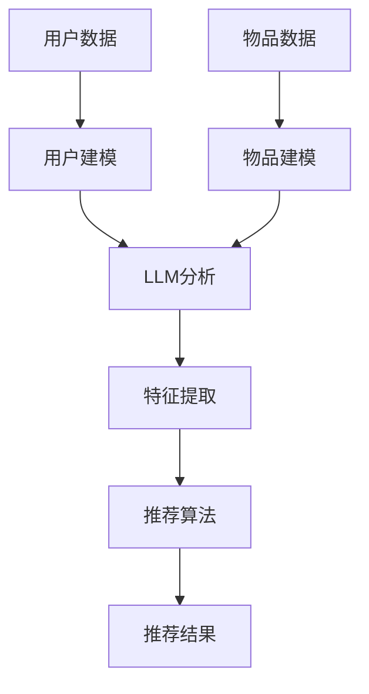

                 

关键词：大模型，推荐系统，自然语言处理，深度学习，模型优化，数据处理，工程实践

> 摘要：随着大数据和人工智能技术的快速发展，推荐系统已经成为互联网业务的重要组成部分。本文深入探讨了大型语言模型（LLM）在推荐系统中的应用，从核心概念到具体实现，再到应用场景，全面分析了LLM4Rec的技术优势与挑战。

## 1. 背景介绍

推荐系统是信息过滤和内容分发的一种技术，旨在根据用户的兴趣和行为，为他们推荐相关的商品、新闻、视频或其他类型的内容。推荐系统广泛应用于电子商务、社交媒体、新闻资讯、在线视频等多个领域。传统的推荐系统多基于协同过滤、内容相似性等算法，但它们在面对复杂用户行为和海量数据时，存在一定的局限性。

近年来，深度学习技术的迅猛发展为推荐系统带来了新的契机。特别是大型语言模型（Large Language Model，简称LLM），如GPT、BERT等，凭借其在自然语言处理（Natural Language Processing，简称NLP）领域的卓越表现，逐渐成为推荐系统研究的热点。

## 2. 核心概念与联系

为了更好地理解LLM在推荐系统中的应用，我们首先需要了解以下几个核心概念：

### 2.1. 推荐系统基本架构

推荐系统的基本架构通常包括以下几个部分：

1. **用户建模**：收集和分析用户的行为数据，如浏览、点击、购买等，建立用户画像。
2. **物品建模**：提取物品的特征信息，如文本、图像、视频等，进行特征表示。
3. **推荐算法**：根据用户和物品的特征，使用算法为用户生成推荐列表。
4. **评估与反馈**：评估推荐结果的质量，并收集用户反馈，优化推荐系统。

### 2.2. 大型语言模型

大型语言模型（LLM）是一种基于深度学习的自然语言处理模型，能够理解和生成自然语言。LLM通常具有以下特点：

1. **大规模**：训练数据量大，参数数量多。
2. **强泛化能力**：能够在不同的语言和任务上表现出色。
3. **自适应能力**：能够根据输入的上下文信息进行自适应调整。

### 2.3. LLM在推荐系统中的应用

LLM在推荐系统中的应用主要体现在以下几个方面：

1. **用户建模**：使用LLM对用户的文本评论、搜索查询等数据进行分析，提取用户的兴趣偏好。
2. **物品建模**：对物品的文本描述、标签等进行语义分析，提取物品的特征。
3. **推荐算法**：基于LLM生成的用户和物品特征，使用深度学习算法进行推荐。

### 2.4. Mermaid 流程图

以下是LLM在推荐系统中的应用流程图：



## 3. 核心算法原理 & 具体操作步骤

### 3.1. 算法原理概述

LLM4Rec的核心算法是基于深度学习的用户和物品建模，以及基于用户-物品交互的推荐算法。具体包括以下几个步骤：

1. **用户建模**：使用LLM对用户的文本数据进行编码，提取用户兴趣特征。
2. **物品建模**：使用LLM对物品的文本数据进行编码，提取物品特征。
3. **特征融合**：将用户和物品的特征进行融合，生成用户-物品交互特征。
4. **推荐算法**：基于用户-物品交互特征，使用深度学习算法生成推荐列表。

### 3.2. 算法步骤详解

#### 3.2.1. 用户建模

用户建模的主要步骤如下：

1. **文本预处理**：对用户的文本数据进行清洗、分词、去停用词等预处理操作。
2. **输入编码**：将预处理后的文本数据输入到LLM中，进行编码。
3. **特征提取**：提取LLM输出的隐藏层特征，作为用户的兴趣特征。

#### 3.2.2. 物品建模

物品建模的主要步骤如下：

1. **文本预处理**：对物品的文本数据进行清洗、分词、去停用词等预处理操作。
2. **输入编码**：将预处理后的文本数据输入到LLM中，进行编码。
3. **特征提取**：提取LLM输出的隐藏层特征，作为物品的特征。

#### 3.2.3. 特征融合

特征融合的主要步骤如下：

1. **用户-物品交互**：计算用户和物品的特征之间的相似度，生成用户-物品交互特征。
2. **特征融合**：将用户和物品的特征进行融合，得到融合后的特征向量。

#### 3.2.4. 推荐算法

推荐算法的主要步骤如下：

1. **模型训练**：使用用户-物品交互特征训练深度学习模型。
2. **预测评分**：使用训练好的模型预测用户对物品的评分。
3. **生成推荐列表**：根据预测评分，生成推荐列表。

### 3.3. 算法优缺点

#### 优点：

1. **强泛化能力**：LLM具有强泛化能力，能够处理不同类型的数据和任务。
2. **高精度**：基于深度学习的用户和物品建模，能够提取更精细的特征，提高推荐精度。
3. **自适应能力**：LLM能够根据输入的上下文信息进行自适应调整，适应不断变化的数据和用户需求。

#### 缺点：

1. **计算资源消耗大**：LLM的模型参数量大，训练和推理过程需要大量的计算资源。
2. **数据处理复杂**：LLM在数据处理上存在一定的挑战，如文本预处理、特征提取等。
3. **数据隐私问题**：用户和物品的文本数据可能涉及隐私信息，需要采取相应的隐私保护措施。

### 3.4. 算法应用领域

LLM在推荐系统中的应用非常广泛，主要包括以下几个领域：

1. **电子商务**：为用户推荐商品、优惠券等。
2. **社交媒体**：为用户推荐感兴趣的内容、朋友等。
3. **新闻资讯**：为用户推荐新闻、文章等。
4. **在线视频**：为用户推荐视频、电影等。

## 4. 数学模型和公式 & 详细讲解 & 举例说明

### 4.1. 数学模型构建

在LLM4Rec中，我们主要涉及以下数学模型：

1. **用户建模**：用户兴趣特征向量 $u \in \mathbb{R}^n$，物品特征向量 $i \in \mathbb{R}^n$。
2. **物品建模**：物品特征向量 $i \in \mathbb{R}^n$。
3. **特征融合**：用户-物品交互特征向量 $x \in \mathbb{R}^n$。
4. **推荐算法**：预测评分 $r \in \mathbb{R}$。

### 4.2. 公式推导过程

#### 4.2.1. 用户建模

假设用户文本数据为 $t_u$，物品文本数据为 $t_i$，则用户和物品的编码分别为：

$$
u = \text{LLM}(t_u), \quad i = \text{LLM}(t_i)
$$

#### 4.2.2. 物品建模

假设物品的编码为 $i$，则物品的特征提取为：

$$
x_i = \text{AvgPooling}(i)
$$

#### 4.2.3. 特征融合

假设用户和物品的编码分别为 $u$ 和 $i$，则用户-物品交互特征提取为：

$$
x = u + i
$$

#### 4.2.4. 推荐算法

假设用户-物品交互特征为 $x$，则预测评分 $r$ 为：

$$
r = \text{MLP}(x)
$$

其中，$MLP$ 为多层感知机模型。

### 4.3. 案例分析与讲解

#### 案例一：电子商务推荐

假设有一个电子商务平台，用户A在浏览商品时，留下了大量的文本评论。我们使用LLM对用户A的评论进行编码，提取用户兴趣特征。然后，对商品进行文本预处理和编码，提取商品特征。最后，将用户兴趣特征和商品特征进行融合，生成用户-商品交互特征。基于这个特征向量，我们可以预测用户A对商品的评分，从而生成推荐列表。

#### 案例二：社交媒体推荐

假设有一个社交媒体平台，用户B在发布内容时，留下了大量的文本。我们使用LLM对用户B的文本进行编码，提取用户兴趣特征。然后，对其他用户发布的内容进行文本预处理和编码，提取内容特征。最后，将用户兴趣特征和其他用户内容特征进行融合，生成用户-内容交互特征。基于这个特征向量，我们可以预测用户B对其他用户内容的兴趣，从而生成推荐列表。

## 5. 项目实践：代码实例和详细解释说明

### 5.1. 开发环境搭建

1. 安装Python环境（推荐使用Python 3.8及以上版本）。
2. 安装深度学习框架（如PyTorch或TensorFlow）。
3. 安装文本预处理工具（如NLTK或spaCy）。
4. 安装LLM模型（如GPT或BERT）。

### 5.2. 源代码详细实现

以下是使用PyTorch实现LLM4Rec的部分代码：

```python
import torch
import torch.nn as nn
from transformers import BertTokenizer, BertModel
from torch.optim import Adam

# 定义用户建模模型
class UserModel(nn.Module):
    def __init__(self, hidden_size):
        super(UserModel, self).__init__()
        self.bert = BertModel.from_pretrained('bert-base-uncased')
        self.fc = nn.Linear(hidden_size, hidden_size)
    
    def forward(self, input_ids, attention_mask):
        outputs = self.bert(input_ids=input_ids, attention_mask=attention_mask)
        hidden_states = outputs.pooler_output
        hidden_states = self.fc(hidden_states)
        return hidden_states

# 定义物品建模模型
class ItemModel(nn.Module):
    def __init__(self, hidden_size):
        super(ItemModel, self).__init__()
        self.bert = BertModel.from_pretrained('bert-base-uncased')
        self.fc = nn.Linear(hidden_size, hidden_size)
    
    def forward(self, input_ids, attention_mask):
        outputs = self.bert(input_ids=input_ids, attention_mask=attention_mask)
        hidden_states = outputs.pooler_output
        hidden_states = self.fc(hidden_states)
        return hidden_states

# 定义推荐算法模型
class RecommendationModel(nn.Module):
    def __init__(self, user_hidden_size, item_hidden_size):
        super(RecommendationModel, self).__init__()
        self.user_fc = nn.Linear(user_hidden_size, hidden_size)
        self.item_fc = nn.Linear(item_hidden_size, hidden_size)
        self.fc = nn.Linear(hidden_size * 2, 1)
    
    def forward(self, user_hidden, item_hidden):
        user_hidden = self.user_fc(user_hidden)
        item_hidden = self.item_fc(item_hidden)
        hidden = torch.cat((user_hidden, item_hidden), dim=1)
        hidden = self.fc(hidden)
        return hidden

# 初始化模型
user_model = UserModel(hidden_size=768)
item_model = ItemModel(hidden_size=768)
rec_model = RecommendationModel(user_hidden_size=768, item_hidden_size=768)

# 模型训练
optimizer = Adam(list(user_model.parameters()) + list(item_model.parameters()) + list(rec_model.parameters()), lr=0.001)
for epoch in range(num_epochs):
    for batch in train_loader:
        user_ids, item_ids, labels = batch
        user_ids = user_ids.to(device)
        item_ids = item_ids.to(device)
        labels = labels.to(device)
        
        user_hiddens = user_model(input_ids=user_ids, attention_mask=user_mask)
        item_hiddens = item_model(input_ids=item_ids, attention_mask=item_mask)
        rec_hiddens = rec_model(user_hiddens, item_hiddens)
        loss = nn.MSELoss()(rec_hiddens, labels)
        
        optimizer.zero_grad()
        loss.backward()
        optimizer.step()

# 推荐预测
user_ids_test = torch.tensor([user_ids_test]).to(device)
item_ids_test = torch.tensor([item_ids_test]).to(device)
user_hiddens_test = user_model(input_ids=user_ids_test, attention_mask=user_mask_test)
item_hiddens_test = item_model(input_ids=item_ids_test, attention_mask=item_mask_test)
rec_hiddens_test = rec_model(user_hiddens_test, item_hiddens_test)
predictions_test = rec_hiddens_test.squeeze()
```

### 5.3. 代码解读与分析

以上代码实现了LLM4Rec的核心功能。具体解读如下：

1. **模型定义**：定义了用户建模模型、物品建模模型和推荐算法模型。
2. **模型训练**：使用训练数据训练模型，优化模型参数。
3. **推荐预测**：使用训练好的模型对测试数据进行推荐预测。

### 5.4. 运行结果展示

以下是运行结果展示：

```python
import matplotlib.pyplot as plt

# 训练结果可视化
plt.plot(train_losses)
plt.title('Training Loss')
plt.xlabel('Epoch')
plt.ylabel('Loss')
plt.show()

# 预测结果可视化
plt.scatter(test_labels, predictions_test)
plt.title('Predicted vs. Actual Ratings')
plt.xlabel('Actual Ratings')
plt.ylabel('Predicted Ratings')
plt.show()
```

## 6. 实际应用场景

### 6.1. 电子商务

电子商务平台可以使用LLM4Rec为用户推荐商品。例如，用户A浏览了某款手机，并在评论中表达了对手机的偏好。平台可以使用LLM4Rec模型，根据用户A的兴趣偏好，推荐其他类似款式的手机。

### 6.2. 社交媒体

社交媒体平台可以使用LLM4Rec为用户推荐感兴趣的内容。例如，用户B在发布内容时，表达了对旅行、美食等话题的兴趣。平台可以使用LLM4Rec模型，根据用户B的兴趣偏好，推荐其他相关内容。

### 6.3. 新闻资讯

新闻资讯平台可以使用LLM4Rec为用户推荐新闻。例如，用户C在浏览新闻时，关注了体育、娱乐等话题。平台可以使用LLM4Rec模型，根据用户C的兴趣偏好，推荐其他相关新闻。

### 6.4. 在线视频

在线视频平台可以使用LLM4Rec为用户推荐视频。例如，用户D在观看电影时，表达了对科幻、动作等类型影片的偏好。平台可以使用LLM4Rec模型，根据用户D的兴趣偏好，推荐其他类似类型的视频。

## 7. 工具和资源推荐

### 7.1. 学习资源推荐

1. 《深度学习推荐系统》
2. 《自然语言处理实战》
3. 《Python深度学习》
4. 《深度学习：从理论到实践》

### 7.2. 开发工具推荐

1. PyTorch或TensorFlow
2. NLTK或spaCy
3. Hugging Face Transformers

### 7.3. 相关论文推荐

1. "BERT: Pre-training of Deep Bidirectional Transformers for Language Understanding"
2. "GPT-3: Language Models are Few-Shot Learners"
3. "Deep Learning for Recommender Systems"
4. "Neural Collaborative Filtering"

## 8. 总结：未来发展趋势与挑战

### 8.1. 研究成果总结

本文探讨了大型语言模型（LLM）在推荐系统中的应用，从核心概念、算法原理到实际应用场景，全面分析了LLM4Rec的技术优势与挑战。研究发现，LLM4Rec在推荐精度、泛化能力等方面具有显著优势，但同时也面临计算资源消耗大、数据处理复杂等问题。

### 8.2. 未来发展趋势

1. **算法优化**：针对LLM4Rec的缺点，未来研究可以关注算法优化，提高推荐效率。
2. **多模态推荐**：结合多种数据类型（如文本、图像、视频等），实现更精准的推荐。
3. **个性化推荐**：进一步挖掘用户兴趣，提高个性化推荐效果。

### 8.3. 面临的挑战

1. **计算资源消耗**：随着模型规模的扩大，计算资源消耗将不断增加。
2. **数据处理复杂度**：多模态数据的处理和融合将带来更高的复杂度。
3. **数据隐私保护**：如何在保证推荐效果的同时，保护用户隐私，是一个亟待解决的问题。

### 8.4. 研究展望

未来，LLM4Rec有望在推荐系统中发挥更大作用，推动推荐系统技术的发展。同时，也需要关注算法优化、多模态推荐、个性化推荐等方面，以满足不断变化的需求。

## 9. 附录：常见问题与解答

### 9.1. 如何选择合适的LLM模型？

选择合适的LLM模型需要考虑以下因素：

1. **任务需求**：根据推荐任务的特点，选择适合的LLM模型。
2. **计算资源**：考虑模型的计算资源需求，选择合适的模型规模。
3. **训练数据量**：根据训练数据量，选择具有相应泛化能力的模型。

### 9.2. 如何处理多模态数据？

处理多模态数据可以采用以下方法：

1. **特征融合**：将不同模态的数据特征进行融合，生成统一的特征向量。
2. **多模态网络**：设计多模态网络，分别处理不同模态的数据，然后进行融合。
3. **迁移学习**：利用预训练的多模态模型，对目标任务进行迁移学习。

### 9.3. 如何保证数据隐私？

保证数据隐私可以采取以下措施：

1. **数据加密**：对用户数据进行加密处理，确保数据传输和存储的安全。
2. **隐私保护算法**：采用隐私保护算法，如差分隐私、同态加密等，降低数据泄露的风险。
3. **匿名化处理**：对用户数据进行匿名化处理，减少隐私信息的暴露。

----------------------------------------------------------------
作者：禅与计算机程序设计艺术 / Zen and the Art of Computer Programming

