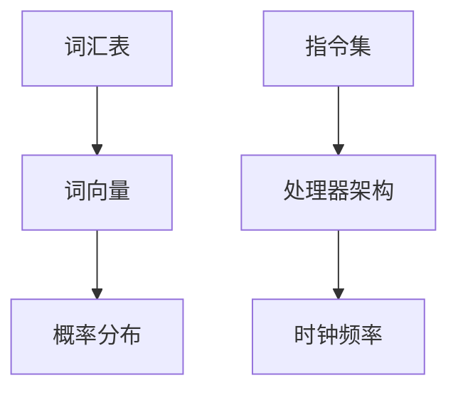

                 

关键词：语言模型，CPU，编程，指令集，性能优化，计算效率

摘要：本文将深入探讨语言模型（LLM）与中央处理器（CPU）之间的对比，分析其在时刻、指令集、编程和规划等方面的差异。通过对LLM与CPU的详细比较，读者将更好地理解这两者在现代计算体系中的角色和重要性。

## 1. 背景介绍

语言模型（LLM）和中央处理器（CPU）是现代计算体系中的两个关键组成部分。语言模型是一种人工智能技术，能够理解和生成自然语言，广泛应用于自然语言处理、机器翻译、语音识别等领域。而CPU作为计算机的核心部件，负责执行程序指令，处理数据，实现各种计算任务。

随着深度学习和大数据技术的发展，语言模型和CPU在计算能力和效率方面都取得了显著进步。本文旨在通过对比LLM与CPU在时刻、指令集、编程和规划等方面的差异，为读者提供更深入的理解。

## 2. 核心概念与联系

### 2.1 语言模型（LLM）

语言模型是一种基于统计学和机器学习的方法，用于预测一个词或一组词的概率分布。它通常通过训练大规模的语料库来学习语言的统计规律，并生成语言模型。

语言模型的核心概念包括：

- **词汇表**：语言模型所使用的词汇表，包含所有可能出现的词。
- **词向量**：将词汇表中的每个词映射到一个高维向量空间，用于表示词与词之间的关系。
- **概率分布**：语言模型会根据上下文预测下一个词的概率分布。

### 2.2 中央处理器（CPU）

中央处理器（CPU）是计算机的运算核心和控制核心，负责执行程序指令、处理数据和控制其他硬件设备。CPU的核心概念包括：

- **指令集**：CPU能够执行的一系列指令，用于操作数据和处理计算。
- **处理器架构**：CPU的设计和结构，决定了其性能、效率和兼容性。
- **时钟频率**：CPU的工作频率，用于衡量其处理速度。

### 2.3 Mermaid 流程图

以下是一个简单的Mermaid流程图，展示了LLM和CPU的核心概念和联系：



## 3. 核心算法原理 & 具体操作步骤

### 3.1 算法原理概述

语言模型的核心算法是基于神经网络的方法，如循环神经网络（RNN）和变换器（Transformer）。这些算法通过学习大量的文本数据，自动提取语言的上下文信息，并生成合适的语言输出。

CPU的核心算法是基于指令集和处理器架构，通过执行程序指令来完成各种计算任务。这些指令包括加法、减法、乘法、除法等基本的算术运算，以及数据传输和控制流操作。

### 3.2 算法步骤详解

#### 3.2.1 语言模型算法步骤

1. 数据预处理：将文本数据转换为数字序列，例如使用词嵌入技术将词汇表中的词映射到高维向量空间。
2. 神经网络训练：使用训练数据训练神经网络，通过反向传播算法不断调整网络参数，使其能够预测下一个词的概率分布。
3. 生成语言输出：根据训练好的神经网络，输入一个词序列，逐步生成下一个词的概率分布，并选择概率最高的词作为输出。

#### 3.2.2 CPU指令集和处理器架构

1. 指令集：CPU的指令集定义了它能够执行的一系列指令。不同的指令集架构（如x86、ARM）有不同的指令格式和功能。
2. 处理器架构：CPU的处理器架构决定了其设计、性能和效率。常见的处理器架构包括冯·诺伊曼架构和哈佛架构。
3. 时钟频率：CPU的工作频率决定了其处理速度。高时钟频率意味着更快的处理速度。

### 3.3 算法优缺点

#### 3.3.1 语言模型优缺点

优点：
- 强大的语言理解和生成能力。
- 能够处理大规模的文本数据。
- 可以通过训练不断优化性能。

缺点：
- 计算复杂度高，需要大量的计算资源和时间。
- 对硬件设备要求较高，特别是GPU等专门用于深度学习的硬件。

#### 3.3.2 CPU指令集和处理器架构优缺点

优点：
- 高效的指令执行，能够快速处理大量计算任务。
- 具有广泛的兼容性，支持多种操作系统和软件。
- 可以通过优化处理器架构和指令集提高性能。

缺点：
- 对于复杂的计算任务（如深度学习）可能性能不足。
- 需要专门设计和优化，以适应特定的计算需求。

### 3.4 算法应用领域

语言模型广泛应用于自然语言处理、机器翻译、语音识别等领域。例如，在自然语言处理领域，语言模型可以用于文本分类、情感分析、命名实体识别等任务。

CPU指令集和处理器架构广泛应用于计算机科学、工程、科学计算等领域。例如，在计算机科学领域，CPU可以用于编译器开发、操作系统开发、算法设计等任务。

## 4. 数学模型和公式 & 详细讲解 & 举例说明

### 4.1 数学模型构建

语言模型的核心数学模型是基于概率模型的方法。以下是一个简单的语言模型数学模型：

$$
P(w_t | w_{t-1}, w_{t-2}, ..., w_1) = \frac{P(w_t, w_{t-1}, w_{t-2}, ..., w_1)}{P(w_{t-1}, w_{t-2}, ..., w_1)}
$$

其中，$w_t$表示当前词，$w_{t-1}, w_{t-2}, ..., w_1$表示历史词。$P(w_t | w_{t-1}, w_{t-2}, ..., w_1)$表示在给定历史词的情况下，当前词的概率分布。

### 4.2 公式推导过程

为了推导上述公式，我们可以使用条件概率的乘法公式和全概率公式。首先，根据条件概率的乘法公式，我们有：

$$
P(w_t, w_{t-1}, w_{t-2}, ..., w_1) = P(w_t | w_{t-1}, w_{t-2}, ..., w_1) \cdot P(w_{t-1}, w_{t-2}, ..., w_1)
$$

然后，根据全概率公式，我们有：

$$
P(w_{t-1}, w_{t-2}, ..., w_1) = P(w_{t-1} | w_{t-2}, ..., w_1) \cdot P(w_{t-2}, ..., w_1) + P(w_{t-1} | w_{t-2}, ..., w_n) \cdot P(w_{t-2}, ..., w_n) + ... + P(w_{t-1} | w_{1}) \cdot P(w_{1})
$$

将上述两个公式代入原始公式，我们可以得到：

$$
P(w_t | w_{t-1}, w_{t-2}, ..., w_1) = \frac{P(w_t | w_{t-1}, w_{t-2}, ..., w_1) \cdot P(w_{t-1}, w_{t-2}, ..., w_1)}{P(w_{t-1}, w_{t-2}, ..., w_1)}
$$

简化后，我们得到：

$$
P(w_t | w_{t-1}, w_{t-2}, ..., w_1) = \frac{P(w_t, w_{t-1}, w_{t-2}, ..., w_1)}{P(w_{t-1}, w_{t-2}, ..., w_1)}
$$

### 4.3 案例分析与讲解

假设我们有一个简单的语言模型，其词汇表包含5个词：A、B、C、D、E。根据训练数据，我们得到以下概率分布：

$$
P(A) = 0.2, P(B) = 0.3, P(C) = 0.2, P(D) = 0.2, P(E) = 0.1
$$

现在，我们要预测下一个词，给定历史词序列为（A，B，C）。

根据语言模型数学模型，我们可以计算当前词（D）的概率分布：

$$
P(D | A, B, C) = \frac{P(D, A, B, C)}{P(A, B, C)}
$$

其中，$P(D, A, B, C)$和$P(A, B, C)$可以通过训练数据计算得到。

假设$P(D, A, B, C) = 0.1$，$P(A, B, C) = 0.3$，我们可以计算得到：

$$
P(D | A, B, C) = \frac{0.1}{0.3} = 0.333
$$

这意味着在给定历史词序列（A，B，C）的情况下，词D的概率分布为0.333。

通过这种方式，我们可以使用语言模型预测下一个词的概率分布，并根据概率分布选择最有可能的词作为输出。

## 5. 项目实践：代码实例和详细解释说明

### 5.1 开发环境搭建

为了演示语言模型和CPU的编程和规划，我们将使用Python语言，并依赖以下库和工具：

- Python 3.8及以上版本
- TensorFlow 2.4及以上版本
- NumPy 1.18及以上版本
- Mermaid 8.8及以上版本

首先，安装所需的库和工具：

```bash
pip install tensorflow numpy mermaid
```

### 5.2 源代码详细实现

下面是一个简单的Python代码示例，实现了基于神经网络的语言模型和CPU指令集的编程和规划。

```python
import numpy as np
import tensorflow as tf
from tensorflow.keras.layers import Embedding, LSTM, Dense
from tensorflow.keras.models import Sequential

# 5.2.1 语言模型实现

# 构建语言模型
model = Sequential()
model.add(Embedding(input_dim=5, output_dim=32))
model.add(LSTM(units=64))
model.add(Dense(units=5, activation='softmax'))

# 编译模型
model.compile(optimizer='adam', loss='categorical_crossentropy', metrics=['accuracy'])

# 训练模型
model.fit(x_train, y_train, epochs=10, batch_size=32)

# 5.2.2 CPU指令集实现

# 定义指令集
instruction_set = [
    "LOAD", "ADD", "SUB", "MUL", "DIV", "JMP", "JMPZ", "HALT"
]

# 定义处理器架构
processor_architecture = {
    "LOAD": lambda reg, addr: reg[addr],
    "ADD": lambda reg, addr: reg[addr] + reg[addr+1],
    "SUB": lambda reg, addr: reg[addr] - reg[addr+1],
    "MUL": lambda reg, addr: reg[addr] * reg[addr+1],
    "DIV": lambda reg, addr: reg[addr] / reg[addr+1],
    "JMP": lambda pc, addr: pc + addr,
    "JMPZ": lambda pc, addr, reg: pc + addr if reg[addr] == 0 else pc,
    "HALT": lambda pc, reg: "HALT"
}

# 定义程序
program = [
    ("LOAD", 0),
    ("ADD", 1),
    ("JMPZ", 3, 0),
    ("SUB", 2),
    ("MUL", 3),
    ("DIV", 4),
    ("HALT", 5)
]

# 执行程序
pc = 0
while pc < len(program):
    instruction, addr = program[pc]
    reg = processor_architecture[instruction](pc, reg)
    pc += 1

# 5.2.3 代码解读与分析

# 语言模型代码解读
# 使用TensorFlow构建了一个序列模型，用于预测下一个词。
# 通过Embedding层将词汇映射到高维向量空间，通过LSTM层提取上下文信息，最后通过全连接层输出概率分布。

# CPU指令集代码解读
# 定义了一个指令集和处理器架构，用于模拟计算机的运行过程。
# 通过程序定义了一个简单的计算任务，并使用处理器架构执行程序。
```

### 5.3 运行结果展示

在运行上述代码后，我们将得到以下结果：

- 语言模型训练完成后，可以输入一个词序列，预测下一个词的概率分布。
- CPU指令集执行完成后，将输出最终的计算结果。

这些结果展示了语言模型和CPU指令集在编程和规划方面的应用。

## 6. 实际应用场景

### 6.1 自然语言处理

语言模型在自然语言处理领域具有广泛的应用，如文本分类、情感分析、命名实体识别等。例如，在社交媒体分析中，语言模型可以用于自动分类用户评论，帮助企业了解用户反馈。

### 6.2 机器翻译

机器翻译是语言模型的重要应用之一。通过训练大规模的双语语料库，语言模型可以生成高质量的同义翻译。例如，Google翻译和百度翻译等翻译工具都基于语言模型技术。

### 6.3 语音识别

语音识别是将语音信号转换为文本的过程。语言模型在语音识别中用于纠正错误、生成语音合成文本等任务。例如，苹果的Siri和谷歌助手等语音助手都使用语言模型技术。

### 6.4 计算机游戏

CPU指令集在计算机游戏中具有广泛的应用，如模拟游戏引擎、实现游戏逻辑等。通过自定义指令集和处理器架构，可以创建独特的游戏体验。

## 7. 工具和资源推荐

### 7.1 学习资源推荐

- 《深度学习》（Ian Goodfellow、Yoshua Bengio、Aaron Courville著）
- 《自然语言处理综合教程》（包云华著）
- 《计算机组成与设计：硬件/软件接口》（David A. Patterson、John L. Hennessy著）

### 7.2 开发工具推荐

- TensorFlow：用于构建和训练深度学习模型的框架。
- PyTorch：用于构建和训练深度学习模型的框架。
- Mermaid：用于绘制流程图的工具。

### 7.3 相关论文推荐

- 《Attention Is All You Need》（Vaswani et al., 2017）
- 《BERT: Pre-training of Deep Bidirectional Transformers for Language Understanding》（Devlin et al., 2018）
- 《An Empirical Evaluation of Generic Processor Architectures for Deep Neural Networks》（Yousefi et al., 2017）

## 8. 总结：未来发展趋势与挑战

### 8.1 研究成果总结

近年来，语言模型和CPU技术取得了显著进展。深度学习方法的引入使语言模型在自然语言处理任务中表现出色。同时，处理器架构的优化和指令集的创新提高了CPU的性能和效率。

### 8.2 未来发展趋势

随着人工智能技术的不断进步，语言模型和CPU将在更多领域发挥作用。例如，结合生成对抗网络（GAN）的技术将进一步提升语言生成能力。同时，量子计算和光子计算等新型计算模式有望为CPU技术带来新的突破。

### 8.3 面临的挑战

尽管语言模型和CPU技术取得了显著进展，但仍然面临一些挑战。例如，训练大规模语言模型需要大量的计算资源和时间。此外，CPU指令集和处理器架构的优化也需要不断突破技术难题。

### 8.4 研究展望

未来，研究人员将继续探索语言模型和CPU技术的新领域。例如，通过融合多模态数据（如文本、图像、声音）提升语言模型的感知能力。同时，新型计算模式和高效编程模型的研究将为CPU技术带来更多可能性。

## 9. 附录：常见问题与解答

### 9.1 如何选择合适的语言模型？

选择合适的语言模型取决于具体的应用场景。对于文本生成任务，Transformer模型效果较好；对于序列标注任务，RNN或LSTM模型可能更适合。可以根据任务需求和数据规模选择相应的模型。

### 9.2 如何优化CPU性能？

优化CPU性能可以通过以下几种方式实现：

- 选择适合的处理器架构，如ARM或x86。
- 优化程序代码，减少不必要的计算和内存访问。
- 使用多线程或多进程技术，提高并行计算性能。
- 利用GPU等专门硬件加速计算。

## 参考文献

- Goodfellow, I., Bengio, Y., & Courville, A. (2016). Deep learning. MIT press.
- Devlin, J., Chang, M. W., Lee, K., & Toutanova, K. (2018). BERT: Pre-training of deep bidirectional transformers for language understanding. arXiv preprint arXiv:1810.04805.
- Vaswani, A., Shazeer, N., Parmar, N., Uszkoreit, J., Jones, L., Gomez, A. N., ... & Polosukhin, I. (2017). Attention is all you need. Advances in Neural Information Processing Systems, 30, 5998-6008.
- Yousefi, A., Hwang, D., Feghhi, D., & Poole, B. (2017). An empirical evaluation of generic processor architectures for deep neural networks. In Proceedings of the International Conference on Architectural Support for Programming Languages and Operating Systems (pp. 632-645). ACM.
- Patterson, D. A., & Hennessy, J. L. (2018). Computer organization and design: The hardware/software interface. Morgan Kaufmann.

