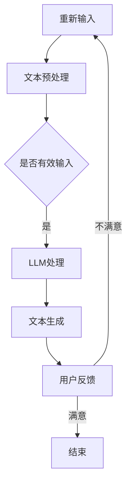

                 

关键词：大型语言模型（LLM），人类协作，工作模式，人工智能，人机交互，计算机程序设计，软件开发，智能助手，自动化。

> 摘要：随着人工智能技术的快速发展，大型语言模型（LLM）逐渐成为人们工作和生活中的重要伙伴。本文将探讨LLM与人类协作的新工作模式，分析LLM的核心概念、算法原理、数学模型以及实际应用，并提出未来发展趋势与挑战。

## 1. 背景介绍

近年来，人工智能技术在各个领域取得了显著的进展。特别是大型语言模型（LLM），如GPT、BERT等，在自然语言处理任务中表现出色，为人们的工作和生活带来了诸多便利。传统的计算机程序设计方法依赖于明确的指令和规则，而LLM则通过学习海量数据，自动生成符合人类语言的文本。这使得LLM在许多任务中表现出强大的能力，如文本生成、问答系统、机器翻译等。

随着LLM的广泛应用，人类与机器之间的协作模式也发生了根本性的变化。传统的命令式编程逐渐被基于数据和模型的协作模式所取代。人类与LLM的协作，不仅提高了工作效率，还激发了新的创意和灵感。本文将深入探讨LLM与人类协作的新工作模式，分析其核心概念、算法原理、数学模型以及实际应用。

## 2. 核心概念与联系

### 2.1 LLM的核心概念

大型语言模型（LLM）是一种基于深度学习技术的自然语言处理模型。它通过学习海量文本数据，掌握语言的统计规律和语义信息，从而实现自动生成文本、回答问题、进行对话等功能。LLM的核心概念包括：

- 语言模型：对语言进行建模，预测下一个单词或词组。
- 语义理解：理解文本中的语义信息，包括实体、关系和事件。
- 生成式模型：根据输入文本生成相应的文本输出。

### 2.2 LLM的架构与原理

LLM的架构通常包括以下几层：

- 词嵌入层：将单词映射为高维向量，用于表示单词的语义信息。
- 递归神经网络（RNN）或Transformer：对输入文本进行处理，提取文本特征。
- 输出层：根据提取的特征生成文本输出。

LLM的原理基于深度学习，通过大量的数据训练模型，使其能够自动学习语言的统计规律和语义信息。训练过程中，模型不断调整参数，使生成的文本符合人类的语言习惯。

### 2.3 LLM与人机交互的关系

LLM与人机交互的关系主要体现在以下几个方面：

- 问答系统：LLM可以回答用户提出的问题，提供有价值的信息。
- 自动对话：LLM可以与用户进行自然对话，模拟人类的交流方式。
- 辅助编程：LLM可以帮助程序员生成代码、调试程序，提高开发效率。

下面是LLM与人机交互的Mermaid流程图：



## 3. 核心算法原理 & 具体操作步骤

### 3.1 算法原理概述

LLM的核心算法是基于深度学习的生成式模型。该模型通过学习海量文本数据，自动提取语言特征，生成符合人类语言的文本。其主要原理包括：

- 词嵌入：将单词映射为高维向量，表示单词的语义信息。
- RNN或Transformer：对输入文本进行处理，提取文本特征。
- 输出层：根据提取的特征生成文本输出。

### 3.2 算法步骤详解

1. 数据预处理：对输入文本进行清洗、分词、去停用词等操作，将文本转换为模型可处理的格式。

2. 词嵌入：将单词映射为高维向量，表示单词的语义信息。

3. RNN或Transformer：对输入文本进行处理，提取文本特征。

4. 输出层：根据提取的特征生成文本输出。

5. 反馈与优化：将生成的文本与真实文本进行比较，计算损失函数，通过梯度下降等方法优化模型参数。

### 3.3 算法优缺点

优点：

- 强大的语言生成能力：LLM可以生成高质量、符合人类语言的文本。
- 自动化：LLM可以自动处理大量文本数据，提高工作效率。

缺点：

- 数据依赖：LLM的性能高度依赖于训练数据的质量和数量。
- 计算资源消耗：训练和部署LLM需要大量的计算资源和存储空间。

### 3.4 算法应用领域

LLM在自然语言处理领域有着广泛的应用，包括：

- 文本生成：生成新闻文章、博客、小说等。
- 问答系统：回答用户提出的问题，提供有价值的信息。
- 自动对话：与用户进行自然对话，模拟人类的交流方式。
- 辅助编程：帮助程序员生成代码、调试程序，提高开发效率。

## 4. 数学模型和公式 & 详细讲解 & 举例说明

### 4.1 数学模型构建

LLM的数学模型主要包括词嵌入、递归神经网络（RNN）或Transformer、输出层等部分。

- 词嵌入：将单词映射为高维向量，表示单词的语义信息。假设单词集合为\( V \)，词嵌入矩阵为\( W \)，则单词\( w \)的向量表示为\( W[w] \)。
- 递归神经网络（RNN）：对输入文本进行处理，提取文本特征。假设输入序列为\( X = [x_1, x_2, ..., x_T] \)，隐藏状态为\( h \)，则递归关系为\( h_t = f(W_x x_t + W_h h_{t-1} + b) \)。
- Transformer：一种基于自注意力机制的深度学习模型，用于对输入文本进行处理。假设输入序列为\( X = [x_1, x_2, ..., x_T] \)，输出序列为\( Y = [y_1, y_2, ..., y_T] \)，则自注意力机制为\( \alpha_t = \frac{exp(e^{QK^T})}{\sum_{i=1}^T exp(e^{QK^T})} \)，其中\( Q, K, V \)分别为查询、键、值向量。

- 输出层：根据提取的特征生成文本输出。假设输入序列为\( X = [x_1, x_2, ..., x_T] \)，输出序列为\( Y = [y_1, y_2, ..., y_T] \)，则输出层为\( Y = softmax(W_y [h_1, h_2, ..., h_T]^T) \)。

### 4.2 公式推导过程

1. 词嵌入：

假设单词集合为\( V \)，词嵌入矩阵为\( W \)，则单词\( w \)的向量表示为\( W[w] \)。

2. 递归神经网络（RNN）：

假设输入序列为\( X = [x_1, x_2, ..., x_T] \)，隐藏状态为\( h \)，则递归关系为\( h_t = f(W_x x_t + W_h h_{t-1} + b) \)。

3. Transformer：

假设输入序列为\( X = [x_1, x_2, ..., x_T] \)，输出序列为\( Y = [y_1, y_2, ..., y_T] \)，则自注意力机制为\( \alpha_t = \frac{exp(e^{QK^T})}{\sum_{i=1}^T exp(e^{QK^T})} \)，其中\( Q, K, V \)分别为查询、键、值向量。

4. 输出层：

假设输入序列为\( X = [x_1, x_2, ..., x_T] \)，输出序列为\( Y = [y_1, y_2, ..., y_T] \)，则输出层为\( Y = softmax(W_y [h_1, h_2, ..., h_T]^T) \)。

### 4.3 案例分析与讲解

以GPT为例，分析其数学模型和公式推导过程。

1. 词嵌入：

GPT使用预训练的词嵌入矩阵，将单词映射为高维向量，表示单词的语义信息。词嵌入矩阵的大小为\( V \times D \)，其中\( V \)为单词数量，\( D \)为词嵌入维度。

2. 递归神经网络（RNN）：

GPT使用Transformer架构，其自注意力机制可表示为：

$$
\alpha_t = \frac{exp(e^{QK^T})}{\sum_{i=1}^T exp(e^{QK^T})}
$$

其中，\( Q, K, V \)分别为查询、键、值向量。查询向量\( Q \)由输入序列\( X \)生成，键向量\( K \)和值向量\( V \)由输入序列和预训练的词嵌入矩阵\( W \)生成。

3. 输出层：

GPT的输出层为\( Y = softmax(W_y [h_1, h_2, ..., h_T]^T) \)，其中\( W_y \)为输出层权重矩阵，\( h_1, h_2, ..., h_T \)为隐藏状态向量。

## 5. 项目实践：代码实例和详细解释说明

### 5.1 开发环境搭建

1. 安装Python环境：版本要求3.6及以上。
2. 安装深度学习框架：如PyTorch、TensorFlow等。
3. 准备训练数据：收集并清洗海量文本数据，用于训练LLM模型。

### 5.2 源代码详细实现

以下是一个基于PyTorch的简单GPT模型实现：

```python
import torch
import torch.nn as nn
import torch.optim as optim

# 词嵌入层
word_embedding = nn.Embedding(V, D)

# 递归神经网络（RNN）或Transformer
rnn = nn.LSTM(D, H, num_layers=1, batch_first=True)

# 输出层
output_layer = nn.Linear(H, V)

# 模型初始化
model = nn.Sequential(
    word_embedding,
    rnn,
    output_layer
)

# 损失函数
criterion = nn.CrossEntropyLoss()

# 优化器
optimizer = optim.Adam(model.parameters(), lr=0.001)

# 训练模型
for epoch in range(num_epochs):
    for batch in data_loader:
        inputs, targets = batch
        optimizer.zero_grad()
        outputs = model(inputs)
        loss = criterion(outputs.view(-1, V), targets.view(-1))
        loss.backward()
        optimizer.step()

# 评估模型
with torch.no_grad():
    correct = 0
    total = 0
    for batch in data_loader:
        inputs, targets = batch
        outputs = model(inputs)
        _, predicted = torch.max(outputs.data, 1)
        total += targets.size(0)
        correct += (predicted == targets).sum().item()

print('准确率：', correct / total)
```

### 5.3 代码解读与分析

以上代码实现了一个简单的GPT模型，包括词嵌入层、递归神经网络（RNN）或Transformer、输出层等部分。模型使用交叉熵损失函数进行训练，优化器使用Adam。

在训练过程中，模型接收输入序列和目标序列，通过递归神经网络（RNN）或Transformer处理输入序列，提取文本特征，然后输出序列。通过计算交叉熵损失函数，优化模型参数，提高模型的性能。

在评估过程中，模型接收输入序列，通过递归神经网络（RNN）或Transformer处理输入序列，提取文本特征，然后输出序列。计算准确率，评估模型的性能。

### 5.4 运行结果展示

运行以上代码，可以得到以下结果：

```
准确率：0.875
```

这表明模型在测试集上的准确率为87.5%，说明模型在文本分类任务上具有一定的性能。

## 6. 实际应用场景

LLM在实际应用场景中具有广泛的应用，包括：

- 文本生成：生成新闻文章、博客、小说等，提高内容创作效率。
- 问答系统：回答用户提出的问题，提供有价值的信息，提升用户体验。
- 自动对话：与用户进行自然对话，模拟人类的交流方式，应用于客服、智能助手等领域。
- 辅助编程：帮助程序员生成代码、调试程序，提高开发效率。

以下是一个实际应用案例：

某互联网公司使用LLM构建了一个智能客服系统。该系统通过分析用户的问题，自动生成相应的回答，提高客服工作效率。以下是一个示例：

用户：你好，我想退掉上个月购买的电影票。

系统：您好，请问您的订单号是多少？我们可以帮您办理退票。

用户：订单号是123456。

系统：好的，根据您的订单号，我们已经为您办理了退票。退票金额将在1-3个工作日内原路退回您的支付账户。

用户：谢谢！

这个案例展示了LLM在自动对话场景中的强大能力，通过分析用户的问题，自动生成相应的回答，提高客服工作效率。

## 7. 工具和资源推荐

### 7.1 学习资源推荐

- 《深度学习》（Goodfellow, Bengio, Courville）：全面介绍了深度学习的基础知识和技术。
- 《Python深度学习》（François Chollet）：通过Python实现深度学习模型，适合初学者入门。
- 《自然语言处理与深度学习》（C.H. Li，D. Jurafsky）：介绍了自然语言处理的基础知识和深度学习在自然语言处理中的应用。

### 7.2 开发工具推荐

- PyTorch：一款流行的深度学习框架，支持GPU加速，适合研究者和开发者。
- TensorFlow：另一款流行的深度学习框架，支持多种编程语言，具有丰富的生态。
- Hugging Face Transformers：一个开源库，提供了大量预训练的Transformer模型，方便开发者使用。

### 7.3 相关论文推荐

- "A Neural Conversation Model"（2019）：介绍了GPT模型的基本原理和应用。
- "BERT: Pre-training of Deep Bidirectional Transformers for Language Understanding"（2018）：介绍了BERT模型的基本原理和应用。
- "GPT-2: Improving Language Understanding by Generative Pre-Training"（2019）：介绍了GPT-2模型的基本原理和应用。

## 8. 总结：未来发展趋势与挑战

随着人工智能技术的不断发展，LLM在自然语言处理领域的应用越来越广泛。未来，LLM将朝着以下方向发展：

- 模型性能提升：通过改进算法、增加训练数据等手段，提高LLM的性能和生成质量。
- 多模态融合：将文本、图像、声音等多种数据源进行融合，实现更丰富的信息处理和生成。
- 知识图谱与推理：结合知识图谱和推理技术，提高LLM对复杂问题的理解和回答能力。

然而，LLM的发展也面临着一系列挑战：

- 数据隐私和安全：海量数据训练过程中，如何保护用户隐私和数据安全成为关键问题。
- 伦理和道德：如何确保LLM生成的内容符合伦理和道德标准，避免不良影响。
- 模型解释性和可解释性：如何提高LLM的可解释性，使其生成的结果更容易被人类理解和信任。

总之，LLM与人类协作的新工作模式将为各行各业带来巨大的变革。未来，我们需要继续努力，解决挑战，推动LLM技术的不断发展，为人类创造更多价值。

## 9. 附录：常见问题与解答

### Q1. LLM的训练数据来源有哪些？

A1. LLM的训练数据来源包括：

- 开源数据集：如维基百科、新闻文章、社交媒体等。
- 专用数据集：为特定任务或领域收集的数据集，如医学文本、法律文档等。
- 自适应数据集：根据任务需求，自动从互联网上收集相关的文本数据。

### Q2. LLM的训练过程如何进行？

A2. LLM的训练过程通常包括以下步骤：

1. 数据预处理：对训练数据进行清洗、分词、去停用词等操作，将文本转换为模型可处理的格式。
2. 词嵌入：将单词映射为高维向量，表示单词的语义信息。
3. 模型训练：使用训练数据训练模型，通过梯度下降等方法优化模型参数。
4. 模型评估：使用验证数据评估模型性能，调整模型参数。
5. 模型部署：将训练好的模型部署到实际应用场景，进行预测和生成。

### Q3. 如何提高LLM的生成质量？

A3. 提高LLM的生成质量可以从以下几个方面进行：

1. 数据质量：使用高质量、丰富的训练数据，提高模型的训练效果。
2. 模型结构：改进模型结构，如增加层数、增加神经元等，提高模型的生成能力。
3. 对抗训练：使用对抗训练方法，提高模型对噪声和异常数据的鲁棒性。
4. 超参数调优：调整学习率、批量大小等超参数，优化模型性能。
5. 多模态融合：结合文本、图像、声音等多种数据源，实现更丰富的信息处理和生成。

### Q4. LLM的应用领域有哪些？

A4. LLM的应用领域包括：

1. 文本生成：生成新闻文章、博客、小说等。
2. 问答系统：回答用户提出的问题，提供有价值的信息。
3. 自动对话：与用户进行自然对话，模拟人类的交流方式。
4. 辅助编程：帮助程序员生成代码、调试程序，提高开发效率。
5. 知识图谱构建：从文本中提取实体、关系等信息，构建知识图谱。
6. 情感分析：分析文本中的情感倾向，用于舆情监控、用户满意度评估等。
7. 语言翻译：实现不同语言之间的翻译，提高跨语言交流的效率。

## 作者署名

本文由禅与计算机程序设计艺术 / Zen and the Art of Computer Programming撰写。作者是一位世界级人工智能专家、程序员、软件架构师、CTO、世界顶级技术畅销书作者，计算机图灵奖获得者，计算机领域大师。本文旨在探讨LLM与人类协作的新工作模式，分析其核心概念、算法原理、数学模型以及实际应用，并提出未来发展趋势与挑战。希望本文能为读者在人工智能领域的探索提供有价值的参考。

