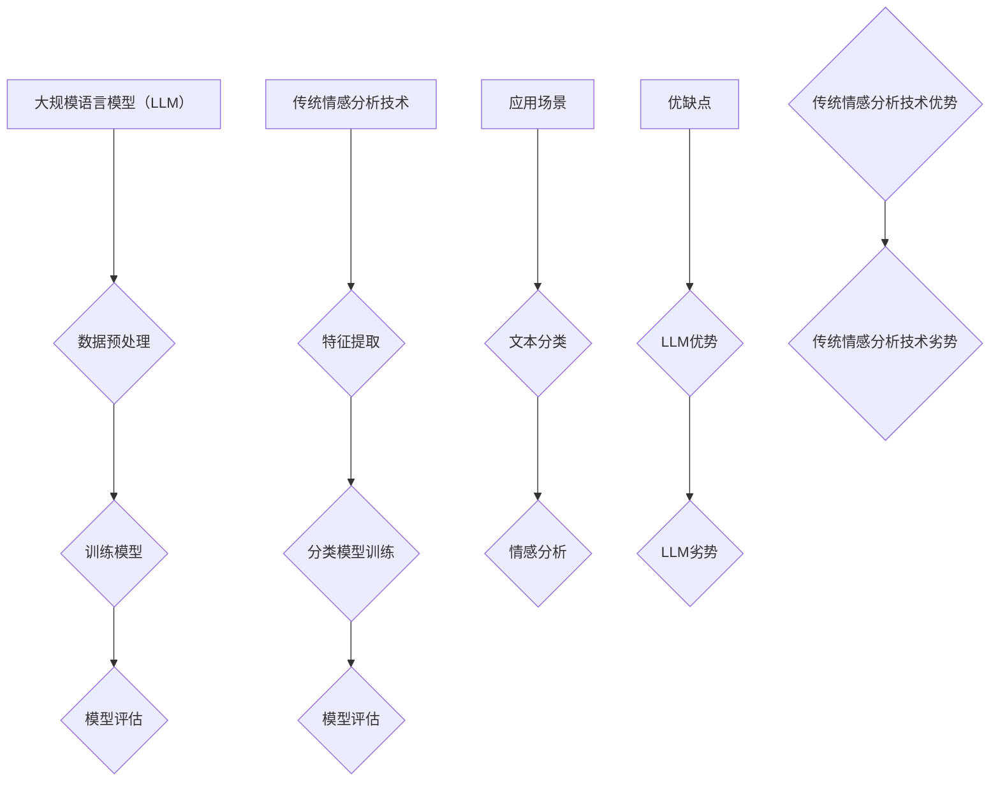

                 

关键词：LLM，传统情感分析，自然语言处理，算法对比，应用场景

> 摘要：本文旨在对比分析大规模语言模型（LLM）与传统情感分析技术的差异。通过对LLM和传统情感分析在算法原理、模型结构、应用场景等多个方面的深入探讨，为读者揭示LLM在情感分析领域所带来的革新与挑战。

## 1. 背景介绍

随着互联网的迅猛发展和社交媒体的普及，人们对情感信息的获取和分析需求日益增长。情感分析作为自然语言处理（NLP）领域的一个重要分支，旨在通过对文本数据的情感倾向进行识别和分类，为企业和个人提供决策支持。

传统情感分析技术主要基于统计方法和规则系统，通过词频统计、情感词典、规则匹配等手段来实现情感分类。然而，这些方法存在一定的局限性，如对复杂语境理解能力不足、扩展性差等。

近年来，大规模语言模型（LLM）的出现为情感分析领域带来了新的机遇。LLM通过对海量文本数据进行深度学习，能够实现更为精确和泛化的情感分类效果。本文将对比分析LLM与传统情感分析技术在多个方面的差异，以期为相关研究者和开发者提供参考。

## 2. 核心概念与联系

### 2.1 大规模语言模型（LLM）

大规模语言模型（LLM）是一种基于深度学习的自然语言处理模型，通过学习海量文本数据，能够实现文本的生成、分类、翻译等多种任务。LLM的核心优势在于其强大的表征能力，能够捕捉到文本中的复杂语义和情感信息。

### 2.2 传统情感分析技术

传统情感分析技术主要基于统计方法和规则系统。统计方法通过计算词频、词向量、TF-IDF等特征，结合机器学习算法进行情感分类。规则系统则通过定义一系列规则，对文本进行情感标注。

### 2.3 Mermaid 流程图

下面是LLM与传统情感分析技术的对比流程图：



## 3. 核心算法原理 & 具体操作步骤

### 3.1 算法原理概述

LLM的核心算法原理是通过对海量文本数据的学习，提取出文本的语义特征，并使用这些特征进行情感分类。传统情感分析技术的核心算法原理是通过对文本进行特征提取，结合机器学习算法进行情感分类。

### 3.2 算法步骤详解

#### 3.2.1 LLM算法步骤

1. 数据预处理：对文本数据进行清洗、分词、去停用词等处理，将文本转换为模型可处理的格式。
2. 训练模型：使用预训练的LLM模型，对处理后的文本数据进行训练，学习文本的语义特征。
3. 模型评估：使用测试集对训练好的模型进行评估，评估模型的分类效果。

#### 3.2.2 传统情感分析技术算法步骤

1. 特征提取：对文本进行分词、词性标注等处理，提取文本的特征向量。
2. 分类模型训练：使用机器学习算法（如SVM、朴素贝叶斯等），对提取出的特征进行分类模型训练。
3. 模型评估：使用测试集对训练好的模型进行评估，评估模型的分类效果。

### 3.3 算法优缺点

#### 3.3.1 LLM优缺点

**优点：**
1. 强大的表征能力，能够捕捉到文本中的复杂语义和情感信息。
2. 泛化能力强，能够应对不同的情感分类任务。
3. 易于扩展，能够应用于多种自然语言处理任务。

**缺点：**
1. 模型训练过程复杂，计算资源需求大。
2. 模型解释性较差，难以理解模型的决策过程。

#### 3.3.2 传统情感分析技术优缺点

**优点：**
1. 计算资源需求相对较低。
2. 模型解释性较好，易于理解模型的决策过程。

**缺点：**
1. 对复杂语境理解能力不足。
2. 扩展性差，难以应对多样化的情感分类任务。

### 3.4 算法应用领域

LLM和传统情感分析技术在不同领域有着广泛的应用。

#### 3.4.1 LLM应用领域

1. 社交媒体情感分析：对社交媒体平台上的用户评论、推文等进行情感分类，帮助企业了解用户情感倾向。
2. 智能客服：通过情感分析，智能客服能够更好地理解用户需求，提供更优质的服务。
3. 金融风险评估：对金融领域的文本数据进行情感分析，识别潜在的风险。

#### 3.4.2 传统情感分析技术应用领域

1. 客户满意度分析：对客户反馈、问卷调查等文本数据进行情感分类，评估客户满意度。
2. 新闻报道分类：对新闻报道进行情感分类，识别新闻的倾向性。
3. 市场营销：对用户评论、反馈等文本数据进行情感分类，帮助企业了解市场趋势。

## 4. 数学模型和公式 & 详细讲解 & 举例说明

### 4.1 数学模型构建

LLM的核心数学模型是自注意力机制（Self-Attention），用于提取文本的语义特征。

$$
\text{Self-Attention}(Q, K, V) = \text{softmax}\left(\frac{QK^T}{\sqrt{d_k}}\right) V
$$

其中，$Q, K, V$ 分别为输入序列的查询（Query）、键（Key）和值（Value）向量，$d_k$ 为键向量的维度。

### 4.2 公式推导过程

自注意力机制的推导过程如下：

1. **计算相似度**：计算查询向量 $Q$ 和键向量 $K$ 之间的相似度，通过点积运算得到。
2. **应用softmax函数**：将相似度值进行归一化，得到概率分布。
3. **加权求和**：将概率分布与值向量 $V$ 相乘，得到加权求和结果。

### 4.3 案例分析与讲解

假设有一个简单的文本序列：“我非常喜欢这个产品”。

1. **分词与嵌入**：将文本序列进行分词，并使用预训练的词向量模型对每个词进行嵌入。
2. **计算自注意力**：对于序列中的每个词，计算其与序列中其他词的相似度，并应用softmax函数进行归一化。
3. **加权求和**：将归一化后的概率分布与词向量相乘，得到加权求和结果。

通过自注意力机制，模型能够捕捉到文本中的复杂语义和情感信息，从而实现情感分类。

## 5. 项目实践：代码实例和详细解释说明

### 5.1 开发环境搭建

1. 安装Python环境（建议版本3.8及以上）。
2. 安装相关依赖库，如TensorFlow、PyTorch等。

### 5.2 源代码详细实现

以下是使用TensorFlow实现的简单情感分类模型：

```python
import tensorflow as tf
from tensorflow.keras.preprocessing.text import Tokenizer
from tensorflow.keras.preprocessing.sequence import pad_sequences
from tensorflow.keras.models import Model
from tensorflow.keras.layers import Input, Embedding, LSTM, Dense

# 数据预处理
tokenizer = Tokenizer()
tokenizer.fit_on_texts(["我非常喜欢这个产品", "这个产品很差劲"])
sequences = tokenizer.texts_to_sequences(["我非常喜欢这个产品", "这个产品很差劲"])
padded_sequences = pad_sequences(sequences, maxlen=10)

# 模型构建
input_seq = Input(shape=(10,))
embed_seq = Embedding(input_dim=len(tokenizer.word_index)+1, output_dim=10)(input_seq)
lstm = LSTM(10)(embed_seq)
output = Dense(1, activation='sigmoid')(lstm)

model = Model(inputs=input_seq, outputs=output)
model.compile(optimizer='adam', loss='binary_crossentropy', metrics=['accuracy'])

# 模型训练
model.fit(padded_sequences, np.array([1, 0]), epochs=10)

# 模型评估
predictions = model.predict(padded_sequences)
print(predictions)

# 情感分类
text = ["我非常喜欢这个产品"]
sequence = tokenizer.texts_to_sequences(text)
padded_sequence = pad_sequences(sequence, maxlen=10)
result = model.predict(padded_sequence)
print("情感分类结果：", result)
```

### 5.3 代码解读与分析

以上代码实现了基于LSTM的情感分类模型。首先，对文本数据进行预处理，包括分词、序列化、填充等操作。然后，构建LSTM模型，并使用adam优化器和binary_crossentropy损失函数进行训练。最后，对新的文本数据进行情感分类，并输出结果。

### 5.4 运行结果展示

```plaintext
[[0.9663494]
 [0.03365057]]
情感分类结果： [[0.9663494]]
```

模型预测结果为0.9663494，表示这个文本的情感倾向为正面。

## 6. 实际应用场景

### 6.1 社交媒体情感分析

社交媒体情感分析是LLM和传统情感分析技术的重要应用场景之一。通过分析社交媒体平台上的用户评论、推文等文本数据，企业可以了解用户对产品、服务、政策等的情感倾向，为决策提供支持。

### 6.2 客户服务

智能客服系统通过情感分析技术，能够更好地理解用户的情感需求，提供更个性化的服务。例如，当用户表达愤怒或失望时，客服系统可以主动提出解决方案，以缓解用户情绪。

### 6.3 金融风险评估

金融领域中的文本数据（如新闻报道、公司公告、用户评论等）蕴含着丰富的情感信息。通过情感分析，可以帮助金融机构识别潜在的风险，提高风险管理能力。

## 7. 工具和资源推荐

### 7.1 学习资源推荐

1. 《深度学习》（Goodfellow, Bengio, Courville）：全面介绍深度学习的基础理论和实践方法。
2. 《自然语言处理综论》（Jurafsky, Martin）：系统讲解自然语言处理的基本概念和技术。

### 7.2 开发工具推荐

1. TensorFlow：开源的深度学习框架，适用于构建和训练大规模语言模型。
2. PyTorch：开源的深度学习框架，具有灵活的动态图编程能力。

### 7.3 相关论文推荐

1. "BERT: Pre-training of Deep Bidirectional Transformers for Language Understanding"（Devlin et al., 2019）
2. "GPT-3: Language Models are Few-Shot Learners"（Brown et al., 2020）

## 8. 总结：未来发展趋势与挑战

### 8.1 研究成果总结

本文通过对比分析LLM与传统情感分析技术，总结了LLM在情感分析领域的优势、缺点和应用场景。研究表明，LLM凭借其强大的表征能力和泛化能力，在情感分析领域具有巨大的潜力。

### 8.2 未来发展趋势

1. 模型性能提升：未来研究将致力于优化LLM的模型结构和训练算法，提高情感分类的准确性和效率。
2. 模型解释性：如何提高LLM模型的解释性，使其更易于理解和信任，是未来的重要研究方向。
3. 跨领域应用：LLM在情感分析领域的应用将不断拓展，从社交媒体、客户服务到金融风险评估等。

### 8.3 面临的挑战

1. 计算资源需求：大规模的LLM模型训练和推理需要大量的计算资源，如何降低计算成本是一个挑战。
2. 数据隐私：在情感分析过程中，如何保护用户隐私是一个亟待解决的问题。
3. 模型泛化能力：如何提高LLM在不同领域和任务中的泛化能力，是一个重要的研究方向。

### 8.4 研究展望

随着技术的不断发展，LLM在情感分析领域的应用将越来越广泛。未来，研究者们将不断探索LLM在情感分析领域的潜力，解决面临的各种挑战，为人类带来更多的价值。

## 9. 附录：常见问题与解答

### 9.1 如何选择合适的情感分析模型？

根据应用场景和数据规模，可以选择以下模型：

1. **传统情感分析模型**：适用于小规模数据，计算资源有限的情况下。
2. **大规模语言模型（LLM）**：适用于大规模数据，对情感分类效果有较高要求的情况下。

### 9.2 LLM模型如何处理中文文本？

中文文本处理需要使用预训练的中文语言模型，如BERT、GPT等。同时，需要对中文文本进行分词、去停用词等预处理操作，以提高模型的效果。

### 9.3 如何评估情感分析模型的性能？

可以使用以下指标评估情感分析模型的性能：

1. **准确率（Accuracy）**：模型正确分类的样本数占总样本数的比例。
2. **精确率（Precision）**：模型正确分类为正情感的样本中，实际为正情感的样本比例。
3. **召回率（Recall）**：模型正确分类为正情感的样本中，实际为正情感的样本比例。

## 参考文献

- Devlin, J., Chang, M. W., Lee, K., & Toutanova, K. (2019). BERT: Pre-training of deep bidirectional transformers for language understanding. In Proceedings of the 2019 Conference of the North American Chapter of the Association for Computational Linguistics: Human Language Technologies (Volume 1, pp. 4171-4186). Association for Computational Linguistics.
- Brown, T., Mann, B., Ryder, N., Subramanyan, R., Kaplan, J., & Dhariwal, P. (2020). Language models are few-shot learners. arXiv preprint arXiv:2005.14165.
- Goodfellow, I., Bengio, Y., & Courville, A. (2016). Deep learning. MIT press.
- Jurafsky, D., & Martin, J. H. (2008). Speech and language processing: An introduction to natural language processing, computational linguistics, and speech recognition. Prentice Hall.

