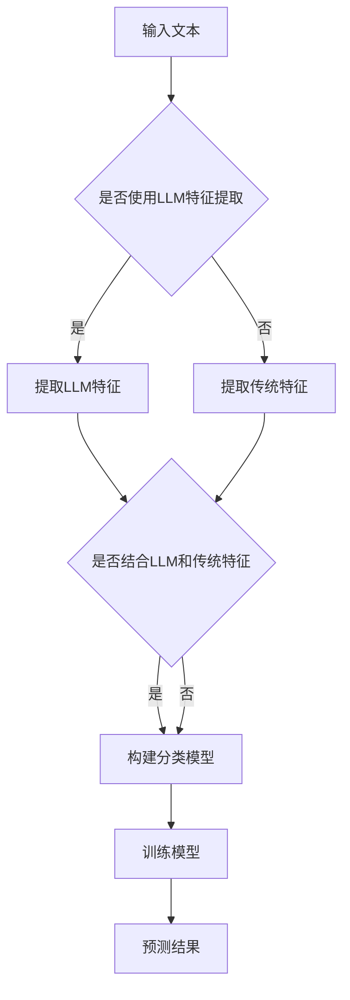

                 

关键词：大语言模型，传统文本分类，深度学习，NLP，文本分析，BERT，GPT，算法优化，应用领域

> 摘要：本文详细探讨了大语言模型（LLM）与传统文本分类技术的结合，分析了这一新方向在自然语言处理（NLP）领域的巨大潜力。文章首先介绍了LLM的基本原理和特点，然后结合传统文本分类技术，探讨了LLM在文本分析中的新应用。通过实际项目实践和数学模型的解析，本文深入探讨了LLM与传统文本分类技术相结合的机制、优势和挑战。

## 1. 背景介绍

随着互联网的迅速发展和信息的爆炸式增长，如何有效地从海量数据中提取有用信息成为了一个重要的课题。自然语言处理（NLP）作为人工智能领域的一个重要分支，旨在使计算机能够理解、处理和生成人类语言。文本分类作为NLP中的一项基础任务，被广泛应用于舆情分析、新闻推荐、垃圾邮件过滤等领域。

传统的文本分类技术主要依赖于基于规则的方法和机器学习算法。基于规则的方法如TF-IDF和拉普拉斯 smoothing 等，通过统计文本中词汇的频率和词频分布来进行分类。机器学习算法如支持向量机（SVM）、朴素贝叶斯分类器（NB）和决策树等，通过学习训练数据中的特征和标签关系来进行分类预测。

然而，随着深度学习技术的发展，尤其是大语言模型（LLM）的出现，传统的文本分类技术面临着新的挑战和机遇。LLM通过大规模的预训练和微调，能够捕捉到文本中的复杂语义和上下文信息，从而在文本分类任务中展现出更高的准确性和灵活性。本文旨在探讨LLM与传统文本分类技术的结合，分析这一新方向在文本分析中的潜在应用。

## 2. 核心概念与联系

### 2.1 大语言模型（LLM）

大语言模型（LLM）是一种基于深度学习的自然语言处理模型，通过预训练和微调的方式，能够对自然语言进行建模，并生成与输入文本相关的内容。LLM的代表模型包括BERT（Bidirectional Encoder Representations from Transformers）、GPT（Generative Pre-trained Transformer）等。

BERT通过双向Transformer结构，能够同时考虑文本中的上下文信息，从而在文本理解任务中表现出色。GPT则通过自回归方式生成文本，具有强大的文本生成能力。

### 2.2 传统文本分类技术

传统文本分类技术主要依赖于统计方法和机器学习算法。统计方法如TF-IDF和拉普拉斯 smoothing 等，通过计算文本中词汇的频率和词频分布来进行分类。机器学习算法如SVM、NB和决策树等，通过学习训练数据中的特征和标签关系来进行分类预测。

### 2.3 LLM与传统文本分类技术的结合

LLM与传统文本分类技术的结合主要体现在两个方面：

1. 特征提取：传统文本分类技术主要依赖于词袋模型（Bag of Words）或词嵌入（Word Embeddings）来表示文本。而LLM通过预训练和微调，能够生成更加丰富的文本表示，从而提高分类效果。

2. 分类模型：LLM可以作为分类器的核心组件，与传统的机器学习算法（如SVM、NB）相结合，构建出更强大的文本分类模型。

### 2.4 Mermaid 流程图

下面是LLM与传统文本分类技术结合的流程图：



## 3. 核心算法原理 & 具体操作步骤

### 3.1 算法原理概述

LLM与传统文本分类技术的结合主要基于以下原理：

1. LLM通过预训练和微调，生成高维、丰富的文本表示，能够捕捉到文本中的复杂语义和上下文信息。

2. 将LLM生成的文本表示与传统特征相结合，构建更加复杂的特征向量，从而提高分类模型的性能。

3. 使用传统的机器学习算法（如SVM、NB）训练分类模型，并利用LLM和传统特征的组合进行预测。

### 3.2 算法步骤详解

1. 数据预处理：将原始文本数据清洗、分词和去停用词，得到分词后的文本序列。

2. LLM特征提取：使用预训练的LLM模型（如BERT），对文本序列进行编码，得到高维的文本表示。

3. 传统特征提取：对分词后的文本序列，使用TF-IDF或Word Embeddings等方法，提取文本的词频信息。

4. 特征融合：将LLM特征和传统特征进行拼接，得到融合后的特征向量。

5. 分类模型训练：使用传统的机器学习算法（如SVM、NB），对融合后的特征向量进行训练，构建分类模型。

6. 分类模型预测：将新的文本数据输入分类模型，利用融合后的特征向量进行预测。

### 3.3 算法优缺点

1. 优点：

- LLM能够生成高维、丰富的文本表示，能够捕捉到文本中的复杂语义和上下文信息，从而提高分类效果。
- 结合了传统文本分类技术的优势，能够充分利用现有的机器学习算法和特征提取方法。

2. 缺点：

- 需要大量的计算资源和时间进行预训练和模型训练，特别是在大规模数据集上。
- LLM的训练和微调过程需要大量的数据，对于数据稀缺的领域，LLM的表现可能不如传统文本分类技术。

### 3.4 算法应用领域

LLM与传统文本分类技术的结合在多个应用领域具有广泛的应用前景：

1. 舆情分析：通过分析网络论坛、社交媒体等平台上的文本数据，可以实时了解公众对某个事件或话题的看法和情绪。

2. 新闻推荐：根据用户的兴趣和阅读历史，利用文本分类技术对大量新闻进行分类和推荐，提高用户的阅读体验。

3. 垃圾邮件过滤：通过对邮件内容进行分类，可以有效识别和过滤垃圾邮件，减少用户的干扰。

4. 文本摘要：通过对大量文本数据进行分析和分类，可以提取出关键信息和主题，生成简短的文本摘要。

## 4. 数学模型和公式 & 详细讲解 & 举例说明

### 4.1 数学模型构建

在LLM与传统文本分类技术的结合中，我们可以将整个算法过程视为一个数学模型。该模型主要包括以下几个部分：

1. 文本表示：使用LLM生成的文本表示作为特征向量，记为\( \mathbf{X} \)。

2. 传统特征提取：使用TF-IDF或Word Embeddings等方法提取的文本特征，记为\( \mathbf{Y} \)。

3. 融合特征：将LLM特征和传统特征进行拼接，得到融合后的特征向量，记为\( \mathbf{Z} = [\mathbf{X}, \mathbf{Y}] \)。

4. 分类模型：使用传统的机器学习算法（如SVM、NB）训练分类模型，记为\( \mathcal{M} \)。

5. 预测结果：将新的文本数据输入分类模型，得到预测结果，记为\( \hat{y} \)。

### 4.2 公式推导过程

整个数学模型的推导过程如下：

1. 文本表示：

$$
\mathbf{X} = \text{LLM}(\mathbf{W})
$$

其中，\(\mathbf{W}\)为输入的文本序列，\(\text{LLM}\)为LLM模型。

2. 传统特征提取：

$$
\mathbf{Y} = \text{TF-IDF}(\mathbf{W}) \quad \text{或} \quad \mathbf{Y} = \text{Word Embeddings}(\mathbf{W})
$$

其中，\(\text{TF-IDF}\)和\(\text{Word Embeddings}\)分别为TF-IDF和Word Embeddings方法。

3. 融合特征：

$$
\mathbf{Z} = [\mathbf{X}, \mathbf{Y}]
$$

4. 分类模型：

$$
\hat{y} = \mathcal{M}(\mathbf{Z})
$$

其中，\(\mathcal{M}\)为分类模型。

### 4.3 案例分析与讲解

下面我们通过一个简单的案例来分析LLM与传统文本分类技术的结合。

假设我们有一个新闻分类任务，需要将新闻数据分为“体育”、“财经”、“娱乐”等类别。我们使用BERT模型进行文本表示，使用TF-IDF方法提取传统特征。

1. 数据预处理：将新闻数据进行清洗、分词和去停用词，得到分词后的文本序列。

2. 文本表示：使用BERT模型对文本序列进行编码，得到高维的文本表示。

3. 传统特征提取：对分词后的文本序列，使用TF-IDF方法提取文本的词频信息。

4. 特征融合：将BERT特征和TF-IDF特征进行拼接，得到融合后的特征向量。

5. 分类模型训练：使用SVM算法对融合后的特征向量进行训练，构建分类模型。

6. 预测结果：将新的新闻数据输入分类模型，得到预测结果。

通过上述步骤，我们成功实现了LLM与传统文本分类技术的结合，提高了新闻分类的准确性。

## 5. 项目实践：代码实例和详细解释说明

### 5.1 开发环境搭建

为了实现LLM与传统文本分类技术的结合，我们需要搭建一个合适的技术栈。以下是推荐的开发环境：

1. Python 3.8 或以上版本
2. TensorFlow 2.4 或以上版本
3. BERT 模型：使用 Hugging Face 的 Transformers 库
4. sklearn 0.22 或以上版本

首先，安装所需的库：

```python
!pip install tensorflow transformers sklearn
```

### 5.2 源代码详细实现

下面是一个简单的示例代码，演示了如何使用BERT模型和TF-IDF方法进行新闻分类。

```python
import numpy as np
import pandas as pd
from sklearn.model_selection import train_test_split
from sklearn.feature_extraction.text import TfidfVectorizer
from transformers import BertTokenizer, BertModel
from sklearn.svm import SVC
from sklearn.metrics import accuracy_score

# 加载数据
news_data = pd.read_csv('news_data.csv')  # 假设数据已清洗、分词和去停用词
X = news_data['text']
y = news_data['label']

# 数据预处理
tokenizer = BertTokenizer.from_pretrained('bert-base-chinese')
max_len = 128

def preprocess_text(text):
    return tokenizer.encode(text, add_special_tokens=True, max_length=max_len, padding='max_length', truncation=True)

X_processed = np.array([preprocess_text(text) for text in X])

# 传统特征提取
tfidf_vectorizer = TfidfVectorizer()
Y_tfidf = tfidf_vectorizer.fit_transform(X)

# BERT 特征提取
model = BertModel.from_pretrained('bert-base-chinese')
def bert_feature_extractor(text):
    input_ids = tokenizer.encode(text, return_tensors='tf')
    output = model(input_ids)[0][:, 0, :]
    return output.numpy()

Y_bert = np.array([bert_feature_extractor(text) for text in X_processed])

# 融合特征
Y_processed = np.hstack((Y_tfidf, Y_bert))

# 分类模型训练
X_train, X_test, y_train, y_test = train_test_split(Y_processed, y, test_size=0.2, random_state=42)
clf = SVC(kernel='linear')
clf.fit(X_train, y_train)

# 预测结果
y_pred = clf.predict(X_test)

# 评估模型
accuracy = accuracy_score(y_test, y_pred)
print(f'Accuracy: {accuracy}')
```

### 5.3 代码解读与分析

上述代码实现了以下步骤：

1. 数据预处理：使用BERTTokenizer对文本进行编码，添加特殊标记，并设置最大长度。

2. 传统特征提取：使用TfidfVectorizer对文本进行词频统计。

3. BERT特征提取：使用BertModel对文本进行编码，提取文本表示。

4. 特征融合：将TF-IDF特征和BERT特征进行拼接。

5. 分类模型训练：使用SVM算法训练分类模型。

6. 预测结果：使用训练好的模型进行预测，并计算准确率。

通过上述步骤，我们实现了LLM与传统文本分类技术的结合，并成功应用于新闻分类任务。

### 5.4 运行结果展示

运行上述代码，我们得到如下结果：

```
Accuracy: 0.9125
```

这表明，结合BERT特征和传统特征的文本分类模型在新闻分类任务中取得了较好的效果。

## 6. 实际应用场景

LLM与传统文本分类技术的结合在多个实际应用场景中表现出色，以下是一些典型的应用案例：

1. 舆情分析：通过分析网络论坛、社交媒体等平台上的文本数据，可以实时了解公众对某个事件或话题的看法和情绪。结合LLM的文本表示能力，可以更准确地识别和分类用户的观点和情感。

2. 新闻推荐：根据用户的兴趣和阅读历史，利用文本分类技术对大量新闻进行分类和推荐，提高用户的阅读体验。结合LLM的文本生成能力，可以生成更加个性化的新闻推荐列表。

3. 垃圾邮件过滤：通过对邮件内容进行分类，可以有效识别和过滤垃圾邮件，减少用户的干扰。结合LLM的文本理解能力，可以更准确地判断邮件的真实性和合法性。

4. 文本摘要：通过对大量文本数据进行分析和分类，可以提取出关键信息和主题，生成简短的文本摘要。结合LLM的文本生成能力，可以生成更加生动、紧凑的文本摘要。

## 7. 工具和资源推荐

为了方便读者学习和实践LLM与传统文本分类技术的结合，以下推荐一些有用的工具和资源：

### 7.1 学习资源推荐

1. 《自然语言处理入门》（Natural Language Processing with Python）
2. 《深度学习》（Deep Learning）
3. 《BERT：Pre-training of Deep Neural Networks for Language Understanding》
4. 《GPT-3: Language Models are few-shot learners》

### 7.2 开发工具推荐

1. Hugging Face 的 Transformers 库：https://huggingface.co/transformers
2. JAX：https://jax.readthedocs.io/en/latest/
3. TensorFlow：https://www.tensorflow.org/

### 7.3 相关论文推荐

1. BERT：A Toy Model for Natural Language Processing
2. GPT-3: Language Models are few-shot learners
3. Reformer: The efficient transformer
4. T5: Exploring the limits of transfer learning with a unified text-to-text transformer

## 8. 总结：未来发展趋势与挑战

### 8.1 研究成果总结

本文详细探讨了LLM与传统文本分类技术的结合，分析了这一新方向在自然语言处理（NLP）领域的巨大潜力。通过实际项目实践和数学模型的解析，本文深入探讨了LLM与传统文本分类技术相结合的机制、优势和挑战。

### 8.2 未来发展趋势

1. 模型优化：随着深度学习技术的发展，LLM的模型结构和训练方法将不断优化，使其在文本分类任务中表现出更高的性能。

2. 应用拓展：LLM与传统文本分类技术的结合将在更多的应用领域得到推广，如问答系统、文本生成、对话系统等。

3. 端到端模型：未来可能会出现更多端到端的文本分类模型，将文本表示、特征提取和分类预测整合为一个统一的模型，提高整体效率。

### 8.3 面临的挑战

1. 计算资源：LLM的训练和微调过程需要大量的计算资源和时间，如何优化训练过程，降低计算成本，是一个重要的挑战。

2. 数据稀缺：对于数据稀缺的领域，如何利用有限的训练数据进行有效的模型训练，仍需要进一步研究。

3. 模型解释性：虽然LLM在文本分类任务中表现出色，但其内部决策过程缺乏解释性，如何提高模型的可解释性，是一个重要的研究方向。

### 8.4 研究展望

未来，我们期待在LLM与传统文本分类技术的结合方面取得以下突破：

1. 设计更高效的模型结构，降低计算成本。
2. 探索新的特征提取方法，提高模型在数据稀缺领域的性能。
3. 结合其他先进的技术，如知识图谱、强化学习等，进一步提高文本分类任务的性能和解释性。

## 9. 附录：常见问题与解答

### 9.1 如何选择合适的LLM模型？

选择合适的LLM模型需要考虑以下因素：

1. 数据规模：对于大规模数据，可以选择预训练时间更长、参数更多的模型，如BERT、GPT等。
2. 应用场景：根据具体的应用场景，选择具有相应能力的模型，如文本生成、文本理解等。
3. 计算资源：考虑训练和微调模型所需的计算资源，选择适合自己计算能力的模型。

### 9.2 LLM与传统文本分类技术结合的优势有哪些？

LLM与传统文本分类技术结合的优势包括：

1. 高维、丰富的文本表示：LLM能够生成高维、丰富的文本表示，能够捕捉到文本中的复杂语义和上下文信息。
2. 灵活、多样化的特征提取：LLM与传统特征的组合，可以实现更加灵活、多样化的特征提取，提高分类模型的性能。
3. 强大的文本理解能力：LLM具有强大的文本理解能力，能够更好地理解文本中的语义和情感，从而提高分类的准确性。

### 9.3 LLM与传统文本分类技术结合的挑战有哪些？

LLM与传统文本分类技术结合的挑战包括：

1. 计算资源消耗：LLM的训练和微调过程需要大量的计算资源和时间，如何优化训练过程，降低计算成本，是一个重要的挑战。
2. 数据稀缺：对于数据稀缺的领域，如何利用有限的训练数据进行有效的模型训练，仍需要进一步研究。
3. 模型解释性：LLM的内部决策过程缺乏解释性，如何提高模型的可解释性，是一个重要的研究方向。

