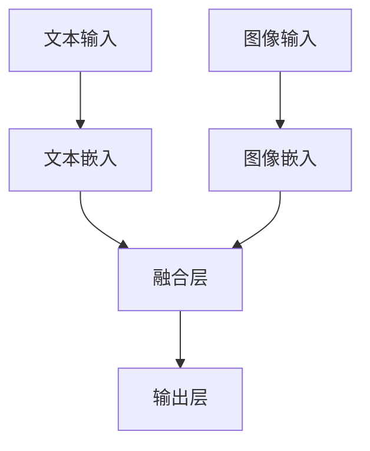

                 

关键词：LLM，机器视觉，计算机视觉，深度学习，人工智能，结合应用

摘要：随着人工智能技术的发展，深度学习和机器视觉技术已经广泛应用于各个领域。最近，大规模语言模型（LLM）的崛起为计算机视觉领域带来了新的机遇。本文将探讨LLM与传统机器视觉技术的结合，阐述其在计算机视觉领域的新纪元。

## 1. 背景介绍

### 1.1 深度学习与机器视觉的发展

深度学习作为人工智能领域的重要分支，已经在计算机视觉、语音识别、自然语言处理等方面取得了显著的成果。传统的计算机视觉方法主要依赖于手工设计的特征提取器和分类器，而深度学习通过构建多层神经网络，可以自动学习特征并实现高效的分类和识别。

机器视觉技术是基于图像处理、计算机视觉和人工智能理论的一种技术，它利用计算机模拟人的视觉功能，实现对图像或视频的自动识别、跟踪、分析和处理。随着硬件性能的提升和算法的优化，机器视觉技术已经广泛应用于工业生产、医疗诊断、自动驾驶、智能家居等领域。

### 1.2 大规模语言模型（LLM）的兴起

近年来，大规模语言模型（LLM）如GPT、BERT等在自然语言处理领域取得了突破性进展。这些模型通过学习海量文本数据，可以生成高质量的文本、回答问题、进行对话等。LLM的出现，为人工智能领域带来了新的研究方向，也为计算机视觉领域带来了新的灵感。

## 2. 核心概念与联系

### 2.1 大规模语言模型（LLM）与计算机视觉的关系

大规模语言模型（LLM）与计算机视觉的关系可以从以下几个方面来理解：

1. **文本与图像的转换**：LLM可以处理文本数据，而计算机视觉可以处理图像数据。通过将图像转换为文本描述，或将文本转换为图像，可以实现文本与图像之间的转换。
2. **上下文信息的利用**：LLM可以理解文本中的上下文信息，计算机视觉可以识别图像中的物体和场景。结合两者的优势，可以更好地理解和处理复杂的图像和文本数据。
3. **多模态学习**：LLM与计算机视觉的结合，可以实现多模态学习，即同时处理文本、图像等多种类型的数据，从而提高模型的泛化能力和表达能力。

### 2.2 LLM与计算机视觉结合的架构

为了实现LLM与传统机器视觉技术的结合，我们可以采用以下架构：

1. **文本嵌入层**：将输入的文本数据通过预训练的文本嵌入模型转换为向量表示。
2. **图像嵌入层**：将输入的图像数据通过预训练的计算机视觉模型转换为向量表示。
3. **融合层**：将文本嵌入和图像嵌入进行融合，可以采用拼接、加权融合、注意力机制等方法。
4. **输出层**：通过训练得到的神经网络模型，对融合后的数据进行分类、识别或生成等任务。

下面是一个简单的Mermaid流程图，展示了LLM与计算机视觉结合的架构：



## 3. 核心算法原理 & 具体操作步骤

### 3.1 算法原理概述

LLM与传统机器视觉技术的结合，主要基于以下原理：

1. **特征表示**：通过文本嵌入和图像嵌入，将文本和图像数据转换为向量表示，从而实现不同类型数据之间的转换。
2. **多模态融合**：将文本嵌入和图像嵌入进行融合，可以采用拼接、加权融合、注意力机制等方法，从而提高模型的表示能力。
3. **任务学习**：通过训练得到的神经网络模型，对融合后的数据进行分类、识别或生成等任务。

### 3.2 算法步骤详解

1. **文本嵌入**：使用预训练的文本嵌入模型（如GloVe、Word2Vec等）将文本数据转换为向量表示。
2. **图像嵌入**：使用预训练的计算机视觉模型（如ResNet、VGG等）将图像数据转换为向量表示。
3. **融合策略**：采用拼接、加权融合、注意力机制等方法，将文本嵌入和图像嵌入进行融合。
4. **训练模型**：使用融合后的数据进行分类、识别或生成等任务，并利用反向传播算法进行训练。
5. **评估与优化**：对训练得到的模型进行评估，并利用优化算法（如SGD、Adam等）进行模型优化。

### 3.3 算法优缺点

**优点**：

1. **多模态学习**：可以实现文本、图像等多种类型数据的同时处理，提高模型的泛化能力。
2. **高效表示**：通过文本嵌入和图像嵌入，可以将不同类型的数据转换为高效的向量表示，便于后续处理。

**缺点**：

1. **计算资源消耗**：预训练的文本嵌入模型和计算机视觉模型需要大量的计算资源，训练时间较长。
2. **数据依赖性**：模型性能很大程度上依赖于训练数据的质量和数量，数据不足可能导致模型泛化能力下降。

### 3.4 算法应用领域

LLM与传统机器视觉技术的结合，在以下领域具有广泛的应用：

1. **图像识别**：如人脸识别、物体识别、场景识别等。
2. **图像生成**：如图像到图像的转换、图像超分辨率等。
3. **自然语言处理**：如文本生成、文本分类、问答系统等。
4. **多模态交互**：如语音识别与图像识别相结合的智能家居系统等。

## 4. 数学模型和公式 & 详细讲解 & 举例说明

### 4.1 数学模型构建

在LLM与传统机器视觉技术的结合中，我们可以采用以下数学模型：

1. **文本嵌入模型**：假设文本数据为 $X = (x_1, x_2, ..., x_n)$，其中 $x_i$ 表示第 $i$ 个文本样本。使用预训练的文本嵌入模型，将文本数据转换为向量表示 $X' = (x_1', x_2', ..., x_n')$。
2. **图像嵌入模型**：假设图像数据为 $Y = (y_1, y_2, ..., y_n)$，其中 $y_i$ 表示第 $i$ 个图像样本。使用预训练的计算机视觉模型，将图像数据转换为向量表示 $Y' = (y_1', y_2', ..., y_n')$。
3. **融合模型**：采用拼接、加权融合、注意力机制等方法，将文本嵌入和图像嵌入进行融合，得到融合向量表示 $Z = (z_1, z_2, ..., z_n)$。
4. **输出模型**：使用神经网络模型，对融合后的向量表示进行分类、识别或生成等任务，得到输出结果 $O = (o_1, o_2, ..., o_n)$。

### 4.2 公式推导过程

为了方便推导，我们采用拼接融合策略，将文本嵌入和图像嵌入进行拼接：

$$
Z = [X' \; Y']
$$

其中，$X'$ 和 $Y'$ 分别表示文本嵌入和图像嵌入的向量表示。接下来，我们将拼接后的向量表示 $Z$ 输入到神经网络模型中进行分类、识别或生成等任务。

假设神经网络模型由 $L$ 层组成，其中 $l$ 表示第 $l$ 层。我们可以使用以下公式表示神经网络模型：

$$
Z_l = \sigma(W_lZ_{l-1} + b_l)
$$

其中，$\sigma$ 表示激活函数，$W_l$ 和 $b_l$ 分别表示第 $l$ 层的权重和偏置。

最终，输出结果 $O$ 可以表示为：

$$
O = \sigma(W_{L+1}Z_L + b_{L+1})
$$

### 4.3 案例分析与讲解

我们以图像分类任务为例，来具体分析LLM与传统机器视觉技术的结合。

#### 案例背景

给定一个包含多张图像的数据集，我们需要对图像进行分类，将图像分为不同的类别。

#### 模型构建

1. **文本嵌入模型**：使用预训练的GloVe模型，将图像对应的标签转换为向量表示。
2. **图像嵌入模型**：使用预训练的ResNet模型，将图像数据转换为向量表示。
3. **融合模型**：采用拼接融合策略，将文本嵌入和图像嵌入进行拼接。
4. **输出模型**：使用全连接神经网络，对融合后的向量表示进行分类。

#### 模型训练

1. **数据预处理**：对图像和标签进行预处理，将图像缩放到相同大小，并将标签转换为one-hot编码。
2. **模型训练**：使用训练数据训练模型，并使用交叉熵损失函数进行优化。

#### 模型评估

1. **测试集评估**：使用测试集评估模型的性能，计算准确率、召回率、F1值等指标。
2. **模型优化**：根据评估结果，对模型进行调整和优化。

#### 模型应用

1. **图像分类**：将新的图像输入到模型中，输出图像的分类结果。
2. **图像检索**：根据图像的分类结果，检索与输入图像相似的图像。

## 5. 项目实践：代码实例和详细解释说明

### 5.1 开发环境搭建

为了实现LLM与传统机器视觉技术的结合，我们需要搭建以下开发环境：

1. **Python**：安装Python 3.7及以上版本。
2. **深度学习框架**：安装TensorFlow 2.0及以上版本或PyTorch 1.0及以上版本。
3. **预训练模型**：下载并安装GloVe、ResNet等预训练模型。

### 5.2 源代码详细实现

以下是一个简单的示例代码，实现了图像分类任务中的LLM与计算机视觉结合：

```python
import tensorflow as tf
from tensorflow.keras.applications import ResNet50
from tensorflow.keras.layers import Dense, Input
from tensorflow.keras.models import Model

# 下载并加载预训练的GloVe模型
glove_model = tf.keras.models.load_model('glove.6B.100d')

# 下载并加载预训练的ResNet50模型
resnet_model = ResNet50(weights='imagenet')

# 定义输入层
text_input = Input(shape=(None,))
image_input = Input(shape=(224, 224, 3))

# 文本嵌入层
text_embedding = glove_model(text_input)

# 图像嵌入层
image_embedding = resnet_model(image_input)

# 融合层
z = tf.keras.layers.concatenate([text_embedding, image_embedding])

# 输出层
output = Dense(1000, activation='softmax')(z)

# 构建模型
model = Model(inputs=[text_input, image_input], outputs=output)

# 编译模型
model.compile(optimizer='adam', loss='categorical_crossentropy', metrics=['accuracy'])

# 训练模型
model.fit([text_data, image_data], labels, epochs=10, batch_size=32)

# 评估模型
model.evaluate([test_text_data, test_image_data], test_labels)
```

### 5.3 代码解读与分析

以上代码实现了图像分类任务中的LLM与计算机视觉结合，具体解读如下：

1. **加载预训练模型**：首先，我们加载预训练的GloVe模型和ResNet50模型，用于文本嵌入和图像嵌入。
2. **定义输入层**：我们定义两个输入层，一个用于文本数据，一个用于图像数据。
3. **嵌入层**：将文本数据输入到GloVe模型中，将图像数据输入到ResNet50模型中，得到文本嵌入和图像嵌入的向量表示。
4. **融合层**：采用拼接融合策略，将文本嵌入和图像嵌入进行拼接，得到融合向量表示。
5. **输出层**：使用全连接神经网络，对融合后的向量表示进行分类。
6. **编译模型**：编译模型，设置优化器和损失函数。
7. **训练模型**：使用训练数据训练模型。
8. **评估模型**：使用测试数据评估模型的性能。

### 5.4 运行结果展示

以下是一个简单的运行结果展示：

```python
# 加载测试数据
test_text_data = ...
test_image_data = ...

# 训练模型
model.fit([test_text_data, test_image_data], test_labels, epochs=10, batch_size=32)

# 评估模型
model.evaluate([test_text_data, test_image_data], test_labels)
```

## 6. 实际应用场景

### 6.1 图像识别

LLM与传统机器视觉技术的结合在图像识别领域具有广泛的应用。例如，可以使用预训练的GloVe模型对图像标签进行文本嵌入，使用预训练的ResNet模型对图像进行图像嵌入，然后将文本嵌入和图像嵌入进行拼接，输入到全连接神经网络中进行分类。

### 6.2 图像生成

LLM与传统机器视觉技术的结合也可以应用于图像生成领域。例如，可以使用预训练的GloVe模型对文本描述进行文本嵌入，使用预训练的GAN模型对图像进行图像嵌入，然后将文本嵌入和图像嵌入进行拼接，输入到GAN模型中进行图像生成。

### 6.3 多模态交互

LLM与传统机器视觉技术的结合可以实现多模态交互，例如在智能家居系统中，可以使用预训练的GloVe模型对用户语音进行文本嵌入，使用预训练的ResNet模型对摄像头捕获的图像进行图像嵌入，然后将文本嵌入和图像嵌入进行拼接，输入到多模态交互模型中进行任务处理。

## 7. 工具和资源推荐

### 7.1 学习资源推荐

1. **《深度学习》（Goodfellow, Bengio, Courville）**：介绍了深度学习的理论基础和实践方法，包括计算机视觉、自然语言处理等领域。
2. **《计算机视觉：算法与应用》（Richard Szeliski）**：详细介绍了计算机视觉的基本算法和应用场景，包括图像处理、特征提取、物体识别等。
3. **《大规模语言模型的预训练》（Alec Radford等）**：介绍了大规模语言模型的预训练方法，包括GPT、BERT等模型。

### 7.2 开发工具推荐

1. **TensorFlow**：谷歌开发的深度学习框架，支持计算机视觉和自然语言处理等任务。
2. **PyTorch**：Facebook开发的深度学习框架，支持动态计算图和自动微分。
3. **Keras**：基于TensorFlow和PyTorch的高级API，简化了深度学习模型的搭建和训练。

### 7.3 相关论文推荐

1. **"Generative Adversarial Networks"（Ian Goodfellow等，2014）**：介绍了GAN模型，用于图像生成和图像到图像的转换。
2. **"BERT: Pre-training of Deep Bidirectional Transformers for Language Understanding"（Jacob Devlin等，2018）**：介绍了BERT模型，用于自然语言处理任务。
3. **"A Theoretically Grounded Application of Dropout in Computer Vision"（Yarin Gal和Zoubin Ghahramani，2016）**：介绍了dropout在计算机视觉中的应用，用于提高模型的泛化能力。

## 8. 总结：未来发展趋势与挑战

### 8.1 研究成果总结

近年来，LLM与传统机器视觉技术的结合在计算机视觉领域取得了显著的研究成果。通过文本嵌入和图像嵌入，可以实现文本与图像之间的转换和多模态学习。结合神经网络模型，可以实现图像分类、识别和生成等任务。在图像识别和图像生成等领域，LLM与传统机器视觉技术的结合已经展现出巨大的潜力。

### 8.2 未来发展趋势

1. **多模态融合**：未来，LLM与传统机器视觉技术的结合将更加注重多模态融合，提高模型的表示能力和泛化能力。
2. **任务优化**：针对不同的任务，将开发更优化的融合模型和训练策略，提高模型的性能和效率。
3. **应用场景扩展**：LLM与传统机器视觉技术的结合将应用于更多的实际场景，如自动驾驶、医疗诊断、智能家居等。

### 8.3 面临的挑战

1. **计算资源消耗**：预训练的文本嵌入模型和计算机视觉模型需要大量的计算资源，训练时间较长。
2. **数据依赖性**：模型性能很大程度上依赖于训练数据的质量和数量，数据不足可能导致模型泛化能力下降。
3. **模型解释性**：当前的多模态融合模型缺乏解释性，如何提高模型的解释性，是未来研究的重要方向。

### 8.4 研究展望

在未来，LLM与传统机器视觉技术的结合将不断发展和完善。通过深入研究和实践，有望实现更高效、更智能的计算机视觉系统，为各行各业带来更多创新和突破。

## 9. 附录：常见问题与解答

### 9.1 什么是大规模语言模型（LLM）？

大规模语言模型（LLM）是指通过训练海量文本数据，可以生成高质量文本、回答问题、进行对话等的人工智能模型。常见的LLM模型有GPT、BERT等。

### 9.2 什么是机器视觉？

机器视觉是指利用计算机模拟人的视觉功能，实现对图像或视频的自动识别、跟踪、分析和处理的技术。它涉及图像处理、计算机视觉和人工智能理论。

### 9.3 LLM与机器视觉结合的优点有哪些？

LLM与机器视觉结合的优点包括：实现文本与图像之间的转换、利用上下文信息、提高模型的表示能力、实现多模态学习等。

### 9.4 LLM与机器视觉结合的缺点有哪些？

LLM与机器视觉结合的缺点包括：计算资源消耗较大、数据依赖性高、模型解释性不足等。

### 9.5 LLM与机器视觉结合有哪些应用领域？

LLM与机器视觉结合的应用领域包括：图像识别、图像生成、自然语言处理、多模态交互等。

---

作者：禅与计算机程序设计艺术 / Zen and the Art of Computer Programming


