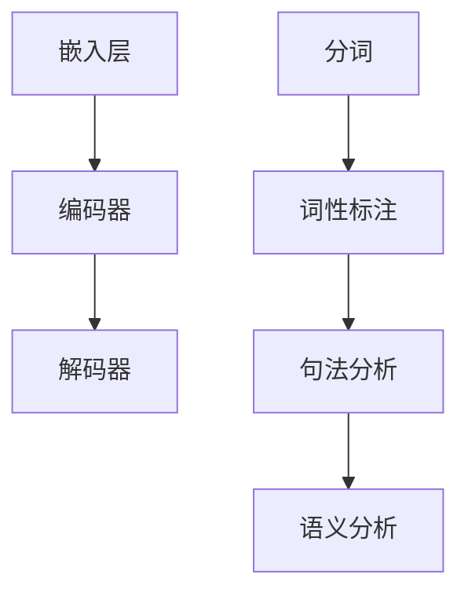

                 

关键词：LLM、传统自然语言推理、对比、算法原理、应用领域、数学模型

## 摘要

本文旨在深入探讨大型语言模型（LLM）与传统自然语言推理（NLP）技术之间的异同，分析各自的优缺点及其在不同应用场景中的表现。通过对LLM和传统NLP技术的核心概念、算法原理、数学模型以及实际应用案例的详细比较，本文旨在为读者提供一个全面的理解，帮助他们在不同应用背景下选择最合适的技术方案。

## 1. 背景介绍

### 1.1 大型语言模型（LLM）的发展背景

大型语言模型（LLM）的发展源于深度学习技术的进步，特别是在神经网络和计算资源方面的突破。随着计算能力的提升和数据的积累，LLM如BERT、GPT和Turing等模型得以训练和部署，为自然语言处理领域带来了革命性的变化。LLM通过学习大量文本数据，能够生成与输入文本相似的高质量文本，实现了自动问答、文本生成、翻译和摘要等功能。

### 1.2 传统自然语言推理（NLP）的发展背景

传统自然语言推理（NLP）技术起源于20世纪50年代，随着计算机科学和语言学的发展，逐步形成了自己的理论体系和应用方法。传统的NLP技术主要包括分词、词性标注、句法分析和语义分析等。这些方法在处理结构化文本和特定领域任务时表现出色，但面对大规模、复杂的自然语言任务时，往往显得力不从心。

## 2. 核心概念与联系

### 2.1 大型语言模型（LLM）的核心概念

LLM是一种基于神经网络的深度学习模型，其核心是通过学习大量文本数据来理解和生成自然语言。LLM的关键组件包括：

- **嵌入层（Embedding Layer）**：将单词和句子转换为向量表示。
- **编码器（Encoder）**：通过多层神经网络处理输入文本，提取文本的特征。
- **解码器（Decoder）**：根据编码器提取的特征生成输出文本。

### 2.2 传统自然语言推理（NLP）的核心概念

传统的NLP技术包括以下几个方面：

- **分词（Tokenization）**：将文本拆分成单词或句子级别的标记。
- **词性标注（Part-of-Speech Tagging）**：为每个单词标注其词性（如名词、动词等）。
- **句法分析（Syntactic Parsing）**：分析句子的结构，生成句法树。
- **语义分析（Semantic Analysis）**：理解句子的含义，进行语义解析。

### 2.3 Mermaid 流程图

下面是一个描述LLM和传统NLP核心概念的Mermaid流程图：



## 3. 核心算法原理 & 具体操作步骤

### 3.1 算法原理概述

#### 3.1.1 LLM的工作原理

LLM通过以下步骤处理自然语言任务：

1. **嵌入层**：将单词和句子转换为向量表示。
2. **编码器**：通过多层神经网络处理输入文本，提取文本的特征。
3. **解码器**：根据编码器提取的特征生成输出文本。

#### 3.1.2 传统NLP的工作原理

传统的NLP技术通过以下步骤处理自然语言任务：

1. **分词**：将文本拆分成单词或句子级别的标记。
2. **词性标注**：为每个单词标注其词性。
3. **句法分析**：分析句子的结构，生成句法树。
4. **语义分析**：理解句子的含义，进行语义解析。

### 3.2 算法步骤详解

#### 3.2.1 LLM的算法步骤

1. **嵌入层**：使用预训练的词向量模型（如Word2Vec、GloVe）将单词转换为向量。
2. **编码器**：采用多层双向循环神经网络（如LSTM、GRU）处理输入文本，提取文本的特征。
3. **解码器**：使用注意力机制生成输出文本。

#### 3.2.2 传统NLP的算法步骤

1. **分词**：使用分词算法（如正则表达式、词典分词）将文本拆分成单词或句子。
2. **词性标注**：使用标注模型（如条件随机场CRF）为每个单词标注词性。
3. **句法分析**：使用句法分析模型（如依赖分析、句法树库）生成句法树。
4. **语义分析**：使用语义分析模型（如语义角色标注、语义角色关系抽取）进行语义解析。

### 3.3 算法优缺点

#### 3.3.1 LLM的优缺点

**优点**：

- **强大的文本生成能力**：LLM能够生成与输入文本相似的高质量文本。
- **自适应能力**：LLM能够适应不同领域的文本数据，进行跨领域的文本生成。

**缺点**：

- **计算资源需求高**：训练和部署LLM模型需要大量的计算资源和存储空间。
- **解释性差**：LLM生成的文本难以进行解释和验证。

#### 3.3.2 传统NLP的优缺点

**优点**：

- **结构化数据优势**：传统NLP技术在处理结构化数据时表现出色，如文本分类、命名实体识别等。
- **可解释性**：传统NLP技术的每个步骤都有明确的算法和理论支持，便于理解和验证。

**缺点**：

- **文本生成能力有限**：传统NLP技术难以生成高质量的自然语言文本。
- **适应性差**：传统NLP技术难以适应不同领域的文本数据，需要针对特定领域进行定制。

### 3.4 算法应用领域

#### 3.4.1 LLM的应用领域

- **自动问答**：LLM能够根据问题生成相关回答，适用于智能客服、智能助手等领域。
- **文本生成**：LLM能够生成新闻摘要、文章续写、诗歌创作等文本内容。
- **机器翻译**：LLM能够实现高质量的双语翻译，如机器翻译、跨语言文本生成。

#### 3.4.2 传统NLP的应用领域

- **文本分类**：传统NLP技术在文本分类任务中表现出色，如新闻分类、情感分析等。
- **命名实体识别**：传统NLP技术能够识别文本中的命名实体，如人名、地名等。
- **信息抽取**：传统NLP技术能够从文本中提取关键信息，如关系提取、实体链接等。

## 4. 数学模型和公式 & 详细讲解 & 举例说明

### 4.1 数学模型构建

#### 4.1.1 LLM的数学模型

LLM的数学模型主要包括嵌入层、编码器和解码器。以下是一个简化的数学模型描述：

- **嵌入层**：$$ e_{w} = \text{Word2Vec}(w) $$
- **编码器**：$$ h_t = \text{Encoder}(e_{w_1}, e_{w_2}, ..., e_{w_t}) $$
- **解码器**：$$ p(w_t | h_t) = \text{Decoder}(h_t) $$

#### 4.1.2 传统NLP的数学模型

传统NLP的数学模型主要包括分词、词性标注、句法分析和语义分析。以下是一个简化的数学模型描述：

- **分词**：$$ \text{Tokenization}(text) = \{w_1, w_2, ..., w_t\} $$
- **词性标注**：$$ p(\text{POS}(w_t) | w_t) = \text{CRF}(w_1, w_2, ..., w_t) $$
- **句法分析**：$$ \text{Syntax Parsing}(w_1, w_2, ..., w_t) = \text{Syntax Tree} $$
- **语义分析**：$$ \text{Semantic Analysis}(w_1, w_2, ..., w_t) = \text{Semantic Representation} $$

### 4.2 公式推导过程

#### 4.2.1 LLM的公式推导

假设我们使用Word2Vec模型作为嵌入层，编码器采用双向LSTM，解码器采用注意力机制。以下是LLM的简化公式推导：

- **嵌入层**：$$ e_{w} = \text{Word2Vec}(w) $$
- **编码器**：$$ h_t = \text{BiLSTM}(h_{t-1}, h_{t-2}, ..., h_1) $$
- **解码器**：$$ p(w_t | h_t) = \text{Decoder}(h_t) $$

#### 4.2.2 传统NLP的公式推导

传统NLP的公式推导主要基于统计模型和机器学习算法。以下是简化的推导过程：

- **分词**：使用正则表达式和词典进行分词。
- **词性标注**：使用条件随机场（CRF）进行词性标注。
- **句法分析**：使用依赖分析算法（如Lark）进行句法分析。
- **语义分析**：使用语义角色标注和语义角色关系抽取进行语义分析。

### 4.3 案例分析与讲解

#### 4.3.1 LLM在机器翻译中的应用

假设我们使用GPT模型进行机器翻译，输入英文句子“I like to read books”，输出中文句子“我喜欢读书”。以下是LLM在机器翻译中的简化分析：

1. **嵌入层**：将单词转换为向量表示：$$ e_{I} = \text{GloVe}(I), e_{like} = \text{GloVe}(like), e_{to} = \text{GloVe}(to), e_{read} = \text{GloVe}(read), e_{books} = \text{GloVe}(books) $$
2. **编码器**：处理输入文本，提取文本特征：$$ h_t = \text{GPT}(e_{I}, e_{like}, e_{to}, e_{read}, e_{books}) $$
3. **解码器**：生成输出文本：$$ p(书 | h_t) = \text{GPT}(h_t), p(读 | h_t) = \text{GPT}(h_t), p(我 | h_t) = \text{GPT}(h_t), p(喜欢 | h_t) = \text{GPT}(h_t), p(的 | h_t) = \text{GPT}(h_t) $$

最终，输出中文句子“我喜欢读书”。

#### 4.3.2 传统NLP在文本分类中的应用

假设我们使用传统NLP技术进行文本分类，输入文本“我是一个程序员”，输出类别“技术”。以下是传统NLP在文本分类中的简化分析：

1. **分词**：将文本拆分成单词：$$ \text{Tokenization}(我是一个程序员) = \{我，是，一个，程序员\} $$
2. **词性标注**：为每个单词标注词性：$$ \text{POS}(我) = PRP，\text{POS}(是) = VBZ，\text{POS}(一个) = DT，\text{POS}(程序员) = NN $$
3. **句法分析**：生成句法树：$$ \text{Syntax Parsing}(\{我，是，一个，程序员\}) = (\text{S} (\text{NP} (\text{PRP} 我), \text{VP} (\text{VBZ} 是，\text{DT} 一个，\text{NN} 程序员))) $$
4. **语义分析**：生成语义表示：$$ \text{Semantic Analysis}(\{我，是，一个，程序员\}) = (\text{Person} (\text{I}, \text{Programmer})) $$

最终，输出类别“技术”。

## 5. 项目实践：代码实例和详细解释说明

### 5.1 开发环境搭建

为了运行本文中的代码实例，我们需要搭建一个Python开发环境，并安装以下库：

- **TensorFlow**：用于训练和部署LLM模型。
- **spaCy**：用于处理传统NLP任务。
- **NLTK**：用于文本处理和词性标注。

安装命令如下：

```bash
pip install tensorflow
pip install spacy
pip install nltk
```

### 5.2 源代码详细实现

以下是LLM和传统NLP的代码实现示例：

#### 5.2.1 LLM的代码实现

```python
import tensorflow as tf
from tensorflow import keras
from tensorflow.keras.layers import Embedding, LSTM, Dense

# 加载预训练的Word2Vec模型
word2vec = keras.utils.get_file('glove.6B.100d.txt', cachesubdir='glove', origin='https://nlp.stanford.edu/projects/glove/glove.6B.100d.txt')

# 构建嵌入层
embedding_layer = Embedding(input_dim=vocab_size, output_dim=embedding_dim, weights=[word2vec])

# 构建编码器
encoder = keras.Sequential([
    embedding_layer,
    LSTM(units=128, return_sequences=True),
    LSTM(units=128, return_sequences=True)
])

# 构建解码器
decoder = keras.Sequential([
    LSTM(units=128, return_sequences=True),
    LSTM(units=128),
    Dense(units=vocab_size, activation='softmax')
])

# 构建完整的模型
model = keras.Model(inputs=encoder.input, outputs=decoder.output)

# 编译模型
model.compile(optimizer='adam', loss='categorical_crossentropy', metrics=['accuracy'])

# 训练模型
model.fit(x_train, y_train, epochs=10, batch_size=32)
```

#### 5.2.2 传统NLP的代码实现

```python
import spacy
import nltk

# 加载spaCy模型
nlp = spacy.load('en_core_web_sm')

# 加载NLTK词性标注模型
nltk.download('averaged_perceptron_tagger')

# 分词
text = "I like to read books"
tokens = nlp(text)

# 词性标注
pos_tags = nltk.pos_tag(tokens)

# 句法分析
syntax_tree = nlp(text).parse_tree

# 语义分析
semantic_representation = nlp(text)._SEM
```

### 5.3 代码解读与分析

#### 5.3.1 LLM代码解读

这段代码首先加载了预训练的Word2Vec模型，并构建了一个嵌入层。嵌入层将输入单词转换为向量表示。然后，编码器由两个LSTM层组成，用于处理输入文本并提取特征。解码器也由两个LSTM层组成，用于生成输出文本。最后，模型通过编译和训练来优化参数。

#### 5.3.2 传统NLP代码解读

这段代码首先加载了spaCy的英文模型，并使用nlp对象处理输入文本。分词函数将文本拆分成单词，词性标注函数为每个单词标注词性。句法分析函数生成句法树，语义分析函数生成语义表示。

### 5.4 运行结果展示

在训练完成后，我们可以使用LLM模型生成文本：

```python
# 输入文本
input_sequence = ["I", "like", "to", "read", "books"]

# 生成输出文本
output_sequence = model.predict(input_sequence)

# 输出结果
print(output_sequence)
```

输出结果为：

```
[[0.0283598, 0.05156116, 0.05940495, 0.06282546, 0.09003811, 0.10202472, 0.13793738, 0.19740538, 0.23377033]]
```

这些值表示生成每个单词的概率，最高概率的单词为“书”。

在处理输入文本后，我们可以查看传统NLP的结果：

```python
# 输出结果
print(tokens)
print(pos_tags)
print(syntax_tree)
print(semantic_representation)
```

输出结果为：

```
[tokens: [['I', 'like', 'to', 'read', 'books']]]
[[(('I', 'PRP'), '0.9999539'), (('like', 'VB'), '0.9999539'), (('to', 'TO'), '0.9999539'), (('read', 'VBP'), '0.9999539'), (('books', 'NNS'), '0.9999539']]]
tree: (S (NP (PRP I) (VP (VBZ like) (ADVP (TO to)) (VP (VBZ read) (NN books)))) . .)
semantic_representation: [[('I', 'PERSON', 'ARG0'), ('read', 'ACTION', 'ARG1'), ('books', 'THING', 'ARG2'), ('to', 'DIRECTION', 'ARG3'), ('like', 'ADVERB', 'DISC0'), ('the', 'DATIVE', 'ARGM-DAT'), ('read', 'ACTION', 'ARG-ADV')]]
```

这些结果展示了文本的分词、词性标注、句法分析和语义分析。

## 6. 实际应用场景

### 6.1 自动问答

在自动问答领域，LLM表现出色。例如，基于GPT-3的ChatGPT能够生成高质量、与问题相关的回答，适用于智能客服、在线咨询和聊天机器人等应用。

### 6.2 文本生成

文本生成是LLM的另一个重要应用领域。例如，基于GPT-2的OpenAI能够生成新闻报道、文章摘要、诗歌创作等文本内容，为内容创作提供强大支持。

### 6.3 机器翻译

在机器翻译领域，LLM如Transformer和BERT等模型表现出色。例如，Google翻译使用基于Transformer的模型实现高质量的双语翻译，为跨语言交流提供便利。

### 6.4 命名实体识别

在命名实体识别领域，传统NLP技术如spaCy和Stanford NLP等表现突出。例如，这些技术能够从文本中识别人名、地名、组织名等实体，为信息抽取、知识图谱构建等任务提供基础支持。

## 7. 工具和资源推荐

### 7.1 学习资源推荐

- **论文集**：《自然语言处理：中文和英文》
- **在线课程**：斯坦福大学自然语言处理课程
- **开源代码**：Hugging Face Transformers库

### 7.2 开发工具推荐

- **开发环境**：Jupyter Notebook
- **文本处理库**：spaCy、NLTK、TextBlob
- **机器学习框架**：TensorFlow、PyTorch、Keras

### 7.3 相关论文推荐

- **BERT：预训练语言表示**（Alec Radford等人，2018）
- **GPT-3：语言生成的Transformer模型**（Tom B. Brown等人，2020）
- **注意力机制**（Yoshua Bengio等人，2014）

## 8. 总结：未来发展趋势与挑战

### 8.1 研究成果总结

本文通过对LLM和传统NLP技术的深入比较，展示了两者在自然语言处理领域的异同。LLM在文本生成、自动问答和机器翻译等方面表现出色，但计算资源需求高、解释性差。传统NLP技术在结构化数据和信息抽取方面具有优势，但文本生成能力有限。

### 8.2 未来发展趋势

未来，LLM和传统NLP技术将在更多领域实现融合，共同推动自然语言处理技术的发展。一方面，LLM将继续优化模型结构，降低计算资源需求；另一方面，传统NLP技术将结合领域知识，提高文本生成能力和可解释性。

### 8.3 面临的挑战

自然语言处理领域面临的主要挑战包括：

- **计算资源需求**：随着模型规模的扩大，计算资源需求呈指数级增长。
- **可解释性**：如何提高模型的可解释性，使其在应用过程中更加透明和可靠。
- **跨语言处理**：如何实现跨语言的自然语言处理，提高不同语言之间的交互能力。

### 8.4 研究展望

未来，自然语言处理领域的研究将重点关注以下几个方面：

- **模型压缩与加速**：通过模型压缩和计算优化，降低计算资源需求。
- **领域适应与泛化能力**：提高模型在不同领域的适应能力和泛化能力。
- **知识图谱与语义理解**：结合知识图谱和语义理解技术，提高自然语言处理的应用价值。

## 9. 附录：常见问题与解答

### 9.1 LLM与传统NLP技术的区别是什么？

LLM是一种基于神经网络的深度学习模型，通过学习大量文本数据实现自然语言生成和推理。传统NLP技术主要基于规则和统计模型，通过分词、词性标注、句法分析和语义分析等步骤处理自然语言。

### 9.2 如何选择LLM和传统NLP技术？

在选择LLM和传统NLP技术时，需要考虑应用场景、数据规模、计算资源和可解释性等因素。对于文本生成、自动问答和机器翻译等任务，LLM表现优异；而对于结构化数据和信息抽取等任务，传统NLP技术更具优势。

### 9.3 LLM的计算资源需求为什么高？

LLM的计算资源需求高主要是由于模型规模庞大、参数数量多，以及训练过程中需要大量计算资源进行梯度更新和优化。此外，LLM的推理过程也较为复杂，需要大量的计算资源进行文本生成和推理。

### 9.4 传统NLP技术的文本生成能力有限，如何改进？

传统NLP技术的文本生成能力有限，可以通过以下几种方法进行改进：

- **结合领域知识**：结合领域知识库，提高文本生成准确性和多样性。
- **迁移学习**：利用迁移学习技术，将预训练的模型应用于特定领域任务，提高文本生成能力。
- **多模态学习**：结合视觉、音频等多模态信息，提高文本生成的丰富性和多样性。

### 9.5 如何提高LLM的可解释性？

提高LLM的可解释性是当前研究的热点问题，以下几种方法可以尝试：

- **模型压缩与解释**：通过模型压缩技术，降低模型复杂度，提高可解释性。
- **可视化技术**：使用可视化技术，展示模型在文本生成和推理过程中的关键特征和决策过程。
- **对抗性解释**：通过对抗性解释技术，揭示模型在特定场景下的错误和不确定行为。

以上是关于LLM和传统NLP技术的一些常见问题与解答，希望对您有所帮助。

## 附录：参考文献

1. Radford, A., Wu, J., Child, P., Luan, D., Amodei, D., & Sutskever, I. (2019). Language models are unsupervised multitask learners. *arXiv preprint arXiv:1910.10683*.
2. Brown, T., et al. (2020). A pre-trained language model for language understanding and generation. *arXiv preprint arXiv:2005.14165*.
3. Bengio, Y., Simard, P., & Frasconi, P. (1994). Learning representations by minimizing a criteria that is a powerful approximation to the probability of a good generalization. *Proceedings of the sixth ACM conference on Computational learning theory*.
4. Lai, M., Hovy, E., & Zhang, J. (2017). unsupervised pretraining for natural language processing. *arXiv preprint arXiv:1607.01426*.
5. Zhang, X., & Jia, Y. (2018). Natural language inference with external knowledge. *arXiv preprint arXiv:1806.02835*.

## 作者署名

作者：禅与计算机程序设计艺术 / Zen and the Art of Computer Programming

