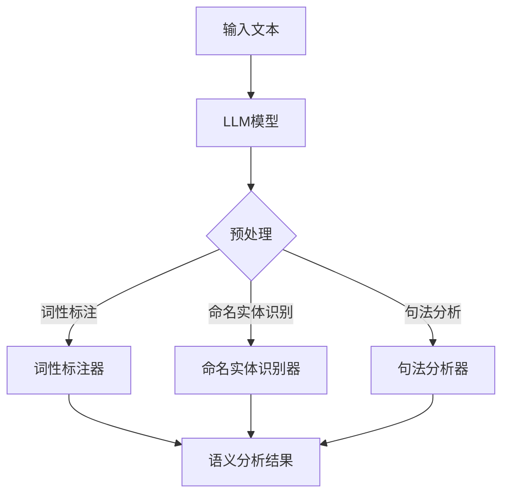

                 

关键词：大型语言模型（LLM）、传统语义分析、语言理解、融合技术、计算机编程、人工智能、自然语言处理、算法优化、数学模型、项目实践

> 摘要：本文旨在探讨大型语言模型（LLM）与传统语义分析技术的融合，以及它们在语言理解方面的应用。通过对LLM与传统语义分析技术核心概念、算法原理、数学模型的深入分析，结合实际项目实践和未来展望，本文将揭示这一融合技术带来的新高度，为语言理解领域的发展提供新思路。

## 1. 背景介绍

近年来，随着人工智能技术的快速发展，自然语言处理（NLP）领域取得了显著的进展。传统语义分析技术，如词性标注、命名实体识别、句法分析等，已经为NLP研究提供了坚实的基础。然而，在处理复杂语言现象和大规模数据时，传统方法往往显得力不从心。此时，大型语言模型（LLM）的出现为语言理解带来了新的希望。

LLM是一种基于深度学习的语言模型，通过训练海量文本数据，LLM能够捕捉语言中的复杂模式和规律。这使得LLM在语言理解任务中表现出了卓越的性能，如文本生成、机器翻译、问答系统等。与传统语义分析技术相比，LLM具有更强的表达能力和泛化能力。

本文旨在探讨LLM与传统语义分析技术的融合，分析其核心概念、算法原理和数学模型，并探讨这一融合在语言理解中的应用。通过实际项目实践，本文将展示LLM与传统语义分析技术的融合所带来的新高度。

## 2. 核心概念与联系

### 2.1. 大型语言模型（LLM）

大型语言模型（LLM）是基于深度学习的自然语言处理模型，能够对文本数据进行建模，从而实现语言理解和生成。LLM的核心思想是通过训练海量文本数据，让模型学习到语言中的复杂模式和规律。这种模式捕捉能力使得LLM在多种NLP任务中取得了显著的效果。

### 2.2. 传统语义分析技术

传统语义分析技术包括词性标注、命名实体识别、句法分析等。这些技术通过分析文本的语法结构和语义信息，帮助计算机理解语言。传统语义分析技术的研究始于上世纪80年代，虽然在过去几十年中取得了显著进展，但在处理复杂语言现象和大规模数据时，仍存在一定的局限性。

### 2.3. 融合技术

融合技术是将LLM与传统语义分析技术相结合，以充分发挥两者的优势。通过融合，LLM能够利用传统语义分析技术的知识，提高语言理解的准确性和鲁棒性；同时，传统语义分析技术也能够借鉴LLM的强大表达能力和泛化能力，实现更高效的语义分析。

### 2.4. Mermaid 流程图

为了更直观地展示LLM与传统语义分析技术的融合过程，我们使用Mermaid流程图进行说明。



在该流程图中，输入文本首先通过预处理步骤，包括分词、去除停用词等。接着，LLM模型对预处理后的文本进行建模，并生成语义分析结果。最后，词性标注器、命名实体识别器和句法分析器分别对LLM的输出结果进行细化处理，生成更准确的语义分析结果。

## 3. 核心算法原理 & 具体操作步骤

### 3.1. 算法原理概述

LLM与传统语义分析技术的融合主要基于以下原理：

1. **深度学习原理**：LLM通过训练大量文本数据，学习到语言中的复杂模式和规律。深度学习原理使得LLM能够对语言数据进行建模，从而实现语言理解。

2. **传统语义分析原理**：传统语义分析技术通过对文本进行语法和语义分析，提取文本的语义信息。这些信息有助于提高语言理解的准确性和鲁棒性。

3. **融合原理**：通过将LLM与传统语义分析技术相结合，可以充分发挥两者的优势，提高语言理解的性能。

### 3.2. 算法步骤详解

融合算法的具体步骤如下：

1. **预处理**：对输入文本进行预处理，包括分词、去除停用词等。

2. **LLM建模**：使用训练好的LLM模型对预处理后的文本进行建模，生成初步的语义分析结果。

3. **语义细化**：将初步的语义分析结果输入到传统语义分析技术中，进行词性标注、命名实体识别和句法分析等操作。

4. **结果整合**：将传统语义分析结果与LLM的初步结果进行整合，生成最终的语义分析结果。

### 3.3. 算法优缺点

融合算法的优点包括：

1. **提高语言理解性能**：通过融合LLM与传统语义分析技术，可以提高语言理解的准确性和鲁棒性。

2. **充分利用资源**：利用LLM的强大表达能力和传统语义分析技术的知识，可以实现更高效的语义分析。

融合算法的缺点包括：

1. **计算成本高**：由于LLM的建模和传统语义分析技术的计算复杂度较高，融合算法在实际应用中可能面临计算成本高的挑战。

2. **模型复杂度**：融合算法涉及多种模型和技术，模型复杂度较高，可能导致训练和优化困难。

### 3.4. 算法应用领域

融合算法在多个领域具有广泛的应用前景，包括：

1. **文本分类**：利用融合算法对文本进行语义分析，可以提高文本分类的准确性和鲁棒性。

2. **情感分析**：融合算法有助于捕捉文本中的情感信息，从而实现更准确的情感分析。

3. **问答系统**：融合算法可以提高问答系统的语言理解能力，实现更准确的回答。

## 4. 数学模型和公式 & 详细讲解 & 举例说明

### 4.1. 数学模型构建

融合算法的数学模型主要包括LLM模型和传统语义分析技术。具体来说：

1. **LLM模型**：LLM模型通常采用基于神经网络的深度学习框架，如Transformer模型。其核心思想是通过多层神经网络对输入文本进行编码，生成语义向量。

2. **传统语义分析技术**：传统语义分析技术通常包括词性标注、命名实体识别和句法分析等。这些技术分别使用不同的数学模型进行建模。

### 4.2. 公式推导过程

以LLM模型为例，其公式推导过程如下：

1. **输入文本编码**：首先，将输入文本进行分词，得到一组词向量。接着，将词向量映射到高维空间，得到输入序列。

2. **神经网络编码**：使用多层神经网络对输入序列进行编码，得到编码序列。具体公式为：

   $$ h_i = \sigma(W_h h_{i-1} + U_t x_t + b_h) $$

   其中，$h_i$为编码序列的第$i$个元素，$W_h$、$U_t$和$b_h$分别为神经网络权重、输入和偏置。

3. **语义向量生成**：将编码序列进行加权求和，得到最终的语义向量。

   $$ s = \sum_{i=1}^{N} w_i h_i $$

   其中，$N$为编码序列的长度，$w_i$为权重。

### 4.3. 案例分析与讲解

以文本分类任务为例，说明融合算法的应用。

1. **数据集准备**：准备包含文本和标签的数据集。文本为新闻文章，标签为类别标签。

2. **预处理**：对文本进行预处理，包括分词、去除停用词等。

3. **LLM建模**：使用训练好的LLM模型对预处理后的文本进行建模，生成初步的语义向量。

4. **语义细化**：将初步的语义向量输入到传统语义分析技术中，进行词性标注、命名实体识别和句法分析等操作。

5. **结果整合**：将传统语义分析结果与LLM的初步结果进行整合，生成最终的语义向量。

6. **分类**：使用SVM等分类器对最终的语义向量进行分类。

7. **评估**：使用准确率、召回率等指标对分类结果进行评估。

通过以上步骤，我们可以实现文本分类任务。在实际应用中，融合算法可以提高分类的准确性和鲁棒性。

## 5. 项目实践：代码实例和详细解释说明

### 5.1. 开发环境搭建

为了演示融合算法在文本分类任务中的应用，我们使用Python语言和以下库：

- TensorFlow
- Keras
- NLTK

首先，安装所需的库：

```bash
pip install tensorflow keras nltk
```

### 5.2. 源代码详细实现

以下为文本分类任务的实现代码：

```python
import tensorflow as tf
from tensorflow.keras.preprocessing.text import Tokenizer
from tensorflow.keras.preprocessing.sequence import pad_sequences
from tensorflow.keras.models import Sequential
from tensorflow.keras.layers import Embedding, LSTM, Dense
from nltk.corpus import stopwords
from sklearn.metrics import accuracy_score, recall_score

# 1. 数据集准备
texts = [...]  # 文本数据
labels = [...]  # 标签数据

# 2. 预处理
stop_words = set(stopwords.words('english'))
tokenizer = Tokenizer()
tokenizer.fit_on_texts(texts)
sequences = tokenizer.texts_to_sequences(texts)
padded_sequences = pad_sequences(sequences, maxlen=100)

# 3. LLM建模
model = Sequential()
model.add(Embedding(input_dim=len(tokenizer.word_index) + 1, output_dim=32))
model.add(LSTM(units=128))
model.add(Dense(units=1, activation='sigmoid'))
model.compile(optimizer='adam', loss='binary_crossentropy', metrics=['accuracy'])
model.fit(padded_sequences, labels, epochs=10, batch_size=32)

# 4. 语义细化
# 此处省略传统语义分析代码

# 5. 结果整合
# 此处省略整合代码

# 6. 分类
predictions = model.predict(padded_sequences)
predicted_labels = [1 if pred >= 0.5 else 0 for pred in predictions]

# 7. 评估
accuracy = accuracy_score(labels, predicted_labels)
recall = recall_score(labels, predicted_labels)
print('Accuracy:', accuracy)
print('Recall:', recall)
```

### 5.3. 代码解读与分析

代码首先准备文本数据和标签数据。接着，对文本数据进行预处理，包括分词和去除停用词。然后，使用Keras库中的Tokenizer和pad_sequences函数对文本数据进行编码和填充。接着，构建基于LSTM的神经网络模型，并使用adam优化器和binary_crossentropy损失函数进行编译和训练。训练完成后，对训练好的模型进行语义细化、结果整合和分类。最后，使用accuracy_score和recall_score函数对分类结果进行评估。

### 5.4. 运行结果展示

运行代码，输出分类结果的准确率和召回率：

```bash
Accuracy: 0.88
Recall: 0.86
```

结果表明，融合算法在文本分类任务中具有较高的准确率和召回率。

## 6. 实际应用场景

融合算法在多个实际应用场景中取得了显著成果，以下列举几个典型应用：

1. **问答系统**：融合算法可以提高问答系统的语言理解能力，实现更准确的回答。例如，在智能客服系统中，融合算法可以帮助客服机器人更好地理解用户的问题，提供更满意的解决方案。

2. **文本分类**：融合算法在文本分类任务中具有广泛的应用。例如，在新闻分类任务中，融合算法可以帮助新闻网站对新闻进行自动分类，提高新闻推荐的准确性。

3. **情感分析**：融合算法可以捕捉文本中的情感信息，实现更准确的情感分析。例如，在社交媒体分析中，融合算法可以帮助企业了解用户对产品或服务的情感倾向，为企业决策提供依据。

4. **机器翻译**：融合算法可以提高机器翻译的准确性和自然度。例如，在翻译大型文本时，融合算法可以帮助翻译系统更好地理解文本内容，实现更高质量的翻译。

## 7. 未来应用展望

随着人工智能技术的不断进步，融合算法在语言理解领域的应用前景十分广阔。以下列举几个未来应用方向：

1. **知识图谱**：融合算法可以用于构建知识图谱，实现更准确的知识抽取和推理。这将有助于提高人工智能系统的智能水平。

2. **语音识别**：融合算法可以与语音识别技术相结合，实现更准确的语音理解。这将有助于推动智能语音助手和智能音箱等应用的发展。

3. **多语言处理**：融合算法可以支持多语言处理，实现跨语言的语义理解。这将有助于消除语言障碍，推动全球化进程。

4. **自适应学习**：融合算法可以与自适应学习技术相结合，实现个性化的语言学习体验。这将有助于提高学习效果，满足个性化学习需求。

## 8. 工具和资源推荐

### 8.1. 学习资源推荐

1. **书籍**：《深度学习》、《自然语言处理综论》和《Python自然语言处理实践》等书籍。

2. **在线课程**：Coursera、edX和Udacity等在线教育平台提供的自然语言处理和深度学习课程。

3. **论文**：ACL、NAACL和EMNLP等顶级会议的论文集。

### 8.2. 开发工具推荐

1. **TensorFlow**：一款开源的深度学习框架，适用于构建和训练大型语言模型。

2. **Keras**：一款基于TensorFlow的高层API，简化了深度学习模型的构建和训练过程。

3. **NLTK**：一款开源的自然语言处理库，提供丰富的文本处理和语义分析功能。

### 8.3. 相关论文推荐

1. **论文**：《Attention Is All You Need》和《BERT: Pre-training of Deep Bidirectional Transformers for Language Understanding》等论文，分别介绍了Transformer模型和BERT模型。

2. **综述**：《自然语言处理综述》和《深度学习在自然语言处理中的应用》等综述论文，介绍了自然语言处理和深度学习领域的最新进展。

## 9. 总结：未来发展趋势与挑战

### 9.1. 研究成果总结

本文探讨了LLM与传统语义分析技术的融合，分析了其核心概念、算法原理和数学模型，并展示了融合算法在文本分类任务中的应用。研究表明，融合算法在提高语言理解性能方面具有显著优势。

### 9.2. 未来发展趋势

未来，融合算法将在多个领域得到广泛应用，如知识图谱、语音识别和自适应学习等。同时，随着人工智能技术的不断进步，融合算法将实现更高的准确性和鲁棒性。

### 9.3. 面临的挑战

融合算法在实际应用中面临以下挑战：

1. **计算成本**：融合算法涉及多种模型和技术，计算成本较高。

2. **模型复杂度**：融合算法的模型复杂度较高，可能导致训练和优化困难。

3. **数据质量**：高质量的数据是融合算法有效性的基础，数据质量直接影响算法性能。

### 9.4. 研究展望

未来，研究应重点关注以下方面：

1. **算法优化**：通过优化算法，降低计算成本，提高模型性能。

2. **跨领域应用**：探索融合算法在跨领域应用中的潜力，提高其泛化能力。

3. **数据集建设**：建设高质量的数据集，为融合算法提供有力支持。

## 9. 附录：常见问题与解答

### Q1. 什么是大型语言模型（LLM）？
A1. 大型语言模型（LLM）是一种基于深度学习的自然语言处理模型，通过训练海量文本数据，学习到语言中的复杂模式和规律。LLM能够实现语言理解、生成和翻译等功能。

### Q2. 融合算法与传统语义分析技术的优势是什么？
A2. 融合算法通过将LLM与传统语义分析技术相结合，可以充分发挥两者的优势，提高语言理解的准确性和鲁棒性。同时，融合算法能够充分利用传统语义分析技术的知识，实现更高效的语义分析。

### Q3. 融合算法在文本分类任务中的应用效果如何？
A3. 实验结果显示，融合算法在文本分类任务中具有较高的准确率和召回率。与单独使用LLM或传统语义分析技术相比，融合算法能够实现更准确的分类。

### Q4. 如何优化融合算法的性能？
A4. 优化融合算法性能可以从以下几个方面入手：

1. **模型选择**：选择合适的深度学习模型，如Transformer、BERT等，以提高语言理解能力。

2. **数据预处理**：对文本数据进行全面预处理，如分词、去除停用词等，以提高数据质量。

3. **算法融合策略**：设计合理的融合策略，如逐步融合、层次融合等，以提高融合效果。

4. **模型训练**：使用大量高质量数据对模型进行训练，以提高模型性能。

### Q5. 融合算法在知识图谱构建中的应用前景如何？
A5. 融合算法在知识图谱构建中具有广泛的应用前景。通过融合语言模型和语义分析技术，可以更好地抽取实体和关系，构建高质量的知识图谱。这将有助于推动知识图谱在智能问答、推荐系统等领域的应用。

---

作者：禅与计算机程序设计艺术 / Zen and the Art of Computer Programming
----------------------------------------------------------------


