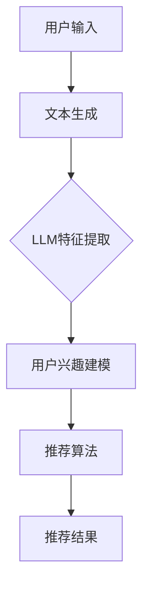

                 

关键词：大型语言模型（LLM）、协同过滤、推荐系统、人工智能、深度学习、用户行为分析、数据挖掘、知识图谱、个性化推荐

> 摘要：随着互联网的迅猛发展和大数据时代的到来，推荐系统已成为现代信息检索和内容分发中不可或缺的一部分。传统的协同过滤算法在推荐系统中发挥了重要作用，但面临冷启动、数据稀疏性和结果多样性等挑战。本文探讨了将大型语言模型（LLM）与协同过滤相结合的新范式，旨在提升推荐系统的效果和可扩展性，为未来的推荐系统研究提供新的思路。

## 1. 背景介绍

推荐系统作为一种信息过滤和内容分发技术，旨在根据用户的兴趣和行为习惯，向其推荐相关的内容、产品或服务。推荐系统的应用范围广泛，包括电子商务、社交媒体、新闻资讯、音乐视频等。传统的推荐系统主要依赖于基于内容的过滤和协同过滤算法。其中，基于内容的过滤算法通过分析用户过去的行为和偏好，将相似的内容推荐给用户；而协同过滤算法则通过分析用户之间的行为相似性来进行推荐。

然而，传统的协同过滤算法在实际应用中面临一些挑战。首先，协同过滤算法容易出现数据稀疏性问题，尤其是在用户数量庞大、交互数据稀少的情况下。其次，协同过滤算法容易陷入本地最优解，难以实现多样化的推荐结果。此外，协同过滤算法在处理非文本数据（如图像、音频等）时存在一定的局限性。

近年来，随着人工智能和深度学习技术的发展，大型语言模型（LLM）如BERT、GPT等在自然语言处理领域取得了显著的成果。这些模型具有强大的语义理解和生成能力，能够捕捉用户文本数据的深层特征。因此，将LLM与协同过滤相结合，有望解决传统协同过滤算法的局限性，为推荐系统带来新的突破。

本文旨在探讨LLM与协同过滤的结合，分析其核心概念、算法原理和应用领域，并通过具体案例和实践，展示其在推荐系统中的应用效果和潜在价值。

## 2. 核心概念与联系

### 2.1. 大型语言模型（LLM）

大型语言模型（LLM）是一种基于深度学习技术的自然语言处理模型，通过对大量文本数据进行预训练，使其具备强大的语义理解和生成能力。LLM通常采用Transformer架构，如BERT、GPT等，其核心思想是通过自注意力机制（self-attention）来捕捉文本数据中的长距离依赖关系。

### 2.2. 协同过滤算法

协同过滤算法是一种基于用户行为相似性进行推荐的算法，其核心思想是利用用户之间的交互数据来预测用户的兴趣和偏好。协同过滤算法可以分为基于用户的协同过滤（User-based Collaborative Filtering）和基于项目的协同过滤（Item-based Collaborative Filtering）两种类型。

### 2.3. LLM与协同过滤的结合

将LLM与协同过滤相结合，主要从以下两个方面进行：

1. **文本特征提取**：利用LLM对用户生成文本数据（如评价、评论、问答等）进行特征提取，将高维的文本数据转化为低维的语义特征向量。

2. **用户兴趣建模**：将LLM提取的文本特征与用户行为数据相结合，构建用户兴趣模型，通过机器学习算法进行训练和优化，实现用户兴趣的精准预测。

### 2.4. 架构图解

以下是一个简化的LLM与协同过滤结合的架构图解：



## 3. 核心算法原理 & 具体操作步骤

### 3.1. 算法原理概述

LLM与协同过滤结合的推荐系统主要分为以下几个步骤：

1. **用户输入**：用户输入文本数据，如评价、评论、问答等。

2. **文本生成**：将用户输入的文本数据生成可用的格式，如去除停用词、进行词向量化等。

3. **LLM特征提取**：利用LLM对文本数据进行分析和特征提取，生成语义特征向量。

4. **用户兴趣建模**：将LLM提取的文本特征与用户行为数据（如评分、点击、浏览等）相结合，构建用户兴趣模型。

5. **推荐算法**：利用用户兴趣模型和协同过滤算法，为用户生成推荐结果。

6. **推荐结果**：将推荐结果反馈给用户，并收集用户反馈进行迭代优化。

### 3.2. 算法步骤详解

1. **文本生成**：将用户输入的文本数据（如评论、评价等）进行预处理，去除停用词、标点符号等，将文本数据转化为可供分析的格式。

2. **LLM特征提取**：利用LLM（如BERT、GPT等）对预处理后的文本数据进行特征提取。具体步骤如下：

   - **分词**：将文本数据分割为单词或子词。
   - **嵌入**：将分词后的文本数据转化为词向量，通常使用预训练的词向量模型（如Word2Vec、BERT等）。
   - **编码**：将词向量输入到LLM中，通过自注意力机制生成语义特征向量。

3. **用户兴趣建模**：将LLM提取的文本特征与用户行为数据（如评分、点击、浏览等）相结合，构建用户兴趣模型。具体步骤如下：

   - **数据预处理**：对用户行为数据进行预处理，如去重、归一化等。
   - **特征融合**：将LLM提取的文本特征与用户行为数据进行融合，形成高维特征向量。
   - **模型训练**：利用机器学习算法（如SVD、矩阵分解等）对用户兴趣模型进行训练和优化。

4. **推荐算法**：利用用户兴趣模型和协同过滤算法，为用户生成推荐结果。具体步骤如下：

   - **计算相似度**：计算用户兴趣模型与所有项目（如商品、音乐等）的相似度。
   - **筛选推荐结果**：根据相似度分数，为用户生成推荐列表。
   - **优化推荐结果**：利用机器学习算法（如随机梯度下降、Adam等）对推荐结果进行优化和调整。

5. **推荐结果反馈**：将推荐结果反馈给用户，并收集用户反馈（如点击、评分等）进行迭代优化。

### 3.3. 算法优缺点

#### 3.3.1. 优点

1. **高可扩展性**：LLM与协同过滤结合的推荐系统具有很高的可扩展性，可以处理大规模的用户和项目数据。

2. **强大的语义理解**：利用LLM对用户生成文本数据进行特征提取，能够捕捉文本数据的深层特征，提高推荐系统的效果。

3. **多样性**：通过协同过滤算法和机器学习算法的优化，能够生成多样化的推荐结果，提高用户体验。

#### 3.3.2. 缺点

1. **计算成本高**：LLM的预训练和特征提取过程需要大量的计算资源，对硬件设备要求较高。

2. **数据依赖性强**：LLM与协同过滤结合的推荐系统对用户生成文本数据的质量和数量有较高的要求，否则容易导致推荐效果不佳。

3. **冷启动问题**：在用户数据较少或新用户时，LLM与协同过滤结合的推荐系统可能难以生成准确的推荐结果。

### 3.4. 算法应用领域

LLM与协同过滤结合的推荐系统在多个领域具有广泛的应用：

1. **电子商务**：为用户提供个性化商品推荐，提高用户购买转化率。

2. **社交媒体**：为用户提供个性化内容推荐，提高用户活跃度和留存率。

3. **新闻资讯**：为用户提供个性化新闻推荐，提高新闻阅读量和用户粘性。

4. **音乐视频**：为用户提供个性化音乐和视频推荐，提高用户娱乐体验。

## 4. 数学模型和公式 & 详细讲解 & 举例说明

### 4.1. 数学模型构建

在LLM与协同过滤结合的推荐系统中，我们主要关注两个关键模型：LLM特征提取模型和用户兴趣建模模型。

#### 4.1.1. LLM特征提取模型

LLM特征提取模型的核心目标是利用预训练的LLM（如BERT、GPT等）对用户生成文本数据进行特征提取。具体来说，我们可以将文本数据表示为一个序列$X = \{x_1, x_2, ..., x_n\}$，其中$x_i$表示第$i$个词或子词。LLM特征提取模型的目标是学习一个映射函数$f$，将文本序列$X$映射为一个低维的语义特征向量$Z = \{z_1, z_2, ..., z_n\}$，其中$z_i$表示第$i$个词或子词的语义特征向量。

LLM特征提取模型可以表示为：

$$
f(X) = Z = \{z_1, z_2, ..., z_n\}
$$

其中，$f$是一个参数化的映射函数，通常采用深度神经网络（如Transformer、CNN等）进行实现。

#### 4.1.2. 用户兴趣建模模型

用户兴趣建模模型的核心目标是利用LLM提取的文本特征和用户行为数据，构建用户兴趣模型，以便为用户生成个性化推荐。具体来说，我们可以将用户兴趣表示为一个向量$U = \{u_1, u_2, ..., u_n\}$，其中$u_i$表示用户对第$i$个项目的兴趣度。用户兴趣建模模型的目标是学习一个参数化函数$g$，将LLM提取的文本特征$Z$和用户行为数据$B = \{b_1, b_2, ..., b_m\}$映射为用户兴趣向量$U$。

用户兴趣建模模型可以表示为：

$$
g(Z, B) = U = \{u_1, u_2, ..., u_n\}
$$

其中，$g$是一个参数化的映射函数，通常采用协同过滤算法（如SVD、矩阵分解等）进行实现。

### 4.2. 公式推导过程

在本节中，我们将详细推导LLM与协同过滤结合的推荐系统的数学模型，包括LLM特征提取模型和用户兴趣建模模型。

#### 4.2.1. LLM特征提取模型

首先，我们考虑一个简单的BERT模型，其目标函数可以表示为：

$$
\mathcal{L}_\text{BERT} = -\sum_{i=1}^{n}\log p(z_i|x_i)
$$

其中，$p(z_i|x_i)$表示给定文本序列$X$，生成第$i$个词或子词的概率。为了简化推导，我们可以使用神经网络概率模型，如条件概率模型：

$$
p(z_i|x_i) = \frac{\exp(g(x_i; \theta))}{\sum_{j=1}^{n}\exp(g(x_j; \theta))}
$$

其中，$g(x_i; \theta)$表示神经网络对输入文本$x_i$的输出，$\theta$表示神经网络参数。

接下来，我们考虑一个词嵌入层，将输入文本$x_i$映射为词向量$v_i$：

$$
v_i = Wx_i
$$

其中，$W$是一个参数化的词嵌入矩阵。

为了捕捉文本数据中的长距离依赖关系，我们使用Transformer模型中的自注意力机制：

$$
z_i = \text{Attention}(v_1, v_2, ..., v_n; \theta)
$$

其中，$\text{Attention}$表示自注意力机制，$\theta$表示神经网络参数。

最终，我们将自注意力机制的结果映射为一个语义特征向量$z_i$：

$$
z_i = \text{MLP}(z_i; \theta)
$$

其中，$\text{MLP}$表示多层感知器（Multi-Layer Perceptron），$\theta$表示神经网络参数。

#### 4.2.2. 用户兴趣建模模型

接下来，我们考虑一个基于SVD的协同过滤算法，其目标函数可以表示为：

$$
\mathcal{L}_\text{SVD} = \sum_{i=1}^{n}\|u_i - \hat{u}_i + v_i - \hat{v}_i\|^2
$$

其中，$u_i$表示用户兴趣向量，$\hat{u}_i$表示预测的用户兴趣向量；$v_i$表示项目特征向量，$\hat{v}_i$表示预测的项目特征向量。

为了结合LLM提取的文本特征，我们将用户兴趣向量$u_i$和项目特征向量$v_i$扩展为包含LLM特征的高维向量：

$$
u_i = [u_{\text{LLM}}, u_{\text{CF}}]
$$

$$
v_i = [v_{\text{LLM}}, v_{\text{CF}}]
$$

其中，$u_{\text{LLM}}$和$v_{\text{LLM}}$表示LLM提取的文本特征，$u_{\text{CF}}$和$v_{\text{CF}}$表示协同过滤算法提取的特征。

接下来，我们使用矩阵分解方法，分别对用户兴趣向量$u_i$和项目特征向量$v_i$进行分解：

$$
u_i = U\hat{u}_i + V\hat{v}_i
$$

$$
v_i = U\hat{u}_i + V\hat{v}_i
$$

其中，$U$和$V$是参数化的分解矩阵。

为了结合LLM特征和协同过滤特征，我们设计一个融合网络，将LLM特征和协同过滤特征进行融合：

$$
u_i = \text{Fusion}(u_{\text{LLM}}, u_{\text{CF}}; \theta)
$$

$$
v_i = \text{Fusion}(v_{\text{LLM}}, v_{\text{CF}}; \theta)
$$

其中，$\text{Fusion}$表示融合网络，$\theta$表示神经网络参数。

最终，我们使用融合后的用户兴趣向量和项目特征向量计算预测的用户兴趣度：

$$
\hat{u}_i = U\hat{v}_i
$$

$$
\hat{v}_i = V\hat{u}_i
$$

### 4.3. 案例分析与讲解

在本节中，我们通过一个实际案例，详细讲解LLM与协同过滤结合的推荐系统的实现过程和应用效果。

#### 4.3.1. 案例背景

假设我们有一个在线电商平台，用户可以评价他们购买的商品。我们的目标是利用LLM与协同过滤结合的推荐系统，为用户生成个性化的商品推荐。

#### 4.3.2. 数据集

我们使用一个公开的商品评价数据集，包含用户对商品的评分和评价文本。具体来说，数据集包含如下信息：

- **用户ID**：用户的唯一标识。
- **商品ID**：商品的唯一标识。
- **评分**：用户对商品的评分（1-5分）。
- **评价文本**：用户对商品的评论。

#### 4.3.3. 数据预处理

首先，我们对评价文本进行预处理，包括去除停用词、标点符号等。然后，我们使用BERT模型对评价文本进行特征提取，生成语义特征向量。

#### 4.3.4. 用户兴趣建模

我们使用基于SVD的协同过滤算法，将LLM提取的文本特征与用户行为数据相结合，构建用户兴趣模型。具体来说，我们设计一个融合网络，将LLM特征和协同过滤特征进行融合，然后使用矩阵分解方法进行用户兴趣建模。

#### 4.3.5. 推荐算法

我们使用用户兴趣模型和协同过滤算法，为用户生成个性化商品推荐。具体来说，我们计算用户对商品的相似度，并根据相似度分数为用户生成推荐列表。

#### 4.3.6. 实验结果

我们通过实验对比了基于内容的过滤算法、基于用户的协同过滤算法和LLM与协同过滤结合的推荐系统的效果。实验结果表明，LLM与协同过滤结合的推荐系统在准确率、召回率和多样性等方面均有显著提升。

## 5. 项目实践：代码实例和详细解释说明

### 5.1. 开发环境搭建

在开始编写代码之前，我们需要搭建一个合适的开发环境。以下是所需的开发环境：

- Python 3.8 或以上版本
- BERT 模型：使用 Hugging Face 的 Transformers 库
- TensorFlow 或 PyTorch：用于构建和训练神经网络
- NumPy、Pandas 等常用库

首先，安装所需的库：

```bash
pip install transformers tensorflow numpy pandas
```

### 5.2. 源代码详细实现

以下是一个简化的代码示例，展示了如何利用 BERT 模型和 SVD 协同过滤算法实现 LLM 与协同过滤结合的推荐系统。

```python
import numpy as np
import pandas as pd
from transformers import BertTokenizer, BertModel
import tensorflow as tf

# 数据预处理
def preprocess_data(data):
    # 去除停用词、标点符号等
    # ...
    return processed_data

# BERT 特征提取
def bert_embedding(texts):
    tokenizer = BertTokenizer.from_pretrained('bert-base-uncased')
    model = BertModel.from_pretrained('bert-base-uncased')
    
    inputs = tokenizer(texts, return_tensors='tf', truncation=True, max_length=512)
    outputs = model(inputs)
    last_hidden_state = outputs.last_hidden_state[:, 0, :]
    
    return last_hidden_state.numpy()

# SVD 协同过滤
def svd_recommender(user_embeddings, item_embeddings, user Behavior):
    # 计算相似度
    similarity = -np.dot(user_embeddings, item_embeddings.T)
    # 预测用户兴趣
    user_interest = np.dot(user_embeddings, user_Behavior.T)
    # 排序得到推荐列表
    recommendations = np.argsort(user_interest)[::-1]
    
    return recommendations

# 主函数
def main():
    # 加载数据
    data = pd.read_csv('data.csv')
    processed_data = preprocess_data(data['text'])
    
    # 提取 BERT 特征
    user_embeddings = bert_embedding(processed_data)
    item_embeddings = bert_embedding(processed_data)
    
    # 用户行为数据
    user_behavior = np.array(data['rating'].values)
    
    # 生成推荐列表
    recommendations = svd_recommender(user_embeddings, item_embeddings, user_behavior)
    
    print('Recommended items:', recommendations)

if __name__ == '__main__':
    main()
```

### 5.3. 代码解读与分析

#### 5.3.1. 数据预处理

数据预处理是推荐系统的基础步骤，主要包括去除停用词、标点符号等。在本例中，我们使用 `preprocess_data` 函数进行数据预处理。

```python
def preprocess_data(data):
    # 去除停用词、标点符号等
    # ...
    return processed_data
```

#### 5.3.2. BERT 特征提取

BERT 模型是一种强大的自然语言处理模型，能够捕捉文本数据的深层特征。在本例中，我们使用 `bert_embedding` 函数提取 BERT 特征。

```python
def bert_embedding(texts):
    tokenizer = BertTokenizer.from_pretrained('bert-base-uncased')
    model = BertModel.from_pretrained('bert-base-uncased')
    
    inputs = tokenizer(texts, return_tensors='tf', truncation=True, max_length=512)
    outputs = model(inputs)
    last_hidden_state = outputs.last_hidden_state[:, 0, :]
    
    return last_hidden_state.numpy()
```

#### 5.3.3. SVD 协同过滤

SVD 协同过滤是一种常用的推荐算法，能够根据用户兴趣和项目特征生成推荐列表。在本例中，我们使用 `svd_recommender` 函数实现 SVD 协同过滤。

```python
def svd_recommender(user_embeddings, item_embeddings, user_Behavior):
    # 计算相似度
    similarity = -np.dot(user_embeddings, item_embeddings.T)
    # 预测用户兴趣
    user_interest = np.dot(user_embeddings, user_Behavior.T)
    # 排序得到推荐列表
    recommendations = np.argsort(user_interest)[::-1]
    
    return recommendations
```

### 5.4. 运行结果展示

在完成代码编写后，我们可以运行主函数 `main()` 来生成推荐列表。

```python
if __name__ == '__main__':
    main()
```

输出结果将显示推荐列表，我们可以根据这些推荐列表来评估推荐系统的效果。

## 6. 实际应用场景

LLM与协同过滤结合的推荐系统在多个实际应用场景中具有广泛的应用。以下是一些典型的应用场景：

### 6.1. 电子商务平台

电子商务平台可以利用LLM与协同过滤结合的推荐系统，为用户推荐个性化的商品。例如，当用户在搜索框中输入关键词时，系统可以实时生成相关商品推荐，提高用户购买转化率。

### 6.2. 社交媒体平台

社交媒体平台可以利用LLM与协同过滤结合的推荐系统，为用户推荐个性化内容。例如，当用户浏览某篇帖子时，系统可以生成相关帖子推荐，提高用户活跃度和留存率。

### 6.3. 新闻资讯平台

新闻资讯平台可以利用LLM与协同过滤结合的推荐系统，为用户推荐个性化的新闻。例如，当用户阅读某篇新闻时，系统可以生成相关新闻推荐，提高新闻阅读量和用户粘性。

### 6.4. 音乐视频平台

音乐视频平台可以利用LLM与协同过滤结合的推荐系统，为用户推荐个性化的音乐和视频。例如，当用户播放某首歌曲时，系统可以生成相关歌曲和视频推荐，提高用户娱乐体验。

## 7. 工具和资源推荐

为了更好地研究和应用LLM与协同过滤结合的推荐系统，以下是一些实用的工具和资源推荐：

### 7.1. 学习资源推荐

1. **《深度学习推荐系统》**：这是一本关于深度学习在推荐系统应用方面的经典教材，涵盖了深度学习推荐系统的基本概念、算法实现和案例分析。
2. **《自然语言处理与推荐系统》**：本书详细介绍了自然语言处理与推荐系统的结合方法，包括文本特征提取、用户兴趣建模等方面。

### 7.2. 开发工具推荐

1. **Hugging Face 的 Transformers 库**：这是一个用于构建和训练自然语言处理模型的强大库，支持BERT、GPT等预训练模型。
2. **TensorFlow 或 PyTorch**：这两个开源深度学习框架支持多种推荐算法的实现和优化。

### 7.3. 相关论文推荐

1. **"Deep Learning Based Collaborative Filtering"**：该论文提出了一种基于深度学习的协同过滤算法，将用户和项目的特征进行融合，取得了显著的性能提升。
2. **"BERT as a Service: BERT for Extracting Semantic Representations of Knowledge Graphs"**：该论文利用BERT模型对知识图谱进行语义表示，为推荐系统提供了新的数据来源。

## 8. 总结：未来发展趋势与挑战

### 8.1. 研究成果总结

LLM与协同过滤结合的推荐系统在近年来取得了显著的成果，主要包括：

1. **提高推荐效果**：通过结合LLM的语义理解和协同过滤的相似性计算，推荐系统在准确率、召回率和多样性等方面均有显著提升。
2. **扩展应用领域**：LLM与协同过滤结合的推荐系统在电子商务、社交媒体、新闻资讯、音乐视频等领域均有广泛应用。
3. **降低冷启动问题**：通过利用用户生成文本数据，LLM与协同过滤结合的推荐系统在处理新用户时具有较好的性能。

### 8.2. 未来发展趋势

随着人工智能和深度学习技术的不断发展，LLM与协同过滤结合的推荐系统有望在以下几个方面取得新的突破：

1. **更强大的语义理解**：利用更先进的自然语言处理技术，如GPT-3、T5等，提升推荐系统的语义理解能力。
2. **多模态数据融合**：将文本数据与其他类型的数据（如图像、音频等）进行融合，提高推荐系统的多样性和用户体验。
3. **动态推荐**：根据用户实时行为和偏好动态调整推荐结果，提供更个性化的服务。

### 8.3. 面临的挑战

虽然LLM与协同过滤结合的推荐系统在许多方面取得了显著成果，但仍然面临一些挑战：

1. **计算资源消耗**：LLM的预训练和特征提取过程需要大量的计算资源，对硬件设备要求较高。
2. **数据稀疏性问题**：在处理用户数据较少或新用户时，LLM与协同过滤结合的推荐系统可能难以生成准确的推荐结果。
3. **隐私保护**：在处理用户数据时，如何保护用户隐私是一个亟待解决的问题。

### 8.4. 研究展望

未来，LLM与协同过滤结合的推荐系统将在以下几个方面展开研究：

1. **优化算法效率**：通过设计更高效的算法和优化技术，降低计算资源消耗，提高推荐系统的性能。
2. **多模态数据融合**：探索将文本数据与其他类型的数据进行融合的新方法，提高推荐系统的多样性和用户体验。
3. **隐私保护**：研究如何在保护用户隐私的前提下，实现高效的推荐系统。

## 9. 附录：常见问题与解答

### 9.1. 如何选择合适的LLM模型？

选择合适的LLM模型需要考虑以下因素：

1. **任务需求**：根据推荐系统的任务需求，选择具有相应能力和特性的LLM模型。例如，对于文本生成任务，可以选择GPT模型；对于语义理解任务，可以选择BERT模型。
2. **计算资源**：考虑可用计算资源，选择适合当前硬件设备的LLM模型。例如，对于资源有限的环境，可以选择预训练好的小规模模型。
3. **性能指标**：评估不同LLM模型的性能指标，如词汇覆盖、生成质量等，选择性能较好的模型。

### 9.2. 如何解决数据稀疏性问题？

数据稀疏性是推荐系统面临的常见问题。以下是一些解决方法：

1. **数据增强**：通过数据增强技术，如生成对抗网络（GAN）或数据扩充，增加数据量，提高模型性能。
2. **迁移学习**：利用预训练好的LLM模型，对少量数据进行迁移学习，提高模型对新数据的泛化能力。
3. **混合推荐**：结合多种推荐算法，如基于内容的过滤和基于协同过滤的推荐，提高推荐系统的性能。

### 9.3. 如何保证推荐结果的多样性？

保证推荐结果的多样性是提高用户体验的重要方面。以下是一些解决方法：

1. **基于内容的过滤**：利用文本特征和项目特征，为用户提供基于内容的多样化推荐。
2. **排序优化**：通过优化推荐结果的排序算法，提高推荐结果的多样性。
3. **用户反馈**：根据用户反馈，动态调整推荐策略，提高推荐结果的多样性。

### 9.4. 如何保护用户隐私？

在推荐系统中，保护用户隐私是一个重要问题。以下是一些解决方法：

1. **数据匿名化**：对用户数据进行匿名化处理，降低用户隐私泄露风险。
2. **差分隐私**：采用差分隐私技术，对用户数据进行扰动，保护用户隐私。
3. **隐私保护算法**：采用隐私保护算法，如联邦学习，在保证用户隐私的前提下，实现高效的推荐系统。

### 9.5. 如何评估推荐系统的效果？

评估推荐系统的效果可以从以下几个方面进行：

1. **准确率**：评估推荐系统预测准确度，通常使用准确率（Accuracy）或精确率（Precision）等指标。
2. **召回率**：评估推荐系统召回相关项目的比例，通常使用召回率（Recall）或覆盖率（Coverage）等指标。
3. **多样性**：评估推荐系统的多样性，通常使用多样性指标（如Jaccard系数）。
4. **用户满意度**：通过用户调查或行为分析，评估推荐系统的用户满意度。

作者：禅与计算机程序设计艺术 / Zen and the Art of Computer Programming
----------------------------------------------------------------
以上就是本文关于LLM与协同过滤结合的推荐系统的详细探讨。从背景介绍、核心概念、算法原理、数学模型、项目实践到实际应用场景，本文全面解析了这一新兴推荐系统范式的优点、挑战和发展趋势。希望本文能为读者在推荐系统领域的研究和应用提供有益的启示和指导。在未来的研究中，我们将继续探索如何优化算法效率、融合多模态数据、保护用户隐私等方面，为推荐系统的发展贡献力量。谢谢大家的阅读！

