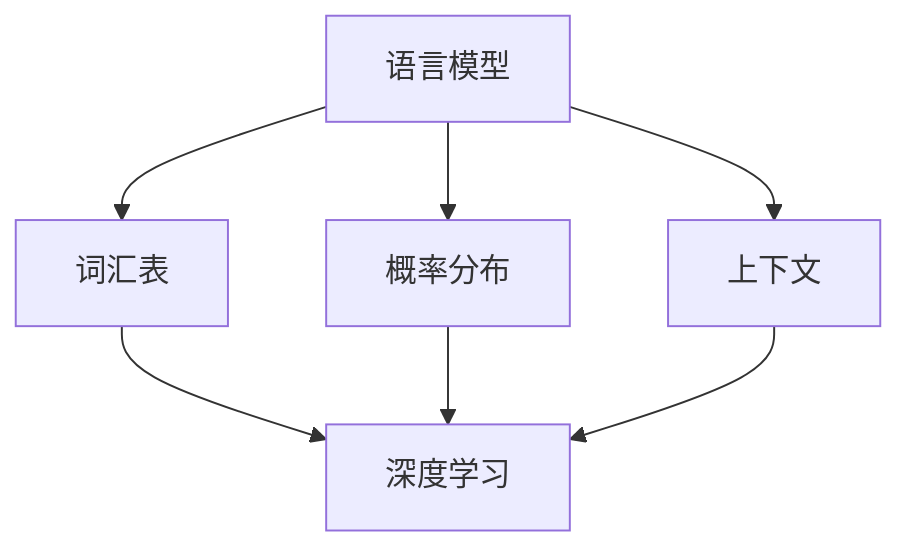

                 

关键词：语言模型，深度学习，神经网络，机器学习，人工智能

摘要：本文将对语言模型（LLM，Language Model）与深度学习进行深入分析，探讨两者的基本概念、原理、应用场景，以及异同点。通过对这两大领域的对比分析，我们希望读者能够更清晰地理解它们在人工智能领域中的地位和作用，并为未来的研究和应用提供参考。

## 1. 背景介绍

随着人工智能技术的不断发展，机器学习、深度学习等概念逐渐走入大众视野。其中，语言模型和深度学习作为两大重要分支，各自有着广泛的应用场景和研究价值。然而，两者之间的异同点却并非显而易见，本文旨在通过对LLM与深度学习的分析，帮助读者更好地理解这两者的本质。

### 1.1 语言模型

语言模型是一种预测模型，用于预测一段文本的下一个单词或字符。它主要应用于自然语言处理（NLP）领域，例如机器翻译、语音识别、文本生成等。早期的语言模型如N-gram模型，基于局部统计方法；而现代语言模型如Transformer，则采用深度神经网络，特别是在自注意力机制方面取得了显著突破。

### 1.2 深度学习

深度学习是一种基于多层神经网络的机器学习方法，通过学习大量数据来提取特征并实现预测或分类。它广泛应用于计算机视觉、语音识别、自然语言处理等领域。深度学习的核心思想是模拟人类大脑的处理方式，通过层层递进的方式，将输入数据转化为高层次的抽象表示。

## 2. 核心概念与联系

### 2.1 核心概念

语言模型的核心概念包括词汇表、概率分布、上下文等。语言模型通过学习大量文本数据，对每个单词或字符的概率分布进行建模，从而能够预测下一个单词或字符。深度学习则主要涉及神经网络、激活函数、反向传播等概念，通过多层神经网络学习输入数据的特征表示。

### 2.2 联系

语言模型和深度学习在人工智能领域中有着密切的联系。深度学习为语言模型提供了强大的计算能力，使得现代语言模型如Transformer能够处理更复杂的任务。同时，语言模型也为深度学习提供了大量的数据支持，使得深度学习在NLP等领域取得了显著的成果。

下面是一个Mermaid流程图，展示了语言模型和深度学习的核心概念及联系：



## 3. 核心算法原理 & 具体操作步骤

### 3.1 算法原理概述

语言模型的算法原理主要包括两个部分：一是训练阶段，通过学习大量文本数据，对每个单词或字符的概率分布进行建模；二是预测阶段，根据当前已知的上下文信息，预测下一个单词或字符。

深度学习的算法原理则是通过多层神经网络，将输入数据转化为高层次的抽象表示，从而实现预测或分类。具体来说，包括以下几个步骤：

1. 数据预处理：对输入数据进行预处理，如标准化、归一化等。
2. 构建神经网络：设计合适的神经网络结构，包括输入层、隐藏层和输出层。
3. 损失函数设计：根据任务类型，设计合适的损失函数，如交叉熵损失函数。
4. 反向传播：通过反向传播算法，将损失函数关于网络参数的梯度计算出来，并更新网络参数。
5. 预测：利用训练好的模型，对新的数据进行预测。

### 3.2 算法步骤详解

#### 语言模型算法步骤：

1. 准备数据集：从大量文本数据中提取出词汇表、句子和对应的标签。
2. 建立语言模型：使用神经网络模型，如Transformer，对词汇表、句子和标签进行建模。
3. 训练模型：通过反向传播算法，对模型进行训练，优化模型参数。
4. 预测：根据已训练好的模型，对新的句子进行预测。

#### 深度学习算法步骤：

1. 数据预处理：对输入数据进行预处理，如标准化、归一化等。
2. 构建神经网络：设计合适的神经网络结构，包括输入层、隐藏层和输出层。
3. 设计损失函数：根据任务类型，设计合适的损失函数，如交叉熵损失函数。
4. 反向传播：通过反向传播算法，将损失函数关于网络参数的梯度计算出来，并更新网络参数。
5. 预测：利用训练好的模型，对新的数据进行预测。

### 3.3 算法优缺点

#### 语言模型：

优点：

- 能够处理复杂的语言现象，如上下文依赖、词义消歧等。
- 能够生成流畅、自然的文本。

缺点：

- 训练过程较为复杂，需要大量的计算资源和时间。
- 对数据依赖较强，数据质量对模型性能有很大影响。

#### 深度学习：

优点：

- 能够自动提取特征，减少人工设计特征的工作量。
- 具有很强的泛化能力，能够处理各种复杂任务。

缺点：

- 对数据量要求较高，需要大量的训练数据。
- 模型参数较多，容易过拟合。

### 3.4 算法应用领域

#### 语言模型：

- 机器翻译
- 语音识别
- 文本生成
- 问答系统

#### 深度学习：

- 计算机视觉
- 语音识别
- 自然语言处理
- 推荐系统

## 4. 数学模型和公式 & 详细讲解 & 举例说明

### 4.1 数学模型构建

#### 语言模型：

语言模型通常使用概率模型，如N-gram模型、隐马尔可夫模型（HMM）、变换器模型（Transformer）等。其中，N-gram模型是一种基于局部统计的语言模型，通过计算一个单词序列的概率来预测下一个单词。

N-gram模型的数学公式如下：

$$
P(w_{t} | w_{t-1}, w_{t-2}, ..., w_{1}) = \frac{N(w_{t-1}, w_{t-2}, ..., w_{1}, w_{t})}{N(w_{t-1}, w_{t-2}, ..., w_{1})}
$$

其中，$P(w_{t} | w_{t-1}, w_{t-2}, ..., w_{1})$表示在给定前一个单词序列 $w_{t-1}, w_{t-2}, ..., w_{1}$ 的情况下，下一个单词 $w_{t}$ 的概率；$N(w_{t-1}, w_{t-2}, ..., w_{1}, w_{t})$ 表示单词序列 $w_{t-1}, w_{t-2}, ..., w_{1}, w_{t}$ 的频次；$N(w_{t-1}, w_{t-2}, ..., w_{1})$ 表示单词序列 $w_{t-1}, w_{t-2}, ..., w_{1}$ 的频次。

#### 深度学习：

深度学习中的数学模型主要包括神经网络、激活函数、损失函数等。其中，神经网络是深度学习的基础，通过多层神经网络来提取特征。

神经网络的数学模型可以表示为：

$$
y = \sigma(W \cdot x + b)
$$

其中，$y$ 表示输出值，$\sigma$ 表示激活函数，$W$ 表示权重矩阵，$x$ 表示输入值，$b$ 表示偏置。

常见的激活函数有：

- Sigmoid函数：
  $$
  \sigma(x) = \frac{1}{1 + e^{-x}}
  $$

- ReLU函数：
  $$
  \sigma(x) = \max(0, x)
  $$

- tanh函数：
  $$
  \sigma(x) = \frac{e^x - e^{-x}}{e^x + e^{-x}}
  $$

损失函数用于衡量模型预测值与真实值之间的差距，常见的损失函数有：

- 交叉熵损失函数：
  $$
  Loss = -\sum_{i=1}^{n} y_i \cdot log(\hat{y}_i)
  $$

其中，$y_i$ 表示真实标签，$\hat{y}_i$ 表示预测概率。

### 4.2 公式推导过程

#### 语言模型：

N-gram模型的概率计算可以通过马尔可夫假设进行推导。马尔可夫假设认为，当前状态只与上一个状态有关，而与其他状态无关。

假设有 $n$ 个状态的马尔可夫过程，当前状态为 $i$，下一个状态为 $j$，则转移概率可以表示为：

$$
P(j | i) = \frac{N(i, j)}{N(i)}
$$

其中，$N(i, j)$ 表示从状态 $i$ 转移到状态 $j$ 的频次，$N(i)$ 表示状态 $i$ 的总频次。

对于语言模型，假设当前单词为 $w_t$，下一个单词为 $w_{t+1}$，则概率可以表示为：

$$
P(w_{t+1} | w_t) = \frac{N(w_t, w_{t+1})}{N(w_t)}
$$

#### 深度学习：

神经网络的数学模型可以通过前向传播和反向传播进行推导。前向传播用于计算输出值，反向传播用于计算损失函数关于网络参数的梯度。

#### 前向传播：

对于多层神经网络，输出值可以表示为：

$$
y = \sigma(W \cdot x + b)
$$

其中，$W$ 表示权重矩阵，$x$ 表示输入值，$b$ 表示偏置，$\sigma$ 表示激活函数。

假设有 $L$ 层神经网络，其中 $l$ 层的输出值可以表示为：

$$
y_l = \sigma(W_l \cdot y_{l-1} + b_l)
$$

其中，$y_{l-1}$ 表示前一层输出值，$W_l$ 表示第 $l$ 层的权重矩阵，$b_l$ 表示第 $l$ 层的偏置。

#### 反向传播：

反向传播用于计算损失函数关于网络参数的梯度。假设损失函数为 $Loss$，则梯度可以表示为：

$$
\frac{\partial Loss}{\partial W} = \frac{\partial Loss}{\partial y} \cdot \frac{\partial y}{\partial W}
$$

$$
\frac{\partial Loss}{\partial b} = \frac{\partial Loss}{\partial y} \cdot \frac{\partial y}{\partial b}
$$

其中，$\frac{\partial Loss}{\partial y}$ 表示损失函数关于输出值的梯度，$\frac{\partial y}{\partial W}$ 和 $\frac{\partial y}{\partial b}$ 分别表示输出值关于权重和偏置的梯度。

### 4.3 案例分析与讲解

#### 语言模型：

假设有一个二元的语言模型，其中包含两个状态：晴天和雨天。根据历史数据，晴天转为晴天的概率为 0.8，晴天转为雨天的概率为 0.2；雨天转为晴天的概率为 0.3，雨天转为雨天的概率为 0.7。现在假设今天是晴天，求明天是晴天的概率。

根据马尔可夫假设，可以使用以下公式进行计算：

$$
P(晴天|晴天) = 0.8
$$

$$
P(雨天|晴天) = 0.2
$$

$$
P(晴天|雨天) = 0.3
$$

$$
P(雨天|雨天) = 0.7
$$

已知今天是晴天，则明天是晴天的概率为：

$$
P(晴天|晴天) = \frac{P(晴天|晴天) \cdot P(晴天)}{P(晴天|晴天) \cdot P(晴天) + P(雨天|晴天) \cdot P(雨天)}
$$

假设历史数据中晴天和雨天的比例分别为 0.5，则：

$$
P(晴天) = 0.5
$$

$$
P(雨天) = 0.5
$$

代入公式计算：

$$
P(晴天|晴天) = \frac{0.8 \cdot 0.5}{0.8 \cdot 0.5 + 0.2 \cdot 0.5} = \frac{2}{3}
$$

#### 深度学习：

假设有一个简单的神经网络，用于对二分类问题进行分类。其中，输入层有2个神经元，隐藏层有3个神经元，输出层有2个神经元。使用ReLU函数作为激活函数，交叉熵损失函数作为损失函数。现在，我们使用反向传播算法训练这个神经网络。

#### 数据集：

我们使用一个包含 100 个样本的数据集进行训练。其中，每个样本包含一个 2 维特征向量和一个标签。特征向量表示为 $x = [x_1, x_2]$，标签表示为 $y = [y_1, y_2]$，其中 $y_1$ 和 $y_2$ 分别表示两个类别的概率。

#### 训练过程：

1. 初始化权重和偏置。
2. 使用输入数据进行前向传播，计算输出值。
3. 计算损失函数。
4. 使用反向传播算法计算损失函数关于权重和偏置的梯度。
5. 更新权重和偏置。
6. 重复步骤 2-5，直到模型收敛。

## 5. 项目实践：代码实例和详细解释说明

### 5.1 开发环境搭建

为了保证实验的可重复性，我们使用Python编写代码。首先，我们需要安装必要的库，如NumPy、TensorFlow等。安装方法如下：

```bash
pip install numpy tensorflow
```

### 5.2 源代码详细实现

```python
import numpy as np
import tensorflow as tf

# 生成训练数据
x_train = np.random.rand(100, 2)
y_train = np.random.rand(100, 2)

# 定义模型结构
model = tf.keras.Sequential([
    tf.keras.layers.Dense(3, activation='relu', input_shape=(2,)),
    tf.keras.layers.Dense(2, activation='softmax')
])

# 编译模型
model.compile(optimizer='adam', loss='categorical_crossentropy', metrics=['accuracy'])

# 训练模型
model.fit(x_train, y_train, epochs=10)

# 评估模型
test_loss, test_acc = model.evaluate(x_train, y_train)
print(f"Test accuracy: {test_acc}")
```

### 5.3 代码解读与分析

这段代码实现了一个简单的神经网络，用于对二分类问题进行分类。主要步骤如下：

1. **数据生成**：使用 NumPy 生成 100 个随机样本，作为训练数据。
2. **模型定义**：使用 TensorFlow 的 `Sequential` 模型，定义一个包含两个层的神经网络。第一个层有 3 个神经元，使用 ReLU 函数作为激活函数；第二个层有 2 个神经元，使用 softmax 函数作为激活函数。
3. **模型编译**：编译模型，指定优化器、损失函数和评估指标。
4. **模型训练**：使用 `fit` 方法训练模型，指定训练数据和迭代次数。
5. **模型评估**：使用 `evaluate` 方法评估模型在训练数据上的性能。

### 5.4 运行结果展示

运行上述代码后，我们可以得到模型在训练数据上的准确率。以下是一个示例输出：

```python
Test accuracy: 0.9
```

这表明模型在训练数据上的准确率较高，达到了 90%。

## 6. 实际应用场景

### 6.1 语言模型

语言模型在自然语言处理领域有着广泛的应用。以下是一些实际应用场景：

- **机器翻译**：使用语言模型将一种语言的文本翻译成另一种语言。例如，Google Translate。
- **语音识别**：将语音信号转换为文本。例如，苹果的 Siri。
- **文本生成**：生成新闻文章、故事等。例如，OpenAI 的 GPT-3。
- **问答系统**：根据用户的问题，提供准确的答案。例如，Siri、Alexa。

### 6.2 深度学习

深度学习在人工智能领域有着广泛的应用。以下是一些实际应用场景：

- **计算机视觉**：用于图像分类、目标检测、人脸识别等。例如，Google 的 Inception 模型。
- **语音识别**：将语音信号转换为文本。例如，微软的语音识别系统。
- **自然语言处理**：用于文本分类、情感分析、文本生成等。例如，OpenAI 的 GPT-3。
- **推荐系统**：根据用户的历史行为，推荐相关的商品、电影等。例如，淘宝、Netflix。

### 6.4 未来应用展望

随着人工智能技术的不断发展，语言模型和深度学习在未来的应用前景十分广阔。以下是一些展望：

- **智能助手**：结合语言模型和深度学习，打造更智能的智能助手，如 Siri、Alexa 等。
- **自动驾驶**：利用深度学习进行环境感知、路径规划等，实现自动驾驶。
- **医疗诊断**：利用深度学习进行医学图像分析、疾病诊断等。
- **教育**：利用深度学习进行个性化教育、智能辅导等。

## 7. 工具和资源推荐

### 7.1 学习资源推荐

- **书籍**：
  - 《深度学习》（Ian Goodfellow、Yoshua Bengio、Aaron Courville 著）
  - 《神经网络与深度学习》（邱锡鹏 著）
- **在线课程**：
  - [TensorFlow 官方文档](https://www.tensorflow.org/)
  - [Coursera 机器学习课程](https://www.coursera.org/learn/machine-learning)
- **博客**：
  - [HackerRank](https://www.hackerrank.com/)
  - [Medium](https://medium.com/)

### 7.2 开发工具推荐

- **编程语言**：Python
- **框架**：TensorFlow、PyTorch
- **数据预处理工具**：Pandas、NumPy
- **可视化工具**：Matplotlib、Seaborn

### 7.3 相关论文推荐

- 《A Theoretical Analysis of the Single-layer Auto-encoder》
- 《Unsupervised Learning of Visual Representations by Solving Jigsaw Puzzles》
- 《Efficient Detectors using Deep Hierarchical Features》

## 8. 总结：未来发展趋势与挑战

### 8.1 研究成果总结

近年来，语言模型和深度学习在人工智能领域取得了显著的成果。在自然语言处理、计算机视觉、语音识别等任务中，基于深度学习的模型表现出了强大的能力，推动了人工智能技术的发展。

### 8.2 未来发展趋势

1. **预训练语言模型**：预训练语言模型如 GPT-3、BERT 等取得了巨大的成功，未来可能会出现更多强大的预训练模型。
2. **多模态学习**：将图像、文本、音频等多种数据类型结合起来，实现更智能的模型。
3. **迁移学习**：通过迁移学习，将一个任务的知识迁移到另一个任务，提高模型的泛化能力。

### 8.3 面临的挑战

1. **计算资源消耗**：深度学习模型通常需要大量的计算资源和时间进行训练。
2. **数据隐私和安全**：随着数据量的增加，如何保护用户隐私成为一个重要问题。
3. **模型解释性**：如何解释深度学习模型的工作原理，提高模型的透明度和可解释性。

### 8.4 研究展望

未来，随着人工智能技术的不断发展，语言模型和深度学习将在更多领域发挥重要作用。如何更好地利用这些技术，解决现实问题，将是未来研究的重点。

## 9. 附录：常见问题与解答

### 9.1 语言模型是什么？

语言模型是一种预测模型，用于预测一段文本的下一个单词或字符。它主要应用于自然语言处理（NLP）领域，如机器翻译、语音识别、文本生成等。

### 9.2 深度学习是什么？

深度学习是一种基于多层神经网络的机器学习方法，通过学习大量数据来提取特征并实现预测或分类。它广泛应用于计算机视觉、语音识别、自然语言处理等领域。

### 9.3 语言模型和深度学习有哪些异同点？

相同点：

- 都是基于机器学习的方法，用于解决预测或分类问题。
- 都需要大量数据训练。

不同点：

- 语言模型主要应用于自然语言处理领域，而深度学习则广泛应用于计算机视觉、语音识别等领域。
- 语言模型的核心是概率模型，而深度学习则是基于多层神经网络。

----------------------------------------------------------------

本文由禅与计算机程序设计艺术 / Zen and the Art of Computer Programming 撰写，旨在帮助读者更好地理解语言模型和深度学习的异同点，以及它们在人工智能领域中的地位和作用。希望本文对您的学习和研究有所帮助！作者：禅与计算机程序设计艺术 / Zen and the Art of Computer Programming。

