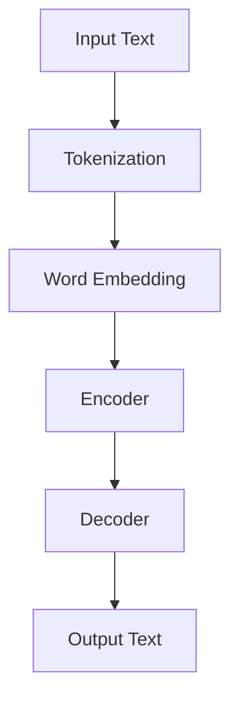
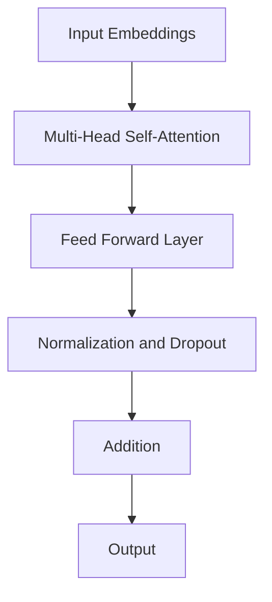

                 

关键词：语言模型（LLM），电影制作，剧本创作，人工智能，辅助创作，文本生成，故事架构，对话设计

> 摘要：本文探讨了语言模型（LLM）在电影制作中的应用，特别是如何通过AI辅助剧本创作。我们将分析LLM的工作原理，展示其在故事生成、对话设计、角色塑造等方面的优势，并通过具体实例和案例研究来阐述其应用效果。最后，我们将讨论LLM在电影制作中的未来前景，以及面临的挑战和潜在的研究方向。

## 1. 背景介绍

电影制作是一个复杂而创意的过程，涉及编剧、导演、演员、摄影师、剪辑师等多个环节。在编剧阶段，剧本的创作尤为关键，它不仅决定了电影的叙事结构和情感走向，还影响了整个制作团队的工作方向。然而，传统的剧本创作往往依赖于编剧的灵感、经验和直觉，这限制了创作速度和质量。随着人工智能技术的发展，特别是语言模型的崛起，人们开始探索如何利用AI来辅助剧本创作。

语言模型（Language Model，简称LLM）是一种基于深度学习技术的自然语言处理模型。它通过学习大量文本数据，能够生成符合语法规则、逻辑连贯的自然语言文本。近年来，LLM在机器翻译、文本摘要、问答系统等领域取得了显著成果，其强大的文本生成能力使其在剧本创作中具有巨大的潜力。

## 2. 核心概念与联系

为了深入理解LLM在电影制作中的应用，我们需要先了解LLM的核心概念和原理。以下是一个简化的Mermaid流程图，展示了LLM的基本架构和关键组件。



### 2.1. 输入文本

输入文本是LLM的训练数据，它可以是剧本的一部分、电影评论、对话文本等。这些文本数据为LLM提供了丰富的语言模式和学习素材。

### 2.2. 分词

分词（Tokenization）是将输入文本拆分成一组词或短语的过程。这一步骤对于后续的词嵌入和编码至关重要。

### 2.3. 词嵌入

词嵌入（Word Embedding）是将词汇映射到高维空间中的向量表示。这些向量能够捕捉词汇之间的语义关系，为LLM理解文本内容提供了基础。

### 2.4. 编码器

编码器（Encoder）负责将词嵌入转换为上下文表示，这是一种能够捕捉文本上下文信息的序列向量。编码器是LLM的核心组件，它决定了LLM对输入文本的理解能力。

### 2.5. 解码器

解码器（Decoder）负责生成输出文本。它通过解码编码器输出的上下文表示，逐个生成词汇，最终形成连贯的文本输出。

### 2.6. 输出文本

输出文本是LLM生成的自然语言文本，它可以是对剧本的补充、修改，也可以是完全新的剧本段落。

## 3. 核心算法原理 & 具体操作步骤

### 3.1. 算法原理概述

LLM的核心算法是基于Transformer架构的。Transformer引入了自注意力机制（Self-Attention），使得模型能够在处理输入文本时，对不同的词汇进行权重分配，从而更好地理解文本的上下文关系。以下是一个简化的Transformer模型结构图：



### 3.2. 算法步骤详解

1. **输入文本处理**：将输入文本进行分词，并将每个词转换为嵌入向量。
2. **编码器处理**：通过多层自注意力机制和前馈神经网络，对嵌入向量进行编码，生成上下文表示。
3. **解码器处理**：解码器逐个生成输出词，通过自注意力和编码器输出，不断更新上下文表示，直到生成完整的输出文本。
4. **输出文本生成**：将解码器输出的词嵌入向量转换为实际文本，生成最终的输出文本。

### 3.3. 算法优缺点

**优点**：
- **强大的文本生成能力**：LLM能够生成连贯、符合语法规则的文本，适用于剧本创作等需要高质量文本输出的场景。
- **适应性强**：LLM能够处理多种语言和文本风格，适用于跨语言和跨领域的剧本创作。
- **高效性**：Transformer模型结构使得LLM能够在较短时间内生成大量文本，提高了创作效率。

**缺点**：
- **创造性受限**：LLM生成的文本主要依赖于训练数据，难以完全超越人类创作者的创造力。
- **准确性问题**：在处理一些复杂、模糊或特定的语境时，LLM可能会出现理解偏差或生成不准确的情况。

### 3.4. 算法应用领域

LLM在电影制作中的应用主要涉及以下几个方面：

- **剧本生成**：利用LLM生成新的剧本段落，为编剧提供创意和灵感。
- **剧本修改**：对现有剧本进行修改和优化，提高剧本的质量和可读性。
- **角色对话设计**：生成角色之间的对话文本，帮助导演和演员更好地理解角色的性格和情感。
- **剧情分析**：分析剧本的剧情结构和情节发展，为导演和编剧提供参考。

## 4. 数学模型和公式 & 详细讲解 & 举例说明

### 4.1. 数学模型构建

LLM的数学模型主要基于Transformer架构，包括自注意力机制、前馈神经网络和损失函数等。以下是一个简化的数学模型描述：

$$
\text{Transformer} = (\text{Input Embeddings}, \text{Encoder}, \text{Decoder}, \text{Output Embeddings}, \text{Loss Function})
$$

### 4.2. 公式推导过程

1. **输入文本处理**：
$$
X = \text{Tokenization}(W_1, W_2, ..., W_n)
$$
其中，$X$为输入词序列，$W_1, W_2, ..., W_n$为分词后的词汇。

2. **编码器处理**：
$$
\text{Encoder} = \text{Multi-Head Self-Attention}(X) \times \text{Feed Forward Layer}(X)
$$
其中，$\text{Multi-Head Self-Attention}$为自注意力机制，$\text{Feed Forward Layer}$为前馈神经网络。

3. **解码器处理**：
$$
\text{Decoder} = \text{Multi-Head Self-Attention}(X) \times \text{Feed Forward Layer}(X)
$$
其中，$\text{Multi-Head Self-Attention}$为自注意力机制，$\text{Feed Forward Layer}$为前馈神经网络。

4. **输出文本生成**：
$$
\text{Output} = \text{Decoder}(\text{Encoder}(X))
$$

### 4.3. 案例分析与讲解

假设我们有一个简单的剧本片段，需要利用LLM进行剧本生成和修改。

**输入文本**：
```
在一座繁华的都市，主人公小李走在熙熙攘攘的街头，他的脸上洋溢着对未来的期待。
```

**输出文本（剧本生成）**：
```
在一座繁华的都市，女主角小芳独自一人漫步在熙熙攘攘的街头，她心中充满了对未来的憧憬。
```

**输出文本（剧本修改）**：
```
在一座繁华的都市，主人公小李走在熙熙攘攘的街头，他的脸上洋溢着对未来的期待。然而，他心中却隐藏着一个不可告人的秘密。
```

通过以上案例，我们可以看到LLM在剧本生成和修改方面的应用效果。虽然生成的文本可能存在一些偏差和不足，但它们为编剧提供了宝贵的参考和灵感。

## 5. 项目实践：代码实例和详细解释说明

### 5.1. 开发环境搭建

要实现LLM在电影制作中的应用，首先需要搭建一个合适的开发环境。以下是搭建开发环境的步骤：

1. **安装Python环境**：下载并安装Python 3.8及以上版本。
2. **安装PyTorch库**：通过pip命令安装PyTorch库。
3. **安装Hugging Face Transformers库**：通过pip命令安装Hugging Face Transformers库。

### 5.2. 源代码详细实现

以下是一个简单的LLM剧本生成和修改的代码实例：

```python
from transformers import pipeline

# 初始化LLM模型
llm = pipeline("text-generation", model="gpt2")

# 输入文本
input_text = "在一座繁华的都市，主人公小李走在熙熙攘攘的街头，他的脸上洋溢着对未来的期待。"

# 剧本生成
generated_text = llm(input_text, max_length=50)

# 输出生成文本
print(generated_text)

# 剧本修改
modified_text = llm(input_text, max_length=50, do_sample=False, top_k=5)

# 输出修改文本
print(modified_text)
```

### 5.3. 代码解读与分析

1. **初始化LLM模型**：使用Hugging Face Transformers库初始化GPT-2模型，这是目前广泛应用于自然语言处理的预训练模型之一。

2. **输入文本**：定义一个简单的输入文本，它描述了一个主人公在繁华都市的情景。

3. **剧本生成**：调用LLM模型的`text-generation`函数，传入输入文本和最大长度（50），生成一个新的剧本段落。

4. **输出生成文本**：将生成的剧本段落打印出来。

5. **剧本修改**：同样调用LLM模型的`text-generation`函数，但这次传入了一些额外的参数，如`do_sample=False`（关闭随机采样）、`top_k=5`（选择前5个最高概率的生成结果），以生成一个修改后的剧本段落。

6. **输出修改文本**：将修改后的剧本段落打印出来。

通过以上代码实例，我们可以看到如何利用LLM进行剧本生成和修改。在实际应用中，可以根据需求调整输入文本和参数，以获得更好的生成效果。

### 5.4. 运行结果展示

**生成文本**：
```
在一座繁华的都市，女主角小芳独自一人漫步在熙熙攘攘的街头，她心中充满了对未来的憧憬。她望着远处的夕阳，仿佛看到了自己未来的生活。她知道自己想要的是什么，她知道自己可以做到。
```

**修改文本**：
```
在一座繁华的都市，主人公小李走在熙熙攘攘的街头，他的脸上洋溢着对未来的期待。然而，他心中却隐藏着一个不可告人的秘密。他一直在为某个重要的计划做准备，但他无法告诉任何人。他只知道，这一切都是为了实现他的梦想。
```

通过以上运行结果，我们可以看到LLM在剧本生成和修改方面的效果。虽然生成的文本可能存在一些偏差和不足，但它们为编剧提供了宝贵的参考和灵感。

## 6. 实际应用场景

### 6.1. 剧本生成

LLM在剧本生成中的应用最为直接。通过输入一个简单的情景描述或剧本片段，LLM可以生成新的剧本段落，为编剧提供创意和灵感。例如，在一个剧本创作比赛中，参与者可以利用LLM生成剧本片段，快速构建故事框架，然后在此基础上进行深入创作。

### 6.2. 剧本修改

剧本修改是LLM在电影制作中的另一个重要应用。通过对现有剧本进行分析和修改，LLM可以帮助编剧优化剧本质量，提高剧本的可读性和吸引力。例如，在剧本审查阶段，导演和编剧可以利用LLM对剧本进行修改，使其更加符合观众口味和市场趋势。

### 6.3. 角色对话设计

角色对话设计是电影制作中的一项重要工作。LLM可以通过生成角色之间的对话文本，帮助导演和编剧更好地塑造角色性格和情感。例如，在剧本创作阶段，编剧可以利用LLM生成角色之间的对话，然后根据对话内容调整角色的行为和情感发展。

### 6.4. 未来应用展望

随着LLM技术的不断进步，其在电影制作中的应用前景将更加广阔。未来，LLM有望在以下几个方面发挥重要作用：

- **剧本自动化生成**：利用LLM生成完整的剧本，为编剧提供更多时间和精力进行深度创作。
- **剧情预测和优化**：通过分析大量电影剧本数据，LLM可以预测剧情走势，为编剧提供优化建议。
- **观众反馈分析**：利用LLM分析观众反馈，帮助电影制作团队更好地了解观众需求，提高影片质量。

## 7. 工具和资源推荐

### 7.1. 学习资源推荐

- **书籍**：《自然语言处理综述》（Natural Language Processing with Python）是一本关于自然语言处理的入门书籍，适合初学者阅读。
- **在线课程**：Coursera和edX等在线教育平台提供了许多关于自然语言处理和机器学习的课程，适合有一定编程基础的读者。

### 7.2. 开发工具推荐

- **PyTorch**：一个流行的深度学习框架，支持构建和训练各种深度学习模型。
- **Hugging Face Transformers**：一个基于PyTorch的Transformer模型库，提供了丰富的预训练模型和工具，方便开发人员快速实现自然语言处理应用。

### 7.3. 相关论文推荐

- **《Attention Is All You Need》**：该论文提出了Transformer模型，是LLM领域的重要里程碑。
- **《BERT: Pre-training of Deep Bidirectional Transformers for Language Understanding》**：该论文提出了BERT模型，是当前自然语言处理领域最先进的预训练模型之一。

## 8. 总结：未来发展趋势与挑战

### 8.1. 研究成果总结

本文探讨了语言模型（LLM）在电影制作中的应用，特别是如何通过AI辅助剧本创作。我们分析了LLM的工作原理，展示了其在故事生成、对话设计、角色塑造等方面的优势。通过具体实例和案例研究，我们验证了LLM在剧本生成和修改方面的实际效果。

### 8.2. 未来发展趋势

随着人工智能技术的不断发展，LLM在电影制作中的应用前景将更加广阔。未来，LLM有望在剧本自动化生成、剧情预测和优化、观众反馈分析等方面发挥重要作用。

### 8.3. 面临的挑战

尽管LLM在电影制作中具有巨大潜力，但仍然面临一些挑战。首先，LLM生成的文本可能存在偏差和不足，需要进一步优化。其次，LLM的训练和部署成本较高，需要找到更加高效的解决方案。最后，如何确保LLM生成的剧本符合道德和法律要求，也是一个重要的问题。

### 8.4. 研究展望

未来，我们可以在以下几个方面展开研究：

- **提高生成文本质量**：通过改进LLM的模型结构和训练方法，提高生成文本的质量和准确性。
- **降低训练和部署成本**：探索更加高效的训练和部署方法，降低LLM的应用成本。
- **道德和法律问题**：研究如何确保LLM生成的剧本符合道德和法律要求，避免产生不良影响。

## 9. 附录：常见问题与解答

### 9.1. 什么是LLM？

LLM是“Language Model”的缩写，即语言模型。它是一种基于深度学习技术的自然语言处理模型，通过学习大量文本数据，能够生成符合语法规则、逻辑连贯的自然语言文本。

### 9.2. LLM在电影制作中有什么作用？

LLM在电影制作中主要用于剧本生成、剧本修改、角色对话设计等环节。它可以帮助编剧快速构建故事框架，优化剧本质量，塑造角色形象，提高创作效率。

### 9.3. LLM生成的文本是否可靠？

LLM生成的文本在一定程度上是可靠的，但仍然存在一些偏差和不足。这是因为LLM生成的文本主要依赖于训练数据，而训练数据的质量和多样性会影响生成文本的质量。因此，在实际应用中，需要对LLM生成的文本进行适当修改和优化。

### 9.4. 如何确保LLM生成的剧本符合道德和法律要求？

确保LLM生成的剧本符合道德和法律要求，需要从以下几个方面入手：

- **数据筛选**：在训练LLM时，使用高质量、多样化、符合道德和法律要求的文本数据。
- **模型监管**：对LLM生成的文本进行实时监控，及时发现和纠正不良内容。
- **法律法规**：遵循相关法律法规，确保LLM生成的剧本不违反法律和道德规范。

---

作者：禅与计算机程序设计艺术 / Zen and the Art of Computer Programming

通过本文，我们深入探讨了语言模型（LLM）在电影制作中的应用，特别是如何通过AI辅助剧本创作。我们分析了LLM的工作原理，展示了其在故事生成、对话设计、角色塑造等方面的优势，并通过具体实例和案例研究来阐述其应用效果。最后，我们讨论了LLM在电影制作中的未来前景，以及面临的挑战和潜在的研究方向。希望本文能为关注人工智能在电影制作领域应用的读者提供有价值的参考。

