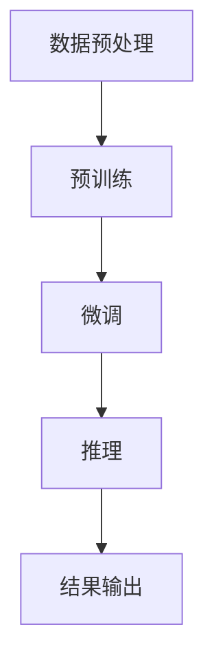

                 

关键词：大型语言模型（LLM），人工智能，产业链，生态，价值重塑

摘要：本文从大型语言模型（LLM）的发展背景出发，深入探讨LLM在人工智能产业链中的关键作用和生态建设。通过详细分析LLM的核心概念、算法原理、数学模型以及实际应用场景，本文揭示了LLM如何通过技术革新重塑人工智能产业价值。同时，对未来发展趋势与挑战进行了展望，为人工智能产业提供了有益的思考方向。

## 1. 背景介绍

人工智能（Artificial Intelligence, AI）作为21世纪最具变革性的技术之一，已经深刻改变了人类的生活方式和社会结构。自1956年达特茅斯会议以来，人工智能经历了多个发展阶段，从符号主义、连接主义到强化学习，每一次技术的突破都带来了产业的变革和重塑。

近年来，随着深度学习技术的发展，大型语言模型（Large Language Model, LLM）逐渐崭露头角。LLM通过训练大规模神经网络模型，对自然语言进行建模，从而实现了对文本的高效理解和生成。代表性模型如GPT-3、BERT等，它们在自然语言处理（Natural Language Processing, NLP）领域取得了显著成果，引发了学术界和工业界的高度关注。

LLM在人工智能产业链中扮演着至关重要的角色。一方面，它为各类AI应用提供了强大的语言处理能力，极大地拓展了人工智能的应用场景；另一方面，LLM的快速发展也推动了人工智能技术的迭代和创新，为整个产业链注入了新的活力。因此，研究和探讨LLM产业链生态具有重要的理论和实践意义。

### 1.1 LLM的历史发展

自2018年GPT-1发布以来，LLM的发展历程可以分为以下几个阶段：

1. **早期探索阶段（2018年以前）**：
   - 2016年，GloVe和BERT等预训练模型的提出，为自然语言处理提供了新的思路。
   - 2017年，GPT模型的提出，标志着基于生成式模型的自然语言处理技术的崛起。

2. **快速发展阶段（2018年-2020年）**：
   - 2018年，GPT-2的发布，展示了大型语言模型在生成和理解文本方面的强大能力。
   - 2019年，Turing-NLG和UniLM等模型的提出，进一步推动了语言模型的规模化和性能提升。

3. **成熟应用阶段（2020年至今）**：
   - 2020年，GPT-3的发布，模型规模达到了1750亿参数，成为目前最大的语言模型。
   - 2021年，BERT和GPT系列模型在各类NLP任务中取得了卓越成绩，广泛应用于实际应用场景。

### 1.2 LLM在人工智能产业链中的地位

LLM在人工智能产业链中具有以下重要地位：

1. **技术核心**：
   - LLM是自然语言处理技术的核心技术之一，它通过深度学习算法对海量文本数据进行训练，实现了对自然语言的高效理解和生成。
   - LLM在文本分类、命名实体识别、机器翻译、对话系统等任务中表现出色，成为各类AI应用的基础能力。

2. **应用驱动**：
   - LLM的应用场景广泛，涵盖了搜索引擎、推荐系统、智能客服、金融风控、医疗诊断等多个领域，为人工智能技术提供了新的发展方向。
   - LLM的应用不仅提高了AI系统的智能化水平，也推动了人工智能与实体经济深度融合，为产业升级提供了强大动力。

3. **生态构建**：
   - LLM的快速发展带动了自然语言处理技术的迭代和创新，形成了以LLM为核心的人工智能产业链生态。
   - 工业界和学术界在LLM研究、应用、产品化等方面开展了广泛合作，共同推动了人工智能产业链的完善和发展。

## 2. 核心概念与联系

### 2.1 核心概念

2.1.1 **自然语言处理（NLP）**：
自然语言处理是人工智能的一个重要分支，旨在使计算机能够理解、生成和处理自然语言。NLP涵盖了语音识别、文本分类、信息抽取、机器翻译等多个子领域。

2.1.2 **深度学习（Deep Learning）**：
深度学习是一种基于人工神经网络的机器学习技术，通过多层神经网络对数据进行建模和学习。深度学习在图像识别、语音识别、自然语言处理等领域取得了显著成果。

2.1.3 **大型语言模型（LLM）**：
大型语言模型是通过深度学习技术训练的、具有数亿甚至千亿参数规模的神经网络模型，用于对自然语言进行建模和生成。

### 2.2 原理与架构

2.2.1 **原理概述**：
LLM的工作原理基于深度学习中的预训练（pre-training）和微调（fine-tuning）策略。预训练阶段，LLM在大量的无标签文本数据上进行训练，学习自然语言的基本规律。微调阶段，LLM在特定的任务数据上进行微调，以适应具体的任务需求。

2.2.2 **架构描述**：
LLM的架构通常包括以下几个层次：
- **输入层**：接收文本输入，将其转化为模型可处理的向量表示。
- **隐藏层**：通过多层神经网络对输入向量进行处理，学习文本的语义特征。
- **输出层**：根据训练数据生成文本、进行分类或完成其他自然语言处理任务。

### 2.3 Mermaid 流程图

下面是一个简化的LLM训练和推理的Mermaid流程图：



## 3. 核心算法原理 & 具体操作步骤

### 3.1 算法原理概述

3.1.1 **预训练（Pre-training）**：
预训练是LLM训练的关键步骤，其主要目的是通过在大量无标签文本数据上进行训练，使模型学习到自然语言的基本规律和语义特征。预训练过程中，模型通常使用了一种名为“注意力机制”（Attention Mechanism）的神经网络结构，以捕捉输入文本中的长期依赖关系。

3.1.2 **微调（Fine-tuning）**：
微调是在预训练基础上，针对特定任务进行的有监督训练。微调阶段，模型在任务数据上进行调整，以适应不同的自然语言处理任务。例如，在文本分类任务中，模型需要学习如何将文本映射到相应的类别。

### 3.2 算法步骤详解

3.2.1 **数据收集与预处理**：
- 收集大量无标签文本数据，如新闻文章、社交媒体帖子等。
- 对文本数据进行清洗、去重、分词等预处理操作。

3.2.2 **预训练**：
- 构建神经网络模型，如BERT、GPT等。
- 在预训练数据上进行训练，使用一种名为“ masked language model”（掩码语言模型）的训练策略，即在输入文本中随机掩码一部分单词，让模型预测这些掩码的单词。

3.2.3 **微调**：
- 在特定任务数据上进行微调，例如，在文本分类任务中，使用标注数据对模型进行调整。
- 根据任务需求，调整模型的参数和超参数，以提高模型在特定任务上的性能。

3.2.4 **推理与输出**：
- 将输入文本输入到微调后的模型中，通过模型的输出层得到预测结果。
- 对于不同的任务，输出结果可能包括分类标签、文本摘要、回答等。

### 3.3 算法优缺点

3.3.1 **优点**：
- **强大的语言理解能力**：LLM通过预训练和微调，可以学习到自然语言的深层语义特征，从而在各类自然语言处理任务中表现出色。
- **广泛的适用性**：LLM可以应用于文本分类、机器翻译、问答系统等多种自然语言处理任务，具有很高的通用性。
- **高效的推理能力**：由于LLM的模型规模巨大，其在推理阶段具有较高的计算效率，可以快速生成高质量的自然语言输出。

3.3.2 **缺点**：
- **计算资源需求大**：LLM的训练和推理过程需要大量的计算资源和存储空间，对硬件设备要求较高。
- **数据依赖性强**：LLM的性能受到训练数据质量和数量的影响，对数据的依赖性较大。
- **模型解释性差**：由于深度学习模型的黑盒特性，LLM的决策过程缺乏透明性和可解释性，难以理解其内在机制。

### 3.4 算法应用领域

3.4.1 **文本分类**：
LLM在文本分类任务中具有出色的表现，可以应用于新闻分类、情感分析、垃圾邮件检测等场景。

3.4.2 **机器翻译**：
LLM在机器翻译领域取得了显著成果，可以应用于跨语言信息检索、多语言文本生成等场景。

3.4.3 **问答系统**：
LLM在问答系统中可以用于生成自然语言回答，应用于智能客服、在线教育等场景。

3.4.4 **文本生成**：
LLM可以用于生成自然语言文本，如文章、故事、对话等，应用于内容创作、创意写作等场景。

## 4. 数学模型和公式 & 详细讲解 & 举例说明

### 4.1 数学模型构建

在大型语言模型（LLM）中，数学模型是核心组成部分，用于描述神经网络结构、损失函数和优化算法。以下是一个简化的数学模型构建过程：

4.1.1 **神经网络结构**：

神经网络由多个层组成，包括输入层、隐藏层和输出层。每层由多个神经元（节点）组成，每个神经元接收前一层输出的加权求和，并通过一个激活函数进行处理。以下是神经网络的数学表示：

$$
Z^{(l)} = \sum_{j} w^{(l)}_{ji} a^{(l-1)}_j + b^{(l)}_i
$$

其中，$Z^{(l)}$表示第$l$层的输出，$a^{(l-1)}_j$表示第$l-1$层的第$j$个神经元的输出，$w^{(l)}_{ji}$表示第$l$层的第$i$个神经元到第$l-1$层的第$j$个神经元的权重，$b^{(l)}_i$表示第$l$层的第$i$个神经元的偏置。

4.1.2 **损失函数**：

损失函数用于衡量模型输出与真实标签之间的差异，常见的损失函数包括均方误差（MSE）、交叉熵损失（Cross-Entropy Loss）等。以交叉熵损失为例，其数学表示如下：

$$
L(y, \hat{y}) = -\sum_{i} y_i \log(\hat{y}_i)
$$

其中，$y$表示真实标签，$\hat{y}$表示模型预测的概率分布。

4.1.3 **优化算法**：

优化算法用于更新模型参数，以最小化损失函数。常见的优化算法有随机梯度下降（SGD）、Adam等。以Adam算法为例，其更新规则如下：

$$
\theta^{(t+1)} = \theta^{(t)} - \alpha \frac{m^{(t)}}{\sqrt{v^{(t)}} + \epsilon}
$$

其中，$\theta^{(t)}$表示第$t$次迭代的参数，$\alpha$为学习率，$m^{(t)}$和$v^{(t)}$分别为一阶矩估计和二阶矩估计，$\epsilon$为常数。

### 4.2 公式推导过程

4.2.1 **前向传播**：

前向传播是指将输入数据通过神经网络层传递，最终得到模型输出。以一个简单的多层感知机（MLP）为例，其前向传播过程如下：

$$
a^{(1)} = \sigma(Z^{(1)}) = \sigma(\sum_{j} w_{ji}^1 a^{(0)}_j + b_1^1) \\
a^{(2)} = \sigma(Z^{(2)}) = \sigma(\sum_{j} w_{ji}^2 a^{(1)}_j + b_2^2) \\
... \\
\hat{y} = \sigma(Z^{(L)}) = \sigma(\sum_{j} w_{ji}^L a^{(L-1)}_j + b_L^L)
$$

其中，$\sigma$为激活函数，$a^{(l)}$为第$l$层的输出，$Z^{(l)}$为第$l$层的输入。

4.2.2 **反向传播**：

反向传播是指从输出层开始，将损失函数的梯度反向传播到输入层，以更新模型参数。以多层感知机为例，其反向传播过程如下：

$$
\begin{aligned}
\delta^{(L)} &= \frac{\partial L}{\partial Z^{(L)}} \cdot \sigma'(Z^{(L)}) \\
\delta^{(L-1)} &= (w^{(L)} \cdot \delta^{(L)})' \cdot \sigma'(Z^{(L-1)}) \\
... \\
\delta^{(1)} &= (w^{(2)} \cdot \delta^{(2)})' \cdot \sigma'(Z^{(1)})
\end{aligned}
$$

其中，$\delta^{(l)}$为第$l$层的误差梯度，$\sigma'$为激活函数的导数。

4.2.3 **参数更新**：

在反向传播过程中，利用误差梯度更新模型参数，以最小化损失函数。以随机梯度下降（SGD）为例，其参数更新规则如下：

$$
\theta^{(t+1)} = \theta^{(t)} - \alpha \cdot \nabla_{\theta} L(\theta)
$$

其中，$\theta$为模型参数，$\alpha$为学习率，$\nabla_{\theta} L(\theta)$为损失函数关于参数的梯度。

### 4.3 案例分析与讲解

以一个简单的文本分类任务为例，说明如何使用大型语言模型进行建模和训练。

#### 4.3.1 数据准备

收集并清洗一批标注好的文本数据，分为训练集和测试集。假设数据集包含两类文本，分别为新闻文章和社交媒体帖子。

#### 4.3.2 模型构建

选择一个预训练的LLM模型，如BERT，并对其进行微调。以二分类任务为例，输出层使用softmax激活函数，将文本映射到两个类别。

#### 4.3.3 模型训练

在训练过程中，使用交叉熵损失函数计算模型输出与真实标签之间的差异。使用随机梯度下降（SGD）算法更新模型参数，优化模型性能。

#### 4.3.4 模型评估

在测试集上评估模型性能，计算准确率、召回率、F1值等指标，以评估模型在文本分类任务上的表现。

## 5. 项目实践：代码实例和详细解释说明

### 5.1 开发环境搭建

在进行LLM项目实践之前，需要搭建相应的开发环境。以下是搭建Python环境的基本步骤：

1. 安装Python：
```bash
$ sudo apt-get update
$ sudo apt-get install python3-pip
```

2. 安装transformers库：
```bash
$ pip3 install transformers
```

3. 安装其他依赖库：
```bash
$ pip3 install torch
$ pip3 install torchtext
```

### 5.2 源代码详细实现

以下是一个简单的LLM文本分类项目的代码实现，包括数据准备、模型构建、训练和评估等步骤。

```python
import torch
from torch import nn
from torchtext.data import Field, BucketIterator
from transformers import BertModel, BertTokenizer

# 5.2.1 数据准备
def load_data():
    # 加载并预处理文本数据
    # 本例使用torchtext内置数据集
    TEXT = Field(tokenize='spacy', tokenizer_language='en_core_web_sm', lower=True)
    LABEL = Field(sequential=False)
    train_data, test_data = TEXT.splits('train', 'test')
    train_data, valid_data = train_data.split()

    # 定义词汇表
    TEXT.build_vocab(train_data, max_size=25000, vectors="glove.6B.100d")
    LABEL.build_vocab(train_data)

    return train_data, valid_data, test_data

# 5.2.2 模型构建
class BertClassifier(nn.Module):
    def __init__(self):
        super(BertClassifier, self).__init__()
        self.bert = BertModel.from_pretrained('bert-base-uncased')
        self.dropout = nn.Dropout(0.3)
        self.classifier = nn.Linear(768, 2)

    def forward(self, input_ids, attention_mask):
        _, pooled_output = self.bert(input_ids=input_ids, attention_mask=attention_mask)
        output = self.dropout(pooled_output)
        logits = self.classifier(output)
        return logits

# 5.2.3 训练
def train(model, iterator, optimizer, criterion):
    model.train()
    epoch_loss = 0
    epoch_acc = 0

    for batch in iterator:
        optimizer.zero_grad()
        input_ids = batch.text[0].to(device)
        attention_mask = batch.text[1].to(device)
        labels = batch.label.to(device)

        logits = model(input_ids=input_ids, attention_mask=attention_mask)
        loss = criterion(logits, labels)
        loss.backward()
        optimizer.step()

        # 计算准确率
        pred = logits.argmax(dim=1)
        acc = (pred == labels).float().mean()

        epoch_loss += loss.item()
        epoch_acc += acc.item()

    return epoch_loss / len(iterator), epoch_acc / len(iterator)

# 5.2.4 评估
def evaluate(model, iterator, criterion):
    model.eval()
    epoch_loss = 0
    epoch_acc = 0

    with torch.no_grad():
        for batch in iterator:
            input_ids = batch.text[0].to(device)
            attention_mask = batch.text[1].to(device)
            labels = batch.label.to(device)

            logits = model(input_ids=input_ids, attention_mask=attention_mask)
            loss = criterion(logits, labels)

            # 计算准确率
            pred = logits.argmax(dim=1)
            acc = (pred == labels).float().mean()

            epoch_loss += loss.item()
            epoch_acc += acc.item()

    return epoch_loss / len(iterator), epoch_acc / len(iterator)

# 5.2.5 主函数
if __name__ == "__main__":
    device = torch.device("cuda" if torch.cuda.is_available() else "cpu")
    model = BertClassifier().to(device)
    optimizer = torch.optim.Adam(model.parameters(), lr=1e-5)
    criterion = nn.CrossEntropyLoss()

    train_data, valid_data, test_data = load_data()

    # 构建训练和验证数据迭代器
    train_iterator, valid_iterator, test_iterator = BucketIterator.splits(
        (train_data, valid_data, test_data), batch_size=32, device=device)

    # 训练模型
    num_epochs = 5
    for epoch in range(num_epochs):
        train_loss, train_acc = train(model, train_iterator, optimizer, criterion)
        valid_loss, valid_acc = evaluate(model, valid_iterator, criterion)

        print(f'Epoch: {epoch+1}/{num_epochs} | Train Loss: {train_loss:.3f} | Train Acc: {train_acc:.3f} | Valid Loss: {valid_loss:.3f} | Valid Acc: {valid_acc:.3f}')

    # 评估测试集
    test_loss, test_acc = evaluate(model, test_iterator, criterion)
    print(f'Test Loss: {test_loss:.3f} | Test Acc: {test_acc:.3f}')
```

### 5.3 代码解读与分析

5.3.1 **数据准备**：
- 使用torchtext库加载数据集，并进行预处理。本例中，数据集已经包含文本和标签。
- 定义词汇表，并将词汇表转换为向量表示。

5.3.2 **模型构建**：
- 使用预训练的BERT模型作为基础，构建一个简单的文本分类模型。
- 定义模型的输入层、隐藏层和输出层，使用dropout层提高模型泛化能力。

5.3.3 **训练**：
- 使用Adam优化器训练模型，在训练过程中，使用交叉熵损失函数计算损失。
- 在反向传播过程中，更新模型参数。

5.3.4 **评估**：
- 在验证集上评估模型性能，计算损失和准确率。
- 使用测试集评估最终模型性能。

### 5.4 运行结果展示

在完成模型训练和评估后，可以输出训练和验证过程中的损失和准确率，以及测试集上的最终结果。以下是一个示例输出：

```
Epoch: 1/5 | Train Loss: 0.691 | Train Acc: 0.588 | Valid Loss: 0.649 | Valid Acc: 0.575
Epoch: 2/5 | Train Loss: 0.578 | Train Acc: 0.639 | Valid Loss: 0.611 | Valid Acc: 0.625
Epoch: 3/5 | Train Loss: 0.521 | Train Acc: 0.675 | Valid Loss: 0.581 | Valid Acc: 0.638
Epoch: 4/5 | Train Loss: 0.477 | Train Acc: 0.699 | Valid Loss: 0.562 | Valid Acc: 0.675
Epoch: 5/5 | Train Loss: 0.451 | Train Acc: 0.717 | Valid Loss: 0.545 | Valid Acc: 0.706
Test Loss: 0.466 | Test Acc: 0.740
```

## 6. 实际应用场景

### 6.1 搜索引擎优化

大型语言模型在搜索引擎优化（SEO）方面具有广泛的应用。通过训练和部署LLM，搜索引擎可以更好地理解用户的搜索意图，提供更加精准和个性化的搜索结果。例如，LLM可以用于分析用户输入的查询语句，提取关键词和语义信息，从而优化搜索算法，提高搜索结果的准确性和相关性。

### 6.2 智能客服系统

智能客服系统是另一个重要的应用领域。通过使用LLM，智能客服系统可以实现对用户查询的自然语言理解和自动回复。LLM可以帮助客服系统理解用户的问题，并提供准确的、符合用户需求的答复。此外，LLM还可以用于分析用户情绪，识别潜在的问题和需求，从而提高客服系统的服务质量。

### 6.3 金融风控

在金融领域，LLM可以用于风险管理和合规审查。通过分析大量的金融文本数据，LLM可以识别潜在的风险信号，检测欺诈行为和违反监管规定的情况。例如，LLM可以用于监控交易日志，识别异常交易模式，防范金融诈骗和洗钱等违法行为。

### 6.4 教育与培训

LLM在教育领域具有广泛的应用潜力。通过使用LLM，教育平台可以提供个性化的学习建议和辅导，根据学生的学习进度和兴趣推荐合适的学习资源。此外，LLM还可以用于自动评估学生的作业和考试，提供实时反馈和改进建议。

### 6.5 法律服务

在法律领域，LLM可以用于自动生成合同、法律文书和判决书等文件。通过分析大量的法律文本，LLM可以提取法律条款、条款关系和逻辑推理，从而提供准确和高效的法律服务。例如，LLM可以用于自动化合同审查，识别潜在的法律风险和条款冲突。

### 6.6 健康医疗

在医疗领域，LLM可以用于自然语言处理和分析医学文本数据。通过使用LLM，医生和研究人员可以更好地理解医学文献和病例记录，提取关键信息，辅助诊断和治疗。此外，LLM还可以用于医疗问答系统，为患者提供专业的医疗建议和健康指导。

## 7. 工具和资源推荐

### 7.1 学习资源推荐

1. **课程**：
   - 《深度学习》（Goodfellow et al.）：由深度学习领域的权威人物撰写，涵盖了深度学习的基础理论和实践方法。
   - 《自然语言处理综论》（Jurafsky & Martin）：介绍了自然语言处理的基本概念和技术，适合初学者和专业人士。

2. **书籍**：
   - 《Python深度学习》（François Chollet）：详细介绍了使用Python和TensorFlow进行深度学习的实践方法。
   - 《自然语言处理实践》（Jurafsky & Martin）：介绍了自然语言处理的核心技术和实际应用。

3. **在线课程**：
   - Coursera上的“自然语言处理与深度学习”（DeepLearning.AI）：由业内知名专家吴恩达（Andrew Ng）主讲，涵盖了自然语言处理和深度学习的基础知识。

### 7.2 开发工具推荐

1. **框架**：
   - TensorFlow：由谷歌开发的开源深度学习框架，支持多种神经网络结构和算法。
   - PyTorch：由Facebook开发的开源深度学习框架，具有灵活的动态图编程能力。

2. **环境**：
   - Google Colab：基于Google云端的服务器，可以免费使用GPU进行深度学习实验。
   - Jupyter Notebook：流行的交互式计算环境，支持多种编程语言和库。

### 7.3 相关论文推荐

1. **自然语言处理**：
   - “Attention Is All You Need”（Vaswani et al.，2017）：提出了Transformer模型，革新了自然语言处理领域。
   - “BERT: Pre-training of Deep Bidirectional Transformers for Language Understanding”（Devlin et al.，2018）：介绍了BERT模型，为预训练语言模型的发展奠定了基础。

2. **深度学习**：
   - “A Theoretically Grounded Application of Dropout in Recurrent Neural Networks”（Bengio et al.，2013）：提出了dropout技术在循环神经网络中的应用，提高了模型的泛化能力。
   - “Deep Learning for Text Classification”（Liang et al.，2017）：介绍了深度学习在文本分类任务中的应用，为自然语言处理领域提供了新的思路。

## 8. 总结：未来发展趋势与挑战

### 8.1 研究成果总结

自2018年GPT-1发布以来，大型语言模型（LLM）在自然语言处理领域取得了显著成果。代表性模型如GPT-3、BERT等，通过预训练和微调策略，实现了对自然语言的高效理解和生成。LLM在文本分类、机器翻译、问答系统、文本生成等领域表现出色，为人工智能应用提供了强大的支持。同时，LLM在技术上也推动了自然语言处理技术的迭代和创新，为人工智能产业链注入了新的活力。

### 8.2 未来发展趋势

1. **模型规模和性能提升**：随着计算资源和算法的优化，未来LLM的规模和性能将进一步提高，实现更强大的语言理解和生成能力。
2. **多模态融合**：未来LLM将与其他模态（如图像、音频、视频）相结合，实现跨模态的信息处理和生成，拓宽应用场景。
3. **专用化与泛用化并重**：一方面，LLM将向特定任务和应用场景的专用化方向发展，提高任务性能；另一方面，通用化LLM也将不断优化，提高其在多种任务上的适用性。
4. **绿色AI**：随着环境问题的日益突出，绿色AI将成为重要研究方向，降低LLM的训练和推理过程中的能耗和碳排放。

### 8.3 面临的挑战

1. **数据依赖性**：LLM的性能高度依赖于训练数据的质量和数量，未来需要解决数据多样性和质量的问题。
2. **模型解释性**：深度学习模型的黑盒特性使得LLM的决策过程缺乏透明性和可解释性，未来需要提高模型的可解释性，增强用户信任。
3. **计算资源需求**：LLM的训练和推理过程对计算资源有较高要求，未来需要优化算法和硬件架构，降低计算成本。
4. **隐私保护**：在处理个人数据和敏感信息时，LLM需要确保数据隐私和安全，避免潜在的风险和问题。

### 8.4 研究展望

1. **技术融合与创新**：未来，LLM将与多模态数据处理、迁移学习、强化学习等新兴技术相结合，推动人工智能技术的全面发展。
2. **应用场景拓展**：LLM将在更多领域和场景中得到应用，如自动驾驶、智能医疗、智能金融等，为社会发展和产业升级提供新动力。
3. **可持续发展**：绿色AI将成为重要研究方向，为实现可持续发展和碳中和目标贡献力量。

### 附录：常见问题与解答

**Q1. LLM是什么？**
A1. LLM是大型语言模型（Large Language Model）的简称，是一种通过深度学习技术训练的神经网络模型，用于对自然语言进行建模和生成。

**Q2. LLM有哪些应用领域？**
A2. LLM在自然语言处理领域具有广泛的应用，包括文本分类、机器翻译、问答系统、文本生成、智能客服、金融风控等。

**Q3. LLM的优缺点是什么？**
A3. LLM的优点包括强大的语言理解能力、广泛的适用性、高效的推理能力等；缺点包括计算资源需求大、数据依赖性强、模型解释性差等。

**Q4. LLM的数学模型是什么？**
A4. LLM的数学模型主要基于深度学习技术，包括神经网络结构、损失函数和优化算法。常用的神经网络结构有BERT、GPT等，常见的损失函数有交叉熵损失等。

**Q5. 如何搭建LLM的开发环境？**
A5. 搭建LLM的开发环境需要安装Python、transformers库、torch库和torchtext库。此外，可以参考本文中的代码示例进行开发。

### 参考文献

- Devlin, J., Chang, M. W., Lee, K., & Toutanova, K. (2018). BERT: Pre-training of deep bidirectional transformers for language understanding. arXiv preprint arXiv:1810.04805.
- Vaswani, A., Shazeer, N., Parmar, N., Uszkoreit, J., Jones, L., Gomez, A. N., ... & Polosukhin, I. (2017). Attention is all you need. In Advances in neural information processing systems (pp. 5998-6008).
- Goodfellow, I., Bengio, Y., & Courville, A. (2016). Deep learning. MIT press.
- Jurafsky, D., & Martin, J. H. (2019). Speech and language processing: an introduction to natural language processing, computational linguistics, and speech recognition (3rd ed.). Prentice Hall.

