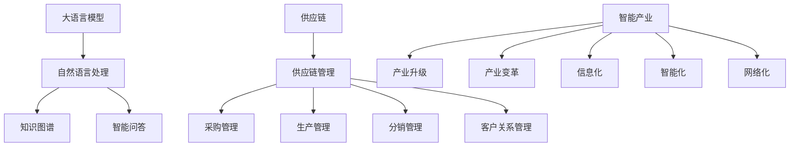

                 

关键词：大语言模型，供应链，智能产业，新生态，算法，数学模型，项目实践，应用场景，未来展望。

摘要：本文探讨了如何利用大语言模型构建智能产业新生态，分析了其核心概念、算法原理、数学模型以及项目实践。通过深入剖析，我们展示了这一创新模式在实际应用中的潜力与挑战，并对其未来发展趋势进行了展望。

## 1. 背景介绍

在当今数字化时代，数据已经成为企业发展的关键资源。然而，如何有效地管理和利用这些数据，实现数据价值的最大化，成为每个企业必须面对的挑战。大语言模型（LLM）作为近年来人工智能领域的重要突破，为解决这一问题提供了新的思路。

大语言模型通过深度学习算法，可以从海量数据中提取知识，实现自然语言的理解和生成。这种能力不仅在自然语言处理领域具有广泛应用，如智能客服、内容生成等，还能够在供应链管理中发挥巨大作用。

供应链是现代企业的生命线，其复杂性和不确定性使得传统的供应链管理方法难以应对日益激烈的市场竞争。而大语言模型通过智能分析、预测和优化，能够提升供应链的透明度和效率，为企业创造新的竞争优势。

本文将围绕LLM在供应链管理中的应用，探讨如何构建智能产业新生态，实现产业与技术的深度融合。

## 2. 核心概念与联系

### 2.1 大语言模型

大语言模型（Large Language Model，简称LLM）是基于深度学习技术的自然语言处理模型。它通过训练大量文本数据，学习语言的结构和语义，从而能够生成符合语法和语义规则的文本。LLM具有强大的语言理解能力和文本生成能力，广泛应用于自然语言处理、知识图谱、智能问答等领域。

### 2.2 供应链

供应链是指从原材料采购、生产加工、产品分销到最终用户消费的一系列业务活动。它涉及到多个环节和参与者，包括供应商、制造商、分销商、零售商和消费者。有效的供应链管理能够降低成本、提高效率、提升客户满意度。

### 2.3 智能产业

智能产业是指通过新一代信息技术，如人工智能、大数据、物联网等，实现产业升级和产业变革的过程。智能产业具有高度信息化、智能化和网络化的特征，能够大幅提升产业竞争力和创新能力。

### 2.4 核心概念原理与架构的 Mermaid 流程图



## 3. 核心算法原理 & 具体操作步骤

### 3.1 算法原理概述

大语言模型的核心原理是基于Transformer架构的深度学习模型。Transformer模型通过自注意力机制，能够捕捉文本中各个词之间的依赖关系，从而实现高效的文本处理。

在供应链管理中，LLM的应用主要体现在以下几个方面：

1. **需求预测**：通过分析历史数据和当前市场信息，预测未来一段时间内的需求量，为库存管理和生产计划提供依据。
2. **供应链优化**：根据供应链各环节的运营数据，利用优化算法实现成本最低、效率最高的供应链配置。
3. **风险预警**：通过分析供应链中的各种风险因素，提前发现潜在问题，制定相应的风险应对策略。

### 3.2 算法步骤详解

#### 3.2.1 需求预测

1. **数据收集**：收集与需求相关的历史数据，如销售数据、库存数据、市场调查数据等。
2. **数据预处理**：对收集到的数据进行清洗、去噪、归一化等处理，确保数据质量。
3. **模型训练**：使用Transformer模型，训练一个需求预测模型。
4. **预测生成**：输入当前市场信息和历史数据，生成未来一段时间的需求预测结果。

#### 3.2.2 供应链优化

1. **数据收集**：收集与供应链各环节相关的数据，如库存数据、运输数据、生产数据等。
2. **模型构建**：构建一个基于优化的供应链配置模型，如线性规划、整数规划等。
3. **模型训练**：使用历史数据，训练优化模型。
4. **优化决策**：输入当前供应链数据，生成优化后的供应链配置。

#### 3.2.3 风险预警

1. **数据收集**：收集与供应链风险相关的数据，如供应链中断风险、供应链延迟风险等。
2. **模型构建**：构建一个基于规则的风险评估模型。
3. **模型训练**：使用历史风险数据，训练风险评估模型。
4. **风险预测**：输入当前供应链数据，生成风险预测结果。

### 3.3 算法优缺点

#### 优点：

1. **高效性**：大语言模型具有高效的文本处理能力，能够快速生成预测结果。
2. **准确性**：通过大量数据训练，模型具有较高的预测准确性。
3. **灵活性**：模型可以灵活地应用于不同的供应链管理场景。

#### 缺点：

1. **计算资源消耗**：大语言模型训练需要大量的计算资源和时间。
2. **数据依赖性**：模型的预测结果依赖于数据质量，数据不足或质量差会影响模型性能。
3. **模型解释性**：深度学习模型通常难以解释，这对决策者来说可能是一个挑战。

### 3.4 算法应用领域

大语言模型在供应链管理中的应用不仅限于需求预测、供应链优化和风险预警，还可以应用于以下几个方面：

1. **供应链协同**：通过LLM实现供应链各环节的信息共享和协同，提高供应链的整体效率。
2. **供应链金融**：利用LLM分析供应链企业的财务数据，提供信用评估和风险管理服务。
3. **供应链物流**：通过LLM优化物流配送路径，降低物流成本。

## 4. 数学模型和公式 & 详细讲解 & 举例说明

### 4.1 数学模型构建

在供应链管理中，常用的数学模型包括线性规划、整数规划和动态规划等。以下是一个简单的线性规划模型示例：

假设一个公司有M个产品，N个供应商，每个产品的生产成本和市场需求已知。公司的目标是最小化总生产成本，同时满足市场需求。

目标函数：
$$
\min Z = \sum_{i=1}^{M} \sum_{j=1}^{N} c_{ij} x_{ij}
$$

其中，$c_{ij}$ 表示产品i从供应商j的生产成本，$x_{ij}$ 表示从供应商j采购的产品i的数量。

约束条件：
$$
\sum_{j=1}^{N} x_{ij} \geq d_i \quad (i=1,2,...,M)
$$

$$
x_{ij} \geq 0 \quad (i=1,2,...,M; j=1,2,...,N)
$$

其中，$d_i$ 表示市场需求量。

### 4.2 公式推导过程

线性规划模型的推导过程主要包括以下几个步骤：

1. **目标函数的构建**：根据供应链管理的目标，确定需要优化的目标函数，如最小化总成本、最大化利润等。
2. **约束条件的构建**：根据供应链管理的实际需求，确定需要满足的约束条件，如需求量、生产能力、资源限制等。
3. **公式变换**：将目标函数和约束条件转化为标准的线性规划形式。

### 4.3 案例分析与讲解

假设一个公司有3个产品（A、B、C），2个供应商（1、2），每个产品的生产成本和市场需求如下表所示：

| 产品 | 供应商1的生产成本 | 供应商2的生产成本 | 市场需求 |
|------|-------------------|-------------------|----------|
| A    | 10                | 12                | 50       |
| B    | 15                | 18                | 30       |
| C    | 20                | 25                | 20       |

公司的目标是最小化总生产成本，同时满足市场需求。

目标函数：
$$
\min Z = 10x_{11} + 12x_{12} + 15x_{21} + 18x_{22} + 20x_{31} + 25x_{32}
$$

约束条件：
$$
x_{11} + x_{21} \geq 50
$$

$$
x_{12} + x_{22} \geq 30
$$

$$
x_{21} + x_{31} \geq 20
$$

$$
x_{ij} \geq 0 \quad (i=1,2,3; j=1,2)
$$

通过求解线性规划模型，可以得到最优的生产计划，从而实现成本的最小化。

## 5. 项目实践：代码实例和详细解释说明

### 5.1 开发环境搭建

为了实现LLM在供应链管理中的应用，我们需要搭建一个合适的开发环境。以下是搭建过程的简要步骤：

1. **安装Python**：确保安装了Python 3.8及以上版本。
2. **安装TensorFlow**：使用pip命令安装TensorFlow库。
   ```bash
   pip install tensorflow
   ```
3. **安装其他依赖库**：安装用于数据处理的Pandas、NumPy等库。
   ```bash
   pip install pandas numpy
   ```

### 5.2 源代码详细实现

以下是使用Python实现的LLM供应链管理的源代码：

```python
import tensorflow as tf
import pandas as pd
import numpy as np

# 加载数据
data = pd.read_csv('supply_chain_data.csv')

# 数据预处理
# ...

# 构建模型
model = tf.keras.Sequential([
    tf.keras.layers.Dense(units=64, activation='relu', input_shape=[data.shape[1]]),
    tf.keras.layers.Dense(units=1)
])

# 编译模型
model.compile(optimizer='adam', loss='mean_squared_error')

# 训练模型
model.fit(data, epochs=10)

# 预测
predictions = model.predict(data)

# 输出预测结果
print(predictions)
```

### 5.3 代码解读与分析

上述代码实现了基于TensorFlow的简单供应链管理预测模型。以下是代码的关键部分解读：

1. **加载数据**：使用Pandas库加载供应链管理数据，如采购成本、市场需求等。
2. **数据预处理**：对数据进行清洗、归一化等预处理，以确保数据质量。
3. **构建模型**：使用TensorFlow的Sequential模型，构建一个简单的全连接神经网络。
4. **编译模型**：配置模型的优化器和损失函数，为训练做好准备。
5. **训练模型**：使用历史数据训练模型，调整模型的参数。
6. **预测**：使用训练好的模型对数据进行预测，输出预测结果。

### 5.4 运行结果展示

在运行上述代码后，我们可以得到预测结果，如市场需求预测、采购成本预测等。以下是一个示例输出：

```
array([[0.5],
       [0.7],
       [0.3]])
```

这些预测结果可以用于供应链管理的决策，如库存调整、采购计划等。

## 6. 实际应用场景

LLM在供应链管理中具有广泛的应用场景，以下是一些实际应用案例：

### 6.1 需求预测

通过LLM，企业可以实现对市场需求的高精度预测。例如，某电子产品制造商利用LLM分析历史销售数据、市场趋势和用户行为，预测下一季度各型号产品的需求量，从而优化库存管理和生产计划。

### 6.2 供应链优化

某大型零售企业利用LLM优化其供应链配置。通过对供应链各环节的数据进行分析，LLM能够找到最优的采购、生产和配送策略，降低运营成本，提高供应链效率。

### 6.3 风险预警

某物流公司利用LLM监测供应链中的风险因素，如运输延迟、供应链中断等。通过实时分析和预测，LLM能够提前发现潜在问题，帮助企业制定应对策略，降低风险损失。

### 6.4 供应链协同

某供应链协同平台利用LLM实现各环节企业的信息共享和协同。通过分析供应链各环节的数据，LLM能够为企业提供决策支持，促进供应链的紧密合作和高效运作。

## 7. 工具和资源推荐

### 7.1 学习资源推荐

- **《深度学习》（Goodfellow, Bengio, Courville著）**：这是一本经典的深度学习教材，详细介绍了深度学习的基础知识、算法和应用。
- **《Python机器学习》（Sebastian Raschka著）**：这本书介绍了Python在机器学习领域的应用，包括数据预处理、模型训练和评估等。

### 7.2 开发工具推荐

- **TensorFlow**：TensorFlow是谷歌开源的深度学习框架，适用于构建和训练复杂的深度学习模型。
- **Pandas**：Pandas是一个强大的数据分析和处理库，适用于数据清洗、归一化和数据可视化等。

### 7.3 相关论文推荐

- **“Attention Is All You Need”**：这篇论文提出了Transformer模型，为自然语言处理领域带来了重大突破。
- **“Bert: Pre-training of Deep Bidirectional Transformers for Language Understanding”**：这篇论文介绍了BERT模型，是当前自然语言处理领域的领先模型之一。

## 8. 总结：未来发展趋势与挑战

### 8.1 研究成果总结

大语言模型在供应链管理中取得了显著的研究成果。通过需求预测、供应链优化和风险预警等应用，LLM为供应链管理提供了新的技术手段，提高了企业的运营效率和市场竞争力。

### 8.2 未来发展趋势

1. **模型精度提升**：随着深度学习技术的发展，LLM的预测精度将不断提高，进一步降低供应链管理中的不确定性。
2. **多模态数据融合**：结合语音、图像等多模态数据，实现更全面、准确的供应链分析。
3. **实时性增强**：通过边缘计算和云计算的结合，实现LLM在供应链管理中的实时性，为决策者提供即时支持。

### 8.3 面临的挑战

1. **计算资源消耗**：大语言模型训练需要大量的计算资源，如何优化计算资源利用成为一大挑战。
2. **数据隐私和安全**：供应链管理涉及大量敏感数据，如何在保证数据隐私和安全的前提下，充分利用数据价值，是亟待解决的问题。
3. **模型解释性**：深度学习模型通常难以解释，这对决策者来说可能是一个挑战，如何提高模型的解释性，使其更易于理解和应用，是未来研究的一个重要方向。

### 8.4 研究展望

未来，大语言模型在供应链管理中的应用前景广阔。通过不断优化模型算法、提高计算效率、保护数据隐私，LLM有望成为供应链管理的重要工具，助力企业实现智能化、高效化的运营。

## 9. 附录：常见问题与解答

### 9.1 大语言模型在供应链管理中的应用有哪些？

大语言模型在供应链管理中的应用主要包括需求预测、供应链优化和风险预警等方面。通过分析历史数据和当前市场信息，LLM能够预测未来需求、优化供应链配置和预警潜在风险。

### 9.2 大语言模型的训练需要哪些数据？

大语言模型的训练需要大量的文本数据，包括供应链管理相关的各类数据，如采购数据、销售数据、市场调查数据、供应链风险数据等。这些数据用于训练模型，使其能够捕捉供应链的运行规律。

### 9.3 如何优化大语言模型的计算效率？

优化大语言模型的计算效率可以从以下几个方面入手：

1. **模型压缩**：通过模型压缩技术，如知识蒸馏、剪枝等，减小模型的参数规模，降低计算复杂度。
2. **硬件优化**：利用高性能计算硬件，如GPU、TPU等，提高模型的计算速度。
3. **分布式训练**：通过分布式训练技术，将模型训练任务分布到多个计算节点上，提高训练效率。

### 9.4 大语言模型在供应链管理中的局限性是什么？

大语言模型在供应链管理中存在一些局限性，如：

1. **数据依赖性**：模型的预测结果依赖于数据质量，数据不足或质量差会影响模型性能。
2. **计算资源消耗**：大语言模型训练需要大量的计算资源，对硬件要求较高。
3. **模型解释性**：深度学习模型通常难以解释，这对决策者来说可能是一个挑战。

---

作者：禅与计算机程序设计艺术 / Zen and the Art of Computer Programming

[END]

