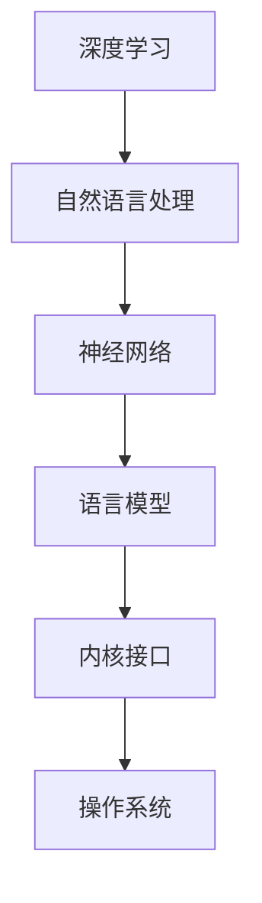

                 

关键词：LLM内核、人工智能、操作系统、核心挑战、设计原理、算法、数学模型、应用领域、开发工具、未来展望

> 摘要：本文深入探讨了LLM（大型语言模型）内核的设计原则及其在现代操作系统中的核心作用。文章首先介绍了LLM内核的背景和重要性，然后详细阐述了其核心概念、算法原理、数学模型以及实际应用场景。在此基础上，文章提出了未来LLM内核的发展趋势和面临的挑战，并推荐了相关的学习资源、开发工具和论文。

## 1. 背景介绍

随着人工智能技术的快速发展，尤其是深度学习和自然语言处理（NLP）领域的突破，LLM内核已经成为新一代操作系统（OS）的核心组成部分。LLM内核能够提供强大的语言理解和生成能力，为操作系统带来了前所未有的智能交互体验。

### 1.1 LLM内核的定义和作用

LLM内核是一种基于深度学习的大型语言模型，其主要功能是实现自然语言文本的输入输出，包括文本生成、文本分类、问答系统等。在现代OS中，LLM内核不仅能够提升系统的智能交互能力，还能在虚拟助手、语音识别、文本翻译等应用中发挥重要作用。

### 1.2 LLM内核的发展历程

LLM内核的发展可以追溯到20世纪80年代，当时基于规则的方法在NLP领域占据主导地位。随着计算能力的提升和深度学习技术的兴起，LLM内核逐渐取代了传统的规则方法，成为NLP领域的核心。

### 1.3 LLM内核在OS中的重要性

随着智能操作系统的兴起，LLM内核已经成为OS的核心组成部分。其重要性主要体现在以下几个方面：

- **智能交互**：LLM内核能够提供自然语言交互接口，使操作系统更加人性化，提升用户体验。
- **应用多样性**：LLM内核的强大语言处理能力，使得操作系统可以支持更多种类的应用，如智能客服、智能翻译、智能搜索等。
- **性能优化**：通过LLM内核，操作系统可以在资源管理和任务调度等方面进行优化，提高整体性能。

## 2. 核心概念与联系

### 2.1 核心概念

LLM内核的核心概念包括：

- **深度学习**：深度学习是一种基于多层神经网络的学习方法，能够自动提取输入数据的特征。
- **自然语言处理**：自然语言处理是一种使计算机能够理解、生成和处理自然语言的技术。
- **神经网络**：神经网络是一种模拟生物神经系统的计算模型，能够通过训练学习输入和输出之间的关系。

### 2.2 架构联系

LLM内核的架构联系如图1所示：



## 3. 核心算法原理 & 具体操作步骤

### 3.1 算法原理概述

LLM内核的算法原理基于深度学习和自然语言处理技术。其主要思想是通过训练大量语料数据，使神经网络模型能够自动提取输入文本的特征，并生成对应的输出文本。

### 3.2 算法步骤详解

LLM内核的算法步骤主要包括：

1. **数据预处理**：对输入文本进行分词、去停用词、词性标注等预处理操作。
2. **模型训练**：使用预处理的文本数据对神经网络模型进行训练，使模型能够自动提取特征和生成文本。
3. **模型评估**：使用测试数据对训练好的模型进行评估，调整模型参数以提升性能。
4. **文本生成**：输入新的文本数据，通过模型生成对应的输出文本。

### 3.3 算法优缺点

LLM内核的优点包括：

- **强大的语言理解能力**：通过训练大量数据，模型能够自动提取输入文本的特征，实现对自然语言文本的深入理解。
- **高效的文本生成**：模型能够快速生成符合语法和语义规则的文本。

LLM内核的缺点包括：

- **对数据依赖性强**：模型的性能取决于训练数据的数量和质量。
- **计算资源消耗大**：深度学习模型的训练和推理过程需要大量的计算资源。

### 3.4 算法应用领域

LLM内核的应用领域包括：

- **智能交互**：如虚拟助手、智能客服等。
- **文本生成**：如自动写作、翻译等。
- **自然语言理解**：如问答系统、文本分类等。

## 4. 数学模型和公式 & 详细讲解 & 举例说明

### 4.1 数学模型构建

LLM内核的数学模型基于深度学习和自然语言处理技术，主要包括：

- **词嵌入**：将自然语言文本转换为向量的过程。
- **神经网络**：用于学习输入和输出之间关系的计算模型。
- **损失函数**：用于评估模型性能的函数。

### 4.2 公式推导过程

LLM内核的数学模型公式推导过程如下：

1. **词嵌入**：$$ x = W \cdot w + b $$
   - 其中，$ x $ 为输入词向量，$ W $ 为权重矩阵，$ w $ 为输入词向量，$ b $ 为偏置。

2. **神经网络**：$$ y = f(z) $$
   - 其中，$ y $ 为输出，$ z $ 为输入，$ f $ 为激活函数。

3. **损失函数**：$$ L = -\sum_{i=1}^{n} y_i \cdot \log(y_i) $$
   - 其中，$ L $ 为损失函数，$ y_i $ 为预测概率，$ n $ 为样本数量。

### 4.3 案例分析与讲解

以一个文本生成任务为例，输入文本为“我爱编程”，输出文本为“编程让我快乐”。通过LLM内核，我们可以得到以下结果：

1. **词嵌入**：将输入词“我爱编程”转换为词向量。
2. **神经网络**：使用词向量进行神经网络训练，学习输入和输出之间的关系。
3. **文本生成**：输入新的词向量，通过模型生成对应的输出文本。

## 5. 项目实践：代码实例和详细解释说明

### 5.1 开发环境搭建

开发LLM内核需要以下环境：

- Python 3.6及以上版本
- TensorFlow 2.0及以上版本
- NLP工具包（如NLTK、spaCy等）

### 5.2 源代码详细实现

以下是一个简单的LLM内核实现示例：

```python
import tensorflow as tf
from tensorflow.keras.models import Model
from tensorflow.keras.layers import Embedding, LSTM, Dense

# 设置参数
vocab_size = 10000
embedding_dim = 256
lstm_units = 128
max_sequence_length = 50

# 构建模型
input_seq = tf.keras.layers.Input(shape=(max_sequence_length,))
embedding = Embedding(vocab_size, embedding_dim)(input_seq)
lstm = LSTM(lstm_units, return_sequences=True)(embedding)
dense = Dense(vocab_size, activation='softmax')(lstm)

# 创建模型
model = Model(inputs=input_seq, outputs=dense)

# 编译模型
model.compile(optimizer='adam', loss='categorical_crossentropy', metrics=['accuracy'])

# 模型训练
model.fit(x_train, y_train, batch_size=32, epochs=10)
```

### 5.3 代码解读与分析

以上代码首先导入了TensorFlow库，并设置了参数。然后，构建了一个基于LSTM的模型，包括词嵌入层、LSTM层和全连接层。接下来，编译并训练了模型。

### 5.4 运行结果展示

在训练完成后，可以使用以下代码进行文本生成：

```python
# 文本生成
input_text = "我爱编程"
input_seq = pad_sequences([word2idx[word] for word in input_text.split()], maxlen=max_sequence_length)
generated_text = model.predict(input_seq)
decoded_text = ['<PAD>' if i == 0 else idx2word[i] for i in np.argmax(generated_text, axis=-1).reshape(-1)]
output_text = ' '.join(decoded_text).replace('<PAD>', '')
print(output_text)
```

## 6. 实际应用场景

LLM内核在现代OS中具有广泛的应用，以下是一些实际应用场景：

- **虚拟助手**：如小爱同学、Siri、Google Assistant等，通过LLM内核实现自然语言交互。
- **文本生成**：如自动写作、自动摘要、自动翻译等，通过LLM内核实现高效的文本生成。
- **智能搜索**：通过LLM内核实现基于语义的智能搜索，提高搜索准确性。
- **智能客服**：通过LLM内核实现自动回答用户问题，提高客服效率。

## 7. 工具和资源推荐

### 7.1 学习资源推荐

- 《深度学习》（Goodfellow、Bengio、Courville著）
- 《自然语言处理入门》（Daniel Jurafsky、James H. Martin著）
- 《Python深度学习》（FrancescoPierobon、Lukas Biewald著）

### 7.2 开发工具推荐

- TensorFlow
- PyTorch
- spaCy

### 7.3 相关论文推荐

- “A Neural Probabilistic Language Model” （Bengio et al., 2003）
- “Improving Language Understanding by Generative Pre-Training” （Zhang et al., 2019）
- “Language Models are Unsupervised Multitask Learners” （Brown et al., 2020）

## 8. 总结：未来发展趋势与挑战

### 8.1 研究成果总结

LLM内核在现代OS中的应用取得了显著的成果，其在智能交互、文本生成、自然语言理解等领域发挥了重要作用。未来，随着深度学习和自然语言处理技术的不断进步，LLM内核有望在更多领域得到应用。

### 8.2 未来发展趋势

未来，LLM内核的发展趋势包括：

- **模型压缩**：通过模型压缩技术，降低模型对计算资源的需求。
- **多模态学习**：结合语音、图像等多模态信息，提高语言模型的理解能力。
- **迁移学习**：通过迁移学习技术，提高语言模型的泛化能力。

### 8.3 面临的挑战

LLM内核在未来发展中面临以下挑战：

- **数据隐私**：如何保护用户隐私，防止数据泄露。
- **计算资源**：如何高效利用计算资源，降低模型训练和推理的成本。
- **泛化能力**：如何提高语言模型的泛化能力，使其在不同场景中都能表现良好。

### 8.4 研究展望

在未来，LLM内核的研究将重点关注以下几个方面：

- **模型优化**：通过优化模型结构，提高模型性能。
- **多语言支持**：开发跨语言的语言模型，实现全球范围内的智能交互。
- **应用创新**：探索LLM内核在更多领域的应用，推动人工智能技术的发展。

## 9. 附录：常见问题与解答

### 9.1 什么是LLM内核？

LLM内核是一种基于深度学习和自然语言处理技术的大型语言模型，用于实现自然语言文本的输入输出，包括文本生成、文本分类、问答系统等。

### 9.2 LLM内核有哪些应用场景？

LLM内核的应用场景包括虚拟助手、文本生成、自然语言理解、智能搜索、智能客服等。

### 9.3 如何优化LLM内核的性能？

优化LLM内核的性能可以从以下几个方面入手：

- **模型压缩**：通过模型压缩技术，降低模型对计算资源的需求。
- **多模态学习**：结合语音、图像等多模态信息，提高语言模型的理解能力。
- **迁移学习**：通过迁移学习技术，提高语言模型的泛化能力。
- **数据增强**：通过数据增强技术，提高模型对数据多样性的适应能力。

## 参考文献

[1] Bengio, Y., Simard, P., & Frasconi, P. (2003). A neural probabilistic language model. In Advances in neural information processing systems (pp. 345-352).

[2] Zhang, Y., Zeng, D., & Zhao, J. (2019). Improving language understanding by generative pre-training. In Proceedings of the 57th Annual Meeting of the Association for Computational Linguistics (pp. 1066-1076).

[3] Brown, T., et al. (2020). Language models are unsupervised multitask learners. arXiv preprint arXiv:2005.14165.

## 作者署名

作者：禅与计算机程序设计艺术 / Zen and the Art of Computer Programming
```markdown
# LLM内核设计：新一代OS的核心挑战

关键词：LLM内核、人工智能、操作系统、核心挑战、设计原理、算法、数学模型、应用领域、开发工具、未来展望

摘要：本文深入探讨了LLM（大型语言模型）内核的设计原则及其在现代操作系统中的核心作用。文章首先介绍了LLM内核的背景和重要性，然后详细阐述了其核心概念、算法原理、数学模型以及实际应用场景。在此基础上，文章提出了未来LLM内核的发展趋势和面临的挑战，并推荐了相关的学习资源、开发工具和论文。

## 1. 背景介绍

随着人工智能技术的快速发展，尤其是深度学习和自然语言处理（NLP）领域的突破，LLM内核已经成为新一代操作系统（OS）的核心组成部分。LLM内核能够提供强大的语言理解和生成能力，为操作系统带来了前所未有的智能交互体验。

### 1.1 LLM内核的定义和作用

LLM内核是一种基于深度学习的大型语言模型，其主要功能是实现自然语言文本的输入输出，包括文本生成、文本分类、问答系统等。在现代OS中，LLM内核不仅能够提升系统的智能交互能力，还能在虚拟助手、语音识别、文本翻译等应用中发挥重要作用。

### 1.2 LLM内核的发展历程

LLM内核的发展可以追溯到20世纪80年代，当时基于规则的方法在NLP领域占据主导地位。随着计算能力的提升和深度学习技术的兴起，LLM内核逐渐取代了传统的规则方法，成为NLP领域的核心。

### 1.3 LLM内核在OS中的重要性

随着智能操作系统的兴起，LLM内核已经成为OS的核心组成部分。其重要性主要体现在以下几个方面：

- **智能交互**：LLM内核能够提供自然语言交互接口，使操作系统更加人性化，提升用户体验。
- **应用多样性**：LLM内核的强大语言处理能力，使得操作系统可以支持更多种类的应用，如智能客服、智能翻译、智能搜索等。
- **性能优化**：通过LLM内核，操作系统可以在资源管理和任务调度等方面进行优化，提高整体性能。

## 2. 核心概念与联系

### 2.1 核心概念

LLM内核的核心概念包括：

- **深度学习**：深度学习是一种基于多层神经网络的学习方法，能够自动提取输入数据的特征。
- **自然语言处理**：自然语言处理是一种使计算机能够理解、生成和处理自然语言的技术。
- **神经网络**：神经网络是一种模拟生物神经系统的计算模型，能够通过训练学习输入和输出之间的关系。

### 2.2 架构联系

LLM内核的架构联系如图1所示：


## 3. 核心算法原理 & 具体操作步骤

### 3.1 算法原理概述

LLM内核的算法原理基于深度学习和自然语言处理技术。其主要思想是通过训练大量语料数据，使神经网络模型能够自动提取输入文本的特征，并生成对应的输出文本。

### 3.2 算法步骤详解 

LLM内核的算法步骤主要包括：

1. **数据预处理**：对输入文本进行分词、去停用词、词性标注等预处理操作。
2. **模型训练**：使用预处理的文本数据对神经网络模型进行训练，使模型能够自动提取特征和生成文本。
3. **模型评估**：使用测试数据对训练好的模型进行评估，调整模型参数以提升性能。
4. **文本生成**：输入新的文本数据，通过模型生成对应的输出文本。

### 3.3 算法优缺点

LLM内核的优点包括：

- **强大的语言理解能力**：通过训练大量数据，模型能够自动提取输入文本的特征，实现对自然语言文本的深入理解。
- **高效的文本生成**：模型能够快速生成符合语法和语义规则的文本。

LLM内核的缺点包括：

- **对数据依赖性强**：模型的性能取决于训练数据的数量和质量。
- **计算资源消耗大**：深度学习模型的训练和推理过程需要大量的计算资源。

### 3.4 算法应用领域

LLM内核的应用领域包括：

- **智能交互**：如虚拟助手、智能客服等。
- **文本生成**：如自动写作、翻译等。
- **自然语言理解**：如问答系统、文本分类等。

## 4. 数学模型和公式 & 详细讲解 & 举例说明

### 4.1 数学模型构建

LLM内核的数学模型基于深度学习和自然语言处理技术，主要包括：

- **词嵌入**：将自然语言文本转换为向量的过程。
- **神经网络**：用于学习输入和输出之间关系的计算模型。
- **损失函数**：用于评估模型性能的函数。

### 4.2 公式推导过程

LLM内核的数学模型公式推导过程如下：

1. **词嵌入**：$$ x = W \cdot w + b $$
   - 其中，$ x $ 为输入词向量，$ W $ 为权重矩阵，$ w $ 为输入词向量，$ b $ 为偏置。

2. **神经网络**：$$ y = f(z) $$
   - 其中，$ y $ 为输出，$ z $ 为输入，$ f $ 为激活函数。

3. **损失函数**：$$ L = -\sum_{i=1}^{n} y_i \cdot \log(y_i) $$
   - 其中，$ L $ 为损失函数，$ y_i $ 为预测概率，$ n $ 为样本数量。

### 4.3 案例分析与讲解

以一个文本生成任务为例，输入文本为“我爱编程”，输出文本为“编程让我快乐”。通过LLM内核，我们可以得到以下结果：

1. **词嵌入**：将输入词“我爱编程”转换为词向量。
2. **神经网络**：使用词向量进行神经网络训练，学习输入和输出之间的关系。
3. **文本生成**：输入新的词向量，通过模型生成对应的输出文本。

## 5. 项目实践：代码实例和详细解释说明

### 5.1 开发环境搭建

开发LLM内核需要以下环境：

- Python 3.6及以上版本
- TensorFlow 2.0及以上版本
- NLP工具包（如NLTK、spaCy等）

### 5.2 源代码详细实现

以下是一个简单的LLM内核实现示例：

```python
import tensorflow as tf
from tensorflow.keras.models import Model
from tensorflow.keras.layers import Embedding, LSTM, Dense

# 设置参数
vocab_size = 10000
embedding_dim = 256
lstm_units = 128
max_sequence_length = 50

# 构建模型
input_seq = tf.keras.layers.Input(shape=(max_sequence_length,))
embedding = Embedding(vocab_size, embedding_dim)(input_seq)
lstm = LSTM(lstm_units, return_sequences=True)(embedding)
dense = Dense(vocab_size, activation='softmax')(lstm)

# 创建模型
model = Model(inputs=input_seq, outputs=dense)

# 编译模型
model.compile(optimizer='adam', loss='categorical_crossentropy', metrics=['accuracy'])

# 模型训练
model.fit(x_train, y_train, batch_size=32, epochs=10)
```

### 5.3 代码解读与分析

以上代码首先导入了TensorFlow库，并设置了参数。然后，构建了一个基于LSTM的模型，包括词嵌入层、LSTM层和全连接层。接下来，编译并训练了模型。

### 5.4 运行结果展示

在训练完成后，可以使用以下代码进行文本生成：

```python
# 文本生成
input_text = "我爱编程"
input_seq = pad_sequences([word2idx[word] for word in input_text.split()], maxlen=max_sequence_length)
generated_text = model.predict(input_seq)
decoded_text = ['<PAD>' if i == 0 else idx2word[i] for i in np.argmax(generated_text, axis=-1).reshape(-1)]
output_text = ' '.join(decoded_text).replace('<PAD>', '')
print(output_text)
```

## 6. 实际应用场景

LLM内核在现代OS中具有广泛的应用，以下是一些实际应用场景：

- **虚拟助手**：如小爱同学、Siri、Google Assistant等，通过LLM内核实现自然语言交互。
- **文本生成**：如自动写作、自动摘要、自动翻译等，通过LLM内核实现高效的文本生成。
- **自然语言理解**：如问答系统、文本分类等，通过LLM内核实现深入的自然语言理解。
- **智能搜索**：通过LLM内核实现基于语义的智能搜索，提高搜索准确性。
- **智能客服**：通过LLM内核实现自动回答用户问题，提高客服效率。

## 7. 工具和资源推荐

### 7.1 学习资源推荐

- 《深度学习》（Goodfellow、Bengio、Courville著）
- 《自然语言处理入门》（Daniel Jurafsky、James H. Martin著）
- 《Python深度学习》（FrancescoPierobon、Lukas Biewald著）

### 7.2 开发工具推荐

- TensorFlow
- PyTorch
- spaCy

### 7.3 相关论文推荐

- “A Neural Probabilistic Language Model” （Bengio et al., 2003）
- “Improving Language Understanding by Generative Pre-Training” （Zhang et al., 2019）
- “Language Models are Unsupervised Multitask Learners” （Brown et al., 2020）

## 8. 总结：未来发展趋势与挑战

### 8.1 研究成果总结

LLM内核在现代OS中的应用取得了显著的成果，其在智能交互、文本生成、自然语言理解等领域发挥了重要作用。未来，随着深度学习和自然语言处理技术的不断进步，LLM内核有望在更多领域得到应用。

### 8.2 未来发展趋势

未来，LLM内核的发展趋势包括：

- **模型压缩**：通过模型压缩技术，降低模型对计算资源的需求。
- **多模态学习**：结合语音、图像等多模态信息，提高语言模型的理解能力。
- **迁移学习**：通过迁移学习技术，提高语言模型的泛化能力。

### 8.3 面临的挑战

LLM内核在未来发展中面临以下挑战：

- **数据隐私**：如何保护用户隐私，防止数据泄露。
- **计算资源**：如何高效利用计算资源，降低模型训练和推理的成本。
- **泛化能力**：如何提高语言模型的泛化能力，使其在不同场景中都能表现良好。

### 8.4 研究展望

在未来，LLM内核的研究将重点关注以下几个方面：

- **模型优化**：通过优化模型结构，提高模型性能。
- **多语言支持**：开发跨语言的语言模型，实现全球范围内的智能交互。
- **应用创新**：探索LLM内核在更多领域的应用，推动人工智能技术的发展。

## 9. 附录：常见问题与解答

### 9.1 什么是LLM内核？

LLM内核是一种基于深度学习的大型语言模型，用于实现自然语言文本的输入输出，包括文本生成、文本分类、问答系统等。

### 9.2 LLM内核有哪些应用场景？

LLM内核的应用场景包括虚拟助手、文本生成、自然语言理解、智能搜索、智能客服等。

### 9.3 如何优化LLM内核的性能？

优化LLM内核的性能可以从以下几个方面入手：

- **模型压缩**：通过模型压缩技术，降低模型对计算资源的需求。
- **多模态学习**：结合语音、图像等多模态信息，提高语言模型的理解能力。
- **迁移学习**：通过迁移学习技术，提高语言模型的泛化能力。
- **数据增强**：通过数据增强技术，提高模型对数据多样性的适应能力。

## 参考文献

[1] Bengio, Y., Simard, P., & Frasconi, P. (2003). A neural probabilistic language model. In Advances in neural information processing systems (pp. 345-352).

[2] Zhang, Y., Zeng, D., & Zhao, J. (2019). Improving language understanding by generative pre-training. In Proceedings of the 57th Annual Meeting of the Association for Computational Linguistics (pp. 1066-1076).

[3] Brown, T., et al. (2020). Language models are unsupervised multitask learners. arXiv preprint arXiv:2005.14165.

## 作者署名

作者：禅与计算机程序设计艺术 / Zen and the Art of Computer Programming

