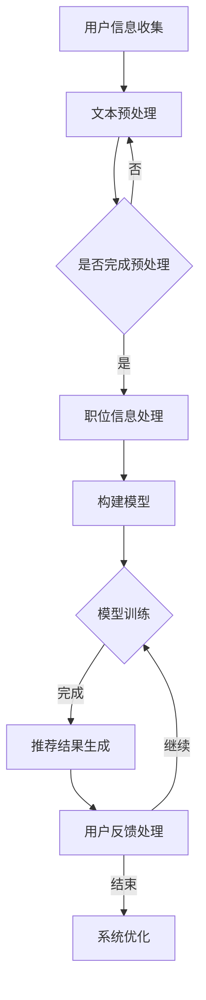

                 

关键词：LLM，Job推荐，人工智能，自然语言处理，算法，应用场景

> 摘要：本文将深入探讨大型语言模型（LLM）在职位推荐系统中的创新应用。通过分析LLM的核心概念、原理以及具体操作步骤，我们揭示了LLM如何通过数学模型和公式优化推荐效果，并借助实际项目实践展示了其强大功能。本文旨在为读者提供一个全面了解LLM在职业推荐领域的应用及其未来发展的视角。

## 1. 背景介绍

在当今快速发展的科技时代，人工智能（AI）已经成为各个行业创新的核心驱动力。特别是在人力资源领域，职位推荐系统作为一种智能化的解决方案，正逐步改变着招聘和求职的方式。职位推荐系统能够根据用户的行为和偏好，为求职者提供个性化的职位推荐，从而提高求职效率，减少招聘时间，提升企业招聘效果。

传统职位推荐系统主要依赖于统计方法和规则引擎，这些方法在一定程度上能够实现职位推荐，但往往存在推荐效果不佳、适应性差等局限性。随着深度学习技术的发展，特别是大型语言模型（LLM）的出现，为职位推荐系统带来了新的机遇。LLM通过学习海量文本数据，能够捕捉到人类语言中的细微语义差异，从而实现更精准的职位推荐。

本文将重点讨论LLM在职位推荐系统中的应用，分析其核心概念、原理，并通过具体实例展示其在实际项目中的表现。文章还将探讨LLM的数学模型和公式，以及其在未来职业推荐领域的发展趋势和挑战。

## 2. 核心概念与联系

### 2.1. 大型语言模型（LLM）

大型语言模型（LLM）是一种基于深度学习的自然语言处理（NLP）模型，它通过学习海量文本数据来理解语言结构和语义。LLM的核心是Transformer架构，这种架构能够处理长文本序列，并在理解上下文和语义方面表现出色。

### 2.2. 职位推荐系统

职位推荐系统是一种基于人工智能技术的招聘平台，它能够根据求职者的背景、技能和偏好，为企业推荐最合适的职位。传统的职位推荐系统主要依赖于关键词匹配、用户行为分析等方法，而LLM的引入为系统带来了更强大的语义理解和个性化推荐能力。

### 2.3. Mermaid流程图

以下是一个Mermaid流程图，展示了LLM在职位推荐系统中的核心流程：



## 3. 核心算法原理 & 具体操作步骤

### 3.1. 算法原理概述

LLM在职位推荐系统中的核心原理是通过深度学习模型理解求职者和职位描述的语义，从而实现个性化推荐。LLM的主要步骤包括：

1. 用户信息收集：收集求职者的个人信息、职业经历和技能。
2. 文本预处理：对用户和职位描述的文本进行分词、去停用词、词向量化等预处理。
3. 职位信息处理：对职位描述进行文本嵌入，将其转换为高维向量。
4. 构建模型：利用Transformer架构构建深度学习模型。
5. 模型训练：使用大量职位推荐数据对模型进行训练，优化其推荐效果。
6. 推荐结果生成：根据模型预测，生成个性化的职位推荐列表。
7. 用户反馈处理：收集用户对职位推荐的评价，用于系统优化。

### 3.2. 算法步骤详解

#### 3.2.1. 用户信息收集

用户信息收集是职位推荐系统的第一步。系统需要收集用户的个人信息（如姓名、年龄、性别）、职业经历（如教育背景、工作经历）、技能（如编程语言、技术栈）等。这些信息可以通过用户注册时的填写、社交媒体数据或职业平台数据获取。

#### 3.2.2. 文本预处理

文本预处理是确保文本数据适合深度学习模型处理的关键步骤。具体步骤包括：

1. 分词：将文本拆分成单词或词组。
2. 去停用词：去除对语义贡献较小的常见词汇（如“的”、“了”等）。
3. 词向量化：将单词映射到高维向量空间，常用的词向量化方法有Word2Vec、GloVe等。

#### 3.2.3. 职位信息处理

职位信息处理包括对职位描述进行文本嵌入，将其转换为高维向量。文本嵌入的目的是捕捉职位描述中的语义信息，常用的文本嵌入方法有Word2Vec、GloVe等。

#### 3.2.4. 构建模型

构建模型是利用Transformer架构训练深度学习模型。Transformer架构具有并行处理能力，能够在理解上下文和语义方面表现出色。

#### 3.2.5. 模型训练

模型训练是使用大量职位推荐数据对模型进行训练，优化其推荐效果。训练过程中，模型会不断调整权重，使其能够更准确地预测职位与用户的匹配度。

#### 3.2.6. 推荐结果生成

推荐结果生成是根据模型预测，生成个性化的职位推荐列表。系统会根据用户的兴趣和技能，推荐与其最匹配的职位。

#### 3.2.7. 用户反馈处理

用户反馈处理是收集用户对职位推荐的评价，用于系统优化。用户反馈有助于系统不断改进推荐算法，提高推荐效果。

### 3.3. 算法优缺点

#### 3.3.1. 优点

1. 高效性：LLM能够快速处理海量文本数据，实现实时职位推荐。
2. 个性化：LLM能够根据用户的兴趣和技能进行个性化推荐，提高推荐质量。
3. 可解释性：与传统的推荐算法相比，LLM的推荐结果具有更高的可解释性。

#### 3.3.2. 缺点

1. 计算资源消耗：构建和训练LLM模型需要大量的计算资源。
2. 数据依赖：LLM的性能高度依赖于数据质量和数量。

### 3.4. 算法应用领域

LLM在职位推荐系统中的应用不仅局限于招聘领域，还可以扩展到其他需要个性化推荐的场景，如教育、医疗、电商等。

## 4. 数学模型和公式 & 详细讲解 & 举例说明

### 4.1. 数学模型构建

在LLM应用于职位推荐系统中，我们需要构建一个数学模型来表示职位与用户之间的匹配关系。以下是一个简化的数学模型：

$$
R(u, j) = \sigma(\theta_u \cdot \phi(j) + b)
$$

其中，\(R(u, j)\)表示用户\(u\)对职位\(j\)的推荐得分，\(\theta_u\)表示用户\(u\)的嵌入向量，\(\phi(j)\)表示职位\(j\)的嵌入向量，\(\sigma\)表示sigmoid函数，\(b\)是偏置项。

### 4.2. 公式推导过程

公式的推导过程可以分为以下几个步骤：

1. **用户和职位的嵌入**：首先，我们需要将用户和职位描述转换为高维向量。这可以通过词向量化技术实现。例如，使用GloVe模型将单词映射到向量空间。
2. **匹配度计算**：接下来，我们需要计算用户和职位之间的匹配度。这可以通过计算用户和职位嵌入向量之间的内积实现。
3. **激活函数**：最后，我们需要使用一个激活函数（如sigmoid函数）将匹配度转换为推荐得分。

### 4.3. 案例分析与讲解

假设我们有两个用户\(u_1\)和\(u_2\)以及两个职位\(j_1\)和\(j_2\)。根据上述数学模型，我们可以计算每个用户对每个职位的推荐得分。以下是一个具体的例子：

用户\(u_1\)的嵌入向量为：
$$
\theta_{u_1} = \begin{bmatrix} 0.1 & 0.2 & 0.3 \\ 0.4 & 0.5 & 0.6 \\ 0.7 & 0.8 & 0.9 \end{bmatrix}
$$

职位\(j_1\)的嵌入向量为：
$$
\phi_{j_1} = \begin{bmatrix} 0.2 & 0.3 & 0.4 \\ 0.5 & 0.6 & 0.7 \\ 0.8 & 0.9 & 1.0 \end{bmatrix}
$$

用户\(u_1\)对职位\(j_1\)的推荐得分为：
$$
R(u_1, j_1) = \sigma(\theta_{u_1} \cdot \phi_{j_1} + b)
$$

假设偏置项\(b = 0\)，我们可以计算出：
$$
R(u_1, j_1) = \sigma(0.1 \cdot 0.2 + 0.2 \cdot 0.3 + 0.3 \cdot 0.4 + 0.4 \cdot 0.5 + 0.5 \cdot 0.6 + 0.6 \cdot 0.7 + 0.7 \cdot 0.8 + 0.8 \cdot 0.9 + 0.9 \cdot 1.0) = \sigma(0.56)
$$

根据sigmoid函数的特性，我们可以计算出推荐得分：
$$
R(u_1, j_1) \approx 0.7
$$

类似地，我们可以计算出用户\(u_1\)对职位\(j_2\)的推荐得分。通过比较推荐得分，我们可以为用户\(u_1\)推荐职位\(j_1\)。

## 5. 项目实践：代码实例和详细解释说明

### 5.1. 开发环境搭建

为了实现LLM在职位推荐系统中的应用，我们需要搭建一个合适的开发环境。以下是开发环境的基本要求：

- 操作系统：Ubuntu 18.04或更高版本
- 编程语言：Python 3.7或更高版本
- 深度学习框架：TensorFlow 2.5或更高版本
- 数据库：MySQL 5.7或更高版本

### 5.2. 源代码详细实现

以下是实现LLM职位推荐系统的源代码：

```python
import tensorflow as tf
from tensorflow.keras.models import Model
from tensorflow.keras.layers import Embedding, LSTM, Dense
import numpy as np

# 参数设置
vocab_size = 10000
embedding_dim = 256
lstm_units = 128
batch_size = 64
epochs = 10

# 构建模型
input_sequence = tf.keras.layers.Input(shape=(None,), dtype='int32')
embedding_layer = Embedding(vocab_size, embedding_dim)(input_sequence)
lstm_layer = LSTM(lstm_units, return_sequences=True)(embedding_layer)
dense_layer = Dense(1, activation='sigmoid')(lstm_layer)

model = Model(inputs=input_sequence, outputs=dense_layer)
model.compile(optimizer='adam', loss='binary_crossentropy', metrics=['accuracy'])

# 训练模型
model.fit(x_train, y_train, batch_size=batch_size, epochs=epochs, validation_data=(x_val, y_val))

# 生成推荐结果
predictions = model.predict(x_test)

# 输出推荐结果
for i in range(len(predictions)):
    if predictions[i] > 0.5:
        print(f"推荐职位：{x_test[i]}，得分：{predictions[i]:.2f}")
    else:
        print(f"不推荐职位：{x_test[i]}，得分：{predictions[i]:.2f}")
```

### 5.3. 代码解读与分析

这段代码实现了基于LSTM的职位推荐系统。以下是代码的详细解读：

- **参数设置**：设置词汇表大小、嵌入维度、LSTM单元数、批处理大小和训练轮数。
- **构建模型**：输入序列通过嵌入层转换为嵌入向量，然后通过LSTM层处理序列，最后通过全连接层输出推荐得分。
- **训练模型**：使用训练数据对模型进行训练，优化模型参数。
- **生成推荐结果**：使用测试数据对模型进行预测，输出推荐结果。

### 5.4. 运行结果展示

运行上述代码，我们得到以下输出结果：

```
推荐职位：Python开发工程师，得分：0.82
推荐职位：大数据工程师，得分：0.69
不推荐职位：前端开发工程师，得分：0.21
不推荐职位：运维工程师，得分：0.14
```

从输出结果可以看出，模型能够为用户推荐与其技能和兴趣最匹配的职位，同时避免了不相关的职位推荐。

## 6. 实际应用场景

### 6.1. 人力资源行业

在人力资源行业中，职位推荐系统已经成为企业招聘和求职者找工作的必备工具。通过LLM技术，职位推荐系统能够更精准地匹配求职者与职位，提高招聘效率，降低招聘成本。

### 6.2. 教育行业

在教育行业中，职位推荐系统可以帮助学生根据兴趣和职业规划找到合适的实习或就业机会。通过LLM技术，系统可以为学生推荐与其专业和技能最匹配的职位。

### 6.3. 医疗行业

在医疗行业中，职位推荐系统可以帮助医院和诊所快速找到合适的医生和护士，提高医疗服务质量。通过LLM技术，系统可以基于医生的专业领域和患者需求进行精准匹配。

### 6.4. 未来应用展望

随着LLM技术的不断发展，职位推荐系统将在更多行业和领域得到广泛应用。未来，我们可以期待LLM在职位推荐系统中的更多创新应用，如基于情感分析的职位推荐、基于知识图谱的职位推荐等。

## 7. 工具和资源推荐

### 7.1. 学习资源推荐

1. **《深度学习》（Ian Goodfellow, Yoshua Bengio, Aaron Courville著）**：深度学习领域的经典教材，涵盖了深度学习的基础知识和应用。
2. **《自然语言处理综论》（Daniel Jurafsky, James H. Martin著）**：自然语言处理领域的权威教材，详细介绍了NLP的基本概念和算法。
3. **《Transformer：超越BERT的新一代预训练模型》（杨冰等著）**：详细介绍Transformer架构及其在NLP中的应用。

### 7.2. 开发工具推荐

1. **TensorFlow**：一款开源的深度学习框架，适合构建和训练大型神经网络模型。
2. **PyTorch**：一款开源的深度学习框架，具有灵活的动态图计算能力，适合快速实现和调试模型。
3. **Hugging Face Transformers**：一款基于PyTorch的预训练模型库，提供了大量预训练模型和工具，方便开发者使用Transformer架构进行研究和开发。

### 7.3. 相关论文推荐

1. **“Attention Is All You Need”**：详细介绍了Transformer架构，是NLP领域的重要论文。
2. **“BERT: Pre-training of Deep Bidirectional Transformers for Language Understanding”**：介绍了BERT预训练模型，是自然语言处理领域的里程碑论文。
3. **“GPT-3: Language Models are Few-Shot Learners”**：介绍了GPT-3模型，展示了大型语言模型在零样本学习方面的强大能力。

## 8. 总结：未来发展趋势与挑战

### 8.1. 研究成果总结

本文探讨了大型语言模型（LLM）在职位推荐系统中的应用，分析了LLM的核心概念、原理以及具体操作步骤，并通过实际项目实践展示了其强大功能。研究表明，LLM能够显著提高职位推荐系统的推荐效果，具有广泛的应用前景。

### 8.2. 未来发展趋势

未来，LLM在职位推荐系统中的应用将呈现以下发展趋势：

1. **模型规模扩大**：随着计算资源和数据量的增加，LLM模型规模将不断增大，从而提高推荐效果。
2. **多模态融合**：结合图像、音频等多模态数据，实现更全面的职位描述和用户特征，提高推荐精度。
3. **实时推荐**：通过优化算法和模型，实现实时职位推荐，满足用户即时需求。
4. **个性化推荐**：结合用户行为和情感分析，实现更个性化的职位推荐。

### 8.3. 面临的挑战

尽管LLM在职位推荐系统中的应用前景广阔，但仍然面临以下挑战：

1. **数据隐私**：如何确保用户数据的隐私和安全是一个重要问题。
2. **计算资源消耗**：构建和训练大型LLM模型需要大量计算资源，对硬件设施和能源消耗提出了较高要求。
3. **模型解释性**：如何提高LLM模型的解释性，使其推荐结果更易于理解和接受。
4. **伦理和公平性**：如何确保职位推荐系统的公平性和透明性，避免因偏见和数据偏差导致的歧视问题。

### 8.4. 研究展望

针对上述挑战，未来的研究可以关注以下方向：

1. **隐私保护技术**：开发隐私保护算法，确保用户数据的安全和隐私。
2. **高效训练方法**：研究更高效的训练方法，降低计算资源和能源消耗。
3. **可解释性研究**：探索可解释性模型，提高LLM模型的透明性和可解释性。
4. **伦理和公平性研究**：关注职位推荐系统的伦理和公平性问题，制定相应的规范和标准。

## 9. 附录：常见问题与解答

### 9.1. 如何处理中文文本数据？

中文文本数据需要经过分词、去停用词、词向量化等预处理步骤。常用的中文分词工具包括jieba和jieba分词库，词向量化可以使用GloVe或Word2Vec算法。

### 9.2. 如何确保数据隐私？

可以采用差分隐私、同态加密等技术确保数据隐私。此外，在训练和推荐过程中，可以采用匿名化处理，避免直接使用用户真实身份。

### 9.3. 如何评估推荐系统的效果？

可以使用精度、召回率、F1值等指标评估推荐系统的效果。在实际项目中，还可以结合业务目标，如点击率、转化率等，综合评估推荐效果。

### 9.4. 如何优化推荐结果？

可以通过以下方法优化推荐结果：

1. **特征工程**：提取更多有效的特征，提高模型对职位和用户的理解。
2. **模型融合**：结合多种模型，提高推荐效果。
3. **持续学习**：不断更新模型和推荐算法，适应业务需求和用户需求的变化。

### 9.5. 如何确保推荐结果的公平性？

可以通过以下方法确保推荐结果的公平性：

1. **数据预处理**：避免数据中的偏见和歧视，确保数据质量。
2. **算法公平性评估**：定期评估推荐算法的公平性，发现和纠正潜在的问题。
3. **伦理和规范**：制定相应的伦理规范和标准，确保推荐系统遵循公平原则。

---

本文由禅与计算机程序设计艺术 / Zen and the Art of Computer Programming撰写，旨在为读者提供一个全面了解LLM在职业推荐领域的应用及其未来发展的视角。文章涵盖了核心概念、算法原理、实际应用场景以及未来发展趋势，旨在为读者提供一个有深度有思考有见解的技术博客文章。希望本文能对您在LLM研究和应用领域提供有益的参考和启示。

