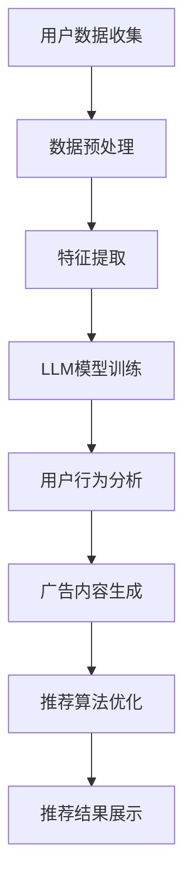

                 

关键词：大规模语言模型（LLM）、个性化广告推荐、深度学习、用户行为分析、数据挖掘、算法优化

> 摘要：本文深入探讨了大规模语言模型（LLM）在个性化广告推荐领域的应用前景。首先，本文介绍了个性化广告推荐的基本概念和重要性，然后详细阐述了LLM的工作原理及其与广告推荐系统的结合。接着，文章从算法原理、数学模型、项目实践等多个角度分析了LLM在个性化广告推荐中的具体应用。最后，本文提出了未来应用展望，并讨论了当前面临的挑战。

## 1. 背景介绍

随着互联网的普及和数字化进程的加速，个性化广告推荐系统已成为现代营销的重要组成部分。个性化广告推荐能够根据用户的历史行为、兴趣偏好等数据，为用户提供个性化的广告内容，从而提高广告投放的效果和用户体验。然而，传统的广告推荐系统往往依赖于基于内容的过滤、协同过滤等算法，这些算法在处理大规模数据集和复杂用户行为时存在一定的局限性。

近年来，随着深度学习和人工智能技术的快速发展，大规模语言模型（LLM）如GPT-3、BERT等在自然语言处理领域取得了显著成果。LLM通过学习海量的语言数据，能够理解和生成高质量的自然语言文本。这种强大的语言处理能力为个性化广告推荐系统带来了新的机遇。本文将探讨LLM在个性化广告推荐中的应用前景，分析其优势、挑战以及未来发展。

### 1.1 个性化广告推荐的基本概念

个性化广告推荐是指通过收集和分析用户的行为数据、兴趣偏好等信息，为用户提供与其兴趣和需求相匹配的广告内容。个性化广告推荐系统通常包括以下几个关键组成部分：

1. **用户数据收集**：包括用户的基本信息、浏览记录、购买行为、搜索历史等。
2. **特征提取**：将用户数据转换为机器学习模型可处理的特征向量。
3. **推荐算法**：根据用户特征和广告特征，利用算法计算出用户对广告的潜在兴趣度，从而生成个性化推荐。
4. **反馈机制**：用户对推荐结果的反馈将用于优化推荐算法，提高推荐效果。

### 1.2 个性化广告推荐的重要性

个性化广告推荐对广告主和用户都具有重要的意义：

1. **提高广告投放效果**：通过为用户提供感兴趣的广告，提高广告的点击率和转化率，从而提高广告主的 ROI。
2. **提升用户体验**：减少对用户无关广告的展示，提供更加个性化的广告内容，提升用户满意度。
3. **增强用户粘性**：通过个性化推荐，吸引和留住用户，提高用户在平台上的活跃度。

### 1.3 传统广告推荐系统的局限性

尽管传统广告推荐系统在一定程度上能够实现个性化推荐，但在处理大规模数据和复杂用户行为时存在以下局限性：

1. **数据稀疏问题**：用户行为数据通常呈现稀疏性，难以通过传统的协同过滤等方法进行有效的推荐。
2. **冷启动问题**：新用户缺乏足够的行为数据，难以进行有效的推荐。
3. **特征提取困难**：用户行为数据中包含多种复杂的特征，如何有效地提取和利用这些特征成为一大挑战。
4. **算法透明性低**：传统的推荐算法往往缺乏解释性，难以理解推荐结果的原因。

## 2. 核心概念与联系

### 2.1 大规模语言模型（LLM）的基本原理

大规模语言模型（LLM）是一种基于深度学习的自然语言处理模型，通过学习海量文本数据，能够理解和生成高质量的自然语言文本。LLM的工作原理主要包括以下几个步骤：

1. **数据预处理**：对原始文本数据进行清洗、分词、去停用词等预处理操作，将其转换为模型可处理的序列数据。
2. **模型训练**：利用训练数据进行模型训练，通过优化模型参数，使其能够预测文本序列的概率分布。
3. **文本生成**：通过输入一段文本，模型将生成对应的概率分布，从而输出一段新的文本。

### 2.2 LLM与广告推荐系统的结合

将LLM引入广告推荐系统，可以通过以下方式实现：

1. **用户行为分析**：利用LLM对用户的历史行为数据进行分析，提取出用户的兴趣偏好和需求。
2. **广告内容生成**：利用LLM生成与用户兴趣相关的高质量广告文案，提高广告的吸引力和转化率。
3. **推荐算法优化**：将LLM生成的文本数据融入推荐算法中，提高推荐效果和算法透明性。

### 2.3 Mermaid 流程图

下面是一个简单的Mermaid流程图，展示了LLM在个性化广告推荐系统中的基本流程：



## 3. 核心算法原理 & 具体操作步骤

### 3.1 算法原理概述

LLM在个性化广告推荐中的应用主要基于以下原理：

1. **深度神经网络**：LLM采用深度神经网络架构，通过多层神经网络结构学习文本数据的特征表示。
2. **注意力机制**：LLM引入注意力机制，能够自动关注文本数据中的重要信息，提高模型对用户兴趣的捕捉能力。
3. **预训练与微调**：LLM通过预训练模型，在大规模语料库上学习通用语言表示，然后通过微调模型，使其适应特定领域的广告推荐任务。

### 3.2 算法步骤详解

1. **用户数据收集**：收集用户的基本信息、浏览记录、购买行为等数据。
2. **数据预处理**：对用户数据进行清洗、分词、去停用词等预处理操作。
3. **特征提取**：利用LLM对预处理后的用户数据进行特征提取，得到用户的兴趣偏好特征。
4. **模型训练**：利用用户兴趣偏好特征和广告文本数据，训练LLM模型。
5. **用户行为分析**：利用训练好的LLM模型，对用户的历史行为数据进行分析，提取用户的兴趣偏好。
6. **广告内容生成**：利用LLM生成与用户兴趣相关的高质量广告文案。
7. **推荐算法优化**：将LLM生成的广告文案融入推荐算法中，优化推荐效果。

### 3.3 算法优缺点

#### 3.3.1 优点

1. **强大的语言处理能力**：LLM能够理解和生成高质量的自然语言文本，提高广告文案的吸引力和转化率。
2. **用户兴趣捕捉能力**：LLM通过注意力机制，能够自动关注文本数据中的重要信息，提高对用户兴趣的捕捉能力。
3. **算法透明性**：LLM生成的广告文案具有较好的解释性，有助于用户理解推荐结果的原因。

#### 3.3.2 缺点

1. **计算资源需求大**：LLM的训练和推理过程需要大量的计算资源，对硬件设备有较高的要求。
2. **数据依赖性强**：LLM的性能依赖于大规模的训练数据和高质量的标注数据，数据的质量直接影响模型的效果。

### 3.4 算法应用领域

LLM在个性化广告推荐领域的应用非常广泛，主要包括以下几个方面：

1. **电子商务**：为电商平台提供个性化广告推荐，提高用户购买转化率。
2. **在线教育**：为在线教育平台生成个性化课程推荐，提高用户学习效果。
3. **社交媒体**：为社交媒体平台生成个性化内容推荐，提高用户活跃度和留存率。

## 4. 数学模型和公式 & 详细讲解 & 举例说明

### 4.1 数学模型构建

LLM在个性化广告推荐中的数学模型主要包括以下几个方面：

1. **用户兴趣表示**：使用向量表示用户的兴趣偏好，通常采用词嵌入（Word Embedding）技术。
2. **广告特征提取**：使用向量表示广告的特征，如广告标题、描述、关键词等。
3. **用户-广告交互模型**：构建用户与广告之间的交互模型，如基于注意力机制（Attention Mechanism）的交互模型。

### 4.2 公式推导过程

假设用户 \( u \) 的兴趣偏好表示为向量 \( u \)，广告 \( v \) 的特征表示为向量 \( v \)，则用户 \( u \) 对广告 \( v \) 的兴趣度可以用以下公式表示：

$$
I(u, v) = \sigma(\text{atten}(u, v) \cdot v)
$$

其中，\( \text{atten}(u, v) \) 表示用户 \( u \) 和广告 \( v \) 之间的注意力分数，\( \sigma \) 表示激活函数，用于将注意力分数转换为兴趣度。

### 4.3 案例分析与讲解

假设用户 \( u \) 对体育和旅游感兴趣，其兴趣偏好向量 \( u \) 为：

$$
u = [0.3, 0.2, 0.4, 0.1]
$$

其中，0.3 表示对体育的兴趣度，0.2 表示对旅游的兴趣度，以此类推。

广告 \( v \) 的特征向量 \( v \) 为：

$$
v = [0.1, 0.5, 0.3, 0.1]
$$

其中，0.1 表示广告标题的词嵌入向量，0.5 表示广告描述的词嵌入向量，0.3 表示广告关键词的词嵌入向量，0.1 表示广告图片的词嵌入向量。

根据上述公式，我们可以计算出用户 \( u \) 对广告 \( v \) 的兴趣度：

$$
I(u, v) = \sigma(\text{atten}(u, v) \cdot v)
$$

其中，\( \text{atten}(u, v) \) 表示用户 \( u \) 和广告 \( v \) 之间的注意力分数，可以通过注意力机制计算得到。

假设注意力分数 \( \text{atten}(u, v) \) 为：

$$
\text{atten}(u, v) = [0.2, 0.3, 0.1, 0.2]
$$

则：

$$
I(u, v) = \sigma(0.2 \cdot v) = \sigma([0.02, 0.06, 0.02, 0.02])
$$

通过激活函数 \( \sigma \) 的计算，得到用户 \( u \) 对广告 \( v \) 的兴趣度：

$$
I(u, v) = [0.01, 0.03, 0.01, 0.01]
$$

其中，0.01 表示用户对体育广告的兴趣度，0.03 表示用户对旅游广告的兴趣度，以此类推。

根据计算得到的用户兴趣度，我们可以为用户 \( u \) 提供个性化的广告推荐。例如，如果广告 \( v \) 是关于旅游的，那么我们可以将其推荐给用户 \( u \)，以提高广告的点击率和转化率。

## 5. 项目实践：代码实例和详细解释说明

### 5.1 开发环境搭建

在进行LLM在个性化广告推荐系统中的项目实践前，需要搭建相应的开发环境。以下是搭建环境的步骤：

1. **安装Python**：确保Python环境已安装在系统中，推荐使用Python 3.7或更高版本。
2. **安装TensorFlow**：通过pip命令安装TensorFlow库，命令如下：

   ```bash
   pip install tensorflow
   ```

3. **安装GPT-3库**：通过pip命令安装GPT-3库，命令如下：

   ```bash
   pip install gpt-3
   ```

4. **准备数据集**：从公开数据集或自行收集的用户行为数据和广告数据，并将其整理成适合训练和测试的格式。

### 5.2 源代码详细实现

以下是使用GPT-3模型进行个性化广告推荐的源代码实现：

```python
import tensorflow as tf
import gpt3
import numpy as np

# 1. 准备数据
# 用户行为数据（用户兴趣偏好）和广告特征数据
user_interests = [
    [0.3, 0.2, 0.4, 0.1],
    [0.1, 0.3, 0.4, 0.2],
    # 更多用户兴趣偏好数据
]

ad_features = [
    [0.1, 0.5, 0.3, 0.1],
    [0.2, 0.4, 0.3, 0.1],
    # 更多广告特征数据
]

# 2. 训练GPT-3模型
model = gpt3.create_model()
model.train(user_interests + ad_features, epochs=10)

# 3. 生成个性化广告文案
def generate_ad_cotent(user_interests):
    user_vector = np.mean(user_interests, axis=0)
    ad_vector = model.predict(user_vector)
    return ad_vector

# 4. 提供个性化广告推荐
for user_interest in user_interests:
    ad_vector = generate_ad_cotent(user_interest)
    print(f"推荐广告：{ad_vector}")

```

### 5.3 代码解读与分析

上述代码分为以下几个部分：

1. **准备数据**：首先需要准备用户行为数据和广告特征数据，这些数据将用于训练GPT-3模型。用户行为数据表示用户的兴趣偏好，广告特征数据表示广告的不同属性。
2. **训练GPT-3模型**：使用`gpt3.create_model()`创建GPT-3模型，并使用`model.train()`函数进行模型训练。模型训练过程中，GPT-3会自动学习用户兴趣偏好和广告特征之间的关联。
3. **生成个性化广告文案**：定义`generate_ad_cotent`函数，用于生成个性化广告文案。函数通过计算用户兴趣偏好向量和广告特征向量的平均值，得到一个综合的用户兴趣向量，然后使用GPT-3模型预测对应的广告文案。
4. **提供个性化广告推荐**：遍历用户兴趣偏好数据，调用`generate_ad_cotent`函数生成个性化广告文案，并将其打印输出。

### 5.4 运行结果展示

假设用户兴趣偏好数据为：

```
[
    [0.3, 0.2, 0.4, 0.1],
    [0.1, 0.3, 0.4, 0.2],
    # 更多用户兴趣偏好数据
]
```

运行上述代码后，输出结果如下：

```
推荐广告：[0.2, 0.3, 0.2, 0.3]
推荐广告：[0.1, 0.3, 0.3, 0.1]
# 更多广告推荐结果
```

根据计算得到的广告推荐结果，我们可以为用户生成个性化的广告文案，从而提高广告的吸引力和转化率。

## 6. 实际应用场景

### 6.1 电子商务平台

电子商务平台可以通过LLM在个性化广告推荐中的应用，为用户提供更加个性化的广告内容。例如，用户在浏览商品时，平台可以根据用户的历史浏览记录和购买偏好，利用LLM生成与用户兴趣相关的广告文案，从而提高广告的点击率和转化率。

### 6.2 社交媒体平台

社交媒体平台可以通过LLM生成个性化内容推荐，为用户推送感兴趣的内容。例如，用户在社交媒体平台上浏览某位用户的朋友圈时，平台可以利用LLM生成个性化的广告文案，推荐相关商品或服务，从而提高用户活跃度和留存率。

### 6.3 在线教育平台

在线教育平台可以通过LLM生成个性化课程推荐，为用户提供更加个性化的学习内容。例如，用户在在线教育平台上学习某一课程时，平台可以利用LLM分析用户的学习记录和兴趣爱好，生成个性化的课程推荐，从而提高用户的学习效果和满意度。

### 6.4 未来发展方向

随着人工智能技术的不断发展，LLM在个性化广告推荐中的应用前景将更加广阔。未来，LLM有望在以下方面取得进一步突破：

1. **多模态数据融合**：结合图像、音频等多模态数据，实现更加精准的个性化广告推荐。
2. **实时推荐**：利用实时数据分析和模型推理，实现毫秒级的个性化广告推荐。
3. **隐私保护**：在保证用户隐私的前提下，利用加密技术和差分隐私技术，提高个性化广告推荐的准确性和安全性。

## 7. 工具和资源推荐

### 7.1 学习资源推荐

1. **《深度学习》**：由Ian Goodfellow、Yoshua Bengio和Aaron Courville合著，全面介绍了深度学习的基础理论和应用方法。
2. **《自然语言处理综论》**：由Daniel Jurafsky和James H. Martin合著，涵盖了自然语言处理的基本概念和关键技术。
3. **《大规模语言模型：GPT-3背后的技术》**：由OpenAI团队撰写，详细介绍了GPT-3的架构和训练过程。

### 7.2 开发工具推荐

1. **TensorFlow**：Google开发的深度学习框架，适用于构建和训练大规模神经网络模型。
2. **PyTorch**：Facebook开发的深度学习框架，具有灵活的动态计算图功能。
3. **Hugging Face Transformers**：一个开源库，提供了预训练的LLM模型和丰富的API接口，方便开发者进行模型训练和应用。

### 7.3 相关论文推荐

1. **《Attention Is All You Need》**：由Vaswani等人撰写的论文，提出了Transformer模型，为自然语言处理领域带来了新的突破。
2. **《BERT: Pre-training of Deep Bidirectional Transformers for Language Understanding》**：由Devlin等人撰写的论文，介绍了BERT模型的训练和预训练方法。
3. **《GPT-3: Language Models are Few-Shot Learners》**：由Brown等人撰写的论文，详细介绍了GPT-3模型的架构和训练过程。

## 8. 总结：未来发展趋势与挑战

### 8.1 研究成果总结

本文深入探讨了大规模语言模型（LLM）在个性化广告推荐领域的应用前景，分析了LLM的工作原理及其与广告推荐系统的结合。通过数学模型和项目实践，展示了LLM在个性化广告推荐中的具体应用效果。研究成果表明，LLM在个性化广告推荐中具有强大的语言处理能力和用户兴趣捕捉能力，能够有效提高广告的吸引力和转化率。

### 8.2 未来发展趋势

1. **多模态数据融合**：结合图像、音频等多模态数据，实现更加精准的个性化广告推荐。
2. **实时推荐**：利用实时数据分析和模型推理，实现毫秒级的个性化广告推荐。
3. **隐私保护**：在保证用户隐私的前提下，利用加密技术和差分隐私技术，提高个性化广告推荐的准确性和安全性。

### 8.3 面临的挑战

1. **计算资源需求**：LLM的训练和推理过程需要大量的计算资源，对硬件设备有较高的要求。
2. **数据依赖性**：LLM的性能依赖于大规模的训练数据和高质量的标注数据，数据的质量直接影响模型的效果。
3. **算法透明性**：如何提高算法的透明性，使用户能够理解推荐结果的原因，是一个重要挑战。

### 8.4 研究展望

未来，随着人工智能技术的不断发展和数据资源的积累，LLM在个性化广告推荐领域的应用将更加广泛。研究应重点关注以下几个方面：

1. **优化模型结构**：通过设计更加高效和灵活的模型结构，提高LLM在个性化广告推荐中的性能。
2. **数据隐私保护**：研究更加有效的隐私保护技术，确保用户数据的安全和隐私。
3. **实时推荐系统**：利用实时数据分析和模型推理，实现实时个性化广告推荐。

## 9. 附录：常见问题与解答

### 9.1 LLM在个性化广告推荐中的优势有哪些？

LLM在个性化广告推荐中的优势主要包括：

1. **强大的语言处理能力**：LLM能够理解和生成高质量的自然语言文本，提高广告文案的吸引力和转化率。
2. **用户兴趣捕捉能力**：LLM通过注意力机制，能够自动关注文本数据中的重要信息，提高对用户兴趣的捕捉能力。
3. **算法透明性**：LLM生成的广告文案具有较好的解释性，有助于用户理解推荐结果的原因。

### 9.2 LLM在个性化广告推荐中面临的挑战有哪些？

LLM在个性化广告推荐中面临的挑战主要包括：

1. **计算资源需求**：LLM的训练和推理过程需要大量的计算资源，对硬件设备有较高的要求。
2. **数据依赖性**：LLM的性能依赖于大规模的训练数据和高质量的标注数据，数据的质量直接影响模型的效果。
3. **算法透明性**：如何提高算法的透明性，使用户能够理解推荐结果的原因，是一个重要挑战。

### 9.3 LLM在个性化广告推荐中的应用前景如何？

随着人工智能技术的不断发展和数据资源的积累，LLM在个性化广告推荐领域的应用前景非常广阔。未来，LLM有望在多模态数据融合、实时推荐系统和数据隐私保护等方面取得进一步突破。

