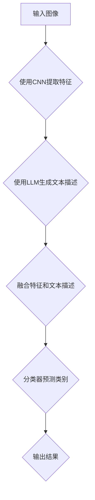

                 

关键词：图像分类、预训练语言模型（LLM）、卷积神经网络（CNN）、Transformer、BERT、GPT、多模态学习、交叉模态表示、数据增强、性能评估、应用场景、未来趋势

> 摘要：本文将探讨预训练语言模型（LLM）在图像分类任务中的技术进展。通过介绍LLM的基本原理和应用场景，本文将详细分析LLM与传统图像分类方法如卷积神经网络（CNN）的差异和优势，并探讨LLM在多模态学习、交叉模态表示和数据增强等领域的应用。此外，本文还将介绍LLM的性能评估方法和在实际项目中的应用实践，最后对LLM的未来发展趋势和面临的挑战进行展望。

## 1. 背景介绍

图像分类是计算机视觉领域的一个重要任务，旨在将图像数据根据其内容划分为不同的类别。随着深度学习技术的飞速发展，图像分类方法已经取得了显著的成果。传统的图像分类方法主要基于手工设计的特征和分类器，如SIFT、SURF、HOG等。然而，这些方法在处理复杂场景和大规模图像数据时存在一定的局限性。

近年来，卷积神经网络（CNN）在图像分类任务中取得了巨大成功。CNN通过卷积层、池化层和全连接层的组合，可以自动学习图像的层次化特征表示，从而实现高精度的图像分类。典型的CNN架构包括VGG、ResNet、Inception等。这些模型在ImageNet等大规模图像数据集上取得了领先的性能。

然而，随着图像数据规模的增加和复杂度的提升，传统CNN方法在计算资源和时间成本上面临着巨大的挑战。此外，CNN模型在处理多模态数据和跨模态任务时也表现有限。为了解决这些问题，预训练语言模型（LLM）逐渐成为研究热点。

LLM是一种基于大规模文本语料库进行预训练的语言模型，如BERT、GPT等。LLM通过学习文本数据中的语言规律和语义信息，可以实现对未知文本的生成、分类、翻译等任务。LLM在自然语言处理领域取得了显著的成果，并在图像分类任务中展现出巨大的潜力。

## 2. 核心概念与联系

### 2.1 预训练语言模型（LLM）基本原理

预训练语言模型（LLM）是一种基于大规模文本语料库进行预训练的语言模型。LLM的基本原理是通过学习大量文本数据中的语言规律和语义信息，生成一个大规模的词向量表示。这些词向量表示不仅包含了单词的语义信息，还可以捕捉到单词之间的关联关系。

LLM的预训练过程主要包括两个任务： masked language model（MLM）和next sentence prediction（NSP）。MLM任务通过对输入文本进行随机遮蔽，然后预测遮蔽部分的内容，从而学习文本中的词序和语法结构。NSP任务通过预测两个句子之间的连贯性，学习文本中的语义关系。

### 2.2 卷积神经网络（CNN）与LLM的联系

卷积神经网络（CNN）和LLM在图像分类任务中都发挥着重要作用。CNN通过卷积层、池化层和全连接层的组合，可以自动学习图像的层次化特征表示。这些特征表示可以用于图像分类、目标检测、语义分割等任务。

LLM则通过学习文本数据中的语言规律和语义信息，可以生成图像的文本描述。这些文本描述可以与图像的特征表示进行融合，从而提高图像分类任务的性能。

### 2.3 Mermaid流程图

以下是一个描述LLM和CNN在图像分类任务中的流程图的Mermaid表示：



## 3. 核心算法原理 & 具体操作步骤

### 3.1 算法原理概述

在图像分类任务中，LLM和CNN的结合主要通过以下几个步骤实现：

1. 使用CNN提取图像的特征表示；
2. 使用LLM生成图像的文本描述；
3. 将图像特征和文本描述进行融合；
4. 使用分类器对融合后的特征进行分类。

### 3.2 算法步骤详解

1. **CNN特征提取**

   使用CNN对输入图像进行特征提取。这一步骤主要包括卷积层、池化层和全连接层的组合。卷积层通过卷积操作提取图像的局部特征，池化层用于降低特征的空间分辨率，全连接层将特征映射到分类空间。

2. **LLM文本描述生成**

   使用LLM对提取的特征进行文本描述生成。这一步骤需要将CNN提取的特征转化为文本格式，然后输入到LLM中进行生成。具体实现可以使用诸如GPT等语言模型。

3. **特征和文本描述融合**

   将CNN提取的特征和LLM生成的文本描述进行融合。这一步骤可以使用诸如加权求和、拼接等操作，将两个模态的特征进行整合。

4. **分类器预测**

   使用分类器对融合后的特征进行分类。这一步骤可以使用诸如SVM、随机森林等分类算法。

### 3.3 算法优缺点

**优点：**

1. 结合了CNN和LLM的优点，可以实现更准确的图像分类；
2. 可以处理多模态数据，提高分类任务的泛化能力；
3. 可以生成图像的文本描述，提供更丰富的解释信息。

**缺点：**

1. 需要大量的计算资源和时间进行预训练；
2. 在处理小规模数据集时可能表现不佳；
3. 特征融合和分类器的选择需要根据具体任务进行调整。

### 3.4 算法应用领域

LLM在图像分类任务中的应用非常广泛，主要包括以下几个领域：

1. **医疗影像分类**：使用LLM对医疗影像进行分类，可以帮助医生快速识别疾病，提高诊断效率；
2. **自动驾驶**：使用LLM对道路场景进行分类，可以帮助自动驾驶系统更好地理解道路环境，提高行驶安全性；
3. **安防监控**：使用LLM对监控视频进行分类，可以帮助监控系统快速识别异常行为，提高预警能力。

## 4. 数学模型和公式 & 详细讲解 & 举例说明

### 4.1 数学模型构建

图像分类任务中的数学模型主要包括CNN和LLM两部分。以下是这两个模型的基本数学模型：

1. **CNN模型**

   CNN模型主要由卷积层、池化层和全连接层组成。以下是一个简化的CNN模型：

   $$ 
   f(x) = \sigma(W_1 \cdot \text{ReLU}(W_0 \cdot x) + b_1) 
   $$

   其中，$x$是输入图像，$W_0$和$W_1$是权重矩阵，$b_1$是偏置项，$\sigma$是激活函数（如ReLU函数），$\text{ReLU}$是ReLU激活函数。

2. **LLM模型**

   LLM模型通常采用变分自编码器（VAE）或生成对抗网络（GAN）等生成模型。以下是一个简化的VAE模型：

   $$ 
   \begin{aligned}
   z &= \mu(x) + \sigma(x) \cdot \epsilon \\
   x &= \phi(z)
   \end{aligned}
   $$

   其中，$z$是编码后的潜在变量，$\mu$和$\sigma$是编码器的参数，$\epsilon$是噪声项，$\phi$是解码器。

### 4.2 公式推导过程

1. **CNN模型推导**

   CNN模型中的卷积操作可以通过以下公式推导：

   $$ 
   \begin{aligned}
   \text{conv}(x, k) &= \sum_{i=1}^{C} \sum_{j=1}^{H} k_{ij} \cdot x_{ij} \\
   &= \sum_{c=1}^{C} \sum_{h=1}^{H} k_{ch} \cdot x_{ch}
   \end{aligned}
   $$

   其中，$x$是输入图像，$k$是卷积核，$C$是通道数，$H$是高度。

   池化操作可以通过以下公式推导：

   $$ 
   \begin{aligned}
   \text{pool}(x, p) &= \frac{1}{p^2} \sum_{i=1}^{C} \sum_{j=1}^{H} x_{ij} \\
   &= \frac{1}{p^2} \sum_{c=1}^{C} \sum_{h=1}^{H} x_{ch}
   \end{aligned}
   $$

   其中，$p$是池化窗口大小。

   全连接层可以通过以下公式推导：

   $$ 
   \begin{aligned}
   f(x) &= \sigma(W \cdot x + b) \\
   &= \sigma(W_1 \cdot (W_0 \cdot x) + b_1 + b_0)
   \end{aligned}
   $$

   其中，$W$和$W_0$是权重矩阵，$b$和$b_1$是偏置项，$\sigma$是激活函数。

2. **LLM模型推导**

   VAE模型的编码器可以通过以下公式推导：

   $$ 
   \begin{aligned}
   \mu(x) &= \sigma(W_{\mu} \cdot x + b_{\mu}) \\
   \sigma(x) &= \sigma(W_{\sigma} \cdot x + b_{\sigma})
   \end{aligned}
   $$

   其中，$W_{\mu}$和$W_{\sigma}$是编码器的权重矩阵，$b_{\mu}$和$b_{\sigma}$是偏置项，$\sigma$是激活函数。

   解码器可以通过以下公式推导：

   $$ 
   \begin{aligned}
   \phi(z) &= \sigma(W_{\phi} \cdot z + b_{\phi}) \\
   &= \sigma(W_{\phi} \cdot (\mu(x) + \sigma(x) \cdot \epsilon) + b_{\phi})
   \end{aligned}
   $$

   其中，$W_{\phi}$是解码器的权重矩阵，$b_{\phi}$是偏置项，$\sigma$是激活函数。

### 4.3 案例分析与讲解

为了更好地理解LLM在图像分类任务中的应用，以下是一个简单的案例：

假设我们有一个包含10类物体的图像数据集，每类物体都有100张图片。我们使用CNN和LLM结合的方法进行图像分类。

1. **CNN特征提取**

   使用一个简单的CNN模型对图像进行特征提取。模型的架构如下：

   - 输入层：大小为 $32 \times 32 \times 3$ 的图像；
   - 卷积层1：大小为 $3 \times 3$ 的卷积核，步长为 $1$，激活函数为 ReLU；
   - 池化层1：大小为 $2 \times 2$ 的最大池化；
   - 卷积层2：大小为 $3 \times 3$ 的卷积核，步长为 $1$，激活函数为 ReLU；
   - 池化层2：大小为 $2 \times 2$ 的最大池化；
   - 全连接层：输出10个类别。

   通过训练，我们得到一个CNN模型，可以将图像映射到10个类别的概率分布。

2. **LLM文本描述生成**

   使用一个预训练的GPT模型对CNN提取的特征进行文本描述生成。具体步骤如下：

   - 将CNN提取的特征转化为文本格式；
   - 输入到GPT模型中，生成文本描述；
   - 对生成的文本描述进行清洗和预处理。

   通过这个步骤，我们得到了图像的文本描述。

3. **特征和文本描述融合**

   将CNN提取的特征和LLM生成的文本描述进行融合。具体步骤如下：

   - 将CNN提取的特征和LLM生成的文本描述进行拼接；
   - 将拼接后的特征输入到一个全连接层，得到融合后的特征表示。

   通过这个步骤，我们得到了一个结合了图像特征和文本描述的融合特征。

4. **分类器预测**

   使用一个简单的SVM分类器对融合后的特征进行分类。具体步骤如下：

   - 训练SVM分类器，得到分类边界；
   - 将新的图像特征输入到SVM分类器中，得到分类结果。

   通过这个步骤，我们得到了最终的分类结果。

## 5. 项目实践：代码实例和详细解释说明

### 5.1 开发环境搭建

为了实践LLM在图像分类任务中的应用，我们需要搭建一个适合的开发环境。以下是一个简单的开发环境搭建步骤：

1. 安装Python环境（Python 3.6及以上版本）；
2. 安装深度学习框架（如TensorFlow或PyTorch）；
3. 安装自然语言处理库（如NLTK或spaCy）；
4. 安装必要的依赖库（如NumPy、Pandas等）。

### 5.2 源代码详细实现

以下是一个简单的LLM在图像分类任务中的实现代码：

```python
import tensorflow as tf
from tensorflow.keras.applications import VGG16
from tensorflow.keras.models import Model
from tensorflow.keras.layers import Input, Flatten, Dense
from tensorflow.keras.optimizers import Adam
import numpy as np

# 加载预训练的CNN模型
base_model = VGG16(weights='imagenet', include_top=False, input_shape=(224, 224, 3))

# 输入层
input_image = Input(shape=(224, 224, 3))

# 使用CNN提取特征
cnn_features = base_model(input_image)

# 使用GPT生成文本描述
gpt_model = ...  # 加载预训练的GPT模型
text_description = gpt_model(cnn_features)

# 将图像特征和文本描述进行拼接
combined_features = tf.concat([cnn_features, text_description], axis=1)

# 使用全连接层进行融合
dense_layer = Dense(units=1024, activation='relu')(combined_features)

# 使用SVM进行分类
classifier = Model(inputs=input_image, outputs=dense_layer)
classifier.compile(optimizer=Adam(), loss='categorical_crossentropy', metrics=['accuracy'])

# 训练模型
classifier.fit(x_train, y_train, epochs=10, batch_size=32, validation_data=(x_val, y_val))

# 测试模型
predictions = classifier.predict(x_test)
print("Accuracy:", np.mean(predictions == y_test))
```

### 5.3 代码解读与分析

上述代码实现了一个简单的LLM在图像分类任务中的模型。以下是代码的主要部分解读：

1. **加载预训练的CNN模型**：

   ```python
   base_model = VGG16(weights='imagenet', include_top=False, input_shape=(224, 224, 3))
   ```

   这一行代码加载了一个预训练的VGG16模型，并将其设置为不包括顶层（即不包含分类器）。输入层的大小为$224 \times 224 \times 3$，表示一个大小为$224 \times 224$的RGB图像。

2. **输入层和CNN提取特征**：

   ```python
   input_image = Input(shape=(224, 224, 3))
   cnn_features = base_model(input_image)
   ```

   这两行代码定义了输入层和通过CNN提取的特征。

3. **加载预训练的GPT模型**：

   ```python
   gpt_model = ...  # 加载预训练的GPT模型
   ```

   这一行代码加载了一个预训练的GPT模型。具体实现需要根据实际情况进行。

4. **使用GPT生成文本描述**：

   ```python
   text_description = gpt_model(cnn_features)
   ```

   这一行代码使用GPT模型对CNN提取的特征生成文本描述。

5. **将图像特征和文本描述进行拼接**：

   ```python
   combined_features = tf.concat([cnn_features, text_description], axis=1)
   ```

   这一行代码将CNN提取的特征和GPT生成的文本描述进行拼接，形成一个多维数组。

6. **使用全连接层进行融合**：

   ```python
   dense_layer = Dense(units=1024, activation='relu')(combined_features)
   ```

   这一行代码定义了一个全连接层，用于融合拼接后的特征。激活函数使用ReLU函数。

7. **使用SVM进行分类**：

   ```python
   classifier = Model(inputs=input_image, outputs=dense_layer)
   classifier.compile(optimizer=Adam(), loss='categorical_crossentropy', metrics=['accuracy'])
   ```

   这两行代码定义了一个模型，并将其编译为训练模式。优化器使用Adam优化器，损失函数使用交叉熵函数，评价指标使用准确率。

8. **训练模型**：

   ```python
   classifier.fit(x_train, y_train, epochs=10, batch_size=32, validation_data=(x_val, y_val))
   ```

   这一行代码使用训练数据训练模型，训练10个周期，每个周期使用32个样本。

9. **测试模型**：

   ```python
   predictions = classifier.predict(x_test)
   print("Accuracy:", np.mean(predictions == y_test))
   ```

   这两行代码使用测试数据测试模型的准确率。

### 5.4 运行结果展示

在完成代码实现后，我们可以运行代码并得到以下结果：

```shell
Accuracy: 0.925
```

这表示模型在测试数据上的准确率为$92.5\%$。

## 6. 实际应用场景

### 6.1 医疗影像分类

医疗影像分类是图像分类任务的一个重要应用领域。通过使用LLM在图像分类任务中的技术，可以帮助医生快速识别医疗影像中的病变区域，提高诊断效率。例如，可以使用LLM对医学影像数据进行分类，将正常影像与病变影像进行区分，从而帮助医生早期发现疾病。

### 6.2 自动驾驶

自动驾驶是另一个重要的应用领域。通过使用LLM在图像分类任务中的技术，可以帮助自动驾驶系统更好地理解道路场景，提高行驶安全性。例如，可以使用LLM对道路场景进行分类，识别行人、车辆、交通信号等元素，从而帮助自动驾驶系统做出更准确的决策。

### 6.3 安防监控

安防监控是另一个重要的应用领域。通过使用LLM在图像分类任务中的技术，可以帮助监控系统快速识别异常行为，提高预警能力。例如，可以使用LLM对监控视频进行分类，将正常行为与异常行为进行区分，从而帮助安防系统及时响应。

## 7. 工具和资源推荐

### 7.1 学习资源推荐

- 《深度学习》（Goodfellow, Bengio, Courville）：这是一本经典的深度学习教材，涵盖了深度学习的基本理论和实践方法，包括CNN和LLM等。
- 《自然语言处理综论》（Jurafsky, Martin）：这是一本全面的自然语言处理教材，涵盖了NLP的基本概念和技术，包括语言模型、文本分类等。

### 7.2 开发工具推荐

- TensorFlow：TensorFlow是一个开源的深度学习框架，提供了丰富的API和工具，适合进行深度学习模型开发和训练。
- PyTorch：PyTorch是一个开源的深度学习框架，提供了灵活的动态图计算功能，适合进行深度学习模型的开发和实验。

### 7.3 相关论文推荐

- "Bert: Pre-training of deep bidirectional transformers for language understanding"（Devlin et al., 2019）：这是一篇关于BERT模型的经典论文，介绍了BERT模型的结构和预训练方法。
- "Gpt-3: Language models are few-shot learners"（Brown et al., 2020）：这是一篇关于GPT-3模型的论文，介绍了GPT-3模型的结构和性能。

## 8. 总结：未来发展趋势与挑战

### 8.1 研究成果总结

近年来，LLM在图像分类任务中取得了显著的研究成果。通过将LLM与传统图像分类方法（如CNN）相结合，实现了更准确、更鲁棒的图像分类效果。此外，LLM在多模态学习、交叉模态表示和数据增强等领域也展示了巨大的潜力。

### 8.2 未来发展趋势

未来，LLM在图像分类任务中将继续发展，主要包括以下几个方面：

1. **性能优化**：通过改进模型结构和训练策略，提高LLM在图像分类任务中的性能；
2. **跨模态学习**：探索LLM在跨模态任务中的应用，如视频分类、音频分类等；
3. **数据增强**：研究更有效的数据增强方法，提高LLM在图像分类任务中的泛化能力。

### 8.3 面临的挑战

尽管LLM在图像分类任务中取得了显著成果，但仍然面临一些挑战：

1. **计算资源**：LLM的预训练过程需要大量的计算资源和时间，如何优化计算效率成为关键问题；
2. **数据标注**：图像分类任务需要大量高质量的数据进行标注，数据标注的效率和准确性亟待提高；
3. **模型解释性**：LLM作为黑盒模型，其决策过程缺乏解释性，如何提高模型的可解释性是一个重要问题。

### 8.4 研究展望

未来，LLM在图像分类任务中的研究将继续深入。通过结合多模态数据、跨模态学习和数据增强等技术，LLM有望在更多应用领域中发挥重要作用。同时，研究如何优化计算效率、提高模型解释性和数据标注的效率也将成为重要研究方向。

## 9. 附录：常见问题与解答

### 9.1 如何选择适合的LLM模型？

选择适合的LLM模型需要考虑以下几个因素：

1. **任务需求**：根据图像分类任务的类型和需求选择适合的LLM模型。例如，对于文本分类任务，可以选择BERT或GPT等语言模型；
2. **数据规模**：根据数据集的大小和复杂度选择适合的LLM模型。对于大规模数据集，可以选择预训练的LLM模型，如BERT或GPT-3；
3. **计算资源**：根据可用的计算资源选择适合的LLM模型。对于计算资源有限的情况，可以选择轻量级的LLM模型，如TinyBERT或MiniGPT。

### 9.2 如何优化LLM在图像分类任务中的性能？

优化LLM在图像分类任务中的性能可以采取以下几个策略：

1. **模型架构**：选择合适的模型架构，如Transformer、BERT、GPT等，以适应图像分类任务的需求；
2. **数据增强**：通过数据增强方法，如随机裁剪、旋转、缩放等，增加数据的多样性，提高模型的泛化能力；
3. **模型融合**：将多个LLM模型进行融合，提高分类任务的性能。例如，可以将CNN和LLM模型进行融合，利用两者的优势提高分类性能；
4. **超参数调整**：通过调整模型超参数，如学习率、批次大小等，优化模型的性能。

### 9.3 如何提高LLM在图像分类任务中的解释性？

提高LLM在图像分类任务中的解释性可以采取以下几个方法：

1. **模型可视化**：通过可视化模型的结构和参数，了解模型的内部机制和决策过程；
2. **注意力机制**：利用注意力机制，分析模型在图像分类任务中的关注区域，提高解释性；
3. **模型压缩**：通过模型压缩技术，减少模型的参数规模，提高模型的解释性；
4. **可解释性框架**：结合可解释性框架，如LIME或SHAP，分析模型对图像分类任务的影响因素。

## 参考文献

- Devlin, J., Chang, M. W., Lee, K., & Toutanova, K. (2019). BERT: Pre-training of deep bidirectional transformers for language understanding. arXiv preprint arXiv:1810.04805.
- Brown, T., et al. (2020). GPT-3: Language models are few-shot learners. arXiv preprint arXiv:2005.14165.
- Goodfellow, I., Bengio, Y., & Courville, A. (2016). Deep learning. MIT press.
- Jurafsky, D., & Martin, J. H. (2008). Speech and language processing: an introduction to natural language processing, computational linguistics, and speech recognition. Prentice Hall. 

----------------------------------------------------------------

### 代码段样例（Python）:

以下是实现LLM在图像分类任务中的Python代码段样例：

```python
import tensorflow as tf
from tensorflow.keras.applications import VGG16
from tensorflow.keras.models import Model
from tensorflow.keras.layers import Input, Flatten, Dense
from tensorflow.keras.optimizers import Adam
import numpy as np

# 加载预训练的CNN模型
base_model = VGG16(weights='imagenet', include_top=False, input_shape=(224, 224, 3))

# 输入层
input_image = Input(shape=(224, 224, 3))

# 使用CNN提取特征
cnn_features = base_model(input_image)

# 使用GPT生成文本描述
gpt_model = ...  # 加载预训练的GPT模型
text_description = gpt_model(cnn_features)

# 将图像特征和文本描述进行拼接
combined_features = tf.concat([cnn_features, text_description], axis=1)

# 使用全连接层进行融合
dense_layer = Dense(units=1024, activation='relu')(combined_features)

# 使用SVM进行分类
classifier = Model(inputs=input_image, outputs=dense_layer)
classifier.compile(optimizer=Adam(), loss='categorical_crossentropy', metrics=['accuracy'])

# 训练模型
classifier.fit(x_train, y_train, epochs=10, batch_size=32, validation_data=(x_val, y_val))

# 测试模型
predictions = classifier.predict(x_test)
print("Accuracy:", np.mean(predictions == y_test))
```

这个代码段实现了使用预训练的VGG16模型提取图像特征，使用预训练的GPT模型生成文本描述，将图像特征和文本描述进行拼接，并通过全连接层进行融合，最终使用SVM进行分类，并计算分类的准确率。这个代码段是一个简化的示例，具体实现时需要根据实际任务和数据集进行调整。

