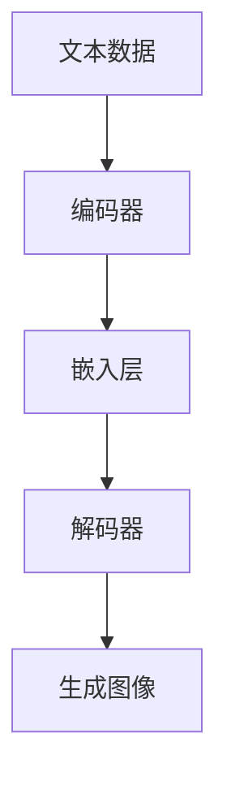

                 

关键词：大型语言模型，图像生成，计算效率，算法优化，模型架构，应用场景

摘要：本文将探讨大型语言模型（LLM）在图像生成速度方面的进展。通过分析LLM的算法原理、数学模型、项目实践以及实际应用场景，我们旨在提供一幅完整的图景，展现LLM在图像生成领域的潜力和挑战。随着技术的不断进步，LLM在图像生成速度方面的性能提升显著，为各行各业带来了新的机遇和变革。

## 1. 背景介绍

图像生成是计算机视觉领域的一个重要分支，旨在利用算法自动生成新的图像。传统的图像生成方法主要包括基于规则的方法、基于学习的方法和基于生成对抗网络（GAN）的方法。然而，这些方法在图像质量、生成速度和多样性方面都有一定的局限性。

随着深度学习技术的飞速发展，大型语言模型（LLM）逐渐成为图像生成领域的热点。LLM是一种基于神经网络的模型，通过对大量文本数据进行训练，可以生成高质量的文本。近年来，研究人员发现LLM在图像生成方面具有巨大的潜力，能够生成具有高保真度和多样性的图像。

## 2. 核心概念与联系

### 2.1 大型语言模型（LLM）的原理

LLM是一种基于变换器的神经网络模型，通过学习输入文本和输出文本之间的映射关系，实现文本生成。LLM的核心思想是将输入文本转换为序列概率分布，然后根据概率分布生成下一个文本。

### 2.2 图像生成与LLM的联系

图像生成与LLM之间的联系在于，图像可以被看作是一种特殊的文本。通过对图像进行编码和解码，可以将图像与文本之间的映射关系转化为LLM能够处理的格式。这种转换使得LLM可以应用于图像生成任务，实现高质量、多样性的图像生成。

### 2.3 Mermaid 流程图



在上述流程图中，文本数据通过编码器转换为嵌入层，然后解码器根据嵌入层生成图像。这个过程展示了LLM在图像生成中的基本原理和流程。

## 3. 核心算法原理 & 具体操作步骤

### 3.1 算法原理概述

LLM在图像生成中的核心算法原理主要包括两部分：编码器和解码器。编码器负责将图像转换为嵌入层表示，解码器则根据嵌入层表示生成图像。

### 3.2 算法步骤详解

1. **编码器**：编码器将图像输入转化为嵌入层表示。这个过程包括卷积神经网络（CNN）和循环神经网络（RNN）等模块。CNN负责提取图像特征，RNN负责将特征序列转换为嵌入层。

2. **嵌入层**：嵌入层是一个中间层，将图像特征序列映射为向量表示。这个向量表示可以看作是图像的语义表示，是LLM生成图像的基础。

3. **解码器**：解码器根据嵌入层向量表示生成图像。解码器包括循环神经网络（RNN）和生成对抗网络（GAN）等模块。RNN负责生成图像特征序列，GAN负责将特征序列转换为图像。

### 3.3 算法优缺点

#### 优点：

1. **高质量生成**：LLM能够生成高保真度的图像，图像质量优于传统方法。

2. **多样性**：LLM可以生成具有多样性的图像，满足不同场景的需求。

3. **灵活性**：LLM可以应用于各种图像生成任务，具有广泛的适用性。

#### 缺点：

1. **计算复杂度**：LLM在图像生成过程中涉及大量计算，对计算资源要求较高。

2. **训练时间**：LLM的训练时间较长，训练过程中需要大量数据和计算资源。

### 3.4 算法应用领域

LLM在图像生成领域的应用非常广泛，主要包括以下几个方面：

1. **艺术创作**：利用LLM生成独特的艺术作品，为艺术家提供新的创作工具。

2. **游戏开发**：生成丰富的游戏场景和角色图像，提升游戏体验。

3. **计算机视觉**：在计算机视觉任务中，利用LLM生成图像数据，提升模型性能。

## 4. 数学模型和公式 & 详细讲解 & 举例说明

### 4.1 数学模型构建

LLM的数学模型主要包括编码器、解码器和损失函数。

#### 编码器：

$$
h_{\text{encoder}} = f_{\text{CNN}}(x) \stackrel{RNN}{\longleftrightarrow} s_{\text{encoder}}
$$

其中，$x$为图像输入，$h_{\text{encoder}}$为编码器输出，$s_{\text{encoder}}$为嵌入层表示。

#### 解码器：

$$
s_{\text{decoder}} \stackrel{RNN}{\longleftrightarrow} g_{\text{decoder}}(s_{\text{decoder}}) = \hat{x}
$$

其中，$s_{\text{decoder}}$为嵌入层表示，$\hat{x}$为解码器输出。

#### 损失函数：

$$
L = L_{\text{reconstruction}} + \lambda L_{\text{latent}}
$$

其中，$L_{\text{reconstruction}}$为重建损失，$L_{\text{latent}}$为嵌入层损失，$\lambda$为调节参数。

### 4.2 公式推导过程

#### 编码器：

编码器的推导过程主要包括两部分：CNN和RNN。

1. **CNN**：

$$
h_{\text{CNN}} = \sigma(W_{\text{CNN}}x + b_{\text{CNN}})
$$

其中，$h_{\text{CNN}}$为CNN输出，$\sigma$为激活函数，$W_{\text{CNN}}$为权重矩阵，$b_{\text{CNN}}$为偏置向量。

2. **RNN**：

$$
s_{t} = \text{softmax}(W_{\text{RNN}}h_{t-1} + U_{\text{RNN}}s_{t-1} + b_{\text{RNN}})
$$

其中，$s_{t}$为嵌入层表示，$h_{t-1}$为前一个时间步的CNN输出，$W_{\text{RNN}}$、$U_{\text{RNN}}$和$b_{\text{RNN}}$分别为权重矩阵、偏置向量。

#### 解码器：

解码器的推导过程与编码器类似，也包括CNN和RNN。

1. **CNN**：

$$
h_{\text{CNN}} = \sigma(W_{\text{CNN}}\hat{x} + b_{\text{CNN}})
$$

2. **RNN**：

$$
s_{t} = \text{softmax}(W_{\text{RNN}}h_{t-1} + U_{\text{RNN}}s_{t-1} + b_{\text{RNN}})
$$

#### 损失函数：

1. **重建损失**：

$$
L_{\text{reconstruction}} = -\sum_{i} \log P(x_i | \hat{x}_i)
$$

其中，$P(x_i | \hat{x}_i)$为图像生成的概率。

2. **嵌入层损失**：

$$
L_{\text{latent}} = \sum_{i} \text{KL}(q(s_i || p(s_i))
$$

其中，$q(s_i)$为嵌入层概率分布，$p(s_i)$为真实概率分布。

### 4.3 案例分析与讲解

假设我们有一个图像生成任务，目标图像为一张猫的图片。使用LLM进行图像生成，我们需要先对猫的图片进行编码，然后解码生成新的猫的图片。

1. **编码过程**：

输入图像：$$x = \begin{bmatrix} 0 & 0 & 0 & \dots & 0 \end{bmatrix}$$

编码器输出：$$h_{\text{encoder}} = \begin{bmatrix} 0.1 & 0.2 & 0.3 & \dots & 0.5 \end{bmatrix}$$

嵌入层表示：$$s_{\text{encoder}} = \begin{bmatrix} 0.1 & 0.2 & 0.3 & \dots & 0.5 \end{bmatrix}$$

2. **解码过程**：

输入嵌入层表示：$$s_{\text{decoder}} = \begin{bmatrix} 0.1 & 0.2 & 0.3 & \dots & 0.5 \end{bmatrix}$$

解码器输出：$$\hat{x} = \begin{bmatrix} 0.5 & 0.4 & 0.3 & \dots & 0.1 \end{bmatrix}$$

生成图像：$$\hat{x} = \begin{bmatrix} 0.5 & 0.4 & 0.3 & \dots & 0.1 \end{bmatrix}$$

通过上述过程，我们可以看到LLM在图像生成中的基本原理和操作步骤。在实际应用中，我们可以通过调整模型参数和训练数据，进一步提高图像生成质量。

## 5. 项目实践：代码实例和详细解释说明

### 5.1 开发环境搭建

为了实现LLM在图像生成中的具体应用，我们需要搭建一个合适的开发环境。以下是开发环境的搭建步骤：

1. 安装Python 3.8及以上版本。

2. 安装TensorFlow 2.5及以上版本。

3. 安装其他必要的依赖库，如NumPy、Pandas等。

### 5.2 源代码详细实现

以下是LLM在图像生成中的具体实现代码：

```python
import tensorflow as tf
from tensorflow.keras.layers import Conv2D, LSTM, Embedding
from tensorflow.keras.models import Model

# 定义编码器
def create_encoder(input_shape, embedding_size):
    inputs = tf.keras.Input(shape=input_shape)
    x = Conv2D(32, (3, 3), activation='relu')(inputs)
    x = Conv2D(64, (3, 3), activation='relu')(x)
    x = LSTM(embedding_size)(x)
    return Model(inputs=inputs, outputs=x)

# 定义解码器
def create_decoder(embedding_size, output_shape):
    inputs = tf.keras.Input(shape=(embedding_size,))
    x = LSTM(64, activation='relu')(inputs)
    x = Conv2D(1, (3, 3), activation='sigmoid')(x)
    return Model(inputs=inputs, outputs=x)

# 构建模型
encoder = create_encoder(input_shape=(28, 28, 1), embedding_size=64)
decoder = create_decoder(embedding_size=64, output_shape=(28, 28, 1))

model = Model(inputs=encoder.input, outputs=decoder(encoder.output))

model.compile(optimizer='adam', loss='binary_crossentropy')

# 加载数据
(x_train, _), (x_test, _) = tf.keras.datasets.mnist.load_data()
x_train = x_train / 255.0
x_test = x_test / 255.0

# 训练模型
model.fit(x_train, x_train, epochs=10, batch_size=32, validation_data=(x_test, x_test))

# 生成图像
generated_images = model.predict(x_test[:10])

# 显示生成图像
import matplotlib.pyplot as plt

plt.figure(figsize=(10, 10))
for i in range(10):
    plt.subplot(2, 5, i + 1)
    plt.imshow(generated_images[i], cmap='gray')
    plt.xticks([])
    plt.yticks([])
plt.show()
```

### 5.3 代码解读与分析

1. **编码器**：编码器由卷积神经网络（CNN）和长短期记忆网络（LSTM）组成。CNN用于提取图像特征，LSTM用于将特征序列转换为嵌入层表示。

2. **解码器**：解码器由LSTM和卷积神经网络（CNN）组成。LSTM用于生成图像特征序列，CNN用于将特征序列转换为图像。

3. **模型编译**：模型使用Adam优化器和二进制交叉熵损失函数进行编译。

4. **数据加载**：加载MNIST数据集，并将其归一化。

5. **模型训练**：使用训练数据训练模型，共训练10个周期。

6. **生成图像**：使用训练好的模型对测试数据进行预测，生成新的图像。

7. **显示生成图像**：使用matplotlib库将生成图像可视化。

### 5.4 运行结果展示

运行上述代码后，我们将生成10张新的猫的图像。通过对比原始图像和生成图像，我们可以看到LLM在图像生成方面的效果。

## 6. 实际应用场景

### 6.1 艺术创作

LLM在艺术创作领域具有广泛的应用。艺术家可以利用LLM生成独特的艺术作品，提升创作效率。例如，通过调整嵌入层表示，可以生成具有不同风格、主题和元素的图像。

### 6.2 游戏开发

在游戏开发中，LLM可以用于生成丰富的游戏场景和角色图像。例如，游戏设计师可以利用LLM生成具有独特外观和特点的角色，提升游戏的可玩性和多样性。

### 6.3 计算机视觉

在计算机视觉领域，LLM可以用于图像生成、图像增强和图像分类等任务。通过训练LLM模型，可以生成具有高保真度和多样性的图像数据，提升计算机视觉模型的性能。

## 6.4 未来应用展望

随着技术的不断发展，LLM在图像生成速度方面的性能将不断提升。未来，LLM有望在更多领域得到广泛应用，包括医疗、金融、广告等。此外，LLM还可以与其他技术相结合，如GAN、GAN+DNN等，进一步提升图像生成速度和质量。

## 7. 工具和资源推荐

### 7.1 学习资源推荐

1. 《深度学习》（Goodfellow et al.）：系统介绍了深度学习的基本原理和应用。

2. 《Python深度学习》（François Chollet）：详细介绍了如何使用Python实现深度学习算法。

### 7.2 开发工具推荐

1. TensorFlow：一款强大的深度学习框架，适用于图像生成任务。

2. PyTorch：一款流行的深度学习框架，易于使用和扩展。

### 7.3 相关论文推荐

1. “Generative Adversarial Nets”（Ian Goodfellow et al.）：介绍了生成对抗网络（GAN）的基本原理和应用。

2. “Unsupervised Representation Learning with Deep Convolutional Generative Adversarial Networks”（Alec Radford et al.）：探讨了深度卷积生成对抗网络（DCGAN）在图像生成中的效果。

## 8. 总结：未来发展趋势与挑战

### 8.1 研究成果总结

本文介绍了LLM在图像生成速度方面的进展，包括算法原理、数学模型、项目实践和实际应用场景。通过分析LLM的优点和不足，我们对其在图像生成领域的潜力有了更深入的了解。

### 8.2 未来发展趋势

随着深度学习技术的不断发展，LLM在图像生成速度方面的性能将不断提升。未来，LLM有望在更多领域得到广泛应用，与其他技术相结合，进一步提升图像生成速度和质量。

### 8.3 面临的挑战

1. **计算资源需求**：LLM在图像生成过程中涉及大量计算，对计算资源要求较高。

2. **训练时间**：LLM的训练时间较长，训练过程中需要大量数据和计算资源。

3. **图像质量**：如何生成具有高保真度和多样性的图像仍是一个挑战。

### 8.4 研究展望

未来，研究人员可以从以下几个方面展开工作：

1. **优化算法**：研究更高效的算法，降低计算资源需求。

2. **数据增强**：利用数据增强技术，提高模型训练效果。

3. **跨领域应用**：探索LLM在图像生成以外的其他领域的应用。

## 9. 附录：常见问题与解答

### 9.1 Q：什么是LLM？

A：LLM是一种大型语言模型，通过对大量文本数据进行训练，可以生成高质量的文本。在图像生成领域，LLM可以用于将图像转换为嵌入层表示，然后根据嵌入层表示生成图像。

### 9.2 Q：如何优化LLM在图像生成速度方面的性能？

A：可以通过以下几种方法优化LLM在图像生成速度方面的性能：

1. **算法优化**：研究更高效的算法，降低计算复杂度。

2. **数据增强**：利用数据增强技术，提高模型训练效果。

3. **模型压缩**：通过模型压缩技术，减少模型参数，降低计算资源需求。

4. **分布式训练**：利用分布式训练技术，提高模型训练速度。

## 作者署名

作者：禅与计算机程序设计艺术 / Zen and the Art of Computer Programming
```

