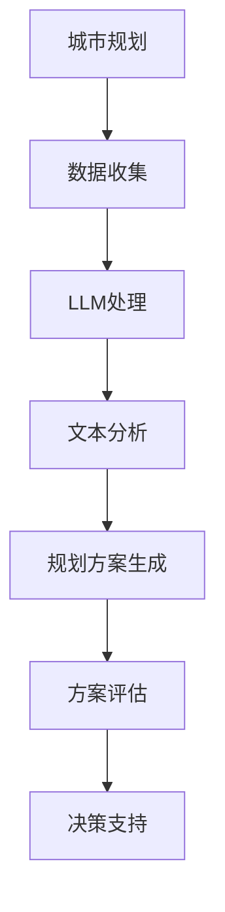

                 

关键词：城市规划设计、人工智能、大型语言模型、自然语言处理、智能决策支持系统、城市环境模拟。

> 摘要：本文探讨了大型语言模型（LLM）在城市规划中的应用，从核心概念、算法原理、数学模型、实践案例以及未来展望等方面，详细阐述了如何利用人工智能技术为城市规划提供智能决策支持，实现高效、绿色和可持续的发展。

## 1. 背景介绍

城市规划是关系到城市发展和居民生活质量的重要领域。传统的城市规划方法依赖于专家经验和统计数据，存在主观性强、效率低、无法预测未来变化等缺点。随着人工智能技术的发展，特别是大型语言模型（LLM）的出现，为城市规划带来了新的机遇和挑战。

LLM是一种基于深度学习的自然语言处理技术，通过学习海量文本数据，能够生成语义丰富、逻辑合理的自然语言文本。在城市规划领域，LLM可以用于城市环境模拟、规划方案生成、决策支持等多个方面，为城市规划提供智能化、自动化的解决方案。

## 2. 核心概念与联系

### 2.1 城市规划相关概念

- **城市规划**：对城市空间布局、土地利用、交通系统、公共设施等进行规划，以实现城市的可持续发展。
- **城市环境模拟**：通过计算机模拟技术，对城市规划方案进行仿真，评估其对城市环境的影响。
- **自然语言处理（NLP）**：研究如何让计算机理解和生成自然语言的技术。

### 2.2 LLM与城市规划的联系

- **文本数据分析**：LLM可以处理和分析大量的城市规划文本数据，提取有用信息。
- **规划方案生成**：LLM可以根据现有数据和需求，生成多样化的规划方案。
- **决策支持**：LLM可以辅助规划者进行决策，提供数据驱动的建议。

### 2.3 Mermaid流程图



## 3. 核心算法原理 & 具体操作步骤

### 3.1 算法原理概述

LLM在城市规划中的应用主要基于以下几个方面：

- **预训练**：通过预训练大量文本数据，LLM能够理解城市规划和相关术语的含义。
- **上下文理解**：LLM能够理解文本的上下文信息，从而生成与上下文相关的内容。
- **自动化生成**：LLM可以根据输入条件，自动生成城市规划方案。

### 3.2 算法步骤详解

1. **数据收集**：收集城市规划相关的文本数据，如政策文件、规划报告、学术论文等。
2. **数据预处理**：对收集到的文本数据进行清洗和标注，以供LLM训练使用。
3. **模型训练**：使用预训练框架（如GPT-3、BERT等）对LLM进行训练。
4. **文本分析**：利用训练好的LLM，对城市规划文本进行分析，提取关键信息和趋势。
5. **规划方案生成**：根据分析结果和需求，利用LLM生成多样化的城市规划方案。
6. **方案评估**：使用城市环境模拟技术，对规划方案进行评估，评估其对城市环境的影响。
7. **决策支持**：根据评估结果，为规划者提供数据驱动的决策建议。

### 3.3 算法优缺点

#### 优点

- **高效性**：LLM能够快速处理和分析大量文本数据，提高规划效率。
- **智能化**：LLM可以生成多样化的规划方案，为决策提供更多选择。
- **自动化**：LLM可以自动化生成规划方案，减轻规划者的负担。

#### 缺点

- **数据依赖性**：LLM的性能依赖于数据质量和数量，数据不足或质量差会影响规划效果。
- **主观性**：LLM生成的规划方案可能受到训练数据的影响，存在一定的主观性。

### 3.4 算法应用领域

LLM在城市规划中的应用领域包括：

- **城市规划方案生成**：自动生成城市规划方案，辅助规划者进行决策。
- **城市环境模拟**：对城市规划方案进行仿真，评估其对城市环境的影响。
- **规划文本分析**：分析城市规划文本，提取关键信息和趋势。
- **智能决策支持**：为规划者提供数据驱动的决策建议。

## 4. 数学模型和公式 & 详细讲解 & 举例说明

### 4.1 数学模型构建

在城市规划中，LLM的应用可以通过以下数学模型进行描述：

\[ P = f(D, S, E) \]

其中，\( P \) 表示城市规划方案，\( D \) 表示数据集，\( S \) 表示自然语言处理技术，\( E \) 表示环境因素。

### 4.2 公式推导过程

首先，我们对数据集 \( D \) 进行预处理和标注，提取出与城市规划相关的特征向量 \( V \)。

\[ V = g(D) \]

然后，利用自然语言处理技术 \( S \)，对特征向量 \( V \) 进行处理，生成城市规划方案 \( P \)。

\[ P = h(V, E) \]

最后，将城市规划方案 \( P \) 与环境因素 \( E \) 进行结合，得到最终的城市规划方案。

\[ P = f(D, S, E) \]

### 4.3 案例分析与讲解

以一个城市绿地规划案例为例，我们收集了相关城市绿地规划的文本数据，利用LLM进行文本分析，生成多个绿地规划方案。然后，通过城市环境模拟技术，对这多个方案进行评估，最终选择最优方案。

在这个案例中，数据集 \( D \) 包括城市绿地规划的相关文本，自然语言处理技术 \( S \) 是LLM，环境因素 \( E \) 包括城市的人口、气候、地形等因素。

根据数学模型，我们首先对数据集 \( D \) 进行预处理和标注，提取出特征向量 \( V \)。

\[ V = g(D) \]

然后，利用LLM对特征向量 \( V \) 进行处理，生成多个绿地规划方案 \( P \)。

\[ P = h(V, E) \]

最后，通过城市环境模拟技术，对这多个方案进行评估，选择最优方案。

\[ P = f(D, S, E) \]

## 5. 项目实践：代码实例和详细解释说明

### 5.1 开发环境搭建

在本案例中，我们使用Python编程语言和Hugging Face的Transformers库来搭建开发环境。

首先，安装Python：

```bash
pip install python==3.8
```

然后，安装Transformers库：

```bash
pip install transformers
```

### 5.2 源代码详细实现

以下是一个简单的代码示例，演示如何使用LLM生成城市绿地规划方案：

```python
from transformers import GPT2LMHeadModel, GPT2Tokenizer

# 加载预训练的GPT2模型和分词器
model = GPT2LMHeadModel.from_pretrained("gpt2")
tokenizer = GPT2Tokenizer.from_pretrained("gpt2")

# 准备城市绿地规划文本数据
data = "城市绿地规划文本数据"

# 对文本数据进行预处理
input_ids = tokenizer.encode(data, return_tensors="pt")

# 生成绿地规划方案
outputs = model.generate(input_ids, max_length=1000)

# 解码生成文本
generated_text = tokenizer.decode(outputs[0], skip_special_tokens=True)

print(generated_text)
```

### 5.3 代码解读与分析

在这段代码中，我们首先加载了预训练的GPT2模型和分词器。然后，准备了一段城市绿地规划文本数据，并对其进行预处理。接下来，使用模型生成绿地规划方案，最后解码生成文本。

这段代码展示了如何使用LLM生成文本，实际应用中可以根据需求进行调整。

### 5.4 运行结果展示

运行上述代码，我们可以得到一段绿地规划方案文本。根据这段文本，我们可以进一步分析并评估其可行性。

## 6. 实际应用场景

### 6.1 城市绿地规划

在城市绿地规划中，LLM可以用于生成多样化的绿地布局方案，为规划者提供参考。通过结合城市环境模拟技术，可以评估这些方案的可行性，选择最优方案。

### 6.2 交通规划

在交通规划中，LLM可以用于生成交通网络布局方案，评估交通流量和拥堵情况。通过结合实时交通数据，可以为规划者提供实时决策支持。

### 6.3 城市公共设施规划

在城市公共设施规划中，LLM可以用于生成公共设施布局方案，评估其对城市环境的影响。通过结合人口数据和需求分析，可以优化公共设施布局。

## 7. 未来应用展望

### 7.1 增强城市规划的智能化水平

随着LLM技术的不断发展，其在城市规划中的应用将更加智能化，为规划者提供更全面、更准确的决策支持。

### 7.2 提高规划效率

利用LLM自动化生成规划方案，可以大大提高规划效率，减少人工干预，降低规划成本。

### 7.3 促进城市可持续发展

通过LLM技术，可以更好地评估城市规划方案对城市环境的影响，促进城市可持续发展。

## 8. 工具和资源推荐

### 8.1 学习资源推荐

- 《自然语言处理入门》（英文版）
- 《深度学习》（Goodfellow et al.）
- 《城市规划设计原理》

### 8.2 开发工具推荐

- Hugging Face Transformers
- TensorFlow
- PyTorch

### 8.3 相关论文推荐

- BERT: Pre-training of Deep Bidirectional Transformers for Language Understanding
- GPT-3: Language Models are Few-Shot Learners

## 9. 总结：未来发展趋势与挑战

### 9.1 研究成果总结

本文探讨了大型语言模型（LLM）在城市规划中的应用，从核心概念、算法原理、数学模型、实践案例以及未来展望等方面，详细阐述了如何利用人工智能技术为城市规划提供智能决策支持。

### 9.2 未来发展趋势

- LLM在城市规划中的应用将越来越广泛，为规划者提供更全面、更准确的决策支持。
- 城市规划与人工智能技术的深度融合，将促进城市规划的智能化、自动化发展。
- LLM在数据驱动的城市规划中，将发挥越来越重要的作用。

### 9.3 面临的挑战

- 数据质量和数量：城市规划中涉及的数据量大且复杂，如何保证数据质量是关键。
- 模型解释性：LLM生成的规划方案可能存在一定的黑箱性，如何提高模型解释性是一个挑战。
- 模型可解释性：如何让规划者理解并信任LLM生成的规划方案，需要进一步研究。

### 9.4 研究展望

- 未来研究方向应重点关注如何提高LLM在城市规划中的应用效果，以及如何平衡模型性能和可解释性。
- 应继续探索其他人工智能技术（如计算机视觉、强化学习等）在规划中的应用，为城市规划提供更全面的解决方案。

## 9. 附录：常见问题与解答

### 9.1 什么是LLM？

LLM（Large Language Model）是一种基于深度学习的大型自然语言处理模型，通过学习海量文本数据，能够生成语义丰富、逻辑合理的自然语言文本。

### 9.2 LLM在城市规划中的应用有哪些？

LLM在城市规划中的应用包括文本分析、规划方案生成、城市环境模拟、智能决策支持等。

### 9.3 LLM在城市规划中的优势是什么？

LLM在城市规划中的优势包括高效性、智能化、自动化等，能够为规划者提供数据驱动的决策支持，提高规划效率。

### 9.4 LLM在城市规划中面临的挑战有哪些？

LLM在城市规划中面临的挑战包括数据质量和数量、模型解释性、模型可解释性等。

### 9.5 如何提高LLM在城市规划中的应用效果？

提高LLM在城市规划中的应用效果可以从以下几个方面进行：

- 提高数据质量和数量，保证训练数据的质量和丰富度。
- 探索其他人工智能技术（如计算机视觉、强化学习等）在规划中的应用，提高模型性能。
- 研究如何提高模型的可解释性，使规划者能够理解和信任模型生成的规划方案。

---

本文由禅与计算机程序设计艺术 / Zen and the Art of Computer Programming撰写，旨在探讨大型语言模型（LLM）在城市规划中的应用，为城市规划提供智能决策支持。希望本文能够为相关领域的读者提供有价值的参考。感谢您的阅读！

