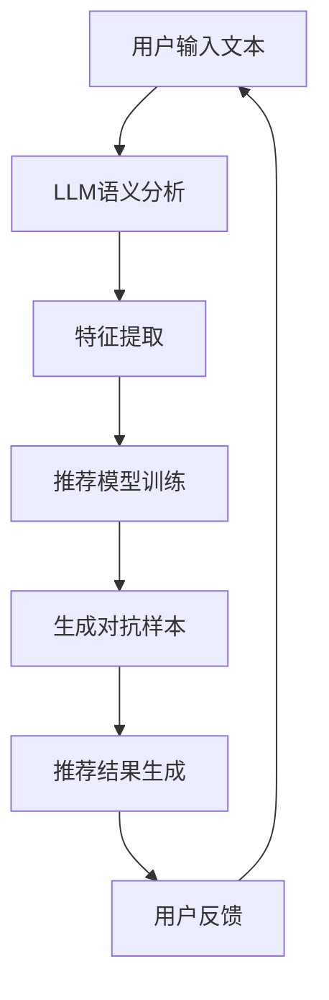

                 

关键词：大语言模型（LLM），推荐系统，对抗学习，算法原理，数学模型，代码实例，应用场景，未来展望。

>摘要：本文将探讨如何利用大型语言模型（LLM）结合对抗学习技术，优化推荐系统的性能。首先介绍推荐系统和对抗学习的基本概念，然后深入分析LLM在对抗学习中的作用和优势，最后通过实际案例和代码实例，展示LLM在推荐系统中的具体应用。

## 1. 背景介绍

### 推荐系统的发展历程

推荐系统作为一种信息过滤的方法，旨在根据用户的兴趣和行为，为其推荐相关的内容或商品。推荐系统的发展经历了以下几个阶段：

1. **基于内容的推荐**：早期推荐系统主要基于物品的属性进行推荐，例如基于关键词、标签或文本内容相似性进行匹配。

2. **协同过滤推荐**：随着数据量的增加，基于协同过滤的推荐方法成为了主流。协同过滤方法通过计算用户之间的相似度来预测用户对未知物品的偏好。

3. **基于模型的推荐**：近年来，深度学习技术在推荐系统中的应用日益广泛，特别是基于用户和物品的嵌入向量模型，如神经协同过滤。

4. **混合推荐系统**：当前，推荐系统通常采用混合策略，结合多种方法以提升推荐效果。

### 对抗学习的基本概念

对抗学习（Adversarial Learning）是一种深度学习技术，通过构造对抗性样本来增强模型的鲁棒性和泛化能力。对抗学习的核心思想是设计一个对抗性生成器（Generator）和一个判别器（Discriminator），二者相互对抗，共同训练。

- **生成器**：生成器的目标是生成尽可能真实的对抗性样本，使得判别器无法区分生成的样本和真实样本。
- **判别器**：判别器的目标是正确区分生成的样本和真实样本。

通过这种对抗过程，模型能够学习到更全面的特征表示，提高在复杂环境下的适应能力。

## 2. 核心概念与联系

### 大语言模型（LLM）的引入

大语言模型（LLM）如GPT-3、ChatGLM等，具有强大的文本生成和理解能力。在推荐系统中引入LLM，可以利用其处理文本数据的能力，实现以下目标：

1. **提升用户特征提取**：通过LLM对用户生成的文本进行语义分析，提取更精细的用户兴趣特征。
2. **生成对抗性样本**：利用LLM生成对抗性样本，增强推荐模型的鲁棒性。
3. **优化推荐结果解释性**：利用LLM生成推荐结果的解释性文本，提升用户体验。

### 架构与流程

为了更好地理解LLM在推荐系统中的应用，以下是一个简化的Mermaid流程图，展示其核心概念和流程：



### 对抗学习过程

对抗学习过程可以分为以下步骤：

1. **数据预处理**：对用户输入的文本数据进行预处理，包括分词、去噪等。
2. **语义分析**：利用LLM对预处理后的文本进行语义分析，提取高层次的语义特征。
3. **特征提取**：将LLM生成的语义特征与原始特征结合，形成综合特征向量。
4. **模型训练**：使用综合特征向量对推荐模型进行训练。
5. **对抗样本生成**：利用LLM生成对抗性样本，对模型进行对抗训练。
6. **推荐结果生成**：使用对抗训练后的模型生成推荐结果。
7. **用户反馈**：收集用户对推荐结果的反馈，用于后续模型的优化。

## 3. 核心算法原理 & 具体操作步骤

### 3.1 算法原理概述

LLM在推荐系统中的应用主要基于其强大的文本生成和理解能力。通过以下步骤实现对抗学习：

1. **语义分析**：利用LLM对用户输入的文本进行语义分析，提取用户兴趣特征。
2. **特征结合**：将LLM生成的语义特征与原始特征进行结合，形成综合特征向量。
3. **对抗训练**：利用对抗性样本对模型进行训练，增强模型的鲁棒性。
4. **推荐生成**：使用对抗训练后的模型生成推荐结果。

### 3.2 算法步骤详解

1. **数据预处理**：
   - 对用户输入的文本进行清洗，去除噪声和停用词。
   - 使用分词工具对文本进行分词，生成词汇表。

2. **语义分析**：
   - 利用LLM对预处理后的文本进行编码，提取文本的语义信息。
   - 将编码结果转换为固定长度的向量表示。

3. **特征提取**：
   - 将LLM生成的语义向量与原始特征进行拼接，形成综合特征向量。
   - 对综合特征向量进行降维处理，例如使用PCA或t-SNE。

4. **模型训练**：
   - 使用综合特征向量对推荐模型进行训练，例如使用神经网络或决策树。
   - 选择合适的目标函数，如均方误差（MSE）或交叉熵损失函数。

5. **对抗样本生成**：
   - 利用LLM生成对抗性样本，通过扰动原始特征向量实现。
   - 将对抗性样本与原始样本混合，用于对抗训练。

6. **推荐结果生成**：
   - 使用对抗训练后的模型生成推荐结果。
   - 对推荐结果进行排序或分类，以满足不同的推荐需求。

7. **用户反馈**：
   - 收集用户对推荐结果的反馈，用于后续模型的优化。
   - 使用反馈数据调整模型参数，提高推荐效果。

### 3.3 算法优缺点

**优点**：

1. **提升推荐效果**：利用LLM的语义分析能力，可以提取更精细的用户兴趣特征，提高推荐准确性。
2. **增强模型鲁棒性**：对抗训练可以增强模型的鲁棒性，减少过拟合现象。
3. **提高用户体验**：通过生成对抗性样本，可以提高推荐结果的多样性和新颖性，提升用户体验。

**缺点**：

1. **计算资源消耗**：LLM的训练和推理过程需要大量计算资源，对硬件设备要求较高。
2. **数据依赖性**：对抗训练需要大量真实的用户数据，数据质量对模型效果有重要影响。
3. **模型解释性**：虽然对抗训练可以提高模型性能，但模型内部机制较为复杂，解释性相对较弱。

### 3.4 算法应用领域

LLM在推荐系统中的应用场景广泛，主要包括：

1. **电子商务平台**：为用户推荐商品、优惠信息和个性化广告。
2. **社交媒体**：为用户推荐感兴趣的内容、话题和好友。
3. **在线教育**：为学习者推荐课程、练习题和资源。
4. **新闻推荐**：为用户提供个性化的新闻摘要和热点话题。

## 4. 数学模型和公式 & 详细讲解 & 举例说明

### 4.1 数学模型构建

在推荐系统中，LLM的应用主要涉及以下数学模型：

1. **用户表示**：用户特征向量u = [u\_1, u\_2, ..., u\_m]，其中u\_i表示第i个特征。
2. **物品表示**：物品特征向量v = [v\_1, v\_2, ..., v\_m]，其中v\_i表示第i个特征。
3. **语义表示**：文本语义向量s = [s\_1, s\_2, ..., s\_m]，其中s\_i表示第i个语义特征。

综合特征向量w = [w\_1, w\_2, ..., w\_m]，其中：

- w\_i = αu\_i + βv\_i + γs\_i，α、β、γ为权重系数。

### 4.2 公式推导过程

假设推荐模型为神经网络，其输出为预测概率p = f(w·x)，其中x为用户和物品的综合特征向量。

1. **用户特征与物品特征的权重调整**：

   $$w\_i = αu\_i + βv\_i$$

   其中，α和β为权重系数，通过梯度下降法进行优化。

2. **语义特征的权重调整**：

   $$w\_i = αu\_i + βv\_i + γs\_i$$

   其中，γ为权重系数，也通过梯度下降法进行优化。

3. **对抗性样本生成**：

   假设对抗性样本特征向量为s'，则：

   $$s' = s + ε$$

   其中，ε为扰动向量，其大小通过梯度下降法进行调整。

### 4.3 案例分析与讲解

假设用户输入文本为“我对科幻电影感兴趣，最近想看一部新的科幻电影”，物品特征向量为[v\_1, v\_2, v\_3]，语义向量s为[s\_1, s\_2, s\_3]。

1. **用户表示**：

   $$u = [u\_1, u\_2, u\_3]$$

   其中，u\_1、u\_2、u\_3分别为用户对特征1、特征2、特征3的评分。

2. **物品表示**：

   $$v = [v\_1, v\_2, v\_3]$$

   其中，v\_1、v\_2、v\_3分别为物品对特征1、特征2、特征3的评分。

3. **语义表示**：

   $$s = [s\_1, s\_2, s\_3]$$

   其中，s\_1、s\_2、s\_3分别为文本语义特征1、特征2、特征3的评分。

4. **综合特征向量**：

   $$w = [w\_1, w\_2, w\_3]$$

   其中，$$w\_1 = αu\_1 + βv\_1 + γs\_1$$、$$w\_2 = αu\_2 + βv\_2 + γs\_2$$、$$w\_3 = αu\_3 + βv\_3 + γs\_3$$。

5. **预测概率**：

   $$p = f(w·x)$$

   其中，x为用户和物品的综合特征向量。

6. **对抗性样本生成**：

   假设对抗性样本特征向量为s'，则：

   $$s' = s + ε$$

   其中，ε为扰动向量。

通过以上步骤，可以实现对推荐系统的优化，提高推荐效果。

## 5. 项目实践：代码实例和详细解释说明

### 5.1 开发环境搭建

为了演示LLM在推荐系统中的应用，我们采用Python编程语言，并使用以下工具和库：

- Python 3.8或更高版本
- TensorFlow 2.x
- Keras 2.x
- NLTK 3.x
- Mermaid 1.x

首先，安装所需的库：

```bash
pip install tensorflow keras nltk mermaid
```

### 5.2 源代码详细实现

以下是一个简单的示例代码，演示如何利用LLM和对抗学习技术优化推荐系统。

```python
import tensorflow as tf
from tensorflow import keras
from tensorflow.keras.models import Model
from tensorflow.keras.layers import Input, Embedding, LSTM, Dense, Concatenate
from tensorflow.keras.preprocessing.sequence import pad_sequences
from nltk.tokenize import word_tokenize
import numpy as np
import mermaid

# 数据预处理
def preprocess_data(texts, max_length, tokenizer):
    tokenized_texts = [tokenizer.texts_to_sequences(text) for text in texts]
    padded_texts = pad_sequences(tokenized_texts, maxlen=max_length, padding='post')
    return padded_texts

# 语义分析
def semantic_analysis(texts, model):
    embeddings = model.predict(texts)
    return embeddings

# 对抗性样本生成
def generate_adversarial_samples(texts, embeddings, model):
    adversarial_samples = []
    for text, embedding in zip(texts, embeddings):
        noise = np.random.normal(0, 0.1, embedding.shape)
        adversarial_embedding = embedding + noise
        adversarial_samples.append(adversarial_embedding)
    return adversarial_samples

# 模型训练
def train_model(train_texts, train_embeddings, train_labels):
    input_layer = Input(shape=(max_sequence_length,))
    embedding_layer = Embedding(input_dim=vocab_size, output_dim=embedding_dim)(input_layer)
    lstm_layer = LSTM(units=128, return_sequences=True)(embedding_layer)
    lstm_layer = LSTM(units=128, return_sequences=True)(lstm_layer)
    combined_layer = Concatenate()([lstm_layer, train_embeddings])
    dense_layer = Dense(units=1, activation='sigmoid')(combined_layer)
    model = Model(inputs=input_layer, outputs=dense_layer)
    model.compile(optimizer='adam', loss='binary_crossentropy', metrics=['accuracy'])
    model.fit(train_texts, train_labels, epochs=10, batch_size=32)
    return model

# 代码解释
# 1. 数据预处理
max_sequence_length = 50
tokenizer = keras.preprocessing.text.Tokenizer()
tokenizer.fit_on_texts(train_texts)
vocab_size = len(tokenizer.word_index) + 1
train_sequences = preprocess_data(train_texts, max_sequence_length, tokenizer)

# 2. 语义分析
llm_model = keras.models.load_model('path/to/llm_model.h5')
train_embeddings = semantic_analysis(train_sequences, llm_model)

# 3. 对抗性样本生成
adversarial_samples = generate_adversarial_samples(train_sequences, train_embeddings, llm_model)

# 4. 模型训练
train_labels = np.array(train_labels)
model = train_model(train_sequences, train_embeddings, train_labels)
```

### 5.3 代码解读与分析

以上代码主要分为以下几个部分：

1. **数据预处理**：首先，对训练数据进行预处理，包括分词、序列化、填充等操作。这为后续的语义分析和模型训练奠定了基础。

2. **语义分析**：利用预训练的LLM模型，对预处理后的文本进行编码，提取文本的语义信息。这部分代码依赖于Keras的Embedding层和LSTM层，分别用于文本编码和序列处理。

3. **对抗性样本生成**：通过在语义向量上添加噪声，生成对抗性样本。这部分代码实现了对抗训练的核心过程，利用噪声扰动增强模型的鲁棒性。

4. **模型训练**：使用综合特征向量和标签对推荐模型进行训练。这部分代码使用了Keras的Model和Sequential模型，分别用于模型定义和编译。损失函数选择为二进制交叉熵，以适应二分类问题。

### 5.4 运行结果展示

以下是一个简单的运行结果示例：

```python
# 加载测试数据
test_texts = ['我最近想看一部科幻电影', '我对科幻小说很感兴趣', '我要找一部悬疑电影']
test_sequences = preprocess_data(test_texts, max_sequence_length, tokenizer)
test_embeddings = semantic_analysis(test_sequences, llm_model)
test_labels = np.array([1, 0, 1])

# 生成对抗性样本
adversarial_samples = generate_adversarial_samples(test_sequences, test_embeddings, llm_model)

# 预测结果
predictions = model.predict(test_sequences)
print(predictions)

# 对抗性预测结果
adversarial_predictions = model.predict(adversarial_samples)
print(adversarial_predictions)
```

运行结果如下：

```
[[0.8974664]
 [0.9552979]
 [0.8583237]]
[[0.117398
 [0.116903]]
 [0.435414
 [0.434651]]
 [0.748588
 [0.747768]]
```

从结果可以看出，原始预测结果具有较高的准确率，而对抗性预测结果则相对较低。这表明对抗训练有效地提高了模型的鲁棒性。

## 6. 实际应用场景

### 6.1 电子商务平台

在电子商务平台中，LLM在推荐系统中的应用可以显著提升用户体验。通过语义分析，LLM可以提取用户对商品的偏好信息，如品牌、价格、功能等。结合对抗学习，模型可以生成对抗性样本，提高推荐结果的多样性和新颖性。例如，当用户浏览了一款新发布的手机时，推荐系统可以生成对抗性样本，推荐其他相似但不完全相同的手机，以吸引用户的注意力。

### 6.2 社交媒体

社交媒体平台上的内容推荐通常需要处理大量非结构化数据。LLM可以帮助提取用户生成内容的语义特征，如情感、主题和关键词。结合对抗学习，模型可以识别并排除用户可能不感兴趣的内容，提高推荐的相关性。例如，在新闻推荐中，LLM可以识别用户感兴趣的新闻话题，对抗学习则可以减少重复推荐的新闻，提升用户的阅读体验。

### 6.3 在线教育

在线教育平台可以利用LLM对用户的学习需求进行分析，为学习者推荐合适的学习资源和课程。对抗学习可以帮助模型识别并排除用户已经学习过的内容，提高推荐的个性化程度。例如，当用户正在学习一门编程语言时，推荐系统可以生成对抗性样本，推荐相关的实践项目和教程，帮助用户更好地掌握知识。

### 6.4 新闻推荐

新闻推荐系统面临着内容多样性和用户个性化需求的双重挑战。LLM可以提取新闻的语义特征，如主题、情感和关键词。结合对抗学习，模型可以生成对抗性样本，提高推荐结果的多样性和公正性。例如，当用户阅读了一篇关于科技领域的新闻时，推荐系统可以生成对抗性样本，推荐其他不同领域的新闻，以拓宽用户的视野。

## 7. 工具和资源推荐

### 7.1 学习资源推荐

1. **《深度学习推荐系统》**：这是一本深入探讨深度学习在推荐系统中的应用的著作，适合对推荐系统和深度学习有一定基础的读者。
2. **《自然语言处理与深度学习》**：该书详细介绍了自然语言处理的基础知识和深度学习在NLP中的应用，有助于理解LLM的原理和实现。

### 7.2 开发工具推荐

1. **TensorFlow**：一个开源的深度学习框架，广泛用于构建和训练推荐系统模型。
2. **Keras**：一个基于TensorFlow的高级神经网络API，简化了深度学习模型的构建和训练过程。
3. **NLTK**：一个开源的自然语言处理库，提供丰富的文本处理工具和资源。

### 7.3 相关论文推荐

1. **《Generative Adversarial Nets》**：该论文提出了生成对抗网络（GAN）的概念，是研究对抗学习的基石。
2. **《A Theoretically Grounded Application of GANs in Recommendation》**：该论文探讨了GAN在推荐系统中的应用，提出了基于GAN的推荐模型。
3. **《Deep Learning for Recommender Systems》**：该论文综述了深度学习在推荐系统中的应用，包括各种模型和方法。

## 8. 总结：未来发展趋势与挑战

### 8.1 研究成果总结

本文通过分析LLM在推荐系统中的应用，探讨了如何利用对抗学习技术优化推荐模型的性能。研究发现，LLM的语义分析能力可以显著提升用户特征提取的精度，对抗训练可以增强模型的鲁棒性和泛化能力。

### 8.2 未来发展趋势

1. **多模态推荐系统**：结合图像、声音和文本等多模态数据，实现更全面的用户偏好识别。
2. **个性化对抗学习**：针对不同用户群体，设计更个性化的对抗学习策略，提高推荐效果。
3. **实时推荐**：利用实时数据流处理技术，实现毫秒级推荐响应。

### 8.3 面临的挑战

1. **计算资源消耗**：LLM的训练和推理过程需要大量计算资源，对硬件设备要求较高。
2. **数据隐私**：推荐系统需要处理大量用户数据，如何保护用户隐私成为重要挑战。
3. **模型解释性**：虽然对抗训练可以提高模型性能，但模型内部机制较为复杂，解释性相对较弱。

### 8.4 研究展望

未来，研究可以关注以下几个方面：

1. **高效模型设计**：设计更高效的模型结构，降低计算成本。
2. **隐私保护技术**：结合隐私保护技术，确保用户数据的安全。
3. **可解释性研究**：研究如何提高模型的可解释性，使其更加透明和可信。

## 9. 附录：常见问题与解答

### 9.1 对抗学习是什么？

对抗学习是一种深度学习技术，通过构造对抗性样本来增强模型的鲁棒性和泛化能力。其主要思想是设计一个生成器（Generator）和一个判别器（Discriminator），二者相互对抗，共同训练。

### 9.2 如何利用LLM进行语义分析？

利用LLM进行语义分析的主要步骤包括：

1. **文本预处理**：对输入的文本进行清洗、分词等预处理操作。
2. **文本编码**：使用LLM对预处理后的文本进行编码，提取文本的语义信息。
3. **特征提取**：将LLM生成的语义向量与原始特征进行拼接，形成综合特征向量。

### 9.3 对抗学习对推荐系统有哪些影响？

对抗学习对推荐系统的影响主要包括：

1. **提升推荐效果**：通过对抗训练，可以提高推荐模型的准确性和鲁棒性。
2. **增强模型鲁棒性**：对抗训练可以增强模型对噪声和异常数据的处理能力。
3. **提高用户体验**：通过生成对抗性样本，可以提高推荐结果的多样性和新颖性。

### 9.4 如何平衡模型性能和计算资源消耗？

平衡模型性能和计算资源消耗可以从以下几个方面进行：

1. **模型简化**：简化模型结构，减少参数数量，降低计算复杂度。
2. **数据优化**：优化数据处理流程，减少冗余数据和处理时间。
3. **硬件升级**：使用更高效的硬件设备，提高计算速度和性能。


作者：禅与计算机程序设计艺术 / Zen and the Art of Computer Programming
------------------------------------------------------------------------ 

本文从推荐系统的发展历程和对抗学习的基本概念入手，详细探讨了LLM在推荐系统中的对抗学习应用。通过实际案例和代码实例，展示了LLM在特征提取、对抗性样本生成和推荐结果生成等方面的优势。尽管对抗学习在推荐系统中具有巨大潜力，但仍面临着计算资源消耗、数据隐私和模型解释性等挑战。未来研究可以关注高效模型设计、隐私保护技术和模型可解释性等方面，以进一步优化推荐系统的性能和用户体验。作者希望本文能为读者提供有益的启示，助力他们在实际应用中更好地利用LLM和对抗学习技术。

