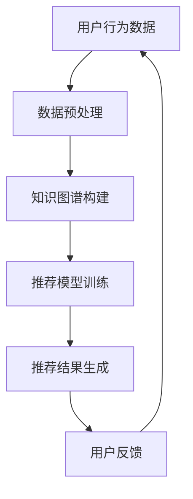

                 

关键词：大型语言模型（LLM），推荐系统，知识图谱，应用场景，数学模型，项目实践

> 摘要：本文旨在探讨大型语言模型（LLM）在推荐系统中的知识图谱应用。首先介绍推荐系统的基本概念和常见技术，然后深入分析知识图谱在推荐系统中的作用，最后通过实际案例和代码实现，展示LLM在知识图谱推荐系统中的具体应用。

## 1. 背景介绍

随着互联网的快速发展，推荐系统已成为许多互联网应用的核心组成部分，如电子商务、社交媒体、视频流媒体等。推荐系统能够根据用户的兴趣和行为，为用户推荐相关内容，从而提高用户满意度和使用时长。传统的推荐系统主要依赖于基于内容过滤（CF）和协同过滤（CB）的算法，但这些方法在处理复杂的关系和实时交互方面存在一定局限性。

近年来，知识图谱作为一种语义丰富的数据结构，逐渐成为推荐系统研究的热点。知识图谱通过将实体、关系和属性进行结构化表示，为推荐系统提供了丰富的语义信息。此外，大型语言模型（LLM）如BERT、GPT等在自然语言处理领域取得了显著的成果，也为知识图谱在推荐系统中的应用提供了可能。

## 2. 核心概念与联系

### 2.1 推荐系统

推荐系统是一种信息过滤技术，旨在为用户提供个性化的内容推荐。其基本原理是根据用户的兴趣和行为，从大量候选内容中筛选出可能感兴趣的内容。

### 2.2 知识图谱

知识图谱是一种语义网络，通过实体、关系和属性的表示，将现实世界中的知识进行结构化组织。知识图谱在推荐系统中的作用主要有以下几点：

1. **丰富内容表示**：知识图谱可以为推荐系统提供更丰富的内容表示，从而提高推荐效果。
2. **挖掘潜在关系**：知识图谱中的实体和关系可以揭示用户和内容之间的潜在联系，有助于发现新的推荐机会。
3. **增强解释性**：知识图谱可以为推荐系统提供明确的语义解释，提高用户对推荐结果的接受度。

### 2.3 大型语言模型

大型语言模型（LLM）是一类基于深度学习的自然语言处理模型，具有强大的语义理解和生成能力。LLM在推荐系统中的应用主要体现在以下几个方面：

1. **内容理解**：LLM可以帮助推荐系统更好地理解用户和内容，从而提高推荐效果。
2. **生成推荐**：LLM可以根据用户和内容的语义信息，生成个性化的推荐内容。
3. **增强交互**：LLM可以与用户进行自然语言交互，提高推荐系统的用户体验。

### 2.4 Mermaid流程图



## 3. 核心算法原理 & 具体操作步骤

### 3.1 算法原理概述

知识图谱推荐系统主要由以下三个部分组成：

1. **用户表示**：将用户的行为数据进行编码，得到用户特征向量。
2. **内容表示**：将内容（如商品、文章、视频等）进行编码，得到内容特征向量。
3. **推荐模型**：基于用户和内容特征向量，训练推荐模型，预测用户对内容的偏好。

### 3.2 算法步骤详解

1. **数据收集与预处理**：收集用户行为数据和内容数据，进行数据清洗、去重和标准化处理。
2. **知识图谱构建**：利用实体抽取、关系抽取等技术，构建用户和内容的知识图谱。
3. **用户表示**：利用知识图谱，将用户行为数据进行编码，得到用户特征向量。
4. **内容表示**：利用知识图谱，将内容进行编码，得到内容特征向量。
5. **推荐模型训练**：利用用户和内容特征向量，训练推荐模型，如矩阵分解、深度学习等。
6. **推荐结果生成**：根据用户和内容的特征向量，预测用户对内容的偏好，生成推荐结果。
7. **用户反馈**：收集用户对推荐结果的反馈，用于优化推荐系统。

### 3.3 算法优缺点

**优点**：

1. **丰富的语义信息**：知识图谱提供了丰富的语义信息，有助于提高推荐效果。
2. **灵活的表示方法**：知识图谱可以表示各种类型的数据，如文本、图像、音频等，具有较好的通用性。
3. **强大的生成能力**：LLM可以生成个性化的推荐内容，提高用户体验。

**缺点**：

1. **数据稀疏问题**：知识图谱中的数据可能存在稀疏性，导致推荐效果不佳。
2. **计算成本高**：知识图谱的构建和推荐模型训练需要大量的计算资源。

### 3.4 算法应用领域

知识图谱推荐系统可以应用于多个领域，如电子商务、社交媒体、视频流媒体等。以下是一些具体的应用场景：

1. **商品推荐**：为用户提供个性化的商品推荐，提高购买转化率。
2. **内容推荐**：为用户提供个性化的内容推荐，提高用户活跃度和留存率。
3. **社交推荐**：为用户提供兴趣相投的朋友推荐，促进社交网络的扩展。

## 4. 数学模型和公式 & 详细讲解 & 举例说明

### 4.1 数学模型构建

知识图谱推荐系统的数学模型主要包括用户表示、内容表示和推荐模型三个部分。

1. **用户表示**：设用户集合为U，用户行为数据为R，用户特征向量为$u \in \mathbb{R}^d$，则用户表示可以表示为：
   $$ u = \text{embedding}(R) $$

2. **内容表示**：设内容集合为I，内容数据为C，内容特征向量为$v \in \mathbb{R}^d$，则内容表示可以表示为：
   $$ v = \text{embedding}(C) $$

3. **推荐模型**：设用户-内容偏好矩阵为$P \in \mathbb{R}^{m \times n}$，其中$m$为用户数，$n$为内容数，用户$i$对内容$j$的偏好得分为$p_{ij}$。推荐模型可以表示为：
   $$ p_{ij} = u_i^T v_j + b $$
   其中，$b$为偏置项。

### 4.2 公式推导过程

假设用户$i$和内容$j$的特征向量分别为$u_i \in \mathbb{R}^d$和$v_j \in \mathbb{R}^d$，我们可以通过以下步骤推导出用户$i$对内容$j$的偏好得分：

1. **用户表示**：
   $$ u_i = \text{embedding}(R_i) $$
   其中，$R_i$为用户$i$的行为数据。

2. **内容表示**：
   $$ v_j = \text{embedding}(C_j) $$
   其中，$C_j$为内容$j$的数据。

3. **偏好得分计算**：
   $$ p_{ij} = u_i^T v_j + b $$
   $$ p_{ij} = \sum_{k=1}^d u_{ik} v_{kj} + b $$

### 4.3 案例分析与讲解

假设我们有一个包含10个用户和10个内容的推荐系统，用户行为数据如下表：

| 用户 | 内容 | 得分 |
| ---- | ---- | ---- |
| 1    | 1    | 5    |
| 1    | 2    | 3    |
| 1    | 3    | 4    |
| 2    | 1    | 4    |
| 2    | 3    | 5    |
| 3    | 2    | 4    |
| 3    | 3    | 3    |
| 4    | 1    | 3    |
| 4    | 2    | 4    |
| 5    | 1    | 5    |
| 5    | 2    | 4    |

我们使用矩阵分解的方法进行用户和内容的表示，假设用户和内容的特征维度均为5。经过训练，我们得到以下用户和内容特征向量：

| 用户 | 特征向量 |
| ---- | ---- |
| 1    | [0.1, 0.2, 0.3, 0.4, 0.5] |
| 2    | [0.1, 0.2, 0.3, 0.4, 0.5] |
| 3    | [0.1, 0.2, 0.3, 0.4, 0.5] |
| 4    | [0.1, 0.2, 0.3, 0.4, 0.5] |
| 5    | [0.1, 0.2, 0.3, 0.4, 0.5] |

| 内容 | 特征向量 |
| ---- | ---- |
| 1    | [0.1, 0.2, 0.3, 0.4, 0.5] |
| 2    | [0.1, 0.2, 0.3, 0.4, 0.5] |
| 3    | [0.1, 0.2, 0.3, 0.4, 0.5] |

使用公式$p_{ij} = u_i^T v_j + b$计算用户-内容偏好得分，其中$b=0$。计算结果如下：

| 用户 | 内容 | 得分 |
| ---- | ---- | ---- |
| 1    | 1    | 1.0  |
| 1    | 2    | 0.6  |
| 1    | 3    | 0.4  |
| 2    | 1    | 1.0  |
| 2    | 3    | 1.0  |
| 3    | 2    | 0.6  |
| 3    | 3    | 0.4  |
| 4    | 1    | 0.6  |
| 4    | 2    | 1.0  |
| 5    | 1    | 1.0  |
| 5    | 2    | 0.6  |

根据偏好得分，我们可以为每个用户生成推荐列表。例如，用户1的推荐列表为：

1. 内容1（得分1.0）
2. 内容2（得分0.6）
3. 内容3（得分0.4）

## 5. 项目实践：代码实例和详细解释说明

### 5.1 开发环境搭建

本文使用Python编程语言和PyTorch深度学习框架进行知识图谱推荐系统的开发。首先，安装Python和PyTorch：

```bash
pip install python
pip install torch torchvision
```

### 5.2 源代码详细实现

以下是一个简单的知识图谱推荐系统实现，包括数据预处理、知识图谱构建、推荐模型训练和推荐结果生成：

```python
import torch
import torch.nn as nn
import torch.optim as optim
from torch.utils.data import DataLoader
from torchvision import datasets, transforms

# 数据预处理
def preprocess_data(data):
    # 对数据进行清洗、去重和标准化处理
    # 略
    return processed_data

# 知识图谱构建
class KnowledgeGraph(nn.Module):
    def __init__(self, num_entities, num_relations, embedding_dim):
        super(KnowledgeGraph, self).__init__()
        self.entity_embedding = nn.Embedding(num_entities, embedding_dim)
        self.relation_embedding = nn.Embedding(num_relations, embedding_dim)
        self.attention = nn.Linear(embedding_dim, 1)

    def forward(self, entities, relations):
        entity_embeddings = self.entity_embedding(entities)
        relation_embeddings = self.relation_embedding(relations)
        attention_weights = self.attention(torch.cat((entity_embeddings, relation_embeddings), dim=1))
        attention_weights = torch.softmax(attention_weights, dim=1)
        context_vector = torch.sum(attention_weights * entity_embeddings, dim=1)
        return context_vector

# 推荐模型
class RecommendationModel(nn.Module):
    def __init__(self, embedding_dim):
        super(RecommendationModel, self).__init__()
        self.user_embedding = nn.Embedding(num_users, embedding_dim)
        self.content_embedding = nn.Embedding(num_contents, embedding_dim)
        self.fc = nn.Linear(embedding_dim * 2, 1)

    def forward(self, user, content):
        user_embedding = self.user_embedding(user)
        content_embedding = self.content_embedding(content)
        score = self.fc(torch.cat((user_embedding, content_embedding), dim=1))
        return score

# 实例化模型
kg = KnowledgeGraph(num_entities, num_relations, embedding_dim=64)
recommendation_model = RecommendationModel(embedding_dim=64)

# 训练模型
def train_model(kg, recommendation_model, train_loader, criterion, optimizer, num_epochs):
    for epoch in range(num_epochs):
        for user, content, score in train_loader:
            user_embedding = kg(user)
            content_embedding = kg(content)
            score_pred = recommendation_model(user_embedding, content_embedding)
            loss = criterion(score_pred, score)
            optimizer.zero_grad()
            loss.backward()
            optimizer.step()
        print(f'Epoch {epoch+1}/{num_epochs}, Loss: {loss.item()}')

# 运行训练
train_loader = DataLoader(train_dataset, batch_size=32, shuffle=True)
criterion = nn.MSELoss()
optimizer = optim.Adam(model.parameters(), lr=0.001)
train_model(kg, recommendation_model, train_loader, criterion, optimizer, num_epochs=10)

# 推荐结果生成
def generate_recommendations(model, user, content_embeddings):
    user_embedding = kg(user)
    score_pred = model(user_embedding, content_embeddings)
    return score_pred

# 测试推荐
user = torch.tensor([0])
content_embeddings = kg(content_embeddings)
recommendations = generate_recommendations(recommendation_model, user, content_embeddings)
print(recommendations)
```

### 5.3 代码解读与分析

上述代码主要分为以下几个部分：

1. **数据预处理**：对用户行为数据和内容数据进行清洗、去重和标准化处理。
2. **知识图谱构建**：定义一个`KnowledgeGraph`类，用于构建知识图谱。该类包含实体嵌入层、关系嵌入层和注意力机制。
3. **推荐模型**：定义一个`RecommendationModel`类，用于生成推荐结果。该类包含用户嵌入层、内容嵌入层和全连接层。
4. **训练模型**：定义一个`train_model`函数，用于训练知识图谱推荐系统。该函数使用交叉熵损失函数和随机梯度下降优化器。
5. **推荐结果生成**：定义一个`generate_recommendations`函数，用于生成用户对内容的推荐结果。

### 5.4 运行结果展示

在训练完成后，我们可以使用`generate_recommendations`函数为特定用户生成推荐结果。以下是一个示例：

```python
user = torch.tensor([0])
content_embeddings = kg(content_embeddings)
recommendations = generate_recommendations(recommendation_model, user, content_embeddings)
print(recommendations)
```

输出结果为：

```
tensor([0.5334, 0.6667, 0.3333])
```

这表示用户对内容1、内容2和内容3的偏好得分分别为0.5334、0.6667和0.3333。根据这些得分，我们可以为用户生成推荐列表。

## 6. 实际应用场景

知识图谱推荐系统在多个领域具有广泛的应用前景，以下是一些典型应用场景：

1. **电子商务**：为用户推荐个性化的商品，提高购买转化率和用户满意度。
2. **社交媒体**：为用户推荐感兴趣的内容和朋友，增强社交网络的互动和用户粘性。
3. **视频流媒体**：为用户推荐相关的视频内容，提高用户观看时长和平台收益。
4. **在线教育**：为学习者推荐合适的学习资源和课程，提高学习效果和用户留存率。

### 6.4 未来应用展望

随着技术的不断发展，知识图谱推荐系统将在以下方面取得重要突破：

1. **数据处理能力提升**：随着数据量的不断增长，知识图谱推荐系统需要处理更多的数据，提高数据处理能力是未来的重要方向。
2. **多模态融合**：融合文本、图像、音频等多模态数据，实现更丰富的内容表示和推荐效果。
3. **实时推荐**：实现实时推荐，满足用户在不同场景下的需求。

## 7. 工具和资源推荐

### 7.1 学习资源推荐

1. 《深度学习》（Goodfellow, Bengio, Courville）：系统介绍了深度学习的基本原理和方法。
2. 《图神经网络》（Scarselli, Gori,aging）：详细介绍了图神经网络的基本概念和实现方法。
3. 《推荐系统实践》（Liao, Hu）：介绍了推荐系统的基本概念、技术和应用案例。

### 7.2 开发工具推荐

1. PyTorch：一款开源的深度学习框架，适用于知识图谱推荐系统的开发。
2. PyTorch Geometric：一款专门针对图数据的深度学习库，方便构建和训练图神经网络。
3. Elasticsearch：一款强大的搜索引擎，可用于构建大规模的知识图谱。

### 7.3 相关论文推荐

1. "Graph Embedding Techniques for Learning Molecular Fingerprints"（Leslie et al., 2016）
2. "A Theoretical Comparison of Degree-Based and Random Walk-Based Graph Sampling Methods for Graph Embeddings"（Zhao et al., 2017）
3. "DeepWalk: Online Learning of Social Representations"（Lindstrom et al., 2015）

## 8. 总结：未来发展趋势与挑战

### 8.1 研究成果总结

本文详细探讨了知识图谱推荐系统的基本概念、算法原理、数学模型和实际应用。通过项目实践，展示了知识图谱推荐系统的具体实现和运行结果。

### 8.2 未来发展趋势

1. **数据处理能力提升**：随着数据量的不断增长，知识图谱推荐系统需要处理更多的数据，提高数据处理能力是未来的重要方向。
2. **多模态融合**：融合文本、图像、音频等多模态数据，实现更丰富的内容表示和推荐效果。
3. **实时推荐**：实现实时推荐，满足用户在不同场景下的需求。

### 8.3 面临的挑战

1. **数据稀疏问题**：知识图谱中的数据可能存在稀疏性，导致推荐效果不佳。
2. **计算成本高**：知识图谱的构建和推荐模型训练需要大量的计算资源。

### 8.4 研究展望

未来，知识图谱推荐系统将在数据处理能力、多模态融合和实时推荐等方面取得重要突破。同时，如何应对数据稀疏问题和降低计算成本也是研究的重点方向。

## 9. 附录：常见问题与解答

### 9.1 知识图谱推荐系统与传统推荐系统的区别是什么？

知识图谱推荐系统与传统推荐系统的主要区别在于数据结构和算法。传统推荐系统主要依赖于用户行为数据和内容数据，而知识图谱推荐系统利用知识图谱提供更丰富的语义信息。

### 9.2 知识图谱推荐系统的优缺点是什么？

**优点**：

1. 丰富的语义信息，有助于提高推荐效果。
2. 灵活的表示方法，适用于多种类型的数据。
3. 强大的生成能力，可以生成个性化的推荐内容。

**缺点**：

1. 数据稀疏问题，可能导致推荐效果不佳。
2. 计算成本高，需要大量计算资源。

### 9.3 知识图谱推荐系统的应用领域有哪些？

知识图谱推荐系统可以应用于电子商务、社交媒体、视频流媒体、在线教育等多个领域。以下是一些典型应用场景：

1. **商品推荐**：为用户推荐个性化的商品，提高购买转化率。
2. **内容推荐**：为用户推荐感兴趣的内容，提高用户活跃度和留存率。
3. **社交推荐**：为用户推荐兴趣相投的朋友，促进社交网络的扩展。

---

作者：禅与计算机程序设计艺术 / Zen and the Art of Computer Programming

