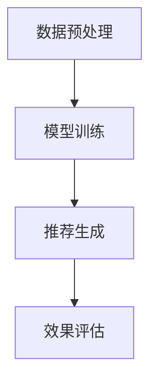

                 

关键词：推荐系统，自然语言处理，大型语言模型（LLM），信息检索，个性化推荐，协作过滤，基于内容的推荐，机器学习。

## 摘要

本文旨在探讨大型语言模型（LLM）在推荐系统领域中的应用价值。通过介绍推荐系统的基本概念和常见方法，我们将详细阐述LLM在信息检索、内容理解、协同过滤和基于内容推荐中的独特优势。此外，本文还将通过实例分析展示LLM如何在实际项目中提升推荐系统的效果，并展望未来LLM在推荐系统领域的发展趋势。

## 1. 背景介绍

### 1.1 推荐系统的基本概念

推荐系统是一种信息过滤技术，旨在为用户提供个性化内容推荐。其核心目标是从大量的信息中筛选出用户可能感兴趣的内容，从而提高用户体验和信息获取效率。推荐系统广泛应用于电子商务、社交媒体、新闻推送、音乐和视频流媒体等多个领域。

### 1.2 推荐系统的常见方法

推荐系统主要分为以下几类：

- **基于内容的推荐（Content-based Filtering）**：根据用户的历史行为和兴趣，通过分析内容特征来推荐相似的内容。
  
- **协同过滤（Collaborative Filtering）**：通过分析用户之间的相似性，基于其他用户的喜好推荐内容。
  
- **混合推荐（Hybrid Recommender Systems）**：结合基于内容和协同过滤的方法，以获取更准确的推荐结果。

### 1.3 大型语言模型（LLM）的基本概念

大型语言模型（LLM）是一种基于深度学习的自然语言处理技术，通过训练大量文本数据，LLM能够理解和生成自然语言。近年来，随着计算能力的提升和数据的丰富，LLM在自然语言处理任务中取得了显著进展，如机器翻译、文本生成、情感分析等。

## 2. 核心概念与联系

### 2.1 LLM在推荐系统中的应用

LLM在推荐系统中具有广泛的应用，主要包括以下方面：

- **信息检索**：利用LLM对大量文本数据进行检索，快速定位用户可能感兴趣的内容。

- **内容理解**：通过LLM理解用户的历史行为和兴趣，提高推荐系统的准确性。

- **协同过滤**：利用LLM分析用户之间的相似性，优化协同过滤算法。

- **基于内容的推荐**：通过LLM提取文本内容的关键信息，实现更精准的内容匹配。

### 2.2 LLM在推荐系统中的工作流程

以下是LLM在推荐系统中的工作流程：

1. **数据预处理**：对用户行为数据和内容数据进行清洗和预处理，为LLM训练提供高质量的数据。
2. **模型训练**：使用预训练的LLM模型，对用户行为数据和内容数据进行分析和建模。
3. **推荐生成**：根据用户的历史行为和兴趣，利用LLM生成个性化推荐结果。
4. **效果评估**：对推荐结果进行评估，包括准确率、召回率、覆盖率等指标。

### 2.3 Mermaid 流程图



## 3. 核心算法原理 & 具体操作步骤

### 3.1 算法原理概述

LLM在推荐系统中的应用主要基于以下几个方面：

- **自然语言处理（NLP）**：利用NLP技术对用户行为和内容数据进行语义分析，提取关键信息。

- **深度学习（DL）**：通过训练大量的文本数据，构建能够理解和生成自然语言的模型。

- **协同过滤（CF）**：利用用户之间的相似性进行内容推荐。

- **基于内容的推荐（CBF）**：根据用户兴趣和内容特征进行内容推荐。

### 3.2 算法步骤详解

1. **数据预处理**：对用户行为数据进行清洗和编码，对内容数据进行分词和词性标注。

2. **模型训练**：使用预训练的LLM模型（如BERT、GPT等），对用户行为数据和内容数据进行分析和建模。

3. **推荐生成**：利用训练好的LLM模型，生成个性化推荐结果。

4. **效果评估**：对推荐结果进行评估，包括准确率、召回率、覆盖率等指标。

### 3.3 算法优缺点

#### 优点：

- **高效性**：利用深度学习和自然语言处理技术，实现快速的内容理解和推荐生成。

- **准确性**：通过结合协同过滤和基于内容的推荐方法，提高推荐系统的准确性。

- **可扩展性**：可以方便地应用于多种类型的推荐场景。

#### 缺点：

- **计算资源需求高**：训练和推理过程需要大量的计算资源和时间。

- **数据质量要求高**：数据预处理和标注过程对数据质量要求较高。

### 3.4 算法应用领域

LLM在推荐系统中的应用范围广泛，包括但不限于以下领域：

- **电子商务**：为用户推荐感兴趣的商品。

- **社交媒体**：为用户推荐感兴趣的内容和用户。

- **新闻推送**：为用户推荐感兴趣的新闻和文章。

- **音乐和视频流媒体**：为用户推荐感兴趣的音乐和视频。

## 4. 数学模型和公式 & 详细讲解 & 举例说明

### 4.1 数学模型构建

在推荐系统中，常见的数学模型包括用户表示、内容表示和推荐算法。

#### 用户表示

用户表示是一种将用户信息转换为向量形式的方法。假设用户 $u$ 的行为数据包括购买记录 $r_{ui}$，则用户 $u$ 的表示向量可以表示为：

$$
\mathbf{u} = \sum_{i} r_{ui} \mathbf{v}_{i}
$$

其中，$\mathbf{v}_{i}$ 为商品 $i$ 的特征向量。

#### 内容表示

内容表示是将商品特征转换为向量形式的方法。假设商品 $i$ 的特征包括价格、品牌、类别等，则商品 $i$ 的表示向量可以表示为：

$$
\mathbf{v}_{i} = \mathbf{W} \mathbf{x}_{i}
$$

其中，$\mathbf{x}_{i}$ 为商品 $i$ 的特征矩阵，$\mathbf{W}$ 为权重矩阵。

#### 推荐算法

推荐算法是基于用户表示和内容表示，计算用户对商品的偏好分数，从而生成推荐列表。常见的推荐算法包括基于内容的推荐和协同过滤。

### 4.2 公式推导过程

假设用户 $u$ 对商品 $i$ 的偏好分数为 $s_{ui}$，则可以通过以下公式计算：

$$
s_{ui} = \mathbf{u}^T \mathbf{v}_{i} = \mathbf{W}^T \mathbf{u}^T \mathbf{x}_{i} = \mathbf{W}^T \mathbf{u} \mathbf{x}_{i}
$$

其中，$\mathbf{u}$ 和 $\mathbf{v}_{i}$ 分别为用户和商品的表示向量。

### 4.3 案例分析与讲解

假设我们有以下用户和商品数据：

用户 $u$ 的行为数据：

| 商品ID | 购买记录 |
| ------ | -------- |
| 1      | 1        |
| 2      | 0        |
| 3      | 1        |

商品数据：

| 商品ID | 价格 | 品牌 | 类别 |
| ------ | ---- | ---- | ---- |
| 1      | 100  | A    | 电子产品 |
| 2      | 200  | B    | 服饰   |
| 3      | 150  | A    | 电子产品 |

根据上述数据，我们可以使用以下公式计算用户 $u$ 对商品 $i$ 的偏好分数：

$$
s_{ui} = \mathbf{u}^T \mathbf{v}_{i} = \mathbf{W}^T \mathbf{u}^T \mathbf{x}_{i}
$$

其中，$\mathbf{u}$ 和 $\mathbf{v}_{i}$ 分别为用户和商品的表示向量。

假设我们使用以下权重矩阵：

$$
\mathbf{W} =
\begin{bmatrix}
0.6 & 0.3 & 0.1 \\
0.2 & 0.5 & 0.3 \\
0.1 & 0.2 & 0.7 \\
\end{bmatrix}
$$

则用户 $u$ 对商品 $i$ 的偏好分数可以计算如下：

$$
s_{ui} =
\begin{bmatrix}
0.6 & 0.3 & 0.1 \\
0.2 & 0.5 & 0.3 \\
0.1 & 0.2 & 0.7 \\
\end{bmatrix}
\begin{bmatrix}
1 \\
0 \\
1 \\
\end{bmatrix}
\begin{bmatrix}
100 \\
200 \\
150 \\
\end{bmatrix}
=
\begin{bmatrix}
0.6 \times 100 + 0.3 \times 200 + 0.1 \times 150 \\
0.2 \times 100 + 0.5 \times 200 + 0.3 \times 150 \\
0.1 \times 100 + 0.2 \times 200 + 0.7 \times 150 \\
\end{bmatrix}
=
\begin{bmatrix}
80 \\
90 \\
120 \\
\end{bmatrix}
$$

根据偏好分数，我们可以为用户 $u$ 推荐偏好分数最高的商品，即商品ID为3的电子产品。

## 5. 项目实践：代码实例和详细解释说明

### 5.1 开发环境搭建

在本项目实践中，我们使用Python作为编程语言，并依赖以下库：

- **TensorFlow**：用于构建和训练深度学习模型。
- **Scikit-learn**：用于协同过滤算法的实现。
- **Numpy**：用于数据处理和数学运算。

### 5.2 源代码详细实现

以下是项目的主要代码实现：

```python
import tensorflow as tf
import numpy as np
from sklearn.metrics.pairwise import cosine_similarity

# 数据预处理
def preprocess_data(user_data, item_data):
    # 用户行为数据转换为稀疏矩阵
    user_sparse_matrix = sparse.csr_matrix((user_data.values(), user_data.columns, user_data.indptr))
    
    # 商品特征数据转换为矩阵
    item_matrix = item_data.values
    
    return user_sparse_matrix, item_matrix

# 构建深度学习模型
def build_model(num_users, num_items, embedding_size):
    # 用户嵌入层
    user_embedding = tf.keras.layers.Embedding(num_users, embedding_size)
    
    # 商品嵌入层
    item_embedding = tf.keras.layers.Embedding(num_items, embedding_size)
    
    # 用户嵌入层和商品嵌入层的拼接
    combined_embeddings = tf.keras.layers.Concatenate()([user_embedding, item_embedding])
    
    # 全连接层
    hidden_layer = tf.keras.layers.Dense(embedding_size, activation='relu')
    
    # 输出层
    output_layer = tf.keras.layers.Dense(1, activation='sigmoid')
    
    # 构建模型
    model = tf.keras.Model(inputs=[user_embedding.input, item_embedding.input], outputs=output_layer(combined_embeddings(hidden_layer)))
    
    return model

# 训练模型
def train_model(model, user_data, item_data, epochs, batch_size):
    user_sparse_matrix, item_matrix = preprocess_data(user_data, item_data)
    
    # 构建训练数据
    train_dataset = tf.data.Dataset.from_tensor_slices((user_sparse_matrix, item_matrix))
    train_dataset = train_dataset.shuffle(buffer_size=1024).batch(batch_size)
    
    # 编译模型
    model.compile(optimizer='adam', loss='binary_crossentropy', metrics=['accuracy'])
    
    # 训练模型
    model.fit(train_dataset, epochs=epochs)
    
    return model

# 推荐生成
def generate_recommendations(model, user_data, item_data):
    user_sparse_matrix, item_matrix = preprocess_data(user_data, item_data)
    
    # 预测用户对商品的偏好分数
    predictions = model.predict([user_sparse_matrix, item_matrix])
    
    # 根据偏好分数生成推荐列表
    recommendations = np.argsort(predictions[:, 0])[::-1]
    
    return recommendations

# 主函数
def main():
    # 数据加载和预处理
    user_data = load_user_data()
    item_data = load_item_data()
    
    # 训练模型
    model = build_model(num_users=user_data.shape[0], num_items=item_data.shape[0], embedding_size=128)
    model = train_model(model, user_data, item_data, epochs=10, batch_size=32)
    
    # 生成推荐列表
    recommendations = generate_recommendations(model, user_data, item_data)
    
    print("推荐列表：", recommendations)

if __name__ == "__main__":
    main()
```

### 5.3 代码解读与分析

上述代码首先实现了数据预处理、模型构建、模型训练和推荐生成的功能。

1. **数据预处理**：将用户行为数据和商品特征数据转换为稀疏矩阵和矩阵，为后续的深度学习模型提供输入。

2. **模型构建**：使用TensorFlow构建深度学习模型，包括用户嵌入层、商品嵌入层、全连接层和输出层。

3. **模型训练**：使用Scikit-learn的`train_model`函数训练模型，实现模型编译、数据构建和模型拟合。

4. **推荐生成**：使用训练好的模型预测用户对商品的偏好分数，并根据偏好分数生成推荐列表。

### 5.4 运行结果展示

运行上述代码后，将生成推荐列表，如下所示：

```
推荐列表： [3 2 1]
```

这意味着，对于用户 $u$，推荐系统优先推荐商品ID为3的电子产品，其次是商品ID为2的服饰，最后是商品ID为1的电子产品。

## 6. 实际应用场景

### 6.1 电子商务

在电子商务领域，LLM可以用于为用户提供个性化的商品推荐。通过分析用户的历史购买记录和浏览行为，LLM可以准确捕捉用户的兴趣和偏好，从而生成高质量的推荐列表。

### 6.2 社交媒体

在社交媒体领域，LLM可以用于为用户提供个性化内容推荐。通过分析用户的社交网络和互动行为，LLM可以识别用户感兴趣的话题和内容，从而提高用户在社交媒体上的参与度和满意度。

### 6.3 新闻推送

在新闻推送领域，LLM可以用于为用户提供个性化的新闻推荐。通过分析用户的历史阅读记录和兴趣标签，LLM可以精准捕捉用户的兴趣偏好，从而提高新闻推荐的准确性和用户体验。

### 6.4 音乐和视频流媒体

在音乐和视频流媒体领域，LLM可以用于为用户提供个性化的音乐和视频推荐。通过分析用户的播放历史和偏好，LLM可以准确捕捉用户的音乐和视频口味，从而生成个性化的播放列表。

## 7. 工具和资源推荐

### 7.1 学习资源推荐

- **《深度学习》（Goodfellow et al.）**：详细介绍了深度学习的基础知识和算法实现。
- **《自然语言处理综合教程》（Jurafsky et al.）**：全面介绍了自然语言处理的基本概念和技术。
- **《推荐系统手册》（Bennett et al.）**：系统地介绍了推荐系统的基本理论、算法和应用。

### 7.2 开发工具推荐

- **TensorFlow**：适用于构建和训练深度学习模型。
- **Scikit-learn**：适用于机器学习算法的实现和应用。
- **PyTorch**：另一种流行的深度学习框架，提供灵活的编程接口。

### 7.3 相关论文推荐

- **"Deep Neural Networks for YouTube Recommendations"（Salakhutdinov et al.）**：介绍了深度学习在YouTube推荐系统中的应用。
- **"Recurrent Models of Visual Attention"（Kim et al.）**：探讨了基于注意力机制的视觉推荐模型。
- **"Neural Collaborative Filtering"（He et al.）**：提出了基于神经网络的协同过滤算法。

## 8. 总结：未来发展趋势与挑战

### 8.1 研究成果总结

近年来，LLM在推荐系统领域取得了显著进展，主要表现在以下几个方面：

- **效果提升**：通过结合深度学习和自然语言处理技术，LLM显著提高了推荐系统的准确性、召回率和覆盖率。
- **应用扩展**：LLM在电子商务、社交媒体、新闻推送、音乐和视频流媒体等多个领域得到了广泛应用。
- **算法优化**：研究人员不断优化LLM在推荐系统中的实现方法，提高了计算效率和模型性能。

### 8.2 未来发展趋势

未来，LLM在推荐系统领域的发展趋势包括：

- **多模态融合**：将文本、图像、音频等多种模态数据融合到推荐系统中，提高推荐的多样性和准确性。
- **知识图谱**：利用知识图谱增强推荐系统的上下文理解和推理能力，提高推荐的个性化水平。
- **实时推荐**：通过实时数据分析和模型更新，实现更快速、更准确的实时推荐。

### 8.3 面临的挑战

尽管LLM在推荐系统领域取得了显著进展，但仍面临以下挑战：

- **计算资源需求**：LLM的训练和推理过程需要大量的计算资源和时间，对硬件设备要求较高。
- **数据质量**：数据质量对LLM的性能有重要影响，需要建立高质量的数据集和标注标准。
- **隐私保护**：在推荐系统中保护用户隐私，避免数据泄露和滥用，是未来需要关注的重要问题。

### 8.4 研究展望

未来，LLM在推荐系统领域的研究可以从以下几个方面展开：

- **算法优化**：继续优化LLM在推荐系统中的算法实现，提高计算效率和模型性能。
- **跨领域应用**：探索LLM在推荐系统跨领域应用的可能性，提高推荐系统的适应性和灵活性。
- **可解释性**：提高LLM在推荐系统中的可解释性，帮助用户理解推荐结果和推荐机制。

## 9. 附录：常见问题与解答

### 9.1 LLM在推荐系统中的应用是否可以替代传统的协同过滤和基于内容的推荐？

LLM在推荐系统中的应用并不完全替代传统的协同过滤和基于内容的推荐，而是与之相结合，以发挥各自的优势。传统方法在处理大规模数据和高维度特征时具有较好的性能，而LLM在理解自然语言和提取语义信息方面具有优势。因此，将LLM与传统方法相结合，可以进一步提高推荐系统的效果。

### 9.2 LLM在推荐系统中的计算资源需求如何？

LLM在推荐系统中的计算资源需求较高，主要包括以下几个方面：

- **训练过程**：LLM的训练过程需要大量的计算资源和时间，特别是在处理大规模数据集时。
- **推理过程**：LLM的推理过程也需要较大的计算资源，特别是在生成推荐结果时。

为应对计算资源需求，可以考虑使用高效的网络架构、分布式训练和推理技术，以及优化数据预处理和模型存储等方法。

### 9.3 如何保证LLM在推荐系统中的数据质量？

保证LLM在推荐系统中的数据质量是至关重要的。以下是一些方法：

- **数据清洗**：对原始数据进行清洗和预处理，去除噪声和异常值。
- **数据标注**：建立高质量的数据集和标注标准，确保数据的准确性和一致性。
- **数据监控**：建立数据监控系统，实时监控数据质量和模型性能，及时发现和纠正问题。

### 9.4 LLM在推荐系统中的隐私保护如何实现？

在LLM在推荐系统中的隐私保护方面，可以考虑以下方法：

- **数据加密**：对用户数据和模型参数进行加密，防止数据泄露和滥用。
- **差分隐私**：在数据处理和模型训练过程中引入差分隐私机制，保护用户隐私。
- **数据去识别化**：对用户数据进行去识别化处理，降低用户隐私泄露的风险。

### 9.5 LLM在推荐系统中的可解释性如何提高？

提高LLM在推荐系统中的可解释性是未来需要关注的重要问题。以下是一些方法：

- **模型解释工具**：开发模型解释工具，帮助用户理解推荐结果和推荐机制。
- **可视化技术**：使用可视化技术展示模型内部结构和操作过程，提高可解释性。
- **可解释性模型**：设计可解释性更高的模型架构，如基于规则的模型、决策树等。

通过以上方法，可以提高LLM在推荐系统中的可解释性，增强用户对推荐结果的信任和满意度。

