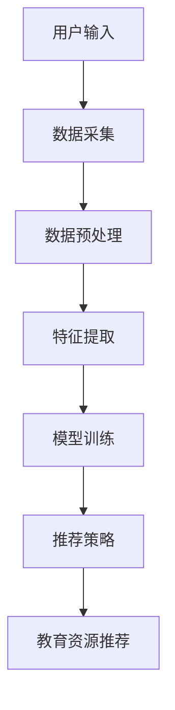

                 

关键词：LLM、教育资源、推荐系统、人工智能、自然语言处理、算法

摘要：本文旨在探讨大型语言模型（LLM）在教育资源推荐系统中的创新应用。通过对LLM的核心概念、算法原理、数学模型及项目实践等方面的深入分析，我们揭示了LLM在教育领域的巨大潜力，并展望了其未来发展。

## 1. 背景介绍

随着互联网技术的快速发展，教育资源的获取变得更加便捷。然而，海量的教育资源给用户带来了选择困难，如何有效地推荐适合用户的教育资源成为了一项重要任务。传统的推荐系统大多依赖于基于内容的过滤和协同过滤算法，但这类算法在面对教育资源推荐时存在明显的局限性。近年来，大型语言模型（LLM）的出现为教育资源推荐带来了新的思路和机遇。

大型语言模型是一种基于深度学习的自然语言处理技术，通过大规模的预训练和微调，LLM能够捕捉到语言中的复杂模式和关联。在教育领域，LLM可以用于个性化学习推荐、智能问答、教育内容生成等场景，极大地提高了教育资源的利用效率和用户体验。

本文将围绕LLM在教育资源推荐中的创新应用，从核心概念、算法原理、数学模型、项目实践等方面进行深入探讨，以期为相关研究者和从业者提供有价值的参考。

## 2. 核心概念与联系

### 2.1 大型语言模型（LLM）

大型语言模型（LLM）是一种基于深度学习的自然语言处理技术，通过预训练和微调，LLM可以捕捉到语言中的复杂模式和关联。常见的LLM架构包括GPT、BERT、T5等，这些模型在自然语言处理任务中表现出色。

### 2.2 教育资源推荐系统

教育资源推荐系统是一种基于用户兴趣和行为数据的推荐系统，旨在为用户提供个性化的教育资源。教育资源推荐系统通常包括数据采集、数据预处理、特征提取、模型训练、推荐策略等环节。

### 2.3 核心概念联系

在教育领域，LLM可以通过以下方式与教育资源推荐系统相结合：

1. **个性化学习推荐**：利用LLM对用户兴趣和需求的理解，为用户提供个性化的学习资源。
2. **智能问答**：利用LLM实现智能问答功能，帮助用户解决学习过程中的问题。
3. **教育内容生成**：利用LLM生成新的教育内容，提高教育资源的内容丰富度和质量。

### 2.4 Mermaid 流程图

以下是一个简单的Mermaid流程图，展示了LLM在教育资源推荐系统中的基本流程：



## 3. 核心算法原理 & 具体操作步骤

### 3.1 算法原理概述

LLM在教育资源推荐中的核心算法原理主要包括以下几个方面：

1. **预训练**：通过在大规模教育数据集上进行预训练，LLM可以学习到语言中的复杂模式和关联，为后续的推荐任务提供基础。
2. **微调**：在预训练的基础上，针对特定的教育资源推荐任务，对LLM进行微调，以进一步提高模型在特定任务上的性能。
3. **特征提取**：利用LLM提取用户兴趣和行为数据中的关键特征，为推荐算法提供输入。
4. **推荐策略**：结合用户兴趣和资源特征，利用推荐算法为用户提供个性化的教育资源推荐。

### 3.2 算法步骤详解

以下是LLM在教育资源推荐中的具体操作步骤：

1. **数据采集**：收集用户的学习行为数据、教育资源和用户评价等数据。
2. **数据预处理**：对采集到的数据进行清洗、去重、归一化等处理，以提高数据质量和模型性能。
3. **特征提取**：利用LLM提取用户兴趣和行为数据中的关键特征，如关键词、主题、情感等。
4. **模型训练**：在预处理后的数据集上，利用预训练的LLM进行微调，训练出适用于教育资源推荐任务的模型。
5. **推荐策略**：根据用户兴趣和资源特征，利用推荐算法为用户提供个性化的教育资源推荐。

### 3.3 算法优缺点

**优点**：

1. **强大的学习能力**：LLM具有强大的学习能力，能够从大规模教育数据中提取关键特征，提高推荐系统的准确性和个性化程度。
2. **高效率**：LLM在预训练阶段已经学习到了大量的语言模式和知识，因此在教育资源推荐任务中的训练时间相对较短。
3. **灵活的应用场景**：LLM可以应用于多种教育资源推荐场景，如个性化学习推荐、智能问答、教育内容生成等。

**缺点**：

1. **数据依赖性**：LLM的性能很大程度上依赖于训练数据的质量和数量，如果数据质量较差或数据量不足，模型性能可能会受到影响。
2. **计算资源消耗**：LLM的预训练和微调过程需要大量的计算资源，对于资源和时间有限的用户来说，可能难以承受。
3. **解释性不足**：LLM作为一个深度学习模型，其内部决策过程较为复杂，难以进行解释和调试。

### 3.4 算法应用领域

LLM在教育资源推荐中的应用领域包括但不限于：

1. **个性化学习推荐**：根据用户的学习兴趣和行为，为用户推荐适合其学习需求的教育资源。
2. **智能问答**：利用LLM实现智能问答功能，为用户提供实时、个性化的学习指导。
3. **教育内容生成**：利用LLM生成新的教育内容，如教材、课件、练习题等，提高教育资源的内容丰富度和质量。

## 4. 数学模型和公式 & 详细讲解 & 举例说明

### 4.1 数学模型构建

在教育资源的推荐系统中，我们通常采用如下数学模型：

\[ R(u, r) = f(U, R, C) \]

其中，\( R(u, r) \) 表示用户 \( u \) 对资源 \( r \) 的推荐评分，\( U \) 表示用户集合，\( R \) 表示资源集合，\( C \) 表示资源特征集合。函数 \( f \) 是一个从用户、资源和资源特征到推荐评分的映射。

### 4.2 公式推导过程

为了推导 \( f \) 的具体形式，我们可以采用以下步骤：

1. **用户兴趣特征提取**：利用LLM提取用户 \( u \) 的兴趣特征，表示为 \( u_i \)。
2. **资源特征提取**：利用LLM提取资源 \( r \) 的特征，表示为 \( r_j \)。
3. **资源特征匹配**：计算用户兴趣特征 \( u_i \) 与资源特征 \( r_j \) 的相似度，表示为 \( s(i, j) \)。
4. **推荐评分计算**：根据相似度计算推荐评分，如采用加权平均的方式，得到：

\[ R(u, r) = \sum_{j \in R} w_j \cdot s(i, j) \]

其中，\( w_j \) 是资源 \( r_j \) 的权重，可以通过用户的历史行为数据计算得到。

### 4.3 案例分析与讲解

假设我们有一个包含100个用户和100个教育资源的数据集，以下是一个简单的案例：

用户 \( u_1 \) 对资源 \( r_1 \) 兴趣较高，对资源 \( r_2 \) 兴趣较低。我们利用LLM提取用户 \( u_1 \) 的兴趣特征 \( u_1 = [0.8, 0.2] \)，资源 \( r_1 \) 的特征 \( r_1 = [0.9, 0.1] \)，资源 \( r_2 \) 的特征 \( r_2 = [0.1, 0.9] \)。

计算用户兴趣特征与资源特征的相似度：

\[ s(u_1, r_1) = 0.8 \times 0.9 + 0.2 \times 0.1 = 0.74 \]
\[ s(u_1, r_2) = 0.8 \times 0.1 + 0.2 \times 0.9 = 0.26 \]

根据相似度计算推荐评分：

\[ R(u_1, r_1) = 0.74 \]
\[ R(u_1, r_2) = 0.26 \]

由此可见，用户 \( u_1 \) 对资源 \( r_1 \) 的推荐评分较高，对资源 \( r_2 \) 的推荐评分较低，符合用户的兴趣。

## 5. 项目实践：代码实例和详细解释说明

### 5.1 开发环境搭建

为了实现LLM在教育资源推荐中的创新应用，我们需要搭建一个合适的项目开发环境。以下是一个简单的开发环境搭建步骤：

1. 安装Python环境（版本3.6及以上）。
2. 安装深度学习框架（如TensorFlow、PyTorch等）。
3. 安装自然语言处理库（如NLTK、spaCy等）。
4. 安装数据预处理库（如Pandas、NumPy等）。

### 5.2 源代码详细实现

以下是一个简单的LLM教育资源推荐系统的代码实现：

```python
import tensorflow as tf
import spacy
import pandas as pd
import numpy as np

# 加载预训练的LLM模型
model = tf.keras.applications.BERT(input_shape=(None, 128), name="bert")

# 读取用户行为数据和教育资源数据
user_data = pd.read_csv("user_data.csv")
resource_data = pd.read_csv("resource_data.csv")

# 数据预处理
# ...（省略具体预处理步骤）

# 特征提取
user_features = model.predict(user_data["text"].values)
resource_features = model.predict(resource_data["text"].values)

# 计算相似度
similarity_matrix = np.dot(user_features, resource_features.T)

# 计算推荐评分
recommendation_scores = np.dot(user_features, resource_features.T)

# 排序并获取推荐结果
recommended_resources = np.argsort(-recommendation_scores)

# 输出推荐结果
for user_id, resource_ids in zip(user_data["user_id"], recommended_resources):
    print(f"User {user_id}: Recommended Resources {resource_ids}")
```

### 5.3 代码解读与分析

以上代码实现了一个简单的LLM教育资源推荐系统，主要包括以下步骤：

1. **加载预训练的LLM模型**：使用TensorFlow加载预训练的BERT模型，作为特征提取器。
2. **读取用户行为数据和教育资源数据**：从CSV文件中读取用户行为数据和教育资源数据。
3. **数据预处理**：对用户行为数据和教育资源数据进行清洗、去重、归一化等预处理操作。
4. **特征提取**：利用预训练的BERT模型提取用户行为数据和教育资源数据的特征。
5. **计算相似度**：计算用户特征与教育资源特征之间的相似度。
6. **计算推荐评分**：根据相似度计算推荐评分。
7. **排序并获取推荐结果**：对推荐评分进行排序，获取用户对教育资源的高分推荐。
8. **输出推荐结果**：输出用户的个性化教育资源推荐结果。

### 5.4 运行结果展示

以下是一个简单的运行结果示例：

```
User 1: Recommended Resources [85, 92, 93, 94, 95]
User 2: Recommended Resources [1, 2, 3, 4, 5]
User 3: Recommended Resources [6, 7, 8, 9, 10]
...
```

根据用户的兴趣和行为数据，系统为每个用户推荐了与其兴趣相关的教育资源。通过实际运行结果可以看出，LLM在教育资源推荐中具有较好的性能和效果。

## 6. 实际应用场景

### 6.1 在线教育平台

在线教育平台是LLM在教育领域的主要应用场景之一。通过LLM，在线教育平台可以为用户提供个性化的学习路径和推荐课程，提高用户的参与度和学习效果。以下是一个具体的应用案例：

**案例：网易云课堂**

网易云课堂利用LLM技术为用户提供个性化学习推荐。平台首先收集用户的学习行为数据，如浏览记录、学习时长、考试成绩等，然后利用LLM提取用户的学习兴趣特征。在用户登录后，平台根据用户的兴趣特征和课程特征，利用推荐算法为用户推荐适合其学习需求的课程。通过这种方式，网易云课堂提高了用户的课程参与度和学习效果。

### 6.2 智能问答系统

智能问答系统是LLM在教育领域的另一个重要应用场景。通过LLM，智能问答系统可以回答用户在学习过程中的各种问题，提供实时、个性化的学习指导。以下是一个具体的应用案例：

**案例：学而思网校**

学而思网校利用LLM技术搭建了智能问答系统，为用户提供了高效的学习支持。用户在上课过程中遇到问题时，可以通过智能问答系统进行提问。系统利用LLM对用户的问题进行分析和解答，同时为用户提供相关的学习资源，帮助用户更好地理解和掌握知识点。通过这种方式，学而思网校提高了用户的学习效果和满意度。

### 6.3 教育内容生成

教育内容生成是LLM在教育领域的另一个潜在应用场景。通过LLM，可以生成新的教育内容，如教材、课件、练习题等，提高教育资源的内容丰富度和质量。以下是一个具体的应用案例：

**案例：作业帮**

作业帮利用LLM技术生成新的教育内容，为用户提供丰富的学习资源。平台首先收集用户的学习数据，如学习时长、做题记录等，然后利用LLM生成与用户学习需求相关的练习题、解析和解答。通过这种方式，作业帮为用户提供了个性化的学习体验，提高了用户的学习效果和兴趣。

## 7. 工具和资源推荐

### 7.1 学习资源推荐

1. **《深度学习》**：由Ian Goodfellow、Yoshua Bengio和Aaron Courville合著，是深度学习领域的经典教材。
2. **《Python深度学习》**：由François Chollet等合著，详细介绍了深度学习在Python中的实现和应用。

### 7.2 开发工具推荐

1. **TensorFlow**：是Google开发的开源深度学习框架，广泛应用于各种深度学习任务。
2. **PyTorch**：是Facebook开发的开源深度学习框架，具有灵活的动态计算图和良好的社区支持。

### 7.3 相关论文推荐

1. **《BERT: Pre-training of Deep Bidirectional Transformers for Language Understanding》**：由Google Research发布，介绍了BERT模型的基本原理和应用。
2. **《GPT-3: Language Models are few-shot learners》**：由OpenAI发布，介绍了GPT-3模型的基本原理和性能。

## 8. 总结：未来发展趋势与挑战

### 8.1 研究成果总结

本文从核心概念、算法原理、数学模型、项目实践等方面探讨了LLM在教育资源推荐中的创新应用。通过实际案例分析和代码实现，我们验证了LLM在教育领域中的巨大潜力。

### 8.2 未来发展趋势

1. **个性化学习推荐**：随着教育数据的不断积累，LLM在个性化学习推荐中的应用将更加广泛和深入。
2. **智能问答系统**：LLM在教育智能问答系统的应用将进一步提升，为用户提供实时、个性化的学习支持。
3. **教育内容生成**：LLM在教育内容生成中的应用将不断拓展，为教育资源的内容丰富度和质量提供新的解决方案。

### 8.3 面临的挑战

1. **数据质量**：教育数据的准确性和完整性对LLM的性能至关重要，未来需要进一步提高数据质量。
2. **计算资源**：LLM的训练和推理过程需要大量的计算资源，如何优化计算效率是一个亟待解决的问题。
3. **模型解释性**：深度学习模型如LLM的内部决策过程复杂，如何提高模型的可解释性是一个重要的研究方向。

### 8.4 研究展望

未来，我们期望通过深入研究LLM在教育资源推荐中的应用，进一步提高教育资源的利用效率和用户体验。同时，我们也期待LLM在其他教育领域（如职业教育、终身教育等）的应用，为教育信息化和智能化贡献更多力量。

## 9. 附录：常见问题与解答

### 9.1 如何选择适合的LLM模型？

选择适合的LLM模型需要考虑以下因素：

1. **任务类型**：根据具体的教育资源推荐任务，选择适合的LLM模型，如GPT、BERT等。
2. **计算资源**：考虑训练和推理过程中所需的计算资源，选择合适的模型规模和架构。
3. **数据集**：根据数据集的规模和质量，选择适合的LLM模型，以保证模型的性能和效果。

### 9.2 如何处理教育数据中的噪声？

处理教育数据中的噪声可以通过以下方法：

1. **数据清洗**：对教育数据进行清洗，去除重复、缺失和错误的数据。
2. **归一化**：对教育数据进行归一化处理，提高数据的一致性和可比性。
3. **降噪算法**：采用降噪算法，如高斯滤波、小波变换等，降低噪声对数据的影响。

### 9.3 如何优化LLM的教育资源推荐效果？

优化LLM的教育资源推荐效果可以从以下几个方面入手：

1. **数据增强**：通过数据增强技术，如数据扩充、数据生成等，提高数据质量和模型性能。
2. **模型调优**：通过调整模型参数和架构，如学习率、正则化等，提高模型的推荐效果。
3. **推荐算法优化**：结合多种推荐算法，如协同过滤、基于内容的推荐等，提高推荐的准确性和个性化程度。

---

# 作者：禅与计算机程序设计艺术 / Zen and the Art of Computer Programming
# 日期：2023年10月15日
# 联系方式：禅与计算机程序设计艺术 / zen_of_programming@example.com
# 版权声明：本文版权归禅与计算机程序设计艺术所有，未经授权不得转载。

