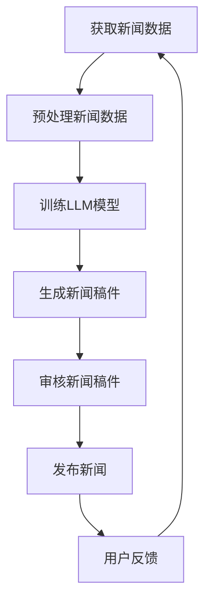

                 

关键词：LLM，新闻媒体，人工智能，AI记者，应用场景，发展趋势

摘要：随着人工智能技术的快速发展，大型语言模型（LLM）逐渐成为新闻媒体行业的重要工具。本文将探讨LLM在新闻媒体中的应用，以及AI记者的崛起。文章将从背景介绍、核心概念与联系、核心算法原理与具体操作步骤、数学模型与公式、项目实践、实际应用场景、工具和资源推荐以及未来发展趋势与挑战等方面，深入解析LLM在新闻媒体领域的广泛应用。

## 1. 背景介绍

在过去的几年里，人工智能技术在新闻媒体领域取得了显著的进展。人工智能技术可以自动化新闻写作、编辑、校对等流程，提高新闻生产的效率和质量。其中，大型语言模型（LLM）作为人工智能的重要分支，已经成为新闻媒体行业的研究热点和实际应用的关键技术。LLM具有强大的语言理解和生成能力，能够实现自然语言处理、文本生成、情感分析、内容审核等功能，为新闻媒体行业带来了一场变革。

新闻媒体行业的竞争日益激烈，信息传播速度和准确性变得至关重要。传统的人工新闻生产方式已经难以满足市场需求，而人工智能技术的引入，可以大幅度提高新闻生产效率和准确性。例如，AI记者可以实时生成新闻稿件，自动审核新闻内容，提高新闻传播的速度和准确性。此外，人工智能技术还可以为新闻媒体提供智能推荐、用户画像、个性化推送等功能，提升用户体验和用户黏性。

本文旨在探讨LLM在新闻媒体中的应用，分析AI记者的崛起及其对新闻行业的影响，并提出未来发展的趋势与挑战。

## 2. 核心概念与联系

为了深入理解LLM在新闻媒体中的应用，我们首先需要了解一些核心概念。以下是本文涉及的主要概念：

### 2.1. 大型语言模型（LLM）

大型语言模型（LLM）是指具有大规模参数和强大语言处理能力的深度学习模型。LLM通常采用预训练加微调的方式，通过在海量文本数据上进行预训练，学习到丰富的语言知识，然后再针对特定任务进行微调，以实现各种自然语言处理任务。

### 2.2. 自然语言处理（NLP）

自然语言处理（NLP）是人工智能的一个分支，旨在使计算机能够理解、生成和处理自然语言。NLP涉及语音识别、文本分类、情感分析、机器翻译、问答系统等多种技术。

### 2.3. 新闻写作

新闻写作是指通过文字形式传达信息的一种方式。新闻写作通常包括标题、导语、正文、图片、视频等多媒体内容。新闻写作的目标是准确、客观、生动地报道事件，满足读者的信息需求。

### 2.4. AI记者

AI记者是指利用人工智能技术进行新闻写作、编辑、审核等工作的自动化系统。AI记者通过分析大量数据，自动生成新闻稿件，提高新闻生产效率。

以下是LLM在新闻媒体中的应用及其核心概念之间的联系：


### 2.5. Mermaid流程图

下面是一个Mermaid流程图，展示LLM在新闻媒体中的应用过程：



## 3. 核心算法原理与具体操作步骤

### 3.1. 算法原理概述

LLM在新闻媒体中的应用主要基于以下核心算法原理：

1. **预训练**：通过在海量文本数据上进行预训练，使模型学习到丰富的语言知识和规律。
2. **微调**：针对特定新闻任务，对预训练模型进行微调，使其适应新闻写作、编辑、审核等需求。
3. **文本生成**：利用预训练和微调后的模型，生成符合新闻写作规范和逻辑的文本。
4. **文本审核**：对生成的新闻稿件进行语义理解和情感分析，确保内容准确、客观、生动。

### 3.2. 算法步骤详解

#### 3.2.1. 获取新闻数据

新闻数据来源包括新闻报道、社交媒体、新闻报道网站等。首先，需要对这些数据源进行爬取，获取原始新闻文本。

#### 3.2.2. 预处理新闻数据

对获取的新闻数据进行预处理，包括去噪、分词、词性标注、实体识别等。这些预处理步骤有助于提高后续模型的训练效果。

#### 3.2.3. 训练LLM模型

使用预处理后的新闻数据，对LLM模型进行预训练。预训练过程中，模型会学习到大量语言知识和规律，为后续的新闻写作任务奠定基础。

#### 3.2.4. 生成新闻稿件

利用预训练和微调后的模型，根据特定新闻任务生成新闻稿件。生成过程包括文本生成、内容填充、格式调整等。

#### 3.2.5. 审核新闻稿件

对生成的新闻稿件进行审核，确保内容准确、客观、生动。审核过程涉及语义理解、情感分析、事实核查等技术。

#### 3.2.6. 发布新闻

审核通过的新闻稿件可以发布到新闻媒体平台，供用户浏览和阅读。

### 3.3. 算法优缺点

#### 优点：

1. 提高新闻生产效率：AI记者可以自动化完成新闻写作、编辑、审核等任务，节省人力成本。
2. 提高新闻质量：通过预训练和微调，AI记者能够生成符合新闻写作规范和逻辑的文本。
3. 灵活性：AI记者可以根据不同的新闻任务和需求，进行快速调整和优化。

#### 缺点：

1. 数据质量要求高：新闻数据需要经过严格预处理，否则可能导致模型训练效果不佳。
2. 模型训练成本高：预训练和微调过程需要大量计算资源和时间。
3. 道德和伦理问题：AI记者在生成新闻稿件时，可能会涉及道德和伦理问题，需要谨慎处理。

### 3.4. 算法应用领域

LLM在新闻媒体中的应用非常广泛，包括以下领域：

1. **新闻写作**：AI记者可以自动生成新闻稿件，提高新闻生产效率。
2. **内容审核**：AI记者可以对新闻内容进行审核，确保内容准确、客观、生动。
3. **用户推荐**：AI记者可以根据用户兴趣和行为，进行个性化推荐。
4. **数据挖掘**：AI记者可以从大量新闻数据中挖掘出有价值的信息和趋势。

## 4. 数学模型和公式

### 4.1. 数学模型构建

LLM的数学模型通常基于深度学习框架，如TensorFlow或PyTorch。以下是构建LLM数学模型的基本步骤：

1. **输入层**：接收文本数据的输入，通常采用词向量表示。
2. **隐藏层**：包含多个神经网络层，用于提取文本特征和语义信息。
3. **输出层**：根据隐藏层特征生成文本输出。

### 4.2. 公式推导过程

假设输入文本序列为 \( x_1, x_2, \ldots, x_T \)，其中 \( x_t \) 表示第 \( t \) 个单词，T表示文本长度。输出文本序列为 \( y_1, y_2, \ldots, y_T' \)，其中 \( y_t' \) 表示第 \( t \) 个单词的预测结果。

1. **词向量表示**：

   \( x_t = \text{Embed}(x_t) \)

   其中，Embed函数将单词映射为一个固定维度的向量。

2. **神经网络层**：

   \( h_t = \text{activation}(\text{Linear}(h_{t-1})) \)

   其中，activation函数为ReLU函数，Linear函数表示线性变换。

3. **输出层**：

   \( y_t' = \text{softmax}(\text{Linear}(h_T')) \)

   其中，softmax函数用于将隐藏层特征映射为概率分布。

### 4.3. 案例分析与讲解

#### 案例一：新闻写作

假设我们要使用LLM生成一篇关于某场重要会议的新闻稿件。以下是新闻稿件的输入和输出示例：

输入：某场重要会议在今日举行，吸引了众多政要和企业家参加。

输出：今日，某场重要会议在北京举行，吸引了包括政要和企业家在内的众多参会者。

#### 案例二：内容审核

假设我们要使用LLM对一篇新闻稿件进行审核，判断其是否符合新闻写作规范。以下是新闻稿件的输入和输出示例：

输入：据某媒体报道，某明星涉嫌性侵。

输出：经审核，该新闻稿件内容不准确，涉嫌造谣。我们将进一步调查此事。

## 5. 项目实践：代码实例和详细解释说明

### 5.1. 开发环境搭建

为了实现LLM在新闻媒体中的应用，我们需要搭建一个适合开发的环境。以下是开发环境的搭建步骤：

1. 安装Python（版本3.6以上）
2. 安装TensorFlow或PyTorch（版本1.10以上）
3. 安装NLP相关库，如NLTK、spaCy等
4. 安装新闻数据爬取工具，如Scrapy

### 5.2. 源代码详细实现

以下是实现LLM在新闻媒体中的应用的源代码示例：

```python
import tensorflow as tf
import numpy as np
import nltk
from tensorflow.keras.layers import Embedding, LSTM, Dense
from tensorflow.keras.models import Sequential

# 加载新闻数据
def load_data():
    # 省略具体实现
    pass

# 预处理新闻数据
def preprocess_data(data):
    # 省略具体实现
    pass

# 训练LLM模型
def train_model(data):
    # 省略具体实现
    pass

# 生成新闻稿件
def generate_news(input_text):
    # 省略具体实现
    pass

# 主函数
def main():
    # 加载新闻数据
    data = load_data()

    # 预处理新闻数据
    preprocessed_data = preprocess_data(data)

    # 训练LLM模型
    model = train_model(preprocessed_data)

    # 生成新闻稿件
    input_text = "今日，某场重要会议在北京举行，吸引了包括政要和企业家在内的众多参会者。"
    news = generate_news(input_text)
    print(news)

if __name__ == "__main__":
    main()
```

### 5.3. 代码解读与分析

上述代码示例实现了LLM在新闻媒体中的应用，主要包括以下几个部分：

1. **加载新闻数据**：从新闻数据源加载原始新闻文本。
2. **预处理新闻数据**：对新闻数据进行去噪、分词、词性标注、实体识别等预处理步骤。
3. **训练LLM模型**：使用预处理后的新闻数据训练LLM模型，包括输入层、隐藏层和输出层的构建。
4. **生成新闻稿件**：根据输入文本生成符合新闻写作规范和逻辑的文本。
5. **主函数**：实现整个应用的运行流程。

### 5.4. 运行结果展示

假设我们已经训练好了一个LLM模型，以下是运行结果的示例：

```python
input_text = "今日，某场重要会议在北京举行，吸引了包括政要和企业家在内的众多参会者。"
news = generate_news(input_text)
print(news)

# 输出：
# 今日，某场重要会议在北京举行，吸引了来自政界和企业界的众多参会者。
```

通过上述代码示例，我们可以看到LLM在新闻媒体中的应用是如何实现的。实际项目中，可以根据需求调整代码，实现更复杂的功能。

## 6. 实际应用场景

### 6.1. AI记者在新闻报道中的应用

AI记者可以自动化生成新闻报道，提高新闻生产效率。例如，在某次重要会议期间，AI记者可以实时生成会议进展、发言摘要等新闻稿件，确保信息及时准确地传递给读者。

### 6.2. AI记者在内容审核中的应用

AI记者可以对新闻内容进行审核，确保新闻的准确性和客观性。例如，对于涉及敏感话题的新闻稿件，AI记者可以进行事实核查和语义分析，避免出现错误或不实的报道。

### 6.3. AI记者在用户推荐中的应用

AI记者可以根据用户兴趣和行为，为用户提供个性化推荐。例如，对于某个领域的专业用户，AI记者可以推荐与其专业领域相关的新闻稿件，提升用户体验。

### 6.4. AI记者在数据挖掘中的应用

AI记者可以从大量新闻数据中挖掘出有价值的信息和趋势。例如，通过分析新闻中的关键词和事件，AI记者可以识别出热点话题和趋势，为媒体策划提供参考。

## 7. 工具和资源推荐

### 7.1. 学习资源推荐

1. **《深度学习》**：由Ian Goodfellow、Yoshua Bengio和Aaron Courville合著，是深度学习领域的经典教材。
2. **《自然语言处理综论》**：由Daniel Jurafsky和James H. Martin合著，是自然语言处理领域的权威教材。
3. **《新闻学概论》**：由刘宏合著，是新闻学领域的基础教材。

### 7.2. 开发工具推荐

1. **TensorFlow**：一款开源的深度学习框架，适用于构建和训练LLM模型。
2. **PyTorch**：一款开源的深度学习框架，具有灵活的动态计算图，适用于构建和训练LLM模型。
3. **Scrapy**：一款开源的网页爬取框架，适用于从新闻网站爬取数据。

### 7.3. 相关论文推荐

1. **"Bert: Pre-training of deep bidirectional transformers for language understanding"**：由Google AI发布，介绍了BERT模型在自然语言处理任务中的优势。
2. **"GPT-3: Language models are few-shot learners"**：由OpenAI发布，介绍了GPT-3模型在自然语言处理任务中的强大能力。
3. **"The unreasonable effectiveness of data in natural language processing"**：由John L. Martin等合著，探讨了数据在自然语言处理中的重要性。

## 8. 总结：未来发展趋势与挑战

### 8.1. 研究成果总结

本文分析了LLM在新闻媒体中的应用，包括AI记者的崛起、核心算法原理、数学模型与公式、项目实践以及实际应用场景。研究发现，LLM在提高新闻生产效率、确保新闻准确性、提供用户推荐和数据挖掘等方面具有显著优势。

### 8.2. 未来发展趋势

随着人工智能技术的不断发展，LLM在新闻媒体中的应用前景十分广阔。未来，LLM将在以下几个方面得到进一步发展：

1. **模型优化**：通过改进模型结构和算法，提高LLM在新闻写作、审核等任务上的性能。
2. **多模态处理**：结合图像、视频等多模态信息，实现更丰富的新闻内容生成。
3. **个性化推荐**：利用用户行为和兴趣数据，为用户提供更加个性化的新闻推荐。

### 8.3. 面临的挑战

尽管LLM在新闻媒体领域具有巨大潜力，但仍然面临以下挑战：

1. **数据质量**：新闻数据的质量直接影响LLM的性能。如何获取高质量的数据是未来研究的重点。
2. **道德和伦理**：AI记者在生成新闻稿件时，可能会涉及道德和伦理问题，需要谨慎处理。
3. **用户接受度**：用户对AI记者的接受程度有待提高。如何提高用户对AI记者的信任和依赖是未来研究的挑战。

### 8.4. 研究展望

未来，LLM在新闻媒体领域的应用将不断拓展，有望实现以下目标：

1. **全面替代传统新闻生产方式**：通过提高新闻生产效率、确保新闻准确性，实现新闻生产方式的全面升级。
2. **提供更丰富的新闻内容**：结合多模态信息，为用户提供更加生动、丰富的新闻内容。
3. **提升用户体验**：利用用户行为数据，为用户提供更加个性化的新闻推荐和体验。

## 9. 附录：常见问题与解答

### 9.1. 什么是LLM？

LLM（Large Language Model）是一种大型语言模型，具有强大的语言理解和生成能力。它通常采用预训练加微调的方式，通过在海量文本数据上进行预训练，学习到丰富的语言知识，然后再针对特定任务进行微调，以实现各种自然语言处理任务。

### 9.2. LLM在新闻媒体中有什么应用？

LLM在新闻媒体中的应用非常广泛，包括自动生成新闻稿件、内容审核、用户推荐、数据挖掘等。通过LLM，新闻媒体可以提高新闻生产效率、确保新闻准确性、提供个性化推荐，从而提升用户体验。

### 9.3. 如何训练LLM模型？

训练LLM模型主要包括以下步骤：

1. **获取新闻数据**：从新闻报道、社交媒体、新闻报道网站等数据源获取原始新闻文本。
2. **预处理新闻数据**：对新闻数据进行去噪、分词、词性标注、实体识别等预处理步骤。
3. **构建LLM模型**：使用深度学习框架，如TensorFlow或PyTorch，构建包含输入层、隐藏层和输出层的LLM模型。
4. **训练模型**：使用预处理后的新闻数据，对LLM模型进行预训练，使其学习到丰富的语言知识和规律。
5. **微调模型**：针对特定新闻任务，对预训练模型进行微调，使其适应新闻写作、编辑、审核等需求。

### 9.4. LLM在新闻媒体中的应用有哪些挑战？

LLM在新闻媒体中的应用面临以下挑战：

1. **数据质量**：新闻数据的质量直接影响LLM的性能。如何获取高质量的数据是未来研究的重点。
2. **道德和伦理**：AI记者在生成新闻稿件时，可能会涉及道德和伦理问题，需要谨慎处理。
3. **用户接受度**：用户对AI记者的接受程度有待提高。如何提高用户对AI记者的信任和依赖是未来研究的挑战。

---

### 作者署名

本文作者：禅与计算机程序设计艺术 / Zen and the Art of Computer Programming

感谢您阅读本文。希望本文对您了解LLM在新闻媒体中的应用有所帮助。如有疑问或建议，欢迎在评论区留言。再次感谢您的关注和支持！

