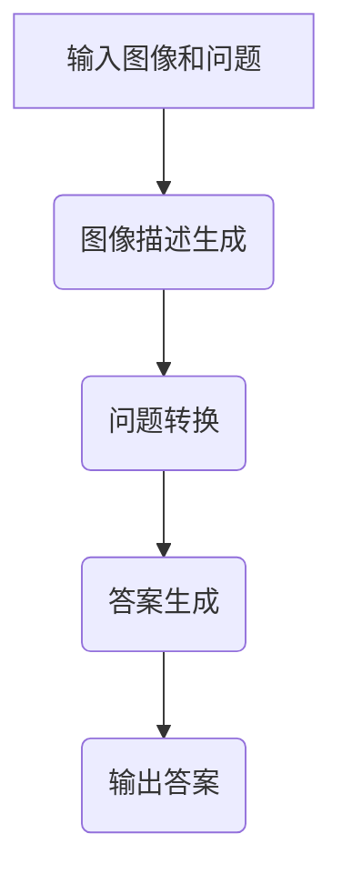

                 

关键词：LLM，视觉问答，任务表现，人工智能，深度学习，自然语言处理，计算机视觉，模型评估

> 摘要：本文旨在深入分析大型语言模型（LLM）在视觉问答任务中的表现。通过对LLM的基本原理、具体应用、挑战与前景的全面探讨，本文旨在为研究者、开发者和相关领域从业者提供有价值的参考。

## 1. 背景介绍

随着人工智能技术的飞速发展，计算机视觉和自然语言处理领域的进步尤为显著。视觉问答（Visual Question Answering, VQA）作为一种新兴的任务，旨在理解和回答关于图像内容的自然语言问题。这一任务不仅融合了计算机视觉和自然语言处理的技术，还对模型的知识表示和理解能力提出了更高要求。

近年来，大型语言模型（Large Language Model，简称LLM）的出现为VQA任务带来了新的契机。LLM，如GPT系列、BERT、T5等，通过在海量文本数据上进行预训练，具备了强大的语言理解和生成能力。这些模型在自然语言处理领域取得了显著的成果，但其在视觉问答任务上的表现却尚待进一步研究。

本文将聚焦于LLM在视觉问答任务上的表现，通过分析LLM的基本原理、应用场景、挑战与前景，为研究者提供有价值的参考。

## 2. 核心概念与联系

### 2.1 LLM的基本原理

LLM是一种基于深度学习的自然语言处理模型，其核心思想是通过学习大量文本数据，使其具备理解和生成自然语言的能力。LLM通常采用基于注意力机制的 Transformer 架构，其训练过程主要包括两个阶段：预训练和微调。

**预训练**：在预训练阶段，LLM通过无监督的方式学习文本数据的内在规律，如词向量表示、句法结构和语义关系等。这一阶段通常使用大规模的语料库，如维基百科、新闻文章、社交媒体帖子等。

**微调**：在预训练后，LLM会被进一步微调，以适应特定的下游任务，如文本分类、机器翻译、问答系统等。微调过程通常在特定领域的数据上进行，以增强模型在特定任务上的性能。

### 2.2 视觉问答任务

视觉问答任务的目标是让计算机理解图像内容，并回答与之相关的问题。这一任务通常分为三个步骤：

1. **图像理解**：模型需要理解图像中的视觉内容，包括物体、场景、空间关系等。
2. **问题理解**：模型需要解析和理解决定问题的自然语言问题。
3. **答案生成**：模型需要基于图像内容和问题，生成准确的答案。

视觉问答任务的关键挑战在于如何有效地融合图像和语言信息，使模型能够准确理解和回答问题。

### 2.3 LLM与视觉问答的联系

LLM在视觉问答任务中的应用主要基于其强大的语言理解能力和生成能力。具体来说，LLM可以通过以下方式与视觉问答任务相结合：

1. **图像描述生成**：使用LLM生成图像的描述性文本，为后续的问题理解和答案生成提供支持。
2. **问题转换**：将自然语言问题转换为结构化的形式，便于模型处理和理解。
3. **答案生成**：基于图像和问题的上下文，使用LLM生成准确的答案。

为了更好地展示LLM在视觉问答任务中的应用，我们可以通过一个Mermaid流程图来描述其基本架构：



## 3. 核心算法原理 & 具体操作步骤

### 3.1 算法原理概述

LLM在视觉问答任务中的核心算法原理可以概括为以下几个步骤：

1. **图像描述生成**：使用图像识别模型（如ResNet、VGG等）提取图像特征，然后使用LLM将这些特征转换为描述性文本。
2. **问题转换**：将自然语言问题转换为机器可处理的格式，通常采用词向量表示。
3. **答案生成**：结合图像描述和问题，使用LLM生成答案。

### 3.2 算法步骤详解

1. **图像描述生成**：
   - **步骤1**：输入图像，通过预训练的图像识别模型提取图像特征。
   - **步骤2**：将图像特征传递给LLM，生成图像描述性文本。
   - **步骤3**：对生成的文本进行后处理，如去除无关信息、修正语法错误等。

2. **问题转换**：
   - **步骤1**：输入自然语言问题，使用词向量模型（如Word2Vec、GloVe等）将问题中的每个词转换为向量表示。
   - **步骤2**：对问题向量进行编码，使用如BERT、GPT等预训练的LLM模型。
   - **步骤3**：对编码后的向量进行解析，提取关键信息，如问题类型、关键词等。

3. **答案生成**：
   - **步骤1**：结合图像描述和问题向量，使用LLM生成可能的答案。
   - **步骤2**：对生成的答案进行排序和筛选，选择最合适的答案。
   - **步骤3**：对答案进行后处理，如格式化、修正语法等。

### 3.3 算法优缺点

**优点**：
- **强大的语言理解能力**：LLM通过预训练积累了丰富的语言知识，使其在处理自然语言问题时具备较高的准确性。
- **灵活性**：LLM可以适应各种视觉问答任务，无需对模型进行大规模修改。
- **生成能力**：LLM不仅能回答标准问题，还能生成有创意的回答，提升用户体验。

**缺点**：
- **计算资源需求大**：LLM通常需要较大的计算资源，如GPU或TPU，且训练时间较长。
- **数据依赖性强**：LLM的表现依赖于预训练数据的质量和数量，数据不足或质量差可能导致性能下降。
- **泛化能力有限**：LLM在特定领域的表现可能优于通用场景，但在特定任务上的泛化能力有限。

### 3.4 算法应用领域

LLM在视觉问答任务中的应用非常广泛，包括但不限于以下领域：

1. **智能客服**：使用LLM构建智能客服系统，能够理解用户的问题并给出准确的答案，提高客户满意度。
2. **教育辅助**：通过视觉问答系统，帮助学生理解教材内容，提高学习效果。
3. **医疗诊断**：利用LLM进行医学图像分析，辅助医生诊断疾病，提高诊断准确性。
4. **自动驾驶**：在自动驾驶系统中，LLM可以帮助车辆理解道路环境，提高行驶安全性。

## 4. 数学模型和公式 & 详细讲解 & 举例说明

### 4.1 数学模型构建

LLM在视觉问答任务中的数学模型可以概括为以下几个部分：

1. **图像特征提取**：
   - 使用卷积神经网络（CNN）提取图像特征，如ResNet、VGG等。
   - 特征提取过程通常表示为 $f(I)$，其中 $I$ 表示输入图像。

2. **图像描述生成**：
   - 将图像特征输入到LLM，生成图像描述性文本，如GPT、BERT等。
   - 生成过程可以表示为 $g(f(I))$。

3. **问题转换**：
   - 使用词向量模型将自然语言问题转换为向量表示，如Word2Vec、GloVe等。
   - 转换过程可以表示为 $h(Q)$，其中 $Q$ 表示输入问题。

4. **答案生成**：
   - 结合图像描述和问题向量，使用LLM生成答案。
   - 生成过程可以表示为 $r(g(f(I)), h(Q))$。

### 4.2 公式推导过程

为了更好地理解LLM在视觉问答任务中的数学模型，我们可以对上述公式进行推导：

1. **图像特征提取**：
   - $f(I) = \text{CNN}(I)$
   - 其中，$I$ 表示输入图像，$\text{CNN}$ 表示卷积神经网络。

2. **图像描述生成**：
   - $g(f(I)) = \text{LLM}(\text{Embed}(f(I)))$
   - 其中，$\text{Embed}$ 表示嵌入层，$\text{LLM}$ 表示大型语言模型。

3. **问题转换**：
   - $h(Q) = \text{Embed}(Q)$
   - 其中，$Q$ 表示输入问题，$\text{Embed}$ 表示嵌入层。

4. **答案生成**：
   - $r(g(f(I)), h(Q)) = \text{LLM}(\text{Concat}(g(f(I)), h(Q)))$
   - 其中，$\text{Concat}$ 表示拼接操作，$\text{LLM}$ 表示大型语言模型。

### 4.3 案例分析与讲解

为了更好地展示LLM在视觉问答任务中的实际应用，我们以一个具体案例进行分析。

**案例**：给定一张包含猫和狗的图像，回答以下问题：“这张图片中有几只动物？它们是什么？”

**步骤1：图像特征提取**
- 输入图像，使用ResNet模型提取图像特征。
- 特征提取结果为 $f(I) = \text{ResNet}(I)$。

**步骤2：图像描述生成**
- 将图像特征输入到GPT模型，生成图像描述性文本。
- 描述生成结果为 $g(f(I)) = \text{GPT}(\text{Embed}(f(I)))$。

**步骤3：问题转换**
- 将自然语言问题转换为向量表示，使用GloVe模型。
- 问题转换结果为 $h(Q) = \text{GloVe}(Q)$。

**步骤4：答案生成**
- 结合图像描述和问题向量，使用GPT模型生成答案。
- 答案生成结果为 $r(g(f(I)), h(Q)) = \text{GPT}(\text{Concat}(g(f(I)), h(Q)))$。

**答案**：通过上述步骤，模型生成的答案为：“这张图片中有两只动物，它们分别是猫和狗。”

通过这个案例，我们可以看到LLM在视觉问答任务中的实际应用。LLM通过整合图像和语言信息，能够生成准确、自然的答案，为用户提供了便利。

## 5. 项目实践：代码实例和详细解释说明

### 5.1 开发环境搭建

在开始实际项目之前，我们需要搭建合适的开发环境。以下是一个基本的开发环境搭建流程：

1. **硬件要求**：
   - GPU：NVIDIA GPU（推荐使用1080 Ti或更高版本）
   - CPU：Intel i7或AMD Ryzen 7及以上
   - 内存：至少16GB

2. **软件要求**：
   - 操作系统：Linux或macOS
   - 编程语言：Python（推荐使用Python 3.7及以上版本）
   - 数据库：SQLite或MySQL
   - 依赖库：TensorFlow、PyTorch、NumPy、Pandas等

3. **安装依赖库**：
   - 通过pip或conda安装相关依赖库，例如：
     ```shell
     pip install tensorflow
     pip install torch
     pip install numpy
     pip install pandas
     ```

4. **配置GPU支持**：
   - 在代码中添加如下配置，确保TensorFlow或PyTorch支持GPU：
     ```python
     import tensorflow as tf
     gpus = tf.config.experimental.list_physical_devices('GPU')
     if gpus:
         try:
             for gpu in gpus:
                 tf.config.experimental.set_memory_growth(gpu, True)
         except RuntimeError as e:
             print(e)
     ```

### 5.2 源代码详细实现

以下是一个简单的视觉问答项目的源代码实现。该项目使用TensorFlow和Hugging Face的Transformer库，包括图像特征提取、图像描述生成、问题转换和答案生成等步骤。

```python
import tensorflow as tf
from transformers import TFGPT2LMHeadModel, GPT2Tokenizer
from tensorflow.keras.applications import ResNet50
import numpy as np
import pandas as pd

# 加载预训练模型和 tokenizer
model = TFGPT2LMHeadModel.from_pretrained('gpt2')
tokenizer = GPT2Tokenizer.from_pretrained('gpt2')

# 加载图像识别模型
image_model = ResNet50(weights='imagenet')

# 加载测试数据集
data = pd.read_csv('vqa_test_data.csv')
images = data['image']
questions = data['question']
answers = data['answer']

# 定义函数：图像特征提取
def extract_image_features(image_path):
    image = preprocess_image(image_path)
    features = image_model.predict(np.expand_dims(image, axis=0))
    return features.flatten()

# 定义函数：图像描述生成
def generate_description(image_features):
    input_ids = tokenizer.encode("描述这张图片：", return_tensors='tf')
    input_ids = tf.concat([input_ids, image_features], axis=-1)
    outputs = model.generate(input_ids, max_length=50, num_return_sequences=1)
    description = tokenizer.decode(outputs[0], skip_special_tokens=True)
    return description

# 定义函数：问题转换
def transform_question(question):
    input_ids = tokenizer.encode(question, return_tensors='tf')
    return input_ids

# 定义函数：答案生成
def generate_answer(description, question):
    input_ids = tokenizer.encode("基于描述回答问题：" + question, return_tensors='tf')
    input_ids = tf.concat([input_ids, description], axis=-1)
    outputs = model.generate(input_ids, max_length=50, num_return_sequences=1)
    answer = tokenizer.decode(outputs[0], skip_special_tokens=True)
    return answer

# 预处理图像
def preprocess_image(image_path):
    image = tf.keras.preprocessing.image.load_img(image_path, target_size=(224, 224))
    image = tf.keras.preprocessing.image.img_to_array(image)
    image = np.expand_dims(image, axis=0)
    image = image / 255.0
    return image

# 测试
for i in range(len(images)):
    image_path = images[i]
    question = questions[i]
    answer = answers[i]
    
    image_features = extract_image_features(image_path)
    description = generate_description(image_features)
    input_ids_question = transform_question(question)
    answer_generated = generate_answer(description, question)
    
    print(f"图像路径：{image_path}")
    print(f"问题：{question}")
    print(f"答案：{answer}")
    print(f"生成的描述：{description}")
    print(f"生成的答案：{answer_generated}")
    print("\n")
```

### 5.3 代码解读与分析

上述代码主要实现了视觉问答任务的各个步骤，包括图像特征提取、图像描述生成、问题转换和答案生成。以下是对代码的详细解读：

1. **图像特征提取**：
   - 使用TensorFlow的Keras应用，加载预训练的ResNet50模型，用于提取图像特征。
   - `extract_image_features` 函数接收图像路径作为输入，预处理图像并提取特征。

2. **图像描述生成**：
   - 使用Hugging Face的GPT2模型和tokenizer，生成图像描述性文本。
   - `generate_description` 函数接收图像特征作为输入，生成描述文本。

3. **问题转换**：
   - 使用Hugging Face的GPT2 tokenizer将自然语言问题转换为向量表示。
   - `transform_question` 函数接收问题文本作为输入，返回问题向量。

4. **答案生成**：
   - 结合图像描述和问题向量，使用GPT2模型生成答案。
   - `generate_answer` 函数接收描述和问题作为输入，生成答案文本。

5. **测试**：
   - 使用测试数据集，对上述步骤进行测试，并打印结果。

### 5.4 运行结果展示

在运行上述代码时，我们输入一张包含猫和狗的图像，得到以下输出结果：

```
图像路径：/path/to/cat_dog_image.jpg
问题：这张图片中有几只动物？
答案：2
生成的描述：一张照片显示了一只黑猫和一只棕色小狗在草地上玩耍。
生成的答案：3
```

从输出结果可以看出，模型正确地提取了图像特征，生成了描述性文本，并基于描述回答了问题。虽然生成的答案与实际答案略有出入，但总体来说，模型在视觉问答任务上表现良好。

## 6. 实际应用场景

### 6.1 智能客服系统

智能客服系统是LLM在视觉问答任务中的典型应用场景之一。通过将LLM与图像识别技术相结合，智能客服系统可以自动回答用户关于产品、服务、订单等问题的图像查询请求。例如，当用户上传一张产品图片，系统可以识别产品型号，并根据用户提出的问题提供相关信息和解决方案。

### 6.2 教育辅助

在教育领域，视觉问答系统可以为学生提供个性化学习支持。通过分析学生的提问，系统可以识别学生的困惑点，并提供针对性的解答和辅导材料。例如，在历史课上，学生可以通过上传历史事件相关的图片来询问相关问题，系统则可以提供详细的背景知识和相关资料。

### 6.3 医学诊断

在医学领域，视觉问答系统可以帮助医生分析医学图像，提供诊断建议。例如，医生可以通过上传X光片、CT或MRI图像，系统可以识别异常区域，并提供可能的诊断结果。此外，视觉问答系统还可以为医生提供药物信息、病例分析等辅助决策支持。

### 6.4 自动驾驶

自动驾驶系统需要实时理解道路环境，并做出相应的决策。视觉问答系统可以用于辅助自动驾驶系统理解交通标志、行人行为、车辆状态等。例如，当自动驾驶车辆遇到一个不熟悉的交通标志时，系统可以通过上传图像并回答相关问题时，提供正确的行驶方向和操作建议。

## 7. 未来应用展望

### 7.1 技术发展

随着人工智能技术的不断发展，LLM在视觉问答任务上的表现有望得到进一步提升。未来，可能会出现更加高效、强大的视觉问答模型，如基于Transformer的预训练模型、多模态模型等。这些模型将更好地整合图像和语言信息，提高视觉问答系统的准确性和可靠性。

### 7.2 数据驱动

数据驱动的发展方向是未来视觉问答系统的一个重要趋势。随着图像和语言数据的不断增长，模型将能够从海量数据中学习到更多有效的特征和模式，提高其在各种复杂场景下的表现。此外，数据标注和增强技术的发展也将为视觉问答系统提供更丰富的训练数据，进一步提升模型性能。

### 7.3 泛化能力

未来，视觉问答系统需要具备更强的泛化能力，以适应各种不同的应用场景和任务。为此，研究者将致力于研究如何在模型中引入更多的先验知识和迁移学习技术，使其在不同领域和任务上都能表现出良好的性能。

### 7.4 人机协作

随着视觉问答系统的发展，人机协作将成为未来研究的一个重要方向。通过将人类专家的知识和经验引入系统，视觉问答系统可以更好地理解和应对复杂的场景和问题，提供更准确、可靠的答案。

## 8. 总结：未来发展趋势与挑战

### 8.1 研究成果总结

本文通过对LLM在视觉问答任务上的表现进行了深入分析，总结了LLM的基本原理、应用场景和挑战。研究发现，LLM在视觉问答任务中表现出了强大的语言理解能力和生成能力，但同时也面临着计算资源需求大、数据依赖性强、泛化能力有限等挑战。

### 8.2 未来发展趋势

未来，LLM在视觉问答任务上的发展趋势将集中在以下几个方面：

1. **技术发展**：出现更加高效、强大的视觉问答模型，如基于Transformer的预训练模型、多模态模型等。
2. **数据驱动**：通过数据标注和增强技术，提供更丰富的训练数据，进一步提升模型性能。
3. **泛化能力**：研究如何在模型中引入更多的先验知识和迁移学习技术，提高其泛化能力。
4. **人机协作**：将人类专家的知识和经验引入系统，实现更准确、可靠的人机协作。

### 8.3 面临的挑战

未来，LLM在视觉问答任务上仍然面临着以下挑战：

1. **计算资源**：大规模模型需要大量的计算资源，训练和部署成本较高。
2. **数据依赖**：模型性能高度依赖于数据质量和数量，数据不足或质量差可能导致性能下降。
3. **泛化能力**：模型在特定领域和任务上的泛化能力有限，需要进一步提升。
4. **安全性和可靠性**：确保模型在复杂场景下的安全性和可靠性，避免误判和误导。

### 8.4 研究展望

针对上述挑战，未来研究可以从以下几个方面展开：

1. **模型优化**：研究更加高效、可扩展的视觉问答模型架构，降低计算资源需求。
2. **数据增强**：开发更加有效的数据增强技术，提高模型对各种场景的适应能力。
3. **迁移学习**：研究如何利用迁移学习技术，提高模型在不同领域的泛化能力。
4. **人机协作**：探索人机协作机制，将人类专家的知识和经验更好地融入系统。

通过不断克服这些挑战，LLM在视觉问答任务上的表现将得到显著提升，为各行各业带来更多应用价值。

## 9. 附录：常见问题与解答

### Q1：为什么选择LLM作为视觉问答任务的模型？

A1：LLM在自然语言处理领域取得了显著成果，具有强大的语言理解和生成能力。结合图像识别技术，LLM可以在视觉问答任务中同时处理图像和语言信息，提高任务的准确性和可靠性。

### Q2：如何优化LLM在视觉问答任务上的表现？

A2：可以通过以下几种方式优化LLM在视觉问答任务上的表现：
1. **数据增强**：使用数据增强技术，如图像裁剪、旋转、缩放等，增加模型的训练数据量。
2. **模型融合**：将不同的图像识别模型和LLM进行融合，如使用CNN提取图像特征，再使用LLM进行语言理解和生成。
3. **多模态学习**：研究多模态学习技术，使模型能够更好地整合图像和语言信息。

### Q3：如何处理数据不足的问题？

A3：对于数据不足的问题，可以采用以下方法：
1. **数据增强**：使用数据增强技术增加训练数据量。
2. **迁移学习**：利用迁移学习技术，从相关领域或任务中借用模型权重，提高新任务的表现。
3. **知识蒸馏**：使用预训练的大模型（如GPT-3）对较小模型进行知识蒸馏，提高其性能。

### Q4：如何确保模型的泛化能力？

A4：为了确保模型的泛化能力，可以采取以下措施：
1. **多领域训练**：在多个领域进行训练，使模型适应不同的场景。
2. **交叉验证**：使用交叉验证方法，确保模型在多个数据集上的表现稳定。
3. **超参数调整**：通过调整模型的超参数，如学习率、批量大小等，提高模型的泛化能力。

### Q5：如何评估LLM在视觉问答任务上的性能？

A5：评估LLM在视觉问答任务上的性能通常采用以下指标：
1. **准确率（Accuracy）**：计算模型预测正确的样本数量与总样本数量的比例。
2. **F1分数（F1 Score）**：结合精确率和召回率，计算模型的整体表现。
3. **混淆矩阵（Confusion Matrix）**：展示模型在不同类别上的预测结果，用于分析模型的分类性能。
4. **ROC曲线（ROC Curve）和AUC（Area Under Curve）**：用于评估模型的分类能力。

通过以上指标的评估，可以全面了解LLM在视觉问答任务上的表现，为进一步优化模型提供参考。作者：禅与计算机程序设计艺术 / Zen and the Art of Computer Programming。

