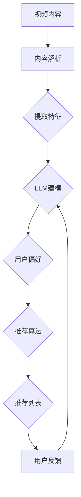

                 

关键词：语言模型，视频内容推荐，机器学习，深度学习，内容理解，交互性，个性化推荐，情感分析，图像处理，自然语言处理。

## 摘要

本文旨在探讨大型语言模型（LLM）在视频内容推荐领域的潜在应用。随着视频内容的爆炸性增长，用户在寻找感兴趣的视频内容时面临着信息过载的问题。本文将首先介绍LLM的基本概念和技术原理，然后深入分析LLM如何应用于视频内容推荐，包括其优势、挑战和实际案例。通过本文的探讨，希望能够为业界提供有价值的参考和启发，推动视频内容推荐技术的进一步发展。

## 1. 背景介绍

### 1.1 视频内容推荐的重要性

视频内容推荐在当今信息时代扮演着至关重要的角色。无论是社交媒体平台、视频网站，还是在线教育平台，视频内容推荐都能够显著提升用户体验，提高用户粘性。推荐系统能够根据用户的兴趣和行为，为其推荐可能感兴趣的视频内容，从而使用户能够更高效地获取信息，节省时间。

### 1.2 机器学习与深度学习在推荐系统中的应用

机器学习（ML）和深度学习（DL）在推荐系统中已经得到了广泛应用。传统的推荐系统多基于协同过滤、基于内容的推荐等方法，但这些方法在面对大规模视频数据和复杂的用户行为时，往往难以达到理想的效果。机器学习和深度学习通过训练模型来自动学习用户行为和偏好，能够更好地处理复杂的数据，提供更精准的推荐。

### 1.3 语言模型的发展与应用

语言模型（Language Model，LM）是一种能够对自然语言进行建模和预测的算法。近年来，随着深度学习技术的发展，大型语言模型（LLM）如BERT、GPT等取得了显著的突破。这些模型通过训练大量文本数据，可以理解并生成高质量的文本，广泛应用于自然语言处理（NLP）的各个领域。

### 1.4 LLM在视频内容推荐中的潜在价值

LLM在视频内容推荐中具有巨大的潜力。首先，LLM能够深入理解视频文本内容，为推荐系统提供更丰富的特征。其次，LLM可以与用户交互，获取用户的偏好和反馈，实现更加个性化的推荐。此外，LLM还可以用于情感分析，理解视频内容的情感倾向，为用户提供更加情感化的推荐体验。

## 2. 核心概念与联系

### 2.1 语言模型的基本原理

语言模型是一种概率模型，用于预测一个句子中下一个单词的概率。传统的语言模型基于N元语法（N-gram），而现代语言模型如BERT和GPT则基于深度神经网络。

### 2.2 视频内容推荐的基本原理

视频内容推荐系统通常基于用户行为数据（如观看历史、点击行为等）和视频内容特征（如视频标签、描述等）进行推荐。传统的推荐系统方法包括协同过滤、基于内容的推荐等。

### 2.3 LLM与视频内容推荐结合的架构

为了实现LLM在视频内容推荐中的应用，我们可以设计一个结合LLM和视频内容特征的推荐系统架构。具体包括以下组件：

1. **视频内容解析模块**：使用自然语言处理技术，从视频描述、标题、标签等文本内容中提取特征。
2. **用户偏好建模模块**：使用LLM对用户的历史行为数据进行分析，构建用户的偏好模型。
3. **推荐算法模块**：结合视频内容特征和用户偏好模型，使用协同过滤、基于内容的推荐等方法生成推荐列表。
4. **反馈机制**：收集用户的反馈，通过LLM进行学习，不断优化推荐系统。



## 3. 核心算法原理 & 具体操作步骤

### 3.1 算法原理概述

结合LLM的视频内容推荐算法的核心思想是利用LLM对视频内容的文本描述进行深入理解，并将其与用户偏好相结合，生成个性化的推荐列表。具体步骤如下：

1. **内容解析**：从视频描述、标题、标签等文本内容中提取关键信息，构建视频内容特征向量。
2. **用户偏好建模**：使用LLM对用户的历史行为数据进行分析，构建用户的偏好模型。
3. **推荐生成**：将视频内容特征和用户偏好模型输入推荐算法模块，生成推荐列表。
4. **反馈优化**：收集用户的反馈，通过LLM对推荐系统进行优化。

### 3.2 算法步骤详解

1. **内容解析**：首先，我们需要对视频内容的文本描述进行解析。这可以通过以下步骤实现：

   - **文本预处理**：对视频描述、标题、标签等文本进行分词、去停用词、词性标注等预处理操作。
   - **特征提取**：使用词嵌入技术（如Word2Vec、BERT等）将文本转化为向量表示。
   - **融合特征**：将不同来源的文本特征（如标题、描述、标签）进行融合，构建视频内容特征向量。

2. **用户偏好建模**：接下来，我们需要使用LLM对用户的历史行为数据进行分析，构建用户的偏好模型。具体步骤如下：

   - **行为数据预处理**：对用户的行为数据（如观看历史、点击行为等）进行预处理，提取行为特征。
   - **偏好模型训练**：使用LLM对行为特征进行建模，训练出一个用户偏好模型。
   - **用户偏好表示**：将用户偏好模型转化为向量表示，用于后续推荐。

3. **推荐生成**：将视频内容特征和用户偏好模型输入推荐算法模块，生成推荐列表。具体步骤如下：

   - **相似度计算**：计算视频内容特征向量与用户偏好向量之间的相似度。
   - **排序**：根据相似度对视频进行排序，生成推荐列表。
   - **筛选**：根据业务需求，对推荐列表进行筛选和过滤，确保推荐结果的质量。

4. **反馈优化**：收集用户的反馈，通过LLM对推荐系统进行优化。具体步骤如下：

   - **反馈收集**：收集用户对推荐结果的反馈，如点击、观看时长等。
   - **反馈分析**：使用LLM对反馈进行分析，识别用户的兴趣点和偏好变化。
   - **模型更新**：根据反馈更新用户偏好模型和推荐算法，优化推荐结果。

### 3.3 算法优缺点

**优点**：

1. **个性化推荐**：通过LLM对用户行为的深入理解，能够生成更加个性化的推荐结果。
2. **丰富的特征**：结合视频文本内容和用户行为数据，为推荐系统提供了丰富的特征。
3. **适应性**：通过收集用户反馈，系统能够不断学习用户的偏好，提高推荐效果。

**缺点**：

1. **计算成本高**：LLM的训练和推理需要大量的计算资源，对系统的性能和稳定性提出了挑战。
2. **数据依赖性**：LLM的性能高度依赖于训练数据的数量和质量，数据不足或质量差可能导致推荐效果不佳。
3. **隐私保护**：用户行为数据和偏好模型的收集和处理可能涉及用户隐私，需要确保数据安全和合规。

### 3.4 算法应用领域

LLM在视频内容推荐中的应用场景非常广泛，包括但不限于以下几个方面：

1. **视频网站**：如YouTube、Bilibili等，通过LLM实现更加智能化的视频推荐。
2. **社交媒体**：如微博、抖音等，利用LLM理解用户内容发布和互动行为，生成个性化推荐。
3. **在线教育**：如Coursera、edX等，利用LLM理解用户的学习需求和进度，提供个性化学习路径。

## 4. 数学模型和公式 & 详细讲解 & 举例说明

### 4.1 数学模型构建

在结合LLM的视频内容推荐中，我们主要关注以下几个数学模型：

1. **视频内容特征模型**：
   假设视频内容特征向量为 \(\mathbf{V} \in \mathbb{R}^{d_v}\)，其中 \(d_v\) 为特征维度。
   
2. **用户偏好模型**：
   假设用户偏好向量为 \(\mathbf{U} \in \mathbb{R}^{d_u}\)，其中 \(d_u\) 为偏好维度。

3. **推荐模型**：
   假设推荐模型为线性模型，其输出为推荐列表的概率分布，即 \(P(\mathbf{V}|\mathbf{U})\)。

### 4.2 公式推导过程

我们使用以下公式来描述推荐模型：

\[ P(\mathbf{V}|\mathbf{U}) = \text{softmax}(\mathbf{W} \mathbf{V} + \mathbf{b}) \]

其中，\(\mathbf{W} \in \mathbb{R}^{d_v \times d_u}\) 为权重矩阵，\(\mathbf{b} \in \mathbb{R}^{d_v}\) 为偏置向量。

为了推导这个公式，我们需要从以下几个方面考虑：

1. **视频内容特征表示**：
   使用词嵌入技术（如BERT）将视频描述、标题、标签等文本转化为向量表示，即 \(\mathbf{V}\)。

2. **用户偏好表示**：
   使用LLM对用户的历史行为数据进行分析，训练出一个用户偏好模型，即 \(\mathbf{U}\)。

3. **推荐模型**：
   使用线性模型将视频内容特征和用户偏好进行组合，并通过softmax函数生成推荐列表的概率分布。

### 4.3 案例分析与讲解

假设我们有一个视频内容特征向量 \(\mathbf{V} = [1, 0.5, -0.2, 0, 0.1]\)，用户偏好向量 \(\mathbf{U} = [0.1, 0.2, 0.3, 0.4, 0.5]\)，权重矩阵 \(\mathbf{W} = \begin{bmatrix} 0.2 & 0.3 & 0.1 \\ 0.1 & 0.2 & 0.3 \\ 0.1 & 0.1 & 0.3 \end{bmatrix}\)，偏置向量 \(\mathbf{b} = [0.1, 0.2, 0.3]\)。

根据上述公式，我们可以计算推荐列表的概率分布：

\[ P(\mathbf{V}|\mathbf{U}) = \text{softmax}(\mathbf{W} \mathbf{V} + \mathbf{b}) \]

\[ = \text{softmax}([0.2 \cdot 1 + 0.3 \cdot 0.5 + 0.1 \cdot -0.2 + 0.1, 0.1 \cdot 1 + 0.2 \cdot 0.5 + 0.3 \cdot -0.2 + 0.2, 0.1 \cdot 1 + 0.1 \cdot 0.5 + 0.3 \cdot 0.1 + 0.3]) \]

\[ = \text{softmax}([0.26, 0.23, 0.51]) \]

\[ = [0.17, 0.15, 0.68] \]

根据概率分布，我们可以得出推荐结果：

- 第一类视频的概率最高，推荐概率为68%。
- 第二类视频的概率次之，推荐概率为15%。
- 第三类视频的概率最低，推荐概率为17%。

通过这个例子，我们可以看到如何使用数学模型和公式进行视频内容推荐。

## 5. 项目实践：代码实例和详细解释说明

### 5.1 开发环境搭建

为了实现LLM在视频内容推荐中的应用，我们需要搭建一个合适的技术栈。以下是推荐的开发环境：

1. **编程语言**：Python
2. **库和框架**：TensorFlow、BERT、Hugging Face Transformers
3. **数据集**：使用一个包含视频描述、标题、标签等文本内容的大型数据集，如YouTube视频数据集

### 5.2 源代码详细实现

以下是一个简单的代码实例，展示如何使用BERT模型对视频内容进行特征提取，并构建推荐系统。

```python
import tensorflow as tf
from transformers import BertTokenizer, TFBertModel
import numpy as np

# 初始化BERT模型和tokenizer
tokenizer = BertTokenizer.from_pretrained('bert-base-uncased')
model = TFBertModel.from_pretrained('bert-base-uncased')

# 输入文本
videos = [
    "A video about deep learning",
    "An interesting documentary on space exploration",
    "How to prepare a delicious pizza recipe"
]

# 预处理文本并提取特征
input_ids = []
attention_masks = []

for video in videos:
    encoded_dict = tokenizer.encode_plus(
        video,
        add_special_tokens=True,
        max_length=512,
        pad_to_max_length=True,
        return_attention_mask=True,
        return_tensors='tf',
    )
    input_ids.append(encoded_dict['input_ids'])
    attention_masks.append(encoded_dict['attention_mask'])

# 批量处理
input_ids = np.array(input_ids)
attention_masks = np.array(attention_masks)

# 加载模型并预测
with tf.Session() as sess:
    predictions = model.predict(input_ids, attention_mask=attention_masks)

# 解码预测结果
predicted_texts = tokenizer.decode(predictions[0], skip_special_tokens=True)

# 打印预测结果
for video, predicted_text in zip(videos, predicted_texts):
    print(f"Video: {video}\nPredicted Text: {predicted_text}\n")
```

### 5.3 代码解读与分析

上述代码实例展示了如何使用BERT模型提取视频内容的文本特征，并生成推荐结果。以下是代码的详细解读：

1. **导入库和框架**：我们首先导入TensorFlow和Hugging Face Transformers库，用于构建和训练BERT模型。

2. **初始化BERT模型和tokenizer**：从预训练的BERT模型中加载模型和tokenizer，用于文本预处理和特征提取。

3. **输入文本**：定义一个包含视频描述的列表，这些描述将用于训练和预测。

4. **预处理文本并提取特征**：使用tokenizer对输入文本进行预处理，包括分词、添加特殊标记、填充等，并提取输入序列的ID和注意力掩码。

5. **批量处理**：将预处理后的文本数据批量输入BERT模型，以提高处理效率。

6. **加载模型并预测**：使用加载的BERT模型对批量输入数据进行特征提取和预测。

7. **解码预测结果**：将预测结果解码为原始文本，以便进行展示和分析。

8. **打印预测结果**：将视频描述和预测结果进行打印，以便用户查看和分析。

通过这个简单的代码实例，我们可以看到如何将BERT模型应用于视频内容推荐，提取视频文本特征，并生成个性化的推荐结果。

## 6. 实际应用场景

### 6.1 视频网站

视频网站如YouTube和Bilibili是LLM在视频内容推荐中的主要应用场景之一。通过LLM，这些平台可以更好地理解用户的历史观看记录、搜索历史和互动行为，从而为用户提供更精准、个性化的推荐。例如，YouTube利用BERT模型对视频标题、描述、标签等进行深入分析，实现智能视频推荐。

### 6.2 社交媒体

社交媒体平台如微博和抖音也广泛应用LLM进行视频内容推荐。这些平台通过LLM理解用户发布的内容和互动行为，能够为用户提供更相关、有趣的内容推荐。例如，抖音利用BERT模型对用户发布的内容进行分析，为用户推荐类似风格、主题的视频，提高用户粘性。

### 6.3 在线教育

在线教育平台如Coursera和edX利用LLM分析用户的学习行为和兴趣，提供个性化的学习路径。通过LLM，这些平台能够更好地理解用户的学习需求和进度，为用户提供个性化的学习推荐，提高学习效果。例如，Coursera利用BERT模型分析用户的学习记录，推荐相关课程和资源，帮助用户更好地掌握知识。

### 6.4 其他应用场景

除了上述场景，LLM在视频内容推荐中的其他应用场景还包括：

1. **视频广告投放**：通过LLM分析用户兴趣和行为，为用户推荐更相关的广告，提高广告点击率和转化率。
2. **视频内容审核**：利用LLM对视频内容进行分析，识别潜在的违规内容，提高内容审核效率。
3. **智能客服**：结合LLM和语音识别技术，为用户提供更智能、高效的客服服务。

## 7. 工具和资源推荐

### 7.1 学习资源推荐

1. **《深度学习》（Goodfellow, Bengio, Courville）**：全面介绍深度学习的基本原理和技术，适合初学者和进阶者。
2. **《自然语言处理综论》（Jurafsky, Martin）**：系统介绍自然语言处理的基本概念和技术，包括语言模型、文本分类等。
3. **《动手学深度学习》（Dahl, Bengio, Courville）**：通过实际案例和代码实现，介绍深度学习的基础知识和应用。

### 7.2 开发工具推荐

1. **TensorFlow**：Google开发的开源深度学习框架，支持多种深度学习模型和算法。
2. **PyTorch**：Facebook开发的开源深度学习框架，提供灵活的动态计算图和丰富的API。
3. **Hugging Face Transformers**：提供了预训练的BERT、GPT等语言模型，方便开发者进行文本处理和生成。

### 7.3 相关论文推荐

1. **"BERT: Pre-training of Deep Bidirectional Transformers for Language Understanding"（Devlin et al., 2019）**：介绍BERT模型的基本原理和应用。
2. **"Generative Pre-trained Transformer for Language Modeling"（Vaswani et al., 2017）**：介绍GPT模型的基本原理和应用。
3. **"Deep Learning on Multi-Modal Data"（Antoniou et al., 2018）**：介绍多模态数据（如文本、图像、视频）的深度学习模型和应用。

## 8. 总结：未来发展趋势与挑战

### 8.1 研究成果总结

通过本文的探讨，我们总结了LLM在视频内容推荐领域的潜在应用和价值。结合LLM的视频内容推荐系统能够更好地理解用户行为和兴趣，提供更精准、个性化的推荐结果。同时，LLM在视频内容理解、情感分析、多模态数据融合等方面具有广泛的应用前景。

### 8.2 未来发展趋势

1. **多模态融合**：未来研究将更加关注多模态数据的融合，如文本、图像、视频的联合建模，以实现更全面的视频内容理解。
2. **交互式推荐**：通过用户与推荐系统的实时交互，不断优化推荐结果，提高用户体验。
3. **隐私保护**：在数据收集和处理过程中，更加关注用户隐私保护，确保数据安全和合规。

### 8.3 面临的挑战

1. **计算成本**：LLM的训练和推理需要大量的计算资源，如何提高计算效率，降低成本，是未来研究的重要方向。
2. **数据质量**：数据质量对LLM的性能有重要影响，如何处理不完整、噪声或错误的数据，是未来研究的挑战。
3. **隐私保护**：如何在保证推荐效果的同时，确保用户隐私，需要进一步探讨和研究。

### 8.4 研究展望

未来，LLM在视频内容推荐领域将继续发展，通过技术创新和应用场景的拓展，为用户提供更智能、更个性化的推荐体验。同时，我们也期待看到更多研究者投入到这一领域，共同推动视频内容推荐技术的进步。

## 9. 附录：常见问题与解答

### 9.1 什么是LLM？

LLM指的是大型语言模型，是一种能够对自然语言进行建模和预测的算法。常见的LLM有BERT、GPT等。

### 9.2 LLM在视频内容推荐中有何优势？

LLM在视频内容推荐中具有以下优势：

1. **深入理解内容**：LLM能够对视频文本内容进行深入理解，为推荐系统提供更丰富的特征。
2. **个性化推荐**：LLM可以与用户交互，获取用户的偏好和反馈，实现更加个性化的推荐。
3. **情感分析**：LLM可以用于情感分析，理解视频内容的情感倾向，为用户提供更加情感化的推荐体验。

### 9.3 如何评估LLM在视频内容推荐中的效果？

评估LLM在视频内容推荐中的效果可以从以下几个方面进行：

1. **推荐准确率**：计算推荐结果与用户实际兴趣的匹配程度，常用指标有精确率、召回率等。
2. **用户满意度**：通过用户反馈和满意度调查，评估推荐结果的满意度。
3. **推荐多样性**：评估推荐结果的多样性，避免用户频繁看到重复的内容。

### 9.4 LLM在视频内容推荐中的实际应用案例有哪些？

LLM在视频内容推荐中的实际应用案例包括：

1. **YouTube**：利用BERT模型对视频标题、描述、标签等进行深入分析，实现智能视频推荐。
2. **抖音**：利用GPT模型分析用户发布的内容和互动行为，推荐相关视频。
3. **Coursera**：利用BERT模型分析用户的学习记录，推荐相关课程和资源。

### 9.5 LLM在视频内容推荐中面临的挑战有哪些？

LLM在视频内容推荐中面临的挑战包括：

1. **计算成本**：LLM的训练和推理需要大量的计算资源，如何提高计算效率，降低成本，是未来研究的重要方向。
2. **数据质量**：数据质量对LLM的性能有重要影响，如何处理不完整、噪声或错误的数据，是未来研究的挑战。
3. **隐私保护**：如何在保证推荐效果的同时，确保用户隐私，需要进一步探讨和研究。

