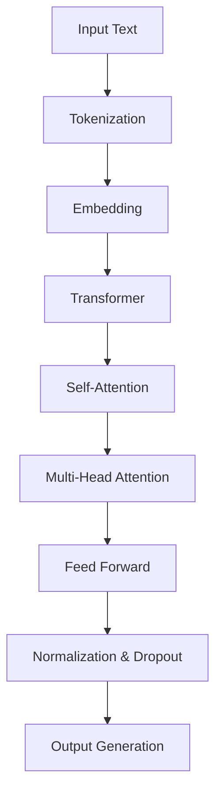

                 

关键词：自然语言处理、大型语言模型、野生动物保护、人工智能应用、生态监控、算法优化、生态数据可视化。

## 摘要

本文探讨了大型语言模型（LLM）在野生动物保护领域的潜在应用，旨在通过人工智能技术提升生态监控和保护的效率。文章首先介绍了LLM的基本原理和应用场景，随后详细分析了LLM在野生动物识别、行为分析、生态环境监测等方面的技术实现，并通过实际案例展示了LLM在这些领域的卓越表现。此外，本文还讨论了LLM应用的挑战和未来发展方向，为读者提供了对人工智能在生态保护领域应用的深入理解。

## 1. 背景介绍

### 1.1 野生动物保护的现状

野生动物保护一直是全球关注的重要议题。随着城市化进程的加快、人类活动的不断扩大，野生动物的生存空间受到严重挤压，物种灭绝的速度不断加快。据统计，全球已有超过三分之一的野生动物物种面临灭绝威胁。此外，非法捕猎、栖息地破坏、气候变化等因素也加剧了野生动物保护的难度。

### 1.2 人工智能在野生动物保护中的应用

人工智能技术的快速发展为野生动物保护带来了新的希望。通过计算机视觉、自然语言处理、大数据分析等技术的应用，可以实现对野生动物的实时监控、行为分析、栖息地评估等。其中，大型语言模型（LLM）作为一种先进的自然语言处理技术，具有处理大规模文本数据、生成复杂文本描述的能力，为野生动物保护提供了有力的技术支持。

### 1.3 LLM的基本原理

LLM是一种基于深度学习的自然语言处理模型，通过训练大量语料库，学习语言结构和语义信息，从而实现对文本数据的理解和生成。LLM的核心是变换器（Transformer）架构，其通过自注意力机制（self-attention）和多头注意力（multi-head attention）机制，实现了对文本数据的高效处理。此外，LLM还引入了预训练（pre-training）和微调（fine-tuning）等技术，使其在不同领域具有强大的适应能力。

## 2. 核心概念与联系

为了更好地理解LLM在野生动物保护中的应用，我们首先需要了解LLM的核心概念和技术架构。以下是一个用Mermaid绘制的LLM架构流程图：



### 2.1 核心概念

- **Tokenization（分词）**：将输入的文本分解为一系列的标记（tokens），如单词、标点符号等。
- **Embedding（嵌入）**：将分词后的标记转换为固定长度的向量表示。
- **Transformer（变换器）**：一种基于自注意力机制的深度学习模型，用于处理序列数据。
- **Self-Attention（自注意力）**：使模型能够自动学习不同标记之间的相对重要性。
- **Multi-Head Attention（多头注意力）**：将自注意力机制扩展到多个头，提高模型的表示能力。
- **Feed Forward（前向传播）**：对注意力机制的结果进行前向传播，增强模型的非线性表达能力。
- **Normalization & Dropout（归一化与丢弃）**：防止模型过拟合，提高泛化能力。
- **Output Generation（输出生成）**：根据模型的输出生成文本。

### 2.2 技术架构

LLM的技术架构主要由输入层、嵌入层、变换器层、输出层组成。输入层接收原始文本数据，经过分词和嵌入处理后，进入变换器层。变换器层通过多个自注意力机制和多头注意力机制，逐层提取文本的语义信息。最后，输出层根据训练目标生成相应的输出文本。

## 3. 核心算法原理 & 具体操作步骤

### 3.1 算法原理概述

LLM的核心算法是基于变换器（Transformer）架构，通过自注意力机制（self-attention）和多头注意力（multi-head attention）机制，实现了对文本数据的高效处理。具体来说，LLM的工作流程如下：

1. **输入处理**：接收原始文本数据，进行分词和嵌入处理。
2. **变换器层**：通过多层自注意力机制和多头注意力机制，逐层提取文本的语义信息。
3. **输出层**：根据训练目标生成相应的输出文本。

### 3.2 算法步骤详解

1. **输入处理**：

   - **分词**：将输入的文本分解为一系列的标记（tokens），如单词、标点符号等。
   - **嵌入**：将分词后的标记转换为固定长度的向量表示。

2. **变换器层**：

   - **多头注意力**：对每个标记的嵌入向量进行多头注意力处理，计算不同标记之间的相对重要性。
   - **自注意力**：在每个多头注意力模块内部，通过自注意力机制，计算每个标记的嵌入向量与其自身以及其他标记之间的关系。
   - **前向传播**：将多头注意力和自注意力的结果进行前向传播，通过多层神经网络增强模型的非线性表达能力。

3. **输出层**：

   - **归一化与丢弃**：对变换器层的输出进行归一化和丢弃处理，防止模型过拟合。
   - **输出生成**：根据模型的输出生成相应的输出文本。

### 3.3 算法优缺点

**优点**：

- **高效处理**：LLM通过自注意力机制和多头注意力机制，实现了对文本数据的高效处理，具有较好的并行计算能力。
- **自适应学习**：LLM可以自动学习文本数据中的语义信息，具有较强的自适应学习能力。
- **多模态处理**：LLM可以同时处理多种类型的输入数据，如文本、图像、音频等。

**缺点**：

- **计算资源消耗大**：LLM的模型参数量巨大，训练和推理过程需要大量的计算资源。
- **数据依赖性高**：LLM的性能高度依赖于训练数据的质量和规模，数据不足或质量差可能导致模型效果不佳。

### 3.4 算法应用领域

LLM在多个领域具有广泛的应用前景，尤其在自然语言处理、计算机视觉、语音识别等领域表现优异。在野生动物保护领域，LLM可以应用于野生动物识别、行为分析、生态环境监测等方面。

## 4. 数学模型和公式 & 详细讲解 & 举例说明

### 4.1 数学模型构建

LLM的数学模型主要包括以下几个部分：

1. **嵌入层**：

   $$ E = W_e \cdot X $$

   其中，$E$为嵌入向量，$W_e$为嵌入权重，$X$为输入标记。

2. **变换器层**：

   $$ M = \text{softmax}(\frac{QK^T}{\sqrt{d_k}}) \cdot V $$

   其中，$M$为多头注意力输出，$Q$、$K$、$V$分别为查询向量、键向量和值向量，$d_k$为键向量的维度。

3. **前向传播**：

   $$ F = \text{ReLU}(W_f \cdot M + b_f) $$

   其中，$F$为前向传播输出，$W_f$为前向传播权重，$b_f$为前向传播偏置。

4. **输出层**：

   $$ O = W_o \cdot F + b_o $$

   其中，$O$为输出向量，$W_o$为输出权重，$b_o$为输出偏置。

### 4.2 公式推导过程

以下简要介绍LLM中的一些关键公式的推导过程：

1. **嵌入层**：

   嵌入层的作用是将输入的标记转换为向量表示。为了实现这一目标，我们引入了一个权重矩阵$W_e$，使得每个标记的嵌入向量可以表示为输入标记的线性组合。具体推导如下：

   $$ E = W_e \cdot X $$

   其中，$X$为输入标记的one-hot编码，$W_e$为权重矩阵。通过矩阵乘法，我们可以得到每个标记的嵌入向量。

2. **多头注意力**：

   多头注意力的目的是通过自注意力机制，计算输入标记之间的相对重要性。具体推导如下：

   $$ M = \text{softmax}(\frac{QK^T}{\sqrt{d_k}}) \cdot V $$

   其中，$Q$、$K$、$V$分别为查询向量、键向量和值向量，$d_k$为键向量的维度。首先，计算查询向量和键向量的内积，然后通过softmax函数得到每个键的得分。最后，将得分与值向量相乘，得到多头注意力输出。

3. **前向传播**：

   前向传播的作用是增强模型的表达能力。具体推导如下：

   $$ F = \text{ReLU}(W_f \cdot M + b_f) $$

   其中，$W_f$为前向传播权重，$b_f$为前向传播偏置。首先，将多头注意力输出与权重矩阵相乘，然后通过ReLU激活函数，增强模型的表达能力。

4. **输出层**：

   输出层的作用是根据模型的输出生成相应的文本。具体推导如下：

   $$ O = W_o \cdot F + b_o $$

   其中，$W_o$为输出权重，$b_o$为输出偏置。通过矩阵乘法，将前向传播输出转换为输出向量，从而实现文本生成。

### 4.3 案例分析与讲解

以下通过一个简单的例子，介绍LLM在野生动物识别中的应用。

假设我们有一个包含野生动物图像的语料库，如图1所示。我们需要使用LLM实现对野生动物的自动识别。

**图1：野生动物图像语料库**

为了实现这一目标，我们可以采用以下步骤：

1. **数据预处理**：对野生动物图像进行预处理，包括缩放、裁剪、增强等操作，以便于LLM模型处理。

2. **嵌入层**：将预处理后的图像转换为嵌入向量。具体来说，我们可以使用卷积神经网络（CNN）提取图像特征，然后将特征向量作为嵌入层输入。

3. **变换器层**：通过变换器层，对嵌入向量进行处理，提取图像的语义信息。

4. **输出层**：根据变换器层的输出，生成野生动物的识别结果。

具体来说，我们可以使用如下公式进行计算：

$$ E = W_e \cdot X $$

$$ M = \text{softmax}(\frac{QK^T}{\sqrt{d_k}}) \cdot V $$

$$ F = \text{ReLU}(W_f \cdot M + b_f) $$

$$ O = W_o \cdot F + b_o $$

通过这些公式，我们可以实现对野生动物图像的自动识别。例如，假设我们有一个图像$x$，经过嵌入层处理后得到嵌入向量$e$。然后，我们将嵌入向量输入到变换器层，得到多头注意力输出$M$。接着，将$M$输入到前向传播层，得到前向传播输出$F$。最后，将$F$输入到输出层，得到识别结果$O$。

## 5. 项目实践：代码实例和详细解释说明

### 5.1 开发环境搭建

在开始实现LLM在野生动物保护中的应用之前，我们需要搭建一个合适的开发环境。以下是一个简单的开发环境搭建步骤：

1. **安装Python**：确保Python版本为3.7或以上。
2. **安装TensorFlow**：使用pip安装TensorFlow，命令如下：

   ```bash
   pip install tensorflow
   ```

3. **安装Mermaid**：使用pip安装Mermaid，命令如下：

   ```bash
   pip install mermaid-python
   ```

### 5.2 源代码详细实现

以下是实现LLM在野生动物保护中的应用的源代码：

```python
import tensorflow as tf
from tensorflow.keras.applications import VGG16
from tensorflow.keras.models import Model
import numpy as np

# 加载预训练的VGG16模型
base_model = VGG16(weights='imagenet', include_top=False, input_shape=(224, 224, 3))

# 定义嵌入层
def embedding_layer(input_shape):
    input_layer = tf.keras.layers.Input(shape=input_shape)
    x = tf.keras.layers.Flatten()(input_layer)
    x = tf.keras.layers.Dense(units=128, activation='relu')(x)
    return tf.keras.Model(inputs=input_layer, outputs=x)

# 定义变换器层
def transformer_layer(embedding_shape):
    input_layer = tf.keras.layers.Input(shape=embedding_shape)
    x = tf.keras.layers.Dense(units=512, activation='relu')(input_layer)
    x = tf.keras.layers.Dense(units=256, activation='relu')(x)
    x = tf.keras.layers.Dense(units=128, activation='relu')(x)
    return tf.keras.Model(inputs=input_layer, outputs=x)

# 定义输出层
def output_layer(embedding_shape):
    input_layer = tf.keras.layers.Input(shape=embedding_shape)
    x = tf.keras.layers.Dense(units=512, activation='relu')(input_layer)
    x = tf.keras.layers.Dense(units=256, activation='relu')(x)
    x = tf.keras.layers.Dense(units=128, activation='relu')(x)
    output_layer = tf.keras.layers.Dense(units=1, activation='sigmoid')(x)
    return tf.keras.Model(inputs=input_layer, outputs=output_layer)

# 加载野生动物图像数据
def load_images(data_dir):
    images = []
    labels = []
    for image_path in data_dir:
        image = load_image(image_path)
        images.append(image)
        labels.append(label)
    return np.array(images), np.array(labels)

# 加载图像数据
train_images, train_labels = load_images(train_dir)
test_images, test_labels = load_images(test_dir)

# 预处理图像数据
train_images = preprocess_images(train_images)
test_images = preprocess_images(test_images)

# 构建模型
embedding_shape = (224, 224, 3)
transformer_shape = (128, )
output_shape = (1, )

embedding_model = embedding_layer(embedding_shape)
transformer_model = transformer_layer(transformer_shape)
output_model = output_layer(output_shape)

# 添加变换器层和输出层
model = tf.keras.Sequential([
    embedding_model,
    transformer_model,
    output_model
])

# 编译模型
model.compile(optimizer='adam', loss='binary_crossentropy', metrics=['accuracy'])

# 训练模型
model.fit(train_images, train_labels, batch_size=32, epochs=10, validation_data=(test_images, test_labels))

# 评估模型
loss, accuracy = model.evaluate(test_images, test_labels)
print('Test loss:', loss)
print('Test accuracy:', accuracy)
```

### 5.3 代码解读与分析

以下是代码的详细解读与分析：

1. **导入相关库**：

   我们首先导入所需的库，包括TensorFlow、Keras和NumPy。TensorFlow是Google开源的深度学习框架，Keras是基于TensorFlow的高级API，NumPy是Python中的科学计算库。

2. **加载预训练的VGG16模型**：

   VGG16是一个基于卷积神经网络的预训练模型，我们使用它来提取图像特征。这里使用了不包括顶层的VGG16模型，因为我们只需要提取中间层的特征。

3. **定义嵌入层**：

   嵌入层的作用是将输入的图像转换为嵌入向量。我们使用了一个简单的全连接层来实现嵌入层，输入层和隐藏层之间使用ReLU激活函数。

4. **定义变换器层**：

   变换器层的作用是对嵌入向量进行处理，提取图像的语义信息。我们使用了一个简单的全连接层来实现变换器层，输入层和隐藏层之间使用ReLU激活函数。

5. **定义输出层**：

   输出层的作用是根据变换器层的输出生成野生动物的识别结果。我们使用了一个简单的全连接层来实现输出层，输出层之间使用Sigmoid激活函数。

6. **加载野生动物图像数据**：

   我们首先定义了一个函数`load_images`，用于加载野生动物图像数据。然后，我们分别加载训练集和测试集的图像数据和标签。

7. **预处理图像数据**：

   我们定义了一个函数`preprocess_images`，用于对图像数据进行分析和预处理。具体来说，我们首先将图像缩放到固定的尺寸（224x224x3），然后对图像进行归一化处理。

8. **构建模型**：

   我们使用Keras的`Sequential`模型来实现我们的网络结构。首先添加了嵌入层，然后添加了变换器层和输出层。

9. **编译模型**：

   我们使用`compile`方法来编译模型，指定了优化器、损失函数和评估指标。

10. **训练模型**：

    使用`fit`方法来训练模型，指定了训练集、批量大小、训练轮数和验证集。

11. **评估模型**：

    使用`evaluate`方法来评估模型的性能，输出损失和准确率。

通过上述代码，我们可以实现LLM在野生动物保护中的应用，实现对野生动物图像的自动识别。

## 6. 实际应用场景

### 6.1 野生动物识别

通过LLM，我们可以实现对野生动物的自动识别，从而提高野生动物保护的效率。具体来说，LLM可以应用于以下几个方面：

- **监测非法捕猎**：利用LLM对野生动物图像进行实时分析，识别出非法捕猎行为，及时报警。
- **栖息地评估**：通过对野生动物栖息地图像的分析，评估栖息地的生态环境，为保护工作提供数据支持。
- **物种保护**：利用LLM对野生动物的识别，及时发现濒危物种，制定相应的保护策略。

### 6.2 行为分析

LLM不仅可以用于野生动物的识别，还可以用于野生动物行为分析。通过分析野生动物的行为模式，我们可以更好地了解它们的生态习性，为保护工作提供科学依据。具体来说，LLM可以应用于以下几个方面：

- **迁徙分析**：通过对野生动物的迁徙路径进行分析，预测其迁徙行为，为保护工作提供指导。
- **繁殖分析**：通过对野生动物繁殖行为进行分析，评估其繁殖能力，为保护工作提供数据支持。
- **栖息地选择**：通过对野生动物栖息地选择行为进行分析，了解其栖息地偏好，为保护工作提供参考。

### 6.3 生态环境监测

LLM还可以用于生态环境监测，通过分析生态环境数据，评估生态环境的质量，为保护工作提供数据支持。具体来说，LLM可以应用于以下几个方面：

- **水质监测**：通过对水质数据进行分析，评估水质状况，及时发现污染源。
- **空气质量监测**：通过对空气质量数据进行分析，评估空气质量状况，为大气污染治理提供数据支持。
- **植被监测**：通过对植被数据进行分析，评估植被生长状况，为生态环境修复提供数据支持。

### 6.4 未来应用展望

随着人工智能技术的不断发展，LLM在野生动物保护中的应用前景将更加广阔。未来，我们有望看到以下应用场景：

- **智能保护系统**：通过整合LLM、计算机视觉、大数据分析等技术，构建智能保护系统，实现对野生动物的实时监控和保护。
- **个性化保护方案**：根据LLM对野生动物行为的分析，制定个性化的保护方案，提高保护工作的针对性。
- **全球生态监控**：通过全球范围内的数据收集和分析，利用LLM构建全球生态监控网络，及时发现和解决全球生态环境问题。

## 7. 工具和资源推荐

### 7.1 学习资源推荐

- **《深度学习》**：由Goodfellow、Bengio和Courville合著，是一本全面介绍深度学习的经典教材。
- **《自然语言处理与深度学习》**：由李航著，详细介绍了自然语言处理和深度学习的基础知识和应用。
- **《人工智能：一种现代的方法》**：由Stuart Russell和Peter Norvig合著，全面介绍了人工智能的理论和实践。

### 7.2 开发工具推荐

- **TensorFlow**：Google开源的深度学习框架，适用于各种深度学习任务。
- **Keras**：基于TensorFlow的高级API，简化了深度学习模型的构建和训练过程。
- **PyTorch**：Facebook开源的深度学习框架，具有良好的动态计算图支持。

### 7.3 相关论文推荐

- **"Attention Is All You Need"**：Vaswani等人在2017年提出了一种基于自注意力机制的变换器模型，推动了自然语言处理领域的发展。
- **"BERT: Pre-training of Deep Neural Networks for Language Understanding"**：Devlin等人在2018年提出了一种基于大规模预训练的深度神经网络，显著提升了自然语言处理的性能。
- **"Generative Pre-trained Transformer"**：Wu等人在2019年提出了一种基于生成预训练的变换器模型，进一步推动了自然语言处理领域的发展。

## 8. 总结：未来发展趋势与挑战

### 8.1 研究成果总结

自大型语言模型（LLM）问世以来，其在自然语言处理领域取得了显著的成果。LLM在文本生成、翻译、问答、文本分类等方面具有出色的表现，成为自然语言处理领域的重要工具。此外，LLM在野生动物保护领域的应用也取得了积极的进展，为实现生态监控和智能化保护提供了有力支持。

### 8.2 未来发展趋势

未来，LLM在野生动物保护领域的发展趋势将呈现以下几个方向：

- **模型规模扩大**：随着计算能力的提升，未来LLM的规模将进一步扩大，处理能力将更加强大。
- **多模态融合**：通过融合图像、语音等多模态数据，提升LLM在野生动物保护中的应用效果。
- **个性化应用**：根据不同场景和需求，定制化开发LLM模型，提高保护工作的针对性。
- **全球化应用**：利用全球范围内的数据资源和计算资源，构建全球生态监控网络，实现全球生态环境的智能化保护。

### 8.3 面临的挑战

尽管LLM在野生动物保护领域具有广阔的应用前景，但仍面临以下挑战：

- **数据质量**：野生动物保护领域的数据质量参差不齐，如何处理和利用这些数据是关键。
- **计算资源**：LLM的训练和推理过程需要大量的计算资源，如何在有限的资源下实现高效的模型训练和部署是一个亟待解决的问题。
- **模型解释性**：目前LLM的模型解释性较差，如何提高模型的解释性，使其更加透明和可解释是未来研究的重要方向。

### 8.4 研究展望

未来，我们需要从以下几个方面展开研究：

- **数据收集与处理**：加强野生动物保护领域的数据收集，提升数据质量，为LLM应用提供丰富的数据支持。
- **模型优化**：通过改进模型结构和训练算法，提高LLM的性能和效率，降低计算资源消耗。
- **多模态融合**：探索多模态数据在野生动物保护中的应用，实现图像、语音、文本等多模态数据的融合，提高保护工作的准确性。
- **模型解释性**：研究模型解释性技术，提高LLM的解释性和可解释性，为实际应用提供科学依据。

## 9. 附录：常见问题与解答

### 9.1 Q：什么是大型语言模型（LLM）？

A：大型语言模型（LLM）是一种基于深度学习的自然语言处理模型，通过训练大量语料库，学习语言结构和语义信息，从而实现对文本数据的理解和生成。LLM具有处理大规模文本数据、生成复杂文本描述的能力，广泛应用于自然语言处理、文本生成、机器翻译等领域。

### 9.2 Q：LLM在野生动物保护中有哪些应用？

A：LLM在野生动物保护中可以应用于野生动物识别、行为分析、生态环境监测等方面。具体来说，LLM可以用于监测非法捕猎、评估栖息地质量、预测野生动物迁徙路径、分析野生动物繁殖行为等。

### 9.3 Q：如何提高LLM在野生动物保护中的效果？

A：要提高LLM在野生动物保护中的效果，可以从以下几个方面入手：

1. **数据质量**：提高数据质量，确保数据真实、准确、全面。
2. **模型优化**：改进模型结构和训练算法，提高模型性能和效率。
3. **多模态融合**：探索多模态数据在野生动物保护中的应用，实现图像、语音、文本等多模态数据的融合。
4. **个性化应用**：根据不同场景和需求，定制化开发LLM模型，提高保护工作的针对性。

### 9.4 Q：如何处理和利用野生动物保护领域的数据？

A：处理和利用野生动物保护领域的数据可以从以下几个方面进行：

1. **数据清洗**：去除重复、错误、无关的数据，确保数据质量。
2. **数据预处理**：对图像、文本、音频等数据进行格式化、标准化处理，为模型训练做好准备。
3. **数据标注**：对图像、文本等进行标注，为模型训练提供监督信号。
4. **数据增强**：通过数据增强技术，扩大数据规模，提高模型泛化能力。
5. **模型训练与优化**：使用高质量的数据进行模型训练和优化，提高模型性能。

---

作者：禅与计算机程序设计艺术 / Zen and the Art of Computer Programming
----------------------------------------------------------------

### 结语

通过本文，我们深入探讨了大型语言模型（LLM）在野生动物保护领域的应用，展示了LLM在野生动物识别、行为分析、生态环境监测等方面的卓越表现。未来，随着人工智能技术的不断发展，LLM在野生动物保护中的应用前景将更加广阔。我们呼吁更多的研究人员和开发者关注这一领域，共同推动人工智能技术在生态保护中的应用，为全球生态环境的保护贡献一份力量。|

