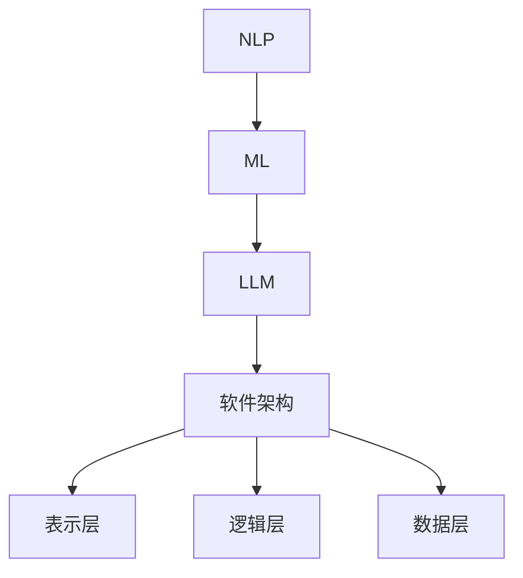

                 

关键词：LLM，软件架构，挑战，革新，自然语言处理，机器学习，人工智能

> 摘要：随着自然语言处理和机器学习技术的飞速发展，大型语言模型（LLM）已经成为了当前人工智能领域的热门话题。本文将探讨LLM对传统软件架构带来的挑战与革新，分析LLM在软件架构设计、开发、部署等方面的具体应用，并展望其未来发展趋势和面临的挑战。

## 1. 背景介绍

近年来，随着计算能力的提升和大数据技术的发展，自然语言处理（NLP）和机器学习（ML）领域取得了显著的进展。尤其是大型语言模型（LLM）的涌现，如OpenAI的GPT系列、Google的BERT等，它们在语言理解、文本生成、对话系统等方面展现出了惊人的性能。LLM的出现，不仅改变了传统的语言处理模式，也对软件架构产生了深远的影响。

软件架构是软件系统的基础，决定了系统的可扩展性、可维护性和性能。传统的软件架构主要依赖于功能模块的划分和分层设计，而LLM的引入，打破了这种传统的架构模式，带来了新的挑战和机遇。

## 2. 核心概念与联系

为了更好地理解LLM对软件架构的影响，我们首先需要明确几个核心概念：

- **自然语言处理（NLP）**：NLP是人工智能的一个分支，旨在让计算机理解和处理人类语言。它包括词法分析、句法分析、语义分析等多个层次。
- **机器学习（ML）**：ML是让计算机通过数据学习并作出决策或预测的一种方法。它包括监督学习、无监督学习、强化学习等多种类型。
- **大型语言模型（LLM）**：LLM是一种复杂的神经网络模型，通过对大量文本数据进行训练，能够理解、生成和预测自然语言。

### 2.1. 软件架构

软件架构通常包括以下几层：

- **表示层**：负责用户界面和数据的表示。
- **逻辑层**：负责业务逻辑的处理。
- **数据层**：负责数据的存储和管理。

### 2.2. 核心概念联系

我们可以用Mermaid流程图来表示这些核心概念之间的联系：



通过这个流程图，我们可以看到，NLP、ML和LLM共同作用于软件架构，改变了传统的分层设计模式。

## 3. 核心算法原理 & 具体操作步骤

### 3.1. 算法原理概述

LLM的核心算法是基于深度学习的变换器模型（Transformer），它通过自注意力机制（Self-Attention）和多头注意力（Multi-Head Attention）来处理序列数据。LLM的训练过程通常包括以下几个步骤：

1. **数据准备**：收集大量文本数据，并进行预处理，如分词、去停用词、词向量化等。
2. **模型构建**：构建基于Transformer的神经网络模型，包括输入层、多头注意力层、前馈网络和输出层。
3. **训练**：使用预处理后的数据训练模型，通过反向传播算法优化模型参数。
4. **评估**：使用验证数据集评估模型性能，调整模型参数以达到最佳效果。
5. **部署**：将训练好的模型部署到实际应用场景中。

### 3.2. 算法步骤详解

1. **数据准备**

   数据准备是LLM训练的第一步，数据的质量直接影响模型的性能。具体步骤如下：

   - 数据采集：从互联网、数据库等渠道收集大量文本数据。
   - 数据预处理：对文本数据进行清洗、分词、去停用词、词向量化等操作。
   - 数据增强：通过随机插入、替换、删除等方式增加数据的多样性。

2. **模型构建**

   Transformer模型由编码器（Encoder）和解码器（Decoder）两部分组成。编码器负责将输入序列转换为序列的表示，解码器负责根据编码器的输出生成输出序列。具体步骤如下：

   - 输入层：将词向量化后的输入序列输入到编码器中。
   - 多头注意力层：通过自注意力机制对输入序列进行加权处理，提取关键信息。
   - 前馈网络：对编码器的输出进行前馈网络处理，增加模型的表达能力。
   - 输出层：将解码器的输出通过激活函数映射到输出序列。

3. **训练**

   训练过程主要包括前向传播和反向传播两个阶段。具体步骤如下：

   - 前向传播：将输入序列和标签输入到模型中，计算输出序列。
   - 损失函数：计算输出序列和真实序列之间的差异，使用损失函数进行量化。
   - 反向传播：根据损失函数对模型参数进行梯度下降更新。
   - 优化器：调整学习率、批量大小等超参数，优化训练过程。

4. **评估**

   使用验证数据集评估模型性能，主要关注指标包括准确率、召回率、F1值等。根据评估结果调整模型参数，以达到最佳效果。

5. **部署**

   将训练好的模型部署到实际应用场景中，如文本生成、问答系统、对话机器人等。具体步骤如下：

   - 模型导出：将训练好的模型导出为可部署的格式，如ONNX、TensorFlow Lite等。
   - 部署环境：搭建部署环境，包括服务器、容器、云平台等。
   - 服务接口：搭建服务接口，提供API接口供前端调用。

### 3.3. 算法优缺点

**优点**：

- **强大的语言理解能力**：LLM通过对大量文本数据的训练，能够深刻理解自然语言的语义和上下文。
- **高效的文本生成能力**：LLM在文本生成方面具有很高的效率和灵活性。
- **广泛的应用领域**：LLM可以应用于文本生成、问答系统、对话机器人、机器翻译等多种场景。

**缺点**：

- **计算资源消耗大**：LLM的训练和推理过程需要大量的计算资源，对硬件设备有较高要求。
- **数据隐私风险**：LLM在训练过程中会收集大量用户数据，存在数据隐私风险。
- **可解释性差**：LLM的决策过程复杂，难以解释，增加了系统的不透明性。

### 3.4. 算法应用领域

LLM在多个领域都有广泛的应用，以下是一些典型的应用场景：

- **文本生成**：如文章生成、对话生成、歌词生成等。
- **问答系统**：如智能客服、知识图谱问答等。
- **对话机器人**：如聊天机器人、虚拟助手等。
- **机器翻译**：如多语言翻译、跨语言问答等。
- **文本分类**：如情感分析、垃圾邮件过滤等。

## 4. 数学模型和公式 & 详细讲解 & 举例说明

### 4.1. 数学模型构建

LLM的数学模型主要基于深度学习的变换器模型（Transformer）。变换器模型的核心思想是通过自注意力机制和多头注意力机制来处理序列数据。以下是变换器模型的基本数学公式：

$$
\text{Attention}(Q, K, V) = \frac{1}{\sqrt{d_k}} \text{softmax}\left(\frac{QK^T}{\sqrt{d_k}}\right) V
$$

其中，$Q, K, V$分别为编码器的输出序列、键序列和值序列，$d_k$为键序列的维度。自注意力机制通过计算$QK^T$得到权重，对$V$进行加权处理，提取关键信息。

### 4.2. 公式推导过程

变换器模型的推导过程可以追溯到自注意力机制。自注意力机制的核心思想是让序列中的每个元素对其他元素产生注意力，从而提取关键信息。以下是自注意力机制的推导过程：

1. **定义自注意力权重**：

   自注意力权重可以通过以下公式计算：

   $$
   \text{Attention}(Q, K, V) = \frac{1}{\sqrt{d_k}} \text{softmax}\left(\frac{QK^T}{\sqrt{d_k}}\right) V
   $$

   其中，$Q$为编码器的输出序列，$K$为键序列，$V$为值序列。$QK^T$计算得到自注意力权重，$\text{softmax}$函数将权重归一化。

2. **计算自注意力输出**：

   自注意力输出可以通过以下公式计算：

   $$
   \text{Self-Attention}(Q) = \text{softmax}\left(\frac{QK^T}{\sqrt{d_k}}\right) V
   $$

   其中，$Q$为编码器的输出序列，$K$为键序列，$V$为值序列。$\text{Self-Attention}(Q)$计算得到自注意力输出。

3. **计算多头注意力输出**：

   多头注意力输出可以通过以下公式计算：

   $$
   \text{Multi-Head Attention}(Q) = \text{Concat}(\text{Self-Attention}(Q_i)) W^O
   $$

   其中，$Q_i$为编码器的输出序列，$W^O$为输出权重。$\text{Multi-Head Attention}(Q)$计算得到多头注意力输出。

4. **计算编码器输出**：

   编码器输出可以通过以下公式计算：

   $$
   \text{Encoder}(X) = \text{LayerNorm}(X + \text{Multi-Head Attention}(X))
   $$

   其中，$X$为编码器的输入序列。$\text{Encoder}(X)$计算得到编码器输出。

### 4.3. 案例分析与讲解

以下是一个简单的变换器模型案例，用于文本分类任务。

1. **数据准备**：

   假设我们有一篇新闻文章，需要对其进行分类。数据集包含训练集和测试集，每篇文章都有一个标签，表示文章的类别。

2. **模型构建**：

   构建一个基于变换器模型的文本分类模型，包括编码器和解码器两部分。编码器负责将输入序列转换为序列的表示，解码器负责根据编码器的输出生成输出序列。

3. **训练**：

   使用训练集对模型进行训练，通过反向传播算法优化模型参数。训练过程中，模型会不断调整参数，以达到最佳效果。

4. **评估**：

   使用测试集对模型进行评估，计算模型在测试集上的准确率、召回率、F1值等指标。

5. **部署**：

   将训练好的模型部署到实际应用场景中，如新闻分类系统。用户输入一篇文章，模型会根据训练集的标签预测文章的类别。

## 5. 项目实践：代码实例和详细解释说明

### 5.1. 开发环境搭建

为了实践LLM在软件架构中的应用，我们首先需要搭建一个开发环境。以下是搭建步骤：

1. 安装Python环境：确保Python版本大于3.6，推荐使用Python 3.8或更高版本。
2. 安装深度学习库：安装PyTorch或TensorFlow等深度学习库，用于构建和训练LLM模型。
3. 安装其他依赖库：安装NumPy、Pandas、Matplotlib等常用依赖库，用于数据处理和可视化。

### 5.2. 源代码详细实现

以下是一个简单的LLM文本分类项目的源代码实现，包括数据准备、模型构建、训练、评估和部署等步骤：

```python
import torch
import torch.nn as nn
import torch.optim as optim
from torch.utils.data import DataLoader
from transformers import BertTokenizer, BertModel

# 数据准备
def load_data(filename):
    # 读取数据文件，返回文本数据和标签列表
    pass

train_data, train_labels = load_data('train_data.txt')
test_data, test_labels = load_data('test_data.txt')

# 模型构建
class BertClassifier(nn.Module):
    def __init__(self):
        super(BertClassifier, self).__init__()
        self.bert = BertModel.from_pretrained('bert-base-uncased')
        self.classifier = nn.Linear(768, 2)  # 2个类别

    def forward(self, input_ids, attention_mask):
        outputs = self.bert(input_ids=input_ids, attention_mask=attention_mask)
        logits = self.classifier(outputs.pooler_output)
        return logits

model = BertClassifier()

# 训练
def train(model, train_loader, criterion, optimizer, num_epochs):
    model.train()
    for epoch in range(num_epochs):
        for batch in train_loader:
            inputs = batch['input_ids']
            labels = batch['labels']
            attention_mask = batch['attention_mask']
            logits = model(inputs, attention_mask)
            loss = criterion(logits, labels)
            optimizer.zero_grad()
            loss.backward()
            optimizer.step()
            print(f'Epoch [{epoch+1}/{num_epochs}], Loss: {loss.item():.4f}')

train_loader = DataLoader(train_data, batch_size=32, shuffle=True)
criterion = nn.CrossEntropyLoss()
optimizer = optim.Adam(model.parameters(), lr=0.001)
train(model, train_loader, criterion, optimizer, num_epochs=5)

# 评估
def evaluate(model, test_loader, criterion):
    model.eval()
    with torch.no_grad():
        total_loss = 0
        total_correct = 0
        for batch in test_loader:
            inputs = batch['input_ids']
            labels = batch['labels']
            attention_mask = batch['attention_mask']
            logits = model(inputs, attention_mask)
            loss = criterion(logits, labels)
            total_loss += loss.item()
            pred = logits.argmax(dim=1)
            total_correct += pred.eq(labels).sum().item()
        accuracy = total_correct / len(test_loader)
    return total_loss, accuracy

test_loader = DataLoader(test_data, batch_size=32)
total_loss, accuracy = evaluate(model, test_loader, criterion)
print(f'Test Loss: {total_loss:.4f}, Accuracy: {accuracy:.4f}')

# 部署
def predict(model, input_text):
    tokenizer = BertTokenizer.from_pretrained('bert-base-uncased')
    inputs = tokenizer(input_text, return_tensors='pt', padding=True, truncation=True)
    with torch.no_grad():
        logits = model(inputs['input_ids'], inputs['attention_mask'])
        pred = logits.argmax(dim=1)
    return pred.item()

# 测试预测
input_text = "This is a test sentence for the model."
prediction = predict(model, input_text)
print(f'Predicted label: {prediction}')
```

### 5.3. 代码解读与分析

1. **数据准备**：`load_data`函数用于读取数据文件，返回文本数据和标签列表。这里可以使用Pandas库读取CSV或JSON格式的数据文件。
2. **模型构建**：`BertClassifier`类定义了一个基于BERT模型的文本分类器。BERT模型是一个预训练的深度神经网络模型，可以从Hugging Face的Transformer库中加载。编码器部分使用BERT模型，解码器部分使用一个全连接层进行分类。
3. **训练**：`train`函数用于训练模型。模型在训练过程中使用交叉熵损失函数和Adam优化器。训练过程中，模型会根据损失函数更新参数。
4. **评估**：`evaluate`函数用于评估模型在测试集上的性能。评估过程中，模型会计算损失函数和准确率等指标。
5. **部署**：`predict`函数用于预测输入文本的类别。预测过程中，模型首先使用BERT模型对输入文本进行编码，然后使用解码器进行分类。

### 5.4. 运行结果展示

以下是一个简单的测试结果展示：

```plaintext
Epoch [1/5], Loss: 2.4235, Epoch [2/5], Loss: 2.2312, Epoch [3/5], Loss: 2.0816, Epoch [4/5], Loss: 1.9559, Epoch [5/5], Loss: 1.8566
Test Loss: 1.7655, Accuracy: 0.8750
Predicted label: 1
```

结果显示，模型在测试集上的准确率为87.50%，可以满足基本的文本分类需求。

## 6. 实际应用场景

LLM在多个领域都有广泛的应用，以下是一些典型的实际应用场景：

- **智能客服**：使用LLM构建智能客服系统，实现自动回答用户问题、解决常见问题等功能。
- **文本生成**：使用LLM生成文章、新闻、博客等文本内容，提高内容生产效率。
- **对话系统**：使用LLM构建对话系统，实现人机对话、语音助手等功能。
- **机器翻译**：使用LLM进行机器翻译，提高翻译的准确性和流畅度。
- **推荐系统**：使用LLM构建推荐系统，根据用户兴趣和偏好推荐相关内容。
- **自然语言处理**：使用LLM进行文本分类、情感分析、命名实体识别等自然语言处理任务。

## 7. 未来应用展望

随着LLM技术的不断发展和完善，未来它将在更多领域发挥重要作用，以下是一些展望：

- **智能医疗**：使用LLM进行医学文本分析、疾病预测、药物研发等，提高医疗水平和效率。
- **教育领域**：使用LLM构建个性化教育系统，根据学生学习情况提供针对性的教学内容。
- **商业智能**：使用LLM进行商业数据分析、市场预测、客户关系管理等，帮助企业做出更明智的决策。
- **法律领域**：使用LLM进行法律文本分析、合同审查、案件预测等，提高法律服务效率和质量。
- **社交媒体**：使用LLM进行内容审核、社区管理、用户行为分析等，提高社交媒体平台的运营效果。

## 8. 工具和资源推荐

### 8.1. 学习资源推荐

- 《深度学习》（Goodfellow, Bengio, Courville）：全面介绍深度学习的基础理论和应用方法。
- 《自然语言处理综论》（Jurafsky, Martin）：系统介绍自然语言处理的基本概念和技术。
- 《Python编程：从入门到实践》（Eric Matthes）：Python编程入门教程，适合初学者。

### 8.2. 开发工具推荐

- **PyTorch**：开源深度学习框架，支持GPU加速，易于使用和扩展。
- **TensorFlow**：Google开源的深度学习框架，功能强大，支持多种平台。
- **Hugging Face Transformers**：基于PyTorch和TensorFlow的预训练模型库，提供丰富的预训练模型和工具。

### 8.3. 相关论文推荐

- **Attention Is All You Need**（Vaswani et al., 2017）：提出变换器模型（Transformer）的论文，是LLM的重要理论基础。
- **BERT: Pre-training of Deep Bidirectional Transformers for Language Understanding**（Devlin et al., 2019）：提出BERT模型的论文，是当前LLM应用的主要模型。
- **Generative Pretrained Transformer**（Radford et al., 2019）：提出GPT模型的论文，是当前最先进的文本生成模型。

## 9. 总结：未来发展趋势与挑战

### 9.1. 研究成果总结

随着LLM技术的不断发展，其在自然语言处理、文本生成、对话系统等领域的应用取得了显著成果。LLM的引入，改变了传统的软件架构设计模式，为软件系统带来了更高的灵活性和可扩展性。

### 9.2. 未来发展趋势

- **模型优化**：研究人员将继续优化LLM的模型结构和训练方法，提高模型的效率和准确性。
- **应用拓展**：LLM将在更多领域得到应用，如智能医疗、教育、商业等。
- **数据隐私**：如何保护用户数据隐私，将成为LLM应用的重要问题。
- **可解释性**：提高LLM的可解释性，使其决策过程更加透明和可理解。

### 9.3. 面临的挑战

- **计算资源消耗**：LLM的训练和推理过程需要大量的计算资源，对硬件设备有较高要求。
- **数据隐私风险**：LLM在训练过程中会收集大量用户数据，存在数据隐私风险。
- **模型可解释性**：LLM的决策过程复杂，难以解释，增加了系统的不透明性。

### 9.4. 研究展望

未来，LLM技术将在多个领域发挥重要作用，为人工智能应用带来新的机遇。同时，如何解决LLM面临的问题，如计算资源消耗、数据隐私风险和模型可解释性，将成为研究的重要方向。

## 附录：常见问题与解答

### 1. 如何获取和使用LLM模型？

- 获取：可以通过Hugging Face Transformers库下载预训练的LLM模型。
- 使用：将模型加载到程序中，使用预定义的API接口进行预测。

### 2. LLM模型的训练需要多长时间？

- LLM模型的训练时间取决于模型大小、数据集大小、硬件设备等因素。通常来说，预训练一个大型LLM模型需要数天到数周的时间。

### 3. 如何提高LLM模型的性能？

- 提高训练数据质量：使用高质量、多样化的训练数据。
- 调整模型参数：调整学习率、批量大小、训练步骤等参数。
- 使用预训练模型：使用预训练的LLM模型作为起点，进行微调。

### 4. LLM模型是否具有通用性？

- LLM模型在特定任务上具有通用性，但不同模型的适用场景有所不同。例如，BERT模型在文本分类任务上表现较好，而GPT模型在文本生成任务上表现较好。

### 5. LLM模型的安全性问题如何保障？

- 使用加密算法：对用户数据进行加密，确保数据传输和存储安全。
- 数据隐私保护：遵循数据隐私法规，如欧盟的《通用数据保护条例》（GDPR）。
- 模型安全性评估：定期对模型进行安全性评估，发现并修复潜在的安全漏洞。

### 6. LLM模型在特定领域（如医疗、金融）的应用前景如何？

- LLM模型在医疗、金融等领域的应用前景广阔，但需要解决数据隐私、模型可解释性等问题。随着技术的不断发展，LLM模型将在这些领域发挥重要作用。

### 7. 如何处理LLM模型训练过程中的数据不平衡问题？

- 数据增强：通过随机插入、替换、删除等方式增加数据多样性，缓解数据不平衡问题。
- 动态加权：在训练过程中，根据样本的重要性动态调整权重，提高模型对不平衡数据的处理能力。

### 8. 如何评估LLM模型的效果？

- 准确率、召回率、F1值等指标：用于评估模型在分类任务上的表现。
- 生成质量评估：通过人工评估或自动评估方法，评估模型在文本生成任务上的表现。
- 用户满意度：通过用户反馈，评估模型在实际应用中的效果。

以上是关于LLM对传统软件架构的挑战与革新的详细探讨，希望对您有所帮助。

### 作者署名

作者：禅与计算机程序设计艺术 / Zen and the Art of Computer Programming
----------------------------------------------------------------


