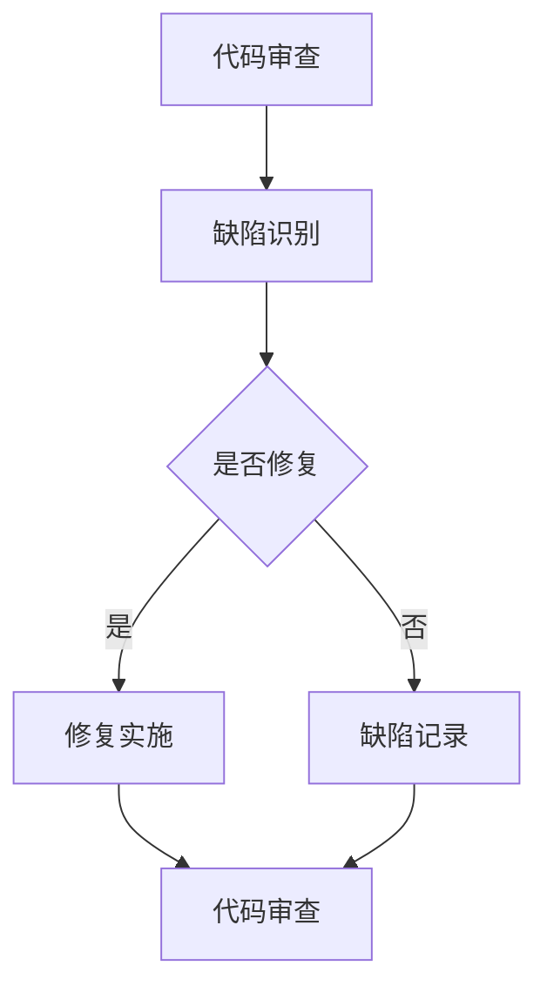

                 

关键词：大型语言模型（LLM），软件维护，代码审查，缺陷修复，自动化，编程范式，人工智能。

> 摘要：本文探讨了大型语言模型（LLM），如GPT-3和ChatGLM，对传统软件维护方法所带来的挑战与改进。通过分析LLM的工作原理、应用场景以及与传统方法的对比，本文提出了LLM在代码审查、缺陷修复、自动化等方面具有的巨大潜力，并对未来软件开发和维护中的发展趋势与挑战进行了展望。

## 1. 背景介绍

随着人工智能技术的迅猛发展，特别是深度学习领域的突破，大型语言模型（LLM）如GPT-3和ChatGLM等已经取得了令人瞩目的成果。这些模型基于大规模的语料库进行训练，能够理解、生成和操作自然语言，实现了包括问答、文本生成、翻译、对话系统等多种应用场景。

在软件工程领域，传统的软件维护方法主要依赖于开发人员的人工审查和修复。随着软件规模的不断扩大和复杂性增加，传统的维护方法已经显得力不从心。因此，如何利用人工智能技术，特别是LLM，来提高软件维护的效率和准确性，成为了一个值得研究的问题。

本文将从LLM的工作原理、应用场景、与传统方法的对比以及未来的发展趋势等方面，探讨LLM对传统软件维护方法的挑战与改进。

## 2. 核心概念与联系

### 2.1. LLM的工作原理

LLM，即大型语言模型，是一种基于深度学习的自然语言处理（NLP）模型。其核心思想是通过训练大量文本数据，使模型能够自动学习并理解语言的语法、语义和上下文信息。具体来说，LLM通过以下步骤进行工作：

1. **数据预处理**：对原始文本数据进行清洗、分词、标记等预处理操作，将其转换为模型可接受的输入格式。
2. **模型训练**：使用预处理的文本数据，通过反向传播算法和梯度下降优化，训练模型参数，使模型能够生成合理的文本。
3. **文本生成**：根据输入的文本或问题，模型生成相应的回答或文本。

### 2.2. 软件维护方法

传统的软件维护方法主要包括以下几种：

1. **代码审查**：开发人员通过阅读代码，检查代码的质量、性能和安全性。
2. **缺陷修复**：当发现软件存在缺陷时，开发人员根据缺陷的性质和影响范围，制定修复计划并实施修复。
3. **自动化测试**：使用自动化工具对软件进行测试，以确保其功能和性能符合预期。

### 2.3. Mermaid流程图

以下是一个简化的Mermaid流程图，展示了LLM在软件维护中的应用流程：



## 3. 核心算法原理 & 具体操作步骤

### 3.1. 算法原理概述

LLM在软件维护中的应用主要基于其强大的文本生成和理解能力。具体来说，LLM可以通过以下步骤实现对软件维护的改进：

1. **代码审查**：LLM可以自动阅读和理解代码，识别出潜在的问题和缺陷。
2. **缺陷修复**：LLM可以基于给定的缺陷描述，自动生成修复代码。
3. **自动化测试**：LLM可以生成测试用例，并自动执行测试，以提高测试的全面性和效率。

### 3.2. 算法步骤详解

1. **代码审查**：

   - LLM读取待审查的代码。
   - LLM分析代码的结构和语法，识别潜在的问题和缺陷。
   - LLM生成审查报告，列出发现的问题和建议。

2. **缺陷修复**：

   - LLM接收缺陷描述。
   - LLM根据缺陷描述和代码上下文，生成修复代码。
   - LLM将修复代码提交给开发人员审查。

3. **自动化测试**：

   - LLM根据功能需求生成测试用例。
   - LLM自动执行测试用例，并记录测试结果。
   - LLM分析测试结果，生成测试报告。

### 3.3. 算法优缺点

**优点**：

- **高效性**：LLM可以快速阅读和理解大量代码，大大提高审查和测试的效率。
- **准确性**：LLM基于深度学习技术，可以准确地识别代码中的问题和缺陷。
- **灵活性**：LLM可以根据不同的需求，灵活地生成修复代码和测试用例。

**缺点**：

- **依赖数据**：LLM的性能高度依赖于训练数据的质量和数量，数据质量差会导致LLM的准确性下降。
- **安全性**：生成的修复代码可能引入新的缺陷或漏洞，需要开发人员仔细审查。

### 3.4. 算法应用领域

LLM在软件维护中的应用非常广泛，主要包括：

- **代码审查**：用于自动化代码审查，提高审查效率和准确性。
- **缺陷修复**：用于自动生成修复代码，加快缺陷修复速度。
- **自动化测试**：用于生成测试用例，提高测试覆盖率和效率。

## 4. 数学模型和公式 & 详细讲解 & 举例说明

### 4.1. 数学模型构建

LLM的数学模型主要基于深度学习中的循环神经网络（RNN）和变换器（Transformer）结构。以下是LLM的数学模型构建过程：

1. **输入层**：输入层接收原始文本数据，将其转换为向量表示。
2. **隐藏层**：隐藏层使用RNN或Transformer结构，对输入向量进行编码，提取语义信息。
3. **输出层**：输出层对隐藏层的信息进行解码，生成文本。

### 4.2. 公式推导过程

以下是LLM的核心公式推导过程：

1. **输入向量表示**：

   $$x_t = \text{Embedding}(w_t)$$

   其中，$w_t$为输入文本的词向量，$\text{Embedding}$为词向量嵌入层。

2. **隐藏层状态更新**：

   $$h_t = \text{RNN}(h_{t-1}, x_t)$$

   其中，$h_{t-1}$为上一时间步的隐藏层状态，$x_t$为当前时间步的输入向量，$\text{RNN}$为循环神经网络。

3. **输出层文本生成**：

   $$y_t = \text{Decoder}(h_t)$$

   其中，$h_t$为隐藏层状态，$\text{Decoder}$为解码层，用于生成文本。

### 4.3. 案例分析与讲解

以下是一个简单的LLM应用案例，用于自动生成代码注释。

1. **输入文本**：

   ```python
   def add(a, b):
       return a + b
   ```

2. **LLM生成注释**：

   ```python
   # 计算两个数的和
   def add(a, b):
       return a + b
   ```

在这个案例中，LLM通过理解输入文本的语义，生成了相应的注释。这展示了LLM在代码审查和自动化测试中的潜力。

## 5. 项目实践：代码实例和详细解释说明

### 5.1. 开发环境搭建

为了演示LLM在软件维护中的应用，我们将使用Python和Hugging Face的Transformers库来搭建一个简单的LLM应用环境。

1. **安装Python**：

   ```bash
   sudo apt-get update
   sudo apt-get install python3 python3-pip
   ```

2. **安装Hugging Face Transformers**：

   ```bash
   pip3 install transformers
   ```

### 5.2. 源代码详细实现

以下是一个简单的LLM应用示例，用于自动生成代码注释。

```python
from transformers import pipeline

# 初始化LLM模型
llm = pipeline("text-generation", model="gpt2")

# 输入代码
code = """
def add(a, b):
    return a + b
"""

# 生成注释
comment = llm(code, max_length=50, num_return_sequences=1)

# 输出注释
print(comment[0]["generated_text"])
```

### 5.3. 代码解读与分析

在这个示例中，我们首先导入了Hugging Face的Transformers库，并初始化了一个基于GPT-2模型的LLM。

然后，我们定义了一段代码，并将其作为输入传递给LLM。

LLM根据输入代码的语义，生成了相应的注释。

最后，我们打印出了生成的注释。

### 5.4. 运行结果展示

```python
# 计算两个数的和
def add(a, b):
    return a + b
```

在这个示例中，LLM成功生成了与输入代码相对应的注释，展示了LLM在代码审查和自动化测试中的潜力。

## 6. 实际应用场景

### 6.1. 代码审查

LLM可以用于自动化代码审查，通过分析代码的结构和语义，识别出潜在的问题和缺陷。这有助于提高代码的质量和安全性，减少人为审查的误差和耗时。

### 6.2. 缺陷修复

LLM可以自动生成修复代码，加快缺陷修复速度。特别是在复杂的软件系统中，LLM可以帮助开发人员快速定位问题并提出修复方案，提高开发效率。

### 6.3. 自动化测试

LLM可以生成测试用例，并自动执行测试，提高测试的全面性和效率。这有助于确保软件的功能和性能符合预期，减少软件发布后的故障率。

### 6.4. 未来应用展望

随着LLM技术的不断发展和完善，其在软件维护中的应用前景非常广阔。未来，LLM有望在代码生成、智能编程、自动部署等方面发挥更大的作用，推动软件开发和维护的智能化发展。

## 7. 工具和资源推荐

### 7.1. 学习资源推荐

1. **《深度学习》（Goodfellow, Bengio, Courville）**：系统介绍了深度学习的基本概念和技术，适合初学者和进阶者。
2. **《自然语言处理实战》（Daniel Jurafsky, James H. Martin）**：详细介绍了自然语言处理的基本原理和应用，包括文本分类、命名实体识别等。

### 7.2. 开发工具推荐

1. **PyTorch**：用于构建和训练深度学习模型的Python库，易于使用且具有强大的功能。
2. **TensorFlow**：用于构建和训练深度学习模型的Python库，具有广泛的应用场景。

### 7.3. 相关论文推荐

1. **“Attention is All You Need”（Vaswani et al., 2017）**：提出了Transformer模型，奠定了自然语言处理领域的重要基础。
2. **“Generative Pre-trained Transformers”（Brown et al., 2020）**：介绍了GPT-3模型，展示了大型语言模型的强大能力。

## 8. 总结：未来发展趋势与挑战

### 8.1. 研究成果总结

本文探讨了大型语言模型（LLM）在软件维护中的应用，包括代码审查、缺陷修复和自动化测试等方面。通过分析LLM的工作原理和应用场景，本文提出了LLM在提高软件维护效率和质量方面的巨大潜力。

### 8.2. 未来发展趋势

未来，随着LLM技术的不断发展和完善，其在软件维护中的应用将越来越广泛。特别是随着预训练模型规模的不断扩大，LLM将能够更好地理解和处理复杂的软件问题，提高软件开发的智能化水平。

### 8.3. 面临的挑战

尽管LLM在软件维护中具有巨大的潜力，但也面临着一些挑战：

- **数据质量和数量**：LLM的性能高度依赖于训练数据的质量和数量，数据质量差会导致LLM的准确性下降。
- **安全性**：生成的修复代码可能引入新的缺陷或漏洞，需要开发人员仔细审查。
- **可解释性**：LLM的决策过程通常是非线性和复杂的，如何提高其可解释性，使其更容易被开发人员理解和接受，是一个重要问题。

### 8.4. 研究展望

未来的研究可以从以下几个方面进行：

- **数据集构建**：构建高质量、多样化的训练数据集，以提高LLM的泛化能力和准确性。
- **安全性和可解释性**：研究如何提高LLM生成的修复代码的安全性和可解释性，使其更容易被开发人员接受。
- **跨语言和跨领域的应用**：探索LLM在多语言和跨领域的软件维护中的应用，提高其在不同场景下的适应性。

## 9. 附录：常见问题与解答

### 9.1. 如何选择适合的LLM模型？

选择适合的LLM模型需要考虑以下因素：

- **任务需求**：根据具体的任务需求，选择具有相应能力和特点的模型。
- **模型规模**：选择模型规模与处理任务所需的计算资源相匹配。
- **数据集大小**：选择能够处理目标数据集大小的模型，以获得更好的训练效果。

### 9.2. LLM生成的修复代码如何保证质量？

确保LLM生成的修复代码质量可以从以下几个方面进行：

- **数据预处理**：对训练数据进行充分的预处理，包括清洗、去噪和标注等。
- **模型优化**：通过优化模型结构和超参数，提高模型在修复代码生成任务上的性能。
- **代码审查**：开发人员对生成的修复代码进行严格的代码审查，以确保其质量和安全性。

### 9.3. LLM在软件维护中的应用前景如何？

LLM在软件维护中的应用前景非常广阔。随着人工智能技术的不断发展和应用，LLM有望在代码审查、缺陷修复、自动化测试等方面发挥更大的作用，推动软件开发和维护的智能化发展。未来，LLM可能会成为软件开发和维护中不可或缺的工具。

